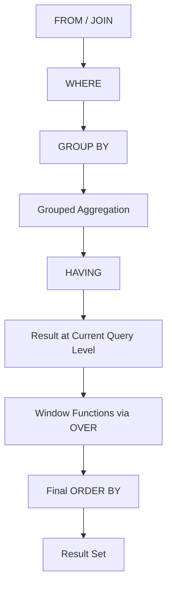

# 04- OVER Clause

## Overview

The `OVER` clause defines the window over which a window function performs its calculation. It is the mechanism that turns functions such as `SUM()`, `AVG()`, `COUNT()`, `ROW_NUMBER()`, `RANK()`, `LAG()`, and `LEAD()` into window functions.

The key idea is:

> **The `OVER` clause defines which rows a window function can see for the current result row.**

A window function normally preserves the result-set grain. Instead of collapsing rows like `GROUP BY`, it calculates a value for each row using a related set of rows.

```sql
SUM(amount) OVER (
    PARTITION BY customer_id
    ORDER BY created_at
)
```

The `OVER` clause can contain:

- No specification: `OVER ()`
- `PARTITION BY`
- `ORDER BY`
- A window frame such as `ROWS` or `RANGE`
- A named window defined using the `WINDOW` clause

Understanding these components is essential because small changes to the window definition can produce materially different results.

## Why the `OVER` Clause Exists

Consider an orders table:

```text
id | customer_id | amount
---+-------------+-------
1  | 101         | 100
2  | 101         | 250
3  | 102         | 400
4  | 102         | 150
```

A grouped aggregate:

```sql
SELECT
    customer_id,
    SUM(amount) AS customer_total
FROM orders
GROUP BY customer_id;
```

returns one row per customer.

A window aggregate:

```sql
SELECT
    id,
    customer_id,
    amount,
    SUM(amount) OVER (
        PARTITION BY customer_id
    ) AS customer_total
FROM orders;
```

returns:

```text
id | customer_id | amount | customer_total
---+-------------+--------+---------------
1  | 101         | 100    | 350
2  | 101         | 250    | 350
3  | 102         | 400    | 550
4  | 102         | 150    | 550
```

The `OVER` clause tells the database how to establish the set of rows used for each calculation while retaining the current row.

## Basic Syntax

The general structure is:

```sql
function(...) OVER (
    [PARTITION BY expression, ...]
    [ORDER BY expression [ASC | DESC], ...]
    [frame_clause]
)
```

For example:

```sql
SUM(amount) OVER (
    PARTITION BY customer_id
    ORDER BY created_at
    ROWS BETWEEN UNBOUNDED PRECEDING AND CURRENT ROW
)
```

The components serve different purposes:

| Component | Purpose |
|---|---|
| `OVER ()` | Use the relevant result rows as one window |
| `PARTITION BY` | Divide rows into independent groups |
| `ORDER BY` | Establish ordering within each window |
| Frame | Define the subset of the ordered partition used for the current row |

A critical distinction is that `PARTITION BY` and `ORDER BY` do not have the same role.

## `OVER ()`

An empty `OVER` clause creates a window over the rows visible at that query level without partitioning them into separate groups.

```sql
SELECT
    id,
    amount,
    SUM(amount) OVER () AS grand_total
FROM orders;
```

If the filtered query contains:

```text
id | amount
---+-------
1  | 100
2  | 250
3  | 400
4  | 150
```

each row receives:

```text
grand_total = 900
```

Result:

```text
id | amount | grand_total
---+--------+------------
1  | 100    | 900
2  | 250    | 900
3  | 400    | 900
4  | 150    | 900
```

This is useful for calculations such as:

- Percentage of total.
- Global averages.
- Global counts.
- Comparing a row against a global metric.

Example:

```sql
SELECT
    id,
    amount,
    ROUND(
        100.0 * amount / NULLIF(SUM(amount) OVER (), 0),
        2
    ) AS percentage_of_total
FROM orders;
```

## `PARTITION BY`

`PARTITION BY` divides the window into independent groups.

```sql
SELECT
    id,
    customer_id,
    amount,
    SUM(amount) OVER (
        PARTITION BY customer_id
    ) AS customer_total
FROM orders;
```

Conceptually:

```text
All rows
   │
   ├── customer_id = 101
   │       ├── order 1
   │       └── order 2
   │
   └── customer_id = 102
           ├── order 3
           └── order 4
```

Each partition is calculated independently.

Unlike `GROUP BY`, partitioning does not collapse the rows.

### Multiple Partition Columns

Partitions can be defined using multiple expressions:

```sql
SELECT
    employee_id,
    company_id,
    department_id,
    salary,
    AVG(salary) OVER (
        PARTITION BY company_id, department_id
    ) AS department_average
FROM employees;
```

This creates a partition for each unique `(company_id, department_id)` combination.

This is common in multi-tenant applications where analytical calculations must remain tenant-scoped.

## `ORDER BY` Inside `OVER`

The `ORDER BY` inside `OVER` establishes the logical ordering used by the window function.

```sql
SELECT
    id,
    customer_id,
    created_at,
    amount,
    ROW_NUMBER() OVER (
        PARTITION BY customer_id
        ORDER BY created_at
    ) AS order_number
FROM orders;
```

For each customer, orders are numbered chronologically.

The window ordering is different from the final query ordering.

```sql
ROW_NUMBER() OVER (
    PARTITION BY customer_id
    ORDER BY created_at
)
```

controls how `ROW_NUMBER()` determines positions.

This:

```sql
ORDER BY customer_id, created_at;
```

controls how the final result is displayed.

They are independent.

### Deterministic Ordering

If multiple rows can have the same ordering value, add a deterministic tie-breaker.

Prefer:

```sql
ROW_NUMBER() OVER (
    PARTITION BY customer_id
    ORDER BY created_at DESC, id DESC
)
```

over:

```sql
ROW_NUMBER() OVER (
    PARTITION BY customer_id
    ORDER BY created_at DESC
)
```

when `created_at` is not unique.

Without a deterministic tie-breaker, the database may assign different row numbers to tied rows across executions.

This matters for:

- Pagination.
- Deduplication.
- Top-N queries.
- "Latest record" selection.
- Reproducible API responses.

## Window Frame

A window frame defines the subset of an ordered partition considered for the current row.

For example:

```sql
SUM(amount) OVER (
    PARTITION BY account_id
    ORDER BY created_at, transaction_id
    ROWS BETWEEN UNBOUNDED PRECEDING AND CURRENT ROW
)
```

means:

> Start at the first row in the partition and include rows through the current row.

This produces a running total.

```text
Transaction 1 → Transaction 1
Transaction 2 → Transaction 1 + Transaction 2
Transaction 3 → Transaction 1 + Transaction 2 + Transaction 3
```

Common frame boundaries include:

| Frame expression | Meaning |
|---|---|
| `UNBOUNDED PRECEDING` | First row of the partition |
| `n PRECEDING` | Up to `n` rows before the current row |
| `CURRENT ROW` | Current row |
| `n FOLLOWING` | Up to `n` rows after the current row |
| `UNBOUNDED FOLLOWING` | Last row of the partition |

Example:

```sql
ROWS BETWEEN 6 PRECEDING AND CURRENT ROW
```

defines a seven-row frame when enough preceding rows exist.

## `ROWS` vs `RANGE`

`ROWS` and `RANGE` are not interchangeable.

### `ROWS`

`ROWS` operates using physical row positions in the window ordering.

```sql
SUM(amount) OVER (
    ORDER BY created_at
    ROWS BETWEEN UNBOUNDED PRECEDING AND CURRENT ROW
)
```

Each row has a frame based on its position.

### `RANGE`

`RANGE` considers the values of the ordering expression and can include peer rows with equivalent ordering values.

For example:

```sql
SUM(amount) OVER (
    ORDER BY created_at
    RANGE BETWEEN UNBOUNDED PRECEDING AND CURRENT ROW
)
```

If multiple rows share the same `created_at`, their frames can include all rows with that same ordering value.

This distinction becomes important for:

- Financial running totals.
- Event timestamps.
- Duplicate sort keys.
- Rolling calculations.
- Peer-aware analytics.

When exact row-by-row accumulation is required, `ROWS` is usually the safer explicit choice.

## Default Window Frames

One of the most common sources of subtle bugs is relying on an implicit frame.

The exact default depends on the database and window specification, but in common SQL implementations an ordered aggregate window may use a peer-aware frame equivalent to:

```sql
RANGE BETWEEN UNBOUNDED PRECEDING AND CURRENT ROW
```

rather than the row-by-row behavior developers sometimes expect.

For production SQL, make the frame explicit when its semantics matter:

```sql
SUM(amount) OVER (
    PARTITION BY account_id
    ORDER BY created_at, transaction_id
    ROWS BETWEEN UNBOUNDED PRECEDING AND CURRENT ROW
)
```

Do not rely on a default frame for critical financial, reporting, or time-series logic when the intended semantics are important.

## The Three-Level Mental Model

A useful way to reason about `OVER` is:

```text
Result rows
    │
    ▼
PARTITION BY
    │
    ▼
One logical partition
    │
    ▼
ORDER BY
    │
    ▼
Ordered partition
    │
    ▼
Frame
    │
    ▼
Rows visible to the function for this current row
```

For example:

```sql
SUM(amount) OVER (
    PARTITION BY customer_id
    ORDER BY created_at, id
    ROWS BETWEEN 2 PRECEDING AND CURRENT ROW
)
```

means:

1. Separate rows by `customer_id`.
2. Order each customer partition by `created_at, id`.
3. For each current row, consider the current row plus the two preceding rows.
4. Calculate `SUM(amount)` over that frame.

This mental model scales well from simple queries to complex analytical SQL.

## Window Functions Without `PARTITION BY`

Not every window function needs partitioning.

```sql
SELECT
    id,
    amount,
    ROW_NUMBER() OVER (
        ORDER BY amount DESC, id
    ) AS global_rank
FROM orders;
```

All rows belong to one window.

This is appropriate for global ranking.

By contrast:

```sql
ROW_NUMBER() OVER (
    PARTITION BY customer_id
    ORDER BY amount DESC, id
)
```

creates a separate ranking sequence for each customer.

## Window Functions Without `ORDER BY`

Some functions only need partition context.

For example:

```sql
COUNT(*) OVER (
    PARTITION BY customer_id
) AS customer_order_count
```

There is no ordering because the calculation is not sequence-dependent.

This is different from:

```sql
COUNT(*) OVER (
    PARTITION BY customer_id
    ORDER BY created_at
)
```

where ordering introduces sequence-dependent frame semantics for an aggregate window.

Do not add `ORDER BY` automatically. Use it when the calculation actually depends on order.

## Aggregate Windows

Aggregate functions can operate over windows:

```sql
SUM(amount) OVER (...)
AVG(amount) OVER (...)
COUNT(*) OVER (...)
MIN(amount) OVER (...)
MAX(amount) OVER (...)
```

Example:

```sql
SELECT
    id,
    customer_id,
    amount,
    AVG(amount) OVER (
        PARTITION BY customer_id
    ) AS customer_average
FROM orders;
```

This is useful when each row needs contextual aggregate information.

## Ranking Windows

Ranking functions depend heavily on the `OVER` definition.

```sql
ROW_NUMBER() OVER (
    PARTITION BY department_id
    ORDER BY salary DESC, employee_id
)
```

Other common ranking functions include:

```sql
RANK()
DENSE_RANK()
NTILE()
```

Their behavior differs when ties occur.

| Function | Ties | Example salaries | Result |
|---|---|---|---|
| `ROW_NUMBER()` | Always unique position | 100, 100, 90 | 1, 2, 3 |
| `RANK()` | Same rank, gaps after ties | 100, 100, 90 | 1, 1, 3 |
| `DENSE_RANK()` | Same rank, no gaps | 100, 100, 90 | 1, 1, 2 |

The `OVER` clause determines the population and ordering against which the ranking is calculated.

## Navigation Windows

Functions such as `LAG()` and `LEAD()` use the ordered window to navigate between rows.

```sql
SELECT
    id,
    customer_id,
    created_at,
    amount,
    LAG(amount) OVER (
        PARTITION BY customer_id
        ORDER BY created_at, id
    ) AS previous_amount
FROM orders;
```

The ordering is critical because "previous" has no meaning without an ordering definition.

This pattern supports:

- Previous event comparison.
- State transitions.
- Time-series deltas.
- Change detection.
- Customer behavior analysis.

## `OVER` and Query Processing

A useful logical model is:



This explains several important behaviors.

For example, a window function can operate over grouped results:

```sql
SELECT
    department_id,
    COUNT(*) AS employee_count,
    AVG(COUNT(*)) OVER () AS average_department_size
FROM employees
GROUP BY department_id;
```

The grouped query first produces one row per department. The window function then calculates across those department rows.

## Filtering Window Results

A window function cannot generally be referenced directly in the `WHERE` clause at the same query level.

This does not work:

```sql
SELECT
    id,
    customer_id,
    amount,
    ROW_NUMBER() OVER (
        PARTITION BY customer_id
        ORDER BY amount DESC
    ) AS rn
FROM orders
WHERE rn <= 3;
```

Use another query level:

```sql
WITH ranked_orders AS (
    SELECT
        id,
        customer_id,
        amount,
        ROW_NUMBER() OVER (
            PARTITION BY customer_id
            ORDER BY amount DESC, id
        ) AS rn
    FROM orders
)
SELECT
    id,
    customer_id,
    amount
FROM ranked_orders
WHERE rn <= 3;
```

This is a direct consequence of the logical processing model.

## Named Windows

When multiple expressions use the same window definition, a named window can improve consistency.

PostgreSQL supports:

```sql
SELECT
    employee_id,
    department_id,
    salary,
    AVG(salary) OVER department_window AS department_avg,
    RANK() OVER department_window AS salary_rank
FROM employees
WINDOW department_window AS (
    PARTITION BY department_id
    ORDER BY salary DESC
);
```

This avoids repeating:

```sql
PARTITION BY department_id
ORDER BY salary DESC
```

Named windows are especially useful in analytical queries containing many related calculations.

## Production Example: Customer Order Analytics

Suppose a backend API needs:

- Order amount.
- Customer lifetime total.
- Customer order number.
- Previous order amount.

A single query can express all four:

```sql
SELECT
    id,
    customer_id,
    created_at,
    amount,

    SUM(amount) OVER (
        PARTITION BY customer_id
    ) AS customer_total,

    ROW_NUMBER() OVER (
        PARTITION BY customer_id
        ORDER BY created_at, id
    ) AS customer_order_number,

    LAG(amount) OVER (
        PARTITION BY customer_id
        ORDER BY created_at, id
    ) AS previous_order_amount

FROM orders
WHERE status = 'completed';
```

The database performs the set-based analytical work while the backend receives row-level results ready for serialization.

This pattern is often preferable to loading all orders into Python and implementing grouping and sequencing in application code.

## Production Example: Top-N Per Group

A common REST API requirement is:

> Return the three highest-value orders for every customer.

Use:

```sql
WITH ranked_orders AS (
    SELECT
        id,
        customer_id,
        amount,
        created_at,
        ROW_NUMBER() OVER (
            PARTITION BY customer_id
            ORDER BY amount DESC, id DESC
        ) AS rn
    FROM orders
    WHERE status = 'completed'
)
SELECT
    id,
    customer_id,
    amount,
    created_at
FROM ranked_orders
WHERE rn <= 3
ORDER BY customer_id, amount DESC, id DESC;
```

The window definition is responsible for determining the ranking; the outer query filters the ranked result.

## Performance Considerations

Window functions can be computationally expensive, particularly when they require partitioning and ordering large datasets.

Potential costs include:

- Sorting.
- Memory consumption.
- Temporary disk usage.
- Processing large partitions.
- Increased CPU usage.
- Increased query latency.

For critical PostgreSQL queries, inspect the actual execution plan:

```sql
EXPLAIN (ANALYZE, BUFFERS)
SELECT
    ...
FROM ...;
```

Performance optimization should focus on the complete query, not merely the presence of `OVER`.

### Reduce Input Early

If only completed orders are relevant:

```sql
FROM orders
WHERE status = 'completed'
```

is generally preferable to calculating windows over all orders and filtering later.

The earlier unnecessary rows are eliminated, the less data the subsequent analytical operations may need to process.

### Avoid Accidental Partition Explosion

This:

```sql
PARTITION BY customer_id
```

can create extremely large partitions for high-volume customers.

In a multi-tenant system, verify:

- Maximum partition size.
- Data distribution.
- Query concurrency.
- Memory requirements.
- Expected execution time.

A logically correct query can still be operationally unsafe if one tenant or customer has extreme data volume.

## Indexing Considerations

An index can sometimes help the database obtain rows in a useful order, but window-function performance is query-plan dependent.

For:

```sql
PARTITION BY customer_id
ORDER BY created_at, id
```

an index such as:

```sql
CREATE INDEX idx_orders_customer_created_id
ON orders (customer_id, created_at, id);
```

may be useful depending on filters, table size, and the complete execution plan.

Do not create indexes solely because the columns appear in `OVER`.

Indexes also impose:

- Additional storage.
- Write overhead.
- Vacuum/maintenance work.
- More complex query planning.

Validate with realistic data and `EXPLAIN (ANALYZE, BUFFERS)`.

## Common Mistakes

### Confusing Window `ORDER BY` with Final `ORDER BY`

This:

```sql
ROW_NUMBER() OVER (
    ORDER BY amount DESC
)
```

does not guarantee final result ordering.

If the output must be sorted:

```sql
ORDER BY amount DESC;
```

must be specified separately.

### Omitting a Tie-Breaker

Avoid nondeterministic ranking:

```sql
ROW_NUMBER() OVER (
    ORDER BY created_at DESC
)
```

when timestamps are not unique.

Prefer:

```sql
ROW_NUMBER() OVER (
    ORDER BY created_at DESC, id DESC
)
```

### Using `RANGE` When `ROWS` Is Required

A peer-aware frame can produce unexpected results when multiple rows share the same ordering value.

For exact row-by-row running totals, make the semantics explicit:

```sql
ROWS BETWEEN UNBOUNDED PRECEDING AND CURRENT ROW
```

### Assuming `PARTITION BY` Means `GROUP BY`

`PARTITION BY` does not collapse rows.

```sql
COUNT(*) OVER (
    PARTITION BY customer_id
)
```

still returns one row for each input row.

### Filtering Too Late

If a window calculation only needs completed orders, avoid processing irrelevant records:

```sql
WHERE status = 'completed'
```

should generally be applied before the window calculation.

### Applying Multiple Incompatible Windows

Consider:

```sql
SUM(amount) OVER (
    PARTITION BY customer_id
    ORDER BY created_at
)
```

and:

```sql
SUM(amount) OVER (
    PARTITION BY region
    ORDER BY amount
)
```

These may require different partitioning and ordering operations.

Do not assume multiple window expressions are free merely because they appear in the same `SELECT`.

## Interview Traps

### Does `PARTITION BY` Reduce Rows?

No.

`GROUP BY` changes result-set cardinality. `PARTITION BY` defines independent windows while preserving rows.

### Does `OVER (ORDER BY ...)` Sort the Final Result?

No.

The `ORDER BY` inside `OVER` controls window computation. The outer `ORDER BY` controls result presentation.

### Can a Window Function Be Used Directly in `WHERE`?

Generally no at the same query level. Use a subquery or CTE to create another query level.

### Is `SUM(x) OVER ()` Equivalent to `SUM(x)`?

No.

```sql
SUM(x)
```

is an aggregate that normally produces a grouped result when used with grouping semantics.

```sql
SUM(x) OVER ()
```

is a window aggregate that preserves the rows of the current query level.

### Does Adding `ORDER BY` Always Mean a Running Total?

No.

The frame semantics matter.

For production code, explicitly define the intended frame when the distinction affects correctness.

## Backend Engineering Guidance

For Django, FastAPI, or other backend services, prefer window functions when the database can efficiently perform the required set-based analytical operation.

Typical use cases include:

| Backend requirement | Window pattern |
|---|---|
| Top N records per tenant | `ROW_NUMBER()` |
| Customer lifetime total on each order | `SUM() OVER (PARTITION BY ...)` |
| Previous event | `LAG()` |
| Next event | `LEAD()` |
| Running account balance | `SUM() OVER (... ORDER BY ...)` |
| Global percentage | `SUM() OVER ()` |
| Department ranking | `RANK()` / `DENSE_RANK()` |
| Rolling metric | Explicit frame |

Keep the SQL responsible for relational calculations rather than transferring large datasets to Python merely to reproduce operations that the database can execute efficiently.

At the same time, do not move arbitrary business logic into complex SQL solely because it is possible. Evaluate:

- Query readability.
- Execution cost.
- Testability.
- Database load.
- API latency.
- Maintainability.
- Whether the calculation belongs in the database layer.

## Production Checklist

Before shipping a query containing `OVER`:

- [ ] Define the intended result-set grain.
- [ ] Identify whether partitioning is required.
- [ ] Define deterministic window ordering where row position matters.
- [ ] Verify `ROWS` versus `RANGE` semantics.
- [ ] Make critical frame definitions explicit.
- [ ] Confirm that window ordering is separate from final result ordering.
- [ ] Filter unnecessary input rows before expensive window processing.
- [ ] Check for accidental row multiplication caused by joins.
- [ ] Inspect partition cardinality and data skew.
- [ ] Run `EXPLAIN (ANALYZE, BUFFERS)` for performance-sensitive queries.
- [ ] Test with production-scale data.
- [ ] Ensure application code does not unnecessarily duplicate database-side analytical work.

## Key Takeaways

- **The `OVER` clause defines the window context in which a window function evaluates each result row.**
- **`PARTITION BY` creates independent logical groups, while `ORDER BY` establishes sequence and frame semantics; neither should be confused with the final query `ORDER BY`.**
- **Window frames such as `ROWS BETWEEN ...` are critical for running and rolling calculations, and explicit frames avoid subtle default-frame behavior.**
- **Window functions preserve rows, making them ideal for rankings, row-to-row comparisons, running totals, and adding group-level context to row-level API results.**
- **For production queries, make ordering and frame semantics deterministic, control partition size, and validate performance with realistic data and execution plans.**