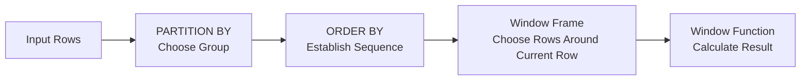

# 08- Window Frames Introduction

## Overview

A **window frame** defines the subset of rows within a window partition that a window function uses for the calculation of the current row.

A window definition can contain three distinct concepts:

```sql
function(...) OVER (
    PARTITION BY ...
    ORDER BY ...
    frame
)
```

| Component | Defines |
|---|---|
| `PARTITION BY` | Which rows belong to the same logical group |
| `ORDER BY` | The logical sequence of rows within that group |
| Window frame | Which portion of that ordered group is used for the current calculation |

For example:

```sql
SUM(amount) OVER (
    PARTITION BY customer_id
    ORDER BY created_at, order_id
    ROWS BETWEEN UNBOUNDED PRECEDING AND CURRENT ROW
)
```

This means:

> For each order, calculate the sum of the customer's orders from the first order through the current order.

Window frames are particularly important for:

- Running totals
- Moving averages
- Rolling metrics
- Cumulative counts
- Previous/next row analysis
- Time-series calculations
- Sliding-window analytics

The critical mental model is:

> **`PARTITION BY` chooses the population, `ORDER BY` establishes the sequence, and the frame chooses the rows used for the current calculation.**

## Why Window Frames Exist

Without a frame, some window calculations would have no precise way to express a changing subset of rows.

Consider a customer's transaction history:

```text
transaction | amount
------------+-------
T1          | 100
T2          | 200
T3          | 150
T4          | 300
```

A running total requires a different set of rows for each transaction:

```text
T1 → [T1]
T2 → [T1, T2]
T3 → [T1, T2, T3]
T4 → [T1, T2, T3, T4]
```

A frame expresses this directly:

```sql
ROWS BETWEEN UNBOUNDED PRECEDING AND CURRENT ROW
```

A moving three-row calculation can use:

```sql
ROWS BETWEEN 2 PRECEDING AND CURRENT ROW
```

For:

```text
T1 → [T1]
T2 → [T1, T2]
T3 → [T1, T2, T3]
T4 → [T2, T3, T4]
```

This makes window frames a core tool for analytical queries without requiring self-joins or procedural application code.

## Frame Mental Model

Think about a window query as a three-stage operation:



For a particular current row:

```text
Partition
┌─────────────────────────────────────────────┐
│ Row 1 │ Row 2 │ Row 3 │ Row 4 │ Row 5 │ Row 6 │
│       │       │       │  ↑    │       │       │
└─────────────────────────────────────────────┘
                  Current Row

Frame:
             ┌────────────────────┐
             │ Row 2 │ Row 3 │ Row 4 │
             └────────────────────┘
```

The frame is evaluated relative to the current row.

This is why the same window definition can produce a different calculation for every row.

## Basic Syntax

The general syntax is:

```sql
function(...) OVER (
    PARTITION BY partition_columns
    ORDER BY ordering_columns
    frame_specification
)
```

A frame specification commonly looks like:

```sql
ROWS BETWEEN start AND end
```

For example:

```sql
ROWS BETWEEN 2 PRECEDING AND CURRENT ROW
```

Other frame units include:

```sql
ROWS
RANGE
GROUPS
```

The three units have different semantics and should not be treated as interchangeable.

## Frame Boundaries

Common frame boundaries include:

| Boundary | Meaning |
|---|---|
| `UNBOUNDED PRECEDING` | Start of the partition |
| `n PRECEDING` | `n` rows/groups/value range before the current position, depending on frame unit |
| `CURRENT ROW` | Current position, interpreted according to the frame unit |
| `n FOLLOWING` | `n` rows/groups/value range after the current position |
| `UNBOUNDED FOLLOWING` | End of the partition |

Examples:

```sql
ROWS BETWEEN UNBOUNDED PRECEDING AND CURRENT ROW
```

Running calculation from the partition beginning through the current row.

```sql
ROWS BETWEEN 2 PRECEDING AND CURRENT ROW
```

Current row plus the previous two rows.

```sql
ROWS BETWEEN CURRENT ROW AND UNBOUNDED FOLLOWING
```

Current row through the end of the partition.

```sql
ROWS BETWEEN UNBOUNDED PRECEDING AND UNBOUNDED FOLLOWING
```

The entire partition.

## Running Totals

Running totals are one of the most common frame-based patterns.

```sql
SELECT
    customer_id,
    order_id,
    created_at,
    amount,
    SUM(amount) OVER (
        PARTITION BY customer_id
        ORDER BY created_at, order_id
        ROWS BETWEEN UNBOUNDED PRECEDING AND CURRENT ROW
    ) AS running_total
FROM orders;
```

For a customer with:

```text
Order | Amount
------+-------
101   | 100
102   | 200
103   | 150
```

the result is:

```text
Order | Amount | Running Total
------+--------+--------------
101   | 100    | 100
102   | 200    | 300
103   | 150    | 450
```

The explicit `ROWS` frame is valuable because it makes the intended row-by-row behavior clear.

## Moving Windows

A moving window considers a bounded number of rows around the current row.

For a three-row moving average:

```sql
SELECT
    order_id,
    created_at,
    amount,
    AVG(amount) OVER (
        ORDER BY created_at, order_id
        ROWS BETWEEN 2 PRECEDING AND CURRENT ROW
    ) AS moving_average
FROM orders;
```

Conceptually:

```text
Row 1 → [1]
Row 2 → [1, 2]
Row 3 → [1, 2, 3]
Row 4 → [2, 3, 4]
Row 5 → [3, 4, 5]
```

At the beginning of a partition, fewer rows are available than the requested frame size. SQL does not invent missing rows; the frame simply contains the rows that exist.

## Centered Windows

A frame can include rows both before and after the current row.

```sql
AVG(amount) OVER (
    ORDER BY created_at, order_id
    ROWS BETWEEN 2 PRECEDING AND 2 FOLLOWING
)
```

For a current row:

```text
[previous 2] [current] [next 2]
```

This is useful for smoothing or analyzing time-series data.

However, centered windows require future rows relative to the current row, which can affect streaming-style processing and may require additional buffering in the database execution plan.

## Entire-Partition Frames

A frame can cover the entire partition:

```sql
SUM(amount) OVER (
    PARTITION BY customer_id
    ROWS BETWEEN UNBOUNDED PRECEDING
         AND UNBOUNDED FOLLOWING
)
```

This produces the customer's total on every customer row.

Example:

```text
customer_id | amount | customer_total
------------+--------+---------------
10          | 100    | 450
10          | 200    | 450
10          | 150    | 450
```

This differs from a running total because the frame does not stop at the current row.

## Frame vs Partition

These concepts are related but not interchangeable.

Suppose:

```sql
SUM(amount) OVER (
    PARTITION BY customer_id
    ORDER BY created_at
    ROWS BETWEEN 2 PRECEDING AND CURRENT ROW
)
```

For every row:

1. `PARTITION BY customer_id` selects the customer's rows.
2. `ORDER BY created_at` establishes their sequence.
3. The frame selects at most the current row plus the two preceding rows.
4. `SUM()` operates on those frame rows.

```text
All orders
     │
     ├── Customer A partition
     │      ├── A1
     │      ├── A2
     │      ├── A3 ← current
     │      └── A4
     │
     └── Customer B partition
            ├── B1
            └── B2

For A3:
frame = [A1, A2, A3]
```

The frame never crosses a partition boundary.

## `ROWS`

`ROWS` defines the frame in terms of physical rows in the window ordering.

```sql
ROWS BETWEEN 2 PRECEDING AND CURRENT ROW
```

means:

> Include the current row and up to two preceding rows in the ordered partition.

This is often the safest choice when the business requirement is explicitly row-based.

For example:

```sql
SUM(amount) OVER (
    PARTITION BY account_id
    ORDER BY transaction_time, transaction_id
    ROWS BETWEEN 2 PRECEDING AND CURRENT ROW
)
```

Using `transaction_id` as a tie-breaker makes the row sequence deterministic when multiple transactions have the same timestamp.

## `RANGE`

`RANGE` uses the values of the window's `ORDER BY` expression rather than simply counting physical rows.

This distinction becomes important when multiple rows have the same ordering value.

For example:

```sql
SUM(amount) OVER (
    ORDER BY transaction_date
    RANGE BETWEEN UNBOUNDED PRECEDING AND CURRENT ROW
)
```

Rows that are peers according to the ordering can belong to the same frame boundary.

This means `RANGE` can produce different results from `ROWS` when there are duplicate ordering values.

For example:

```text
date        amount
----------  ------
2026-01-01  100
2026-01-01  200
2026-01-02  150
```

With a `RANGE` frame ending at `CURRENT ROW`, both `2026-01-01` rows can be included when the current ordering value is `2026-01-01`.

With:

```sql
ROWS BETWEEN UNBOUNDED PRECEDING AND CURRENT ROW
```

the frame progresses row by row according to the complete ordering.

## `GROUPS`

`GROUPS` advances by peer groups rather than individual rows.

Rows are peers when they have equal values for the window `ORDER BY` expressions.

For example:

```sql
SUM(amount) OVER (
    ORDER BY transaction_date
    GROUPS BETWEEN 1 PRECEDING AND CURRENT ROW
)
```

means the frame includes the current peer group and one preceding peer group.

This can be useful when the business requirement is expressed in terms of ordered groups rather than physical rows.

`GROUPS` is particularly valuable when duplicate ordering values have semantic meaning.

## `ROWS`, `RANGE`, and `GROUPS`

| Frame unit | Moves by | Important behavior |
|---|---|---|
| `ROWS` | Individual rows | Exact row offsets |
| `RANGE` | Ordering-value ranges / peer-aware boundaries | Equal ordering values can share frame boundaries |
| `GROUPS` | Peer groups | Moves one group at a time |

When the requirement says:

- "previous two rows" → use `ROWS`
- "all rows up to this value" → consider `RANGE`
- "previous peer group" → consider `GROUPS`

Do not select the frame type merely because it is syntactically available. Match it to the business semantics.

## Why Deterministic Ordering Matters

Consider:

```sql
SUM(amount) OVER (
    ORDER BY created_at
    ROWS BETWEEN UNBOUNDED PRECEDING AND CURRENT ROW
)
```

If several rows have the same `created_at`, their relative order may not be defined by that expression alone.

For row-sensitive calculations, use a deterministic ordering:

```sql
SUM(amount) OVER (
    ORDER BY created_at, transaction_id
    ROWS BETWEEN UNBOUNDED PRECEDING AND CURRENT ROW
)
```

This matters for:

- Running totals
- `ROW_NUMBER()`
- `LAG()`
- `LEAD()`
- `FIRST_VALUE()`
- `LAST_VALUE()`
- Row-based moving calculations

A timestamp alone is often not a sufficient ordering key in production systems.

## Default Frames

When a frame is omitted, the database applies the default frame rules associated with the window definition and function semantics.

This is an important production and interview trap:

> **Do not assume that omitting the frame means "all rows in the partition."**

For example:

```sql
SUM(amount) OVER (
    PARTITION BY customer_id
    ORDER BY created_at
)
```

is not semantically identical to explicitly requesting:

```sql
SUM(amount) OVER (
    PARTITION BY customer_id
    ORDER BY created_at
    ROWS BETWEEN UNBOUNDED PRECEDING AND UNBOUNDED FOLLOWING
)
```

The presence of `ORDER BY` can make the default frame a current-position-oriented frame rather than the entire partition.

When frame semantics matter, specify the frame explicitly.

## `LAST_VALUE()` and Frame Surprises

`LAST_VALUE()` is a classic example of why understanding frames matters.

Consider:

```sql
SELECT
    order_id,
    created_at,
    amount,
    LAST_VALUE(amount) OVER (
        PARTITION BY customer_id
        ORDER BY created_at, order_id
    ) AS last_amount
FROM orders;
```

A developer may expect `last_amount` to mean the customer's final amount.

But with a frame ending at the current row, `LAST_VALUE()` can return the current row's value rather than the final row of the partition.

To obtain the last value from the entire partition:

```sql
LAST_VALUE(amount) OVER (
    PARTITION BY customer_id
    ORDER BY created_at, order_id
    ROWS BETWEEN UNBOUNDED PRECEDING
         AND UNBOUNDED FOLLOWING
)
```

This is a high-value interview and production concept.

## Frame and Navigation Functions

Not every window function uses frames in the same way.

Functions such as:

- `ROW_NUMBER()`
- `RANK()`
- `DENSE_RANK()`
- `LAG()`
- `LEAD()`

are primarily driven by partitioning and ordering.

Aggregate window functions such as:

- `SUM()`
- `AVG()`
- `MIN()`
- `MAX()`
- `COUNT()`

commonly depend directly on the frame.

Functions such as `FIRST_VALUE()` and `LAST_VALUE()` can also make frame boundaries critical.

A senior engineer should therefore ask:

> "Does this particular function actually use the frame semantics I am changing?"

## Practical Backend Example

Suppose an API needs to return a customer's orders along with:

- Order amount
- Running spend
- Three-order moving average

A PostgreSQL query can calculate all three in one query:

```sql
SELECT
    order_id,
    customer_id,
    created_at,
    amount,

    SUM(amount) OVER (
        PARTITION BY customer_id
        ORDER BY created_at, order_id
        ROWS BETWEEN UNBOUNDED PRECEDING AND CURRENT ROW
    ) AS running_spend,

    AVG(amount) OVER (
        PARTITION BY customer_id
        ORDER BY created_at, order_id
        ROWS BETWEEN 2 PRECEDING AND CURRENT ROW
    ) AS moving_average

FROM orders
WHERE customer_id = $1
ORDER BY created_at, order_id;
```

A Django or FastAPI service can execute this query through its database layer and return the computed fields without calculating the metrics in Python.

This keeps set-based analytical work in PostgreSQL and avoids:

- Fetching unnecessary rows into application memory.
- Maintaining custom running-total logic in Python.
- Multiple database round trips.
- Divergent calculation logic across services.

## Time-Based Windows

A subtle but important distinction exists between:

> "Previous 3 rows"

and:

> "Previous 3 days."

These are not equivalent.

A row-based window:

```sql
ROWS BETWEEN 2 PRECEDING AND CURRENT ROW
```

depends on row position.

A time-based requirement depends on the values of the ordering column and may require a value-based `RANGE` frame or a different query design depending on the database and data type.

For example, if events are irregular:

```text
Jan 1
Jan 2
Jan 20
Jan 21
```

the previous three rows cover a very different time span than a three-day window.

Always translate the business requirement into precise frame semantics before choosing the SQL syntax.

## Performance Considerations

Window functions can require the database to organize rows according to the window's partition and ordering requirements.

Potential costs include:

- Sorting large datasets.
- Maintaining partition state.
- Temporary disk usage when memory is insufficient.
- Processing large partitions.
- Multiple sorts for incompatible window definitions.

For production workloads:

```sql
EXPLAIN (ANALYZE, BUFFERS)
SELECT
    customer_id,
    created_at,
    amount,
    SUM(amount) OVER (
        PARTITION BY customer_id
        ORDER BY created_at, order_id
        ROWS BETWEEN UNBOUNDED PRECEDING AND CURRENT ROW
    )
FROM orders;
```

Inspect the actual execution plan rather than assuming an index completely eliminates window-processing cost.

Useful practices include:

- Filter unnecessary rows before the window when semantically valid.
- Avoid unnecessarily large partitions.
- Keep window definitions consistent when multiple calculations can share sorting work.
- Add deterministic tie-breakers.
- Test with production-scale data.
- Monitor sort and temporary-file behavior for large analytical queries.

## Common Mistakes

### Treating `ROWS` and `RANGE` as Equivalent

They can produce different results when ordering values are duplicated.

Choose based on whether the requirement is row-based or value/peer-based.

### Omitting the Frame for Critical Calculations

Default frame behavior can be surprising, particularly with ordered windows.

For business-critical running or full-partition calculations, make the frame explicit.

### Using a Timestamp Without a Tie-Breaker

This can make row-sensitive calculations ambiguous.

Prefer:

```sql
ORDER BY created_at, event_id
```

when `event_id` uniquely identifies the event.

### Confusing Rows With Time

"Previous 7 rows" is not "previous 7 days."

Choose frame semantics based on the actual business requirement.

### Assuming `LAST_VALUE()` Means Final Partition Value

It depends on the frame.

If the frame ends at the current row, `LAST_VALUE()` can return the current row's value.

### Building Windows Over the Wrong Grain

If a join changes one order into several order-item rows, a row-based frame will operate on those order-item rows.

Validate the query's row grain before designing the frame.

## Production Checklist

Before shipping a frame-based query:

- [ ] Is the required partition correct?
- [ ] Is the window ordering deterministic?
- [ ] Does the requirement describe rows, values, or peer groups?
- [ ] Should the frame include the current row?
- [ ] Should it include preceding rows?
- [ ] Should it include following rows?
- [ ] Is an explicit frame preferable to relying on defaults?
- [ ] Are duplicate ordering values possible?
- [ ] Is the query operating at the intended row grain?
- [ ] Could the partition become very large?
- [ ] Has the query been tested with realistic data volume?
- [ ] Has `EXPLAIN (ANALYZE, BUFFERS)` been inspected for performance-sensitive workloads?

## Interview Traps

| Question | Correct mental model |
|---|---|
| What does a window frame define? | The subset of rows considered for the current window calculation. |
| Does `PARTITION BY` define the frame? | No. It defines the partition; the frame selects rows within that partition. |
| Does `ORDER BY` define the final result order? | No. The `ORDER BY` inside `OVER` defines the window sequence. |
| What is `ROWS BETWEEN 2 PRECEDING AND CURRENT ROW`? | Current row plus up to two preceding rows. |
| Are `ROWS` and `RANGE` interchangeable? | No. They use different frame semantics. |
| Why can `LAST_VALUE()` return the current row? | The frame may end at the current row. |
| Why add a unique tie-breaker? | To make row-sensitive ordering deterministic. |
| Is a three-row window the same as a three-day window? | No. One is row-based; the other is time/value-based. |
| Should critical queries rely on implicit default frames? | Usually no; specify the intended frame explicitly when semantics matter. |

## Key Takeaways

- **A window frame selects the rows used for the current calculation inside a partition; `PARTITION BY` chooses the population and `ORDER BY` establishes its sequence.**
- **Use `ROWS`, `RANGE`, or `GROUPS` according to whether the requirement is based on physical rows, ordering values, or peer groups.**
- **Explicit frame definitions prevent subtle bugs, especially with running totals, `LAST_VALUE()`, duplicate ordering values, and full-partition calculations.**
- **Deterministic ordering and correct query grain are essential for reliable production window calculations.**
- **Window-frame performance depends on partition size, ordering, and execution strategy; validate expensive queries with realistic data and `EXPLAIN (ANALYZE, BUFFERS)`.**