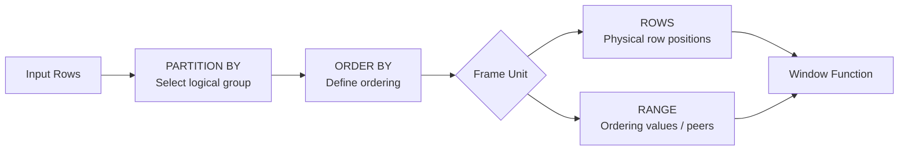

# 09- ROWS vs RANGE

## Overview

`ROWS` and `RANGE` are window-frame units that determine how a window frame is constructed around the current row.

They can look interchangeable in simple queries, but they represent different business semantics:

- `ROWS` is **position-based**.
- `RANGE` is **value-based and peer-aware**.

The distinction becomes critical when the window `ORDER BY` contains duplicate values.

Consider:

```text
date        amount
----------  ------
2026-01-01  100
2026-01-01  200
2026-01-02  150
2026-01-03  300
```

With:

```sql
ROWS BETWEEN UNBOUNDED PRECEDING AND CURRENT ROW
```

the calculation advances one physical row at a time.

With a default/current-row `RANGE` frame, rows sharing the same ordering value can belong to the same frame.

A useful mental model is:

> **`ROWS` asks "which row positions?" while `RANGE` asks "which ordering values?"**

This distinction affects running totals, cumulative metrics, financial calculations, time-series analytics, and any production query where duplicate ordering values are possible.

## Why the Distinction Matters

Suppose a reporting API calculates cumulative transaction volume:

```sql
SUM(amount) OVER (
    ORDER BY transaction_date
)
```

If multiple transactions occur on the same date, the result depends on the frame semantics.

A row-based calculation might produce:

```text
date        amount   cumulative
----------  -------  ----------
2026-01-01  100      100
2026-01-01  200      300
2026-01-02  150      450
```

A peer-aware `RANGE` calculation can produce:

```text
date        amount   cumulative
----------  -------  ----------
2026-01-01  100      300
2026-01-01  200      300
2026-01-02  150      450
```

The second result treats both `2026-01-01` rows as peers because they have the same ordering value.

Neither behavior is universally correct.

The correct choice depends on whether the requirement is:

- "after each transaction" → `ROWS`
- "as of each date" → `RANGE`

## Window Frame Mental Model

A window query can be understood as a sequence of narrowing decisions:



For a particular current row, the database evaluates the frame according to the selected unit.

```text
Partition
┌───────────────────────────────────────────────┐
│ R1 │ R2 │ R3 │ R4 │ R5 │ R6 │
│    │    │ ↑ current row │    │
└───────────────────────────────────────────────┘

ROWS:
frame boundaries are based on row positions.

RANGE:
frame boundaries are based on ORDER BY values.
```

The difference is especially visible when multiple rows have identical ordering values.

## `ROWS`

### What It Is

`ROWS` defines frame boundaries using physical row positions in the ordered partition.

```sql
ROWS BETWEEN 2 PRECEDING AND CURRENT ROW
```

means:

> Include the current row and up to two preceding rows.

For example:

```sql
SELECT
    order_id,
    created_at,
    amount,
    SUM(amount) OVER (
        ORDER BY created_at, order_id
        ROWS BETWEEN 2 PRECEDING AND CURRENT ROW
    ) AS rolling_total
FROM orders;
```

The frame progresses like:

```text
Row 1 → [1]
Row 2 → [1, 2]
Row 3 → [1, 2, 3]
Row 4 → [2, 3, 4]
Row 5 → [3, 4, 5]
```

### Why It Exists

`ROWS` is useful when the business rule is explicitly about row positions.

Typical requirements include:

- Previous 3 transactions
- Current row plus previous 7 records
- Last 10 observations
- Running total by event sequence
- Moving average over the previous N records

### When to Use It

Prefer `ROWS` when the requirement contains language such as:

- "previous N rows"
- "next N rows"
- "last N records"
- "current row plus previous rows"
- "transaction sequence"

### Advantages

- Explicit row-position semantics.
- Easy to reason about.
- Appropriate for event and sequence processing.
- Avoids peer-group expansion caused by duplicate ordering values.
- Works naturally with deterministic ordering keys.

### Limitations

`ROWS` does not represent a time interval.

For example:

```sql
ROWS BETWEEN 6 PRECEDING AND CURRENT ROW
```

means seven rows, not seven days.

If events arrive irregularly:

```text
Jan 1
Jan 2
Jan 20
Jan 21
```

the previous six rows could represent weeks or months of data.

## `RANGE`

### What It Is

`RANGE` defines frame boundaries based on the values of the window's `ORDER BY` expression.

It is also peer-aware: rows with equivalent ordering values can share the same frame boundary.

For example:

```sql
SUM(amount) OVER (
    ORDER BY transaction_date
    RANGE BETWEEN UNBOUNDED PRECEDING AND CURRENT ROW
)
```

conceptually means:

> Include all rows whose ordering value is at or before the current ordering value.

With:

```text
date        amount
----------  ------
2026-01-01  100
2026-01-01  200
2026-01-02  150
```

both `2026-01-01` rows are peers.

For the `2026-01-01` rows, the frame includes both rows:

```text
Current ordering value = 2026-01-01

Frame:
[100, 200]
```

Therefore both rows can receive the same cumulative total.

### Why It Exists

`RANGE` is useful when the business meaning is tied to an ordering value rather than a physical row.

Typical examples include:

- Cumulative totals by date.
- Metrics "as of" a timestamp/value.
- Peer-aware calculations.
- Value-based windows.
- Certain time-oriented analytical calculations.

### When to Use It

Consider `RANGE` when the requirement sounds like:

- "all transactions up to this date"
- "all events up to this timestamp"
- "same price level and earlier"
- "all rows with an ordering value within a specified range"

The exact syntax and supported frame expressions vary across SQL implementations, so verify the target database's behavior for advanced `RANGE` boundaries.

### Advantages

- Expresses value-based semantics.
- Naturally handles peer rows.
- Useful for cumulative "as of" calculations.
- Can express value-oriented boundaries that `ROWS` cannot represent.

### Limitations

- More subtle than `ROWS`.
- Duplicate ordering values can produce results that surprise developers expecting row-by-row progression.
- Advanced offset-based `RANGE` syntax has database-specific restrictions.
- Numeric/date/time ordering semantics need careful validation.

## Direct Comparison

| Property | `ROWS` | `RANGE` |
|---|---|---|
| Frame basis | Physical row position | `ORDER BY` value |
| Peer-aware | No | Yes |
| Duplicate ordering values | Rows progress individually | Peers can share frame boundaries |
| "Previous 3 records" | Correct | Incorrect semantic choice |
| "All values up to current date" | Usually not the intended model | Natural fit |
| Deterministic tie-breaker | Often important | Depends on desired peer semantics |
| Easy to reason about | Usually | Requires more care |
| Typical use | Event/record windows | Value/time-oriented analytics |

## The Most Important Difference: Duplicate Ordering Values

Consider:

```sql
CREATE TABLE transactions (
    transaction_id bigint PRIMARY KEY,
    transaction_date date NOT NULL,
    amount numeric(12, 2) NOT NULL
);
```

Data:

```text
transaction_id | transaction_date | amount
---------------+------------------+-------
1              | 2026-01-01       | 100
2              | 2026-01-01       | 200
3              | 2026-01-02       | 150
4              | 2026-01-03       | 300
```

### Using `ROWS`

```sql
SELECT
    transaction_id,
    transaction_date,
    amount,
    SUM(amount) OVER (
        ORDER BY transaction_date, transaction_id
        ROWS BETWEEN UNBOUNDED PRECEDING AND CURRENT ROW
    ) AS cumulative_amount
FROM transactions
ORDER BY transaction_date, transaction_id;
```

Result:

```text
transaction_id | amount | cumulative_amount
---------------+--------+------------------
1              | 100    | 100
2              | 200    | 300
3              | 150    | 450
4              | 300    | 750
```

Each row extends the frame.

### Using `RANGE`

If the ordering is only:

```sql
ORDER BY transaction_date
```

then the two January 1 rows are peers.

A cumulative `RANGE` calculation can therefore produce:

```text
transaction_id | date       | amount | cumulative
---------------+------------+--------+-----------
1              | 2026-01-01 | 100    | 300
2              | 2026-01-01 | 200    | 300
3              | 2026-01-02 | 150    | 450
4              | 2026-01-03 | 300    | 750
```

This is often exactly what is wanted for daily reporting.

## `ROWS` for Transaction-Level Metrics

Suppose an account has an ordered stream of transactions and the requirement is:

> Calculate the balance after every transaction.

Use a row-based frame:

```sql
SELECT
    transaction_id,
    account_id,
    transaction_time,
    amount,
    SUM(amount) OVER (
        PARTITION BY account_id
        ORDER BY transaction_time, transaction_id
        ROWS BETWEEN UNBOUNDED PRECEDING AND CURRENT ROW
    ) AS running_balance
FROM transactions;
```

The unique `transaction_id` makes the sequence deterministic when transactions share the same timestamp.

This is generally a better fit than relying on peer-aware `RANGE` semantics because the business requirement is transaction-by-transaction.

## `RANGE` for Date-Level Metrics

Suppose the requirement is:

> Show cumulative revenue as of each transaction date.

A peer-aware range can be appropriate:

```sql
SELECT
    transaction_date,
    transaction_id,
    amount,
    SUM(amount) OVER (
        ORDER BY transaction_date
        RANGE BETWEEN UNBOUNDED PRECEDING AND CURRENT ROW
    ) AS revenue_as_of_date
FROM transactions;
```

All transactions on the same date can receive the same "revenue as of date" value.

This is semantically different from a transaction-level running total.

## Running Total: `ROWS` vs `RANGE`

Consider:

```sql
SELECT
    transaction_date,
    transaction_id,
    amount,

    SUM(amount) OVER (
        ORDER BY transaction_date, transaction_id
        ROWS BETWEEN UNBOUNDED PRECEDING AND CURRENT ROW
    ) AS row_running_total,

    SUM(amount) OVER (
        ORDER BY transaction_date
        RANGE BETWEEN UNBOUNDED PRECEDING AND CURRENT ROW
    ) AS date_running_total

FROM transactions
ORDER BY transaction_date, transaction_id;
```

The two columns answer different questions:

| Column | Question |
|---|---|
| `row_running_total` | What is the cumulative amount after this transaction? |
| `date_running_total` | What is the cumulative amount through this transaction's date? |

This distinction is valuable when designing reporting APIs because the API contract should specify the metric's grain.

## `ORDER BY` Changes the Meaning

The ordering expression determines what `RANGE` considers a peer.

Compare:

```sql
ORDER BY transaction_date
```

with:

```sql
ORDER BY transaction_date, transaction_id
```

The peer definition changes because peer rows are determined from the ordering expressions.

If the requirement is:

> Treat every transaction on the same date as a group.

then adding `transaction_id` to the `ORDER BY` may defeat that peer grouping.

Therefore:

> **Do not add a tie-breaker automatically when using `RANGE`. Add it when deterministic row ordering is required and when doing so matches the intended semantics.**

This differs from `ROWS`, where a unique tie-breaker is often desirable.

## `ROWS` and Deterministic Ordering

For row-sensitive calculations, this is usually safer:

```sql
ORDER BY transaction_time, transaction_id
```

rather than:

```sql
ORDER BY transaction_time
```

If two rows have identical timestamps, `transaction_id` establishes a deterministic order.

Example:

```sql
SUM(amount) OVER (
    PARTITION BY account_id
    ORDER BY transaction_time, transaction_id
    ROWS BETWEEN UNBOUNDED PRECEDING AND CURRENT ROW
)
```

Without a deterministic ordering key, the database may have freedom in how peer rows are physically ordered, which can make row-position-based calculations unsuitable for stable application behavior.

## Time-Based Windows

One of the most common mistakes is assuming:

```sql
ROWS BETWEEN 6 PRECEDING AND CURRENT ROW
```

means "last 7 days."

It does not.

It means:

> Current row plus six preceding rows.

Consider irregular event data:

```text
timestamp
-------------------
2026-01-01 09:00
2026-01-01 09:05
2026-01-15 10:00
2026-02-01 12:00
```

Seven rows could represent minutes, days, or months.

A time-based requirement should instead use database-supported value-based range semantics or another query strategy appropriate to the database and data type.

For example, PostgreSQL can express interval-based range frames:

```sql
AVG(value) OVER (
    ORDER BY event_time
    RANGE BETWEEN INTERVAL '7 days' PRECEDING AND CURRENT ROW
)
```

This asks a fundamentally different question from:

```sql
AVG(value) OVER (
    ORDER BY event_time
    ROWS BETWEEN 6 PRECEDING AND CURRENT ROW
)
```

The first is time-based; the second is row-count-based.

## Peer Rows

A **peer group** consists of rows that have the same values for the window `ORDER BY` expressions.

For:

```sql
ORDER BY transaction_date
```

these rows are peers:

```text
2026-01-01
2026-01-01
2026-01-01
```

But with:

```sql
ORDER BY transaction_date, transaction_id
```

rows with distinct transaction IDs are no longer peers.

This matters for `RANGE`, because peer awareness is one of its defining characteristics.

A useful diagnostic question is:

> "What exactly makes two rows peers in this window?"

If the answer is unclear, the window definition probably needs closer review.

## Frame Boundaries

Both frame units can be used with common boundaries:

```sql
UNBOUNDED PRECEDING
CURRENT ROW
UNBOUNDED FOLLOWING
```

`ROWS` commonly uses integer row offsets:

```sql
ROWS BETWEEN 3 PRECEDING AND CURRENT ROW
```

`RANGE` can use value-oriented boundaries where supported:

```sql
RANGE BETWEEN INTERVAL '7 days' PRECEDING AND CURRENT ROW
```

The exact legal combinations depend on the SQL implementation.

For production applications, always validate advanced frame syntax against the actual database engine rather than assuming portability.

## `RANGE` and Multiple `ORDER BY` Expressions

Advanced `RANGE` frames have restrictions in many database systems when offsets are used.

For example, a database may support:

```sql
ORDER BY event_time
RANGE BETWEEN INTERVAL '7 days' PRECEDING AND CURRENT ROW
```

but not allow the same offset-based frame with multiple ordering expressions.

This is one reason `RANGE` should not be treated as a drop-in replacement for `ROWS`.

If you need:

- time-based boundaries,
- deterministic ordering,
- and unique row-level tie-breaking,

you may need to restructure the query rather than simply adding columns to the window `ORDER BY`.

## Performance Considerations

Both `ROWS` and `RANGE` require the database to evaluate the window ordering and frame boundaries.

Performance depends on:

- Number of rows entering the window operation.
- Number and size of partitions.
- Sort requirements.
- Number of window definitions.
- Frame width.
- Peer-group size.
- Available memory.
- Database execution strategy.

A useful diagnostic query in PostgreSQL is:

```sql
EXPLAIN (ANALYZE, BUFFERS)
SELECT
    account_id,
    transaction_time,
    amount,
    SUM(amount) OVER (
        PARTITION BY account_id
        ORDER BY transaction_time, transaction_id
        ROWS BETWEEN UNBOUNDED PRECEDING AND CURRENT ROW
    ) AS running_total
FROM transactions
WHERE account_id = $1;
```

Do not assume that an index matching `PARTITION BY` and `ORDER BY` will eliminate every cost. The optimizer still has to execute the window operation and may need sorting or additional processing.

For large analytical workloads:

- Filter data before the window where semantics allow it.
- Keep partitions reasonably bounded.
- Avoid unnecessary columns and joins before the window stage.
- Reuse compatible window definitions when possible.
- Test with production-scale cardinality.
- Monitor temporary disk usage and sort behavior.
- Consider pre-aggregation for repeatedly requested historical analytics.

## Production Example: Financial Reporting

Consider an accounting API that exposes daily revenue.

The requirement is:

> Every transaction on a given day should display revenue accumulated through that day.

A peer-aware range is appropriate:

```sql
SELECT
    transaction_id,
    transaction_date,
    amount,
    SUM(amount) OVER (
        ORDER BY transaction_date
        RANGE BETWEEN UNBOUNDED PRECEDING AND CURRENT ROW
    ) AS revenue_through_date
FROM transactions
WHERE transaction_date >= $1
  AND transaction_date < $2
ORDER BY transaction_date, transaction_id;
```

However, there is an important semantic issue: filtering before the window changes the population being accumulated.

If the business requirement is:

> Revenue through the date across the entire historical dataset, but only return rows from the requested reporting period.

then the filtering must be structured differently, for example with a subquery:

```sql
SELECT
    transaction_id,
    transaction_date,
    amount,
    revenue_through_date
FROM (
    SELECT
        transaction_id,
        transaction_date,
        amount,
        SUM(amount) OVER (
            ORDER BY transaction_date
            RANGE BETWEEN UNBOUNDED PRECEDING AND CURRENT ROW
        ) AS revenue_through_date
    FROM transactions
) AS calculated
WHERE transaction_date >= $1
  AND transaction_date < $2
ORDER BY transaction_date, transaction_id;
```

This illustrates an important senior-level principle:

> **Window semantics depend not only on the frame but also on which rows reach the window operation.**

## Common Mistakes

### Assuming `ROWS` Means "Recent Time"

```sql
ROWS BETWEEN 6 PRECEDING AND CURRENT ROW
```

does not mean seven days.

It means seven rows at most.

Use value/time-based semantics when the requirement is temporal.

### Assuming `RANGE` Processes One Row at a Time

`RANGE` is peer-aware.

Duplicate ordering values can cause multiple rows to share the same frame boundary.

### Adding a Tie-Breaker Without Understanding the Requirement

For `ROWS`, adding:

```sql
ORDER BY transaction_date, transaction_id
```

often improves determinism.

For `RANGE`, adding the same column can change peer groups and therefore change results.

### Ignoring Duplicate Ordering Values

Always check whether the `ORDER BY` expression is unique.

If it is not, explicitly decide whether duplicate values should:

- remain peers,
- or be ordered individually.

### Confusing Frame Semantics With Query Filtering

Rows removed by `WHERE` do not participate in the window operation.

If you need a historical cumulative value but only want to return recent rows, calculate the window in an inner query and filter afterward.

### Assuming `ROWS` and `RANGE` Are Portable

Advanced `RANGE` syntax differs across database engines.

PostgreSQL, MySQL, SQL Server, Oracle, and other systems can differ in supported frame expressions and restrictions.

Validate the actual target database.

## Choosing Between `ROWS` and `RANGE`

| Requirement | Preferred choice |
|---|---|
| Previous 10 transactions | `ROWS` |
| Current row plus previous 6 records | `ROWS` |
| Running total after every transaction | `ROWS` |
| Cumulative total through each date | `RANGE` |
| All values up to the current ordering value | `RANGE` |
| Seven calendar days of events | `RANGE` where supported, or another time-window strategy |
| Peer-group-aware calculation | `RANGE` |
| Deterministic row sequence | `ROWS` with a suitable tie-breaker |

The key is to start with the business question rather than the SQL syntax.

## Debugging a Suspicious Window Result

When a window calculation produces an unexpected result:

1. **Inspect the input row grain.**
   - Is there exactly one row per transaction?
   - Did a join multiply rows?

2. **Inspect the partition.**
   - Is `PARTITION BY` grouping the intended entities?

3. **Inspect the ordering.**
   - Are ordering values unique?
   - Are duplicates expected?

4. **Identify peers.**
   - Which rows have identical `ORDER BY` values?

5. **Inspect the frame unit.**
   - Is it `ROWS` or `RANGE`?

6. **Inspect the frame boundaries.**
   - Does it end at `CURRENT ROW`?
   - Does it include preceding/following rows?

7. **Inspect filtering.**
   - Which rows reach the window operation?

A reduced diagnostic query is often useful:

```sql
SELECT
    transaction_id,
    transaction_date,
    amount,
    SUM(amount) OVER (
        ORDER BY transaction_date
        ROWS BETWEEN UNBOUNDED PRECEDING AND CURRENT ROW
    ) AS rows_total,
    SUM(amount) OVER (
        ORDER BY transaction_date
        RANGE BETWEEN UNBOUNDED PRECEDING AND CURRENT ROW
    ) AS range_total
FROM transactions
ORDER BY transaction_date, transaction_id;
```

Seeing both results side by side usually makes the semantic difference obvious.

## Interview Traps

| Question | Correct answer |
|---|---|
| What is the core difference between `ROWS` and `RANGE`? | `ROWS` uses row positions; `RANGE` uses ordering values and is peer-aware. |
| Does `ROWS BETWEEN 6 PRECEDING AND CURRENT ROW` mean seven days? | No. It means up to seven rows. |
| Why can `RANGE` return the same result for multiple rows? | Rows with the same ordering values can be peers and share the frame boundary. |
| Should a unique tie-breaker always be added? | Usually useful for row-based `ROWS` calculations, but it can change peer semantics for `RANGE`. |
| What determines peers? | Equality across the expressions in the window `ORDER BY`. |
| Is `RANGE` always better for time-series data? | No. It depends on whether the requirement is value/time-based and on database support. |
| Does `WHERE` filtering happen after the window calculation? | Not generally. A `WHERE` clause in the same query block filters rows before the window operation. |
| Can `ROWS` and `RANGE` produce different running totals? | Yes, especially when ordering values are duplicated. |
| Is advanced `RANGE` syntax fully portable? | No. Database implementations differ. |

## Production Checklist

Before shipping a query using a window frame:

- [ ] Is the metric defined at the correct row grain?
- [ ] Is the `PARTITION BY` correct?
- [ ] Is the `ORDER BY` correct?
- [ ] Are duplicate ordering values possible?
- [ ] Have peer semantics been explicitly considered?
- [ ] Does the requirement describe rows or ordering values?
- [ ] Should the frame be `ROWS` or `RANGE`?
- [ ] Is a deterministic tie-breaker required?
- [ ] Would adding a tie-breaker incorrectly change `RANGE` peer groups?
- [ ] Is the query calculating over the intended population?
- [ ] Has filtering been placed at the correct stage?
- [ ] Has the actual database's `RANGE` syntax been verified?
- [ ] Has the query been tested with duplicate ordering values?
- [ ] Has the query been tested with irregular timestamps?
- [ ] Has performance been measured at production-scale cardinality?

## Key Takeaways

- **`ROWS` is position-based; `RANGE` is ordering-value-based and peer-aware.**
- **Duplicate `ORDER BY` values are the main source of behavioral differences between `ROWS` and `RANGE`.**
- **Use `ROWS` for record/sequence semantics and `RANGE` when the business requirement is tied to ordering values or peer groups.**
- **A tie-breaker improves determinism for `ROWS`, but can change peer semantics for `RANGE`; choose it deliberately.**
- **Window-frame correctness also depends on input grain and filtering, not just the frame clause itself.**