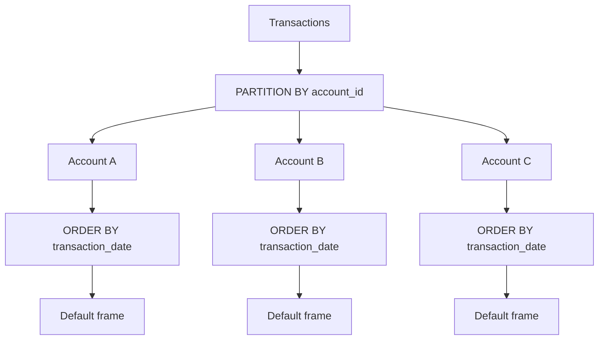
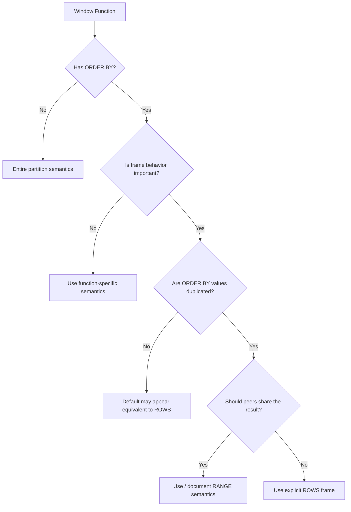

# 10- Default Window Frames

## Overview

A window function can define an explicit frame, but SQL also provides a **default window frame** when the query omits one.

This matters because:

```sql
SUM(amount) OVER (
    ORDER BY transaction_date
)
```

does not simply mean "sum everything before this physical row." The database derives a frame from the window definition, and the exact default depends on the presence of `ORDER BY` and the SQL implementation.

For the common ordered-window case, the default is conceptually equivalent to:

```sql
RANGE BETWEEN UNBOUNDED PRECEDING AND CURRENT ROW
```

That means the current row and its **peers** can be included in the frame.

The most important production rule is:

> **Do not rely on an implicit frame when the distinction between rows and peer values affects correctness.**

For critical queries, explicitly specify the intended frame.

## Why Default Frames Matter

Consider:

```text
transaction_id | transaction_date | amount
---------------+------------------+-------
101            | 2026-01-01       | 100
102            | 2026-01-01       | 200
103            | 2026-01-02       | 150
```

Now compare:

```sql
SUM(amount) OVER (
    ORDER BY transaction_date
)
```

with:

```sql
SUM(amount) OVER (
    ORDER BY transaction_date
    ROWS BETWEEN UNBOUNDED PRECEDING AND CURRENT ROW
)
```

The first uses the database's default frame. For the common `ORDER BY` case, that is peer-aware `RANGE` semantics.

The second explicitly requests row-position semantics.

Possible results:

```text
date        amount   implicit/default   explicit ROWS
----------  -------  -----------------  -------------
2026-01-01  100      300                100
2026-01-01  200      300                300
2026-01-02  150      450                450
```

The difference is caused by the duplicate `transaction_date` values.

This is one of the most common sources of unexpected running-total results.

## Default Frame Rules

A useful conceptual model is:

| Window definition | Common default behavior |
|---|---|
| No `ORDER BY` | Entire partition is available to the window function |
| `ORDER BY` present | `RANGE`-style frame through the current row, including peers |
| Explicit frame | Explicit definition takes precedence |

The exact default-frame rules are defined by the SQL standard and can have database-specific details. Always verify the target database, particularly when writing portable SQL.

For PostgreSQL, an ordered window with no explicit frame uses:

```sql
RANGE BETWEEN UNBOUNDED PRECEDING AND CURRENT ROW
```

where the current row's peers are included.

## No `ORDER BY`

Consider:

```sql
SELECT
    employee_id,
    department_id,
    salary,
    SUM(salary) OVER (
        PARTITION BY department_id
    ) AS department_salary
FROM employees;
```

There is no ordering within the partition.

The window function can therefore operate over the entire partition.

Conceptually:

```text
Department A
┌───────────────────────────┐
│ Employee 1                │
│ Employee 2                │
│ Employee 3                │
│ Employee 4                │
└───────────────────────────┘
          │
          ▼
   Entire partition
```

Every employee in the department receives the same department salary total.

This is different from a running total because there is no progression through an ordered sequence.

## `ORDER BY` Introduces a Frame

Now add:

```sql
ORDER BY salary
```

```sql
SUM(salary) OVER (
    PARTITION BY department_id
    ORDER BY salary
)
```

The window now has an ordering relationship.

The default frame becomes important because the database must determine which rows belong to the current calculation.

For the common default behavior:

```sql
RANGE BETWEEN UNBOUNDED PRECEDING AND CURRENT ROW
```

means:

- Include rows before the current ordering value.
- Include the current ordering value.
- Include peers sharing that ordering value.

## Default `RANGE` Is Peer-Aware

Suppose:

```text
salary
------
50000
50000
70000
90000
```

With:

```sql
SUM(salary) OVER (
    ORDER BY salary
)
```

the two `50000` rows are peers.

Conceptually:

```text
Current salary = 50000

Frame:
[50000, 50000]
```

Both rows can therefore receive:

```text
100000
```

rather than:

```text
50000
100000
```

This is the critical distinction from an explicit `ROWS` frame.

## Default Frame vs Explicit `ROWS`

Compare:

```sql
SUM(amount) OVER (
    ORDER BY transaction_date
)
```

with:

```sql
SUM(amount) OVER (
    ORDER BY transaction_date
    ROWS BETWEEN UNBOUNDED PRECEDING AND CURRENT ROW
)
```

The first relies on the default.

The second explicitly says:

> Start at the first row and advance one physical row at a time.

For production SQL, the second form is often preferable when the requirement is explicitly transaction-level.

## Default Frame vs Explicit `RANGE`

If peer-aware behavior is intentional, make it explicit:

```sql
SUM(amount) OVER (
    ORDER BY transaction_date
    RANGE BETWEEN UNBOUNDED PRECEDING AND CURRENT ROW
)
```

This communicates the intended semantics directly.

It is particularly useful for reporting queries where the requirement is:

> Calculate the cumulative value through the current date/value.

The explicit frame makes the business rule easier for another engineer to review.

## Running Total Example

Consider:

```sql
CREATE TABLE transactions (
    transaction_id bigint PRIMARY KEY,
    account_id bigint NOT NULL,
    transaction_date date NOT NULL,
    amount numeric(12, 2) NOT NULL
);
```

A default-frame query:

```sql
SELECT
    transaction_id,
    transaction_date,
    amount,
    SUM(amount) OVER (
        PARTITION BY account_id
        ORDER BY transaction_date
    ) AS running_total
FROM transactions;
```

looks like a transaction-level running total.

But it actually has peer-aware semantics when multiple transactions share the same date.

If the business requirement is:

> Show the balance after every transaction.

prefer:

```sql
SELECT
    transaction_id,
    transaction_date,
    amount,
    SUM(amount) OVER (
        PARTITION BY account_id
        ORDER BY transaction_date, transaction_id
        ROWS BETWEEN UNBOUNDED PRECEDING AND CURRENT ROW
    ) AS running_total
FROM transactions;
```

The `transaction_id` provides a deterministic row order, while `ROWS` explicitly establishes row-based frame semantics.

## Date-Level Cumulative Reporting

If the requirement is:

> Show the cumulative amount through each transaction date.

then peer-aware behavior may be exactly what is required:

```sql
SELECT
    transaction_id,
    transaction_date,
    amount,
    SUM(amount) OVER (
        PARTITION BY account_id
        ORDER BY transaction_date
        RANGE BETWEEN UNBOUNDED PRECEDING AND CURRENT ROW
    ) AS cumulative_through_date
FROM transactions;
```

Every transaction on the same date can receive the same cumulative value.

This is different from transaction-level accounting.

The important engineering decision is therefore not:

> "Which syntax is shorter?"

It is:

> "What does the metric mean at the application's data grain?"

## Why Explicit Frames Improve Maintainability

This query:

```sql
SUM(amount) OVER (
    PARTITION BY account_id
    ORDER BY transaction_date
)
```

is compact, but its behavior depends on default-frame rules.

This query:

```sql
SUM(amount) OVER (
    PARTITION BY account_id
    ORDER BY transaction_date
    RANGE BETWEEN UNBOUNDED PRECEDING AND CURRENT ROW
)
```

documents the intended semantics.

And:

```sql
SUM(amount) OVER (
    PARTITION BY account_id
    ORDER BY transaction_date, transaction_id
    ROWS BETWEEN UNBOUNDED PRECEDING AND CURRENT ROW
)
```

documents a different requirement: deterministic transaction-by-transaction accumulation.

Explicit frames are particularly valuable in:

- Financial reporting.
- Billing systems.
- Audit queries.
- Data pipelines.
- Regulatory reports.
- Shared analytics SQL.
- Long-lived backend services.

## Default Frames and `PARTITION BY`

`PARTITION BY` defines independent windows.

For example:

```sql
SUM(amount) OVER (
    PARTITION BY account_id
    ORDER BY transaction_date
)
```

creates a separate ordered window for every account.

Conceptually:



The default frame is evaluated independently inside each partition.

A missing `PARTITION BY` can therefore be a correctness problem, not merely a performance issue.

## Default Frames and Multiple Ordering Columns

Peer semantics depend on the complete window `ORDER BY`.

Consider:

```sql
ORDER BY transaction_date
```

Rows with the same date are peers.

Now consider:

```sql
ORDER BY transaction_date, transaction_id
```

If `transaction_id` is unique, those rows are no longer peers.

Therefore, changing:

```sql
ORDER BY transaction_date
```

to:

```sql
ORDER BY transaction_date, transaction_id
```

can change the behavior of an implicit/default frame.

This is an important reason not to casually add a tie-breaker to an existing `RANGE`-based calculation.

## Default Frames and `LAST_VALUE`

Default frames become especially surprising with functions such as `LAST_VALUE`.

Consider:

```sql
SELECT
    employee_id,
    salary,
    LAST_VALUE(salary) OVER (
        PARTITION BY department_id
        ORDER BY salary
    ) AS last_salary
FROM employees;
```

The default frame ends at the current row and its peers rather than necessarily extending to the end of the partition.

Therefore, `LAST_VALUE` may return a value associated with the current frame rather than the final value of the entire partition.

If the requirement is:

> Return the final salary in the department.

an explicit full-partition frame may be appropriate:

```sql
LAST_VALUE(salary) OVER (
    PARTITION BY department_id
    ORDER BY salary
    ROWS BETWEEN UNBOUNDED PRECEDING AND UNBOUNDED FOLLOWING
)
```

This illustrates a broader rule:

> **Default frames are not merely a running-total concern. They affect any window function whose result depends on frame boundaries.**

## Ranking Functions and Frames

Ranking functions such as:

```sql
ROW_NUMBER()
RANK()
DENSE_RANK()
```

are primarily driven by the window ordering and partition rather than the frame in the way aggregate functions are.

For example:

```sql
ROW_NUMBER() OVER (
    PARTITION BY department_id
    ORDER BY salary DESC
)
```

does not become a running aggregate simply because a frame exists.

For many ranking functions, explicit frame clauses are unnecessary or unsupported.

Do not assume that every window function should be analyzed through the same frame model.

## Frame-Sensitive vs Frame-Insensitive Functions

A useful engineering classification is:

| Function category | Frame typically important? |
|---|---|
| `SUM()` | Yes |
| `AVG()` | Yes |
| `MIN()` / `MAX()` | Yes |
| `COUNT()` | Yes |
| `FIRST_VALUE()` | Yes |
| `LAST_VALUE()` | Yes |
| `NTH_VALUE()` | Yes |
| `ROW_NUMBER()` | Primarily ordering/partition |
| `RANK()` | Primarily ordering/partition |
| `DENSE_RANK()` | Primarily ordering/partition |
| `LAG()` | Uses row offset semantics rather than an aggregate frame |
| `LEAD()` | Uses row offset semantics rather than an aggregate frame |

This distinction helps avoid unnecessary frame specifications while ensuring frame-sensitive functions receive careful treatment.

## Filtering and Default Frames

Window functions operate after earlier relational operations in the same query block.

Consider:

```sql
SELECT
    transaction_date,
    amount,
    SUM(amount) OVER (
        ORDER BY transaction_date
    ) AS cumulative_amount
FROM transactions
WHERE transaction_date >= DATE '2026-01-01';
```

The window sees only rows that survive the `WHERE` clause.

Therefore, the cumulative total starts from the filtered dataset.

If the requirement is:

> Calculate the historical cumulative total, but return only transactions from January.

use an additional query layer:

```sql
SELECT
    transaction_id,
    transaction_date,
    amount,
    cumulative_amount
FROM (
    SELECT
        transaction_id,
        transaction_date,
        amount,
        SUM(amount) OVER (
            ORDER BY transaction_date
            RANGE BETWEEN UNBOUNDED PRECEDING AND CURRENT ROW
        ) AS cumulative_amount
    FROM transactions
) AS calculated
WHERE transaction_date >= DATE '2026-01-01'
  AND transaction_date < DATE '2026-02-01'
ORDER BY transaction_date, transaction_id;
```

The frame definition alone cannot fix an incorrectly staged query.

## Performance Considerations

Default frames do not automatically make a query slower than an equivalent explicit frame.

The major performance factors are generally:

- Rows entering the window operation.
- Partition cardinality.
- Sort requirements.
- Number of window definitions.
- Memory available for sorting/window processing.
- Data distribution.
- Required frame boundaries.

For PostgreSQL, inspect the actual execution plan:

```sql
EXPLAIN (ANALYZE, BUFFERS)
SELECT
    account_id,
    transaction_date,
    amount,
    SUM(amount) OVER (
        PARTITION BY account_id
        ORDER BY transaction_date
        RANGE BETWEEN UNBOUNDED PRECEDING AND CURRENT ROW
    ) AS cumulative_amount
FROM transactions;
```

For large tables:

- Filter as early as semantics allow.
- Avoid unnecessary joins before the window operation.
- Keep selected columns narrow.
- Test partition cardinality.
- Monitor sort and temporary-file behavior.
- Benchmark with production-scale data.
- Consider pre-aggregation for repeatedly requested historical reports.

The goal is not to avoid window functions, but to understand how much data reaches the window stage.

## Production Best Practices

### Prefer Explicit Frames for Critical Metrics

For business-critical calculations, make frame semantics visible:

```sql
SUM(amount) OVER (
    PARTITION BY account_id
    ORDER BY transaction_date, transaction_id
    ROWS BETWEEN UNBOUNDED PRECEDING AND CURRENT ROW
)
```

This reduces ambiguity during code review and future maintenance.

### Define the Business Grain

Before writing the query, decide whether the result is:

- Transaction-level.
- Date-level.
- Account-level.
- Customer-level.
- Product-level.

Frame semantics should follow that grain.

### Test Duplicate Ordering Values

Do not test only:

```text
Jan 1
Jan 2
Jan 3
```

Also test:

```text
Jan 1
Jan 1
Jan 2
Jan 2
Jan 3
```

Duplicate ordering values are where implicit default frames frequently reveal unexpected behavior.

### Test Empty and Singleton Partitions

Production data can contain:

- No rows.
- One row.
- Very large partitions.
- Many peer rows.

Window queries should be tested against representative distributions.

### Validate Database-Specific Behavior

If your application uses PostgreSQL, test against PostgreSQL.

Do not assume behavior observed in one database engine is automatically identical in another.

## Common Mistakes

### Assuming the Default Is `ROWS`

This is the most common conceptual error.

```sql
SUM(amount) OVER (
    ORDER BY transaction_date
)
```

should not automatically be interpreted as:

```sql
ROWS BETWEEN UNBOUNDED PRECEDING AND CURRENT ROW
```

For common ordered windows, the default is `RANGE`-style and peer-aware.

### Ignoring Peers

If the ordering column is not unique, ask:

> Should rows with the same ordering value receive the same cumulative result?

If yes, default/explicit `RANGE` may be appropriate.

If no, use an explicit `ROWS` frame with suitable deterministic ordering.

### Using `LAST_VALUE()` Without Understanding the Frame

The default frame often ends at the current row/peer group.

It does not necessarily represent the entire partition.

### Adding a Tie-Breaker Blindly

Adding:

```sql
transaction_id
```

to the `ORDER BY` can eliminate peers.

That may be desirable for `ROWS`, but can change the semantics of a `RANGE` calculation.

### Treating Explicit Syntax as Cosmetic

These are not merely stylistic alternatives:

```sql
SUM(amount) OVER (
    ORDER BY transaction_date
)
```

and:

```sql
SUM(amount) OVER (
    ORDER BY transaction_date
    ROWS BETWEEN UNBOUNDED PRECEDING AND CURRENT ROW
)
```

They can produce different results.

### Testing Only Unique Data

A query can appear correct for months if every test row has a unique ordering value.

Production data often violates that assumption.

## A Practical Decision Process

When a window query omits a frame, use this review process:



The important point is that a query may appear correct even when its frame semantics are not what the author intended.

## Recommended Review Checklist

Before approving a window query that relies on a default frame:

- [ ] Is `PARTITION BY` correct?
- [ ] Is the window `ORDER BY` correct?
- [ ] Are ordering values unique?
- [ ] If not, are peer rows expected?
- [ ] Is the window function frame-sensitive?
- [ ] Is the default frame actually the desired frame?
- [ ] Would explicit `ROWS` be clearer?
- [ ] Would explicit `RANGE` better document the requirement?
- [ ] Is `LAST_VALUE`, `FIRST_VALUE`, or `NTH_VALUE` being used?
- [ ] Are filters applied before or after the window calculation as intended?
- [ ] Has the query been tested with duplicate ordering values?
- [ ] Has the actual database engine been tested?
- [ ] Has the execution plan been checked for large datasets?

## Interview Traps

| Question | Correct reasoning |
|---|---|
| What happens when an ordered window omits a frame? | The database applies its default frame; for common SQL/PostgreSQL ordered windows this is `RANGE ... CURRENT ROW`. |
| Is the default equivalent to `ROWS`? | Not necessarily. Duplicate ordering values can produce different results. |
| Why can two rows receive the same running total? | They can be peers under the default `RANGE` frame. |
| Does `PARTITION BY` define the frame? | It defines independent partitions; the frame is then evaluated within each partition. |
| Does `ORDER BY` affect the default frame? | Yes. Adding ordering changes the window from whole-partition semantics to ordered-frame semantics. |
| Why can `LAST_VALUE()` surprise developers? | Its default frame may end at the current row/peer group instead of the end of the partition. |
| Should critical queries rely on implicit frames? | Prefer explicit frames when frame semantics affect correctness or maintainability. |
| Does `WHERE` filter after the window function? | No. In the same query block, filtering occurs before the window operation. |
| Do ranking functions depend on frames like `SUM()` does? | Generally no; ranking is primarily driven by partitioning and ordering. |

## Key Takeaways

- **An omitted frame is not the same thing as `ROWS`; ordered windows commonly default to peer-aware `RANGE` semantics.**
- **Duplicate `ORDER BY` values can make an implicit running calculation produce the same result for multiple rows.**
- **Use explicit frames when transaction-level versus peer/value-level semantics affect correctness.**
- **Functions such as `LAST_VALUE()` are especially sensitive to frame boundaries and should be reviewed explicitly.**
- **Treat default-frame behavior as part of query semantics, not merely SQL syntax, and test it against realistic duplicate and production-scale data.**