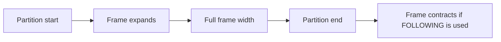

# 11- Window Frame Boundaries

## Overview

A window frame defines the subset of rows within a window partition that a frame-aware window function uses for the current row.

The frame is specified after the window `ORDER BY`:

```sql
SUM(amount) OVER (
    PARTITION BY account_id
    ORDER BY transaction_date
    ROWS BETWEEN UNBOUNDED PRECEDING AND CURRENT ROW
)
```

The important distinction is:

- `PARTITION BY` defines **which rows belong to the window**.
- `ORDER BY` defines **the logical ordering within that partition**.
- The **frame** defines which portion of that ordered partition is visible to the current calculation.

Frame boundaries are the endpoints of that frame.

Understanding them is essential for running totals, moving averages, rolling metrics, cumulative counts, and functions such as `FIRST_VALUE()`, `LAST_VALUE()`, and `NTH_VALUE()`.

## Window Frame Mental Model

Consider an account's transactions:

```text
row   date        amount
----  ----------  ------
1     Jan 01      100
2     Jan 02      200
3     Jan 03      150
4     Jan 04      300
5     Jan 05      250
```

For row 4, this frame:

```sql
ROWS BETWEEN UNBOUNDED PRECEDING AND CURRENT ROW
```

means:

```text
[100] [200] [150] [300] [250]
  └───────────────┘
       frame
```

The current row is Jan 04, so the frame contains rows 1 through 4.

A frame such as:

```sql
ROWS BETWEEN 2 PRECEDING AND CURRENT ROW
```

produces:

```text
[100] [200] [150] [300] [250]
             └───────────┘
                 frame
```

for Jan 04.

The frame contains:

```text
Jan 02
Jan 03
Jan 04
```

This is the foundation of a three-row moving calculation.

## Frame Boundary Syntax

The general syntax is:

```sql
{ ROWS | RANGE | GROUPS }
BETWEEN <start-boundary> AND <end-boundary>
```

For example:

```sql
ROWS BETWEEN 3 PRECEDING AND CURRENT ROW
```

Common boundaries include:

| Boundary | Meaning |
|---|---|
| `UNBOUNDED PRECEDING` | Start of the partition |
| `n PRECEDING` | A position/value/group before the current row |
| `CURRENT ROW` | Current row or current peer group, depending on frame type |
| `n FOLLOWING` | A position/value/group after the current row |
| `UNBOUNDED FOLLOWING` | End of the partition |

The exact interpretation of `PRECEDING`, `FOLLOWING`, and `CURRENT ROW` depends on whether the frame uses `ROWS`, `RANGE`, or `GROUPS`.

## `UNBOUNDED PRECEDING`

```sql
ROWS BETWEEN UNBOUNDED PRECEDING AND CURRENT ROW
```

means:

> Start at the first row of the partition.

Example:

```sql
SELECT
    transaction_id,
    transaction_date,
    amount,
    SUM(amount) OVER (
        PARTITION BY account_id
        ORDER BY transaction_date, transaction_id
        ROWS BETWEEN UNBOUNDED PRECEDING AND CURRENT ROW
    ) AS running_total
FROM transactions;
```

For five transactions:

```text
row   amount   frame
----  -------  -----------------
1     100      [1]
2     200      [1, 2]
3     150      [1, 2, 3]
4     300      [1, 2, 3, 4]
5     250      [1, 2, 3, 4, 5]
```

This is the standard explicit form for a row-by-row running total.

## `UNBOUNDED FOLLOWING`

```sql
ROWS BETWEEN CURRENT ROW AND UNBOUNDED FOLLOWING
```

means:

> Start at the current row and continue through the end of the partition.

For row 3:

```text
[100] [200] [150] [300] [250]
             └───────────────┘
                  frame
```

This can be useful for future-looking calculations.

Example:

```sql
SUM(amount) OVER (
    PARTITION BY account_id
    ORDER BY transaction_date, transaction_id
    ROWS BETWEEN CURRENT ROW AND UNBOUNDED FOLLOWING
) AS remaining_amount
```

The result represents the current transaction plus all later transactions in the partition.

## `CURRENT ROW`

`CURRENT ROW` is context-dependent.

With:

```sql
ROWS BETWEEN UNBOUNDED PRECEDING AND CURRENT ROW
```

the frame ends at the physical current row.

With:

```sql
RANGE BETWEEN UNBOUNDED PRECEDING AND CURRENT ROW
```

the frame includes the current row's peers.

With:

```sql
GROUPS BETWEEN UNBOUNDED PRECEDING AND CURRENT ROW
```

the frame ends at the current peer group.

This distinction is one reason that `CURRENT ROW` should never be interpreted without considering the frame unit.

## `n PRECEDING`

With `ROWS`:

```sql
ROWS BETWEEN 2 PRECEDING AND CURRENT ROW
```

means:

> Include the current row and the two preceding physical rows.

For:

```text
row   amount
----  ------
1     100
2     200
3     150
4     300
5     250
```

the frame for row 4 is:

```text
[100] [200] [150] [300] [250]
       └──────────────┘
```

Rows 2, 3, and 4 are included.

This is commonly used for rolling metrics.

## `n FOLLOWING`

With:

```sql
ROWS BETWEEN CURRENT ROW AND 2 FOLLOWING
```

the frame includes the current row and the next two physical rows.

For row 3:

```text
[100] [200] [150] [300] [250]
             └───────────────┘
```

Rows 3, 4, and 5 are included.

This is useful for forward-looking metrics such as:

- Future revenue.
- Upcoming workload.
- Trailing business commitments.
- Forecast-supporting calculations.

## Symmetric Frames

A frame can extend in both directions:

```sql
ROWS BETWEEN 2 PRECEDING AND 2 FOLLOWING
```

For row 3:

```text
[100] [200] [150] [300] [250]
       └────────────────────┘
```

The frame contains rows 1 through 5.

For row 2, fewer preceding rows are available:

```text
[100] [200] [150] [300] [250]
       └───────────────┘
```

SQL does not invent missing rows. The frame is clipped at the partition boundaries.

## Frame Boundaries at Partition Edges

Suppose:

```sql
AVG(amount) OVER (
    ORDER BY transaction_date
    ROWS BETWEEN 2 PRECEDING AND CURRENT ROW
)
```

For the first row, there are no preceding rows.

Therefore, the frame contains only the current row.

For the second row:

```text
row 1 + row 2
```

For the third and subsequent rows:

```text
row N-2 + row N-1 + row N
```

Conceptually:



Boundary behavior is deterministic and should be considered when interpreting rolling calculations near the beginning or end of a dataset.

## Invalid Frame Relationships

A frame's starting boundary must not logically occur after its ending boundary.

For example, this is invalid:

```sql
ROWS BETWEEN CURRENT ROW AND 2 PRECEDING
```

because the starting point is after the ending point.

Valid examples include:

```sql
ROWS BETWEEN UNBOUNDED PRECEDING AND CURRENT ROW
```

```sql
ROWS BETWEEN 3 PRECEDING AND CURRENT ROW
```

```sql
ROWS BETWEEN CURRENT ROW AND 3 FOLLOWING
```

```sql
ROWS BETWEEN 3 PRECEDING AND 3 FOLLOWING
```

## Common Boundary Combinations

| Frame | Typical purpose |
|---|---|
| `UNBOUNDED PRECEDING → CURRENT ROW` | Running/cumulative calculation |
| `n PRECEDING → CURRENT ROW` | Trailing rolling window |
| `CURRENT ROW → n FOLLOWING` | Forward-looking window |
| `n PRECEDING → n FOLLOWING` | Centered rolling calculation |
| `CURRENT ROW → UNBOUNDED FOLLOWING` | Remaining/future total |
| `UNBOUNDED PRECEDING → UNBOUNDED FOLLOWING` | Entire partition |

## Running Totals

A production-friendly transaction-level running total is:

```sql
SELECT
    transaction_id,
    transaction_date,
    amount,
    SUM(amount) OVER (
        PARTITION BY account_id
        ORDER BY transaction_date, transaction_id
        ROWS BETWEEN UNBOUNDED PRECEDING AND CURRENT ROW
    ) AS running_total
FROM transactions;
```

The frame grows by one physical row as the window moves through the partition.

The `transaction_id` tie-breaker is important when multiple transactions can have the same timestamp or date.

## Moving Averages

A three-row moving average:

```sql
SELECT
    transaction_id,
    transaction_date,
    amount,
    AVG(amount) OVER (
        PARTITION BY account_id
        ORDER BY transaction_date, transaction_id
        ROWS BETWEEN 2 PRECEDING AND CURRENT ROW
    ) AS moving_average
FROM transactions;
```

For each row:

```text
row 1 → average(row 1)
row 2 → average(row 1, row 2)
row 3 → average(row 1, row 2, row 3)
row 4 → average(row 2, row 3, row 4)
row 5 → average(row 3, row 4, row 5)
```

Notice that this is a **three-row** window, not necessarily a three-day window.

That distinction matters when transaction activity is irregular.

## Row Window vs Time Window

Consider:

```sql
ROWS BETWEEN 6 PRECEDING AND CURRENT ROW
```

This means seven rows, assuming enough rows exist.

It does **not** mean seven days.

For a time-based requirement such as:

> Include all transactions from the previous seven days.

`RANGE` with an appropriate temporal ordering expression may be more appropriate, depending on the database engine and data type.

For example, PostgreSQL supports value-based range frames such as:

```sql
SUM(amount) OVER (
    PARTITION BY account_id
    ORDER BY transaction_timestamp
    RANGE BETWEEN INTERVAL '7 days' PRECEDING AND CURRENT ROW
)
```

This represents a time interval rather than a fixed number of rows.

## `ROWS`, `RANGE`, and `GROUPS`

Frame boundaries behave differently under the three frame units:

| Frame unit | Boundary is based on |
|---|---|
| `ROWS` | Physical row positions |
| `RANGE` | Ordering values and peer relationships |
| `GROUPS` | Peer groups |

Example data:

```text
id   date        amount
---  ----------  ------
1    Jan 01      100
2    Jan 01      200
3    Jan 02      150
4    Jan 03      300
```

For a current Jan 01 row:

- `ROWS` can distinguish row 1 from row 2.
- `RANGE` treats both Jan 01 rows as peers.
- `GROUPS` treats the two Jan 01 rows as one peer group.

This is a semantic choice, not merely a syntax choice.

## `ROWS` Boundary Semantics

With:

```sql
ROWS BETWEEN 1 PRECEDING AND 1 FOLLOWING
```

the frame contains up to three physical rows:

```text
previous row
current row
next row
```

For:

```text
A B C D E
```

the frame for `C` is:

```text
[B C D]
```

The ordering columns determine the row sequence, but duplicate ordering values do not cause additional rows to be automatically included.

## `RANGE` Boundary Semantics

`RANGE` evaluates boundaries relative to the ordering value.

For example:

```sql
ORDER BY transaction_date
RANGE BETWEEN INTERVAL '7 days' PRECEDING AND CURRENT ROW
```

asks for rows whose ordering values fall within the specified value range.

This makes `RANGE` useful for time-based analytical windows.

However, `RANGE` has stricter rules around its ordering expression and supported boundary types. Database-specific syntax and capabilities should therefore be verified before relying on advanced range expressions.

## `GROUPS` Boundary Semantics

`GROUPS` counts peer groups rather than individual rows.

Suppose:

```text
date
----
Jan 01
Jan 01
Jan 02
Jan 03
Jan 03
```

There are three peer groups:

```text
Group 1 → Jan 01
Group 2 → Jan 02
Group 3 → Jan 03
```

Then:

```sql
GROUPS BETWEEN 1 PRECEDING AND CURRENT ROW
```

for a Jan 03 row includes:

```text
Jan 02
Jan 03
```

regardless of how many rows exist inside each peer group.

This is useful when the business unit is a group of equal ordering values rather than an individual row.

## `FIRST_VALUE()` and Frame Boundaries

Frame boundaries are particularly important for value functions.

Consider:

```sql
FIRST_VALUE(amount) OVER (
    PARTITION BY account_id
    ORDER BY transaction_date
    ROWS BETWEEN UNBOUNDED PRECEDING AND CURRENT ROW
)
```

The first value remains the first value encountered in the frame.

Because the frame begins at the partition start, the result generally remains the partition's first ordered value as the window advances.

A different frame can change what the function can see.

## `LAST_VALUE()` and Frame Boundaries

`LAST_VALUE()` is a classic frame-boundary trap.

Consider:

```sql
LAST_VALUE(amount) OVER (
    PARTITION BY account_id
    ORDER BY transaction_date
    ROWS BETWEEN UNBOUNDED PRECEDING AND CURRENT ROW
)
```

The frame ends at the current row.

Therefore, `LAST_VALUE()` returns the value from the current frame's last row, which is normally the current row.

It does **not** mean:

> Return the final value of the partition.

To access the partition's final row:

```sql
LAST_VALUE(amount) OVER (
    PARTITION BY account_id
    ORDER BY transaction_date
    ROWS BETWEEN UNBOUNDED PRECEDING AND UNBOUNDED FOLLOWING
)
```

The frame now spans the entire partition.

## Full-Partition Frame

The explicit full-partition frame is:

```sql
ROWS BETWEEN UNBOUNDED PRECEDING AND UNBOUNDED FOLLOWING
```

Example:

```sql
SELECT
    employee_id,
    department_id,
    salary,
    MAX(salary) OVER (
        PARTITION BY department_id
        ROWS BETWEEN UNBOUNDED PRECEDING AND UNBOUNDED FOLLOWING
    ) AS department_max_salary
FROM employees;
```

For aggregate functions such as `MAX()`, the result may look identical to a simpler partition-only window:

```sql
MAX(salary) OVER (
    PARTITION BY department_id
)
```

But explicit frame boundaries become more significant with functions whose result depends on frame position.

## Boundary Selection by Requirement

A useful engineering mapping is:

| Requirement | Appropriate frame |
|---|---|
| Cumulative total from beginning | `UNBOUNDED PRECEDING → CURRENT ROW` |
| Last N rows including current | `N-1 PRECEDING → CURRENT ROW` |
| Next N rows including current | `CURRENT ROW → N-1 FOLLOWING` |
| Centered rolling calculation | `N PRECEDING → N FOLLOWING` |
| Entire partition | `UNBOUNDED PRECEDING → UNBOUNDED FOLLOWING` |
| Time-based lookback | Usually `RANGE` with an appropriate value interval |
| Peer-group calculation | `GROUPS` |

The frame should follow the business definition rather than being chosen because a particular syntax is familiar.

## Production Considerations

### Deterministic Ordering

For row-based calculations, make the ordering deterministic when necessary:

```sql
ORDER BY transaction_timestamp, transaction_id
```

rather than:

```sql
ORDER BY transaction_timestamp
```

if timestamps can collide.

This prevents ambiguous physical ordering from affecting `ROWS`-based calculations.

### Frame Width Affects Work

A narrow rolling frame can require less logical state than an unbounded frame, but the actual execution strategy is database-dependent.

For large workloads, inspect:

```sql
EXPLAIN (ANALYZE, BUFFERS)
SELECT
    account_id,
    transaction_date,
    amount,
    AVG(amount) OVER (
        PARTITION BY account_id
        ORDER BY transaction_date, transaction_id
        ROWS BETWEEN 6 PRECEDING AND CURRENT ROW
    )
FROM transactions;
```

Do not assume that a window query is cheap simply because the frame contains only a few rows.

### Large Partitions

A single customer or account with millions of rows can create a very large window partition.

Watch for:

- Large sorts.
- Memory pressure.
- Temporary files.
- Long-running analytical queries.
- Increased database CPU.
- Increased read amplification.

Partitioning the window logically with `PARTITION BY` can be essential for both correctness and execution characteristics.

### Filter Before the Window Only When Semantically Correct

A filter in the same query block affects which rows reach the window operation:

```sql
SELECT
    transaction_date,
    amount,
    SUM(amount) OVER (
        ORDER BY transaction_date
        ROWS BETWEEN UNBOUNDED PRECEDING AND CURRENT ROW
    ) AS running_total
FROM transactions
WHERE account_id = 1001;
```

If historical rows are intentionally excluded, this is correct.

If the requirement is to calculate a full historical running total and then display only recent rows, use a separate query layer.

### Application-Level Pagination

Do not assume SQL pagination can be applied before a window calculation without changing semantics.

For example:

```sql
SELECT ...
FROM transactions
ORDER BY transaction_date
LIMIT 50;
```

and a window calculation over the same query can produce different results from calculating the window over the complete dataset and then selecting a page.

For API endpoints using Django or FastAPI, establish whether the window metric is supposed to describe:

- The entire dataset.
- The filtered dataset.
- Only the returned page.

That distinction should be encoded explicitly in the SQL.

## Common Mistakes

### Confusing `ROWS` With Days

This:

```sql
ROWS BETWEEN 6 PRECEDING AND CURRENT ROW
```

means seven rows, not seven calendar days.

### Forgetting That Frames Are Partition-Local

With:

```sql
PARTITION BY account_id
```

`UNBOUNDED PRECEDING` means the first row of the **current account's partition**, not the first row in the entire table.

### Misreading `CURRENT ROW`

`CURRENT ROW` does not have identical semantics for `ROWS`, `RANGE`, and `GROUPS`.

Always interpret it together with the frame unit.

### Using `LAST_VALUE()` With the Default Frame

A query such as:

```sql
LAST_VALUE(value) OVER (
    PARTITION BY group_id
    ORDER BY created_at
)
```

can return the current frame's last value rather than the partition's final value.

Explicitly define the frame when the requirement is "last value in the partition."

### Ignoring Duplicate Ordering Values

With:

```sql
ORDER BY created_at
```

multiple rows can share the same ordering value.

This is particularly important when choosing between `ROWS`, `RANGE`, and `GROUPS`.

### Assuming Frame Boundaries Are Inclusive Everywhere in the Same Way

Frame boundaries are expressed inclusively, but the meaning of the boundary depends on the frame unit.

`ROWS`, `RANGE`, and `GROUPS` must therefore be reasoned about separately.

## Interview Traps

| Trap | Correct reasoning |
|---|---|
| Does `2 PRECEDING` mean two rows for every frame type? | No. With `ROWS` it refers to row positions; `RANGE` and `GROUPS` have different semantics. |
| Does `UNBOUNDED PRECEDING` mean the beginning of the table? | No. It means the beginning of the current partition. |
| Does `CURRENT ROW` always mean one physical row? | No. Its interpretation depends on the frame unit. |
| Does `ROWS BETWEEN 6 PRECEDING AND CURRENT ROW` mean seven days? | No. It means up to seven physical rows. |
| Why does `LAST_VALUE()` often return the current value? | A frame ending at `CURRENT ROW` makes the current row the frame's last row. |
| How do you access the entire partition? | Use a frame such as `ROWS BETWEEN UNBOUNDED PRECEDING AND UNBOUNDED FOLLOWING` when appropriate. |
| What happens at the beginning of a partition with `2 PRECEDING`? | The frame is clipped because preceding rows do not exist. |
| Why add a unique tie-breaker to `ORDER BY`? | To make row-based ordering deterministic when ordering values can tie. |
| What is `GROUPS` useful for? | Frame boundaries based on peer-group positions rather than individual rows. |

## Practical Review Checklist

Before shipping a query with an explicit frame, verify:

- [ ] Is `PARTITION BY` correct?
- [ ] Is the `ORDER BY` semantically correct?
- [ ] Does the ordering need a deterministic tie-breaker?
- [ ] Should the frame be based on rows, values, or peer groups?
- [ ] Is `CURRENT ROW` being interpreted correctly for that frame unit?
- [ ] Are `PRECEDING` and `FOLLOWING` expressed in the intended unit?
- [ ] Should the frame start at the partition beginning?
- [ ] Should the frame end at the partition end?
- [ ] Does the calculation behave correctly at partition boundaries?
- [ ] Are duplicate ordering values covered by tests?
- [ ] Is the query being paginated or filtered in a way that changes the intended window?
- [ ] Has the execution plan been tested against realistic partition sizes?

## Key Takeaways

- **Frame boundaries determine exactly which rows, values, or peer groups a frame-aware window function can see.**
- **`ROWS`, `RANGE`, and `GROUPS` interpret the same boundary expressions differently, so the frame unit is part of the query's semantics.**
- **`UNBOUNDED PRECEDING → CURRENT ROW` is the standard explicit pattern for cumulative calculations, while bounded frames are useful for rolling metrics.**
- **`LAST_VALUE()` is especially sensitive to frame boundaries; use an explicit full-partition frame when the actual final partition value is required.**
- **Choose frame boundaries from the business requirement, then validate ordering, duplicate values, partition edges, and execution behavior at production scale.**