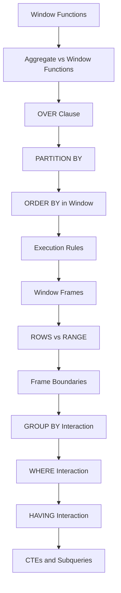

# README

## Overview

Window functions are one of the most important SQL features for analytical queries because they allow calculations across related rows without collapsing the result set.

This section builds the fundamentals required to use window functions correctly in production SQL. The material progresses from the structure of a window definition to partitioning, ordering, frame boundaries, execution rules, and interaction with other SQL clauses.

The central model is:

```text
FROM / JOIN
    ↓
WHERE
    ↓
GROUP BY / aggregates
    ↓
HAVING
    ↓
Window functions
    ↓
SELECT / DISTINCT
    ↓
ORDER BY
    ↓
LIMIT / OFFSET
```

Understanding this logical processing model is essential. Many window-function mistakes are not syntax mistakes; they occur because the query is operating on a different set of rows or a different data grain than the engineer expects.

## Navigation

| # | File | Description |
|---|---|---|
| 01 | [01- Window Functions Introduction](./01-%20Window%20Functions%20Introduction.md) | Purpose, core concept, and how window functions differ from aggregate functions |
| 02 | [02- Window Function Mental Model](./02-%20Window%20Function%20Mental%20Model.md) | Building the right intuition for how window functions execute |
| 03 | [03- Aggregate vs Window Functions](./03-%20Aggregate%20vs%20Window%20Functions.md) | When to collapse rows versus preserve them with a window |
| 04 | [04- OVER Clause](./04-%20OVER%20Clause.md) | The OVER clause and how it defines the window |
| 05 | [05- PARTITION BY](./05-%20PARTITION%20BY.md) | Dividing rows into independent windows with PARTITION BY |
| 06 | [06- ORDER BY in Window Functions](./06-%20ORDER%20BY%20in%20Window%20Functions.md) | Row ordering within the window and its effect on calculations |
| 07 | [07- Window Function Execution Rules](./07-%20Window%20Function%20Execution%20Rules.md) | Logical processing order and when window functions evaluate |
| 08 | [08- Window Frames Introduction](./08-%20Window%20Frames%20Introduction.md) | What frame clauses are and why they matter |
| 09 | [09- ROWS vs RANGE](./09-%20ROWS%20vs%20RANGE.md) | Physical versus logical frame semantics |
| 10 | [10- Default Window Frames](./10-%20Default%20Window%20Frames.md) | Default frame behavior when ORDER BY is and is not present |
| 11 | [11- Window Frame Boundaries](./11-%20Window%20Frame%20Boundaries.md) | UNBOUNDED PRECEDING, CURRENT ROW, FOLLOWING, and custom boundaries |
| 12 | [12- Window Functions and GROUP BY](./12-%20Window%20Functions%20and%20GROUP%20BY.md) | Combining GROUP BY with window functions correctly |
| 13 | [13- Window Functions and WHERE](./13-%20Window%20Functions%20and%20WHERE.md) | Why WHERE cannot filter on window function results directly |
| 14 | [14- Window Functions and HAVING](./14-%20Window%20Functions%20and%20HAVING.md) | HAVING interaction and filtering after grouping |
| 15 | [15- Window Functions and CTEs](./15-%20Window%20Functions%20and%20CTEs.md) | Staging window results in CTEs for further filtering |
| 16 | [16- Window Functions and Subqueries](./16-%20Window%20Functions%20and%20Subqueries.md) | Wrapping window queries in subqueries to filter on their output |

## What Window Functions Solve

Traditional aggregate functions collapse multiple rows into one result:

```sql
SELECT
    department_id,
    AVG(salary) AS average_salary
FROM employees
GROUP BY department_id;
```

A window function can calculate the same type of aggregate while retaining individual employee rows:

```sql
SELECT
    employee_id,
    department_id,
    salary,
    AVG(salary) OVER (
        PARTITION BY department_id
    ) AS department_average
FROM employees;
```

This makes window functions useful for:

- Ranking.
- Running totals.
- Moving averages.
- Previous/next-row comparisons.
- Percent-of-total calculations.
- Per-group statistics.
- Latest-row selection.
- Top-N-per-group queries.
- Change detection.
- Time-series analysis.

## Window Function Structure

The general form is:

```sql
function_name(expression) OVER (
    PARTITION BY partition_expression
    ORDER BY ordering_expression
    frame_clause
)
```

Each component controls a different dimension of the calculation.

| Component | Responsibility |
|---|---|
| Function | Defines the calculation, such as `SUM`, `AVG`, `ROW_NUMBER`, or `LAG` |
| `PARTITION BY` | Defines independent groups of rows |
| `ORDER BY` | Defines row order inside each partition |
| Frame clause | Defines the subset of the partition visible to the function |

Example:

```sql
SUM(amount) OVER (
    PARTITION BY customer_id
    ORDER BY created_at
    ROWS BETWEEN UNBOUNDED PRECEDING AND CURRENT ROW
)
```

This means:

> For each customer, order rows by creation time and calculate a cumulative sum from the beginning of that customer's rows through the current row.

## Core Window Function Categories

| Category | Examples | Typical use |
|---|---|---|
| Ranking | `ROW_NUMBER`, `RANK`, `DENSE_RANK` | Top-N, leaderboard |
| Aggregate windows | `SUM`, `AVG`, `MIN`, `MAX`, `COUNT` | Running and per-group metrics |
| Navigation | `LAG`, `LEAD` | Previous/next value |
| Positional | `FIRST_VALUE`, `LAST_VALUE`, `NTH_VALUE` | Values relative to a window |
| Distribution | `PERCENT_RANK`, `CUME_DIST`, `NTILE` | Percentiles and segmentation |

## The Fundamentals Sequence

The recommended learning order for this section is:



Each topic addresses a different source of correctness issues.

## Aggregate vs Window Functions

Aggregate functions reduce rows according to the query's grouping.

```sql
SELECT
    department_id,
    AVG(salary) AS average_salary
FROM employees
GROUP BY department_id;
```

The result has one row per department.

A window function preserves the employee rows:

```sql
SELECT
    employee_id,
    department_id,
    salary,
    AVG(salary) OVER (
        PARTITION BY department_id
    ) AS department_average
FROM employees;
```

The distinction is fundamental:

| Aggregate | Window function |
|---|---|
| Can collapse rows | Preserves rows |
| Uses `GROUP BY` for grouping | Uses `PARTITION BY` for window grouping |
| Produces grouped output | Produces a value for each input row |
| Useful for summaries | Useful for row-level analytics |

## `OVER` Clause

The `OVER` clause turns a supported function into a window calculation.

```sql
SELECT
    order_id,
    amount,
    SUM(amount) OVER () AS total_revenue
FROM orders;
```

Without `OVER`:

```sql
SELECT SUM(amount)
FROM orders;
```

the aggregate produces one result.

With `OVER ()`, the total is attached to every row.

The `OVER` clause can optionally define:

```sql
OVER (
    PARTITION BY ...
    ORDER BY ...
    ROWS ...
)
```

These controls should be treated independently:

- `PARTITION BY` controls **which rows belong to the same window partition**.
- `ORDER BY` controls **the logical order of rows**.
- The frame controls **which portion of the ordered partition participates in the calculation**.

## `PARTITION BY`

`PARTITION BY` divides the rows supplied to the window function into independent groups.

```sql
SELECT
    employee_id,
    department_id,
    salary,
    AVG(salary) OVER (
        PARTITION BY department_id
    ) AS department_average
FROM employees;
```

Each department gets its own calculation.

It is similar conceptually to `GROUP BY`, but it does not collapse the rows.

```text
employees
    ↓
partition by department
    ├── Engineering → window calculation
    ├── Finance     → window calculation
    └── Support     → window calculation
```

A production query should always establish the intended data grain before choosing a partition.

## `ORDER BY` Inside a Window

Window `ORDER BY` is different from the final query `ORDER BY`.

```sql
SELECT
    employee_id,
    salary,
    RANK() OVER (
        ORDER BY salary DESC
    ) AS salary_rank
FROM employees
ORDER BY employee_id;
```

The window `ORDER BY` determines ranking.

The outer `ORDER BY` determines how the final result is displayed.

They solve different problems.

| Clause | Controls |
|---|---|
| `ORDER BY` inside `OVER` | Calculation order |
| Final query `ORDER BY` | Result presentation order |

A query can have one, both, or neither.

## Window Function Execution Rules

Window functions operate after the query has established the rows available to the relevant query block.

A useful logical model is:

```text
FROM
  ↓
WHERE
  ↓
GROUP BY
  ↓
HAVING
  ↓
Window functions
  ↓
SELECT
  ↓
DISTINCT
  ↓
ORDER BY
  ↓
LIMIT/OFFSET
```

This explains why a window result generally cannot be referenced directly in the same query block's `WHERE` clause.

For example, this is invalid:

```sql
SELECT
    employee_id,
    salary,
    ROW_NUMBER() OVER (
        ORDER BY salary DESC
    ) AS row_num
FROM employees
WHERE row_num <= 10;
```

Use a query boundary:

```sql
WITH ranked AS (
    SELECT
        employee_id,
        salary,
        ROW_NUMBER() OVER (
            ORDER BY salary DESC
        ) AS row_num
    FROM employees
)
SELECT
    employee_id,
    salary
FROM ranked
WHERE row_num <= 10;
```

## Window Frames

A window frame defines the rows considered by a window function relative to the current row.

Example:

```sql
SUM(amount) OVER (
    ORDER BY created_at
    ROWS BETWEEN UNBOUNDED PRECEDING AND CURRENT ROW
)
```

The frame represents:

```text
beginning of partition
        ↓
[ row ][ row ][ row ][ CURRENT ROW ]
                                  ↑
                              current row
```

Frame semantics become particularly important with:

- Running totals.
- Moving averages.
- `FIRST_VALUE`.
- `LAST_VALUE`.
- Duplicate ordering values.
- Time-series calculations.

Do not assume that `ORDER BY` alone fully communicates the intended frame semantics.

## `ROWS` vs `RANGE`

The two most important frame units are:

| Frame unit | Meaning |
|---|---|
| `ROWS` | Physical rows relative to the current row |
| `RANGE` | Logical ordering values relative to the current row |

With duplicate ordering values, they can produce different results.

Example:

```sql
SELECT
    order_id,
    created_at,
    amount,
    SUM(amount) OVER (
        ORDER BY created_at
        ROWS BETWEEN UNBOUNDED PRECEDING AND CURRENT ROW
    ) AS rows_total,
    SUM(amount) OVER (
        ORDER BY created_at
        RANGE BETWEEN UNBOUNDED PRECEDING AND CURRENT ROW
    ) AS range_total
FROM orders;
```

If multiple orders have the same `created_at`, `RANGE` can include all rows tied on the ordering value, while `ROWS` advances row by row.

This distinction is a frequent interview and production correctness issue.

## Default Window Frames

When a frame is omitted, the database applies function- and syntax-dependent default semantics.

A common SQL behavior is that an ordered window using an aggregate has a frame equivalent to:

```sql
RANGE BETWEEN UNBOUNDED PRECEDING AND CURRENT ROW
```

when an explicit frame is not supplied.

This matters when the window `ORDER BY` contains duplicate values.

For deterministic running totals, explicitly define the intended frame:

```sql
SUM(amount) OVER (
    PARTITION BY customer_id
    ORDER BY created_at, order_id
    ROWS BETWEEN UNBOUNDED PRECEDING AND CURRENT ROW
)
```

Explicit frames make the query's business semantics easier to review and reduce ambiguity.

Database engines can differ in supported frame syntax and default behavior, so production SQL should be validated against the target database, such as PostgreSQL.

## Frame Boundaries

Common frame boundaries include:

| Boundary | Meaning |
|---|---|
| `UNBOUNDED PRECEDING` | Beginning of the partition |
| `n PRECEDING` | A specified amount before the current row |
| `CURRENT ROW` | Current row or current ordering value, depending on frame unit |
| `n FOLLOWING` | A specified amount after the current row |
| `UNBOUNDED FOLLOWING` | End of the partition |

Example:

```sql
AVG(amount) OVER (
    ORDER BY created_at
    ROWS BETWEEN 2 PRECEDING AND CURRENT ROW
)
```

This produces a three-row moving average when enough preceding rows exist:

```text
row - 2
row - 1
current row
```

Frame boundaries are therefore a direct way to express rolling analytical windows.

## Window Functions and `GROUP BY`

`GROUP BY` changes the row set before the window function operates.

For example:

```sql
SELECT
    department_id,
    SUM(salary) AS department_salary,
    RANK() OVER (
        ORDER BY SUM(salary) DESC
    ) AS department_rank
FROM employees
GROUP BY department_id;
```

The window function ranks the grouped department rows, not individual employees.

The effective flow is:

```text
employees
    ↓
GROUP BY department_id
    ↓
one row per department
    ↓
RANK() OVER (...)
```

This is one of the most important concepts for understanding window functions.

## Window Functions and `WHERE`

`WHERE` filters rows before the window calculation.

```sql
SELECT
    employee_id,
    department_id,
    salary,
    RANK() OVER (
        PARTITION BY department_id
        ORDER BY salary DESC
    ) AS salary_rank
FROM employees
WHERE active = true;
```

Only active employees participate in the ranking.

If inactive employees must influence the ranking but should not appear in the final result, filtering must occur after the window calculation:

```sql
WITH ranked AS (
    SELECT
        employee_id,
        department_id,
        salary,
        active,
        RANK() OVER (
            PARTITION BY department_id
            ORDER BY salary DESC
        ) AS salary_rank
    FROM employees
)
SELECT
    employee_id,
    department_id,
    salary,
    salary_rank
FROM ranked
WHERE active = true;
```

This distinction is critical for correctness.

## Window Functions and `HAVING`

`HAVING` filters grouped rows before window calculations in the same query block.

```sql
SELECT
    department_id,
    COUNT(*) AS employee_count,
    RANK() OVER (
        ORDER BY COUNT(*) DESC
    ) AS size_rank
FROM employees
GROUP BY department_id
HAVING COUNT(*) >= 10;
```

The window function ranks only departments that satisfy:

```sql
COUNT(*) >= 10
```

The processing concept is:

```text
employees
    ↓
GROUP BY
    ↓
HAVING
    ↓
qualifying department rows
    ↓
window ranking
```

This is different from filtering the window result afterward.

## Window Functions and CTEs

CTEs provide a clean boundary between analytical stages.

```sql
WITH monthly_revenue AS (
    SELECT
        customer_id,
        DATE_TRUNC('month', created_at) AS month,
        SUM(amount) AS revenue
    FROM orders
    WHERE status = 'completed'
    GROUP BY
        customer_id,
        DATE_TRUNC('month', created_at)
)
SELECT
    customer_id,
    month,
    revenue,
    RANK() OVER (
        PARTITION BY month
        ORDER BY revenue DESC
    ) AS monthly_rank
FROM monthly_revenue;
```

The CTE first establishes:

```text
one row per customer per month
```

The window function then operates on that grain.

This pattern is especially useful for production reporting because each query stage has a clear responsibility.

## Window Functions and Subqueries

A subquery can expose a window result to an outer query:

```sql
SELECT
    customer_id,
    revenue,
    revenue_rank
FROM (
    SELECT
        customer_id,
        revenue,
        RANK() OVER (
            ORDER BY revenue DESC
        ) AS revenue_rank
    FROM customer_revenue
) AS ranked
WHERE revenue_rank <= 10;
```

This is the standard solution when a window result needs to be filtered.

The same logic can usually be written with a CTE:

```sql
WITH ranked AS (
    SELECT
        customer_id,
        revenue,
        RANK() OVER (
            ORDER BY revenue DESC
        ) AS revenue_rank
    FROM customer_revenue
)
SELECT *
FROM ranked
WHERE revenue_rank <= 10;
```

Choose the form that makes the query easiest to understand and maintain.

## Data Grain and Window Functions

Data grain is one of the most important senior-level considerations.

Suppose `orders` contains multiple rows per customer.

This:

```sql
SUM(amount) OVER (
    PARTITION BY customer_id
)
```

calculates a customer total for every order row.

It does **not** produce one row per customer.

If the business requirement is one row per customer, first aggregate:

```sql
WITH customer_revenue AS (
    SELECT
        customer_id,
        SUM(amount) AS revenue
    FROM orders
    GROUP BY customer_id
)
SELECT
    customer_id,
    revenue,
    RANK() OVER (
        ORDER BY revenue DESC
    ) AS revenue_rank
FROM customer_revenue;
```

The general rule is:

> Establish the correct business grain before applying a window calculation.

## Production Performance

Window functions commonly require sorting or other organization of the input rows.

Potential costs include:

- Large sorts.
- Memory consumption.
- Temporary disk spills.
- Processing large partitions.
- Additional aggregation stages.
- Increased CPU usage.

For PostgreSQL, inspect actual execution behavior:

```sql
EXPLAIN (ANALYZE, BUFFERS)
SELECT
    customer_id,
    created_at,
    amount,
    SUM(amount) OVER (
        PARTITION BY customer_id
        ORDER BY created_at, order_id
        ROWS BETWEEN UNBOUNDED PRECEDING AND CURRENT ROW
    ) AS running_total
FROM orders
WHERE tenant_id = 42;
```

Review:

- Actual row counts.
- Sort operations.
- Sort methods.
- Disk-based temporary operations.
- Sequential versus index scans.
- Buffer reads.
- Total execution time.

Indexes can reduce the cost of filtering and sometimes help the planner obtain data in a useful order, but an index does not guarantee that a window operation avoids sorting.

Measure the actual workload.

## Large Partitions

A partition containing millions of rows can make a window query expensive even when the SQL looks simple.

For example:

```sql
SUM(amount) OVER (
    PARTITION BY customer_id
    ORDER BY created_at
)
```

can become expensive for customers with extremely large histories.

Production strategies include:

- Filter unnecessary historical data.
- Partition tables appropriately when justified by workload.
- Pre-aggregate data for frequently requested reports.
- Use materialized views for expensive analytical workloads.
- Move heavy reporting to replicas or analytical systems where appropriate.
- Avoid recalculating historical metrics on every API request.

For high-volume systems, consider whether the calculation belongs in the transactional request path at all.

## Backend API Considerations

Window queries frequently appear behind:

- Leaderboard APIs.
- Admin dashboards.
- Financial reports.
- Customer analytics.
- Audit-history endpoints.
- Billing summaries.
- Operational monitoring.

For Django or FastAPI services, avoid loading a large dataset into Python merely to perform operations that PostgreSQL can execute efficiently.

Prefer:

```text
Application
    ↓
Parameterized SQL
    ↓
PostgreSQL
    ↓
Window calculation
    ↓
Only required rows returned
```

rather than:

```text
PostgreSQL
    ↓
Large result set
    ↓
Python
    ↓
Ranking / aggregation
```

The database should perform relational operations close to the data.

For expensive reports, consider:

- Read replicas.
- Cached results.
- Materialized views.
- Background jobs with Celery.
- Precomputed aggregates.
- Dedicated analytical databases.

## Deterministic Ordering

Window functions involving `ROW_NUMBER()` should generally use a deterministic ordering.

Avoid:

```sql
ROW_NUMBER() OVER (
    ORDER BY created_at DESC
)
```

when `created_at` is not unique and consumers require stable results.

Prefer:

```sql
ROW_NUMBER() OVER (
    ORDER BY created_at DESC, id DESC
)
```

The unique identifier provides a tie-breaker.

This is particularly important for:

- Pagination.
- Latest-record selection.
- Top-N APIs.
- Reproducible reports.
- Data exports.
- Tests.

## Security Considerations

Window functions themselves do not introduce a special security model, but the rows entering the window calculation matter.

For multi-tenant applications, establish tenant isolation before cross-row calculations:

```sql
WITH customer_metrics AS (
    SELECT
        customer_id,
        SUM(amount) AS revenue
    FROM orders
    WHERE tenant_id = :tenant_id
    GROUP BY customer_id
)
SELECT
    customer_id,
    revenue,
    SUM(revenue) OVER () AS tenant_total
FROM customer_metrics;
```

Do not accidentally calculate a global metric and filter it by tenant afterward.

Also:

- Parameterize user-provided values.
- Avoid dynamically constructing SQL from untrusted input.
- Apply authorization filters before analytical calculations when those calculations must be tenant- or user-scoped.
- Be careful when reports expose rankings or aggregate values that could reveal sensitive information.

## Common Mistakes

### Confusing `GROUP BY` With `PARTITION BY`

`GROUP BY` collapses rows.

`PARTITION BY` divides rows for a window calculation while retaining them.

### Filtering a Window Result in `WHERE`

Use a CTE or derived table:

```sql
WITH ranked AS (...)
SELECT ...
FROM ranked
WHERE row_num <= 10;
```

### Ignoring Duplicate Ordering Values

`ROWS` and `RANGE` can behave differently when ordering values are duplicated.

Explicitly choose the frame semantics required by the business rule.

### Assuming `ORDER BY` in `OVER` Sorts the Final Result

It does not.

Use an outer:

```sql
ORDER BY ...
```

when the returned rows need a specific presentation order.

### Applying a Filter at the Wrong Stage

Filtering before the window calculation changes the rows participating in the calculation.

Filtering afterward changes only which calculated rows are returned.

### Using the Wrong Data Grain

A customer-level calculation over order-level rows produces a value for every order.

Aggregate to customer level first when the result requires one row per customer.

### Forgetting Tie-Breakers

`ROW_NUMBER()` without a unique ordering key can produce unstable row assignments among ties.

### Assuming Window Functions Are Automatically Efficient

Window queries can require large sorts and memory.

Validate expensive queries with `EXPLAIN (ANALYZE, BUFFERS)` in PostgreSQL and monitor production latency.

## Interview Traps

| Question | Correct principle |
|---|---|
| What does `PARTITION BY` do? | Divides rows into independent groups for the window calculation without collapsing them. |
| Does window `ORDER BY` determine final output order? | No. Final ordering requires the query's outer `ORDER BY`. |
| Why can't a window result normally be filtered in `WHERE`? | Window calculations occur after `WHERE` in the logical query-processing model. |
| How do you filter a window result? | Use a CTE, derived table, or another query boundary. |
| What is the difference between `ROWS` and `RANGE`? | `ROWS` is row-position based; `RANGE` is based on ordering values and can include peers. |
| Why does query grain matter? | Window functions operate over the rows supplied to them; incorrect grain produces incorrect calculations. |
| Does `GROUP BY` happen before window functions? | Yes, conceptually, so windows can operate over grouped results. |
| Does `HAVING` affect a window function? | Yes. `HAVING` filters grouped rows before the window stage in the same query block. |
| Why add a tie-breaker to `ROW_NUMBER()`? | To make row assignment deterministic. |
| Are window functions always faster than subqueries? | No. Performance depends on the optimizer, data size, indexes, and execution plan. |

## Recommended Query Design

For production analytical queries, use a staged approach:

```text
Identify business grain
        ↓
Filter required source rows
        ↓
Join required data
        ↓
Aggregate if necessary
        ↓
Establish query boundary
        ↓
Apply window calculation
        ↓
Filter calculated values if required
        ↓
Return only required columns/rows
```

Example:

```sql
WITH customer_monthly AS (
    SELECT
        customer_id,
        DATE_TRUNC('month', created_at) AS month,
        SUM(amount) AS revenue
    FROM orders
    WHERE tenant_id = :tenant_id
      AND status = 'completed'
    GROUP BY
        customer_id,
        DATE_TRUNC('month', created_at)
),
ranked AS (
    SELECT
        customer_id,
        month,
        revenue,
        ROW_NUMBER() OVER (
            PARTITION BY month
            ORDER BY revenue DESC, customer_id
        ) AS rank_in_month
    FROM customer_monthly
)
SELECT
    customer_id,
    month,
    revenue,
    rank_in_month
FROM ranked
WHERE rank_in_month <= :top_n
ORDER BY month DESC, rank_in_month;
```

This pattern separates:

- Security filtering.
- Business grain.
- Aggregation.
- Ranking.
- Final filtering.
- Presentation ordering.

## Key Takeaways

- **Window functions preserve rows while calculating across related rows; `GROUP BY` changes the result grain by collapsing rows.**
- **`PARTITION BY`, window `ORDER BY`, and frame boundaries control different aspects of a window calculation and should be reasoned about separately.**
- **Query-processing order explains why `WHERE` and `HAVING` affect the input to a window function and why window results require a CTE or derived table before filtering.**
- **Correct data grain, explicit frame semantics, deterministic tie-breaking, and tenant filtering are critical for production correctness.**
- **Treat expensive window queries as database workloads: inspect execution plans, control partition size, and consider precomputation or asynchronous reporting when necessary.**