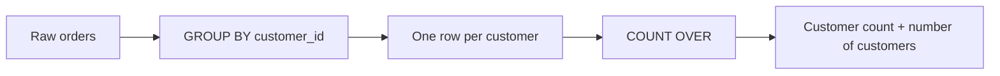

# 04- COUNT OVER

## Overview

`COUNT() OVER` applies counting as a window function while preserving the individual rows in the result set.

A regular aggregate collapses rows:

```sql
SELECT
    customer_id,
    COUNT(*) AS order_count
FROM orders
GROUP BY customer_id;
```

This returns one row per customer.

A windowed count preserves the order-level rows:

```sql
SELECT
    order_id,
    customer_id,
    COUNT(*) OVER (
        PARTITION BY customer_id
    ) AS customer_order_count
FROM orders;
```

Every order is returned, with the total number of orders for its customer attached to the row.

This makes `COUNT() OVER` particularly useful for:

- Group-level counts alongside detail records.
- Pagination metadata.
- Detecting duplicates.
- Comparing a row with its group population.
- Running and cumulative counts.
- Event and transaction analysis.
- Building analytical API responses without additional joins.

## Basic Syntax

The general form is:

```sql
COUNT(*) OVER (
    PARTITION BY partition_expression
    ORDER BY ordering_expression
    frame_clause
)
```

`COUNT` can count rows with `COUNT(*)`, or non-`NULL` values with `COUNT(expression)`.

| Component | Purpose |
|---|---|
| `COUNT(*)` | Counts rows in the window |
| `COUNT(column)` | Counts non-`NULL` values of the column |
| `OVER` | Converts the aggregate into a window calculation |
| `PARTITION BY` | Defines independent calculation groups |
| `ORDER BY` | Defines logical ordering for running counts |
| Frame clause | Restricts which ordered rows participate |

## `COUNT(*) OVER ()`

With an empty window specification, every row sees the total number of rows in the query result:

```sql
SELECT
    order_id,
    customer_id,
    amount,
    COUNT(*) OVER () AS total_orders
FROM orders;
```

If the query returns 10,000 rows, every row contains:

```text
total_orders = 10000
```

This is useful for pagination APIs.

```sql
SELECT
    order_id,
    created_at,
    amount,
    COUNT(*) OVER () AS total_count
FROM orders
WHERE status = 'completed'
ORDER BY created_at DESC, order_id DESC
LIMIT :limit
OFFSET :offset;
```

The application can return:

```json
{
  "items": [
    {
      "order_id": 1001,
      "amount": 125.00
    }
  ],
  "total_count": 4821
}
```

The count represents the rows visible to that query block after its filtering conditions.

### Important Pagination Limitation

`COUNT(*) OVER ()` counts the qualifying rows before `LIMIT` and `OFFSET` reduce the final result set.

That makes it useful for offset-pagination metadata, but the database may still need to process a large portion of the matching dataset.

For very large tables, cursor-based pagination and separate count strategies may provide better performance depending on product requirements.

## Partitioned Count

`PARTITION BY` calculates a separate count for each group:

```sql
SELECT
    order_id,
    customer_id,
    COUNT(*) OVER (
        PARTITION BY customer_id
    ) AS customer_order_count
FROM orders;
```

For:

| order_id | customer_id |
|---:|---:|
| 101 | 1 |
| 102 | 1 |
| 103 | 2 |
| 104 | 2 |
| 105 | 2 |

the result is:

| order_id | customer_id | customer_order_count |
|---:|---:|---:|
| 101 | 1 | 2 |
| 102 | 1 | 2 |
| 103 | 2 | 3 |
| 104 | 2 | 3 |
| 105 | 2 | 3 |

The original row grain remains unchanged.

## `COUNT(*)` vs `COUNT(column)`

This distinction is critical.

`COUNT(*)` counts rows:

```sql
COUNT(*) OVER (
    PARTITION BY customer_id
)
```

`COUNT(column)` counts only rows where that column is not `NULL`:

```sql
COUNT(shipped_at) OVER (
    PARTITION BY customer_id
)
```

Consider:

| order_id | customer_id | shipped_at |
|---:|---:|---|
| 101 | 1 | `2026-08-01` |
| 102 | 1 | `NULL` |
| 103 | 1 | `2026-08-03` |

Then:

```text
COUNT(*)        = 3
COUNT(shipped_at) = 2
```

This difference allows window counts to express business states without additional joins.

## Counting Rows vs Counting Non-NULL Values

Use the following mental model:

| Expression | Counts |
|---|---|
| `COUNT(*)` | Every row |
| `COUNT(id)` | Rows where `id IS NOT NULL` |
| `COUNT(status)` | Rows where `status IS NOT NULL` |
| `COUNT(DISTINCT customer_id)` | Distinct non-`NULL` customers |

For nullable columns, `COUNT(column)` is **not** equivalent to `COUNT(*)`.

## Conditional Counts

SQL does not require a separate window-function syntax for conditional counting.

In PostgreSQL, use `FILTER`:

```sql
SELECT
    customer_id,
    order_id,
    COUNT(*) OVER (
        PARTITION BY customer_id
    ) AS total_orders,
    COUNT(*) FILTER (
        WHERE status = 'completed'
    ) OVER (
        PARTITION BY customer_id
    ) AS completed_orders
FROM orders;
```

This produces multiple customer-level metrics alongside each order.

For databases without equivalent `FILTER` support, conditional expressions can be used where supported:

```sql
COUNT(
    CASE
        WHEN status = 'completed' THEN 1
    END
) OVER (
    PARTITION BY customer_id
) AS completed_orders
```

The exact syntax and optimizer behavior can vary by database engine.

## Running Count

Adding an `ORDER BY` makes the count order-sensitive.

```sql
SELECT
    order_id,
    customer_id,
    created_at,
    COUNT(*) OVER (
        PARTITION BY customer_id
        ORDER BY created_at, order_id
        ROWS BETWEEN UNBOUNDED PRECEDING AND CURRENT ROW
    ) AS order_number
FROM orders;
```

For one customer:

```text
Order A → 1
Order B → 2
Order C → 3
```

This can effectively assign a sequential position within each customer's ordered records.

It is often useful for:

- Customer order numbers.
- Event sequence numbers.
- Cumulative transactions.
- Operational event tracking.
- Progress calculations.

For simple row numbering, however, `ROW_NUMBER()` is usually more expressive:

```sql
ROW_NUMBER() OVER (
    PARTITION BY customer_id
    ORDER BY created_at, order_id
)
```

Use `COUNT() OVER` when the counting semantics themselves matter.

## Cumulative Count

A running count is a cumulative metric:

```sql
SELECT
    created_at,
    order_id,
    COUNT(*) OVER (
        ORDER BY created_at, order_id
        ROWS BETWEEN UNBOUNDED PRECEDING AND CURRENT ROW
    ) AS cumulative_order_count
FROM orders
ORDER BY created_at, order_id;
```

This produces:

| order_id | cumulative_order_count |
|---:|---:|
| 101 | 1 |
| 102 | 2 |
| 103 | 3 |
| 104 | 4 |

The frame explicitly includes all rows from the beginning through the current row.

## `ROWS` and `RANGE`

For cumulative counts, the choice between `ROWS` and `RANGE` can affect results when the ordering value contains ties.

Prefer deterministic ordering:

```sql
ORDER BY created_at, order_id
```

and an explicit row-based frame:

```sql
ROWS BETWEEN UNBOUNDED PRECEDING AND CURRENT ROW
```

This communicates that the calculation is intended to progress row by row.

If the ordering value is not unique, `RANGE` can treat peer rows with the same ordering value as a group. This can cause multiple rows to receive the same cumulative result.

## Counting Distinct Values

Some database engines support:

```sql
COUNT(DISTINCT customer_id) OVER (...)
```

but support and restrictions vary by SQL implementation.

When distinct window counts are unsupported or expensive, use a query boundary:

```sql
WITH customer_events AS (
    SELECT DISTINCT
        customer_id,
        DATE_TRUNC('day', created_at) AS event_day
    FROM events
)
SELECT
    event_day,
    customer_id,
    COUNT(*) OVER (
        PARTITION BY event_day
    ) AS active_customers
FROM customer_events;
```

The first query layer establishes uniqueness; the window function then counts the resulting rows.

This approach also makes the intended analytical grain explicit.

## Duplicate Detection

`COUNT() OVER` is a practical way to identify duplicate business keys.

Suppose email addresses should be unique:

```sql
SELECT
    user_id,
    email,
    COUNT(*) OVER (
        PARTITION BY email
    ) AS email_occurrences
FROM users;
```

Rows with:

```text
email_occurrences > 1
```

belong to a duplicated email group.

To return only duplicates:

```sql
WITH duplicate_check AS (
    SELECT
        user_id,
        email,
        COUNT(*) OVER (
            PARTITION BY email
        ) AS email_occurrences
    FROM users
)
SELECT
    user_id,
    email
FROM duplicate_check
WHERE email_occurrences > 1;
```

This is useful for data-quality analysis and migration validation.

For enforcing uniqueness in production, however, use a database constraint:

```sql
CREATE UNIQUE INDEX users_email_unique_idx
ON users (email);
```

A window query detects bad data; a constraint prevents it.

## Group Size and Percentage of Group

A common analytical pattern is combining `COUNT() OVER` with a total:

```sql
SELECT
    order_id,
    customer_id,
    status,
    COUNT(*) OVER (
        PARTITION BY customer_id
    ) AS customer_order_count
FROM orders;
```

This can be extended to calculate each row's proportion of its group:

```sql
SELECT
    order_id,
    customer_id,
    amount,
    amount / NULLIF(
        SUM(amount) OVER (
            PARTITION BY customer_id
        ),
        0
    ) AS order_amount_share
FROM orders;
```

For counts of categorical states:

```sql
SELECT
    order_id,
    customer_id,
    status,
    COUNT(*) FILTER (
        WHERE status = 'completed'
    ) OVER (
        PARTITION BY customer_id
    ) AS completed_order_count,
    COUNT(*) OVER (
        PARTITION BY customer_id
    ) AS total_order_count
FROM orders;
```

The resulting counts can be used to derive completion ratios without collapsing the order rows.

## `GROUP BY` vs `COUNT() OVER`

Consider:

```sql
SELECT
    customer_id,
    COUNT(*) AS order_count
FROM orders
GROUP BY customer_id;
```

This produces:

```text
one row per customer
```

Whereas:

```sql
SELECT
    order_id,
    customer_id,
    COUNT(*) OVER (
        PARTITION BY customer_id
    ) AS order_count
FROM orders;
```

produces:

```text
one row per order
```

| Requirement | `GROUP BY` | `COUNT() OVER` |
|---|---:|---:|
| One row per group | Yes | No |
| Preserve detail rows | No | Yes |
| Attach group count to each row | Requires join | Yes |
| Running count | No | Yes |
| Duplicate detection | Possible | Convenient |
| Pagination total | Requires separate query/strategy | Convenient |

The correct choice depends primarily on the required result grain.

## Combining `GROUP BY` and `COUNT() OVER`

Window functions can operate over grouped results.

For example:

```sql
SELECT
    customer_id,
    COUNT(*) AS order_count,
    COUNT(*) OVER () AS customers_in_result
FROM orders
GROUP BY customer_id;
```

The logical flow is:



Here:

- `COUNT(*)` counts orders for each customer.
- `COUNT(*) OVER ()` counts the resulting customer rows.

Therefore, `customers_in_result` is the number of customers, **not** the number of orders.

This is a common interview and production reasoning point: a window function operates over the rows produced by the query block.

## Filtering and Window Counts

Filtering affects which rows participate in a window calculation.

This query counts completed orders only:

```sql
SELECT
    order_id,
    customer_id,
    COUNT(*) OVER (
        PARTITION BY customer_id
    ) AS completed_order_count
FROM orders
WHERE status = 'completed';
```

If the requirement is:

> Show completed orders, but display each customer's total order count including pending and cancelled orders.

Use a query boundary:

```sql
WITH order_metrics AS (
    SELECT
        order_id,
        customer_id,
        status,
        COUNT(*) OVER (
            PARTITION BY customer_id
        ) AS total_order_count
    FROM orders
)
SELECT
    order_id,
    customer_id,
    status,
    total_order_count
FROM order_metrics
WHERE status = 'completed';
```

The inner query calculates the total across all orders. The outer query controls which rows are displayed.

This distinction is essential when implementing analytics in API endpoints.

## Pagination in Backend APIs

`COUNT(*) OVER ()` can eliminate a second count query in some offset-pagination designs:

```sql
SELECT
    order_id,
    created_at,
    amount,
    COUNT(*) OVER () AS total_count
FROM orders
WHERE
    tenant_id = :tenant_id
    AND status = 'completed'
ORDER BY
    created_at DESC,
    order_id DESC
LIMIT :limit
OFFSET :offset;
```

A FastAPI or Django service can read `total_count` from the first returned row.

However, if the page is empty, there is no row from which to obtain the count. A robust API may therefore still need a separate count strategy or another way to communicate an empty-result total.

For high-volume systems, avoid assuming that eliminating one SQL statement automatically improves performance. A single query that must process a large matching population can be more expensive than a carefully optimized alternative.

## Backend Example: Customer Order Analytics

A service endpoint may need to return each order together with customer-level statistics:

```sql
SELECT
    order_id,
    customer_id,
    created_at,
    amount,
    status,
    COUNT(*) OVER (
        PARTITION BY customer_id
    ) AS total_orders,
    COUNT(*) FILTER (
        WHERE status = 'completed'
    ) OVER (
        PARTITION BY customer_id
    ) AS completed_orders
FROM orders
WHERE tenant_id = :tenant_id
ORDER BY created_at DESC, order_id DESC;
```

This can support an API response such as:

```json
{
  "order_id": 10042,
  "amount": 249.00,
  "total_orders": 18,
  "completed_orders": 15
}
```

The SQL should be designed around the API's actual consistency and authorization requirements rather than simply minimizing the number of queries.

## Performance Considerations

Window counts can require the database to process a substantial number of rows.

Potential costs include:

- Large scans.
- Partition processing.
- Sorting for ordered windows.
- Memory consumption.
- Temporary disk usage.
- CPU consumption.

For PostgreSQL, inspect the execution plan:

```sql
EXPLAIN (ANALYZE, BUFFERS)
SELECT
    customer_id,
    order_id,
    COUNT(*) OVER (
        PARTITION BY customer_id
    ) AS customer_order_count
FROM orders
WHERE tenant_id = 42;
```

For ordered windows:

```sql
EXPLAIN (ANALYZE, BUFFERS)
SELECT
    customer_id,
    order_id,
    created_at,
    COUNT(*) OVER (
        PARTITION BY customer_id
        ORDER BY created_at, order_id
        ROWS BETWEEN UNBOUNDED PRECEDING AND CURRENT ROW
    ) AS running_order_count
FROM orders
WHERE tenant_id = 42;
```

Pay attention to:

- Actual row counts.
- Sort operations.
- Temporary file usage.
- Buffer reads.
- Execution time.
- Large partitions.

Indexes can improve filtering and may help with access paths, but an index does not guarantee that PostgreSQL will avoid sorting for every window query.

## Large Partitions

A single partition can become extremely large:

```sql
COUNT(*) OVER (
    PARTITION BY customer_id
)
```

For a customer with millions of records, the database must process a very large partition.

This is usually acceptable for offline analytics but can be problematic on synchronous API paths.

For high-volume systems, consider:

- Pre-aggregated counters.
- Summary tables.
- Materialized views.
- Read replicas.
- Background computation.
- Dedicated analytical databases.
- Caching where freshness requirements allow it.

For example:

```text
Transactional PostgreSQL
        │
        ├── Orders
        │
        └── Customer summary data
                 │
                 ▼
          Backend API
                 │
                 ▼
              Client
```

The right architecture depends on how frequently the count changes and how fresh the result must be.

## Security and Multi-Tenant Systems

A window function does not enforce authorization.

The rows entering the window determine the population being counted.

For tenant-scoped data:

```sql
SELECT
    order_id,
    customer_id,
    COUNT(*) OVER (
        PARTITION BY customer_id
    ) AS customer_order_count
FROM orders
WHERE tenant_id = :tenant_id;
```

The tenant restriction must be applied before the count is calculated if the count is intended to represent only that tenant's data.

This is especially important with:

```sql
COUNT(*) OVER ()
```

A global count can reveal the size of a dataset that the caller should not be able to observe.

Use:

- Parameterized queries.
- Centralized authorization-aware data access.
- Tenant predicates.
- Row-level security where appropriate.
- Tests that explicitly verify cross-tenant isolation.

## Common Mistakes

### Expecting `COUNT() OVER` to Collapse Rows

```sql
COUNT(*) OVER (
    PARTITION BY customer_id
)
```

does not produce one row per customer.

It annotates each order with the customer's count.

### Using `COUNT(column)` When You Mean Row Count

If the column is nullable:

```sql
COUNT(status)
```

does not count rows where `status` is `NULL`.

Use:

```sql
COUNT(*)
```

when every row should count.

### Counting the Wrong Population

This:

```sql
WHERE status = 'completed'
```

changes the rows visible to the window calculation.

Use a CTE or derived table when calculation and presentation populations differ.

### Using a Window Count to Enforce Uniqueness

A query such as:

```sql
COUNT(*) OVER (PARTITION BY email)
```

can identify duplicate emails, but it does not prevent future duplicates.

Use a `UNIQUE` constraint or unique index for enforcement.

### Assuming `COUNT(*) OVER ()` Is Always Cheap

Pagination queries may still need to process a large matching population to calculate the total count.

Benchmark large datasets rather than assuming the window function is free.

### Confusing Row Count With Distinct Count

If multiple rows represent the same customer:

```sql
COUNT(*) OVER ()
```

counts rows, not customers.

Establish the correct grain before counting.

### Using `COUNT() OVER` Instead of `ROW_NUMBER()`

For row sequencing:

```sql
ROW_NUMBER() OVER (
    PARTITION BY customer_id
    ORDER BY created_at, order_id
)
```

is usually clearer than using a running count.

Use the function that communicates the business intent.

### Omitting a Tie-Breaker

For running counts, use deterministic ordering:

```sql
ORDER BY created_at, order_id
```

rather than relying solely on a timestamp that may not be unique.

## Interview Traps

| Question | Correct answer |
|---|---|
| Does `COUNT() OVER` collapse rows? | No. It preserves the rows in its input. |
| What does `PARTITION BY` do? | Creates independent counting groups. |
| What does `COUNT(*)` count? | Every row in the window. |
| What does `COUNT(column)` count? | Non-`NULL` values of that column. |
| What does `COUNT(*) OVER ()` return? | The number of rows visible to that query block on every result row. |
| Can `COUNT() OVER` calculate a running count? | Yes, with `ORDER BY` and an appropriate frame. |
| Does window `ORDER BY` determine final result order? | No. Use a query-level `ORDER BY`. |
| Can `COUNT() OVER` detect duplicates? | Yes, by partitioning on the suspected duplicate key. |
| Does duplicate detection replace a unique constraint? | No. Constraints enforce uniqueness; queries detect violations. |
| Can `GROUP BY` and `COUNT() OVER` be combined? | Yes. The window operates over the grouped result of that query block. |
| Does `COUNT(*) OVER ()` count rows before or after `LIMIT`? | It counts the qualifying rows before `LIMIT` and `OFFSET` restrict the final returned rows. |
| Is `COUNT(*)` equivalent to `COUNT(column)`? | Only when the counted column cannot be `NULL`. |
| Does `COUNT(*) OVER (PARTITION BY customer_id)` count distinct customers? | No. It counts rows within each customer partition. |
| Can a window count leak information? | Yes. If unauthorized rows enter the window, aggregate values can expose information about them. |

## Production Best Practices

- Decide the required result-set grain before choosing between `GROUP BY` and `COUNT() OVER`.
- Use `COUNT(*)` when the requirement is to count rows.
- Use `COUNT(column)` intentionally when `NULL` values should be excluded.
- Use explicit `PARTITION BY` for group-scoped counts.
- Use deterministic ordering for running counts.
- Prefer explicit frames for order-sensitive calculations.
- Separate calculation scope from display filtering with CTEs or derived tables when necessary.
- Use window counts for duplicate detection, but enforce data integrity with database constraints.
- Establish uniqueness before using `COUNT(DISTINCT ...)` or equivalent analytical logic.
- Treat `COUNT(*) OVER ()` as a potential pagination optimization, not an automatic performance improvement.
- Inspect `EXPLAIN (ANALYZE, BUFFERS)` for large PostgreSQL queries.
- Keep tenant and authorization filters inside the query scope that feeds the window.
- Avoid expensive historical window calculations on synchronous request paths when pre-aggregation can satisfy the freshness requirement.
- Test `NULL` values, duplicate ordering keys, empty result sets, large partitions, tenant boundaries, and pagination edge cases.

## Key Takeaways

- **`COUNT() OVER` counts rows without collapsing the result set, making group-level and analytical counts available beside individual records.**
- **`COUNT(*)` counts rows, while `COUNT(column)` ignores `NULL` values; choosing the wrong form can silently change business metrics.**
- **`PARTITION BY` defines the counting population, while `ORDER BY` and the frame enable running and cumulative counts.**
- **Window counts operate on the rows visible to their query block, so filtering, query grain, and tenant boundaries directly affect correctness.**
- **Window counts are powerful for analytics and pagination, but large partitions and full-result counts can become expensive on production request paths.**