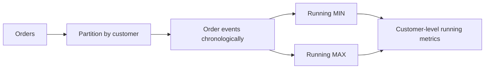
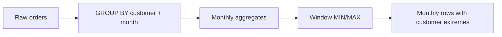

# 05- MIN and MAX OVER

## Overview

`MIN() OVER` and `MAX() OVER` apply minimum and maximum aggregation as window functions while preserving the original row-level result.

A regular aggregate collapses rows:

```sql
SELECT
    customer_id,
    MIN(created_at) AS first_order_at,
    MAX(created_at) AS latest_order_at
FROM orders
GROUP BY customer_id;
```

This produces one row per customer.

Windowed aggregates preserve the individual orders:

```sql
SELECT
    order_id,
    customer_id,
    created_at,
    MIN(created_at) OVER (
        PARTITION BY customer_id
    ) AS first_order_at,
    MAX(created_at) OVER (
        PARTITION BY customer_id
    ) AS latest_order_at
FROM orders;
```

Every order now carries the first and latest order timestamps for its customer.

This pattern is useful when a backend query needs both **detail-level records and group-level boundaries** without introducing an additional join.

Common applications include:

- First and latest customer activity.
- Minimum and maximum transaction values.
- Session boundaries.
- Lifecycle timestamps.
- Detecting whether a record is the first or latest event.
- Comparing each record against group-level extremes.
- Running minimum and maximum metrics.
- Operational and event-stream analysis.

## Basic Syntax

The general form is:

```sql
MIN(expression) OVER (
    PARTITION BY partition_expression
    ORDER BY ordering_expression
    frame_clause
)
```

and:

```sql
MAX(expression) OVER (
    PARTITION BY partition_expression
    ORDER BY ordering_expression
    frame_clause
)
```

The `OVER` clause determines the set of rows over which the aggregate is evaluated.

| Component | Purpose |
|---|---|
| `MIN(expression)` | Returns the minimum value in the window |
| `MAX(expression)` | Returns the maximum value in the window |
| `OVER` | Converts the aggregate into a window calculation |
| `PARTITION BY` | Creates independent calculation groups |
| `ORDER BY` | Makes the window order-sensitive |
| Frame clause | Restricts the rows considered for the calculation |

## `MIN() OVER` Without a Partition

Without `PARTITION BY`, the entire input result is one window:

```sql
SELECT
    order_id,
    amount,
    MIN(amount) OVER () AS minimum_order_amount,
    MAX(amount) OVER () AS maximum_order_amount
FROM orders;
```

Every returned row receives the minimum and maximum order amount across the entire input.

For example:

| order_id | amount | minimum_order_amount | maximum_order_amount |
|---:|---:|---:|---:|
| 101 | 100 | 50 | 500 |
| 102 | 500 | 50 | 500 |
| 103 | 50 | 50 | 500 |

This is useful when each row needs context about the overall result set.

## Partitioned Minimum and Maximum

`PARTITION BY` creates independent windows.

```sql
SELECT
    order_id,
    customer_id,
    amount,
    MIN(amount) OVER (
        PARTITION BY customer_id
    ) AS customer_min_amount,
    MAX(amount) OVER (
        PARTITION BY customer_id
    ) AS customer_max_amount
FROM orders;
```

For example:

| order_id | customer_id | amount | customer_min_amount | customer_max_amount |
|---:|---:|---:|---:|---:|
| 101 | 1 | 100 | 100 | 300 |
| 102 | 1 | 300 | 100 | 300 |
| 103 | 2 | 50 | 50 | 500 |
| 104 | 2 | 500 | 50 | 500 |

The rows remain at order level while the calculations operate at customer level.

This is one of the main reasons window functions are valuable in backend analytics: **the calculation grain and output grain do not have to be the same.**

## Minimum and Maximum Timestamps

`MIN()` and `MAX()` are particularly useful for lifecycle and event data.

```sql
SELECT
    event_id,
    user_id,
    event_type,
    created_at,
    MIN(created_at) OVER (
        PARTITION BY user_id
    ) AS first_event_at,
    MAX(created_at) OVER (
        PARTITION BY user_id
    ) AS latest_event_at
FROM user_events;
```

This provides the boundaries of each user's activity directly alongside every event.

A service can use these values to derive metrics such as:

```sql
MAX(created_at) OVER (
    PARTITION BY user_id
) - MIN(created_at) OVER (
    PARTITION BY user_id
) AS activity_duration
```

The exact expression for timestamp arithmetic varies across SQL engines.

## Identifying the First and Latest Record

`MIN()` and `MAX()` can identify boundary values, but they do not directly return the row associated with those values.

For example:

```sql
SELECT
    order_id,
    customer_id,
    created_at,
    MIN(created_at) OVER (
        PARTITION BY customer_id
    ) AS first_order_at,
    MAX(created_at) OVER (
        PARTITION BY customer_id
    ) AS latest_order_at
FROM orders;
```

You can then compare:

```sql
CASE
    WHEN created_at = MIN(created_at) OVER (
        PARTITION BY customer_id
    )
    THEN TRUE
    ELSE FALSE
END AS is_first_order
```

However, if multiple orders have the same timestamp, more than one row may qualify.

When the requirement is specifically:

> Return exactly one first row per customer.

`ROW_NUMBER()` is usually more appropriate:

```sql
ROW_NUMBER() OVER (
    PARTITION BY customer_id
    ORDER BY created_at, order_id
) AS order_position
```

This allows a deterministic tie-breaker.

## `MIN/MAX` vs `FIRST_VALUE/LAST_VALUE`

`MIN()` and `MAX()` answer value-extreme questions:

> What is the smallest or largest value?

`FIRST_VALUE()` and `LAST_VALUE()` answer positional questions:

> What value belongs to the first or last row in this ordering?

For example:

```sql
SELECT
    order_id,
    customer_id,
    created_at,
    amount,
    MIN(amount) OVER (
        PARTITION BY customer_id
    ) AS minimum_amount,
    FIRST_VALUE(amount) OVER (
        PARTITION BY customer_id
        ORDER BY created_at, order_id
    ) AS first_order_amount
FROM orders;
```

These are not interchangeable.

| Requirement | Preferred function |
|---|---|
| Smallest amount | `MIN()` |
| Largest amount | `MAX()` |
| Amount from first chronological row | `FIRST_VALUE()` |
| Amount from last chronological row | `LAST_VALUE()` with correct frame |
| First row position | `ROW_NUMBER()` |

The distinction becomes important when the minimum or maximum value does not belong to the first or last row chronologically.

## Running Minimum

Adding `ORDER BY` makes the window order-sensitive.

```sql
SELECT
    order_id,
    created_at,
    amount,
    MIN(amount) OVER (
        ORDER BY created_at, order_id
        ROWS BETWEEN UNBOUNDED PRECEDING AND CURRENT ROW
    ) AS running_min_amount
FROM orders
ORDER BY created_at, order_id;
```

If the amounts arrive as:

```text
100
75
120
50
80
```

the running minimum is:

```text
100
75
75
50
50
```

The calculation asks:

> What is the smallest amount encountered up to this row?

This is useful for:

- Running financial metrics.
- Monitoring thresholds.
- Minimum observed latency.
- Minimum inventory.
- Time-series analysis.

## Running Maximum

The equivalent running maximum is:

```sql
SELECT
    order_id,
    created_at,
    amount,
    MAX(amount) OVER (
        ORDER BY created_at, order_id
        ROWS BETWEEN UNBOUNDED PRECEDING AND CURRENT ROW
    ) AS running_max_amount
FROM orders
ORDER BY created_at, order_id;
```

For:

```text
100
75
120
50
150
```

the running maximum is:

```text
100
100
120
120
150
```

This is commonly used for:

- Peak values over time.
- High-water marks.
- Maximum observed latency.
- Highest account balance observed so far.
- Operational threshold analysis.

## Partitioned Running Minimum and Maximum

The same concept applies independently per entity:

```sql
SELECT
    customer_id,
    order_id,
    created_at,
    amount,
    MIN(amount) OVER (
        PARTITION BY customer_id
        ORDER BY created_at, order_id
        ROWS BETWEEN UNBOUNDED PRECEDING AND CURRENT ROW
    ) AS running_min_amount,
    MAX(amount) OVER (
        PARTITION BY customer_id
        ORDER BY created_at, order_id
        ROWS BETWEEN UNBOUNDED PRECEDING AND CURRENT ROW
    ) AS running_max_amount
FROM orders
ORDER BY customer_id, created_at, order_id;
```

Conceptually:



Each customer's history is processed independently.

## Window Frames Matter

When `ORDER BY` is present, the frame determines which ordered rows participate in the calculation.

For a running minimum, an explicit row-based frame is clear:

```sql
ROWS BETWEEN UNBOUNDED PRECEDING AND CURRENT ROW
```

It means:

```text
start at the first row
        ↓
include every preceding row
        ↓
include current row
```

Without an explicit frame, the database's default frame rules apply, and those rules can differ in important ways depending on the database and expression.

For production queries, explicit frames are often preferable when the intended semantics are cumulative.

## `ROWS` vs `RANGE`

Consider:

```sql
ORDER BY created_at
```

If multiple rows share the same `created_at`, they are peers for `RANGE`-based semantics.

A row-based frame:

```sql
ROWS BETWEEN UNBOUNDED PRECEDING AND CURRENT ROW
```

advances one physical row at a time.

A range-based frame can include peer rows sharing the same ordering value.

For deterministic running metrics, prefer a stable ordering:

```sql
ORDER BY created_at, order_id
```

and use:

```sql
ROWS BETWEEN UNBOUNDED PRECEDING AND CURRENT ROW
```

when the business meaning is explicitly row-by-row accumulation.

## NULL Handling

`MIN()` and `MAX()` generally ignore `NULL` values.

Given:

| order_id | amount |
|---:|---:|
| 101 | 100 |
| 102 | `NULL` |
| 103 | 50 |

then:

```sql
MIN(amount) OVER ()
```

returns:

```text
50
```

not `NULL`.

Likewise:

```sql
MAX(amount) OVER ()
```

returns:

```text
100
```

If all values in a window are `NULL`, the result is `NULL`.

This matters when `NULL` has business meaning such as:

- Unknown.
- Not measured.
- Not applicable.
- Not yet processed.

Do not automatically convert `NULL` to zero unless zero is semantically correct.

## Conditional Minimum and Maximum

PostgreSQL supports `FILTER` with aggregate window functions:

```sql
SELECT
    order_id,
    customer_id,
    amount,
    MIN(amount) FILTER (
        WHERE status = 'completed'
    ) OVER (
        PARTITION BY customer_id
    ) AS min_completed_amount,
    MAX(amount) FILTER (
        WHERE status = 'completed'
    ) OVER (
        PARTITION BY customer_id
    ) AS max_completed_amount
FROM orders;
```

This allows several related metrics to be calculated over the same logical partition.

Where `FILTER` is unavailable, use conditional expressions supported by the target database:

```sql
MIN(
    CASE
        WHEN status = 'completed' THEN amount
    END
) OVER (
    PARTITION BY customer_id
) AS min_completed_amount
```

Database-specific behavior should be verified before using these expressions in portable SQL libraries.

## Comparing Each Row With Group Extremes

A common analytical pattern is comparing the current row against its group's minimum and maximum.

```sql
SELECT
    order_id,
    customer_id,
    amount,
    MIN(amount) OVER (
        PARTITION BY customer_id
    ) AS customer_min_amount,
    MAX(amount) OVER (
        PARTITION BY customer_id
    ) AS customer_max_amount,
    amount - MIN(amount) OVER (
        PARTITION BY customer_id
    ) AS distance_from_min
FROM orders;
```

You can also classify rows:

```sql
CASE
    WHEN amount = MAX(amount) OVER (
        PARTITION BY customer_id
    )
    THEN 'maximum'
    WHEN amount = MIN(amount) OVER (
        PARTITION BY customer_id
    )
    THEN 'minimum'
    ELSE 'middle'
END AS amount_position
```

Again, ties can cause multiple rows to be classified as minimum or maximum.

## Grouped Results and Windowed MIN/MAX

Window functions operate on the rows produced by their query block.

Therefore, they can be combined with `GROUP BY`:

```sql
SELECT
    customer_id,
    DATE_TRUNC('month', created_at) AS order_month,
    SUM(amount) AS monthly_revenue,
    MIN(SUM(amount)) OVER (
        PARTITION BY customer_id
    ) AS lowest_monthly_revenue,
    MAX(SUM(amount)) OVER (
        PARTITION BY customer_id
    ) AS highest_monthly_revenue
FROM orders
GROUP BY
    customer_id,
    DATE_TRUNC('month', created_at);
```

The processing conceptually becomes:



The `MIN()` and `MAX()` window functions operate over the grouped monthly rows, not directly over individual orders.

This distinction is important when reasoning about query grain.

## Production Example: Customer Order Lifecycle

Suppose an API needs to return each customer's orders along with lifecycle boundaries:

```sql
SELECT
    order_id,
    customer_id,
    status,
    created_at,
    updated_at,
    MIN(created_at) OVER (
        PARTITION BY customer_id
    ) AS first_order_at,
    MAX(updated_at) OVER (
        PARTITION BY customer_id
    ) AS latest_order_activity_at
FROM orders
WHERE tenant_id = :tenant_id
ORDER BY created_at DESC, order_id DESC;
```

The API can use these fields to display customer-level activity context without performing another aggregation query.

The important production property is that the tenant predicate is applied to the input population:

```sql
WHERE tenant_id = :tenant_id
```

This prevents the window from calculating values across other tenants.

## Production Example: Price Range

For a product catalog, a query might expose the minimum and maximum price within each category:

```sql
SELECT
    product_id,
    category_id,
    name,
    price,
    MIN(price) OVER (
        PARTITION BY category_id
    ) AS category_min_price,
    MAX(price) OVER (
        PARTITION BY category_id
    ) AS category_max_price
FROM products
WHERE
    tenant_id = :tenant_id
    AND is_active = TRUE;
```

The result can support category-level UI or API metadata while retaining individual products.

Be careful about the filtering semantics: inactive products are excluded from the calculation. If the business requirement is to calculate the price range across all products but display only active products, use a query boundary.

```sql
WITH product_metrics AS (
    SELECT
        product_id,
        category_id,
        name,
        price,
        is_active,
        MIN(price) OVER (
            PARTITION BY category_id
        ) AS category_min_price,
        MAX(price) OVER (
            PARTITION BY category_id
        ) AS category_max_price
    FROM products
    WHERE tenant_id = :tenant_id
)
SELECT
    product_id,
    category_id,
    name,
    price,
    category_min_price,
    category_max_price
FROM product_metrics
WHERE is_active = TRUE;
```

## Performance Considerations

Windowed `MIN()` and `MAX()` can be efficient, but performance depends on:

- Number of input rows.
- Partition cardinality.
- Partition size.
- Required sorting.
- Filtering selectivity.
- Database execution strategy.
- Available indexes.
- Memory available to the query.

For PostgreSQL, inspect the execution plan:

```sql
EXPLAIN (ANALYZE, BUFFERS)
SELECT
    customer_id,
    order_id,
    amount,
    MIN(amount) OVER (
        PARTITION BY customer_id
    ) AS customer_min_amount,
    MAX(amount) OVER (
        PARTITION BY customer_id
    ) AS customer_max_amount
FROM orders
WHERE tenant_id = 42;
```

For running calculations:

```sql
EXPLAIN (ANALYZE, BUFFERS)
SELECT
    customer_id,
    order_id,
    created_at,
    amount,
    MIN(amount) OVER (
        PARTITION BY customer_id
        ORDER BY created_at, order_id
        ROWS BETWEEN UNBOUNDED PRECEDING AND CURRENT ROW
    ) AS running_min_amount
FROM orders
WHERE tenant_id = 42;
```

Look for:

- Large sorts.
- High actual row counts.
- Temporary file usage.
- Excessive buffer reads.
- Long execution times.
- Very large partitions.

Indexes can improve filtering and sometimes provide useful ordering, but the optimizer decides whether an index-based plan is cheaper than another strategy.

## Large Partitions

A query such as:

```sql
MAX(created_at) OVER (
    PARTITION BY customer_id
)
```

can become expensive when individual customers have millions of events.

For synchronous API requests, repeatedly calculating historical extremes over large datasets may be inappropriate.

Possible alternatives include:

- Customer summary tables.
- Materialized views.
- Incrementally maintained aggregates.
- Read replicas.
- Background jobs.
- Precomputed metrics.
- Analytical storage for large historical datasets.

For example:

```text
Orders / Events
      │
      ▼
Aggregation Pipeline
      │
      ▼
Customer Summary
      │
      ├── first_order_at
      ├── latest_order_at
      ├── min_order_amount
      └── max_order_amount
      │
      ▼
Backend API
```

A precomputed value is often preferable when:

- The metric is requested frequently.
- The underlying history is large.
- Exact real-time calculation is unnecessary.
- The metric can tolerate bounded staleness.

The trade-off is additional write/update complexity and consistency management.

## Security Considerations

`MIN()` and `MAX()` do not provide authorization boundaries.

They operate on whichever rows reach the window.

A query such as:

```sql
MAX(amount) OVER (
    PARTITION BY customer_id
)
```

can expose a value derived from rows the caller should not be able to see if authorization filtering is applied incorrectly.

For multi-tenant applications:

```sql
SELECT
    order_id,
    customer_id,
    amount,
    MIN(amount) OVER (
        PARTITION BY customer_id
    ) AS customer_min_amount,
    MAX(amount) OVER (
        PARTITION BY customer_id
    ) AS customer_max_amount
FROM orders
WHERE tenant_id = :tenant_id;
```

Use:

- Parameterized queries.
- Explicit tenant predicates.
- Centralized authorization rules.
- Row-level security where appropriate.
- Tests for cross-tenant isolation.

Aggregate-derived values can themselves become information disclosures, even when the underlying rows are not returned.

## Common Mistakes

### Confusing `MIN()` With the First Row

This:

```sql
MIN(amount) OVER (
    PARTITION BY customer_id
)
```

returns the smallest amount.

It does not return the amount from the customer's first order.

Use `FIRST_VALUE()` when the requirement is positional.

### Confusing `MAX()` With the Latest Row

This:

```sql
MAX(amount) OVER (
    PARTITION BY customer_id
)
```

returns the largest amount.

It does not return the amount from the latest order.

Use an ordered positional function when the requirement is based on chronology.

### Ignoring Ties

This condition:

```sql
amount = MAX(amount) OVER (
    PARTITION BY customer_id
)
```

can be true for multiple rows.

If exactly one row is required, establish deterministic ordering with `ROW_NUMBER()`.

### Forgetting NULL Semantics

`MIN()` and `MAX()` ignore `NULL` values.

Do not assume a `NULL` input causes the entire window result to become `NULL`.

### Filtering the Wrong Population

This:

```sql
WHERE is_active = TRUE
```

means inactive records do not participate in the window calculation.

If inactive records should influence the minimum or maximum while remaining hidden from the output, calculate the window in an inner query and filter outside it.

### Using a Running Frame When a Group Extreme Is Required

This:

```sql
MAX(amount) OVER (
    PARTITION BY customer_id
    ORDER BY created_at
)
```

is order-sensitive and can represent a cumulative maximum rather than the final maximum for the entire partition, depending on the frame semantics.

If the requirement is the overall partition maximum, omit `ORDER BY`:

```sql
MAX(amount) OVER (
    PARTITION BY customer_id
)
```

### Using Window Aggregates for Data Integrity

A window query can identify extreme or anomalous values, but it does not enforce business constraints.

Use:

- `CHECK` constraints.
- `UNIQUE` constraints.
- Foreign keys.
- Application validation.

where enforcement is required.

### Assuming One Query Is Always Faster

Replacing two queries with one window query does not automatically improve performance.

Measure actual execution behavior on production-scale data.

## Interview Traps

| Question | Correct answer |
|---|---|
| Does `MIN() OVER` collapse rows? | No. It preserves the input row grain. |
| What does `PARTITION BY` do? | Creates independent calculation windows. |
| Does `MIN(amount)` mean the first amount chronologically? | No. It means the smallest amount. |
| Does `MAX(amount)` mean the latest record? | No. It means the largest value. |
| How do you get the value from the first chronological row? | Use `FIRST_VALUE()` with deterministic ordering. |
| Can multiple rows have the partition maximum? | Yes. Ties are possible. |
| What happens to `NULL` values? | `MIN()` and `MAX()` generally ignore them. |
| Can `MIN()` and `MAX()` calculate running values? | Yes, with `ORDER BY` and an appropriate frame. |
| Does window `ORDER BY` determine final output order? | No. Use the query-level `ORDER BY`. |
| Can `MIN/MAX OVER` work after `GROUP BY`? | Yes. The window operates over the grouped rows produced by the query block. |
| Does filtering affect a window calculation? | Yes. The window sees rows available at its query stage. |
| Is `MAX()` equivalent to `LAST_VALUE()`? | No. `MAX()` finds the largest value; `LAST_VALUE()` uses row position. |
| Can `MIN/MAX OVER` expose unauthorized information? | Yes. Aggregate-derived values can reveal information about rows included in the window. |
| Is a window aggregate always cheaper than a separate aggregate query? | No. Performance depends on data volume, plan, sorting, and access patterns. |

## Best Practices

- Decide whether the requirement is **value-based** or **position-based** before choosing the function.
- Use `MIN()` and `MAX()` for value extremes.
- Use `FIRST_VALUE()`, `LAST_VALUE()`, or `ROW_NUMBER()` for positional requirements.
- Use `PARTITION BY` to define entity-specific calculation boundaries.
- Use explicit frames for cumulative calculations.
- Use deterministic ordering such as `created_at, order_id` when row order matters.
- Treat `NULL` semantics explicitly in business-critical metrics.
- Use CTEs or derived tables when calculation scope differs from display scope.
- Keep tenant and authorization predicates in the query layer feeding the window.
- Inspect execution plans for large partitions and ordered windows.
- Prefer precomputed aggregates when frequently requested historical metrics become expensive.
- Do not use analytical queries as substitutes for database integrity constraints.
- Test ties, `NULL` values, empty partitions, large partitions, filtering boundaries, and tenant isolation.

## Key Takeaways

- **`MIN() OVER` and `MAX() OVER` calculate value extremes while preserving individual rows, unlike regular grouped aggregates.**
- **`MIN/MAX` are value-based functions; they do not mean first or latest row. Use positional window functions when chronology matters.**
- **`PARTITION BY` defines the calculation population, while `ORDER BY` and window frames enable running minimum and maximum values.**
- **Filtering, `NULL` handling, ties, and query grain directly affect correctness and must be considered explicitly in production queries.**
- **Windowed extremes are powerful for analytical APIs, but large partitions and repeated historical calculations may justify precomputed summaries.**