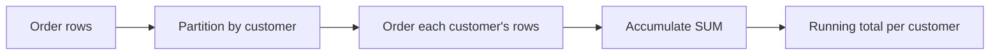
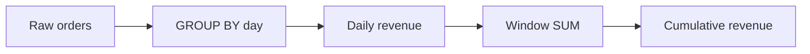

# 06- Running Totals

## Overview

A **running total** is a cumulative aggregate calculated over an ordered sequence of rows. Instead of collapsing rows like `GROUP BY`, a windowed aggregate returns the cumulative value alongside every row.

The standard pattern is:

```sql
SUM(amount) OVER (
    ORDER BY created_at, order_id
    ROWS BETWEEN UNBOUNDED PRECEDING AND CURRENT ROW
)
```

For transaction amounts:

| order_id | amount | running_total |
|---:|---:|---:|
| 101 | 100 | 100 |
| 102 | 250 | 350 |
| 103 | 75 | 425 |
| 104 | 300 | 725 |

Running totals are common in backend systems for:

- Account and wallet balances.
- Cumulative revenue.
- Usage quotas.
- Inventory movement.
- Cumulative event counts.
- Time-series reporting.
- Customer spending.
- Operational dashboards.

The critical idea is that **`ORDER BY` defines the sequence and the window frame defines which preceding rows contribute to the current result**.

## Basic Syntax

The canonical form is:

```sql
SUM(value) OVER (
    ORDER BY ordering_column
    ROWS BETWEEN UNBOUNDED PRECEDING AND CURRENT ROW
)
```

For entity-specific totals:

```sql
SUM(value) OVER (
    PARTITION BY entity_id
    ORDER BY ordering_column
    ROWS BETWEEN UNBOUNDED PRECEDING AND CURRENT ROW
)
```

| Clause | Role |
|---|---|
| `SUM(value)` | Aggregate being accumulated |
| `OVER` | Makes the aggregate a window function |
| `PARTITION BY` | Starts an independent running total for each group |
| `ORDER BY` | Defines cumulative order |
| `ROWS BETWEEN ...` | Defines which rows participate in the current calculation |

## Why Running Totals Require an Order

A cumulative calculation has no meaning without an ordering.

This:

```sql
SUM(amount) OVER ()
```

calculates the total over the entire result set, but it is **not a running total**.

A running total requires:

```sql
SUM(amount) OVER (
    ORDER BY created_at, order_id
    ROWS BETWEEN UNBOUNDED PRECEDING AND CURRENT ROW
)
```

The database can then interpret each row as:

```text
Current row
    ↑
All preceding rows
    ↑
First row
```

The result is cumulative rather than constant.

## Basic Running Total

Consider an `orders` table:

```sql
CREATE TABLE orders (
    order_id BIGINT PRIMARY KEY,
    customer_id BIGINT NOT NULL,
    amount NUMERIC(12, 2) NOT NULL,
    created_at TIMESTAMPTZ NOT NULL
);
```

A cumulative revenue calculation is:

```sql
SELECT
    order_id,
    created_at,
    amount,
    SUM(amount) OVER (
        ORDER BY created_at, order_id
        ROWS BETWEEN UNBOUNDED PRECEDING AND CURRENT ROW
    ) AS running_revenue
FROM orders
ORDER BY created_at, order_id;
```

The explicit `order_id` tie-breaker makes the ordering deterministic when multiple orders have the same timestamp.

## Partitioned Running Totals

For customer-specific cumulative spending:

```sql
SELECT
    order_id,
    customer_id,
    created_at,
    amount,
    SUM(amount) OVER (
        PARTITION BY customer_id
        ORDER BY created_at, order_id
        ROWS BETWEEN UNBOUNDED PRECEDING AND CURRENT ROW
    ) AS customer_running_spend
FROM orders
ORDER BY customer_id, created_at, order_id;
```

Each customer gets an independent cumulative sequence.

For example:

| customer_id | order_id | amount | customer_running_spend |
|---:|---:|---:|---:|
| 1 | 101 | 100 | 100 |
| 1 | 102 | 250 | 350 |
| 1 | 103 | 75 | 425 |
| 2 | 104 | 300 | 300 |
| 2 | 105 | 50 | 350 |

Conceptually:



## Window Frame

The following frame:

```sql
ROWS BETWEEN UNBOUNDED PRECEDING AND CURRENT ROW
```

means:

> Start at the first row in the window and include every row through the current row.

For rows:

```text
100
250
75
300
```

the calculation is effectively:

```text
100
100 + 250
100 + 250 + 75
100 + 250 + 75 + 300
```

producing:

```text
100
350
425
725
```

An explicit frame makes the intended cumulative semantics obvious and avoids relying on database-specific default-frame behavior.

## `ROWS` vs `RANGE`

This distinction becomes important when ordering values contain duplicates.

Consider:

```sql
ORDER BY created_at
```

where several orders have the same timestamp.

A `ROWS` frame operates on physical rows:

```sql
ROWS BETWEEN UNBOUNDED PRECEDING AND CURRENT ROW
```

A `RANGE` frame groups peer rows with equivalent ordering values according to the database's window-frame semantics.

For production running totals, a deterministic order is generally preferable:

```sql
ORDER BY created_at, order_id
```

and an explicit row-based frame:

```sql
ROWS BETWEEN UNBOUNDED PRECEDING AND CURRENT ROW
```

This makes the cumulative sequence unambiguous.

## Running Total by Date

For daily revenue:

```sql
SELECT
    order_date,
    daily_revenue,
    SUM(daily_revenue) OVER (
        ORDER BY order_date
        ROWS BETWEEN UNBOUNDED PRECEDING AND CURRENT ROW
    ) AS cumulative_revenue
FROM daily_revenue
ORDER BY order_date;
```

The source data is already at daily grain, so the window operates over one row per day.

This is usually cleaner than applying the running calculation directly to raw orders when the API only needs daily metrics.

## Combining `GROUP BY` With Running Totals

A common production pattern is:

1. Aggregate raw events into a business time bucket.
2. Apply a window function to the aggregated result.

For example:

```sql
SELECT
    DATE_TRUNC('day', created_at) AS order_date,
    SUM(amount) AS daily_revenue,
    SUM(SUM(amount)) OVER (
        ORDER BY DATE_TRUNC('day', created_at)
        ROWS BETWEEN UNBOUNDED PRECEDING AND CURRENT ROW
    ) AS cumulative_revenue
FROM orders
GROUP BY DATE_TRUNC('day', created_at)
ORDER BY order_date;
```

The important point is the nested aggregation:

```sql
SUM(SUM(amount)) OVER (...)
```

The inner `SUM(amount)` calculates daily revenue.

The outer windowed `SUM(...) OVER` calculates cumulative revenue across those daily rows.

Conceptually:



## Running Total by Customer and Month

If the business requirement is a monthly customer total that resets each month:

```sql
SELECT
    customer_id,
    DATE_TRUNC('month', created_at) AS month,
    order_id,
    amount,
    SUM(amount) OVER (
        PARTITION BY
            customer_id,
            DATE_TRUNC('month', created_at)
        ORDER BY created_at, order_id
        ROWS BETWEEN UNBOUNDED PRECEDING AND CURRENT ROW
    ) AS monthly_running_spend
FROM orders
ORDER BY
    customer_id,
    month,
    created_at,
    order_id;
```

The partition now represents:

```text
customer + month
```

so the running total resets at the beginning of every month.

## Running Total vs Grouped Total

These queries have fundamentally different output grains.

### Grouped aggregate

```sql
SELECT
    customer_id,
    SUM(amount) AS total_spend
FROM orders
GROUP BY customer_id;
```

One row per customer.

### Windowed aggregate

```sql
SELECT
    order_id,
    customer_id,
    amount,
    SUM(amount) OVER (
        PARTITION BY customer_id
    ) AS total_customer_spend
FROM orders;
```

One row per order.

### Running windowed aggregate

```sql
SELECT
    order_id,
    customer_id,
    created_at,
    amount,
    SUM(amount) OVER (
        PARTITION BY customer_id
        ORDER BY created_at, order_id
        ROWS BETWEEN UNBOUNDED PRECEDING AND CURRENT ROW
    ) AS running_customer_spend
FROM orders;
```

One row per order, with a cumulative value.

| Query | Output grain | Calculation |
|---|---|---|
| `GROUP BY` + `SUM` | Customer | Final total |
| `SUM() OVER (PARTITION BY ...)` | Order | Customer total repeated |
| `SUM() OVER (PARTITION BY ... ORDER BY ...)` | Order | Running customer total |

## Running Balance

Running totals are often used to calculate balances.

Suppose transactions contain credits and debits:

```sql
CREATE TABLE account_transactions (
    transaction_id BIGINT PRIMARY KEY,
    account_id BIGINT NOT NULL,
    amount NUMERIC(14, 2) NOT NULL,
    created_at TIMESTAMPTZ NOT NULL
);
```

Credits can be positive and debits negative:

```text
+500
-100
-50
+200
```

A running balance is:

```sql
SELECT
    transaction_id,
    account_id,
    created_at,
    amount,
    SUM(amount) OVER (
        PARTITION BY account_id
        ORDER BY created_at, transaction_id
        ROWS BETWEEN UNBOUNDED PRECEDING AND CURRENT ROW
    ) AS running_balance
FROM account_transactions
ORDER BY account_id, created_at, transaction_id;
```

Result:

| transaction_id | amount | running_balance |
|---:|---:|---:|
| 1 | 500 | 500 |
| 2 | -100 | 400 |
| 3 | -50 | 350 |
| 4 | 200 | 550 |

The `transaction_id` tie-breaker is particularly important for financial data.

## Running Balance With an Opening Balance

If an account has a known opening balance:

```sql
SELECT
    transaction_id,
    account_id,
    created_at,
    amount,
    :opening_balance
    + SUM(amount) OVER (
        PARTITION BY account_id
        ORDER BY created_at, transaction_id
        ROWS BETWEEN UNBOUNDED PRECEDING AND CURRENT ROW
    ) AS running_balance
FROM account_transactions
WHERE account_id = :account_id
ORDER BY created_at, transaction_id;
```

The application should bind `:opening_balance` as a parameter rather than constructing SQL dynamically.

For financial systems, do not confuse this reporting calculation with the authoritative account balance used for transactional authorization.

## Running Total With Filtering

Window functions operate over the rows available to their query block.

For example:

```sql
SELECT
    order_id,
    created_at,
    amount,
    SUM(amount) OVER (
        ORDER BY created_at, order_id
        ROWS BETWEEN UNBOUNDED PRECEDING AND CURRENT ROW
    ) AS running_total
FROM orders
WHERE status = 'completed'
ORDER BY created_at, order_id;
```

Only completed orders participate in the running total.

If the requirement is:

> Display completed orders, but calculate the cumulative total across all orders.

the calculation must happen before the final filtering:

```sql
WITH ordered_orders AS (
    SELECT
        order_id,
        created_at,
        amount,
        status,
        SUM(amount) OVER (
            ORDER BY created_at, order_id
            ROWS BETWEEN UNBOUNDED PRECEDING AND CURRENT ROW
        ) AS running_total
    FROM orders
)
SELECT
    order_id,
    created_at,
    amount,
    status,
    running_total
FROM ordered_orders
WHERE status = 'completed'
ORDER BY created_at, order_id;
```

This query distinction is critical when building reporting APIs.

## Running Totals and Date Filters

Consider:

```sql
SELECT
    order_date,
    amount,
    SUM(amount) OVER (
        ORDER BY order_date
        ROWS BETWEEN UNBOUNDED PRECEDING AND CURRENT ROW
    ) AS running_total
FROM orders
WHERE order_date >= DATE '2026-01-01';
```

The running total starts at January 1 because earlier rows were removed before the window calculation.

That may or may not be what the business requirement means.

If the API needs a January report showing cumulative revenue from the beginning of the business's lifetime, calculate the historical running total first and filter afterward:

```sql
WITH cumulative_orders AS (
    SELECT
        order_id,
        order_date,
        amount,
        SUM(amount) OVER (
            ORDER BY order_date, order_id
            ROWS BETWEEN UNBOUNDED PRECEDING AND CURRENT ROW
        ) AS running_total
    FROM orders
)
SELECT
    order_id,
    order_date,
    amount,
    running_total
FROM cumulative_orders
WHERE order_date >= DATE '2026-01-01'
ORDER BY order_date, order_id;
```

This is a common source of subtle reporting bugs.

## Running Totals and `NULL`

`SUM()` generally ignores `NULL` values.

Given:

| amount |
|---:|
| 100 |
| `NULL` |
| 50 |

a running sum behaves as though the `NULL` value contributes nothing:

```text
100
100
150
```

However, `NULL` can still matter semantically.

A missing transaction amount may mean:

- Unknown amount.
- Data ingestion failure.
- Not applicable.
- Incomplete event.

Do not blindly replace `NULL` with zero unless the business meaning supports that interpretation.

If required:

```sql
SUM(COALESCE(amount, 0)) OVER (
    ORDER BY created_at, transaction_id
    ROWS BETWEEN UNBOUNDED PRECEDING AND CURRENT ROW
)
```

## Running Counts

The same pattern applies to counts.

For cumulative order count:

```sql
COUNT(*) OVER (
    ORDER BY created_at, order_id
    ROWS BETWEEN UNBOUNDED PRECEDING AND CURRENT ROW
) AS cumulative_order_count
```

For customer-specific counts:

```sql
COUNT(*) OVER (
    PARTITION BY customer_id
    ORDER BY created_at, order_id
    ROWS BETWEEN UNBOUNDED PRECEDING AND CURRENT ROW
) AS customer_order_count
```

This is useful for metrics such as:

- Number of events processed.
- Number of orders placed.
- Customer purchase sequence.
- Cumulative registrations.

## Running Average

Running totals can be combined with other window aggregates.

For example:

```sql
SELECT
    order_id,
    created_at,
    amount,
    SUM(amount) OVER (
        ORDER BY created_at, order_id
        ROWS BETWEEN UNBOUNDED PRECEDING AND CURRENT ROW
    ) AS running_total,
    AVG(amount) OVER (
        ORDER BY created_at, order_id
        ROWS BETWEEN UNBOUNDED PRECEDING AND CURRENT ROW
    ) AS running_average
FROM orders
ORDER BY created_at, order_id;
```

The running average is not calculated from the final total. It is a separate cumulative window calculation.

## Running Total With a Reset Condition

Some business metrics reset when a category or state changes.

For example, a cumulative total may reset by customer and month:

```sql
SUM(amount) OVER (
    PARTITION BY customer_id, DATE_TRUNC('month', created_at)
    ORDER BY created_at, order_id
    ROWS BETWEEN UNBOUNDED PRECEDING AND CURRENT ROW
)
```

For more complex reset rules, first derive a grouping key using another window function or CTE, then calculate the running total over that derived group.

This two-stage approach is often easier to reason about than attempting to encode complex state transitions in a single expression.

## Performance Considerations

Running totals can require ordering a potentially large dataset.

For example:

```sql
SUM(amount) OVER (
    PARTITION BY customer_id
    ORDER BY created_at, order_id
    ROWS BETWEEN UNBOUNDED PRECEDING AND CURRENT ROW
)
```

requires the database to establish the relevant ordering within each partition.

For PostgreSQL, inspect the actual execution plan:

```sql
EXPLAIN (ANALYZE, BUFFERS)
SELECT
    customer_id,
    order_id,
    created_at,
    amount,
    SUM(amount) OVER (
        PARTITION BY customer_id
        ORDER BY created_at, order_id
        ROWS BETWEEN UNBOUNDED PRECEDING AND CURRENT ROW
    ) AS running_total
FROM orders
WHERE tenant_id = 42;
```

Pay attention to:

- Sort operations.
- Sort memory usage.
- Temporary disk files.
- Number of rows processed.
- Buffer reads.
- Large partitions.
- Actual execution time.

Indexes can help filtering and may help the optimizer in some plans, but an index does not guarantee that a window calculation will avoid sorting.

## Large Historical Datasets

A running total over millions or billions of events can be inappropriate for a synchronous API.

For example:

```text
GET /accounts/123/transactions
```

should not necessarily scan an account's entire transaction history every time the endpoint is called merely to calculate a historical running balance.

For large systems, consider:

- Pagination-aware balance strategies.
- Periodic balance snapshots.
- Materialized reporting tables.
- Incrementally maintained aggregates.
- Read replicas.
- Dedicated analytical stores.

A common architecture is:

```text
Transactions
     │
     ▼
Transactional Database
     │
     ├── Current balance
     │
     └── Periodic balance snapshots
              │
              ▼
       Reporting / API queries
```

Snapshotting can reduce the amount of historical data required for each calculation.

For example, if a monthly snapshot contains the balance at the end of the previous month, a report for the current month can calculate only the transactions after that snapshot.

## Pagination Considerations

Running totals become subtle when API results are paginated.

Suppose the API returns:

```text
GET /orders?page=2
```

The database must determine whether the running total is:

- Cumulative from the beginning of all history.
- Cumulative only within the current page.
- Cumulative from the beginning of the requested date range.

These are different requirements.

Do not calculate a running total in application code independently for each page unless the API explicitly defines page-local semantics.

For stable pagination over changing data, cursor-based pagination is often preferable to offset pagination, especially when ordering by a monotonically increasing key such as:

```sql
ORDER BY created_at, order_id
```

## Transactional Correctness

A running total in a query represents the rows visible to that query according to the database's transaction isolation and snapshot semantics.

It should not automatically be treated as an authoritative mutable balance.

For example, a payment service might use a transaction to enforce:

```text
Check balance
     ↓
Authorize debit
     ↓
Insert transaction
     ↓
Update authoritative state
```

A reporting query:

```sql
SUM(amount) OVER (...)
```

is useful for reconstructing or displaying the transaction history, but it is not a substitute for concurrency-safe transactional logic.

For financial systems, consider:

- Database transactions.
- Appropriate isolation.
- Row-level locking where required.
- Idempotency keys.
- Immutable transaction records.
- Constraints.
- Reconciliation processes.

## Backend API Integration

A Django or FastAPI service can expose running metrics directly from SQL.

For example, a PostgreSQL-backed endpoint could execute:

```sql
SELECT
    order_id,
    created_at,
    amount,
    SUM(amount) OVER (
        PARTITION BY customer_id
        ORDER BY created_at, order_id
        ROWS BETWEEN UNBOUNDED PRECEDING AND CURRENT ROW
    ) AS running_spend
FROM orders
WHERE
    tenant_id = :tenant_id
    AND customer_id = :customer_id
ORDER BY created_at, order_id;
```

The important application-level considerations are:

- Bind parameters instead of interpolating user input.
- Enforce tenant boundaries in SQL.
- Apply authorization before exposing aggregate-derived values.
- Define the cumulative scope explicitly.
- Avoid unbounded historical queries for latency-sensitive endpoints.
- Return numeric values using appropriate decimal handling rather than converting financial amounts to binary floating-point unnecessarily.

## Common Mistakes

### Omitting `ORDER BY`

This:

```sql
SUM(amount) OVER ()
```

is a total, not a running total.

Use an ordering expression for cumulative semantics.

### Relying on Implicit Row Order

Never assume that rows are naturally returned in insertion order.

This is unsafe:

```sql
SUM(amount) OVER (
    ROWS BETWEEN UNBOUNDED PRECEDING AND CURRENT ROW
)
```

without a meaningful ordering.

Define:

```sql
ORDER BY created_at, transaction_id
```

when chronology is required.

### Ignoring Ties

This:

```sql
ORDER BY created_at
```

may not uniquely identify transaction order.

Use a deterministic tie-breaker:

```sql
ORDER BY created_at, transaction_id
```

### Filtering Before the Window When You Need Historical Context

This:

```sql
FROM orders
WHERE order_date >= DATE '2026-01-01'
```

causes the running total to begin with the first row in the filtered population.

If the cumulative value should include earlier history, calculate the window in an inner query or CTE and filter outside it.

### Using Running Totals as Authoritative Balances

A reporting calculation is not necessarily a concurrency-safe financial balance.

Use transactional mechanisms for state that controls authorization or money movement.

### Ignoring Large Partitions

A single customer or account with millions of transactions can create expensive window operations.

Measure the execution plan and consider snapshots or precomputed summaries.

### Calculating Cumulative Values in Application Code

A Python loop can calculate:

```python
running_total += amount
```

but doing so after fetching a large dataset transfers more data to the application and moves database-native computation into application memory.

When the database can calculate the metric efficiently, prefer SQL.

Application-side calculation may still be appropriate when:

- The data is already loaded.
- The calculation is not naturally relational.
- The business logic requires application state.
- The dataset is intentionally small.

## Production Checklist

Before shipping a running-total query, verify:

- **Ordering:** Is the cumulative order explicitly defined?
- **Tie-breaking:** Can two rows share the ordering value?
- **Frame:** Is `ROWS BETWEEN UNBOUNDED PRECEDING AND CURRENT ROW` appropriate?
- **Partitioning:** Should the total reset per customer, account, tenant, or period?
- **Filtering:** Should filtered-out rows contribute to the cumulative value?
- **NULLs:** Does a missing amount have the intended semantics?
- **Pagination:** Is the running total global, range-specific, or page-specific?
- **Performance:** Has the query been tested against production-scale data?
- **Authorization:** Can aggregate-derived values expose another tenant's information?
- **Financial correctness:** Is the result reporting data or authoritative transactional state?

## Interview Traps

| Question | Correct answer |
|---|---|
| What makes a `SUM() OVER` a running total? | An ordering plus a cumulative window frame. |
| Does a window `SUM()` collapse rows? | No. |
| What does `PARTITION BY` do? | Starts an independent running sequence for each partition. |
| Why use `ROWS BETWEEN UNBOUNDED PRECEDING AND CURRENT ROW`? | It explicitly includes all preceding rows and the current row. |
| Why add a unique tie-breaker to `ORDER BY`? | To make row-by-row cumulative order deterministic. |
| Is `SUM(amount) OVER ()` a running total? | No. It is the total repeated on each row. |
| Can running totals be combined with `GROUP BY`? | Yes. The window can operate over the grouped result. |
| Why can filtering change a running total? | The window operates over rows available to its query block. |
| Can a running total be partitioned by month? | Yes, by including the month in `PARTITION BY`. |
| Is a running balance automatically authoritative? | No. Transactional state requires concurrency-safe database logic. |
| Does an index guarantee no sort for a window query? | No. The optimizer determines the execution strategy. |
| Should a large historical running total always be calculated on every API request? | No. Snapshots or precomputed summaries may be more appropriate. |

## Best Practices

- Define the business meaning of the cumulative value before writing the query.
- Always specify a meaningful `ORDER BY`.
- Add a deterministic tie-breaker for chronological data.
- Prefer an explicit `ROWS` frame for row-by-row cumulative calculations.
- Use `PARTITION BY` when the running total should reset by entity or period.
- Understand whether `WHERE` filtering should occur before or after the window calculation.
- Use `GROUP BY` first when the running metric operates on an aggregated grain such as daily revenue.
- Test duplicate timestamps, `NULL` values, negative amounts, and empty result sets.
- Use `EXPLAIN (ANALYZE, BUFFERS)` for large PostgreSQL queries.
- Avoid recalculating enormous historical windows for latency-sensitive API endpoints.
- Consider snapshots and precomputed aggregates for large transactional histories.
- Keep authorization and tenant filtering within the database query boundary.
- Do not use a reporting window calculation as a replacement for transactional concurrency control.

## Key Takeaways

- **A running total is a cumulative window aggregate defined by an explicit ordering and frame.**
- **`PARTITION BY` controls where the running total resets; `ORDER BY` controls the cumulative sequence.**
- **Use deterministic ordering and explicit `ROWS` frames to avoid ambiguous behavior with duplicate ordering values.**
- **Filtering and query grain determine which rows participate in the cumulative calculation, making CTEs and staged queries important for complex reports.**
- **For large histories or authoritative financial state, combine SQL window functions with appropriate indexing, snapshots, precomputation, and transactional controls.**