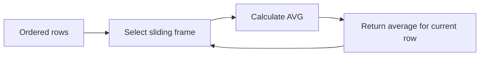
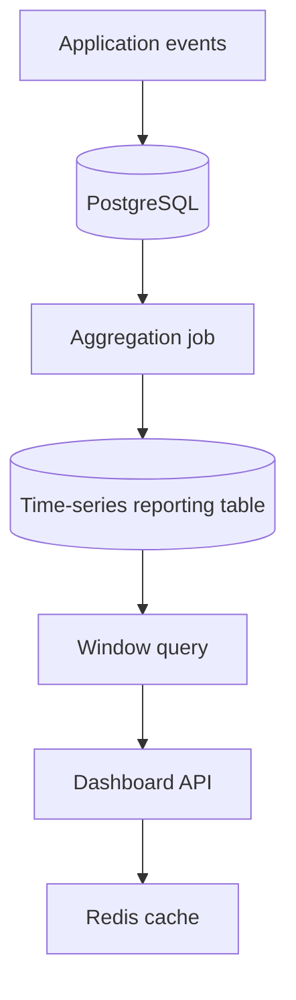

# 07- Moving Averages

## Overview

A **moving average** calculates the average of a value over a sliding window of rows. Unlike a running average, which starts at the first row and continually grows, a moving average considers only a fixed number of preceding and/or following rows.

Moving averages are useful for smoothing short-term fluctuations while preserving the underlying trend.

Typical backend and analytics use cases include:

- Rolling API latency.
- Seven-day revenue averages.
- Rolling order volume.
- Moving customer spend.
- Inventory demand smoothing.
- Monitoring metrics and anomaly detection.
- Time-series dashboards.
- Operational capacity planning.

The core pattern is:

```sql
AVG(value) OVER (
    ORDER BY timestamp
    ROWS BETWEEN 6 PRECEDING AND CURRENT ROW
)
```

For a seven-row moving average, each row considers itself plus the six immediately preceding rows.

## Moving Average vs Running Average

These concepts are related but have different semantics.

### Running average

A running average continuously expands its window:

```sql
AVG(amount) OVER (
    ORDER BY created_at, order_id
    ROWS BETWEEN UNBOUNDED PRECEDING AND CURRENT ROW
)
```

Conceptually:

```text
Row 1: [1]
Row 2: [1, 2]
Row 3: [1, 2, 3]
Row 4: [1, 2, 3, 4]
```

### Moving average

A fixed-size window slides across the data:

```sql
AVG(amount) OVER (
    ORDER BY created_at, order_id
    ROWS BETWEEN 2 PRECEDING AND CURRENT ROW
)
```

Conceptually:

```text
Row 1: [1]
Row 2: [1, 2]
Row 3: [1, 2, 3]
Row 4: [2, 3, 4]
Row 5: [3, 4, 5]
```

| Calculation | Window | Behavior |
|---|---|---|
| Running average | First row → current row | Continuously expands |
| Moving average | Fixed number of rows | Slides through data |
| Overall average | Entire result | Same aggregate value repeated |

## Basic Syntax

The standard pattern is:

```sql
AVG(value) OVER (
    ORDER BY ordering_column
    ROWS BETWEEN N PRECEDING AND CURRENT ROW
)
```

For example, a three-row moving average:

```sql
SELECT
    order_id,
    created_at,
    amount,
    AVG(amount) OVER (
        ORDER BY created_at, order_id
        ROWS BETWEEN 2 PRECEDING AND CURRENT ROW
    ) AS moving_avg
FROM orders
ORDER BY created_at, order_id;
```

If the amounts are:

```text
100
200
300
500
```

the moving averages are:

```text
100
150
200
333.33
```

The fourth row uses:

```text
(200 + 300 + 500) / 3
```

## How the Window Frame Works

The most important part of a moving average is the frame.

```sql
ROWS BETWEEN 6 PRECEDING AND CURRENT ROW
```

means:

> Include the current row and up to six rows immediately before it.

For a seven-row window:

```text
Current row
    │
    ├── 1 preceding
    ├── 2 preceding
    ├── 3 preceding
    ├── 4 preceding
    ├── 5 preceding
    └── 6 preceding
```

The frame slides as the database processes the ordered rows.



## Common Window Sizes

Typical windows include:

| Window | Typical use |
|---|---|
| 3 rows | Short-term smoothing |
| 5 rows | Small operational datasets |
| 7 rows | Weekly-style rolling metric when data is daily |
| 14 rows | Two-week smoothing |
| 30 rows | Monthly-style rolling metric when data is daily |
| 90 rows | Quarterly-style trend when data is daily |

The correct window is a business decision, not simply a SQL decision.

A seven-row window means seven **rows**, not necessarily seven calendar days.

## Row-Based vs Time-Based Windows

This distinction is critical for production time-series queries.

Consider:

```sql
ROWS BETWEEN 6 PRECEDING AND CURRENT ROW
```

This means six preceding rows, regardless of their timestamps.

If there are missing dates:

```text
Monday
Tuesday
Friday
Saturday
```

a four-row frame does not represent four calendar days.

For time-based requirements such as:

> Average API latency over the previous 7 days.

you need a time-based window rather than blindly assuming seven rows equal seven days.

PostgreSQL supports range-based temporal frames with appropriate ordering expressions. For example, when ordering by a numeric time representation:

```sql
AVG(value) OVER (
    ORDER BY event_time_seconds
    RANGE BETWEEN 604800 PRECEDING AND CURRENT ROW
)
```

where `604800` represents seven days in seconds.

For timestamp-based reporting, another robust strategy is often to first aggregate data to a regular time grain such as one row per day, fill missing periods when required, and then apply a row-based window.

## Daily Moving Average

Suppose an application stores daily revenue:

```sql
CREATE TABLE daily_revenue (
    revenue_date DATE PRIMARY KEY,
    revenue NUMERIC(14, 2) NOT NULL
);
```

A seven-row moving average is:

```sql
SELECT
    revenue_date,
    revenue,
    AVG(revenue) OVER (
        ORDER BY revenue_date
        ROWS BETWEEN 6 PRECEDING AND CURRENT ROW
    ) AS seven_day_moving_average
FROM daily_revenue
ORDER BY revenue_date;
```

This works as expected when there is exactly one row per calendar day.

If dates can be missing, the calculation is a seven-row average, not necessarily a seven-calendar-day average.

## Centered Moving Average

A moving average does not have to look only backward.

A centered three-row average can use one preceding row, the current row, and one following row:

```sql
AVG(amount) OVER (
    ORDER BY created_at, order_id
    ROWS BETWEEN 1 PRECEDING AND 1 FOLLOWING
) AS centered_avg
```

For:

```text
100
200
300
```

the middle row uses:

```text
(100 + 200 + 300) / 3
```

Centered windows are useful for offline analytics and smoothing, but they introduce **future-row dependency**.

They are therefore unsuitable for real-time calculations where the future does not yet exist.

## Trailing Moving Average

A trailing moving average uses only current and historical values:

```sql
AVG(amount) OVER (
    ORDER BY created_at, order_id
    ROWS BETWEEN 6 PRECEDING AND CURRENT ROW
) AS trailing_7_row_avg
```

This is generally the most useful form for production dashboards and real-time systems because it does not depend on future data.

## Leading Moving Average

A forward-looking window can use following rows:

```sql
AVG(amount) OVER (
    ORDER BY created_at, order_id
    ROWS BETWEEN CURRENT ROW AND 6 FOLLOWING
) AS forward_7_row_avg
```

This is appropriate for offline analysis where future observations are available.

It should not be used as a real-time forecasting mechanism.

## Partitioned Moving Averages

For customer-specific moving averages:

```sql
SELECT
    customer_id,
    order_id,
    created_at,
    amount,
    AVG(amount) OVER (
        PARTITION BY customer_id
        ORDER BY created_at, order_id
        ROWS BETWEEN 6 PRECEDING AND CURRENT ROW
    ) AS customer_7_order_avg
FROM orders
ORDER BY customer_id, created_at, order_id;
```

Each customer's moving window is independent.

For example:

```text
Customer A:
100 → 150 → 200 → ...

Customer B:
500 → 450 → 400 → ...
```

The window never crosses the partition boundary.

## Moving Average After Aggregation

For production reporting, the moving average often belongs on an already-aggregated time series.

For example, calculate daily revenue first:

```sql
WITH daily_revenue AS (
    SELECT
        DATE_TRUNC('day', created_at)::date AS revenue_date,
        SUM(amount) AS revenue
    FROM orders
    WHERE status = 'completed'
    GROUP BY DATE_TRUNC('day', created_at)::date
)
SELECT
    revenue_date,
    revenue,
    AVG(revenue) OVER (
        ORDER BY revenue_date
        ROWS BETWEEN 6 PRECEDING AND CURRENT ROW
    ) AS seven_day_moving_average
FROM daily_revenue
ORDER BY revenue_date;
```

This separates two concerns:

```text
Raw orders
    │
    ▼
Daily aggregation
    │
    ▼
Daily revenue
    │
    ▼
Seven-row moving average
```

This is usually preferable to applying a window directly to millions of raw events when the business metric operates at daily grain.

## Moving Average by Customer and Day

For customer-level daily spend:

```sql
WITH customer_daily_spend AS (
    SELECT
        customer_id,
        DATE_TRUNC('day', created_at)::date AS spend_date,
        SUM(amount) AS daily_spend
    FROM orders
    WHERE status = 'completed'
    GROUP BY
        customer_id,
        DATE_TRUNC('day', created_at)::date
)
SELECT
    customer_id,
    spend_date,
    daily_spend,
    AVG(daily_spend) OVER (
        PARTITION BY customer_id
        ORDER BY spend_date
        ROWS BETWEEN 6 PRECEDING AND CURRENT ROW
    ) AS seven_day_avg_spend
FROM customer_daily_spend
ORDER BY customer_id, spend_date;
```

The first aggregation establishes the correct business grain before the window calculation.

## Partial Windows at the Beginning

A seven-row moving average does not require seven rows to produce a result.

For example:

```sql
AVG(amount) OVER (
    ORDER BY created_at, order_id
    ROWS BETWEEN 6 PRECEDING AND CURRENT ROW
)
```

on the first three rows produces averages over:

```text
Row 1 → 1 value
Row 2 → 2 values
Row 3 → 3 values
```

If the business requires a moving average only after seven complete observations, add a condition based on row position.

For example:

```sql
WITH ranked_orders AS (
    SELECT
        order_id,
        created_at,
        amount,
        ROW_NUMBER() OVER (
            ORDER BY created_at, order_id
        ) AS row_number
    FROM orders
)
SELECT
    order_id,
    created_at,
    amount,
    AVG(amount) OVER (
        ORDER BY created_at, order_id
        ROWS BETWEEN 6 PRECEDING AND CURRENT ROW
    ) AS moving_avg
FROM ranked_orders
WHERE row_number >= 7
ORDER BY created_at, order_id;
```

The exact approach should match the reporting requirement.

## `NULL` Values

`AVG()` ignores `NULL` values.

Consider:

```text
100
NULL
300
```

The average of the three-row frame is:

```text
(100 + 300) / 2 = 200
```

not:

```text
(100 + 0 + 300) / 3
```

This matters when missing observations have business meaning.

Do not automatically use:

```sql
AVG(COALESCE(amount, 0))
```

because converting an unknown value into zero changes the metric.

Use `COALESCE` only when zero is the correct business interpretation.

## Moving Average With Filters

Window calculations operate on the rows visible to their query block.

This:

```sql
SELECT
    order_date,
    amount,
    AVG(amount) OVER (
        ORDER BY order_date
        ROWS BETWEEN 6 PRECEDING AND CURRENT ROW
    ) AS moving_avg
FROM orders
WHERE status = 'completed';
```

calculates the moving average using only completed orders.

If the requirement is:

> Show completed orders, but calculate the moving average using all orders.

calculate the window first:

```sql
WITH calculated_orders AS (
    SELECT
        order_id,
        order_date,
        amount,
        status,
        AVG(amount) OVER (
            ORDER BY order_date, order_id
            ROWS BETWEEN 6 PRECEDING AND CURRENT ROW
        ) AS moving_avg
    FROM orders
)
SELECT
    order_id,
    order_date,
    amount,
    status,
    moving_avg
FROM calculated_orders
WHERE status = 'completed'
ORDER BY order_date, order_id;
```

This distinction is particularly important in reporting APIs.

## Moving Average and `GROUP BY`

`GROUP BY` reduces the number of rows.

Window functions do not.

For example:

```sql
SELECT
    DATE_TRUNC('day', created_at)::date AS order_date,
    AVG(amount) AS daily_avg
FROM orders
GROUP BY DATE_TRUNC('day', created_at)::date;
```

produces one row per day.

To calculate a moving average of those daily averages:

```sql
WITH daily_stats AS (
    SELECT
        DATE_TRUNC('day', created_at)::date AS order_date,
        AVG(amount) AS daily_avg
    FROM orders
    GROUP BY DATE_TRUNC('day', created_at)::date
)
SELECT
    order_date,
    daily_avg,
    AVG(daily_avg) OVER (
        ORDER BY order_date
        ROWS BETWEEN 6 PRECEDING AND CURRENT ROW
    ) AS moving_daily_avg
FROM daily_stats
ORDER BY order_date;
```

The distinction between:

```text
average of all raw events
```

and:

```text
average of daily averages
```

can be statistically significant.

Do not assume they are interchangeable.

## Moving Average of Percentages

Be careful when calculating moving averages of ratios.

For example:

```sql
AVG(conversion_rate) OVER (...)
```

calculates the arithmetic mean of previously calculated conversion rates.

It is not necessarily the correct overall conversion rate.

For weighted metrics, aggregate the underlying numerator and denominator:

```sql
SUM(conversions) OVER (
    ORDER BY metric_date
    ROWS BETWEEN 6 PRECEDING AND CURRENT ROW
)
/
NULLIF(
    SUM(visits) OVER (
        ORDER BY metric_date
        ROWS BETWEEN 6 PRECEDING AND CURRENT ROW
    ),
    0
) AS rolling_conversion_rate
```

This calculates:

```text
total conversions in window
---------------------------
total visits in window
```

rather than averaging individual daily percentages.

This is a common senior-level analytics distinction.

## Moving Average for API Latency

Suppose an observability table stores aggregated latency metrics:

```sql
CREATE TABLE api_latency_daily (
    metric_date DATE NOT NULL,
    endpoint TEXT NOT NULL,
    request_count BIGINT NOT NULL,
    avg_latency_ms NUMERIC(12, 3) NOT NULL
);
```

A seven-day moving average can be calculated with:

```sql
SELECT
    metric_date,
    endpoint,
    avg_latency_ms,
    AVG(avg_latency_ms) OVER (
        PARTITION BY endpoint
        ORDER BY metric_date
        ROWS BETWEEN 6 PRECEDING AND CURRENT ROW
    ) AS seven_day_avg_latency_ms
FROM api_latency_daily
ORDER BY endpoint, metric_date;
```

However, if `avg_latency_ms` is an average over different request counts, an unweighted average of daily averages can be misleading.

If request counts are available, calculate a weighted rolling latency:

```sql
SELECT
    metric_date,
    endpoint,
    request_count,
    avg_latency_ms,
    SUM(avg_latency_ms * request_count) OVER (
        PARTITION BY endpoint
        ORDER BY metric_date
        ROWS BETWEEN 6 PRECEDING AND CURRENT ROW
    )
    /
    NULLIF(
        SUM(request_count) OVER (
            PARTITION BY endpoint
            ORDER BY metric_date
            ROWS BETWEEN 6 PRECEDING AND CURRENT ROW
        ),
        0
    ) AS seven_day_weighted_latency_ms
FROM api_latency_daily
ORDER BY endpoint, metric_date;
```

This is generally more representative of the latency experienced across all requests in the window.

## Performance Considerations

A moving average requires the database to process rows in window order.

For PostgreSQL:

```sql
EXPLAIN (ANALYZE, BUFFERS)
SELECT
    customer_id,
    created_at,
    amount,
    AVG(amount) OVER (
        PARTITION BY customer_id
        ORDER BY created_at, order_id
        ROWS BETWEEN 6 PRECEDING AND CURRENT ROW
    ) AS moving_avg
FROM orders
WHERE tenant_id = 42;
```

Inspect:

- Sort operations.
- Sort memory.
- Temporary disk usage.
- Number of rows processed.
- Buffer activity.
- Large partitions.
- Execution time.

An index can help with filtering and ordering, but the optimizer is not required to use an index merely because its columns match the window definition.

For large datasets, aggregate first when possible.

Instead of:

```text
Billions of raw events
        ↓
Window function
```

prefer:

```text
Billions of raw events
        ↓
Daily/hourly aggregation
        ↓
Thousands/millions of time-series rows
        ↓
Window function
```

when the business metric permits that grain.

## Large-Scale Time-Series Systems

Moving averages over historical data can become expensive when calculated repeatedly by an API.

For example:

```text
GET /metrics/revenue?window=30d
```

should not necessarily rescan a large transactional table on every request.

Production alternatives include:

- Pre-aggregated daily or hourly tables.
- Materialized views.
- Incrementally maintained reporting tables.
- Read replicas.
- Analytical databases.
- Cached dashboard results.
- Periodic metric snapshots.

A typical backend architecture might look like:



The exact architecture depends on freshness requirements and query volume.

## Moving Averages and Real-Time Systems

For near-real-time dashboards, calculate a trailing window based only on available observations:

```sql
AVG(metric_value) OVER (
    PARTITION BY service
    ORDER BY observed_at
    ROWS BETWEEN 59 PRECEDING AND CURRENT ROW
)
```

If one row represents one minute, this is approximately a 60-minute moving average.

But if events arrive irregularly, 60 rows does not mean 60 minutes.

For high-volume telemetry, databases or stream-processing systems may be better suited to continuous rolling computations.

A streaming architecture can look like:

```text
Application
    │
    ▼
Kafka
    │
    ▼
Stream processor
    │
    ├── Rolling metrics
    │
    └── Persistent aggregates
             │
             ▼
          Dashboard API
```

SQL window functions remain useful for historical recomputation and reporting even when real-time metrics are maintained elsewhere.

## Security and Multi-Tenancy

Window functions do not provide authorization boundaries by themselves.

For a multi-tenant application, tenant filtering must be enforced correctly:

```sql
SELECT
    customer_id,
    metric_date,
    value,
    AVG(value) OVER (
        PARTITION BY customer_id
        ORDER BY metric_date
        ROWS BETWEEN 6 PRECEDING AND CURRENT ROW
    ) AS moving_avg
FROM customer_metrics
WHERE tenant_id = :tenant_id
  AND customer_id = :customer_id;
```

Do not allow user-controlled identifiers to bypass tenant predicates.

When using PostgreSQL row-level security, ensure the database policy and application query semantics agree about which rows can participate in the window.

This matters because accidentally including another tenant's rows in a partition can produce both incorrect analytics and a data-isolation failure.

## Common Mistakes

### Treating Rows as Time

This:

```sql
ROWS BETWEEN 6 PRECEDING AND CURRENT ROW
```

means seven rows, not necessarily seven days.

Use regularized time-series data or an appropriate time-based frame when calendar duration is the requirement.

### Forgetting a Deterministic Order

Avoid:

```sql
ORDER BY created_at
```

when timestamps can be duplicated and row-level ordering matters.

Prefer:

```sql
ORDER BY created_at, event_id
```

### Using Future Rows in a Real-Time Metric

This:

```sql
ROWS BETWEEN 1 PRECEDING AND 1 FOLLOWING
```

requires the following row.

It is not suitable for a metric that must be available immediately.

### Averaging Averages

This can be statistically incorrect:

```sql
AVG(daily_conversion_rate) OVER (...)
```

when days have different traffic volumes.

Prefer a weighted calculation from the underlying numerator and denominator.

### Ignoring Missing Time Buckets

Seven rows may represent:

```text
Monday
Tuesday
Friday
Saturday
Sunday
Tuesday
Wednesday
```

rather than seven consecutive days.

Create a regular time series when calendar-based semantics matter.

### Assuming the First Window Is Full

A seven-row frame produces results even when only one, two, or six rows exist.

If the business requires seven complete observations, explicitly enforce that requirement.

### Performing Large Windows on Raw Events

Applying a window function to billions of raw events can be unnecessarily expensive.

Aggregate to the required business grain first when possible.

### Using Floating-Point Types for Financial Metrics

For monetary reporting, use appropriate exact numeric types such as PostgreSQL `NUMERIC`.

Avoid converting financial values to binary floating-point in Python merely because the SQL result is being consumed by an API.

## Production Checklist

Before shipping a moving-average query, verify:

- **Window meaning:** Is the requirement row-based or time-based?
- **Ordering:** Is the order deterministic?
- **Frame:** Does the frame include exactly the intended observations?
- **Partitioning:** Should the window reset per customer, service, tenant, or metric?
- **Time grain:** Does one row correspond to the intended time unit?
- **Missing periods:** Can gaps occur?
- **Partial windows:** Should incomplete windows be returned?
- **Weighting:** Are you averaging values or should the metric be weighted by volume?
- **Filtering:** Should filtered-out rows participate in the calculation?
- **Performance:** Has the query been tested at production scale?
- **Freshness:** Should this be computed synchronously or pre-aggregated?
- **Authorization:** Can rows from another tenant or customer enter the window?
- **Numerical correctness:** Are monetary and metric types appropriate?

## Best Practices

- Use an explicit window frame for moving averages.
- Add a deterministic tie-breaker to chronological `ORDER BY` expressions.
- Distinguish row-based windows from calendar/time-based windows.
- Aggregate raw events to the required business grain before applying windows when possible.
- Treat incomplete leading windows explicitly when the business requires a full window.
- Use trailing windows for real-time metrics because they do not depend on future observations.
- Avoid unweighted averages of averages when underlying sample sizes differ.
- Use weighted numerator/denominator calculations for metrics such as conversion rates and latency.
- Test missing dates and irregular event arrival patterns.
- Inspect PostgreSQL execution plans for large window queries.
- Precompute or cache frequently requested historical moving metrics when latency requirements justify it.
- Keep tenant and authorization filters inside the database query boundary.

## Interview Traps

| Question | Correct answer |
|---|---|
| What makes a moving average different from a running average? | A moving average uses a sliding bounded frame; a running average expands from the first row. |
| What does `ROWS BETWEEN 6 PRECEDING AND CURRENT ROW` represent? | The current row plus up to six preceding rows. |
| Does seven preceding rows mean seven days? | No. It means seven rows. |
| Why use `ORDER BY created_at, id` instead of only `created_at`? | To establish deterministic row ordering when timestamps tie. |
| Can a centered moving average be used in real time? | Not if it requires future rows. |
| Does `AVG()` include `NULL` values? | No, `AVG()` ignores `NULL` inputs. |
| Does a window function collapse rows? | No, it preserves the input row grain. |
| Why aggregate before calculating a daily moving average? | To establish the intended daily grain and reduce the number of rows processed. |
| Is an average of daily averages always the same as the overall average? | No. Different sample sizes can make the unweighted average misleading. |
| Can `PARTITION BY` create independent moving averages? | Yes. |
| Does an index guarantee a window query will avoid sorting? | No. The optimizer chooses the execution strategy. |
| Should every moving average be calculated directly from raw events? | No. Pre-aggregation is often better for large datasets. |

## Key Takeaways

- **Moving averages use bounded sliding window frames, while running averages continuously expand from the first row.**
- **`ROWS` counts rows, not time; calendar-based metrics require careful handling of missing periods and irregular event density.**
- **Deterministic ordering, correct partitioning, and explicit frames are essential for predictable production results.**
- **For ratios and averages derived from unequal sample sizes, aggregate the underlying weighted values instead of blindly averaging averages.**
- **At scale, pre-aggregate time-series data and evaluate execution plans rather than repeatedly running expensive windows over raw transactional events.**