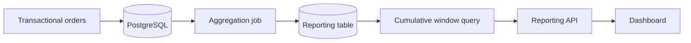

# 08- Cumulative Aggregations

## Overview

**Cumulative aggregation** calculates an aggregate progressively across an ordered set of rows. The most common form is a cumulative sum, where each row contains the total from the beginning of the partition through the current row.

The fundamental pattern is:

```sql
SUM(value) OVER (
    ORDER BY ordering_column
    ROWS BETWEEN UNBOUNDED PRECEDING AND CURRENT ROW
)
```

For example, given daily revenue:

```text
Date        Revenue    Cumulative Revenue
----------  -------    ------------------
2026-01-01     100              100
2026-01-02     150              250
2026-01-03      80              330
2026-01-04     200              530
```

Unlike `GROUP BY`, cumulative window functions preserve the original row-level or time-series grain.

This makes them useful for:

- Revenue accumulation.
- Account balances.
- Inventory levels.
- Cumulative order counts.
- Year-to-date metrics.
- Progress tracking.
- Usage quotas.
- Cumulative operational metrics.
- Financial reporting.

## Cumulative Aggregation vs Regular Aggregation

A regular aggregate collapses multiple rows into fewer rows:

```sql
SELECT
    customer_id,
    SUM(amount) AS total_amount
FROM orders
GROUP BY customer_id;
```

A window aggregate preserves the rows:

```sql
SELECT
    order_id,
    customer_id,
    amount,
    SUM(amount) OVER (
        PARTITION BY customer_id
        ORDER BY created_at, order_id
        ROWS BETWEEN UNBOUNDED PRECEDING AND CURRENT ROW
    ) AS cumulative_amount
FROM orders;
```

| Technique | Rows preserved? | Typical result |
|---|---:|---|
| `GROUP BY` + `SUM()` | No | One row per group |
| `SUM() OVER (...)` | Yes | Running value on every row |
| `SUM() OVER (PARTITION BY ...)` | Yes | Independent running value per partition |

## The Core Pattern

The canonical cumulative sum is:

```sql
SUM(amount) OVER (
    ORDER BY created_at, order_id
    ROWS BETWEEN UNBOUNDED PRECEDING AND CURRENT ROW
)
```

The frame means:

```text
UNBOUNDED PRECEDING
        │
        ▼
First row ──────── Previous rows ──────── Current row
                                                ▲
                                                │
                                         Frame endpoint
```

As the database moves through the ordered rows, the frame expands from the first row to the current row.

## Basic Example

Given:

```sql
CREATE TABLE daily_sales (
    sale_date DATE PRIMARY KEY,
    revenue NUMERIC(14, 2) NOT NULL
);
```

calculate cumulative revenue with:

```sql
SELECT
    sale_date,
    revenue,
    SUM(revenue) OVER (
        ORDER BY sale_date
        ROWS BETWEEN UNBOUNDED PRECEDING AND CURRENT ROW
    ) AS cumulative_revenue
FROM daily_sales
ORDER BY sale_date;
```

Example result:

| sale_date | revenue | cumulative_revenue |
|---|---:|---:|
| 2026-01-01 | 100.00 | 100.00 |
| 2026-01-02 | 150.00 | 250.00 |
| 2026-01-03 | 80.00 | 330.00 |
| 2026-01-04 | 200.00 | 530.00 |

## Why `UNBOUNDED PRECEDING` Matters

A cumulative calculation needs a frame that starts at the beginning of the relevant partition.

```sql
ROWS BETWEEN UNBOUNDED PRECEDING AND CURRENT ROW
```

means:

> Start at the first row and include every row through the current row.

Compare this with:

```sql
ROWS BETWEEN 6 PRECEDING AND CURRENT ROW
```

which is a seven-row moving window rather than a cumulative window.

| Frame | Meaning |
|---|---|
| `UNBOUNDED PRECEDING` → `CURRENT ROW` | Cumulative |
| `6 PRECEDING` → `CURRENT ROW` | Seven-row moving window |
| `UNBOUNDED PRECEDING` → `UNBOUNDED FOLLOWING` | Entire partition |
| `CURRENT ROW` → `UNBOUNDED FOLLOWING` | Remaining rows |

For cumulative metrics, explicitly specifying the frame is often preferable because it communicates intent and avoids ambiguity around default frame behavior.

## Cumulative Aggregation by Group

Use `PARTITION BY` when the cumulative calculation must restart for each entity.

For example, cumulative customer spending:

```sql
SELECT
    customer_id,
    order_id,
    created_at,
    amount,
    SUM(amount) OVER (
        PARTITION BY customer_id
        ORDER BY created_at, order_id
        ROWS BETWEEN UNBOUNDED PRECEDING AND CURRENT ROW
    ) AS cumulative_customer_spend
FROM orders
ORDER BY customer_id, created_at, order_id;
```

The calculation behaves like:

```text
Customer A
  Order 1 → 100
  Order 2 → 250
  Order 3 → 400

Customer B
  Order 4 → 80
  Order 5 → 200
```

Customer B starts again at zero because `PARTITION BY customer_id` creates an independent window.

## Deterministic Ordering

Cumulative calculations depend directly on row order.

Avoid relying on:

```sql
ORDER BY created_at
```

when multiple rows can have the same timestamp.

Prefer a deterministic ordering:

```sql
ORDER BY created_at, order_id
```

For example:

```sql
SELECT
    order_id,
    created_at,
    amount,
    SUM(amount) OVER (
        ORDER BY created_at, order_id
        ROWS BETWEEN UNBOUNDED PRECEDING AND CURRENT ROW
    ) AS cumulative_revenue
FROM orders;
```

Without a deterministic tie-breaker, the cumulative value assigned to rows sharing the same timestamp can be ambiguous.

The final result should also use the same ordering when presenting the cumulative sequence:

```sql
ORDER BY created_at, order_id;
```

## Cumulative Count

Cumulative aggregation is not limited to `SUM()`.

Use `COUNT()` to calculate the number of observations seen so far:

```sql
SELECT
    order_id,
    created_at,
    COUNT(*) OVER (
        ORDER BY created_at, order_id
        ROWS BETWEEN UNBOUNDED PRECEDING AND CURRENT ROW
    ) AS cumulative_order_count
FROM orders
ORDER BY created_at, order_id;
```

Example:

```text
Order 1 → 1
Order 2 → 2
Order 3 → 3
Order 4 → 4
```

This is useful for:

- Cumulative registrations.
- Cumulative orders.
- Cumulative events.
- Sequence tracking.

## Cumulative Average

A cumulative average can be calculated using `AVG()`:

```sql
SELECT
    order_id,
    created_at,
    amount,
    AVG(amount) OVER (
        ORDER BY created_at, order_id
        ROWS BETWEEN UNBOUNDED PRECEDING AND CURRENT ROW
    ) AS cumulative_average
FROM orders
ORDER BY created_at, order_id;
```

For values:

```text
100
200
300
```

the results are:

```text
100
150
200
```

This differs from a moving average because the cumulative frame never discards historical rows.

## Cumulative Minimum and Maximum

The same pattern works with `MIN()` and `MAX()`.

```sql
SELECT
    sale_date,
    revenue,
    MIN(revenue) OVER (
        ORDER BY sale_date
        ROWS BETWEEN UNBOUNDED PRECEDING AND CURRENT ROW
    ) AS cumulative_min_revenue,
    MAX(revenue) OVER (
        ORDER BY sale_date
        ROWS BETWEEN UNBOUNDED PRECEDING AND CURRENT ROW
    ) AS cumulative_max_revenue
FROM daily_sales
ORDER BY sale_date;
```

This is useful for questions such as:

- What is the highest revenue achieved so far?
- What is the lowest latency observed so far?
- What is the largest order placed up to this point?

## Cumulative Aggregations and `NULL`

Aggregate functions have specific `NULL` semantics.

For example:

```sql
SUM(amount) OVER (
    ORDER BY created_at
    ROWS BETWEEN UNBOUNDED PRECEDING AND CURRENT ROW
)
```

ignores `NULL` values.

If the first rows are all `NULL`, `SUM()` can produce `NULL` rather than zero.

If the business meaning requires zero, explicitly handle it:

```sql
COALESCE(
    SUM(amount) OVER (
        ORDER BY created_at, order_id
        ROWS BETWEEN UNBOUNDED PRECEDING AND CURRENT ROW
    ),
    0
) AS cumulative_amount
```

Do not blindly convert `NULL` to zero. A `NULL` value may represent an unknown or unavailable measurement rather than an actual zero.

## Cumulative Percentage of Total

A common analytics pattern is to calculate each row's contribution to cumulative total.

For example:

```sql
WITH revenue AS (
    SELECT
        product_id,
        SUM(amount) AS product_revenue
    FROM order_items
    GROUP BY product_id
)
SELECT
    product_id,
    product_revenue,
    SUM(product_revenue) OVER (
        ORDER BY product_revenue DESC, product_id
        ROWS BETWEEN UNBOUNDED PRECEDING AND CURRENT ROW
    ) AS cumulative_revenue,
    SUM(product_revenue) OVER (
        ORDER BY product_revenue DESC, product_id
        ROWS BETWEEN UNBOUNDED PRECEDING AND CURRENT ROW
    )
    /
    NULLIF(
        SUM(product_revenue) OVER (),
        0
    ) AS cumulative_revenue_ratio
FROM revenue
ORDER BY product_revenue DESC, product_id;
```

This can support Pareto-style analysis:

```text
Product A → 35% cumulative
Product B → 58% cumulative
Product C → 72% cumulative
...
```

The `NULLIF()` protects against division by zero.

## Cumulative Aggregation by Month

For monthly revenue:

```sql
WITH monthly_revenue AS (
    SELECT
        DATE_TRUNC('month', created_at)::date AS month,
        SUM(amount) AS revenue
    FROM orders
    WHERE status = 'completed'
    GROUP BY DATE_TRUNC('month', created_at)::date
)
SELECT
    month,
    revenue,
    SUM(revenue) OVER (
        ORDER BY month
        ROWS BETWEEN UNBOUNDED PRECEDING AND CURRENT ROW
    ) AS cumulative_revenue
FROM monthly_revenue
ORDER BY month;
```

The important design decision is that the window runs over **monthly aggregates**, not individual orders.

```text
Orders
   │
   ▼
Monthly GROUP BY
   │
   ▼
Monthly revenue
   │
   ▼
Cumulative SUM() OVER
```

This is usually more efficient and easier to reason about.

## Year-to-Date Aggregations

Cumulative windows are commonly used for YTD reporting.

Suppose the requirement is:

> Show cumulative revenue from January 1 through each month.

Partition by year:

```sql
WITH monthly_revenue AS (
    SELECT
        DATE_TRUNC('month', created_at)::date AS month,
        SUM(amount) AS revenue
    FROM orders
    WHERE status = 'completed'
    GROUP BY DATE_TRUNC('month', created_at)::date
)
SELECT
    month,
    revenue,
    SUM(revenue) OVER (
        PARTITION BY EXTRACT(YEAR FROM month)
        ORDER BY month
        ROWS BETWEEN UNBOUNDED PRECEDING AND CURRENT ROW
    ) AS ytd_revenue
FROM monthly_revenue
ORDER BY month;
```

The partition resets when the year changes:

```text
2025:
Jan → 100
Feb → 250
Mar → 400

2026:
Jan → 120
Feb → 300
Mar → 450
```

## Cumulative Aggregation With Business Filters

Filtering determines which rows participate in the window calculation.

For example:

```sql
SELECT
    order_id,
    created_at,
    amount,
    SUM(amount) OVER (
        ORDER BY created_at, order_id
        ROWS BETWEEN UNBOUNDED PRECEDING AND CURRENT ROW
    ) AS cumulative_completed_revenue
FROM orders
WHERE status = 'completed'
ORDER BY created_at, order_id;
```

Here, cancelled and pending orders do not participate in the cumulative calculation.

If you need to display all orders but accumulate only completed revenue, use conditional aggregation:

```sql
SELECT
    order_id,
    created_at,
    status,
    amount,
    SUM(
        CASE
            WHEN status = 'completed' THEN amount
            ELSE 0
        END
    ) OVER (
        ORDER BY created_at, order_id
        ROWS BETWEEN UNBOUNDED PRECEDING AND CURRENT ROW
    ) AS cumulative_completed_revenue
FROM orders
ORDER BY created_at, order_id;
```

This distinction is important:

```text
WHERE status = 'completed'
```

removes rows before the window function sees them.

Whereas:

```sql
SUM(CASE WHEN status = 'completed' THEN amount ELSE 0 END) OVER (...)
```

keeps all rows but controls which values contribute.

## Cumulative Balance

A particularly useful production pattern is calculating an account balance from transactions.

Given:

```sql
CREATE TABLE account_transactions (
    transaction_id BIGINT PRIMARY KEY,
    account_id BIGINT NOT NULL,
    occurred_at TIMESTAMPTZ NOT NULL,
    amount NUMERIC(18, 2) NOT NULL
);
```

calculate the running balance:

```sql
SELECT
    transaction_id,
    account_id,
    occurred_at,
    amount,
    SUM(amount) OVER (
        PARTITION BY account_id
        ORDER BY occurred_at, transaction_id
        ROWS BETWEEN UNBOUNDED PRECEDING AND CURRENT ROW
    ) AS running_balance
FROM account_transactions
ORDER BY account_id, occurred_at, transaction_id;
```

For example:

```text
Transaction    Amount    Balance
-----------    ------    -------
Deposit        +100        100
Purchase        -30         70
Deposit         +50        120
Purchase        -20        100
```

This is useful for reporting and reconciliation.

However, a derived running balance should not automatically replace a properly designed ledger or account-balance model in a transactional system.

## Cumulative Inventory

Inventory movements can be modeled similarly:

```sql
SELECT
    product_id,
    occurred_at,
    quantity_change,
    SUM(quantity_change) OVER (
        PARTITION BY product_id
        ORDER BY occurred_at, movement_id
        ROWS BETWEEN UNBOUNDED PRECEDING AND CURRENT ROW
    ) AS inventory_level
FROM inventory_movements
ORDER BY product_id, occurred_at, movement_id;
```

Positive values represent stock additions and negative values represent deductions.

Production systems should still enforce inventory invariants transactionally. A reporting query that calculates a balance does not by itself prevent negative inventory or concurrent write anomalies.

## Cumulative Aggregation vs Moving Aggregation

These calculations are easy to confuse.

```sql
-- Cumulative
SUM(amount) OVER (
    ORDER BY created_at, order_id
    ROWS BETWEEN UNBOUNDED PRECEDING AND CURRENT ROW
)
```

versus:

```sql
-- Seven-row moving
SUM(amount) OVER (
    ORDER BY created_at, order_id
    ROWS BETWEEN 6 PRECEDING AND CURRENT ROW
)
```

| Characteristic | Cumulative | Moving |
|---|---|---|
| Starting boundary | `UNBOUNDED PRECEDING` | Fixed preceding row |
| Historical data retained | Yes | No |
| Window grows | Yes | No |
| Typical use | YTD, running balance | Rolling 7-day metric |
| Memory/work profile | Can grow with partition | Bounded frame |

## Cumulative Aggregation vs Self-Join

Before window functions, cumulative calculations were sometimes implemented using self-joins or correlated subqueries.

For example:

```sql
SELECT
    o1.order_id,
    o1.created_at,
    o1.amount,
    (
        SELECT SUM(o2.amount)
        FROM orders o2
        WHERE o2.created_at <= o1.created_at
    ) AS cumulative_amount
FROM orders o1;
```

This approach is generally harder to reason about and can perform poorly as data grows.

The window-function form is clearer:

```sql
SELECT
    order_id,
    created_at,
    amount,
    SUM(amount) OVER (
        ORDER BY created_at, order_id
        ROWS BETWEEN UNBOUNDED PRECEDING AND CURRENT ROW
    ) AS cumulative_amount
FROM orders;
```

Window functions express the operation directly and allow the optimizer to use a window-oriented execution strategy.

## Execution and Performance

A cumulative window requires rows to be processed in window order.

For PostgreSQL, inspect large queries with:

```sql
EXPLAIN (ANALYZE, BUFFERS)
SELECT
    customer_id,
    created_at,
    amount,
    SUM(amount) OVER (
        PARTITION BY customer_id
        ORDER BY created_at, order_id
        ROWS BETWEEN UNBOUNDED PRECEDING AND CURRENT ROW
    ) AS cumulative_amount
FROM orders
WHERE tenant_id = 42;
```

Pay attention to:

- Sort operations.
- Rows entering the window stage.
- Temporary disk usage.
- Memory consumption.
- Partition sizes.
- Execution time.
- Buffer reads.

A suitable index can help the database with filtering and ordering, but an index does not guarantee that PostgreSQL will avoid a sort.

For a large multi-tenant system, a useful indexing strategy may involve the filtering and ordering columns, depending on actual query patterns:

```sql
CREATE INDEX CONCURRENTLY idx_orders_tenant_customer_time
ON orders (tenant_id, customer_id, created_at, order_id);
```

Do not create this index blindly. Validate it against real workloads using `EXPLAIN (ANALYZE, BUFFERS)` and consider write overhead and storage cost.

## Large-Scale Reporting

Repeatedly calculating cumulative metrics over a large transactional table can become expensive.

A production reporting pipeline might use:



Possible strategies include:

- Pre-aggregate to daily or hourly grain.
- Maintain reporting tables.
- Use materialized views where appropriate.
- Execute expensive analytics asynchronously.
- Cache frequently requested reports.
- Use read replicas for read-heavy workloads.
- Move very large analytical workloads to an analytical datastore.

Do not introduce a cache or materialized view simply because a query contains a window function. Measure first.

## Incremental vs Recomputed Cumulative Values

A cumulative value depends on all preceding rows.

That has an important operational consequence:

> Changing historical data can change every subsequent cumulative value in the affected partition.

For example:

```text
Historical amount changes
        │
        ▼
Cumulative row changes
        │
        ▼
Every later cumulative row may change
```

This is particularly important for:

- Financial corrections.
- Backfilled events.
- Late-arriving Kafka events.
- Deleted transactions.
- Reprocessed data.

If cumulative metrics are materialized, historical corrections may require recomputation of the affected range.

For immutable event streams, cumulative metrics are easier to maintain incrementally. For mutable historical data, design explicit correction and rebuild procedures.

## Late-Arriving Events

Consider events ordered by:

```sql
ORDER BY occurred_at, event_id
```

If an event arrives late with an older `occurred_at`, it belongs earlier in the logical sequence.

A previously computed cumulative metric may therefore become stale.

This is common in distributed systems where:

- Kafka events arrive out of order.
- Mobile clients reconnect after being offline.
- Batch jobs backfill historical data.
- External systems resend events.

Do not assume ingestion time and business-event time are interchangeable.

Use the timestamp that matches the metric's business semantics.

## Time Zones and Date-Based Reporting

For daily or monthly cumulative metrics, define the reporting timezone explicitly.

For example:

```sql
DATE_TRUNC(
    'day',
    created_at AT TIME ZONE 'Asia/Kolkata'
)
```

may be appropriate when the business defines a day in India Standard Time.

Using database-server time or UTC without considering business semantics can move transactions across reporting boundaries.

For global systems, establish whether cumulative metrics are based on:

- UTC.
- Customer timezone.
- Account timezone.
- Organization timezone.
- A fixed reporting timezone.

The choice affects both aggregation and partition boundaries.

## Security and Multi-Tenancy

Cumulative windows must not accidentally cross tenant boundaries.

Use explicit partitioning and tenant filtering:

```sql
SELECT
    tenant_id,
    customer_id,
    created_at,
    amount,
    SUM(amount) OVER (
        PARTITION BY tenant_id, customer_id
        ORDER BY created_at, order_id
        ROWS BETWEEN UNBOUNDED PRECEDING AND CURRENT ROW
    ) AS cumulative_amount
FROM orders
WHERE tenant_id = :tenant_id;
```

The application should parameterize `:tenant_id` rather than interpolating user input into SQL.

For PostgreSQL row-level security, verify that the policy correctly restricts the rows available to the window calculation.

A cumulative query is not an authorization mechanism.

## Common Mistakes

### Forgetting `PARTITION BY`

If the calculation should reset per customer but does not:

```sql
SUM(amount) OVER (
    ORDER BY created_at
)
```

the cumulative total spans all customers.

Use:

```sql
SUM(amount) OVER (
    PARTITION BY customer_id
    ORDER BY created_at, order_id
)
```

### Using the Wrong Frame

This:

```sql
ROWS BETWEEN 6 PRECEDING AND CURRENT ROW
```

is a moving seven-row window, not a cumulative aggregation.

Use:

```sql
ROWS BETWEEN UNBOUNDED PRECEDING AND CURRENT ROW
```

for cumulative behavior.

### Non-Deterministic Ordering

This:

```sql
ORDER BY created_at
```

can be insufficient when timestamps tie.

Use a stable unique tie-breaker:

```sql
ORDER BY created_at, order_id
```

### Filtering Too Early

If the requirement is to display all orders while accumulating only completed orders, this is wrong:

```sql
WHERE status = 'completed'
```

because non-completed rows disappear from the result.

Use conditional aggregation when all rows need to remain visible.

### Confusing Event Time With Ingestion Time

Ordering by:

```sql
ingested_at
```

when the business metric requires:

```sql
occurred_at
```

can produce incorrect cumulative sequences.

### Ignoring Historical Corrections

A backdated transaction can change every later cumulative value.

Materialized cumulative data needs a correction/rebuild strategy.

### Averaging Already Aggregated Metrics

An unweighted cumulative average of daily averages may not represent the average across all underlying events.

When sample sizes differ, calculate from the underlying numerator and denominator where possible.

### Using Cumulative Queries for Transactional Invariants

A running balance query can show that an account would become negative, but it does not prevent concurrent transactions from violating the invariant.

Use database transactions, constraints, locking, or an appropriate ledger design for write-time correctness.

## Production Best Practices

- Use explicit `ROWS BETWEEN UNBOUNDED PRECEDING AND CURRENT ROW` for cumulative calculations.
- Make window ordering deterministic with a stable tie-breaker.
- Use `PARTITION BY` whenever the cumulative calculation must reset by entity, tenant, account, or period.
- Establish the correct business grain before applying the window.
- Distinguish event time from ingestion time.
- Define reporting time zones explicitly.
- Treat late-arriving and corrected events as first-class operational cases.
- Pre-aggregate large transactional datasets when the reporting grain allows it.
- Use `EXPLAIN (ANALYZE, BUFFERS)` to validate performance at realistic scale.
- Avoid materializing cumulative values without a strategy for historical corrections.
- Keep authorization and tenant isolation independent from analytical window logic.
- Use exact numeric types for financial cumulative values.
- Do not rely on a reporting query to enforce transactional invariants.

## Interview Traps

| Question | Correct answer |
|---|---|
| What is a cumulative aggregation? | An aggregate calculated progressively from the beginning of a window through the current row. |
| What frame is commonly used for a cumulative sum? | `ROWS BETWEEN UNBOUNDED PRECEDING AND CURRENT ROW`. |
| Does a window aggregate reduce rows? | No. It preserves the input row grain. |
| What does `PARTITION BY` do? | It creates independent windows and resets the cumulative calculation at each partition. |
| Why is a deterministic `ORDER BY` important? | Cumulative results depend on row order, so ties should have a stable tie-breaker. |
| Is `6 PRECEDING` equivalent to a cumulative window? | No. It creates a bounded seven-row frame. |
| Can a cumulative value change after historical data is corrected? | Yes. The correction can affect every subsequent row in the partition. |
| Why might monthly aggregation happen before the window function? | It establishes the required reporting grain and reduces the number of rows processed. |
| Can a running balance query enforce account-balance correctness? | No. It reports a derived value; transactional invariants require transactional database mechanisms. |
| What happens if an event arrives late? | Its position in the logical ordering may change, potentially invalidating previously calculated cumulative values. |
| Can cumulative windows be used with `COUNT`, `AVG`, `MIN`, and `MAX`? | Yes. Windowed aggregates are not limited to `SUM`. |
| Why can an average of daily averages be misleading? | Different days may contain different numbers of underlying observations. |

## Key Takeaways

- **Cumulative aggregations use an expanding frame, typically `UNBOUNDED PRECEDING` through `CURRENT ROW`, while preserving every input row.**
- **`PARTITION BY` defines where cumulative calculations reset; deterministic ordering defines the sequence in which they accumulate.**
- **The correct business grain, event-time semantics, timezone, and handling of late or corrected events are as important as the SQL syntax.**
- **Large cumulative queries should be measured and often run against pre-aggregated reporting data rather than raw transactional events.**
- **A cumulative reporting query can calculate balances and metrics, but it does not replace transactional controls required for correctness and data integrity.**