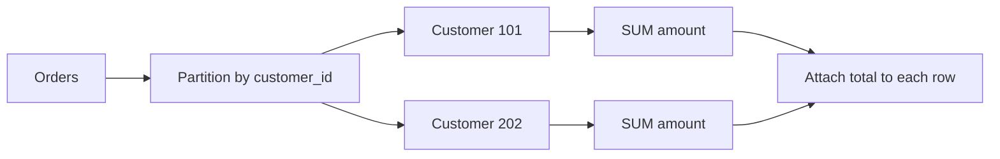
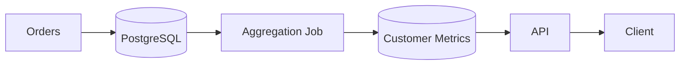

# 09- Partitioned Aggregations

## Overview

**Partitioned aggregation** applies an aggregate function independently to each logical group while preserving the original rows. In SQL, this is typically implemented with an aggregate window function and `PARTITION BY`.

The core pattern is:

```sql
SUM(amount) OVER (
    PARTITION BY customer_id
)
```

Unlike `GROUP BY`, which collapses each group into one result row, a partitioned window aggregate calculates the group-level value and attaches it to every row in that group.

For example:

```text
customer_id  order_id  amount  customer_total
-----------  --------  ------  --------------
101          1         100     350
101          2         150     350
101          3         100     350
202          4          80      80
```

This is useful when an API, report, ranking query, or analytical workflow needs both:

- The individual row.
- An aggregate over the row's logical group.

Partitioned aggregation is one of the most useful combinations of window functions and aggregate functions in production SQL.

## `GROUP BY` vs Partitioned Aggregation

The key distinction is whether the original row grain must be preserved.

### `GROUP BY`

```sql
SELECT
    customer_id,
    SUM(amount) AS customer_total
FROM orders
GROUP BY customer_id;
```

Result:

| customer_id | customer_total |
|---|---:|
| 101 | 350 |
| 202 | 80 |

The individual orders are no longer available.

### `SUM() OVER (PARTITION BY ...)`

```sql
SELECT
    order_id,
    customer_id,
    amount,
    SUM(amount) OVER (
        PARTITION BY customer_id
    ) AS customer_total
FROM orders;
```

Result:

| order_id | customer_id | amount | customer_total |
|---|---|---:|---:|
| 1 | 101 | 100 | 350 |
| 2 | 101 | 150 | 350 |
| 3 | 101 | 100 | 350 |
| 4 | 202 | 80 | 80 |

The window function computes the aggregate independently for each customer but does not collapse the rows.

| Requirement | Better approach |
|---|---|
| One result per group | `GROUP BY` |
| Original rows plus group aggregate | Window aggregate |
| Running aggregate within each group | Window aggregate + `PARTITION BY` + `ORDER BY` |
| Filter based on a window aggregate | Subquery or CTE around the window query |

## How `PARTITION BY` Works

`PARTITION BY` divides the result set into logical windows.

For:

```sql
SUM(amount) OVER (
    PARTITION BY customer_id
)
```

the database conceptually creates:

```text
Partition: customer_id = 101
  order 1
  order 2
  order 3

Partition: customer_id = 202
  order 4
  order 5
```

The aggregate is calculated independently within each partition.



The important point is that a partition is a **logical window**, not necessarily a physically separate table or storage structure.

## Aggregate Functions Commonly Used With Partitions

Many aggregate functions can be used as window functions.

| Function | Example | Typical use |
|---|---|---|
| `SUM()` | `SUM(amount) OVER (...)` | Group totals |
| `AVG()` | `AVG(amount) OVER (...)` | Group average |
| `COUNT()` | `COUNT(*) OVER (...)` | Group row count |
| `MIN()` | `MIN(amount) OVER (...)` | Group minimum |
| `MAX()` | `MAX(amount) OVER (...)` | Group maximum |

For example:

```sql
SELECT
    order_id,
    customer_id,
    amount,
    COUNT(*) OVER (
        PARTITION BY customer_id
    ) AS customer_order_count,
    AVG(amount) OVER (
        PARTITION BY customer_id
    ) AS customer_average_order,
    MIN(amount) OVER (
        PARTITION BY customer_id
    ) AS customer_min_order,
    MAX(amount) OVER (
        PARTITION BY customer_id
    ) AS customer_max_order,
    SUM(amount) OVER (
        PARTITION BY customer_id
    ) AS customer_total
FROM orders;
```

This can produce a useful per-order customer profile without losing order-level detail.

## Partitioned Aggregation Without Ordering

Consider:

```sql
SUM(amount) OVER (
    PARTITION BY customer_id
)
```

There is no `ORDER BY`.

Therefore, the aggregate applies to the **entire partition**.

Every row belonging to the same customer receives the same total.

```text
Customer 101
────────────────────────
Order 1 → total = 350
Order 2 → total = 350
Order 3 → total = 350
```

This is fundamentally different from:

```sql
SUM(amount) OVER (
    PARTITION BY customer_id
    ORDER BY created_at
)
```

which introduces an ordered window and can produce a running aggregate.

## Partitioned Aggregation With Ordering

Adding `ORDER BY` changes the window's semantics.

For a running customer total:

```sql
SELECT
    customer_id,
    order_id,
    created_at,
    amount,
    SUM(amount) OVER (
        PARTITION BY customer_id
        ORDER BY created_at, order_id
        ROWS BETWEEN UNBOUNDED PRECEDING AND CURRENT ROW
    ) AS running_customer_total
FROM orders
ORDER BY customer_id, created_at, order_id;
```

Example:

| customer_id | order_id | amount | running_customer_total |
|---|---|---:|---:|
| 101 | 1 | 100 | 100 |
| 101 | 2 | 150 | 250 |
| 101 | 3 | 100 | 350 |
| 202 | 4 | 80 | 80 |

The calculation resets when the partition changes.

This gives a useful mental model:

```text
PARTITION BY
    ↓
Defines independent groups

ORDER BY
    ↓
Defines sequence within each group

Frame
    ↓
Defines which rows contribute to the current calculation
```

## Full Partition vs Running Partition

These two queries look similar but answer different questions.

### Full partition

```sql
SUM(amount) OVER (
    PARTITION BY customer_id
)
```

Question:

> What is this customer's total?

### Running partition

```sql
SUM(amount) OVER (
    PARTITION BY customer_id
    ORDER BY created_at, order_id
    ROWS BETWEEN UNBOUNDED PRECEDING AND CURRENT ROW
)
```

Question:

> How much has this customer spent up to this order?

| Query | Meaning |
|---|---|
| `PARTITION BY customer_id` | Total for the entire customer |
| `PARTITION BY customer_id ORDER BY ...` | Ordered aggregation |
| Explicit cumulative frame | Running total through current row |
| Bounded frame | Moving aggregation within each customer |

## Multiple Partition Columns

Partitions can be defined using multiple columns.

For a multi-tenant application:

```sql
SELECT
    tenant_id,
    customer_id,
    order_id,
    amount,
    SUM(amount) OVER (
        PARTITION BY tenant_id, customer_id
    ) AS tenant_customer_total
FROM orders;
```

This creates independent partitions based on the combination:

```text
(tenant_id, customer_id)
```

For example:

```text
Tenant A + Customer 101 → independent partition
Tenant A + Customer 102 → independent partition
Tenant B + Customer 101 → independent partition
```

This is important in multi-tenant systems because `customer_id` alone may not be globally unique.

## Partitioning by Business Dimensions

Partition columns should represent the business boundary of the calculation.

Examples:

```sql
-- Revenue per customer
PARTITION BY customer_id
```

```sql
-- Revenue per customer per year
PARTITION BY customer_id, EXTRACT(YEAR FROM created_at)
```

```sql
-- Usage per organization and service
PARTITION BY organization_id, service_name
```

```sql
-- Inventory per warehouse and product
PARTITION BY warehouse_id, product_id
```

The right partition is determined by the question being answered, not by which columns happen to be available.

## Practical Backend Example: Customer Order Metrics

Suppose a REST API needs to return each order with customer-level metrics.

A single query can provide:

```sql
SELECT
    order_id,
    customer_id,
    created_at,
    amount,
    COUNT(*) OVER (
        PARTITION BY customer_id
    ) AS customer_order_count,
    SUM(amount) OVER (
        PARTITION BY customer_id
    ) AS customer_lifetime_value,
    AVG(amount) OVER (
        PARTITION BY customer_id
    ) AS customer_average_order
FROM orders
WHERE status = 'completed';
```

The application can return the result directly:

```text
order
├── amount
├── customer_order_count
├── customer_lifetime_value
└── customer_average_order
```

This can eliminate multiple queries such as:

1. Fetch order.
2. Fetch customer order count.
3. Fetch customer total.
4. Fetch customer average.

That can reduce application-level query complexity and avoid some N+1 patterns.

However, the query should still be validated against realistic data volume and access patterns.

## Filtering and Window Functions

Window functions are evaluated after the `WHERE` clause in the logical processing model.

This matters.

Consider:

```sql
SELECT
    order_id,
    customer_id,
    amount,
    SUM(amount) OVER (
        PARTITION BY customer_id
    ) AS customer_total
FROM orders
WHERE status = 'completed';
```

The window function sees only completed orders.

Therefore, `customer_total` represents the total of completed orders, not all orders.

If the requirement is:

> Show completed orders but calculate the customer's total across all orders.

you cannot simply put:

```sql
WHERE status = 'completed'
```

around the same window query.

Use a separate query layer:

```sql
WITH customer_totals AS (
    SELECT
        order_id,
        customer_id,
        amount,
        status,
        SUM(amount) OVER (
            PARTITION BY customer_id
        ) AS customer_total
    FROM orders
)
SELECT
    order_id,
    customer_id,
    amount,
    customer_total
FROM customer_totals
WHERE status = 'completed';
```

The window calculation happens before the outer filtering step.

This distinction is critical in production reporting queries.

## Filtering on a Partitioned Aggregate

You cannot normally reference a window function directly in `WHERE`:

```sql
SELECT
    order_id,
    customer_id,
    amount,
    SUM(amount) OVER (
        PARTITION BY customer_id
    ) AS customer_total
FROM orders
WHERE customer_total > 1000;
```

Instead, use a CTE:

```sql
WITH order_metrics AS (
    SELECT
        order_id,
        customer_id,
        amount,
        SUM(amount) OVER (
            PARTITION BY customer_id
        ) AS customer_total
    FROM orders
)
SELECT
    order_id,
    customer_id,
    amount,
    customer_total
FROM order_metrics
WHERE customer_total > 1000;
```

This creates two logical stages:

```text
Orders
  │
  ▼
Window aggregation
  │
  ▼
Rows with customer_total
  │
  ▼
Outer WHERE
  │
  ▼
Filtered result
```

## Partitioned Aggregations and `HAVING`

`HAVING` is designed to filter grouped results.

For example:

```sql
SELECT
    customer_id,
    SUM(amount) AS customer_total
FROM orders
GROUP BY customer_id
HAVING SUM(amount) > 1000;
```

This returns one row per qualifying customer.

If you need every order belonging to qualifying customers, combine grouped aggregation with a CTE:

```sql
WITH qualifying_customers AS (
    SELECT
        customer_id
    FROM orders
    GROUP BY customer_id
    HAVING SUM(amount) > 1000
)
SELECT
    o.order_id,
    o.customer_id,
    o.amount
FROM orders AS o
JOIN qualifying_customers AS q
    ON q.customer_id = o.customer_id;
```

Alternatively, calculate the partitioned aggregate and filter in an outer query:

```sql
WITH order_metrics AS (
    SELECT
        order_id,
        customer_id,
        amount,
        SUM(amount) OVER (
            PARTITION BY customer_id
        ) AS customer_total
    FROM orders
)
SELECT
    order_id,
    customer_id,
    amount,
    customer_total
FROM order_metrics
WHERE customer_total > 1000;
```

The second form is particularly useful when the aggregate is already needed in the output.

## Conditional Partitioned Aggregation

Conditional expressions can be placed inside the aggregate.

For example, calculate completed and refunded amounts per customer:

```sql
SELECT
    order_id,
    customer_id,
    status,
    amount,
    SUM(
        CASE
            WHEN status = 'completed' THEN amount
            ELSE 0
        END
    ) OVER (
        PARTITION BY customer_id
    ) AS completed_total,
    SUM(
        CASE
            WHEN status = 'refunded' THEN amount
            ELSE 0
        END
    ) OVER (
        PARTITION BY customer_id
    ) AS refunded_total
FROM orders;
```

In PostgreSQL, `FILTER` can make this clearer:

```sql
SELECT
    order_id,
    customer_id,
    amount,
    SUM(amount) FILTER (
        WHERE status = 'completed'
    ) OVER (
        PARTITION BY customer_id
    ) AS completed_total,
    SUM(amount) FILTER (
        WHERE status = 'refunded'
    ) OVER (
        PARTITION BY customer_id
    ) AS refunded_total
FROM orders;
```

This is useful when multiple conditional metrics need to be returned at the same row grain.

## Percentage of Group Total

A common analytical requirement is:

> What percentage of the customer's total does this order represent?

Use:

```sql
SELECT
    order_id,
    customer_id,
    amount,
    amount
    / NULLIF(
        SUM(amount) OVER (
            PARTITION BY customer_id
        ),
        0
    ) AS customer_revenue_share
FROM orders;
```

For example:

| customer_id | amount | customer total | share |
|---|---:|---:|---:|
| 101 | 100 | 500 | 20% |
| 101 | 150 | 500 | 30% |
| 101 | 250 | 500 | 50% |

`NULLIF()` prevents division-by-zero errors.

For financial calculations, use appropriate exact numeric types and define the required rounding policy explicitly.

## Distinct Counts

Distinct counting requires extra care.

Some database systems support:

```sql
COUNT(DISTINCT product_id) OVER (
    PARTITION BY customer_id
)
```

but support and performance characteristics vary by database system and version.

When portability matters, verify the target database's support before designing around it.

In PostgreSQL, for example, a grouped CTE can often be a clearer alternative:

```sql
WITH customer_products AS (
    SELECT
        customer_id,
        COUNT(DISTINCT product_id) AS product_count
    FROM order_items
    GROUP BY customer_id
)
SELECT
    oi.order_id,
    oi.customer_id,
    cp.product_count
FROM order_items AS oi
JOIN customer_products AS cp
    ON cp.customer_id = oi.customer_id;
```

This also allows the distinct aggregate to be computed once at customer grain.

## Partitioned Aggregations in PostgreSQL

PostgreSQL executes window functions after the relevant filtering and grouping stages and before the final ordering.

A simplified logical flow is:

```text
FROM / JOIN
    ↓
WHERE
    ↓
GROUP BY / aggregate
    ↓
HAVING
    ↓
Window functions
    ↓
SELECT projection
    ↓
ORDER BY
    ↓
LIMIT / OFFSET
```

This is a logical processing model rather than a literal description of every internal executor operation.

For a complex query, inspect the actual execution plan:

```sql
EXPLAIN (ANALYZE, BUFFERS)
SELECT
    customer_id,
    order_id,
    amount,
    SUM(amount) OVER (
        PARTITION BY customer_id
    ) AS customer_total
FROM orders
WHERE tenant_id = 42;
```

Look for:

- Large scans.
- Sort operations.
- Memory consumption.
- Temporary disk usage.
- Number of rows entering the window stage.
- Buffer reads.
- Execution time.

## Performance Considerations

Partitioned aggregation can become expensive when the query processes a large number of rows.

The database may need to organize rows according to the partition and ordering requirements.

For example:

```sql
SUM(amount) OVER (
    PARTITION BY customer_id
    ORDER BY created_at, order_id
)
```

requires both:

- Partitioning by `customer_id`.
- Ordering within each customer.

A useful index may be:

```sql
CREATE INDEX CONCURRENTLY idx_orders_customer_created_order
ON orders (customer_id, created_at, order_id);
```

But index design must follow the complete query workload.

If the query always filters by tenant:

```sql
WHERE tenant_id = :tenant_id
```

a different index may be more appropriate:

```sql
CREATE INDEX CONCURRENTLY idx_orders_tenant_customer_created
ON orders (tenant_id, customer_id, created_at, order_id);
```

Do not assume an index eliminates all sorting. Validate with `EXPLAIN (ANALYZE, BUFFERS)`.

## Large Partitions

A particularly important production concern is **partition skew**.

Suppose most customers have 10 orders but one enterprise customer has 100 million orders.

The logical partition:

```text
customer_id = enterprise_customer
```

is disproportionately large.

That can cause:

- High memory consumption.
- Large sorts.
- Temporary disk usage.
- Long query latency.
- Resource contention.
- Poor tail latency.

For large-scale analytics, consider:

- Pre-aggregation.
- Time-bounded queries.
- Materialized views.
- Reporting tables.
- Read replicas.
- Dedicated analytical databases.
- Limiting the requested reporting period.

Do not assume that because the SQL is concise, its execution cost is small.

## Multi-Tenant Systems

For SaaS systems, tenant boundaries should be explicit.

Prefer:

```sql
SELECT
    tenant_id,
    customer_id,
    amount,
    SUM(amount) OVER (
        PARTITION BY tenant_id, customer_id
    ) AS customer_total
FROM orders
WHERE tenant_id = :tenant_id;
```

rather than relying only on:

```sql
PARTITION BY customer_id
```

if customer identifiers can overlap across tenants.

The application should bind `:tenant_id` as a parameter.

Avoid:

```python
query = f"""
SELECT ...
FROM orders
WHERE tenant_id = {tenant_id}
"""
```

Use parameterized queries or the database abstraction provided by Django, SQLAlchemy, or another framework.

Window functions should never be treated as an authorization boundary. Tenant isolation must be enforced independently through query restrictions, database roles, row-level security, or equivalent controls.

## ORM Considerations

Modern ORMs can expose window functions, but generated SQL should still be understood.

For example, Django supports window expressions through `Window()`:

```python
from django.db.models import Sum, Window

orders = Order.objects.annotate(
    customer_total=Window(
        expression=Sum("amount"),
        partition_by="customer_id",
    )
)
```

The important engineering principle is:

> ORM abstraction does not eliminate SQL execution-plan concerns.

For high-volume queries:

- Inspect generated SQL.
- Check execution plans.
- Avoid accidentally selecting unnecessary columns.
- Test against production-like data.
- Verify indexes.
- Watch query latency and database load.

## Materialization and Caching

Partitioned aggregates are often suitable for dynamic queries, but frequently requested expensive metrics may justify precomputation.

For example:



Potential approaches include:

- Materialized views.
- Reporting tables.
- Periodic Celery jobs.
- Streaming aggregation.
- Redis caching.

The trade-off is freshness versus query cost.

| Strategy | Freshness | Read cost | Write/maintenance complexity |
|---|---|---|---|
| Live window query | Highest | Potentially high | Low |
| Materialized view | Refresh-dependent | Low | Medium |
| Reporting table | Job-dependent | Low | Medium |
| Redis cache | TTL/event-dependent | Very low | Medium |
| Analytical warehouse | Pipeline-dependent | Optimized for analytics | High |

For financial or authorization-sensitive values, do not use stale cached aggregates unless the business semantics explicitly allow it.

## Common Mistakes

### Confusing `GROUP BY` With `PARTITION BY`

This:

```sql
GROUP BY customer_id
```

reduces the result to customer-level rows.

This:

```sql
PARTITION BY customer_id
```

defines the window while preserving the original rows.

### Forgetting the Business Boundary

Using:

```sql
PARTITION BY customer_id
```

in a multi-tenant system can incorrectly combine data if customer IDs are tenant-scoped.

Use the complete logical key:

```sql
PARTITION BY tenant_id, customer_id
```

when required.

### Adding `ORDER BY` Without Understanding Its Effect

These are different:

```sql
SUM(amount) OVER (
    PARTITION BY customer_id
)
```

and:

```sql
SUM(amount) OVER (
    PARTITION BY customer_id
    ORDER BY created_at
)
```

The second introduces ordered-frame semantics.

When cumulative behavior is intended, explicitly specify the frame:

```sql
ROWS BETWEEN UNBOUNDED PRECEDING AND CURRENT ROW
```

### Filtering Before the Window Unintentionally

This:

```sql
WHERE status = 'completed'
```

changes the rows visible to the window calculation.

If the aggregate should include all statuses, calculate it in an inner query and filter in an outer query.

### Filtering a Window Function in `WHERE`

Do not attempt:

```sql
WHERE customer_total > 1000
```

in the same query level where `customer_total` is a window expression.

Use a CTE or derived table.

### Assuming Indexes Guarantee Fast Window Queries

Window functions can still require sorting, scanning, or substantial memory.

Always validate with the execution plan.

### Returning More Data Than the API Needs

A partitioned window query can preserve every row, which is useful but potentially expensive.

For API endpoints:

- Select only required columns.
- Apply appropriate filters.
- Paginate where semantically valid.
- Avoid calculating metrics for rows that will never be returned.

### Using a Live Query for a High-Volume Dashboard

A dashboard refreshing every few seconds against a massive transactional table can overload the primary database.

Consider pre-aggregation or a dedicated analytical path.

## Production Checklist

Before shipping a partitioned aggregation query:

- [ ] Is the partition key exactly aligned with the business requirement?
- [ ] Does the result need row-level detail, or would `GROUP BY` be simpler?
- [ ] Is an `ORDER BY` actually required?
- [ ] If ordering is used, is it deterministic?
- [ ] Is the window frame explicitly defined when cumulative behavior is required?
- [ ] Are filters applied at the correct query level?
- [ ] Are tenant boundaries explicitly enforced?
- [ ] Are user-supplied values parameterized?
- [ ] Has the query been tested with realistic data volume?
- [ ] Has `EXPLAIN (ANALYZE, BUFFERS)` been reviewed?
- [ ] Are large or skewed partitions possible?
- [ ] Is pre-aggregation preferable for the workload?
- [ ] Are stale cached or materialized values acceptable?
- [ ] Are financial values represented with appropriate numeric types?
- [ ] Are monitoring and query-latency thresholds defined?

## Interview Traps

| Question | Correct reasoning |
|---|---|
| What does `PARTITION BY` do in a window function? | Creates independent logical windows without collapsing rows. |
| How does it differ from `GROUP BY`? | `GROUP BY` reduces rows; window partitioning preserves them. |
| Does `PARTITION BY` physically partition a PostgreSQL table? | No. It defines the logical window for the calculation. |
| What does `SUM(amount) OVER (PARTITION BY customer_id)` calculate? | The total amount for each customer, repeated on every customer's row. |
| What changes when `ORDER BY` is added? | The window becomes ordered, affecting frame semantics and potentially producing running results. |
| Why explicitly specify `ROWS` for a running total? | It makes the intended row-based frame unambiguous, especially when ordering values tie. |
| Can a window function be used directly in `WHERE`? | Generally no; use an outer query or CTE. |
| Does `WHERE` affect a window aggregate? | Yes. Rows removed by `WHERE` are not visible to the window calculation at that query level. |
| Can `HAVING` filter a window function? | `HAVING` operates on grouped results before the window stage; filter a window result in an outer query. |
| What is a dangerous partitioning mistake in SaaS systems? | Partitioning only by a tenant-scoped identifier such as `customer_id` when tenant identity is also required. |
| Why can a partitioned window query become expensive? | Large scans, sorting, large partitions, memory pressure, and temporary disk usage can dominate execution. |
| When should you prefer `GROUP BY`? | When only one aggregate row per group is required and row-level detail is unnecessary. |

## Key Takeaways

- **`PARTITION BY` creates independent logical windows while preserving the original rows; `GROUP BY` collapses rows into groups.**
- **Partitioned aggregates without ordering calculate a value for the entire partition, while `ORDER BY` enables ordered and potentially cumulative calculations.**
- **Filtering occurs at specific stages of SQL processing, so use CTEs or derived tables when a window result must be filtered without changing its input rows.**
- **Production partition keys must respect business boundaries such as tenants, customers, warehouses, or accounts, and large/skewed partitions require explicit performance planning.**
- **Treat window-function queries as production workloads: parameterize inputs, inspect execution plans, measure resource usage, and pre-aggregate when live computation is no longer economical.**