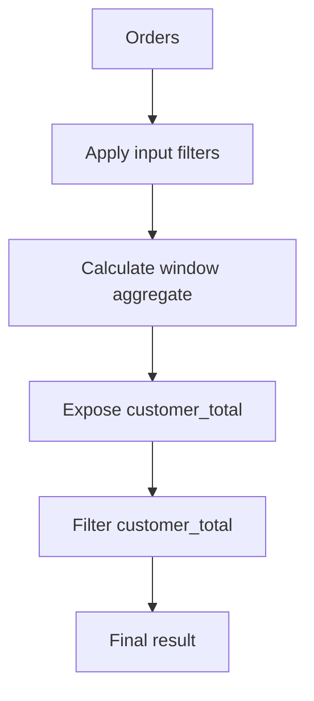
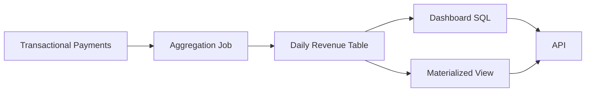

# 11- Practical Window Aggregate Patterns

## Overview

Window aggregate functions become most valuable when a backend query needs **aggregate context without losing row-level detail**. Instead of collapsing rows with `GROUP BY`, a window aggregate calculates a metric across a defined set of rows and attaches that metric to every applicable row.

Typical production use cases include:

- Customer totals alongside individual orders.
- Running account balances.
- Revenue accumulated over time.
- Moving averages for operational metrics.
- Percentage of a customer's or tenant's total.
- Minimum and maximum values within a business group.
- Event-level records enriched with session or user statistics.
- Comparing individual records against group-level metrics.

The basic form is:

```sql
aggregate_function(value) OVER (
    PARTITION BY grouping_columns
    ORDER BY ordering_columns
)
```

The important engineering decision is not merely which aggregate to use. It is defining the correct **input rows, partition, ordering, frame, and query level**.

## Window Aggregates vs `GROUP BY`

`GROUP BY` changes the result's granularity. Window aggregates preserve it.

Given:

```text
orders
────────────────────────────
order_id  customer_id  amount
1         101          100
2         101          150
3         102          200
```

A grouped aggregate:

```sql
SELECT
    customer_id,
    SUM(amount) AS total_amount
FROM orders
GROUP BY customer_id;
```

returns:

```text
customer_id  total_amount
101          250
102          200
```

A window aggregate:

```sql
SELECT
    order_id,
    customer_id,
    amount,
    SUM(amount) OVER (
        PARTITION BY customer_id
    ) AS customer_total
FROM orders;
```

returns:

```text
order_id  customer_id  amount  customer_total
1         101          100     250
2         101          150     250
3         102          200     200
```

This makes window aggregates ideal for enriching API and reporting rows with contextual metrics.

| Requirement | Best fit |
|---|---|
| One row per customer | `GROUP BY` |
| Every order plus customer total | Window `SUM()` |
| Every order plus customer average | Window `AVG()` |
| Running total | Window `SUM()` + `ORDER BY` + frame |
| Moving average | Window `AVG()` + frame |
| Group minimum/max | Window `MIN()` / `MAX()` |
| Rank rows | Ranking window functions |
| Filter based on a window result | CTE or derived table |

## The Window Specification

A window aggregate can be understood as several independent decisions:

```sql
SUM(amount) OVER (
    PARTITION BY tenant_id, customer_id
    ORDER BY created_at, order_id
    ROWS BETWEEN UNBOUNDED PRECEDING AND CURRENT ROW
)
```

| Component | Purpose |
|---|---|
| `SUM(amount)` | What is calculated |
| `PARTITION BY` | Defines independent groups |
| `ORDER BY` | Defines row sequence |
| `ROWS` | Uses a physical row-based frame |
| `BETWEEN ... AND ...` | Defines the frame boundaries |

Not every query needs every component.

For a group total:

```sql
SUM(amount) OVER (
    PARTITION BY customer_id
)
```

For a running total:

```sql
SUM(amount) OVER (
    PARTITION BY customer_id
    ORDER BY created_at, order_id
    ROWS BETWEEN UNBOUNDED PRECEDING AND CURRENT ROW
)
```

Adding `ORDER BY` changes the semantics, so it should be intentional.

## Pattern: Group Total on Every Row

A common API requirement is:

> Return every order and the customer's total spend.

```sql
SELECT
    order_id,
    customer_id,
    amount,
    SUM(amount) OVER (
        PARTITION BY customer_id
    ) AS customer_total
FROM orders
WHERE status = 'completed';
```

The result retains each order while exposing customer-level context.

This is useful for:

- Customer order APIs.
- Fraud analysis.
- Customer segmentation.
- Revenue dashboards.
- Operational reporting.

### Important Selection Rule

The `WHERE` clause affects the rows available to the window:

```sql
WHERE status = 'completed'
```

therefore `customer_total` represents the customer's **completed-order total**, not necessarily lifetime order value.

If lifetime value is required while only completed orders are displayed, move the filter to an outer query or calculate the lifetime metric in a separate query level.

## Pattern: Group Average Beside Each Row

```sql
SELECT
    order_id,
    customer_id,
    amount,
    AVG(amount) OVER (
        PARTITION BY customer_id
    ) AS customer_avg_order
FROM orders;
```

This makes it easy to compare an individual order with the customer's normal order size.

For example:

```sql
SELECT
    order_id,
    customer_id,
    amount,
    AVG(amount) OVER (
        PARTITION BY customer_id
    ) AS customer_avg_order,
    amount - AVG(amount) OVER (
        PARTITION BY customer_id
    ) AS deviation_from_average
FROM orders;
```

A production reporting query can therefore expose both the observation and its context without an additional aggregation query.

For repeated expressions, a named window can improve consistency:

```sql
SELECT
    order_id,
    customer_id,
    amount,
    AVG(amount) OVER customer_window AS customer_avg_order,
    amount - AVG(amount) OVER customer_window AS deviation_from_average
FROM orders
WINDOW customer_window AS (
    PARTITION BY customer_id
);
```

## Pattern: Running Total

Running totals are one of the most common window aggregate patterns.

```sql
SELECT
    account_id,
    transaction_id,
    occurred_at,
    amount,
    SUM(amount) OVER (
        PARTITION BY account_id
        ORDER BY occurred_at, transaction_id
        ROWS BETWEEN UNBOUNDED PRECEDING AND CURRENT ROW
    ) AS running_balance_change
FROM transactions;
```

The calculation accumulates values from the beginning of the account's transaction sequence through the current row.

### Why the Tie-Breaker Matters

Avoid:

```sql
ORDER BY occurred_at
```

when multiple transactions can share the same timestamp.

Prefer:

```sql
ORDER BY occurred_at, transaction_id
```

when `transaction_id` provides deterministic ordering.

Without a deterministic sequence, the meaning of a row-based running calculation can become ambiguous.

### Running Balance vs Account Balance

A running sum of transactions is not necessarily the same thing as the authoritative account balance.

For example:

```text
Opening balance: 1,000
Transactions:      +200
                   -100
Running balance:  1,100
```

A financial system may maintain an authoritative balance using transactional updates rather than recomputing it from the complete transaction history on every request.

Window calculations are excellent for:

- Auditing.
- Reconciliation.
- Reporting.
- Historical analysis.

They are not automatically a replacement for transactional state.

## Pattern: Running Revenue

For a monthly revenue dashboard:

```sql
WITH monthly_revenue AS (
    SELECT
        DATE_TRUNC('month', paid_at) AS month,
        SUM(amount) AS revenue
    FROM payments
    WHERE status = 'succeeded'
    GROUP BY DATE_TRUNC('month', paid_at)
)
SELECT
    month,
    revenue,
    SUM(revenue) OVER (
        ORDER BY month
        ROWS BETWEEN UNBOUNDED PRECEDING AND CURRENT ROW
    ) AS cumulative_revenue
FROM monthly_revenue
ORDER BY month;
```

The important design choice is **pre-aggregation**.

If millions of payment rows exist but the dashboard operates monthly, first reducing the data to monthly rows can dramatically reduce the amount of data processed by the window function.

```text
Payments
   │
   ▼
GROUP BY month
   │
   ▼
Monthly revenue
   │
   ▼
Window SUM()
   │
   ▼
Cumulative revenue
```

This pattern is usually more scalable than applying the running calculation directly to every payment record when only monthly results are required.

## Pattern: Moving Average

A moving average smooths short-term fluctuations.

For a seven-row moving average:

```sql
SELECT
    measured_at,
    value,
    AVG(value) OVER (
        ORDER BY measured_at
        ROWS BETWEEN 6 PRECEDING AND CURRENT ROW
    ) AS moving_average_7
FROM service_metrics
ORDER BY measured_at;
```

Each row includes the average of itself and up to the six preceding rows.

This is useful for:

- Application latency trends.
- Queue depth.
- CPU metrics.
- Request volume.
- Revenue trends.
- Sensor data.

### Row-Based vs Time-Based Windows

`ROWS` counts rows, not time.

This:

```sql
ROWS BETWEEN 6 PRECEDING AND CURRENT ROW
```

means seven records, assuming enough preceding rows exist.

It does **not** mean seven calendar days.

If measurements are irregular:

```text
Monday
Tuesday
Friday
Saturday
```

a seven-row frame and a seven-day time interval are fundamentally different concepts.

For time-based analytics, the query may need a different strategy depending on database capabilities and data model.

## Pattern: Rolling Revenue

Suppose a system records daily revenue:

```sql
SELECT
    revenue_date,
    revenue,
    SUM(revenue) OVER (
        ORDER BY revenue_date
        ROWS BETWEEN 6 PRECEDING AND CURRENT ROW
    ) AS revenue_7_rows
FROM daily_revenue
ORDER BY revenue_date;
```

If there is exactly one row per day, this corresponds to a seven-day window.

If dates can be missing, however, it represents seven available rows rather than seven calendar days.

A robust reporting model may therefore normalize the data to one row per calendar day before applying a row-based frame.

## Pattern: Partitioned Running Total

Multi-tenant applications commonly need independent running totals.

```sql
SELECT
    tenant_id,
    customer_id,
    occurred_at,
    amount,
    SUM(amount) OVER (
        PARTITION BY tenant_id, customer_id
        ORDER BY occurred_at, transaction_id
        ROWS BETWEEN UNBOUNDED PRECEDING AND CURRENT ROW
    ) AS customer_running_total
FROM transactions
WHERE tenant_id = :tenant_id;
```

Using:

```sql
PARTITION BY tenant_id, customer_id
```

makes the business boundary explicit.

This is particularly important when customer IDs are only unique within a tenant.

### Security Boundary

`PARTITION BY` should never be treated as an authorization mechanism.

The tenant filter must still exist:

```sql
WHERE tenant_id = :tenant_id
```

Authorization and tenant isolation must be enforced independently of the analytical window definition.

## Pattern: Percentage of Group Total

Window aggregates can calculate a row's contribution to its group.

```sql
SELECT
    customer_id,
    order_id,
    amount,
    SUM(amount) OVER (
        PARTITION BY customer_id
    ) AS customer_total,
    amount / NULLIF(
        SUM(amount) OVER (
            PARTITION BY customer_id
        ),
        0
    ) AS share_of_customer_total
FROM orders;
```

For percentage output:

```sql
100.0 * amount / NULLIF(
    SUM(amount) OVER (
        PARTITION BY customer_id
    ),
    0
) AS share_of_customer_total_pct
```

`NULLIF(..., 0)` prevents division-by-zero errors when the denominator can theoretically be zero.

This pattern is useful for:

- Revenue contribution.
- Product mix.
- Customer spending distribution.
- Resource consumption.
- Traffic distribution.

## Pattern: Compare a Row Against Group Statistics

Window aggregates can calculate contextual boundaries:

```sql
SELECT
    order_id,
    customer_id,
    amount,
    AVG(amount) OVER (
        PARTITION BY customer_id
    ) AS customer_avg,
    MIN(amount) OVER (
        PARTITION BY customer_id
    ) AS customer_min,
    MAX(amount) OVER (
        PARTITION BY customer_id
    ) AS customer_max
FROM orders;
```

The application can then determine whether a row is unusually large or small.

For example:

```sql
WITH metrics AS (
    SELECT
        order_id,
        customer_id,
        amount,
        AVG(amount) OVER (
            PARTITION BY customer_id
        ) AS customer_avg,
        MAX(amount) OVER (
            PARTITION BY customer_id
        ) AS customer_max
    FROM orders
)
SELECT
    order_id,
    customer_id,
    amount,
    customer_avg,
    customer_max
FROM metrics
WHERE amount >= customer_avg * 3;
```

The outer query is required because the window result cannot generally be referenced directly in `WHERE` at the same query level.

## Pattern: First and Last Values in a Group

Aggregate `MIN()` and `MAX()` operate on values, not necessarily on the row associated with those values.

For example:

```sql
MIN(amount) OVER (
    PARTITION BY customer_id
)
```

returns the smallest amount.

It does **not** identify the first order.

For temporal questions such as:

> What was the customer's first order?

use an ordering-aware function such as `FIRST_VALUE()`:

```sql
FIRST_VALUE(order_id) OVER (
    PARTITION BY customer_id
    ORDER BY created_at, order_id
) AS first_order_id
```

Similarly:

```sql
LAST_VALUE(order_id) OVER (
    PARTITION BY customer_id
    ORDER BY created_at, order_id
    ROWS BETWEEN UNBOUNDED PRECEDING AND UNBOUNDED FOLLOWING
) AS last_order_id
```

The explicit frame for `LAST_VALUE()` is important because the default frame can otherwise make the result appear to represent the current row rather than the final row in the partition.

## Pattern: Monthly Aggregation Plus Cumulative Metrics

A common production reporting pattern is:

```sql
WITH monthly_orders AS (
    SELECT
        tenant_id,
        DATE_TRUNC('month', created_at) AS month,
        COUNT(*) AS order_count,
        SUM(amount) AS revenue
    FROM orders
    WHERE tenant_id = :tenant_id
      AND created_at >= :start_date
      AND created_at < :end_date
      AND status = 'completed'
    GROUP BY
        tenant_id,
        DATE_TRUNC('month', created_at)
)
SELECT
    tenant_id,
    month,
    order_count,
    revenue,
    SUM(revenue) OVER (
        PARTITION BY tenant_id
        ORDER BY month
        ROWS BETWEEN UNBOUNDED PRECEDING AND CURRENT ROW
    ) AS cumulative_revenue,
    SUM(order_count) OVER (
        PARTITION BY tenant_id
        ORDER BY month
        ROWS BETWEEN UNBOUNDED PRECEDING AND CURRENT ROW
    ) AS cumulative_orders
FROM monthly_orders
ORDER BY month;
```

This is a strong pattern for dashboards because each stage has a clear responsibility:

| Stage | Responsibility |
|---|---|
| `WHERE` | Security, date, and business filtering |
| `GROUP BY` | Convert transactions to monthly metrics |
| Window `SUM()` | Calculate cumulative metrics |
| Final `ORDER BY` | Control presentation order |

## Pattern: Multiple Metrics in One Query

A single query can expose several dimensions of the same data:

```sql
SELECT
    order_id,
    customer_id,
    amount,
    COUNT(*) OVER (
        PARTITION BY customer_id
    ) AS customer_order_count,
    SUM(amount) OVER (
        PARTITION BY customer_id
    ) AS customer_total,
    AVG(amount) OVER (
        PARTITION BY customer_id
    ) AS customer_average,
    MIN(amount) OVER (
        PARTITION BY customer_id
    ) AS customer_minimum,
    MAX(amount) OVER (
        PARTITION BY customer_id
    ) AS customer_maximum
FROM orders
WHERE tenant_id = :tenant_id;
```

This can be much cleaner than issuing separate queries for every metric.

However, query consolidation is not automatically faster. Window processing can require sorting and memory, and a query that returns many metrics over large partitions can still be expensive.

Measure before optimizing.

## Pattern: Grouped Data Followed by Window Aggregation

When the business metric is defined at a higher granularity, aggregate first.

For example, calculating customer revenue by month:

```sql
WITH monthly_customer_revenue AS (
    SELECT
        customer_id,
        DATE_TRUNC('month', paid_at) AS month,
        SUM(amount) AS monthly_revenue
    FROM payments
    WHERE status = 'succeeded'
    GROUP BY
        customer_id,
        DATE_TRUNC('month', paid_at)
)
SELECT
    customer_id,
    month,
    monthly_revenue,
    AVG(monthly_revenue) OVER (
        PARTITION BY customer_id
    ) AS average_monthly_revenue,
    SUM(monthly_revenue) OVER (
        PARTITION BY customer_id
    ) AS total_revenue
FROM monthly_customer_revenue;
```

The window functions operate over monthly rows, not individual payments.

This is both easier to reason about and often substantially cheaper.

## Pattern: Filter Based on an Aggregate Window Result

Window functions are frequently used to calculate a value and then filter based on it.

For example:

> Return orders belonging to customers whose total spend is at least 10,000.

```sql
WITH customer_metrics AS (
    SELECT
        order_id,
        customer_id,
        amount,
        SUM(amount) OVER (
            PARTITION BY customer_id
        ) AS customer_total
    FROM orders
)
SELECT
    order_id,
    customer_id,
    amount,
    customer_total
FROM customer_metrics
WHERE customer_total >= 10000;
```

The CTE establishes a new query level.

The execution concept is:



The outer filter does not change which rows were considered by the window function.

## Pattern: Conditional Window Aggregation

Conditional aggregation can be combined with windows.

For example:

```sql
SELECT
    customer_id,
    order_id,
    amount,
    SUM(
        CASE
            WHEN status = 'completed' THEN amount
            ELSE 0
        END
    ) OVER (
        PARTITION BY customer_id
    ) AS completed_total
FROM orders;
```

In PostgreSQL, a `FILTER` clause can make the intent clearer:

```sql
SELECT
    customer_id,
    order_id,
    amount,
    SUM(amount) FILTER (
        WHERE status = 'completed'
    ) OVER (
        PARTITION BY customer_id
    ) AS completed_total
FROM orders;
```

This is useful when multiple conditional metrics are required from the same row-level dataset.

## Pattern: Event-Level Data With Session Metrics

Consider application events:

```text
tenant_id
user_id
session_id
event_type
occurred_at
duration_ms
```

A window aggregate can enrich each event with session-level statistics:

```sql
SELECT
    event_id,
    user_id,
    session_id,
    event_type,
    duration_ms,
    COUNT(*) OVER (
        PARTITION BY session_id
    ) AS session_event_count,
    SUM(duration_ms) OVER (
        PARTITION BY session_id
    ) AS session_duration_ms,
    AVG(duration_ms) OVER (
        PARTITION BY session_id
    ) AS session_avg_duration_ms
FROM events
WHERE tenant_id = :tenant_id;
```

This avoids losing individual events while exposing session context.

For very large event streams, however, a reporting or analytical store may be more appropriate than running repeated window calculations against the primary transactional database.

## Pattern: Tenant-Level Aggregation

For SaaS systems, metrics often need to exist at tenant level:

```sql
SELECT
    tenant_id,
    user_id,
    request_id,
    latency_ms,
    AVG(latency_ms) OVER (
        PARTITION BY tenant_id
    ) AS tenant_avg_latency,
    MAX(latency_ms) OVER (
        PARTITION BY tenant_id
    ) AS tenant_max_latency
FROM api_requests
WHERE tenant_id = :tenant_id;
```

This allows an individual request to be compared against tenant-level behavior.

The same technique can be used for:

- API latency.
- Job duration.
- Storage consumption.
- Billing.
- Request volume.
- Error counts.

## Window Aggregates in Backend APIs

Window queries fit naturally into REST or gRPC APIs when the API needs both entity-level and aggregate-level information.

Example response:

```json
{
  "order_id": 18421,
  "customer_id": 921,
  "amount": "250.00",
  "customer_total": "8420.00",
  "customer_average": "421.00"
}
```

Instead of:

```text
API
 ├── Query order
 ├── Query customer total
 └── Query customer average
```

the backend can sometimes use one SQL statement:

```text
API request
     │
     ▼
Application service
     │
     ▼
Parameterized SQL
     │
     ▼
PostgreSQL
     │
     ▼
Window aggregation
     │
     ▼
Serialized API response
```

This can reduce application-side joins and multiple database round trips.

The trade-off is that the database query itself may become more computationally expensive.

## Performance Considerations

Window functions commonly require the database to organize rows by partition and ordering requirements.

Potential expensive operations include:

- Sorting.
- Large partition processing.
- Temporary disk usage.
- Memory consumption.
- Scanning a large filtered dataset.

Inspect PostgreSQL execution plans:

```sql
EXPLAIN (ANALYZE, BUFFERS)
SELECT
    customer_id,
    order_id,
    amount,
    SUM(amount) OVER (
        PARTITION BY customer_id
        ORDER BY created_at, order_id
        ROWS BETWEEN UNBOUNDED PRECEDING AND CURRENT ROW
    ) AS running_total
FROM orders
WHERE tenant_id = 42;
```

Look for:

- Large `Sort` nodes.
- Disk-based sorts.
- Unexpected row counts.
- High buffer reads.
- Temporary I/O.
- Large execution times.

An index can sometimes reduce the cost of obtaining data in a useful order, but indexes do not guarantee that the optimizer will avoid sorting.

## Large Partitions and Data Skew

Average partition size can hide severe outliers.

Example:

```text
Customer A              20 rows
Customer B              50 rows
Customer C              100 rows
Large enterprise tenant 50,000,000 rows
```

A window query partitioned by customer can be dominated by the largest partition.

Production options include:

- Restricting the analysis period.
- Pre-aggregating historical data.
- Materialized views.
- Reporting tables.
- Incremental aggregation.
- Read replicas.
- Analytical databases.

Do not move expensive analytical workloads to Redis merely because the SQL query is slow. First determine whether the data belongs in the transactional database at all.

## Pre-Aggregation for High-Volume Workloads

Suppose a dashboard repeatedly requests:

```text
daily revenue
monthly revenue
cumulative revenue
```

against billions of payment records.

Running the same window computation on raw transactions for every API request is usually poor architecture.

A better pipeline may be:



Depending on freshness requirements, the aggregation layer could use:

- PostgreSQL scheduled jobs.
- Celery workers.
- Kafka consumers.
- Materialized views.
- AWS data pipelines.
- An analytical warehouse.

The correct choice depends on data volume, latency requirements, consistency requirements, and operational complexity.

## CTEs and Query Staging

CTEs are particularly useful when a practical window pattern contains multiple conceptual stages:

```sql
WITH filtered_orders AS (
    SELECT
        order_id,
        customer_id,
        created_at,
        amount
    FROM orders
    WHERE tenant_id = :tenant_id
      AND status = 'completed'
),
customer_metrics AS (
    SELECT
        *,
        SUM(amount) OVER (
            PARTITION BY customer_id
        ) AS customer_total
    FROM filtered_orders
)
SELECT
    order_id,
    customer_id,
    created_at,
    amount,
    customer_total
FROM customer_metrics
WHERE customer_total >= :minimum_total;
```

This is easier to review than a deeply nested query because each stage has a clear responsibility.

In PostgreSQL, do not assume that a CTE is always physically materialized. Modern PostgreSQL can inline eligible CTEs. Use `EXPLAIN` when execution behavior matters.

## Django Integration

Django supports window expressions through `Window()`.

For example:

```python
from django.db.models import F, Sum, Window

orders = Order.objects.annotate(
    customer_total=Window(
        expression=Sum("amount"),
        partition_by=[F("customer_id")],
    )
)
```

A running total can be represented using a window ordering and frame.

When building production ORM queries:

- Inspect generated SQL.
- Verify the generated window specification.
- Test with realistic data volumes.
- Use database-level indexes where appropriate.
- Measure query latency.
- Avoid returning unnecessary columns.

For complex analytical queries, raw SQL can sometimes communicate the intended database operation more clearly than deeply nested ORM expressions.

## Common Mistakes

### Using `GROUP BY` When Row-Level Data Is Required

Incorrect approach:

```sql
SELECT
    customer_id,
    SUM(amount) AS total
FROM orders
GROUP BY customer_id;
```

This loses the individual order rows.

Use a window aggregate when each order must remain visible:

```sql
SELECT
    order_id,
    customer_id,
    amount,
    SUM(amount) OVER (
        PARTITION BY customer_id
    ) AS total
FROM orders;
```

### Filtering Before the Wrong Calculation

This:

```sql
FROM orders
WHERE created_at >= :start_date
```

changes the rows available to the window function.

If the metric must represent all historical orders, calculate it at an inner query level and filter the display rows outside.

### Assuming `ROWS` Means Time

This:

```sql
ROWS BETWEEN 6 PRECEDING AND CURRENT ROW
```

means seven rows, not necessarily seven days.

Always confirm the data's temporal granularity.

### Forgetting a Deterministic Tie-Breaker

Prefer:

```sql
ORDER BY occurred_at, transaction_id
```

over:

```sql
ORDER BY occurred_at
```

when timestamps can collide.

### Using `MIN()` or `MAX()` to Find a Related Row

This:

```sql
MAX(created_at) OVER (
    PARTITION BY customer_id
)
```

finds the latest timestamp.

It does not automatically return the order ID associated with that timestamp.

Use `ROW_NUMBER()`, `FIRST_VALUE()`, `LAST_VALUE()`, or another appropriate technique when the requirement concerns a related row.

### Treating Window Functions as Authorization

This is unsafe:

```sql
PARTITION BY tenant_id
```

without an appropriate tenant filter or authorization boundary.

Window partitioning organizes data; it does not restrict what a caller is allowed to access.

### Running Expensive Windows on Raw Event Data

Repeatedly scanning billions of events for dashboard requests is an architectural problem, not merely a SQL syntax problem.

Consider pre-aggregation or an analytical data path.

## Interview Traps

| Question | Correct reasoning |
|---|---|
| What makes a window aggregate different from `GROUP BY`? | Window aggregates preserve row-level granularity. |
| What does `PARTITION BY` do? | Defines independent logical windows; it does not filter rows. |
| Does `WHERE` affect a window aggregate? | Yes. Rows removed at that query level are unavailable to the window function. |
| Can a window result be filtered directly in `WHERE`? | Generally no; use a CTE or derived table. |
| What does `ROWS BETWEEN 6 PRECEDING AND CURRENT ROW` mean? | At most seven rows including the current row. |
| Is a seven-row window always seven days? | No. Only if the data has exactly one row per day. |
| Why use `ORDER BY transaction_id` after a timestamp? | To make row ordering deterministic when timestamps tie. |
| Does `PARTITION BY tenant_id` provide tenant security? | No. Authorization and filtering must be explicit. |
| Can window functions operate after `GROUP BY`? | Yes. They can operate over grouped result rows. |
| Why pre-aggregate before a window function? | To reduce row count and calculate at the business granularity actually required. |
| Does a CTE always materialize in PostgreSQL? | No. Eligible CTEs may be inlined. |
| Does `MAX(timestamp)` identify the row with the latest timestamp? | No. It only returns the maximum timestamp value. |

## Production Checklist

Before shipping a window aggregate query:

- [ ] Is the required output row-level or group-level?
- [ ] Is `PARTITION BY` aligned with the business key?
- [ ] Are tenant boundaries explicit?
- [ ] Does `WHERE` select the correct calculation input?
- [ ] Should filtering happen before or after the window calculation?
- [ ] Is `ORDER BY` actually required?
- [ ] Is ordering deterministic?
- [ ] Is the window frame explicitly defined where semantics require it?
- [ ] Does `ROWS` correctly represent the intended business interval?
- [ ] Should raw data be pre-aggregated first?
- [ ] Have large and skewed partitions been tested?
- [ ] Has `EXPLAIN (ANALYZE, BUFFERS)` been reviewed?
- [ ] Are query parameters safely bound?
- [ ] Does the API really require live computation?
- [ ] Would a reporting table or materialized view be more appropriate?

## Key Takeaways

- **Window aggregates preserve row-level detail while adding group, running, or rolling metrics to each row.**
- **The combination of `PARTITION BY`, `ORDER BY`, and the frame defines the actual calculation scope; each component should be intentional.**
- **Pre-aggregate data when the business metric operates at a coarser granularity than the underlying transactional data.**
- **Use deterministic ordering, explicit tenant boundaries, correct query-level filtering, and execution-plan analysis for production workloads.**
- **For high-volume dashboards and repeated analytics, pre-aggregation or a dedicated analytical data path can be more scalable than recalculating windows over raw transactional data.**