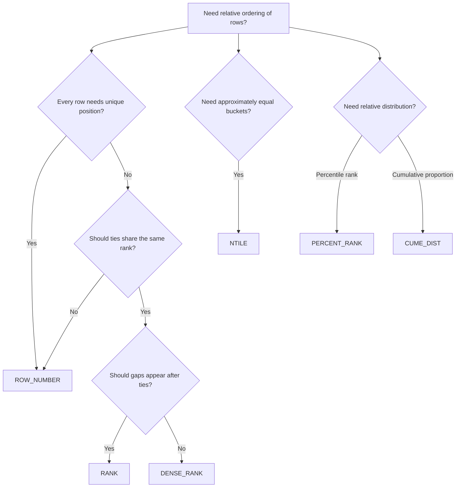

# 01- Ranking Functions Introduction

## Overview

SQL ranking functions assign a relative position to rows within a result set or within independently defined partitions. Unlike `GROUP BY`, ranking functions preserve the original rows while adding positional information such as rank, row number, or percentile.

Ranking functions are fundamental for backend queries involving:

- Top-N results per customer, tenant, category, or region.
- Leaderboards.
- Latest or highest-value record selection.
- Duplicate detection and deduplication.
- Pagination and ordered result analysis.
- Comparing records against peers.
- Identifying first, second, or subsequent events within a group.

The general form is:

```sql
RANKING_FUNCTION() OVER (
    PARTITION BY partition_columns
    ORDER BY ordering_columns
)
```

The most important ranking functions are:

| Function | Behavior |
|---|---|
| `ROW_NUMBER()` | Assigns a unique sequential number to every row |
| `RANK()` | Assigns the same rank to ties and leaves gaps afterward |
| `DENSE_RANK()` | Assigns the same rank to ties without gaps |
| `NTILE()` | Divides ordered rows into approximately equal buckets |
| `PERCENT_RANK()` | Expresses relative rank as a value from `0` to `1` |
| `CUME_DIST()` | Expresses the proportion of rows at or below the current ordering position |

Ranking is fundamentally an **ordering problem**. The correctness of the result depends heavily on the `ORDER BY` expression and whether its ordering is deterministic.

## Why Ranking Functions Matter

A common requirement is:

> Return the three highest-value orders for every customer.

A naive approach often involves correlated subqueries, self-joins, or application-side processing. A ranking function expresses the requirement directly:

```sql
SELECT
    order_id,
    customer_id,
    amount,
    ROW_NUMBER() OVER (
        PARTITION BY customer_id
        ORDER BY amount DESC, order_id
    ) AS order_position
FROM orders;
```

The database can calculate the position while retaining every order.

For backend systems, this is valuable because the ranking operation remains close to the data:

```text
Application
    │
    │ SQL query
    ▼
PostgreSQL
    │
    ├── Filter rows
    ├── Partition rows
    ├── Order rows
    ├── Calculate ranking
    └── Return ranked rows
    │
    ▼
API response
```

This generally avoids fetching large datasets into Python merely to calculate rankings.

## Basic Syntax

A ranking function normally requires an `OVER()` clause:

```sql
SELECT
    order_id,
    amount,
    ROW_NUMBER() OVER (
        ORDER BY amount DESC
    ) AS position
FROM orders;
```

Conceptually, the database:

1. Determines the rows participating in the query.
2. Sorts them according to the window's `ORDER BY`.
3. Assigns the ranking value.
4. Returns the original rows with the calculated value.

The window's `ORDER BY` is independent of the final query ordering.

For example:

```sql
SELECT
    order_id,
    amount,
    ROW_NUMBER() OVER (
        ORDER BY amount DESC
    ) AS position
FROM orders
ORDER BY created_at DESC;
```

The ranking is based on `amount`, while the returned result is displayed by `created_at`.

## `PARTITION BY`

`PARTITION BY` creates independent ranking groups.

```sql
SELECT
    order_id,
    customer_id,
    amount,
    ROW_NUMBER() OVER (
        PARTITION BY customer_id
        ORDER BY amount DESC, order_id
    ) AS customer_position
FROM orders;
```

Instead of ranking all orders globally, each customer receives a separate ranking sequence.

Example result:

| order_id | customer_id | amount | customer_position |
|---:|---:|---:|---:|
| 105 | 10 | 900 | 1 |
| 101 | 10 | 500 | 2 |
| 108 | 10 | 300 | 3 |
| 205 | 20 | 700 | 1 |
| 203 | 20 | 600 | 2 |
| 201 | 20 | 100 | 3 |

`PARTITION BY` does not remove rows. It only defines independent ranking scopes.

### Multi-Tenant Example

In a multi-tenant application, ranking should often include the tenant boundary:

```sql
ROW_NUMBER() OVER (
    PARTITION BY tenant_id, customer_id
    ORDER BY amount DESC, order_id
)
```

This prevents records from different tenants from entering the same logical ranking partition.

## Deterministic Ordering

A production ranking query should use an ordering that uniquely determines row order whenever possible.

Consider:

```sql
ROW_NUMBER() OVER (
    ORDER BY amount DESC
)
```

If multiple rows have the same `amount`, their relative order is not fully defined.

Use a stable tie-breaker:

```sql
ROW_NUMBER() OVER (
    ORDER BY amount DESC, order_id
)
```

The first expression defines the business ordering. The unique identifier makes the ordering deterministic.

This matters for:

- API pagination.
- Reproducible reports.
- Deduplication.
- Top-N selection.
- Tests.
- Distributed application behavior.

A ranking query should not depend on accidental physical row order.

## Ranking Function Comparison

Consider values:

```text
100
100
90
80
80
70
```

The functions produce different results:

| Value | `ROW_NUMBER()` | `RANK()` | `DENSE_RANK()` |
|---:|---:|---:|---:|
| 100 | 1 | 1 | 1 |
| 100 | 2 | 1 | 1 |
| 90 | 3 | 3 | 2 |
| 80 | 4 | 4 | 3 |
| 80 | 5 | 4 | 3 |
| 70 | 6 | 6 | 4 |

The distinction is important:

- `ROW_NUMBER()` treats every row as a separate position.
- `RANK()` treats ties equally and leaves gaps.
- `DENSE_RANK()` treats ties equally but does not leave gaps.

## `ROW_NUMBER()`

`ROW_NUMBER()` assigns a unique sequential number to every row.

```sql
SELECT
    order_id,
    customer_id,
    amount,
    ROW_NUMBER() OVER (
        PARTITION BY customer_id
        ORDER BY amount DESC, order_id
    ) AS row_number
FROM orders;
```

### When to Use

Use `ROW_NUMBER()` when each row needs a unique position.

Common production uses:

- Selecting the latest record per entity.
- Selecting exactly one row from duplicates.
- Top-N rows per group.
- Stable ranking within a partition.
- Deduplication.

### Latest Record Per Customer

```sql
WITH ranked_orders AS (
    SELECT
        order_id,
        customer_id,
        created_at,
        ROW_NUMBER() OVER (
            PARTITION BY customer_id
            ORDER BY created_at DESC, order_id DESC
        ) AS rn
    FROM orders
)
SELECT
    order_id,
    customer_id,
    created_at
FROM ranked_orders
WHERE rn = 1;
```

This is a standard pattern for retrieving one latest row per entity.

## `RANK()`

`RANK()` gives equal values the same rank.

```sql
SELECT
    product_id,
    revenue,
    RANK() OVER (
        ORDER BY revenue DESC
    ) AS revenue_rank
FROM products;
```

If two products tie for first place, both receive rank `1`, and the next product receives rank `3`.

### When to Use

Use `RANK()` when ties should consume multiple positions.

Typical examples:

- Competition leaderboards.
- Revenue rankings.
- Performance rankings.
- Scores where tied records should share a position.

For example:

```text
Score    Rank
100      1
100      1
95       3
90       4
```

The gap is intentional.

## `DENSE_RANK()`

`DENSE_RANK()` also assigns equal values the same rank, but does not create gaps.

```sql
SELECT
    product_id,
    revenue,
    DENSE_RANK() OVER (
        ORDER BY revenue DESC
    ) AS revenue_rank
FROM products;
```

Example:

```text
Score    Dense Rank
100      1
100      1
95       2
90       3
```

Use `DENSE_RANK()` when the requirement is based on distinct ordered values rather than physical row positions.

## `NTILE()`

`NTILE(n)` divides ordered rows into approximately equal-sized buckets.

```sql
SELECT
    customer_id,
    lifetime_value,
    NTILE(4) OVER (
        ORDER BY lifetime_value DESC
    ) AS quartile
FROM customers;
```

This can be used to divide customers into four groups.

Typical applications include:

- Customer segmentation.
- Performance bands.
- Percentile-style reporting.
- Experiment analysis.
- Risk or priority buckets.

`NTILE()` does not guarantee equal bucket sizes when the number of rows is not divisible by the bucket count.

## Percentile-Oriented Ranking

`PERCENT_RANK()` returns relative rank between `0` and `1`.

```sql
SELECT
    customer_id,
    lifetime_value,
    PERCENT_RANK() OVER (
        ORDER BY lifetime_value
    ) AS relative_rank
FROM customers;
```

For a partition containing more than one row:

```text
Lowest value  → 0
Highest value → 1
```

`PERCENT_RANK()` is calculated conceptually as:

```text
(rank - 1) / (number_of_rows - 1)
```

A single-row partition is a special case and produces `0`.

## `CUME_DIST()`

`CUME_DIST()` calculates the proportion of rows whose ordering value is less than or equal to the current row's ordering value.

```sql
SELECT
    customer_id,
    lifetime_value,
    CUME_DIST() OVER (
        ORDER BY lifetime_value
    ) AS cumulative_distribution
FROM customers;
```

Unlike `PERCENT_RANK()`, `CUME_DIST()` incorporates the current peer group.

This makes it useful for questions such as:

> What percentage of customers have lifetime value less than or equal to this customer's value?

## Choosing the Right Ranking Function

| Requirement | Function |
|---|---|
| Every row needs a unique sequence | `ROW_NUMBER()` |
| Ties share rank and gaps matter | `RANK()` |
| Ties share rank and gaps should disappear | `DENSE_RANK()` |
| Divide rows into N groups | `NTILE()` |
| Relative rank from 0 to 1 | `PERCENT_RANK()` |
| Proportion at or below current value | `CUME_DIST()` |

The key business question is:

> Does a tie represent the same position, or does every row need its own position?

That answer usually determines the correct function.

## Top-N Per Group

One of the most important production patterns is selecting the top N rows within every group.

For example, retrieve the three highest-value orders per customer:

```sql
WITH ranked_orders AS (
    SELECT
        order_id,
        customer_id,
        amount,
        created_at,
        ROW_NUMBER() OVER (
            PARTITION BY customer_id
            ORDER BY amount DESC, order_id
        ) AS rn
    FROM orders
    WHERE tenant_id = :tenant_id
)
SELECT
    order_id,
    customer_id,
    amount,
    created_at
FROM ranked_orders
WHERE rn <= 3
ORDER BY customer_id, amount DESC, order_id;
```

The CTE is necessary because the window value is calculated at one query level and filtered at another.

### `RANK()` for Tie-Aware Top-N

If all records tied at the Nth rank should be included:

```sql
WITH ranked_products AS (
    SELECT
        product_id,
        category_id,
        revenue,
        RANK() OVER (
            PARTITION BY category_id
            ORDER BY revenue DESC
        ) AS category_rank
    FROM products
)
SELECT
    product_id,
    category_id,
    revenue
FROM ranked_products
WHERE category_rank <= 3;
```

This can return more than three rows for a category when ties occur.

That distinction is often an interview question and a real business requirement.

## Deduplication

`ROW_NUMBER()` can identify duplicate records while preserving one canonical row.

```sql
WITH duplicates AS (
    SELECT
        id,
        email,
        created_at,
        ROW_NUMBER() OVER (
            PARTITION BY email
            ORDER BY created_at ASC, id ASC
        ) AS rn
    FROM users
)
SELECT
    id,
    email,
    created_at
FROM duplicates
WHERE rn > 1;
```

This identifies all but the earliest record for each email.

For destructive cleanup, first validate the selection with a `SELECT`. Do not immediately convert a ranking query into `DELETE` without verifying the partition and ordering criteria.

## Ranking and Filtering Order

Window functions operate after the query's filtering stage at that query level.

Consider:

```sql
SELECT
    employee_id,
    department_id,
    salary,
    RANK() OVER (
        PARTITION BY department_id
        ORDER BY salary DESC
    ) AS salary_rank
FROM employees
WHERE active = true;
```

The ranking is calculated only over active employees.

If inactive employees should influence the ranking, filter after the ranking instead:

```sql
WITH ranked_employees AS (
    SELECT
        employee_id,
        department_id,
        salary,
        active,
        RANK() OVER (
            PARTITION BY department_id
            ORDER BY salary DESC
        ) AS salary_rank
    FROM employees
)
SELECT
    employee_id,
    department_id,
    salary,
    salary_rank
FROM ranked_employees
WHERE active = true;
```

The query structure therefore changes the business meaning.

## Ranking With Aggregation

Ranking is often applied to already aggregated business metrics.

For example, rank customers by monthly revenue:

```sql
WITH monthly_revenue AS (
    SELECT
        customer_id,
        DATE_TRUNC('month', paid_at) AS month,
        SUM(amount) AS revenue
    FROM payments
    WHERE status = 'succeeded'
    GROUP BY
        customer_id,
        DATE_TRUNC('month', paid_at)
)
SELECT
    customer_id,
    month,
    revenue,
    RANK() OVER (
        PARTITION BY month
        ORDER BY revenue DESC, customer_id
    ) AS revenue_rank
FROM monthly_revenue;
```

The window function operates on the aggregated result rather than every individual payment.

This pattern is particularly useful for dashboards and reporting APIs.

## Production Performance

Ranking functions commonly require the database to order rows within each window.

Potentially expensive operations include:

- Sorting large partitions.
- Processing large intermediate result sets.
- Ranking high-cardinality event tables.
- Repeatedly ranking the same historical data.
- Sorting after joins that greatly expand the input.

Use `EXPLAIN (ANALYZE, BUFFERS)` in PostgreSQL to inspect actual execution behavior:

```sql
EXPLAIN (ANALYZE, BUFFERS)
WITH ranked_orders AS (
    SELECT
        order_id,
        customer_id,
        amount,
        ROW_NUMBER() OVER (
            PARTITION BY customer_id
            ORDER BY amount DESC, order_id
        ) AS rn
    FROM orders
    WHERE tenant_id = 42
)
SELECT
    order_id,
    customer_id,
    amount
FROM ranked_orders
WHERE rn <= 3;
```

Do not assume that an index completely eliminates sorting for a window operation. The optimizer's chosen plan, query predicates, partitioning, ordering, and physical data layout all matter.

### Reduce Input Before Ranking

Prefer:

```sql
WITH eligible_orders AS (
    SELECT
        order_id,
        customer_id,
        amount,
        created_at
    FROM orders
    WHERE tenant_id = :tenant_id
      AND status = 'completed'
      AND created_at >= :start_date
),
ranked_orders AS (
    SELECT
        *,
        ROW_NUMBER() OVER (
            PARTITION BY customer_id
            ORDER BY amount DESC, order_id
        ) AS rn
    FROM eligible_orders
)
SELECT *
FROM ranked_orders
WHERE rn <= 3;
```

Filtering early reduces the number of rows that must participate in the ranking.

However, filtering early is only correct when those filters are part of the intended ranking population.

## Indexing Considerations

Indexes should support the overall query workload rather than being created solely because a window function exists.

For a common multi-tenant query:

```sql
SELECT
    order_id,
    customer_id,
    amount
FROM orders
WHERE tenant_id = :tenant_id
  AND status = 'completed';
```

an index may be useful around the filtering predicates.

A possible PostgreSQL index is:

```sql
CREATE INDEX CONCURRENTLY idx_orders_tenant_status_customer
ON orders (tenant_id, status, customer_id);
```

Whether this is beneficial depends on:

- Table size.
- Predicate selectivity.
- Existing indexes.
- Query frequency.
- Ordering requirements.
- Write overhead.
- PostgreSQL's selected execution plan.

Always validate with representative data and `EXPLAIN (ANALYZE, BUFFERS)`.

## Backend API Considerations

Ranking is often part of an API response.

For example:

```text
GET /customers/{id}/orders?limit=10
```

The database can return ranked records:

```sql
WITH ranked_orders AS (
    SELECT
        order_id,
        customer_id,
        amount,
        created_at,
        ROW_NUMBER() OVER (
            PARTITION BY customer_id
            ORDER BY created_at DESC, order_id DESC
        ) AS position
    FROM orders
    WHERE tenant_id = :tenant_id
      AND customer_id = :customer_id
)
SELECT
    order_id,
    amount,
    created_at,
    position
FROM ranked_orders
WHERE position <= :limit
ORDER BY position;
```

The application should validate:

- `limit` bounds.
- Tenant/customer authorization.
- Allowed sort fields.
- Pagination semantics.
- Response size.

Never interpolate user-controlled SQL identifiers or expressions directly into a query.

## Django Integration

Django supports window expressions through `Window()`.

For example:

```python
from django.db.models import F, Window
from django.db.models.functions import RowNumber

queryset = (
    Order.objects
    .filter(tenant_id=tenant_id)
    .annotate(
        position=Window(
            expression=RowNumber(),
            partition_by=[F("customer_id")],
            order_by=[F("amount").desc(), F("id").asc()],
        )
    )
)
```

When using an ORM:

- Inspect generated SQL for complex queries.
- Verify that filtering occurs at the intended query level.
- Avoid accidentally materializing large querysets in Python.
- Measure database execution time separately from serialization time.
- Use database-side ranking when the operation is naturally relational.

## Common Mistakes

| Mistake | Why it is dangerous | Better approach |
|---|---|---|
| Using `RANK()` when exactly N rows are required | Ties can return more than N rows | Use `ROW_NUMBER()` |
| Using `ROW_NUMBER()` when ties should share position | Tied rows receive different positions | Use `RANK()` or `DENSE_RANK()` |
| Omitting a tie-breaker | Results may not be deterministic | Add a stable unique column |
| Ranking before applying required filters | Wrong rows participate in ranking | Place filters at the correct query level |
| Filtering a window value directly in `WHERE` | Window values are not available at that query level | Use a CTE/subquery or supported `QUALIFY` syntax |
| Assuming final `ORDER BY` controls the window | Window ordering is independent | Define `ORDER BY` inside `OVER()` |
| Ranking after a row-multiplying join | Duplicate joined rows can distort ranking | Aggregate or deduplicate at the correct stage |
| Ranking an unbounded event table on every request | High CPU, memory, and sort costs | Restrict data or pre-aggregate |
| Treating ranking as authorization | Ranking does not enforce access boundaries | Apply tenant/user authorization predicates |
| Deleting duplicates without validating the ranking | Incorrect partition/order can delete canonical data | Preview rows and enforce uniqueness constraints |

## Interview Traps

### `RANK()` vs `DENSE_RANK()`

The key distinction is whether ties create gaps.

```text
Values:       100  100  90  80  80

RANK:           1    1   3   4   4
DENSE_RANK:     1    1   2   3   3
```

### Top 3 vs Top 3 Ranks

These are different requirements.

**Exactly three rows:**

```sql
ROW_NUMBER() OVER (
    PARTITION BY category_id
    ORDER BY revenue DESC, product_id
)
```

**All rows belonging to the top three ranks:**

```sql
RANK() OVER (
    PARTITION BY category_id
    ORDER BY revenue DESC
)
```

### Ranking Is Not Filtering

A ranking function calculates a value. It does not automatically restrict the result to a particular rank.

Use a CTE or subquery:

```sql
WITH ranked AS (
    SELECT
        *,
        ROW_NUMBER() OVER (
            PARTITION BY customer_id
            ORDER BY created_at DESC, id DESC
        ) AS rn
    FROM orders
)
SELECT *
FROM ranked
WHERE rn = 1;
```

## Ranking Function Decision Flow



## Production Checklist

Before deploying a ranking query, verify:

- **Business semantics** — Is the requirement row position, rank, dense rank, or percentile?
- **Partition scope** — Are all required tenant, customer, category, or regional boundaries present?
- **Ordering** — Is the ordering deterministic?
- **Tie behavior** — Is the behavior for equal values explicitly defined?
- **Filtering stage** — Are the correct rows included in the ranking population?
- **Query size** — Could a partition contain millions of rows?
- **Execution plan** — Has the query been tested with realistic data?
- **API limits** — Are result sizes bounded?
- **Authorization** — Are tenant and user boundaries enforced independently of the window?
- **Data lifecycle** — Should old data be archived or pre-aggregated instead of ranked repeatedly?

## Key Takeaways

- **Ranking functions preserve rows while adding positional information; `ROW_NUMBER()`, `RANK()`, and `DENSE_RANK()` differ primarily in their treatment of ties.**
- **`PARTITION BY` defines independent ranking scopes, while the window `ORDER BY` defines the ranking itself.**
- **Use deterministic tie-breakers for production queries, especially when ranking drives pagination, deduplication, or top-N selection.**
- **`ROW_NUMBER()` is the standard choice for exactly-N and latest-row patterns; `RANK()` is appropriate when tied rows should share a position.**
- **Filter and reduce the ranking input at the correct query stage, then validate large ranking workloads with realistic execution plans.**