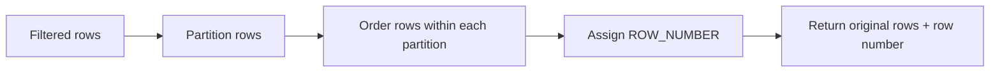

# 02- ROW_NUMBER

## Overview

`ROW_NUMBER()` is a SQL window function that assigns a unique sequential integer to every row within a defined ordering. Unlike `GROUP BY`, it does not collapse rows, making it one of the most useful functions for selecting, deduplicating, and organizing records while preserving row-level detail.

The general form is:

```sql
ROW_NUMBER() OVER (
    [PARTITION BY partition_columns]
    ORDER BY ordering_columns
)
```

The two most important components are:

- `PARTITION BY` — defines independent ranking groups.
- `ORDER BY` — defines the sequence within each group.

`ROW_NUMBER()` is particularly important in backend systems for:

- Latest-record queries.
- Top-N-per-group queries.
- Deduplication.
- Stable ordering.
- Batch selection.
- Per-customer or per-tenant ranking.
- Selecting one canonical record from multiple candidates.

## Why `ROW_NUMBER()` Exists

Traditional SQL techniques often require correlated subqueries or self-joins when a query needs to identify a row's position relative to other rows.

For example, suppose an application needs the latest order for every customer.

A window-function solution is direct:

```sql
SELECT
    order_id,
    customer_id,
    created_at,
    ROW_NUMBER() OVER (
        PARTITION BY customer_id
        ORDER BY created_at DESC, order_id DESC
    ) AS rn
FROM orders;
```

The database preserves every order and adds a calculated position.

The result might look like:

| order_id | customer_id | created_at | rn |
|---:|---:|---|---:|
| 108 | 10 | 2026-08-30 11:00 | 1 |
| 105 | 10 | 2026-08-29 15:00 | 2 |
| 101 | 10 | 2026-08-27 09:00 | 3 |
| 205 | 20 | 2026-08-30 13:00 | 1 |
| 201 | 20 | 2026-08-28 10:00 | 2 |

The same `ROW_NUMBER()` expression can then be used in an outer query to select `rn = 1`.

## How `ROW_NUMBER()` Works

At a conceptual level, the database processes the relevant rows, establishes the partitions, orders rows inside each partition, and assigns sequential numbers.



For:

```sql
ROW_NUMBER() OVER (
    PARTITION BY customer_id
    ORDER BY created_at DESC, order_id DESC
)
```

the logical operation is:

```text
Customer 10
    latest order  → 1
    next order    → 2
    next order    → 3

Customer 20
    latest order  → 1
    next order    → 2
```

The numbering restarts at `1` for every partition.

## Basic Usage

A global row number does not use `PARTITION BY`:

```sql
SELECT
    order_id,
    amount,
    ROW_NUMBER() OVER (
        ORDER BY amount DESC, order_id
    ) AS position
FROM orders;
```

This produces one sequence across the entire result set.

Example:

| order_id | amount | position |
|---:|---:|---:|
| 105 | 900 | 1 |
| 203 | 800 | 2 |
| 101 | 700 | 3 |
| 205 | 500 | 4 |

The ranking is based on the window's `ORDER BY`.

## `ROW_NUMBER()` With `PARTITION BY`

`PARTITION BY` creates independent sequences.

```sql
SELECT
    order_id,
    customer_id,
    amount,
    ROW_NUMBER() OVER (
        PARTITION BY customer_id
        ORDER BY amount DESC, order_id
    ) AS customer_position
FROM orders;
```

Example:

| order_id | customer_id | amount | customer_position |
|---:|---:|---:|---:|
| 105 | 10 | 900 | 1 |
| 101 | 10 | 700 | 2 |
| 108 | 10 | 500 | 3 |
| 205 | 20 | 800 | 1 |
| 201 | 20 | 600 | 2 |
| 203 | 20 | 400 | 3 |

`PARTITION BY` does **not** group rows into one result row. It only controls where numbering restarts.

This distinction is critical:

```text
GROUP BY
    many rows → one row per group

ROW_NUMBER()
    many rows → many rows + position per row
```

## Deterministic Ordering

The most important production concern with `ROW_NUMBER()` is deterministic ordering.

Consider:

```sql
ROW_NUMBER() OVER (
    ORDER BY amount DESC
)
```

If several rows have the same amount, SQL does not necessarily guarantee their relative order.

For example:

```text
order_id    amount
101         500
102         500
103         500
```

Their row numbers could be assigned in different orders between executions or execution plans.

Use a stable tie-breaker:

```sql
ROW_NUMBER() OVER (
    ORDER BY amount DESC, order_id ASC
)
```

For a latest-record query:

```sql
ROW_NUMBER() OVER (
    PARTITION BY customer_id
    ORDER BY created_at DESC, order_id DESC
)
```

The unique identifier makes the ordering deterministic when timestamps are equal.

### Why This Matters

Deterministic ordering is particularly important for:

- API pagination.
- Deduplication.
- Latest-record selection.
- Top-N queries.
- Reproducible reports.
- Automated tests.
- Batch processing.

Never rely on accidental physical table order.

## Selecting the Latest Row Per Group

This is one of the most common `ROW_NUMBER()` patterns.

```sql
WITH ranked_orders AS (
    SELECT
        order_id,
        customer_id,
        amount,
        created_at,
        ROW_NUMBER() OVER (
            PARTITION BY customer_id
            ORDER BY created_at DESC, order_id DESC
        ) AS rn
    FROM orders
)
SELECT
    order_id,
    customer_id,
    amount,
    created_at
FROM ranked_orders
WHERE rn = 1;
```

The query means:

> Within each customer, sort orders from newest to oldest and keep the first row.

This pattern works for many entities:

```text
Latest order per customer
Latest payment per invoice
Latest status per shipment
Latest configuration per service
Latest event per device
Latest profile version per user
```

## Why the CTE Is Needed

A common mistake is attempting:

```sql
SELECT
    order_id,
    customer_id,
    ROW_NUMBER() OVER (
        PARTITION BY customer_id
        ORDER BY created_at DESC
    ) AS rn
FROM orders
WHERE rn = 1;
```

This is invalid in SQL systems such as PostgreSQL because the window result is not available to the `WHERE` clause at the same query level.

Use a CTE or derived table:

```sql
WITH ranked AS (
    SELECT
        order_id,
        customer_id,
        created_at,
        ROW_NUMBER() OVER (
            PARTITION BY customer_id
            ORDER BY created_at DESC, order_id DESC
        ) AS rn
    FROM orders
)
SELECT *
FROM ranked
WHERE rn = 1;
```

Conceptually:

```text
orders
   │
   ▼
calculate ROW_NUMBER()
   │
   ▼
ranked result
   │
   ▼
WHERE rn = 1
   │
   ▼
one row per customer
```

## Top-N Per Group

`ROW_NUMBER()` is the standard solution when the requirement is:

> Return exactly N rows per group.

For the three highest-value orders per customer:

```sql
WITH ranked_orders AS (
    SELECT
        order_id,
        customer_id,
        amount,
        created_at,
        ROW_NUMBER() OVER (
            PARTITION BY customer_id
            ORDER BY amount DESC, order_id
        ) AS rn
    FROM orders
)
SELECT
    order_id,
    customer_id,
    amount,
    created_at
FROM ranked_orders
WHERE rn <= 3
ORDER BY customer_id, rn;
```

If every customer has at least three orders, this returns exactly three rows per customer.

If a customer has fewer than three orders, all available rows are returned.

## `ROW_NUMBER()` vs `RANK()` vs `DENSE_RANK()`

These functions should not be treated as interchangeable.

Suppose the values are:

```text
100
100
90
80
80
70
```

The result is:

| Value | `ROW_NUMBER()` | `RANK()` | `DENSE_RANK()` |
|---:|---:|---:|---:|
| 100 | 1 | 1 | 1 |
| 100 | 2 | 1 | 1 |
| 90 | 3 | 3 | 2 |
| 80 | 4 | 4 | 3 |
| 80 | 5 | 4 | 3 |
| 70 | 6 | 6 | 4 |

The distinction:

- `ROW_NUMBER()` gives every row a unique position.
- `RANK()` gives tied rows the same position and leaves gaps.
- `DENSE_RANK()` gives tied rows the same position without gaps.

### Choosing `ROW_NUMBER()`

Use `ROW_NUMBER()` when the requirement is:

> Select exactly one or exactly N physical rows.

Use `RANK()` when the requirement is:

> Select all rows belonging to the top N ranks, including ties.

This difference is important for leaderboard and reporting requirements.

## Deduplication

`ROW_NUMBER()` is useful for detecting duplicate logical records.

Suppose a legacy `users` table contains multiple records with the same email:

```sql
WITH ranked_users AS (
    SELECT
        id,
        email,
        created_at,
        ROW_NUMBER() OVER (
            PARTITION BY email
            ORDER BY created_at ASC, id ASC
        ) AS rn
    FROM users
)
SELECT
    id,
    email,
    created_at
FROM ranked_users
WHERE rn > 1;
```

The query identifies all records except the canonical earliest record.

For production cleanup:

1. Run the query as a `SELECT`.
2. Validate the rows selected for removal.
3. Determine why duplicates were possible.
4. Add an appropriate uniqueness constraint where the business model permits it.
5. Only then perform controlled deletion or archival.

`ROW_NUMBER()` can identify duplicates, but it does not prevent them.

## Deduplication With Business Rules

The canonical record does not always need to be the oldest.

For example, keep the most recently verified account:

```sql
WITH ranked_users AS (
    SELECT
        id,
        email,
        verified_at,
        created_at,
        ROW_NUMBER() OVER (
            PARTITION BY email
            ORDER BY
                verified_at DESC NULLS LAST,
                created_at ASC,
                id ASC
        ) AS rn
    FROM users
)
SELECT
    id,
    email,
    verified_at,
    created_at
FROM ranked_users
WHERE rn = 1;
```

The ordering expresses the business rule:

1. Prefer verified accounts.
2. Among equally verified records, prefer the earliest creation time.
3. Use `id` as a deterministic tie-breaker.

The window function itself is simple; the correctness comes from designing the ordering criteria correctly.

## Filtering Before Ranking

Filters determine which rows participate in the ranking.

Consider:

```sql
SELECT
    employee_id,
    department_id,
    salary,
    ROW_NUMBER() OVER (
        PARTITION BY department_id
        ORDER BY salary DESC, employee_id
    ) AS rn
FROM employees
WHERE active = true;
```

Only active employees are ranked.

If the business requirement is:

> Rank everyone, then show only active employees who are in the top three overall,

the query must be structured differently:

```sql
WITH ranked_employees AS (
    SELECT
        employee_id,
        department_id,
        salary,
        active,
        ROW_NUMBER() OVER (
            PARTITION BY department_id
            ORDER BY salary DESC, employee_id
        ) AS rn
    FROM employees
)
SELECT
    employee_id,
    department_id,
    salary
FROM ranked_employees
WHERE active = true
  AND rn <= 3;
```

These queries produce different results.

This is a common source of production bugs because moving a predicate between query levels changes the ranking population.

## Ranking After Aggregation

`ROW_NUMBER()` can rank already aggregated business metrics.

For example, rank customers by monthly revenue:

```sql
WITH monthly_revenue AS (
    SELECT
        customer_id,
        DATE_TRUNC('month', paid_at) AS month,
        SUM(amount) AS revenue
    FROM payments
    WHERE status = 'succeeded'
    GROUP BY
        customer_id,
        DATE_TRUNC('month', paid_at)
),
ranked_customers AS (
    SELECT
        customer_id,
        month,
        revenue,
        ROW_NUMBER() OVER (
            PARTITION BY month
            ORDER BY revenue DESC, customer_id
        ) AS rn
    FROM monthly_revenue
)
SELECT
    customer_id,
    month,
    revenue,
    rn
FROM ranked_customers
WHERE rn <= 10
ORDER BY month, rn;
```

The ranking operates on one row per customer per month, not on individual payment records.

This is useful for:

- Analytics APIs.
- Admin dashboards.
- Revenue reports.
- Customer leaderboards.
- Operational reporting.

## Multi-Tenant Systems

In a multi-tenant application, tenant boundaries should normally be represented explicitly.

For example:

```sql
ROW_NUMBER() OVER (
    PARTITION BY tenant_id, customer_id
    ORDER BY created_at DESC, order_id DESC
)
```

Alternatively, if the request is already scoped to a single tenant:

```sql
WHERE tenant_id = :tenant_id
```

The correct design depends on the business requirement.

For security-sensitive multi-tenant systems, authorization should not rely on `PARTITION BY`. A partition controls ranking; it is not an authorization mechanism.

A tenant filter must still restrict the accessible rows:

```sql
SELECT
    order_id,
    customer_id,
    amount,
    ROW_NUMBER() OVER (
        PARTITION BY customer_id
        ORDER BY amount DESC, order_id
    ) AS rn
FROM orders
WHERE tenant_id = :tenant_id;
```

## Pagination Considerations

`ROW_NUMBER()` can produce numbered results, but it is not automatically a replacement for robust pagination.

For example:

```sql
SELECT
    order_id,
    created_at,
    ROW_NUMBER() OVER (
        ORDER BY created_at DESC, order_id DESC
    ) AS position
FROM orders;
```

Using `position` as an API cursor can be problematic when records are inserted or deleted between requests.

For high-volume APIs, keyset pagination is often preferable:

```sql
SELECT
    order_id,
    created_at,
    amount
FROM orders
WHERE (created_at, order_id) < (:cursor_created_at, :cursor_order_id)
ORDER BY created_at DESC, order_id DESC
LIMIT :page_size;
```

`ROW_NUMBER()` is excellent for analytical positioning, but pagination strategy should account for concurrent writes.

## Backend Application Integration

### Django

Django supports window expressions through `Window()`.

```python
from django.db.models import F, Window
from django.db.models.functions import RowNumber

queryset = (
    Order.objects
    .filter(tenant_id=tenant_id)
    .annotate(
        position=Window(
            expression=RowNumber(),
            partition_by=[F("customer_id")],
            order_by=[
                F("created_at").desc(),
                F("id").desc(),
            ],
        )
    )
)
```

For complex ranking queries:

- Inspect the generated SQL.
- Confirm filtering happens at the intended query level.
- Avoid evaluating large querysets in Python.
- Measure database execution time separately from serialization.
- Use database-side ranking when the operation is relational.

### FastAPI or REST APIs

A ranking query can support endpoints such as:

```text
GET /customers/{customer_id}/orders
GET /categories/{category_id}/top-products
GET /accounts/latest-events
```

Validate application-controlled parameters such as:

- Maximum result size.
- Allowed ordering fields.
- Tenant scope.
- Customer ownership.
- Date ranges.

Never interpolate arbitrary client-provided SQL expressions into the query.

## Performance Considerations

`ROW_NUMBER()` can require the database to order rows within each partition.

Large workloads can therefore involve significant:

- CPU usage.
- Memory consumption.
- Temporary storage.
- Sort operations.
- Query latency.

Inspect PostgreSQL execution plans with:

```sql
EXPLAIN (ANALYZE, BUFFERS)
WITH ranked_orders AS (
    SELECT
        order_id,
        customer_id,
        amount,
        ROW_NUMBER() OVER (
            PARTITION BY customer_id
            ORDER BY amount DESC, order_id
        ) AS rn
    FROM orders
    WHERE tenant_id = 42
)
SELECT
    order_id,
    customer_id,
    amount
FROM ranked_orders
WHERE rn <= 3;
```

### Reduce the Input When Correct

If only completed orders in a recent period are relevant, restrict the input before ranking:

```sql
WITH ranked_orders AS (
    SELECT
        order_id,
        customer_id,
        amount,
        ROW_NUMBER() OVER (
            PARTITION BY customer_id
            ORDER BY amount DESC, order_id
        ) AS rn
    FROM orders
    WHERE tenant_id = :tenant_id
      AND status = 'completed'
      AND created_at >= :start_date
)
SELECT
    order_id,
    customer_id,
    amount
FROM ranked_orders
WHERE rn <= 3;
```

This can significantly reduce the amount of data processed.

Do not apply filters early merely for performance if those rows are supposed to participate in the ranking.

## Indexing Considerations

An index can improve filtering and sometimes help the overall execution strategy, but an index does not automatically eliminate all work associated with a window function.

For example:

```sql
CREATE INDEX CONCURRENTLY idx_orders_tenant_customer_created
ON orders (
    tenant_id,
    customer_id,
    created_at DESC,
    order_id DESC
);
```

This may be useful for workloads that frequently scope by tenant and customer while ordering by creation time.

Whether it improves the actual query depends on:

- Predicate selectivity.
- Existing indexes.
- Table size.
- Query shape.
- PostgreSQL planner decisions.
- Data distribution.
- Write workload.

Validate indexes using realistic data and execution plans rather than adding indexes solely because a window query contains `ORDER BY`.

## Production Considerations

### Correctness

Define the business meaning before choosing the ordering:

```text
"latest"
    → created_at DESC + unique tie-breaker

"highest value"
    → amount DESC + unique tie-breaker

"oldest canonical record"
    → created_at ASC + unique tie-breaker
```

Do not leave tie behavior implicit.

### Scalability

For very large event or transaction tables:

- Filter by tenant and relevant time range.
- Avoid ranking historical data on every request.
- Pre-aggregate recurring analytics workloads.
- Consider materialized views for expensive reporting.
- Archive data that no longer belongs in operational queries.
- Benchmark worst-case partition sizes.

### Reliability

If the query feeds critical workflows, test:

- Empty partitions.
- Single-row partitions.
- Duplicate ordering values.
- Large partitions.
- Null ordering values.
- Concurrent inserts.
- Concurrent deletes.
- Multiple tenants.

### Security

`ROW_NUMBER()` itself does not introduce an authorization boundary.

Always enforce:

```sql
WHERE tenant_id = :tenant_id
```

or the appropriate ownership predicate independently of the ranking logic.

Use parameterized queries for values:

```python
cursor.execute(
    """
    SELECT
        order_id,
        amount
    FROM orders
    WHERE tenant_id = %s
    """,
    [tenant_id],
)
```

Do not construct SQL by concatenating request parameters.

## Common Mistakes

| Mistake | Problem | Correct approach |
|---|---|---|
| Omitting `ORDER BY` | `ROW_NUMBER()` has no meaningful business sequence | Define explicit ordering |
| Ordering only by a non-unique column | Ties may produce nondeterministic numbering | Add a stable tie-breaker |
| Using `RANK()` for exactly N rows | Ties can produce more than N rows | Use `ROW_NUMBER()` |
| Filtering `rn` in the same `WHERE` level | Window result is not available there | Use a CTE or subquery |
| Filtering before ranking unintentionally | The ranking population changes | Put predicates at the correct query level |
| Assuming `ROW_NUMBER()` prevents duplicates | It only identifies positions | Add database constraints where appropriate |
| Using it as an authorization mechanism | Ranking does not restrict access | Enforce tenant/ownership predicates |
| Ranking millions of rows on every API request | High query cost and latency | Restrict, pre-aggregate, or materialize |
| Using row numbers as durable identifiers | Numbers can change when data changes | Use actual primary keys |
| Treating `ROW_NUMBER()` as cursor pagination | Concurrent writes can shift positions | Prefer keyset pagination for mutable datasets |

## Interview Patterns

### Find the Latest Record Per User

```sql
WITH ranked AS (
    SELECT
        id,
        user_id,
        status,
        created_at,
        ROW_NUMBER() OVER (
            PARTITION BY user_id
            ORDER BY created_at DESC, id DESC
        ) AS rn
    FROM user_status_history
)
SELECT
    id,
    user_id,
    status,
    created_at
FROM ranked
WHERE rn = 1;
```

### Find the Second-Highest Record Per Group

```sql
WITH ranked AS (
    SELECT
        employee_id,
        department_id,
        salary,
        ROW_NUMBER() OVER (
            PARTITION BY department_id
            ORDER BY salary DESC, employee_id
        ) AS rn
    FROM employees
)
SELECT
    employee_id,
    department_id,
    salary
FROM ranked
WHERE rn = 2;
```

Be careful: this means the **second row**, not necessarily the second distinct salary. If equal salaries should share a position, use `DENSE_RANK()`.

### Find Top 3 Products Per Category

```sql
WITH ranked_products AS (
    SELECT
        product_id,
        category_id,
        revenue,
        ROW_NUMBER() OVER (
            PARTITION BY category_id
            ORDER BY revenue DESC, product_id
        ) AS rn
    FROM product_revenue
)
SELECT
    product_id,
    category_id,
    revenue
FROM ranked_products
WHERE rn <= 3;
```

## `ROW_NUMBER()` Decision Guide

| Requirement | Recommended approach |
|---|---|
| Number every row globally | `ROW_NUMBER() OVER (ORDER BY ...)` |
| Number rows independently per group | `ROW_NUMBER() OVER (PARTITION BY ... ORDER BY ...)` |
| Get latest row per entity | Partition by entity, order descending, filter `rn = 1` |
| Get exactly N rows per group | Filter `rn <= N` |
| Deduplicate while selecting a canonical row | Partition by logical key and define canonical ordering |
| Include all ties in top N | Prefer `RANK()` |
| Rank distinct values without gaps | Prefer `DENSE_RANK()` |
| Stable API pagination on mutable data | Prefer keyset pagination over row-number offsets |

## Key Takeaways

- **`ROW_NUMBER()` assigns a unique sequential position to every row and restarts numbering for each `PARTITION BY` group.**
- **Always define deterministic ordering with a stable tie-breaker when ranking affects correctness, pagination, deduplication, or record selection.**
- **Use a CTE or subquery when filtering on `ROW_NUMBER()` because the window value is calculated at a later query stage than `WHERE`.**
- **`ROW_NUMBER()` is the standard tool for exactly-N and latest-row-per-group patterns; use `RANK()` or `DENSE_RANK()` when ties have business meaning.**
- **For production workloads, control partition size, enforce authorization separately, inspect execution plans, and avoid using row positions as durable identifiers or mutable-data cursors.**