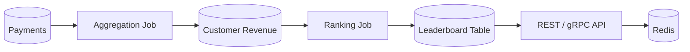

# 04- DENSE_RANK

## Overview

`DENSE_RANK()` is a SQL window function that assigns a rank to each row based on an ordering while assigning the same rank to rows with equal ordering values. Unlike `RANK()`, it does not leave gaps after ties.

The general syntax is:

```sql
DENSE_RANK() OVER (
    [PARTITION BY partition_columns]
    ORDER BY ordering_columns
)
```

`DENSE_RANK()` is particularly useful when ranking **distinct values** rather than individual rows. Common backend and analytics use cases include:

- Finding the second-highest or third-highest distinct value.
- Building leaderboards where tied values share a position.
- Ranking employees within departments.
- Selecting the top N distinct metric values.
- Ranking products by price, revenue, or rating.
- Generating period-specific rankings.

The fundamental behavior is:

```text
ROW_NUMBER() → unique position for every row
RANK()       → ties share a rank; gaps appear
DENSE_RANK() → ties share a rank; no gaps
```

## Why `DENSE_RANK()` Exists

Consider the following scores:

| Player | Score |
|---|---:|
| Alice | 100 |
| Bob | 100 |
| Carol | 90 |
| Dave | 80 |
| Eve | 80 |
| Frank | 70 |

Using `DENSE_RANK()`:

| Player | Score | Dense Rank |
|---|---:|---:|
| Alice | 100 | 1 |
| Bob | 100 | 1 |
| Carol | 90 | 2 |
| Dave | 80 | 3 |
| Eve | 80 | 3 |
| Frank | 70 | 4 |

The ranks correspond to distinct score values:

```text
100 → 1
 90 → 2
 80 → 3
 70 → 4
```

This makes `DENSE_RANK()` useful when the business definition is based on **distinct ordered values** rather than the physical number of rows preceding each row.

## How `DENSE_RANK()` Works

The database evaluates the rows according to the window ordering and assigns the same rank to rows whose complete ordering keys are equal.

Conceptually:

```text
Rows
  │
  ▼
ORDER BY ranking metric
  │
  ▼
Identify equal ordering values
  │
  ▼
Assign one rank per distinct value
  │
  ▼
Increment rank without gaps
```

For:

```text
100
100
90
80
80
70
```

the output is:

```text
100 → 1
100 → 1
 90 → 2
 80 → 3
 80 → 3
 70 → 4
```

The next rank depends on the number of **distinct preceding ordering values**, not the number of preceding rows.

## Basic Usage

A global ranking can be calculated without a partition:

```sql
SELECT
    employee_id,
    salary,
    DENSE_RANK() OVER (
        ORDER BY salary DESC
    ) AS salary_rank
FROM employees;
```

Example:

| employee_id | salary | salary_rank |
|---:|---:|---:|
| 101 | 150000 | 1 |
| 102 | 150000 | 1 |
| 103 | 130000 | 2 |
| 104 | 120000 | 3 |
| 105 | 120000 | 3 |
| 106 | 100000 | 4 |

The ranking represents the position of each **distinct salary level**.

## `DENSE_RANK()` With `PARTITION BY`

`PARTITION BY` creates independent ranking groups.

For example, rank employees by salary within each department:

```sql
SELECT
    employee_id,
    department_id,
    salary,
    DENSE_RANK() OVER (
        PARTITION BY department_id
        ORDER BY salary DESC
    ) AS department_salary_rank
FROM employees;
```

Example:

| employee_id | department_id | salary | department_salary_rank |
|---:|---:|---:|---:|
| 101 | 10 | 150000 | 1 |
| 102 | 10 | 150000 | 1 |
| 103 | 10 | 120000 | 2 |
| 104 | 10 | 100000 | 3 |
| 201 | 20 | 180000 | 1 |
| 202 | 20 | 140000 | 2 |
| 203 | 20 | 140000 | 2 |

The rank restarts at `1` for every department.

`PARTITION BY` defines the independent ranking population; it does not reduce the number of result rows.

## `DENSE_RANK()` vs `RANK()` vs `ROW_NUMBER()`

This distinction is one of the most important window-function interview topics.

Suppose the ordering values are:

```text
100
100
90
80
80
70
```

| Value | `ROW_NUMBER()` | `RANK()` | `DENSE_RANK()` |
|---:|---:|---:|---:|
| 100 | 1 | 1 | 1 |
| 100 | 2 | 1 | 1 |
| 90 | 3 | 3 | 2 |
| 80 | 4 | 4 | 3 |
| 80 | 5 | 4 | 3 |
| 70 | 6 | 6 | 4 |

### `ROW_NUMBER()`

Every row receives a unique position.

Use it when the requirement is:

> Select exactly N rows.

### `RANK()`

Tied rows share the same rank, and subsequent ranks contain gaps.

Use it when the requirement is:

> Preserve competition-style ranking.

### `DENSE_RANK()`

Tied rows share the same rank, and subsequent ranks do not contain gaps.

Use it when the requirement is:

> Rank distinct values without gaps.

## The Core Difference Between `RANK()` and `DENSE_RANK()`

The difference becomes obvious when multiple rows tie.

Given:

```text
100
100
100
90
80
80
70
```

`RANK()` produces:

```text
100 → 1
100 → 1
100 → 1
 90 → 4
 80 → 5
 80 → 5
 70 → 7
```

`DENSE_RANK()` produces:

```text
100 → 1
100 → 1
100 → 1
 90 → 2
 80 → 3
 80 → 3
 70 → 4
```

The rule is:

```text
RANK()
next rank = previous rank + number of tied rows

DENSE_RANK()
next rank = previous rank + 1
```

This makes `DENSE_RANK()` the natural choice when the ranking represents distinct ordered values.

## Ordering Determines Tie Semantics

The expressions inside the window `ORDER BY` determine whether rows are tied.

Consider:

```sql
DENSE_RANK() OVER (
    ORDER BY salary DESC
)
```

Employees with the same salary receive the same rank.

Now add a unique employee ID:

```sql
DENSE_RANK() OVER (
    ORDER BY salary DESC, employee_id
)
```

The complete ordering keys are now unique, so equal salaries no longer tie.

Example:

```text
salary    employee_id    dense_rank

150000    101             1
150000    102             2
130000    103             3
```

This is often an accidental bug.

### Production Rule

Only include columns in the window `ORDER BY` that should determine the business ranking.

If `employee_id` is only required for deterministic display ordering, keep it outside the ranking expression:

```sql
SELECT
    employee_id,
    salary,
    DENSE_RANK() OVER (
        ORDER BY salary DESC
    ) AS salary_rank
FROM employees
ORDER BY
    salary_rank,
    employee_id;
```

Here:

- `salary` determines rank.
- `employee_id` determines presentation order.
- Equal salaries remain tied.

## Finding the Second-Highest Distinct Value

One of the classic uses of `DENSE_RANK()` is finding the second-highest distinct value.

For example:

```sql
WITH ranked_salaries AS (
    SELECT
        employee_id,
        salary,
        DENSE_RANK() OVER (
            ORDER BY salary DESC
        ) AS salary_rank
    FROM employees
)
SELECT
    employee_id,
    salary
FROM ranked_salaries
WHERE salary_rank = 2;
```

If salaries are:

```text
150000
150000
130000
120000
120000
```

the dense ranks are:

```text
150000 → 1
150000 → 1
130000 → 2
120000 → 3
120000 → 3
```

The query returns all employees earning the second-highest distinct salary.

This is different from selecting the second physical row.

## Why `RANK()` Can Be Wrong for Second-Highest Distinct Values

Consider:

```text
150000
150000
130000
120000
```

`RANK()` produces:

```text
150000 → 1
150000 → 1
130000 → 3
120000 → 4
```

There is no rank `2`.

Therefore:

```sql
WHERE salary_rank = 2
```

returns no rows.

`DENSE_RANK()` produces:

```text
150000 → 1
150000 → 1
130000 → 2
120000 → 3
```

So:

```sql
WHERE salary_rank = 2
```

correctly identifies the second-highest distinct salary.

## Top N Distinct Values

`DENSE_RANK()` is useful when the requirement is:

> Return all rows belonging to the top N distinct metric values.

For example:

```sql
WITH ranked_products AS (
    SELECT
        product_id,
        price,
        DENSE_RANK() OVER (
            ORDER BY price DESC
        ) AS price_rank
    FROM products
)
SELECT
    product_id,
    price,
    price_rank
FROM ranked_products
WHERE price_rank <= 3
ORDER BY price_rank, product_id;
```

If prices are:

```text
100
100
90
80
80
70
```

the query returns:

```text
100 → rank 1
100 → rank 1
 90 → rank 2
 80 → rank 3
 80 → rank 3
```

This may return more than three rows because the requirement is **three distinct price levels**, not three rows.

## Top N Rows vs Top N Distinct Values

This distinction should be explicitly defined in production requirements.

| Requirement | Recommended function |
|---|---|
| Exactly N rows | `ROW_NUMBER()` |
| Top N competition ranks | `RANK()` |
| Top N distinct values | `DENSE_RANK()` |
| Second-highest distinct value | `DENSE_RANK()` |
| All rows tied at a specific distinct rank | `DENSE_RANK()` |

For example:

```text
Scores:
100
90
90
90
80
```

### Exactly 3 Rows

```sql
ROW_NUMBER() OVER (
    ORDER BY score DESC
)
```

returns:

```text
100
90
90
```

### Top 3 Distinct Scores

```sql
DENSE_RANK() OVER (
    ORDER BY score DESC
)
```

with:

```sql
WHERE score_rank <= 3
```

returns:

```text
100
90
90
90
80
```

### Top 3 Competition Ranks

```sql
RANK() OVER (
    ORDER BY score DESC
)
```

produces:

```text
100 → 1
 90 → 2
 90 → 2
 90 → 2
 80 → 5
```

Therefore `rank <= 3` returns the `100` and all `90` rows, but not `80`.

## Ranking Aggregated Metrics

`DENSE_RANK()` commonly operates on metrics produced by aggregation.

For example, rank customers by total revenue:

```sql
WITH customer_revenue AS (
    SELECT
        customer_id,
        SUM(amount) AS total_revenue
    FROM payments
    WHERE status = 'succeeded'
    GROUP BY customer_id
)
SELECT
    customer_id,
    total_revenue,
    DENSE_RANK() OVER (
        ORDER BY total_revenue DESC
    ) AS revenue_rank
FROM customer_revenue
ORDER BY revenue_rank, customer_id;
```

The data flow is:

```text
payments
    │
    ▼
Filter successful payments
    │
    ▼
GROUP BY customer
    │
    ▼
SUM(amount)
    │
    ▼
DENSE_RANK() by total revenue
    │
    ▼
Customer ranking
```

This pattern is useful for:

- Revenue tiers.
- Customer segmentation.
- Partner rankings.
- Sales dashboards.
- Marketplace rankings.
- Reporting pipelines.

## Ranking Within Reporting Periods

Dense ranking can be reset for each reporting period.

For example, rank customers by monthly revenue:

```sql
WITH monthly_revenue AS (
    SELECT
        customer_id,
        DATE_TRUNC('month', paid_at) AS month,
        SUM(amount) AS revenue
    FROM payments
    WHERE status = 'succeeded'
    GROUP BY
        customer_id,
        DATE_TRUNC('month', paid_at)
)
SELECT
    customer_id,
    month,
    revenue,
    DENSE_RANK() OVER (
        PARTITION BY month
        ORDER BY revenue DESC
    ) AS monthly_rank
FROM monthly_revenue
ORDER BY
    month,
    monthly_rank,
    customer_id;
```

Each month gets an independent ranking sequence:

```text
January:
revenue  → rank

100000    → 1
 90000    → 2
 90000    → 2
 80000    → 3

February:
revenue  → rank

120000    → 1
110000    → 2
110000    → 2
 90000    → 3
```

This is common in analytics and business reporting systems.

## Ranking Within Groups

For regional rankings:

```sql
WITH regional_sales AS (
    SELECT
        salesperson_id,
        region_id,
        SUM(amount) AS revenue
    FROM orders
    WHERE status = 'completed'
    GROUP BY
        salesperson_id,
        region_id
)
SELECT
    salesperson_id,
    region_id,
    revenue,
    DENSE_RANK() OVER (
        PARTITION BY region_id
        ORDER BY revenue DESC
    ) AS regional_rank
FROM regional_sales
ORDER BY
    region_id,
    regional_rank,
    salesperson_id;
```

The partition means each region has its own distinct revenue ranking.

This pattern maps directly to backend requirements such as:

```text
Top revenue tiers per region
Top customers per tenant
Top products per category
Top performers per department
```

## Filtering Ranked Results

Window functions cannot generally be filtered directly in the same query level's `WHERE` clause because the window calculation occurs after the filtering phase at that query level.

This pattern is invalid:

```sql
SELECT
    employee_id,
    salary,
    DENSE_RANK() OVER (
        ORDER BY salary DESC
    ) AS salary_rank
FROM employees
WHERE salary_rank <= 3;
```

Instead, use a CTE:

```sql
WITH ranked_employees AS (
    SELECT
        employee_id,
        salary,
        DENSE_RANK() OVER (
            ORDER BY salary DESC
        ) AS salary_rank
    FROM employees
)
SELECT
    employee_id,
    salary,
    salary_rank
FROM ranked_employees
WHERE salary_rank <= 3;
```

Some databases provide a `QUALIFY` clause for this purpose, but portability depends on the database engine.

## Filtering Before vs After Ranking

The query level where a filter is applied changes the ranking population.

Suppose the requirement is:

> Rank active employees only.

Then:

```sql
SELECT
    employee_id,
    salary,
    DENSE_RANK() OVER (
        ORDER BY salary DESC
    ) AS salary_rank
FROM employees
WHERE active = true;
```

is correct.

But if the requirement is:

> Rank all employees, then return only active employees.

Use:

```sql
WITH ranked_employees AS (
    SELECT
        employee_id,
        salary,
        active,
        DENSE_RANK() OVER (
            ORDER BY salary DESC
        ) AS salary_rank
    FROM employees
)
SELECT
    employee_id,
    salary,
    salary_rank
FROM ranked_employees
WHERE active = true;
```

These queries intentionally produce different results.

## NULL Handling

Ranking behavior involving `NULL` values depends on the database's ordering rules.

For PostgreSQL, explicitly control the behavior when `NULL` has business significance:

```sql
DENSE_RANK() OVER (
    ORDER BY score DESC NULLS LAST
)
```

or:

```sql
DENSE_RANK() OVER (
    ORDER BY score DESC NULLS FIRST
)
```

Do not leave `NULL` positioning implicit when ranking is part of a business rule.

For example, a leaderboard usually should not accidentally place customers with missing scores at the top.

## Window Ordering vs Final Ordering

The window `ORDER BY` determines the rank. The outer query's `ORDER BY` determines the presentation order.

For example:

```sql
SELECT
    employee_id,
    salary,
    DENSE_RANK() OVER (
        ORDER BY salary DESC
    ) AS salary_rank
FROM employees
ORDER BY
    salary_rank,
    employee_id;
```

These serve different purposes:

```text
Window ORDER BY
    → ranking semantics

Outer ORDER BY
    → result presentation
```

This separation is useful when a deterministic display order is required without changing tie semantics.

## Backend Application Integration

### Django

Django supports `DENSE_RANK()` through `Window()` and `DenseRank()`:

```python
from django.db.models import F, Window
from django.db.models.functions import DenseRank

queryset = (
    Employee.objects
    .annotate(
        salary_rank=Window(
            expression=DenseRank(),
            order_by=F("salary").desc(),
        )
    )
    .order_by("salary_rank", "employee_id")
)
```

For department-specific ranking:

```python
queryset = (
    Employee.objects
    .annotate(
        salary_rank=Window(
            expression=DenseRank(),
            partition_by=[F("department_id")],
            order_by=F("salary").desc(),
        )
    )
    .order_by(
        "department_id",
        "salary_rank",
        "employee_id",
    )
)
```

Production recommendations:

- Inspect the SQL generated by the ORM.
- Test tie behavior explicitly.
- Verify the ranking population.
- Benchmark the query against production-sized data.
- Avoid pulling all records into Python to perform ranking manually.

### FastAPI and REST APIs

A REST endpoint might expose ranked resources:

```text
GET /employees/rankings
GET /departments/{department_id}/salary-rankings
GET /customers/revenue-tiers
```

The API contract should define what `rank` means.

For example:

```json
{
  "customer_id": 42,
  "revenue": 150000,
  "rank": 1
}
```

If several customers have the same revenue, all can legitimately receive rank `1`.

Do not assume that rank values uniquely identify records.

## Multi-Tenant Ranking

Multi-tenant systems commonly need rankings scoped to a tenant.

For example:

```sql
SELECT
    customer_id,
    tenant_id,
    revenue,
    DENSE_RANK() OVER (
        PARTITION BY tenant_id
        ORDER BY revenue DESC
    ) AS tenant_rank
FROM customer_revenue
WHERE tenant_id = :tenant_id;
```

Two separate concepts are involved:

```text
Tenant isolation
    ↓
WHERE tenant_id = :tenant_id

Ranking scope
    ↓
PARTITION BY tenant_id
```

`DENSE_RANK()` does not provide authorization or tenant isolation.

The application and database must enforce access boundaries independently.

## Performance Considerations

Window ranking requires the database to process the rows participating in the window and establish the required ordering.

Potential costs include:

- Sorting.
- CPU usage.
- Memory consumption.
- Temporary disk usage.
- Large intermediate result sets.

Use PostgreSQL execution plans to inspect actual behavior:

```sql
EXPLAIN (ANALYZE, BUFFERS)
WITH customer_revenue AS (
    SELECT
        customer_id,
        SUM(amount) AS revenue
    FROM payments
    WHERE tenant_id = 42
      AND status = 'succeeded'
    GROUP BY customer_id
)
SELECT
    customer_id,
    revenue,
    DENSE_RANK() OVER (
        ORDER BY revenue DESC
    ) AS revenue_rank
FROM customer_revenue;
```

### Reduce the Input Set

If historical data is outside the reporting window, filter it before aggregation:

```sql
WITH customer_revenue AS (
    SELECT
        customer_id,
        SUM(amount) AS revenue
    FROM payments
    WHERE tenant_id = :tenant_id
      AND status = 'succeeded'
      AND paid_at >= :start_date
      AND paid_at < :end_date
    GROUP BY customer_id
)
SELECT
    customer_id,
    revenue,
    DENSE_RANK() OVER (
        ORDER BY revenue DESC
    ) AS revenue_rank
FROM customer_revenue;
```

Reducing rows before aggregation and ranking can substantially reduce query cost.

## Indexing Considerations

Indexes should support the filtering and aggregation workload rather than the presence of `DENSE_RANK()` itself.

For example:

```sql
CREATE INDEX CONCURRENTLY idx_payments_tenant_status_paid_at
ON payments (
    tenant_id,
    status,
    paid_at
);
```

This may help workloads that frequently filter payments by tenant, status, and reporting period.

Evaluate:

- Filter selectivity.
- Group cardinality.
- Number of rows per partition.
- Query frequency.
- Sort and aggregation costs.
- Write overhead introduced by indexes.

Use `EXPLAIN (ANALYZE, BUFFERS)` against representative data before adding indexes specifically for a ranking workload.

## Large-Scale Leaderboards

For high-traffic systems, recalculating a large ranking for every API request can become expensive.

Possible architecture:



Consider precomputation when:

- The source data changes frequently but the leaderboard does not need second-level freshness.
- The ranking population is very large.
- The same leaderboard is requested repeatedly.
- Query latency is more important than immediate recalculation.

A common architecture is:

```text
Transactional database
        │
        ▼
Aggregation / ranking worker
        │
        ▼
Materialized or derived leaderboard
        │
        ├── Redis cache
        │
        └── API
```

Celery or another job system can perform scheduled or event-driven recalculation where appropriate.

## Production Considerations

### Define the Ranking Semantics

Before choosing the function, clarify:

- Is the ranking based on rows or distinct values?
- Should ties share a rank?
- Should gaps appear after ties?
- Should exactly N rows be returned?
- Should all rows sharing the same value be returned?
- What should happen to `NULL` values?
- What is the ranking population?

A useful decision table is:

| Business requirement | Function |
|---|---|
| Unique position for every row | `ROW_NUMBER()` |
| Competition ranking | `RANK()` |
| Distinct values without gaps | `DENSE_RANK()` |
| Second-highest distinct salary | `DENSE_RANK()` |
| Top N distinct values | `DENSE_RANK()` |
| Exactly N records | `ROW_NUMBER()` |

### Pre-Aggregate Expensive Metrics

If ranking requires:

```sql
SUM(amount)
```

over millions of transactional rows, consider separating transactional storage from analytical computation.

Options include:

- Materialized views.
- Summary tables.
- Scheduled aggregation jobs.
- Incremental aggregation.
- Data warehouse pipelines.

The appropriate choice depends on freshness requirements and workload characteristics.

### Reliability

Test:

- Tied values.
- No ties.
- All rows tied.
- `NULL` values.
- Empty partitions.
- Single-row partitions.
- Very large partitions.
- Multiple tenants.
- Different reporting periods.
- Concurrent source-data changes.

The query being syntactically valid does not guarantee that its ranking semantics match the business requirement.

## Security Considerations

Ranking does not provide security boundaries.

For tenant-aware queries:

```sql
WHERE tenant_id = :tenant_id
```

must be based on trusted application context.

Use parameterized queries:

```python
cursor.execute(
    """
    SELECT
        customer_id,
        revenue,
        DENSE_RANK() OVER (
            ORDER BY revenue DESC
        ) AS revenue_rank
    FROM customer_revenue
    WHERE tenant_id = %s
    """,
    [tenant_id],
)
```

Do not construct SQL by concatenating request parameters.

For PostgreSQL applications requiring stronger database-level tenant isolation, row-level security can provide an additional enforcement layer.

## Common Mistakes

| Mistake | Problem | Correct approach |
|---|---|---|
| Using `RANK()` for second-highest distinct value | Ties can create gaps | Use `DENSE_RANK()` |
| Using `DENSE_RANK()` when exactly N rows are required | Ties can return more than N rows | Use `ROW_NUMBER()` |
| Adding a unique tie-breaker to the window ordering | Equal values stop tying | Keep only business ranking attributes |
| Filtering ranked rows in the same `WHERE` level | Window result is unavailable there | Use a CTE/subquery or supported `QUALIFY` |
| Filtering before ranking unintentionally | Changes the ranking population | Place filters at the correct query level |
| Assuming rank values uniquely identify rows | Multiple rows can share a rank | Use the actual primary key |
| Ignoring `NULL` ordering | Missing values can receive unintended positions | Explicitly define `NULLS FIRST/LAST` |
| Ranking raw transactional data repeatedly | Expensive aggregation and sorting | Pre-aggregate or materialize where appropriate |
| Performing ranking in Python | Excessive data transfer and application memory | Let the database perform set-based ranking |
| Treating ranking as tenant isolation | Ranking functions do not enforce authorization | Apply explicit access controls |

## Interview Traps

### Second-Highest Salary

The phrase "second-highest salary" is ambiguous.

If it means the second-highest **distinct salary**:

```sql
WITH ranked AS (
    SELECT
        employee_id,
        salary,
        DENSE_RANK() OVER (
            ORDER BY salary DESC
        ) AS salary_rank
    FROM employees
)
SELECT
    employee_id,
    salary
FROM ranked
WHERE salary_rank = 2;
```

If salaries are:

```text
150000
150000
130000
120000
```

the result is the employees earning `130000`.

### Why Not `ROW_NUMBER()`?

Because `ROW_NUMBER()` ranks rows rather than distinct values:

```text
150000 → 1
150000 → 2
130000 → 3
```

The second row is another employee with the same highest salary, not the second-highest salary value.

### Why Not `RANK()`?

Because ties create gaps:

```text
150000 → 1
150000 → 1
130000 → 3
```

There is no rank `2`.

`DENSE_RANK()` removes that gap:

```text
150000 → 1
150000 → 1
130000 → 2
```

## Production Example: Customer Revenue Tiers

A backend service can calculate customer revenue tiers for a reporting period:

```sql
WITH customer_revenue AS (
    SELECT
        customer_id,
        SUM(amount) AS revenue
    FROM payments
    WHERE tenant_id = :tenant_id
      AND status = 'succeeded'
      AND paid_at >= :start_date
      AND paid_at < :end_date
    GROUP BY customer_id
),
ranked_customers AS (
    SELECT
        customer_id,
        revenue,
        DENSE_RANK() OVER (
            ORDER BY revenue DESC
        ) AS revenue_rank
    FROM customer_revenue
)
SELECT
    customer_id,
    revenue,
    revenue_rank
FROM ranked_customers
WHERE revenue_rank <= 10
ORDER BY
    revenue_rank,
    customer_id;
```

This query:

1. Restricts data to the authorized tenant and reporting period.
2. Aggregates transactional payments per customer.
3. Assigns dense ranks to distinct revenue values.
4. Returns customers in the top ten revenue tiers.
5. Uses `customer_id` only for deterministic presentation ordering.

The ranking semantics remain independent from API-level pagination and authorization.

## Operational Monitoring

Ranking queries on request paths should be monitored like other potentially expensive database operations.

Track:

- Query latency.
- Rows scanned.
- Rows returned.
- CPU usage.
- Memory consumption.
- Temporary file usage.
- Buffer reads.
- Query frequency.
- Lock waits.
- Cache hit rate where applicable.

For PostgreSQL, use:

```sql
EXPLAIN (ANALYZE, BUFFERS)
```

during performance analysis and use query-statistics tooling such as `pg_stat_statements` to identify expensive ranking workloads.

Monitor both latency and resource consumption. A query that returns quickly under normal load can still become a scalability problem if its ranking population grows substantially.

## Key Takeaways

- **`DENSE_RANK()` assigns the same rank to tied values and advances ranks without gaps, making it ideal for distinct-value ranking.**
- **Use `DENSE_RANK()` for requirements such as second-highest distinct salary or top N distinct metric values; use `ROW_NUMBER()` when exactly N rows are required.**
- **The window `ORDER BY` defines tie semantics, so adding a unique secondary key can unintentionally eliminate ties.**
- **Ranking population, filtering level, `NULL` ordering, and partition boundaries must be treated as explicit business rules in production queries.**
- **For large or frequently requested rankings, reduce the input set, pre-aggregate expensive metrics, inspect execution plans, and consider materialized or cached ranking data.**