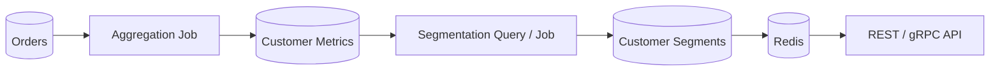

# 05- NTILE

## Overview

`NTILE()` is a SQL window function that divides an ordered set of rows into a specified number of approximately equal-sized buckets, called **tiles**.

The syntax is:

```sql
NTILE(number_of_buckets) OVER (
    [PARTITION BY partition_columns]
    ORDER BY ordering_columns
)
```

For example:

```sql
SELECT
    customer_id,
    total_revenue,
    NTILE(4) OVER (
        ORDER BY total_revenue DESC
    ) AS revenue_quartile
FROM customer_revenue;
```

This divides customers into four groups based on revenue:

```text
Tile 1 → highest-revenue customers
Tile 2 → next group
Tile 3 → next group
Tile 4 → lowest-revenue customers
```

`NTILE()` is useful when the requirement is to divide a population into **relative segments**, rather than assign an individual rank.

Typical backend and analytics use cases include:

- Customer segmentation.
- Revenue quartiles.
- Performance tiers.
- Percentile-style reporting.
- Cohort analysis.
- Risk segmentation.
- Workload distribution.
- Top/middle/bottom population classification.

## Why `NTILE()` Exists

Ranking functions answer questions such as:

> What is this customer's rank?

`NTILE()` answers a different question:

> Which segment of the ordered population does this customer belong to?

For example, instead of producing:

```text
Customer A → rank 1
Customer B → rank 2
Customer C → rank 3
...
Customer Z → rank 10000
```

you can divide the population into four groups:

```text
Customer A → tile 1
Customer B → tile 1
...
Customer X → tile 4
Customer Y → tile 4
```

This is useful when individual rank is less important than **relative population segmentation**.

## How `NTILE()` Works

Suppose there are 10 rows and:

```sql
NTILE(4)
```

is requested.

The database distributes the rows as evenly as possible:

```text
10 rows / 4 tiles

Tile 1 → 3 rows
Tile 2 → 3 rows
Tile 3 → 2 rows
Tile 4 → 2 rows
```

The remainder is distributed among the earlier tiles.

For 11 rows:

```text
Tile 1 → 3
Tile 2 → 3
Tile 3 → 3
Tile 4 → 2
```

For 12 rows:

```text
Tile 1 → 3
Tile 2 → 3
Tile 3 → 3
Tile 4 → 3
```

The exact row assignment is determined by the window `ORDER BY`.

## Basic Example

Consider:

```sql
CREATE TABLE employees (
    employee_id BIGINT PRIMARY KEY,
    salary NUMERIC(12, 2) NOT NULL
);
```

Divide employees into four salary groups:

```sql
SELECT
    employee_id,
    salary,
    NTILE(4) OVER (
        ORDER BY salary DESC
    ) AS salary_quartile
FROM employees;
```

A possible result:

| employee_id | salary | salary_quartile |
|---:|---:|---:|
| 101 | 180000 | 1 |
| 102 | 170000 | 1 |
| 103 | 160000 | 1 |
| 104 | 150000 | 2 |
| 105 | 140000 | 2 |
| 106 | 130000 | 2 |
| 107 | 120000 | 3 |
| 108 | 110000 | 3 |
| 109 | 100000 | 4 |
| 110 | 90000 | 4 |

The first tile contains the highest salaries because the ordering is descending.

With ascending order:

```sql
NTILE(4) OVER (
    ORDER BY salary ASC
)
```

the lowest salaries would be assigned to tile `1`.

## `NTILE()` With `PARTITION BY`

`PARTITION BY` creates independent tile calculations.

For example, divide employees into four salary segments within each department:

```sql
SELECT
    employee_id,
    department_id,
    salary,
    NTILE(4) OVER (
        PARTITION BY department_id
        ORDER BY salary DESC
    ) AS salary_quartile
FROM employees;
```

Each department is processed independently:

```text
Department A
    ├── Tile 1
    ├── Tile 2
    ├── Tile 3
    └── Tile 4

Department B
    ├── Tile 1
    ├── Tile 2
    ├── Tile 3
    └── Tile 4
```

The tile number restarts at `1` for each partition.

## Population Size Matters

`NTILE()` does not guarantee that every requested tile contains a row.

If there are fewer rows than buckets:

```sql
NTILE(5) OVER (
    ORDER BY salary DESC
)
```

over only three rows produces:

```text
row 1 → tile 1
row 2 → tile 2
row 3 → tile 3
```

Tiles `4` and `5` contain no rows.

Therefore, `NTILE(100)` does not magically create 100 populated segments.

## Uneven Distribution

When the number of rows is not evenly divisible by the number of tiles, earlier tiles receive the extra rows.

For 10 rows and four tiles:

| Tile | Rows |
|---:|---:|
| 1 | 3 |
| 2 | 3 |
| 3 | 2 |
| 4 | 2 |

This matters when building business reports because tile sizes are based on **row counts**, not equal ranges of the ordering value.

For example, salary distributions might be:

```text
Tile 1 → $180k–$140k
Tile 2 → $139k–$120k
Tile 3 → $119k–$100k
Tile 4 → $99k–$50k
```

The numeric ranges can be very different while the number of rows is approximately equal.

## `NTILE()` vs Ranking Functions

`NTILE()` belongs to the same family of window functions as `ROW_NUMBER()`, `RANK()`, and `DENSE_RANK()`, but its output represents a different concept.

| Function | Primary purpose | Ties | Output |
|---|---|---|---|
| `ROW_NUMBER()` | Unique row position | No shared position | 1, 2, 3, ... |
| `RANK()` | Competition ranking | Shared rank, gaps | 1, 1, 3, ... |
| `DENSE_RANK()` | Distinct-value ranking | Shared rank, no gaps | 1, 1, 2, ... |
| `NTILE(n)` | Population segmentation | Does not preserve tie groups | 1 through n |

Consider:

```text
Scores:
100
100
90
80
70
```

The functions answer different questions:

```text
ROW_NUMBER()
→ Which row is this?

RANK()
→ What is this row's competition rank?

DENSE_RANK()
→ What is this row's distinct-value rank?

NTILE(3)
→ Which third of the ordered population is this row in?
```

## Important Difference: `NTILE()` Does Not Preserve Ties

This is one of the most important `NTILE()` properties.

Suppose:

```text
Score
-----
100
100
100
90
80
70
```

and:

```sql
NTILE(3) OVER (
    ORDER BY score DESC
)
```

The database must distribute six rows into three tiles:

```text
Tile 1 → 2 rows
Tile 2 → 2 rows
Tile 3 → 2 rows
```

A result can therefore be:

| score | tile |
|---:|---:|
| 100 | 1 |
| 100 | 1 |
| 100 | 2 |
| 90 | 2 |
| 80 | 3 |
| 70 | 3 |

The three equal `100` values are split across tiles.

If your business rule says:

> Customers with the same revenue must always remain in the same segment.

then `NTILE()` is usually not the right primitive.

Consider `DENSE_RANK()`, percentile calculations, or an explicitly defined business threshold instead.

## Deterministic Ordering

The window `ORDER BY` defines how rows are assigned to tiles.

If the ordering column is not unique:

```sql
NTILE(4) OVER (
    ORDER BY score DESC
)
```

rows with equal scores may have no deterministic relative order.

If reproducible row assignment is required, add a stable tie-breaker:

```sql
NTILE(4) OVER (
    ORDER BY score DESC, customer_id
)
```

This makes the assignment deterministic.

However, this does **not** preserve ties. It only determines which tied row is processed first.

That distinction is important:

```text
ORDER BY score DESC
    → ranking/segmentation criterion

ORDER BY score DESC, customer_id
    → same criterion + deterministic tie ordering
```

## Quartiles

A common application is quartile segmentation:

```sql
SELECT
    customer_id,
    revenue,
    NTILE(4) OVER (
        ORDER BY revenue DESC
    ) AS revenue_quartile
FROM customer_revenue;
```

A common interpretation is:

| Quartile | Relative population |
|---:|---|
| 1 | Highest-revenue group |
| 2 | Upper-middle group |
| 3 | Lower-middle group |
| 4 | Lowest-revenue group |

The terminology should be documented carefully.

`NTILE(4)` creates four approximately equal **row-count buckets**. It is not necessarily equivalent to a statistically computed percentile boundary where repeated values and interpolation are handled differently.

## Deciles

For ten segments:

```sql
SELECT
    customer_id,
    revenue,
    NTILE(10) OVER (
        ORDER BY revenue DESC
    ) AS revenue_decile
FROM customer_revenue;
```

Typical interpretation:

```text
Decile 1 → top 10% of rows
Decile 2 → next 10%
...
Decile 10 → bottom 10%
```

For a population that is not divisible by ten, bucket sizes differ by at most one row.

This is useful for:

- Customer value segmentation.
- Performance analysis.
- Fraud/risk analysis.
- Product usage analysis.
- Marketing cohorts.

## Top and Bottom Segments

A simple segmentation query:

```sql
WITH segmented_customers AS (
    SELECT
        customer_id,
        revenue,
        NTILE(10) OVER (
            ORDER BY revenue DESC
        ) AS revenue_decile
    FROM customer_revenue
)
SELECT
    customer_id,
    revenue,
    revenue_decile
FROM segmented_customers
WHERE revenue_decile IN (1, 10);
```

This identifies customers in the top and bottom deciles.

For a production API, the semantic meaning of the decile should be explicit. A client should not have to infer whether `1` means "best" or "worst."

## Ranking Aggregated Metrics

`NTILE()` frequently operates on aggregated data.

For example, segment customers by total successful payment value:

```sql
WITH customer_revenue AS (
    SELECT
        customer_id,
        SUM(amount) AS total_revenue
    FROM payments
    WHERE status = 'succeeded'
    GROUP BY customer_id
)
SELECT
    customer_id,
    total_revenue,
    NTILE(4) OVER (
        ORDER BY total_revenue DESC
    ) AS revenue_quartile
FROM customer_revenue;
```

The data flow is:

```text
payments
    │
    ▼
Filter successful transactions
    │
    ▼
GROUP BY customer
    │
    ▼
SUM(amount)
    │
    ▼
Order customers by revenue
    │
    ▼
Divide into four tiles
```

This avoids transferring millions of transaction rows into Python just to calculate segmentation.

## Filtering Before Segmentation

The input population should be defined carefully.

Suppose the requirement is:

> Segment active customers.

Filter before applying `NTILE()`:

```sql
SELECT
    customer_id,
    revenue,
    NTILE(4) OVER (
        ORDER BY revenue DESC
    ) AS revenue_quartile
FROM customer_revenue
WHERE status = 'active';
```

Now only active customers participate in the four-way segmentation.

If instead the requirement is:

> Segment all customers, then show only active customers.

Use a separate query level:

```sql
WITH segmented AS (
    SELECT
        customer_id,
        status,
        revenue,
        NTILE(4) OVER (
            ORDER BY revenue DESC
        ) AS revenue_quartile
    FROM customer_revenue
)
SELECT
    customer_id,
    revenue,
    revenue_quartile
FROM segmented
WHERE status = 'active';
```

These queries produce different results because they define different populations.

## Filtering Ranked or Tiled Results

Window-function output is generally not available to the same query block's `WHERE` clause.

This pattern is invalid:

```sql
SELECT
    customer_id,
    revenue,
    NTILE(4) OVER (
        ORDER BY revenue DESC
    ) AS revenue_quartile
FROM customer_revenue
WHERE revenue_quartile = 1;
```

Use a CTE or derived table:

```sql
WITH segmented AS (
    SELECT
        customer_id,
        revenue,
        NTILE(4) OVER (
            ORDER BY revenue DESC
        ) AS revenue_quartile
    FROM customer_revenue
)
SELECT
    customer_id,
    revenue
FROM segmented
WHERE revenue_quartile = 1;
```

Some database engines support `QUALIFY`:

```sql
SELECT
    customer_id,
    revenue,
    NTILE(4) OVER (
        ORDER BY revenue DESC
    ) AS revenue_quartile
FROM customer_revenue
QUALIFY revenue_quartile = 1;
```

Portability depends on the database engine, so CTEs or subqueries are often preferable in shared SQL code.

## Multi-Tenant Segmentation

In a multi-tenant application, segmentation may need to happen independently per tenant:

```sql
SELECT
    customer_id,
    tenant_id,
    revenue,
    NTILE(4) OVER (
        PARTITION BY tenant_id
        ORDER BY revenue DESC, customer_id
    ) AS revenue_quartile
FROM customer_revenue;
```

This creates independent populations:

```text
Tenant A
    ├── Quartile 1
    ├── Quartile 2
    ├── Quartile 3
    └── Quartile 4

Tenant B
    ├── Quartile 1
    ├── Quartile 2
    ├── Quartile 3
    └── Quartile 4
```

The `PARTITION BY` controls segmentation scope.

It does not provide tenant authorization.

Access control must still be enforced separately.

## Practical Backend Example

Suppose an e-commerce service wants to classify customers into four revenue segments for a dashboard.

```sql
WITH customer_revenue AS (
    SELECT
        customer_id,
        SUM(total_amount) AS revenue
    FROM orders
    WHERE tenant_id = :tenant_id
      AND status = 'completed'
      AND created_at >= :start_date
      AND created_at < :end_date
    GROUP BY customer_id
),
segmented AS (
    SELECT
        customer_id,
        revenue,
        NTILE(4) OVER (
            ORDER BY revenue DESC, customer_id
        ) AS revenue_quartile
    FROM customer_revenue
)
SELECT
    customer_id,
    revenue,
    revenue_quartile
FROM segmented
ORDER BY
    revenue_quartile,
    revenue DESC,
    customer_id;
```

The query:

1. Restricts the population to the requested tenant.
2. Restricts data to the reporting period.
3. Aggregates completed orders per customer.
4. Orders customers by revenue.
5. Uses `customer_id` as a deterministic tie-breaker.
6. Divides customers into four approximately equal groups.

The API can then expose a stable semantic field such as:

```json
{
  "customer_id": 42,
  "revenue": 185000,
  "revenue_quartile": 1
}
```

## `NTILE()` vs Percentile Functions

`NTILE()` and percentile functions are related but not interchangeable.

| Requirement | Better approach |
|---|---|
| Divide rows into N approximately equal groups | `NTILE(N)` |
| Find the exact percentile position/value | Percentile functions |
| Find statistical median | `PERCENTILE_CONT()` / database equivalent |
| Rank individual rows | `ROW_NUMBER()`, `RANK()`, `DENSE_RANK()` |
| Create business thresholds | Explicit `CASE` rules |
| Keep tied values together | Ranking or value-based thresholds |

For example:

```sql
NTILE(4) OVER (
    ORDER BY revenue
)
```

answers:

> Which quarter of the ordered rows contains this customer?

A percentile function may instead answer:

> What is the revenue value at the 75th percentile?

These are different analytical questions.

## `NTILE()` vs `CASE`

For fixed business thresholds, `CASE` is often clearer.

For example:

```sql
CASE
    WHEN revenue >= 100000 THEN 'enterprise'
    WHEN revenue >= 50000 THEN 'growth'
    WHEN revenue >= 10000 THEN 'standard'
    ELSE 'starter'
END AS customer_segment
```

This creates **absolute business segments**.

`NTILE()` creates **relative population segments**.

| Requirement | Use |
|---|---|
| Top 25% of customers | `NTILE(4)` |
| Revenue >= $100k | `CASE` |
| Bottom 10% | `NTILE(10)` |
| Customers with score >= 80 | `CASE` |
| Equal-sized relative groups | `NTILE()` |

A key production decision is whether segmentation should change as the population distribution changes.

## Performance Considerations

`NTILE()` requires the database to establish the ordering for each window partition.

Potential costs include:

- Sorting.
- CPU consumption.
- Memory usage.
- Temporary disk usage.
- Processing large partitions.

Inspect PostgreSQL execution plans with:

```sql
EXPLAIN (ANALYZE, BUFFERS)
WITH customer_revenue AS (
    SELECT
        customer_id,
        SUM(amount) AS revenue
    FROM payments
    WHERE tenant_id = 42
      AND status = 'succeeded'
    GROUP BY customer_id
)
SELECT
    customer_id,
    revenue,
    NTILE(4) OVER (
        ORDER BY revenue DESC
    ) AS revenue_quartile
FROM customer_revenue;
```

The expensive part may not be `NTILE()` itself. It may be:

```text
Large transactional scan
        ↓
Aggregation
        ↓
Large intermediate result
        ↓
Window ordering
```

Optimize the entire pipeline rather than focusing only on the window function.

## Reducing the Input Set

Apply selective filters before aggregation and segmentation whenever the business requirement permits:

```sql
WITH customer_revenue AS (
    SELECT
        customer_id,
        SUM(amount) AS revenue
    FROM payments
    WHERE tenant_id = :tenant_id
      AND status = 'succeeded'
      AND paid_at >= :start_date
      AND paid_at < :end_date
    GROUP BY customer_id
)
SELECT
    customer_id,
    revenue,
    NTILE(4) OVER (
        ORDER BY revenue DESC
    ) AS revenue_quartile
FROM customer_revenue;
```

Reducing the number of rows entering the aggregation and window stages can materially improve performance.

## Indexing Considerations

An index does not automatically eliminate the cost of the window operation because the ordering may be performed on a derived aggregate.

For transactional filtering, an index such as:

```sql
CREATE INDEX CONCURRENTLY idx_payments_tenant_status_paid_at
ON payments (
    tenant_id,
    status,
    paid_at
);
```

may help reduce the cost of locating relevant rows.

The appropriate index depends on:

- Filter selectivity.
- Query frequency.
- Data distribution.
- Group cardinality.
- Write volume.
- Reporting period.
- Existing indexes.

Always validate with representative production-scale data and execution plans.

## Large-Scale Segmentation

For very large customer populations, calculating segmentation on every API request can become unnecessarily expensive.

A common architecture is:



Precompute segments when:

- The same segmentation is requested frequently.
- Source data changes less frequently than reads.
- Slightly stale segmentation is acceptable.
- The population is too large for repeated request-time computation.

Potential implementations include:

- Materialized views.
- Summary tables.
- Scheduled Celery jobs.
- Event-driven aggregation.
- Batch processing.
- Redis caching for frequently requested segment data.

The correct architecture depends on freshness requirements.

## Data Freshness

`NTILE()` segmentation is inherently relative to the input population.

If customer revenue changes, or customers are added or removed, tile membership can change even if an existing customer's own revenue does not.

For example:

```text
Monday:
Customer A → tile 1

Tuesday:
1000 new high-value customers enter

Customer A → tile 2
```

This can be surprising if users interpret a tile as a permanent customer classification.

For persistent business categories, prefer explicit thresholds or store a versioned segmentation result with a defined calculation timestamp.

## Stability and Reproducibility

If a query is used to generate a persisted segmentation, deterministic ordering becomes important.

Prefer:

```sql
NTILE(4) OVER (
    ORDER BY revenue DESC, customer_id
)
```

over:

```sql
NTILE(4) OVER (
    ORDER BY revenue DESC
)
```

when equal revenue values can cross tile boundaries.

This does not make equal values belong to the same tile. It only makes the choice of which tied rows cross the boundary reproducible.

For audit-sensitive systems, persist:

- Segmentation timestamp.
- Reporting period.
- Query/version identifier where appropriate.
- Input population definition.
- Segment count.
- Relevant metric version.

## Security Considerations

`NTILE()` does not enforce access control.

For tenant-scoped applications, use trusted tenant context:

```sql
SELECT
    customer_id,
    revenue,
    NTILE(4) OVER (
        ORDER BY revenue DESC, customer_id
    ) AS revenue_quartile
FROM customer_revenue
WHERE tenant_id = :tenant_id;
```

Use parameterized queries from application code:

```python
cursor.execute(
    """
    SELECT
        customer_id,
        revenue,
        NTILE(4) OVER (
            ORDER BY revenue DESC, customer_id
        ) AS revenue_quartile
    FROM customer_revenue
    WHERE tenant_id = %s
    """,
    [tenant_id],
)
```

Do not construct tenant IDs, dates, or other request-controlled values by concatenating strings into SQL.

For PostgreSQL systems requiring database-level tenant isolation, row-level security can provide an additional enforcement layer.

## Common Mistakes

| Mistake | Problem | Better approach |
|---|---|---|
| Assuming `NTILE(4)` creates equal-value ranges | It creates approximately equal row-count groups | Use percentile/value-based logic when value ranges matter |
| Assuming ties remain together | Equal values can be split across tiles | Use `DENSE_RANK()` or explicit thresholds when required |
| Using `NTILE()` for exact top-N rows | Tile boundaries represent populations, not exact N rows | Use `ROW_NUMBER()` |
| Omitting deterministic tie-breaking | Equal rows may be assigned inconsistently | Add a stable secondary key when reproducibility matters |
| Filtering after segmentation unintentionally | Changes which population was segmented | Place filters at the correct query level |
| Assuming tile 1 always means "best" | Meaning depends on `ORDER BY` direction | Document ordering semantics |
| Using `NTILE()` for permanent business tiers | Segment membership changes with population distribution | Use explicit business thresholds |
| Ranking raw transactions | Produces the wrong population and unnecessary work | Aggregate to the business entity first |
| Calculating large segments on every API request | Can create expensive repeated sorts | Precompute or cache when appropriate |
| Treating `NTILE()` as authorization | Window functions provide no access control | Enforce tenant and authorization boundaries separately |

## Interview Traps

### Does `NTILE(4)` Mean Exact Quartiles?

Not necessarily in the statistical sense.

It divides the ordered rows into four approximately equal-sized groups.

It does not necessarily calculate four equal-width value ranges or statistical percentile boundaries.

### What Happens When Rows Are Not Evenly Divisible?

Extra rows are assigned to the earlier tiles.

For 10 rows and four tiles:

```text
3, 3, 2, 2
```

For 11 rows:

```text
3, 3, 3, 2
```

### Does `NTILE()` Respect Ties?

No.

If the tile boundary occurs in the middle of a group of tied values, equal values can be split across tiles.

This is a major distinction from `RANK()` and `DENSE_RANK()`.

### Does `NTILE(4)` Return Four Rows?

No.

It returns one tile number for every input row.

Four means **four groups**, not four rows.

### Which Function Should Be Used for Top 10%?

For row-based segmentation:

```sql
NTILE(10) OVER (
    ORDER BY metric DESC
)
```

with:

```sql
WHERE tile = 1
```

can identify approximately the top 10% of rows.

If the requirement is based on an exact percentile definition or value boundary, use the database's percentile functionality instead.

## Practical Comparison

| Question | Recommended technique |
|---|---|
| Who is #1? | `ROW_NUMBER()`, `RANK()`, or `DENSE_RANK()` |
| What are the top three distinct scores? | `DENSE_RANK()` |
| Which quartile contains this row? | `NTILE(4)` |
| Which decile contains this customer? | `NTILE(10)` |
| What revenue is at the 75th percentile? | Percentile function |
| Are customers above $100k enterprise customers? | `CASE` |
| Must tied customers remain in the same segment? | Value-based threshold or ranking strategy |
| Need approximately equal row counts per segment? | `NTILE()` |

## Key Takeaways

- **`NTILE(n)` divides an ordered population into `n` approximately equal-sized row groups; it is a segmentation function rather than a traditional ranking function.**
- **The window `ORDER BY` determines which rows enter earlier tiles, while `PARTITION BY` creates independent segmentation populations.**
- **`NTILE()` does not preserve ties, so equal values can be split across tile boundaries; use ranking or explicit thresholds when ties must remain together.**
- **`NTILE()` creates relative segments, so membership can change as the population changes; use explicit business thresholds for stable classifications.**
- **For production workloads, define the population precisely, make tie ordering deterministic when required, reduce the input set, inspect execution plans, and precompute large or frequently requested segmentations when appropriate.**