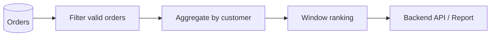

# 06- ROW_NUMBER vs RANK vs DENSE_RANK

## Overview

`ROW_NUMBER()`, `RANK()`, and `DENSE_RANK()` are SQL window functions used to assign positional information to rows within an ordered result set.

They look similar syntactically but encode different business semantics:

```sql
ROW_NUMBER() OVER (...)
RANK()       OVER (...)
DENSE_RANK() OVER (...)
```

The critical difference is how they handle **ties**.

Given:

| employee | salary |
|---|---:|
| Alice | 100000 |
| Bob | 100000 |
| Carol | 90000 |
| David | 80000 |

the functions produce:

| employee | salary | `ROW_NUMBER()` | `RANK()` | `DENSE_RANK()` |
|---|---:|---:|---:|---:|
| Alice | 100000 | 1 | 1 | 1 |
| Bob | 100000 | 2 | 1 | 1 |
| Carol | 90000 | 3 | 3 | 2 |
| David | 80000 | 4 | 4 | 3 |

The choice should be driven by the question being answered:

- **`ROW_NUMBER()`** — assign every row a unique position.
- **`RANK()`** — assign equal values the same rank and leave gaps after ties.
- **`DENSE_RANK()`** — assign equal values the same rank without gaps.

## Why These Functions Matter

Traditional `ORDER BY` sorts rows but does not expose their position as a column.

For example:

```sql
SELECT
    employee_id,
    salary
FROM employees
ORDER BY salary DESC;
```

returns rows in order, but does not tell the application:

> This is employee #3.

Window ranking functions add that positional information while preserving the original rows.

This makes them useful for:

- Top-N queries.
- Leaderboards.
- Latest-row selection.
- Deduplication.
- Pagination strategies.
- Per-group rankings.
- Compensation analysis.
- Product rankings.
- Customer segmentation.
- "Second highest" style interview problems.

## Common Syntax

All three functions use the same general structure:

```sql
FUNCTION_NAME() OVER (
    [PARTITION BY partition_columns]
    ORDER BY ordering_columns
)
```

Example:

```sql
SELECT
    employee_id,
    department_id,
    salary,
    ROW_NUMBER() OVER (
        PARTITION BY department_id
        ORDER BY salary DESC
    ) AS row_number
FROM employees;
```

`PARTITION BY` is optional.

Without it, the entire result set is one ranking population.

With it, ranking restarts independently for every partition.

## The Core Difference

The easiest way to remember the functions is to examine ties.

Suppose the ordered values are:

```text
100
100
90
80
80
70
```

The output is:

| value | `ROW_NUMBER()` | `RANK()` | `DENSE_RANK()` |
|---:|---:|---:|---:|
| 100 | 1 | 1 | 1 |
| 100 | 2 | 1 | 1 |
| 90 | 3 | 3 | 2 |
| 80 | 4 | 4 | 3 |
| 80 | 5 | 4 | 3 |
| 70 | 6 | 6 | 4 |

### `ROW_NUMBER()`

Every row receives a unique number:

```text
1
2
3
4
5
6
```

Ties do not share a number.

### `RANK()`

Equal values share the same rank, and the next rank skips positions occupied by the tie:

```text
1
1
3
4
4
6
```

This is equivalent to competition ranking.

### `DENSE_RANK()`

Equal values share the same rank, but ranking remains consecutive:

```text
1
1
2
3
3
4
```

## `ROW_NUMBER()`

`ROW_NUMBER()` assigns a unique sequential number to every row within the window ordering.

```sql
SELECT
    employee_id,
    salary,
    ROW_NUMBER() OVER (
        ORDER BY salary DESC
    ) AS position
FROM employees;
```

Possible result:

| employee_id | salary | position |
|---:|---:|---:|
| 101 | 150000 | 1 |
| 102 | 150000 | 2 |
| 103 | 140000 | 3 |
| 104 | 120000 | 4 |

The two employees earning `$150,000` receive different positions.

### When to Use `ROW_NUMBER()`

Use it when the requirement is fundamentally **row-oriented**:

- Select exactly one row from each group.
- Identify the latest record.
- Deduplicate records.
- Assign unique positions.
- Implement deterministic top-N selection.
- Select the first matching record.

For example, latest order per customer:

```sql
WITH ranked_orders AS (
    SELECT
        order_id,
        customer_id,
        created_at,
        ROW_NUMBER() OVER (
            PARTITION BY customer_id
            ORDER BY created_at DESC, order_id DESC
        ) AS row_number
    FROM orders
)
SELECT
    order_id,
    customer_id,
    created_at
FROM ranked_orders
WHERE row_number = 1;
```

This returns exactly one order per customer.

## `RANK()`

`RANK()` assigns the same rank to tied values.

```sql
SELECT
    employee_id,
    salary,
    RANK() OVER (
        ORDER BY salary DESC
    ) AS salary_rank
FROM employees;
```

Example:

| employee_id | salary | salary_rank |
|---:|---:|---:|
| 101 | 150000 | 1 |
| 102 | 150000 | 1 |
| 103 | 140000 | 3 |
| 104 | 120000 | 4 |

The next employee after the two first-place employees receives rank `3`.

### Why the Gap Exists

`RANK()` represents the row's position in the sorted population.

If two rows occupy first place:

```text
1st
1st
3rd
```

There is no second-place row.

This is useful when the ranking represents a competition or leaderboard.

### When to Use `RANK()`

Use it when tied entities should share a position and gaps have semantic meaning.

Examples:

- Sports leaderboards.
- Competition rankings.
- Employee performance rankings.
- Product rankings.
- Scores where tied values should share a place.

## `DENSE_RANK()`

`DENSE_RANK()` also gives tied values the same rank, but does not leave gaps.

```sql
SELECT
    employee_id,
    salary,
    DENSE_RANK() OVER (
        ORDER BY salary DESC
    ) AS salary_rank
FROM employees;
```

Result:

| employee_id | salary | salary_rank |
|---:|---:|---:|
| 101 | 150000 | 1 |
| 102 | 150000 | 1 |
| 103 | 140000 | 2 |
| 104 | 120000 | 3 |

### When to Use `DENSE_RANK()`

Use it when ranking **distinct values** matters more than physical row position.

Common examples:

- Second-highest salary.
- Third-highest distinct score.
- Top three distinct prices.
- Ranking categories by metric.
- Finding the Nth distinct value.

For example:

```sql
WITH ranked_salaries AS (
    SELECT
        employee_id,
        salary,
        DENSE_RANK() OVER (
            ORDER BY salary DESC
        ) AS salary_rank
    FROM employees
)
SELECT
    employee_id,
    salary
FROM ranked_salaries
WHERE salary_rank = 2;
```

This returns all employees tied at the second-highest salary.

## Comparison Table

| Property | `ROW_NUMBER()` | `RANK()` | `DENSE_RANK()` |
|---|---|---|---|
| Unique number per row | Yes | No | No |
| Ties share rank | No | Yes | Yes |
| Gaps after ties | N/A | Yes | No |
| Represents physical row position | Yes | Approximately | No |
| Represents distinct-value rank | No | No | Yes |
| Good for latest row per group | Yes | Usually no | Usually no |
| Good for competition ranking | No | Yes | Sometimes |
| Good for Nth distinct value | No | No | Yes |
| Suitable for exact one-row selection | Yes | No | No |

## A Practical Mental Model

Think about what the number represents.

### `ROW_NUMBER()`

> Which row is this?

```text
1, 2, 3, 4, 5
```

### `RANK()`

> What position would this row occupy in a competition?

```text
1, 1, 3, 4, 4, 6
```

### `DENSE_RANK()`

> Which distinct value level is this?

```text
1, 1, 2, 3, 3, 4
```

This mental model is more useful than memorizing the syntax.

## `PARTITION BY`

All three functions can rank independently within groups.

Consider employees across departments:

```sql
SELECT
    employee_id,
    department_id,
    salary,
    ROW_NUMBER() OVER (
        PARTITION BY department_id
        ORDER BY salary DESC
    ) AS row_number,
    RANK() OVER (
        PARTITION BY department_id
        ORDER BY salary DESC
    ) AS rank,
    DENSE_RANK() OVER (
        PARTITION BY department_id
        ORDER BY salary DESC
    ) AS dense_rank
FROM employees;
```

The calculation effectively becomes:

```text
Engineering
    ├── rank employees
    └── restart numbering

Sales
    ├── rank employees
    └── restart numbering

Support
    ├── rank employees
    └── restart numbering
```

For example:

| department | employee | salary | row_number | rank | dense_rank |
|---|---|---:|---:|---:|---:|
| Engineering | A | 160000 | 1 | 1 | 1 |
| Engineering | B | 150000 | 2 | 2 | 2 |
| Engineering | C | 150000 | 3 | 2 | 2 |
| Sales | D | 120000 | 1 | 1 | 1 |
| Sales | E | 120000 | 2 | 1 | 1 |
| Sales | F | 100000 | 3 | 3 | 2 |

`PARTITION BY` changes the population; it does not physically group the output.

## Ordering Determines the Ranking

The ranking is based on the window's `ORDER BY`, not necessarily the query's final `ORDER BY`.

```sql
SELECT
    employee_id,
    salary,
    RANK() OVER (
        ORDER BY salary DESC
    ) AS salary_rank
FROM employees
ORDER BY employee_id;
```

The result may be displayed by employee ID while the rank is calculated by salary.

This distinction is important:

```sql
RANK() OVER (
    ORDER BY salary DESC
)
```

controls ranking.

```sql
ORDER BY employee_id
```

controls final result presentation.

They are independent operations.

## Deterministic `ROW_NUMBER()`

A common production mistake is:

```sql
ROW_NUMBER() OVER (
    ORDER BY created_at DESC
)
```

when multiple rows can have exactly the same timestamp.

The database can choose any ordering among those ties.

If the application needs deterministic selection, add a stable unique tie-breaker:

```sql
ROW_NUMBER() OVER (
    ORDER BY created_at DESC, order_id DESC
)
```

This is especially important for:

- Latest-record selection.
- Deduplication.
- Pagination.
- Batch processing.
- Reconciliation jobs.

The unique secondary key does not mean the timestamps are unique. It makes the complete ordering deterministic.

## Determinism and `RANK()` / `DENSE_RANK()`

For `RANK()` and `DENSE_RANK()`, adding a unique tie-breaker changes the semantics.

Compare:

```sql
RANK() OVER (
    ORDER BY salary DESC
)
```

with:

```sql
RANK() OVER (
    ORDER BY salary DESC, employee_id
)
```

The first treats employees with equal salaries as tied.

The second does not, because the complete ordering becomes unique.

For example:

```text
ORDER BY salary DESC

150000 → rank 1
150000 → rank 1
140000 → rank 3
```

But:

```text
ORDER BY salary DESC, employee_id

150000 → rank 1
150000 → rank 2
140000 → rank 3
```

Therefore:

> Adding a tie-breaker is appropriate for `ROW_NUMBER()` when deterministic row selection is needed, but it can destroy intentional ties for `RANK()` and `DENSE_RANK()`.

## Top-N Rows vs Top-N Ranks

This distinction appears frequently in production queries and interviews.

### Exactly N rows

Use `ROW_NUMBER()`:

```sql
WITH ranked AS (
    SELECT
        employee_id,
        salary,
        ROW_NUMBER() OVER (
            ORDER BY salary DESC, employee_id
        ) AS row_number
    FROM employees
)
SELECT
    employee_id,
    salary
FROM ranked
WHERE row_number <= 3;
```

This returns exactly three rows, assuming at least three input rows.

### Top N distinct salary levels

Use `DENSE_RANK()`:

```sql
WITH ranked AS (
    SELECT
        employee_id,
        salary,
        DENSE_RANK() OVER (
            ORDER BY salary DESC
        ) AS salary_rank
    FROM employees
)
SELECT
    employee_id,
    salary
FROM ranked
WHERE salary_rank <= 3;
```

This returns every employee whose salary belongs to one of the top three distinct salary levels.

The result can contain more than three rows.

## `RANK()` vs `DENSE_RANK()` for Top-N

Suppose salaries are:

```text
150000
150000
140000
130000
130000
120000
```

Using:

```sql
RANK() OVER (
    ORDER BY salary DESC
)
```

produces:

```text
1
1
3
4
4
6
```

Using:

```sql
DENSE_RANK() OVER (
    ORDER BY salary DESC
)
```

produces:

```text
1
1
2
3
3
4
```

Therefore:

```sql
WHERE rank <= 3
```

returns:

```text
150000
150000
140000
```

while:

```sql
WHERE dense_rank <= 3
```

returns:

```text
150000
150000
140000
130000
130000
```

Neither is universally correct. The requirement determines the function.

## Latest Row Per Group

One of the most important production patterns is selecting the latest record per entity.

Suppose an order has multiple status events:

```text
order_id | status    | created_at
---------|-----------|-------------------
101      | pending   | 10:00
101      | paid      | 10:02
101      | shipped   | 10:05
```

Use `ROW_NUMBER()`:

```sql
WITH ranked_statuses AS (
    SELECT
        order_id,
        status,
        created_at,
        ROW_NUMBER() OVER (
            PARTITION BY order_id
            ORDER BY created_at DESC, status_event_id DESC
        ) AS row_number
    FROM order_status_events
)
SELECT
    order_id,
    status,
    created_at
FROM ranked_statuses
WHERE row_number = 1;
```

This guarantees one selected row per order when the ordering is deterministic.

Using `RANK()` here can return multiple rows if timestamps tie, which may violate the application's requirement of exactly one current state.

## Deduplication

Window functions are frequently used to identify duplicate records.

For example:

```sql
WITH duplicates AS (
    SELECT
        id,
        email,
        created_at,
        ROW_NUMBER() OVER (
            PARTITION BY email
            ORDER BY created_at DESC, id DESC
        ) AS row_number
    FROM users
)
SELECT
    id,
    email,
    created_at
FROM duplicates
WHERE row_number > 1;
```

This identifies older duplicate rows while keeping the newest record.

Before deleting anything based on such a query, validate:

- Whether duplicates are actually invalid.
- Whether case sensitivity matters.
- Whether soft-deleted rows participate.
- Whether tenant boundaries are required.
- Whether application-level uniqueness rules differ from the query.

For destructive operations, first materialize and inspect the candidate set.

## Leaderboards

`RANK()` is usually appropriate for competition-style leaderboards:

```sql
SELECT
    user_id,
    score,
    RANK() OVER (
        ORDER BY score DESC
    ) AS leaderboard_rank
FROM user_scores;
```

If two users have the same score:

```text
User A → 1
User B → 1
User C → 3
```

This matches common competition ranking semantics.

If the application instead wants consecutive score levels:

```text
User A → 1
User B → 1
User C → 2
```

use `DENSE_RANK()`.

## Nth Highest Value

The classic interview problem:

> Find the second-highest salary.

If duplicate salaries should count as one salary level:

```sql
WITH ranked AS (
    SELECT
        employee_id,
        salary,
        DENSE_RANK() OVER (
            ORDER BY salary DESC
        ) AS salary_rank
    FROM employees
)
SELECT
    employee_id,
    salary
FROM ranked
WHERE salary_rank = 2;
```

This returns all employees at the second-highest distinct salary.

Using `ROW_NUMBER()` would answer a different question because duplicate salary rows occupy different positions.

## Query Evaluation and Filtering

Window functions are evaluated after operations such as `WHERE` and `GROUP BY` in the logical query-processing model.

Therefore, this pattern does not work:

```sql
SELECT
    employee_id,
    salary,
    RANK() OVER (
        ORDER BY salary DESC
    ) AS salary_rank
FROM employees
WHERE salary_rank <= 3;
```

The alias is not available to the same query block's `WHERE`.

Use a CTE:

```sql
WITH ranked AS (
    SELECT
        employee_id,
        salary,
        RANK() OVER (
            ORDER BY salary DESC
        ) AS salary_rank
    FROM employees
)
SELECT
    employee_id,
    salary,
    salary_rank
FROM ranked
WHERE salary_rank <= 3;
```

Some database engines support `QUALIFY`:

```sql
SELECT
    employee_id,
    salary,
    RANK() OVER (
        ORDER BY salary DESC
    ) AS salary_rank
FROM employees
QUALIFY salary_rank <= 3;
```

Use the syntax supported by your database engine.

## Aggregation Before Ranking

Ranking is often performed on an aggregated metric rather than raw rows.

For example, rank customers by total completed-order revenue:

```sql
WITH customer_revenue AS (
    SELECT
        customer_id,
        SUM(total_amount) AS revenue
    FROM orders
    WHERE status = 'completed'
    GROUP BY customer_id
)
SELECT
    customer_id,
    revenue,
    RANK() OVER (
        ORDER BY revenue DESC
    ) AS revenue_rank
FROM customer_revenue;
```

The data flow is:



The window function sees the rows produced by the aggregation.

This is an important design pattern:

```text
Raw events
    ↓
Filter
    ↓
GROUP BY
    ↓
Business metric
    ↓
Window ranking
```

## Ranking Aggregated Results Per Group

Suppose a marketplace wants to rank products by sales within each category:

```sql
WITH product_sales AS (
    SELECT
        category_id,
        product_id,
        SUM(quantity) AS units_sold
    FROM order_items
    GROUP BY
        category_id,
        product_id
)
SELECT
    category_id,
    product_id,
    units_sold,
    RANK() OVER (
        PARTITION BY category_id
        ORDER BY units_sold DESC
    ) AS category_rank
FROM product_sales;
```

This produces a separate leaderboard for every category.

This pattern is common in:

- E-commerce.
- SaaS analytics.
- Financial reporting.
- Gaming.
- Recommendation systems.

## Performance Considerations

All three functions require ordering within their window partitions.

For large datasets, the database may need to:

- Scan source rows.
- Aggregate intermediate results.
- Sort rows.
- Materialize intermediate data.
- Execute the window operation.

The performance cost depends heavily on:

- Number of rows.
- Number and size of partitions.
- Cardinality of grouping.
- Selectivity of filters.
- Available indexes.
- Database engine.
- Memory configuration.
- Query shape.

Inspect PostgreSQL plans with:

```sql
EXPLAIN (ANALYZE, BUFFERS)
SELECT
    employee_id,
    department_id,
    salary,
    RANK() OVER (
        PARTITION BY department_id
        ORDER BY salary DESC
    ) AS salary_rank
FROM employees;
```

Do not assume that adding an index on the ordering column will eliminate all sorting. Window operations often operate on filtered, joined, or aggregated intermediate results rather than directly on a base table.

## Reducing Window Input

Filter and aggregate as early as the business semantics allow.

Prefer:

```sql
WITH customer_revenue AS (
    SELECT
        customer_id,
        SUM(amount) AS revenue
    FROM payments
    WHERE tenant_id = :tenant_id
      AND status = 'succeeded'
      AND paid_at >= :start_date
      AND paid_at < :end_date
    GROUP BY customer_id
)
SELECT
    customer_id,
    revenue,
    RANK() OVER (
        ORDER BY revenue DESC
    ) AS revenue_rank
FROM customer_revenue;
```

over ranking millions of raw payment records and attempting to aggregate afterward.

The goal is to make the window operate on the smallest correct population.

## Pagination Considerations

`ROW_NUMBER()` can be used to create numbered result sets, but it is not automatically the best pagination strategy.

For example:

```sql
WITH numbered AS (
    SELECT
        employee_id,
        ROW_NUMBER() OVER (
            ORDER BY employee_id
        ) AS row_number
    FROM employees
)
SELECT
    employee_id
FROM numbered
WHERE row_number BETWEEN 10001 AND 10100;
```

For deep pagination over a large table, this can require processing many preceding rows.

For high-throughput APIs, **keyset pagination** is often preferable:

```sql
SELECT
    employee_id,
    name
FROM employees
WHERE employee_id > :last_employee_id
ORDER BY employee_id
LIMIT 100;
```

Window ranking is primarily an analytical/querying tool; do not use it merely because an API needs page numbers.

## Production Considerations

### Define Tie Semantics Explicitly

Before choosing a function, clarify:

- Should ties share a position?
- Should ranking gaps exist?
- Must exactly one row be selected?
- Are distinct values more important than rows?
- Can multiple results be returned at a boundary?

This usually determines the correct function immediately.

### Make Selection Deterministic

For `ROW_NUMBER()`, use a complete deterministic ordering when the selected row matters:

```sql
ORDER BY created_at DESC, id DESC
```

For `RANK()` and `DENSE_RANK()`, do not add a unique tie-breaker if preserving ties is part of the business rule.

### Keep Population Boundaries Correct

For multi-tenant systems:

```sql
WHERE tenant_id = :tenant_id
```

must be applied at the correct stage.

If tenant data leaks into the ranking population, the ranking itself may be mathematically correct but operationally wrong.

### Avoid Request-Time Heavy Analytics

If a dashboard repeatedly ranks millions of records, consider:

- Materialized views.
- Summary tables.
- Scheduled aggregation.
- Incremental pipelines.
- Celery jobs.
- Precomputed metrics.
- Caching appropriate results in Redis.

The database should remain the source of truth, but expensive analytical workloads do not always belong directly on synchronous API request paths.

## Security Considerations

Ranking functions do not provide authorization.

A query such as:

```sql
RANK() OVER (
    ORDER BY revenue DESC
)
```

does not determine which rows the current user is allowed to see.

For a tenant-aware API, constrain the population explicitly:

```sql
SELECT
    customer_id,
    revenue,
    RANK() OVER (
        ORDER BY revenue DESC
    ) AS revenue_rank
FROM customer_revenue
WHERE tenant_id = :tenant_id;
```

Use parameterized queries rather than string interpolation:

```python
cursor.execute(
    """
    SELECT
        customer_id,
        revenue,
        RANK() OVER (
            ORDER BY revenue DESC
        ) AS revenue_rank
    FROM customer_revenue
    WHERE tenant_id = %s
    """,
    [tenant_id],
)
```

Authorization should be enforced independently through the application's security model and, where appropriate, database-level controls such as PostgreSQL row-level security.

## Common Mistakes

| Mistake | Why it happens | Correct approach |
|---|---|---|
| Using `RANK()` to select exactly one latest row | Ties can return multiple rows | Use deterministic `ROW_NUMBER()` |
| Using `ROW_NUMBER()` for a leaderboard | Equal scores receive different positions | Use `RANK()` or `DENSE_RANK()` |
| Confusing `RANK()` with `DENSE_RANK()` | Both preserve ties | Check whether gaps should exist |
| Adding a unique tie-breaker to `RANK()` | The tie is intentionally or unintentionally destroyed | Only add ordering columns that match the ranking semantics |
| Assuming `ORDER BY` in the window controls final output | Window ordering and result ordering are separate | Add a final `ORDER BY` |
| Filtering directly on a window alias in `WHERE` | Window output is not available at that stage | Use a CTE, subquery, or supported `QUALIFY` |
| Ranking raw transactions instead of business entities | Wrong population and unnecessary work | Aggregate to the business entity first |
| Assuming indexes eliminate window sorting | Window input may be derived or partitioned | Inspect the execution plan |
| Using `ROW_NUMBER()` for deep API pagination | Large preceding ranges may still be processed | Prefer keyset pagination where appropriate |
| Ignoring ties in requirements | Different functions produce materially different results | Define tie behavior before implementation |

## Interview Decision Matrix

| Requirement | Function |
|---|---|
| Give every row a unique sequential position | `ROW_NUMBER()` |
| Select exactly one latest record per customer | `ROW_NUMBER()` |
| Deduplicate while keeping one record | `ROW_NUMBER()` |
| Competition-style leaderboard | `RANK()` |
| Same score should share rank | `RANK()` or `DENSE_RANK()` |
| Ranking gaps should exist after ties | `RANK()` |
| Ranking gaps should not exist | `DENSE_RANK()` |
| Find the second-highest distinct salary | `DENSE_RANK()` |
| Find all rows at the second-highest distinct value | `DENSE_RANK()` |
| Select exactly top three rows | `ROW_NUMBER()` |
| Select all rows belonging to the top three distinct levels | `DENSE_RANK()` |
| Rank entities independently within groups | Any of the three + `PARTITION BY` |

## Interview Traps

### What Is the Difference Between `RANK()` and `DENSE_RANK()`?

Both assign the same rank to tied values.

The difference is what happens afterward:

```text
Values:
100, 100, 90, 80
```

`RANK()`:

```text
1, 1, 3, 4
```

`DENSE_RANK()`:

```text
1, 1, 2, 3
```

### Which Function Should Select the Latest Row Per Group?

Usually:

```sql
ROW_NUMBER()
```

because the requirement is generally:

> Return exactly one row.

Use a deterministic ordering:

```sql
ROW_NUMBER() OVER (
    PARTITION BY customer_id
    ORDER BY created_at DESC, id DESC
)
```

### Which Function Finds the Second-Highest Salary?

If "second-highest" means the second distinct salary level:

```sql
DENSE_RANK()
```

For example:

```text
100k
100k
90k
80k
```

`90k` is the second-highest distinct salary.

### Can `RANK()` Return More Than N Rows for Top-N?

Yes.

If multiple rows share the boundary rank, all tied rows qualify.

For:

```sql
RANK() OVER (
    ORDER BY score DESC
)
```

filtering:

```sql
WHERE rank <= 3
```

can return more than three rows.

### Can `ROW_NUMBER()` Split Ties?

Yes.

It always assigns a unique number to each row.

If equal values must remain tied, use `RANK()` or `DENSE_RANK()`.

### Does `PARTITION BY` Change the Final Output Order?

No.

It only defines independent ranking populations.

Use a separate outer `ORDER BY` when output ordering matters.

## A Compact Example

Given:

```text
score
-----
100
100
90
80
80
70
```

the three functions produce:

```text
ROW_NUMBER() → 1 2 3 4 5 6
RANK()       → 1 1 3 4 4 6
DENSE_RANK() → 1 1 2 3 3 4
```

Use this as the primary interview and implementation reference:

```text
ROW_NUMBER → unique rows
RANK       → ties + gaps
DENSE_RANK → ties + no gaps
```

## Key Takeaways

- **`ROW_NUMBER()` assigns a unique position to every row and is the default choice when exactly one deterministic row must be selected.**
- **`RANK()` preserves ties and leaves gaps, making it appropriate for competition-style rankings and leaderboards.**
- **`DENSE_RANK()` preserves ties without gaps and is the right choice when ranking distinct value levels such as the second-highest salary.**
- **`PARTITION BY` creates independent ranking populations, while the window `ORDER BY` determines ranking semantics and the outer `ORDER BY` determines final display order.**
- **Choose the function from the business meaning of ties and row selection, then optimize the complete query pipeline rather than treating window ranking as an isolated operation.**