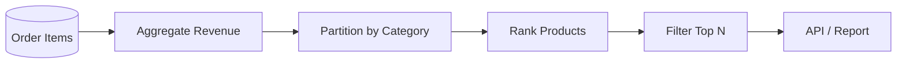
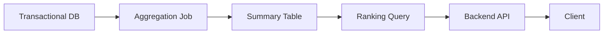

# 07- Ranking with PARTITION BY

## Overview

`PARTITION BY` changes a ranking window from a single global ranking into multiple independent ranking groups.

Without `PARTITION BY`, a ranking function considers the entire input set:

```sql
RANK() OVER (
    ORDER BY salary DESC
)
```

With `PARTITION BY`, the ranking restarts for every group:

```sql
RANK() OVER (
    PARTITION BY department_id
    ORDER BY salary DESC
)
```

This is one of the most important patterns in SQL window functions because many backend and analytical requirements are inherently **per-group**:

- Top employees within each department.
- Best-selling products within each category.
- Highest-value customers within each region.
- Latest event within each account.
- Per-tenant leaderboards.
- Per-customer transaction rankings.
- Top N records per organization.

The key distinction is:

> `PARTITION BY` defines **who competes with whom**. `ORDER BY` defines **how they are ranked**.

## Global Ranking vs Partitioned Ranking

Consider an `employees` table:

| employee_id | department | salary |
|---:|---|---:|
| 101 | Engineering | 160000 |
| 102 | Engineering | 150000 |
| 103 | Engineering | 140000 |
| 104 | Sales | 130000 |
| 105 | Sales | 120000 |
| 106 | Sales | 110000 |

A global ranking:

```sql
SELECT
    employee_id,
    department,
    salary,
    RANK() OVER (
        ORDER BY salary DESC
    ) AS salary_rank
FROM employees;
```

produces:

| employee_id | department | salary | salary_rank |
|---:|---|---:|---:|
| 101 | Engineering | 160000 | 1 |
| 102 | Engineering | 150000 | 2 |
| 103 | Engineering | 140000 | 3 |
| 104 | Sales | 130000 | 4 |
| 105 | Sales | 120000 | 5 |
| 106 | Sales | 110000 | 6 |

The entire table is one ranking population.

Now add:

```sql
PARTITION BY department
```

```sql
SELECT
    employee_id,
    department,
    salary,
    RANK() OVER (
        PARTITION BY department
        ORDER BY salary DESC
    ) AS salary_rank
FROM employees;
```

The result becomes:

| employee_id | department | salary | salary_rank |
|---:|---|---:|---:|
| 101 | Engineering | 160000 | 1 |
| 102 | Engineering | 150000 | 2 |
| 103 | Engineering | 140000 | 3 |
| 104 | Sales | 130000 | 1 |
| 105 | Sales | 120000 | 2 |
| 106 | Sales | 110000 | 3 |

The ranking restarts at `1` for each department.

## What `PARTITION BY` Actually Does

`PARTITION BY` divides the rows visible to the window function into logical groups.

It does **not**:

- Filter rows.
- Remove duplicates.
- Aggregate rows.
- Change the number of result rows.
- Physically partition the database table.
- Guarantee the final output order.

It only defines the window's calculation scope.

Conceptually:

```text
All rows
   │
   ├── Engineering
   │      ├── rank
   │      └── rank
   │      └── rank
   │
   └── Sales
          ├── rank
          └── rank
          └── rank
```

Each partition is evaluated independently.

## Syntax

The general syntax is:

```sql
RANK() OVER (
    PARTITION BY partition_column
    ORDER BY ranking_column DESC
)
```

The same pattern works with:

```sql
ROW_NUMBER()
RANK()
DENSE_RANK()
```

For example:

```sql
SELECT
    employee_id,
    department_id,
    salary,
    ROW_NUMBER() OVER (
        PARTITION BY department_id
        ORDER BY salary DESC
    ) AS row_number,
    RANK() OVER (
        PARTITION BY department_id
        ORDER BY salary DESC
    ) AS rank,
    DENSE_RANK() OVER (
        PARTITION BY department_id
        ORDER BY salary DESC
    ) AS dense_rank
FROM employees;
```

## `PARTITION BY` with `ROW_NUMBER()`

`ROW_NUMBER()` is especially useful with partitioning because it provides the standard **top-N rows per group** pattern.

For example, select the three highest-paid employees from every department:

```sql
WITH ranked_employees AS (
    SELECT
        employee_id,
        department_id,
        salary,
        ROW_NUMBER() OVER (
            PARTITION BY department_id
            ORDER BY salary DESC, employee_id
        ) AS row_number
    FROM employees
)
SELECT
    employee_id,
    department_id,
    salary
FROM ranked_employees
WHERE row_number <= 3;
```

Each department receives its own numbering:

```text
Engineering → 1, 2, 3
Sales       → 1, 2, 3
Support     → 1, 2, 3
```

The query can therefore return up to three rows per department.

### Why `ROW_NUMBER()` Is Often the Right Choice

If the requirement is:

> Return exactly three employees per department.

then `ROW_NUMBER()` is usually appropriate.

If multiple employees tie at the third position, `ROW_NUMBER()` still returns exactly three rows per department, assuming each partition has at least three rows.

The secondary `employee_id` ordering makes the selection deterministic.

## `PARTITION BY` with `RANK()`

`RANK()` is useful when tied values should share a position.

```sql
SELECT
    employee_id,
    department_id,
    salary,
    RANK() OVER (
        PARTITION BY department_id
        ORDER BY salary DESC
    ) AS salary_rank
FROM employees;
```

Suppose Engineering salaries are:

```text
160000
150000
150000
140000
```

The ranking is:

```text
160000 → 1
150000 → 2
150000 → 2
140000 → 4
```

The ranking gap occurs independently within the Engineering partition.

The Sales partition has its own ranking sequence.

## `PARTITION BY` with `DENSE_RANK()`

`DENSE_RANK()` also preserves ties but does not leave gaps.

```sql
SELECT
    employee_id,
    department_id,
    salary,
    DENSE_RANK() OVER (
        PARTITION BY department_id
        ORDER BY salary DESC
    ) AS salary_rank
FROM employees;
```

For:

```text
160000
150000
150000
140000
```

the result is:

```text
160000 → 1
150000 → 2
150000 → 2
140000 → 3
```

This is useful when the requirement is based on **distinct value levels within each group**.

## Ranking Functions with `PARTITION BY`

| Requirement | Recommended function |
|---|---|
| Unique position for every row in each group | `ROW_NUMBER()` |
| Exactly N rows per group | `ROW_NUMBER()` |
| Competition ranking per group | `RANK()` |
| Ties share rank and gaps are meaningful | `RANK()` |
| Distinct value ranking per group | `DENSE_RANK()` |
| Ties share rank without gaps | `DENSE_RANK()` |
| Nth distinct value within each group | `DENSE_RANK()` |

The `PARTITION BY` clause answers the grouping question; the ranking function answers the tie-handling question.

## Top N Per Group

One of the most common SQL interview and production patterns is:

> Find the top N records within every group.

For example, top three products by revenue in every category:

```sql
WITH product_revenue AS (
    SELECT
        category_id,
        product_id,
        SUM(quantity * unit_price) AS revenue
    FROM order_items
    GROUP BY
        category_id,
        product_id
),
ranked_products AS (
    SELECT
        category_id,
        product_id,
        revenue,
        ROW_NUMBER() OVER (
            PARTITION BY category_id
            ORDER BY revenue DESC, product_id
        ) AS row_number
    FROM product_revenue
)
SELECT
    category_id,
    product_id,
    revenue
FROM ranked_products
WHERE row_number <= 3;
```

The data flow is:



This pattern is more general than ranking raw table rows. Often the business metric must first be calculated.

## Top N Including Ties

The phrase **top three** is ambiguous.

It can mean:

1. Exactly three rows.
2. The top three distinct ranking levels.
3. Every row tied at or above the third position.

These requirements need different SQL.

### Exactly Three Rows

```sql
ROW_NUMBER() OVER (
    PARTITION BY category_id
    ORDER BY revenue DESC, product_id
)
```

Then:

```sql
WHERE row_number <= 3
```

### Top Three Distinct Levels

Use:

```sql
DENSE_RANK() OVER (
    PARTITION BY category_id
    ORDER BY revenue DESC
)
```

Then:

```sql
WHERE dense_rank <= 3
```

### Competition Ranking

Use:

```sql
RANK() OVER (
    PARTITION BY category_id
    ORDER BY revenue DESC
)
```

Then:

```sql
WHERE rank <= 3
```

The number of returned rows can exceed three if the boundary contains ties.

## Latest Row Per Group

`PARTITION BY` is not limited to numerical ranking.

A common backend requirement is:

> Get the latest record for every customer.

```sql
WITH ranked_events AS (
    SELECT
        event_id,
        customer_id,
        event_type,
        created_at,
        ROW_NUMBER() OVER (
            PARTITION BY customer_id
            ORDER BY created_at DESC, event_id DESC
        ) AS row_number
    FROM customer_events
)
SELECT
    event_id,
    customer_id,
    event_type,
    created_at
FROM ranked_events
WHERE row_number = 1;
```

Here, `PARTITION BY customer_id` means:

> Every customer gets an independent ordering.

`ROW_NUMBER() = 1` selects the newest event from each customer.

This pattern is common for:

- Current status.
- Latest payment.
- Latest address.
- Latest configuration.
- Most recent login.
- Latest synchronization event.
- Current subscription state.

## Per-Tenant Ranking

Multi-tenant systems frequently need rankings isolated by tenant.

For example:

```sql
SELECT
    user_id,
    tenant_id,
    score,
    RANK() OVER (
        PARTITION BY tenant_id
        ORDER BY score DESC
    ) AS leaderboard_rank
FROM user_scores
WHERE tenant_id = :tenant_id;
```

The `WHERE` clause restricts the query to the authorized tenant, while `PARTITION BY` defines the ranking population.

For a query that processes multiple tenants at once:

```sql
SELECT
    user_id,
    tenant_id,
    score,
    RANK() OVER (
        PARTITION BY tenant_id
        ORDER BY score DESC
    ) AS leaderboard_rank
FROM user_scores;
```

each tenant receives an independent leaderboard.

### Security Boundary

In a multi-tenant application, do not assume:

```sql
PARTITION BY tenant_id
```

is an authorization mechanism.

It is not.

Authorization must determine which tenant rows the request is allowed to access.

For example:

```sql
WHERE tenant_id = :authorized_tenant_id
```

or an appropriate database-level security mechanism such as PostgreSQL row-level security.

## Multiple Partition Columns

`PARTITION BY` can contain multiple columns:

```sql
ROW_NUMBER() OVER (
    PARTITION BY tenant_id, department_id
    ORDER BY salary DESC
)
```

This creates a partition for each unique combination:

```text
Tenant A + Engineering
Tenant A + Sales
Tenant B + Engineering
Tenant B + Sales
```

This is useful when the ranking boundary has multiple dimensions.

For example:

> Rank employees independently within each tenant and department.

```sql
SELECT
    employee_id,
    tenant_id,
    department_id,
    salary,
    RANK() OVER (
        PARTITION BY tenant_id, department_id
        ORDER BY salary DESC
    ) AS salary_rank
FROM employees;
```

## Partitioning and `ORDER BY` Have Different Responsibilities

Consider:

```sql
RANK() OVER (
    PARTITION BY department_id
    ORDER BY salary DESC
)
```

Each clause answers a different question:

| Clause | Question |
|---|---|
| `PARTITION BY department_id` | Who competes with whom? |
| `ORDER BY salary DESC` | How are they ranked? |
| Outer `ORDER BY` | How should the final result be displayed? |

For example:

```sql
SELECT
    employee_id,
    department_id,
    salary,
    RANK() OVER (
        PARTITION BY department_id
        ORDER BY salary DESC
    ) AS salary_rank
FROM employees
ORDER BY department_id, salary_rank;
```

The window ordering calculates the ranking.

The final `ORDER BY` controls presentation.

## `PARTITION BY` Does Not Mean `GROUP BY`

This is a common source of confusion.

`GROUP BY` reduces rows:

```sql
SELECT
    department_id,
    MAX(salary) AS highest_salary
FROM employees
GROUP BY department_id;
```

The result contains one row per department.

`PARTITION BY` does not reduce rows:

```sql
SELECT
    employee_id,
    department_id,
    salary,
    MAX(salary) OVER (
        PARTITION BY department_id
    ) AS department_max_salary
FROM employees;
```

Every employee remains in the result.

The aggregate is calculated independently within each department and attached to every employee row.

This distinction is fundamental:

| Feature | `GROUP BY` | `PARTITION BY` |
|---|---|---|
| Reduces rows | Yes | No |
| Creates groups | Yes | Yes, for window scope |
| Preserves detail rows | No | Yes |
| Used with window functions | Not required | Yes |
| Typical use | Aggregation | Per-row analytics |

## Ranking Aggregated Data

A common production pattern is:

```text
Raw records
    ↓
Filter
    ↓
GROUP BY
    ↓
Business metric
    ↓
PARTITION BY
    ↓
Ranking
```

For example, rank customers by monthly revenue within each region:

```sql
WITH customer_revenue AS (
    SELECT
        region_id,
        customer_id,
        SUM(amount) AS revenue
    FROM payments
    WHERE status = 'succeeded'
      AND paid_at >= :start_date
      AND paid_at < :end_date
    GROUP BY
        region_id,
        customer_id
)
SELECT
    region_id,
    customer_id,
    revenue,
    RANK() OVER (
        PARTITION BY region_id
        ORDER BY revenue DESC
    ) AS regional_rank
FROM customer_revenue;
```

The window function operates on the aggregated customer-level rows, not on individual payments.

This usually matches the business requirement more closely and can substantially reduce the number of rows entering the window operation.

## Combining Multiple Rankings

Multiple window functions can use the same partition but different ordering criteria.

For example:

```sql
SELECT
    employee_id,
    department_id,
    salary,
    performance_score,
    RANK() OVER (
        PARTITION BY department_id
        ORDER BY salary DESC
    ) AS salary_rank,
    RANK() OVER (
        PARTITION BY department_id
        ORDER BY performance_score DESC
    ) AS performance_rank
FROM employees;
```

This provides independent rankings:

```text
Within each department:
    salary ranking
    performance ranking
```

The partitions are the same, but each window has its own ordering.

## Partitioning and NULL Values

`NULL` ordering is database-specific and can affect ranking results.

For example:

```sql
RANK() OVER (
    PARTITION BY department_id
    ORDER BY salary DESC
)
```

If `salary` can be `NULL`, determine whether those rows should rank first or last.

In PostgreSQL, this can be made explicit:

```sql
RANK() OVER (
    PARTITION BY department_id
    ORDER BY salary DESC NULLS LAST
)
```

Explicit `NULL` handling is preferable when the ranking semantics matter to the application.

## Deterministic Ordering with `ROW_NUMBER()`

For `ROW_NUMBER()`, ties in the ordering columns can make the selected row nondeterministic.

Avoid:

```sql
ROW_NUMBER() OVER (
    PARTITION BY customer_id
    ORDER BY created_at DESC
)
```

if multiple events can have the same timestamp.

Prefer:

```sql
ROW_NUMBER() OVER (
    PARTITION BY customer_id
    ORDER BY created_at DESC, event_id DESC
)
```

The unique `event_id` provides a deterministic tie-breaker.

However, be careful with `RANK()` and `DENSE_RANK()`.

This:

```sql
RANK() OVER (
    PARTITION BY department_id
    ORDER BY salary DESC
)
```

preserves salary ties.

Adding:

```sql
employee_id
```

to the ordering:

```sql
RANK() OVER (
    PARTITION BY department_id
    ORDER BY salary DESC, employee_id
)
```

makes the complete ordering unique and therefore eliminates salary ties.

Use additional ordering columns only when that matches the intended business semantics.

## Query Evaluation

Window functions operate on the rows produced by the query's earlier relational operations.

For example:

```sql
WITH department_sales AS (
    SELECT
        department_id,
        employee_id,
        SUM(amount) AS sales
    FROM sales
    WHERE sale_date >= :start_date
    GROUP BY
        department_id,
        employee_id
)
SELECT
    department_id,
    employee_id,
    sales,
    RANK() OVER (
        PARTITION BY department_id
        ORDER BY sales DESC
    ) AS sales_rank
FROM department_sales;
```

Conceptually:

```text
FROM
  ↓
WHERE
  ↓
GROUP BY
  ↓
Aggregated rows
  ↓
Window function
  ↓
Final ORDER BY
```

This is why ranking an aggregated metric is usually implemented with a CTE or subquery.

## Filtering a Partitioned Rank

A window-function result generally cannot be filtered in the same query block's `WHERE` clause.

This is invalid:

```sql
SELECT
    employee_id,
    department_id,
    salary,
    ROW_NUMBER() OVER (
        PARTITION BY department_id
        ORDER BY salary DESC
    ) AS row_number
FROM employees
WHERE row_number <= 3;
```

Use a CTE:

```sql
WITH ranked AS (
    SELECT
        employee_id,
        department_id,
        salary,
        ROW_NUMBER() OVER (
            PARTITION BY department_id
            ORDER BY salary DESC
        ) AS row_number
    FROM employees
)
SELECT
    employee_id,
    department_id,
    salary
FROM ranked
WHERE row_number <= 3;
```

Some database systems support `QUALIFY`, which can simplify this pattern:

```sql
SELECT
    employee_id,
    department_id,
    salary,
    ROW_NUMBER() OVER (
        PARTITION BY department_id
        ORDER BY salary DESC
    ) AS row_number
FROM employees
QUALIFY row_number <= 3;
```

Use `QUALIFY` only where the target database supports it.

## Performance Considerations

Partitioned ranking can be expensive on large datasets because the database must organize rows according to the partition and ordering requirements.

For:

```sql
RANK() OVER (
    PARTITION BY department_id
    ORDER BY salary DESC
)
```

the database conceptually needs to establish:

```text
department A → ordered salaries
department B → ordered salaries
department C → ordered salaries
...
```

Potential costs include:

- Sorting.
- Memory consumption.
- Temporary storage.
- Large intermediate result sets.
- CPU consumption.
- I/O for spilled sorts.

Use:

```sql
EXPLAIN (ANALYZE, BUFFERS)
```

in PostgreSQL to inspect the actual execution behavior.

Do not optimize based solely on the SQL text.

## Reduce the Window Input

The most reliable optimization is often to reduce the number of rows entering the window operation.

Instead of:

```sql
SELECT
    *,
    RANK() OVER (
        PARTITION BY category_id
        ORDER BY revenue DESC
    )
FROM huge_transaction_table;
```

first calculate the required business metric:

```sql
WITH product_revenue AS (
    SELECT
        category_id,
        product_id,
        SUM(quantity * unit_price) AS revenue
    FROM order_items
    WHERE created_at >= :start_date
      AND created_at < :end_date
    GROUP BY
        category_id,
        product_id
)
SELECT
    category_id,
    product_id,
    revenue,
    RANK() OVER (
        PARTITION BY category_id
        ORDER BY revenue DESC
    ) AS category_rank
FROM product_revenue;
```

The window function now operates on product-level aggregates rather than transaction-level data.

## Indexing Considerations

Indexes can help with filtering, joins, and access paths, but an index does not guarantee that a partitioned window operation will avoid sorting.

For example:

```sql
RANK() OVER (
    PARTITION BY department_id
    ORDER BY salary DESC
)
```

may benefit from an access path aligned with:

```text
department_id
salary
```

but the optimizer still determines the best execution strategy.

For PostgreSQL, inspect:

```sql
EXPLAIN (ANALYZE, BUFFERS)
SELECT
    employee_id,
    department_id,
    salary,
    RANK() OVER (
        PARTITION BY department_id
        ORDER BY salary DESC
    ) AS salary_rank
FROM employees;
```

Create indexes based on actual workload and query plans rather than automatically indexing every window-function ordering clause.

## Large-Scale Analytics

For large reporting workloads, ranking millions of rows synchronously from an API request can create latency and resource contention.

Production alternatives include:

- Materialized views.
- Precomputed summary tables.
- Scheduled aggregation jobs.
- Incremental pipelines.
- Batch processing with Celery.
- Analytical databases.
- Cached results in Redis where appropriate.

For example:



This architecture separates expensive analytical computation from latency-sensitive transactional requests.

## Backend API Example

Suppose a FastAPI endpoint returns the top three products in every category.

A parameterized query can perform the ranking in PostgreSQL:

```python
query = """
WITH product_revenue AS (
    SELECT
        category_id,
        product_id,
        SUM(quantity * unit_price) AS revenue
    FROM order_items
    WHERE created_at >= %(start_date)s
      AND created_at < %(end_date)s
    GROUP BY
        category_id,
        product_id
),
ranked AS (
    SELECT
        category_id,
        product_id,
        revenue,
        ROW_NUMBER() OVER (
            PARTITION BY category_id
            ORDER BY revenue DESC, product_id
        ) AS row_number
    FROM product_revenue
)
SELECT
    category_id,
    product_id,
    revenue
FROM ranked
WHERE row_number <= 3
ORDER BY category_id, row_number;
"""

cursor.execute(
    query,
    {
        "start_date": start_date,
        "end_date": end_date,
    },
)
```

The application should not fetch all products into Python and rank them manually unless there is a specific reason to do so.

The database is designed to perform set-based operations close to the data.

## Django ORM Considerations

Modern Django versions support window expressions through `Window`.

Conceptually:

```python
from django.db.models import F, Window
from django.db.models.functions import RowNumber

queryset = (
    Employee.objects
    .annotate(
        row_number=Window(
            expression=RowNumber(),
            partition_by=[F("department_id")],
            order_by=[F("salary").desc(), F("id").asc()],
        )
    )
)
```

The important design principle remains the same:

```text
partition_by → independent populations
order_by     → ranking order
```

For complex top-N-per-group queries, verify the generated SQL and database execution plan rather than assuming ORM abstractions produce the optimal query.

## Common Mistakes

| Mistake | Why it happens | Correct approach |
|---|---|---|
| Confusing `PARTITION BY` with `GROUP BY` | Both appear to create groups | Remember that window partitions preserve rows |
| Forgetting `PARTITION BY` | Global ranking is easier to write | Define the actual ranking population |
| Using `ROW_NUMBER()` when ties must be preserved | It forces unique positions | Use `RANK()` or `DENSE_RANK()` |
| Using `RANK()` when exactly N rows are required | Ties can produce more than N rows | Use deterministic `ROW_NUMBER()` |
| Adding a unique tie-breaker to `RANK()` | Deterministic ordering is added blindly | Preserve tie columns when ties are meaningful |
| Filtering a window alias in `WHERE` | Window output is not available at that stage | Use a CTE, subquery, or `QUALIFY` |
| Ranking raw transactions | Business metric may be entity-level | Aggregate before ranking |
| Assuming partitions are physical database partitions | Similar terminology causes confusion | `PARTITION BY` is a logical window boundary |
| Treating `PARTITION BY tenant_id` as authorization | Ranking scope is mistaken for security | Enforce authorization independently |
| Ignoring `NULL` ordering | Database defaults may not match business rules | Specify `NULLS FIRST/LAST` where needed |
| Assuming window functions always scale cheaply | Large sorts can consume resources | Reduce input and inspect execution plans |

## Interview Questions

### What Does `PARTITION BY` Do in a Window Function?

It divides the rows into independent logical groups for the window calculation.

```sql
RANK() OVER (
    PARTITION BY department_id
    ORDER BY salary DESC
)
```

means:

> Rank employees by salary independently within each department.

### Does `PARTITION BY` Reduce Rows?

No.

For example:

```sql
MAX(salary) OVER (
    PARTITION BY department_id
)
```

returns the department maximum while preserving every employee row.

`GROUP BY`, by contrast, normally reduces the result to one row per grouping key.

### What Is the Difference Between `PARTITION BY` and `ORDER BY` Inside `OVER()`?

`PARTITION BY` defines the calculation population.

`ORDER BY` defines the ordering within that population.

```sql
RANK() OVER (
    PARTITION BY department_id
    ORDER BY salary DESC
)
```

means:

```text
Who competes? → department
How are they ranked? → salary descending
```

### How Do You Find the Top Three Employees Per Department?

Use `ROW_NUMBER()` when exactly three rows are required:

```sql
WITH ranked AS (
    SELECT
        employee_id,
        department_id,
        salary,
        ROW_NUMBER() OVER (
            PARTITION BY department_id
            ORDER BY salary DESC, employee_id
        ) AS row_number
    FROM employees
)
SELECT
    employee_id,
    department_id,
    salary
FROM ranked
WHERE row_number <= 3;
```

### How Do You Return All Employees Tied Within the Top Three Salary Levels?

Use `DENSE_RANK()`:

```sql
WITH ranked AS (
    SELECT
        employee_id,
        department_id,
        salary,
        DENSE_RANK() OVER (
            PARTITION BY department_id
            ORDER BY salary DESC
        ) AS salary_rank
    FROM employees
)
SELECT
    employee_id,
    department_id,
    salary
FROM ranked
WHERE salary_rank <= 3;
```

### Does `PARTITION BY` Sort the Final Result?

No.

It defines the window calculation.

If the API requires a specific output order, use an outer `ORDER BY`:

```sql
ORDER BY department_id, salary_rank;
```

### Can Multiple Columns Be Used in `PARTITION BY`?

Yes:

```sql
PARTITION BY tenant_id, department_id
```

This creates independent partitions for each unique combination of those columns.

## Production Checklist

Before shipping a partitioned-ranking query, verify:

- **Population:** Are the correct rows included in each partition?
- **Tie semantics:** Should ties share a rank?
- **Boundary behavior:** Should top-N mean rows or distinct ranking levels?
- **Determinism:** Does `ROW_NUMBER()` have a stable tie-breaker?
- **Filtering:** Is the window result filtered in an appropriate outer query?
- **Security:** Are tenant and authorization boundaries enforced independently?
- **NULLs:** Is the treatment of `NULL` values intentional?
- **Performance:** Has the actual execution plan been inspected?
- **Data volume:** Is ranking being performed on the smallest correct input?
- **API latency:** Should the calculation be precomputed rather than executed synchronously?

## Key Takeaways

- **`PARTITION BY` defines independent ranking populations; it answers the question of who competes with whom.**
- **Combine `PARTITION BY` with `ROW_NUMBER()`, `RANK()`, or `DENSE_RANK()` according to whether the requirement needs unique rows, competition ranking, or distinct value levels.**
- **The standard top-N-per-group pattern uses `ROW_NUMBER()` when exactly N rows are required and `DENSE_RANK()` when all rows in the top N distinct levels should be included.**
- **`PARTITION BY` preserves rows and is fundamentally different from `GROUP BY`; aggregation can occur first and ranking can then be applied to the aggregated result.**
- **For production workloads, define tie semantics and security boundaries explicitly, make row selection deterministic, reduce the window input, and validate performance with the database execution plan.**