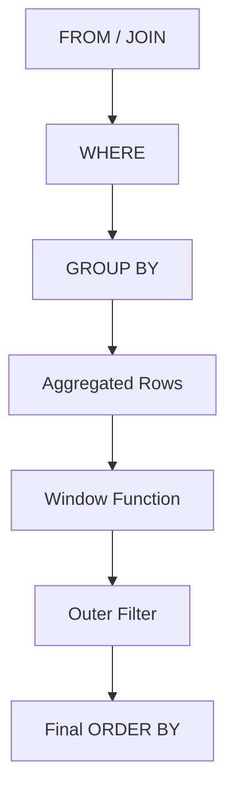
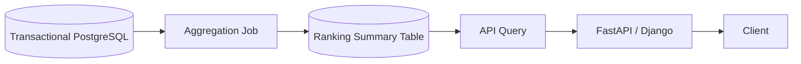

# 08- Top N per Group

## Overview

**Top N per group** is a common SQL requirement where a query must return the best, newest, largest, or otherwise highest-ranked `N` rows independently for every group.

Typical backend requirements include:

- Top 3 products by revenue per category.
- Top 5 employees by performance per department.
- Latest order per customer.
- Top 10 API consumers per tenant.
- Highest-value transactions per account.
- Most recent event per device.
- Top N posts per community.

A normal:

```sql
ORDER BY score DESC
LIMIT 3
```

returns three rows for the **entire result set**.

Top N per group requires a separate ranking boundary for each group:

```sql
ROW_NUMBER() OVER (
    PARTITION BY group_column
    ORDER BY score DESC
)
```

The standard pattern is:

```text
Filter
  ↓
Optional aggregation
  ↓
PARTITION BY group
  ↓
ORDER BY within each group
  ↓
Assign rank
  ↓
Filter rank <= N
```

## Why Top N per Group Requires a Window Function

Consider:

```sql
SELECT
    category_id,
    product_id,
    revenue
FROM product_sales
ORDER BY revenue DESC
LIMIT 3;
```

This answers:

> What are the three highest-revenue products overall?

It does **not** answer:

> What are the three highest-revenue products in every category?

The second requirement needs the database to maintain an independent ordering for every category.

```sql
ROW_NUMBER() OVER (
    PARTITION BY category_id
    ORDER BY revenue DESC
)
```

The `PARTITION BY` establishes the independent groups, while the window `ORDER BY` establishes the ranking inside each group.

## Core Pattern

The most broadly applicable implementation is:

```sql
WITH ranked AS (
    SELECT
        category_id,
        product_id,
        revenue,
        ROW_NUMBER() OVER (
            PARTITION BY category_id
            ORDER BY revenue DESC, product_id
        ) AS row_number
    FROM product_sales
)
SELECT
    category_id,
    product_id,
    revenue
FROM ranked
WHERE row_number <= 3;
```

The inner query calculates the ranking.

The outer query filters the calculated ranking.

This separation is important because the window-function result is not generally available to the same query block's `WHERE` clause.

## How the Pattern Works

Suppose the input is:

| category_id | product_id | revenue |
|---:|---:|---:|
| 10 | 101 | 9000 |
| 10 | 102 | 7000 |
| 10 | 103 | 6000 |
| 10 | 104 | 3000 |
| 20 | 201 | 12000 |
| 20 | 202 | 11000 |
| 20 | 203 | 5000 |
| 20 | 204 | 2000 |

The window:

```sql
ROW_NUMBER() OVER (
    PARTITION BY category_id
    ORDER BY revenue DESC
)
```

produces:

| category_id | product_id | revenue | row_number |
|---:|---:|---:|---:|
| 10 | 101 | 9000 | 1 |
| 10 | 102 | 7000 | 2 |
| 10 | 103 | 6000 | 3 |
| 10 | 104 | 3000 | 4 |
| 20 | 201 | 12000 | 1 |
| 20 | 202 | 11000 | 2 |
| 20 | 203 | 5000 | 3 |
| 20 | 204 | 2000 | 4 |

Filtering:

```sql
WHERE row_number <= 3
```

returns three rows from each category.

## `ROW_NUMBER()` for Exactly N Rows

Use `ROW_NUMBER()` when the requirement is:

> Return at most exactly N rows from each group.

Example:

```sql
WITH ranked AS (
    SELECT
        department_id,
        employee_id,
        performance_score,
        ROW_NUMBER() OVER (
            PARTITION BY department_id
            ORDER BY performance_score DESC, employee_id
        ) AS row_number
    FROM employees
)
SELECT
    department_id,
    employee_id,
    performance_score
FROM ranked
WHERE row_number <= 3;
```

The secondary `employee_id` ordering makes the result deterministic when employees have identical performance scores.

### Why Determinism Matters

Suppose two employees have the same score:

```text
Alice → 95
Bob   → 95
```

If the query only specifies:

```sql
ORDER BY performance_score DESC
```

the database has no requirement to choose Alice before Bob.

For a stable top-N API response, use a deterministic tie-breaker:

```sql
ORDER BY performance_score DESC, employee_id
```

This is particularly important for:

- Pagination.
- API responses.
- Materialized reports.
- Reproducible batch jobs.
- Tests.
- Cache keys and cached result sets.

## `RANK()` for Top N Including Competition Ties

`RANK()` should be considered when tied values must receive the same rank.

```sql
WITH ranked AS (
    SELECT
        category_id,
        product_id,
        revenue,
        RANK() OVER (
            PARTITION BY category_id
            ORDER BY revenue DESC
        ) AS rank
    FROM product_sales
)
SELECT
    category_id,
    product_id,
    revenue
FROM ranked
WHERE rank <= 3;
```

Suppose a category contains:

| product | revenue |
|---|---:|
| A | 1000 |
| B | 900 |
| C | 900 |
| D | 800 |
| E | 700 |

`RANK()` produces:

| product | revenue | rank |
|---|---:|---:|
| A | 1000 | 1 |
| B | 900 | 2 |
| C | 900 | 2 |
| D | 800 | 4 |
| E | 700 | 5 |

Therefore:

```sql
WHERE rank <= 3
```

returns A, B, and C.

The number of rows can exceed `N` when the boundary contains ties.

## `DENSE_RANK()` for Top N Distinct Levels

`DENSE_RANK()` also gives tied rows the same rank, but it does not create gaps.

```sql
WITH ranked AS (
    SELECT
        category_id,
        product_id,
        revenue,
        DENSE_RANK() OVER (
            PARTITION BY category_id
            ORDER BY revenue DESC
        ) AS dense_rank
    FROM product_sales
)
SELECT
    category_id,
    product_id,
    revenue
FROM ranked
WHERE dense_rank <= 3;
```

For:

```text
1000
900
900
800
700
```

the ranks are:

```text
1000 → 1
900  → 2
900  → 2
800  → 3
700  → 4
```

This returns four rows because the first three **distinct revenue levels** include four products.

## Choosing the Correct Ranking Function

The phrase "top N" is not precise enough by itself.

| Requirement | Function |
|---|---|
| Exactly N rows per group | `ROW_NUMBER()` |
| N rows with deterministic tie-breaking | `ROW_NUMBER()` |
| Include ties at the Nth competition rank | `RANK()` |
| Top N distinct value levels | `DENSE_RANK()` |
| Latest one row per group | `ROW_NUMBER()` |
| Highest N unique scores per group | `DENSE_RANK()` |

Before writing the query, determine whether `N` describes:

- Rows.
- Competition ranks.
- Distinct value levels.

This distinction prevents many production bugs.

## Top N from Aggregated Data

Frequently, the ranking metric does not exist directly in a table.

For example:

> Find the top three products by total revenue in each category.

The revenue must first be calculated.

```sql
WITH product_revenue AS (
    SELECT
        category_id,
        product_id,
        SUM(quantity * unit_price) AS revenue
    FROM order_items
    WHERE created_at >= :start_date
      AND created_at < :end_date
    GROUP BY
        category_id,
        product_id
),
ranked AS (
    SELECT
        category_id,
        product_id,
        revenue,
        ROW_NUMBER() OVER (
            PARTITION BY category_id
            ORDER BY revenue DESC, product_id
        ) AS row_number
    FROM product_revenue
)
SELECT
    category_id,
    product_id,
    revenue
FROM ranked
WHERE row_number <= 3;
```

The important execution concept is:

```text
order_items
    ↓
filter time range
    ↓
GROUP BY product
    ↓
calculate revenue
    ↓
PARTITION BY category
    ↓
ROW_NUMBER()
    ↓
keep top 3
```

Ranking raw order items would be incorrect because the business metric is product-level revenue, not individual order-item revenue.

## Latest Row Per Group

Top N does not have to mean "highest numeric value."

A common special case is:

> Return the latest record for every entity.

For example:

```sql
WITH ranked AS (
    SELECT
        event_id,
        customer_id,
        event_type,
        created_at,
        ROW_NUMBER() OVER (
            PARTITION BY customer_id
            ORDER BY created_at DESC, event_id DESC
        ) AS row_number
    FROM customer_events
)
SELECT
    event_id,
    customer_id,
    event_type,
    created_at
FROM ranked
WHERE row_number = 1;
```

This is effectively **top 1 per customer ordered by time**.

Common uses include:

- Latest customer event.
- Latest payment attempt.
- Latest status change.
- Latest login.
- Latest configuration.
- Latest device heartbeat.

## Top N Per Tenant

Multi-tenant applications commonly need rankings isolated by tenant.

For example:

```sql
WITH ranked AS (
    SELECT
        tenant_id,
        user_id,
        score,
        ROW_NUMBER() OVER (
            PARTITION BY tenant_id
            ORDER BY score DESC, user_id
        ) AS row_number
    FROM user_scores
)
SELECT
    tenant_id,
    user_id,
    score
FROM ranked
WHERE row_number <= 10;
```

Each tenant gets its own top-10 list.

For a request scoped to one authorized tenant:

```sql
WITH ranked AS (
    SELECT
        user_id,
        score,
        ROW_NUMBER() OVER (
            PARTITION BY tenant_id
            ORDER BY score DESC, user_id
        ) AS row_number
    FROM user_scores
    WHERE tenant_id = :tenant_id
)
SELECT
    user_id,
    score
FROM ranked
WHERE row_number <= 10;
```

Filtering to the authorized tenant before ranking can substantially reduce the amount of data processed.

### Security Boundary

`PARTITION BY tenant_id` is not an authorization mechanism.

A ranking query must still enforce the application's tenant boundary:

```sql
WHERE tenant_id = :authorized_tenant_id
```

The authorization decision should come from trusted application or database security controls, not from the ranking expression.

## Multiple Grouping Dimensions

A group can be defined by multiple columns:

```sql
ROW_NUMBER() OVER (
    PARTITION BY tenant_id, category_id
    ORDER BY revenue DESC, product_id
)
```

This means:

```text
Tenant A + Category X
Tenant A + Category Y
Tenant B + Category X
Tenant B + Category Y
```

each receives an independent top-N calculation.

For example:

```sql
WITH ranked AS (
    SELECT
        tenant_id,
        category_id,
        product_id,
        revenue,
        ROW_NUMBER() OVER (
            PARTITION BY tenant_id, category_id
            ORDER BY revenue DESC, product_id
        ) AS row_number
    FROM product_sales
)
SELECT
    tenant_id,
    category_id,
    product_id,
    revenue
FROM ranked
WHERE row_number <= 3;
```

## Filtering Before Ranking

Filtering the source rows before the window function changes the population being ranked.

For example:

```sql
WITH ranked AS (
    SELECT
        department_id,
        employee_id,
        salary,
        ROW_NUMBER() OVER (
            PARTITION BY department_id
            ORDER BY salary DESC, employee_id
        ) AS row_number
    FROM employees
    WHERE employment_status = 'active'
)
SELECT
    department_id,
    employee_id,
    salary
FROM ranked
WHERE row_number <= 3;
```

This means:

> Top three active employees per department.

If the `employment_status` filter were applied after ranking, inactive employees could consume ranking positions.

This is a critical distinction:

```text
Filter before window
→ determines ranking population

Filter after window
→ filters already-ranked rows
```

## `WHERE` vs Window Result

This pattern is invalid in most commonly used SQL dialects:

```sql
SELECT
    employee_id,
    department_id,
    salary,
    ROW_NUMBER() OVER (
        PARTITION BY department_id
        ORDER BY salary DESC
    ) AS row_number
FROM employees
WHERE row_number <= 3;
```

The window result is calculated later than the query block's `WHERE` phase.

Use a CTE:

```sql
WITH ranked AS (
    SELECT
        employee_id,
        department_id,
        salary,
        ROW_NUMBER() OVER (
            PARTITION BY department_id
            ORDER BY salary DESC
        ) AS row_number
    FROM employees
)
SELECT
    employee_id,
    department_id,
    salary
FROM ranked
WHERE row_number <= 3;
```

Some database systems support `QUALIFY`:

```sql
SELECT
    employee_id,
    department_id,
    salary,
    ROW_NUMBER() OVER (
        PARTITION BY department_id
        ORDER BY salary DESC
    ) AS row_number
FROM employees
QUALIFY row_number <= 3;
```

Use `QUALIFY` only when supported by the target database.

## Query Evaluation Model

A useful mental model is:



For a top-N-per-group query:

```sql
WITH ranked AS (
    SELECT
        category_id,
        product_id,
        SUM(amount) AS revenue,
        ROW_NUMBER() OVER (
            PARTITION BY category_id
            ORDER BY SUM(amount) DESC, product_id
        ) AS row_number
    FROM sales
    WHERE status = 'completed'
    GROUP BY category_id, product_id
)
SELECT
    category_id,
    product_id,
    revenue
FROM ranked
WHERE row_number <= 3;
```

The ranking operates on the rows produced by the aggregation.

## Ordering the Final Result

The window's `ORDER BY` does not guarantee the final result order.

This:

```sql
ROW_NUMBER() OVER (
    PARTITION BY category_id
    ORDER BY revenue DESC
)
```

controls ranking.

It does not necessarily make the final result appear as:

```text
category 1 → rank 1, rank 2, rank 3
category 2 → rank 1, rank 2, rank 3
```

If the API requires that order, explicitly specify:

```sql
ORDER BY category_id, row_number;
```

For example:

```sql
WITH ranked AS (
    SELECT
        category_id,
        product_id,
        revenue,
        ROW_NUMBER() OVER (
            PARTITION BY category_id
            ORDER BY revenue DESC, product_id
        ) AS row_number
    FROM product_sales
)
SELECT
    category_id,
    product_id,
    revenue
FROM ranked
WHERE row_number <= 3
ORDER BY category_id, row_number;
```

## Handling `NULL` Values

If the ranking column can contain `NULL`, define the desired behavior explicitly.

PostgreSQL allows:

```sql
ROW_NUMBER() OVER (
    PARTITION BY department_id
    ORDER BY salary DESC NULLS LAST, employee_id
)
```

Without explicit handling, database-specific `NULL` ordering rules can produce unexpected ranking results.

This matters particularly when:

- Missing scores exist.
- Optional timestamps exist.
- Data migration created incomplete rows.
- Legacy records contain `NULL` values.

## Performance Considerations

Top-N-per-group queries can become expensive when the input contains millions of rows.

Potential costs include:

- Large sorts.
- Memory consumption.
- Temporary disk usage.
- CPU usage.
- Large intermediate result sets.
- Increased database connection time.

The database generally needs to establish ordering within each partition before assigning row numbers.

For PostgreSQL, inspect the actual execution plan:

```sql
EXPLAIN (ANALYZE, BUFFERS)
WITH ranked AS (
    SELECT
        category_id,
        product_id,
        revenue,
        ROW_NUMBER() OVER (
            PARTITION BY category_id
            ORDER BY revenue DESC, product_id
        ) AS row_number
    FROM product_sales
)
SELECT
    category_id,
    product_id,
    revenue
FROM ranked
WHERE row_number <= 3;
```

Look for:

- Large sequential scans.
- Expensive sorts.
- Disk-based sorts.
- High row counts entering the window.
- Poor filtering selectivity.
- Unexpected joins multiplying rows.

## Reduce the Input Before Ranking

One of the most effective optimizations is to filter and aggregate before applying the window function.

Prefer:

```sql
WITH product_revenue AS (
    SELECT
        category_id,
        product_id,
        SUM(amount) AS revenue
    FROM order_items
    WHERE created_at >= :start_date
      AND created_at < :end_date
    GROUP BY category_id, product_id
),
ranked AS (
    SELECT
        category_id,
        product_id,
        revenue,
        ROW_NUMBER() OVER (
            PARTITION BY category_id
            ORDER BY revenue DESC, product_id
        ) AS row_number
    FROM product_revenue
)
SELECT
    category_id,
    product_id,
    revenue
FROM ranked
WHERE row_number <= 3;
```

rather than ranking every raw transaction.

The window function should operate on the smallest dataset that still preserves the required semantics.

## Indexing

Indexes can help reduce the rows that reach the ranking operation by supporting selective filters and joins.

For example, if a query frequently filters by:

```sql
WHERE tenant_id = :tenant_id
  AND created_at >= :start_date
  AND created_at < :end_date
```

an index aligned with the filtering workload may be useful.

However, do not assume that an index matching:

```text
PARTITION BY category_id
ORDER BY revenue DESC
```

will automatically eliminate all sorting.

For derived metrics such as:

```sql
SUM(quantity * unit_price)
```

the database may still need to aggregate and sort the resulting rows.

Always validate with the actual execution plan.

## Large-Scale Production Workloads

For a synchronous API, a query that ranks millions of rows on every request may produce unacceptable latency and database load.

For expensive recurring rankings, consider:

- Materialized views.
- Precomputed summary tables.
- Scheduled aggregation jobs.
- Incremental aggregation.
- Background workers such as Celery.
- Analytical databases.
- Carefully scoped cache layers.

A common architecture is:



The API reads a smaller, precomputed dataset instead of repeatedly processing the complete transactional history.

## Pagination of Top N Per Group

Top-N queries and pagination are different concerns.

For a fixed top 3:

```sql
WHERE row_number <= 3
```

is straightforward.

For larger datasets, avoid assuming that traditional offset pagination is automatically efficient:

```sql
OFFSET 100000
LIMIT 20
```

The database may still need to process and discard many rows.

If clients need pagination within each ranked group, consider:

- Stable ordering.
- Cursor-based pagination.
- A materialized ranking dataset.
- A carefully designed composite key.
- Explicit product/business tie-breakers.

The ranking semantics should remain stable between requests.

## Backend API Example

Suppose a Django or FastAPI service exposes:

```text
GET /categories/top-products
```

The SQL can calculate the result directly in PostgreSQL:

```python
query = """
WITH product_revenue AS (
    SELECT
        category_id,
        product_id,
        SUM(quantity * unit_price) AS revenue
    FROM order_items
    WHERE created_at >= %(start_date)s
      AND created_at < %(end_date)s
      AND status = 'completed'
    GROUP BY
        category_id,
        product_id
),
ranked AS (
    SELECT
        category_id,
        product_id,
        revenue,
        ROW_NUMBER() OVER (
            PARTITION BY category_id
            ORDER BY revenue DESC, product_id
        ) AS row_number
    FROM product_revenue
)
SELECT
    category_id,
    product_id,
    revenue
FROM ranked
WHERE row_number <= %(limit)s
ORDER BY category_id, row_number;
"""

cursor.execute(
    query,
    {
        "start_date": start_date,
        "end_date": end_date,
        "limit": limit,
    },
)
```

Use parameterized queries for values such as dates, tenant IDs, and limits rather than constructing SQL with string interpolation.

## Why Not Rank in Python?

A common application-level implementation is:

```text
Fetch all products
    ↓
Group in Python
    ↓
Sort each group
    ↓
Take top N
```

This is usually inferior when the database can perform the operation efficiently.

Database-side ranking provides:

- Less data transferred over the network.
- Less application memory usage.
- Set-based execution.
- Better use of database query processing.
- Easier composition with filtering and aggregation.

For large datasets, pulling all candidate rows into a Django or FastAPI process just to rank them can become a significant scalability problem.

Application-side processing can still be appropriate when:

- The dataset is already small.
- Data comes from multiple sources.
- Ranking requires complex application-only logic.
- The data has already been materialized in memory for another operation.

## Common Mistakes

| Mistake | Problem | Better approach |
|---|---|---|
| `ORDER BY ... LIMIT N` | Returns N rows globally | Use a partitioned window |
| Ranking raw transactions | Wrong business grain | Aggregate before ranking |
| Using `ROW_NUMBER()` when ties matter | Ties are arbitrarily broken | Use `RANK()` or `DENSE_RANK()` |
| Using `RANK()` for exactly N rows | Ties can exceed N rows | Use `ROW_NUMBER()` |
| Missing a deterministic tie-breaker | Results can change between executions | Add a stable unique column |
| Filtering after ranking when it should be before | Wrong rows consume rank positions | Apply source filters before the window |
| Filtering window aliases in `WHERE` | Invalid query structure | Use a CTE, subquery, or `QUALIFY` |
| Assuming window `ORDER BY` sorts output | Ranking order and presentation order differ | Add an outer `ORDER BY` |
| Treating `PARTITION BY` as authorization | Logical grouping is not security | Enforce tenant authorization separately |
| Ranking huge datasets per API request | High latency and DB load | Precompute or reduce the input |
| Ignoring `NULL` ordering | Unexpected top-N results | Define `NULLS FIRST/LAST` when required |

## Production Checklist

Before deploying a top-N-per-group query, verify:

- **Business grain:** Are you ranking users, products, transactions, or aggregated entities?
- **Group boundary:** Does `PARTITION BY` match the actual business group?
- **N semantics:** Does N mean rows, ranks, or distinct values?
- **Tie behavior:** Should ties be preserved?
- **Determinism:** Is `ROW_NUMBER()` ordered by a stable tie-breaker?
- **Filtering:** Are eligibility filters applied before ranking?
- **Security:** Are tenant and authorization boundaries enforced independently?
- **NULL behavior:** Is `NULL` ordering intentional?
- **Final ordering:** Is an outer `ORDER BY` required by the API contract?
- **Performance:** Has the actual execution plan been inspected?
- **Data volume:** Can filtering or aggregation reduce the window input?
- **Architecture:** Should expensive rankings be precomputed rather than executed synchronously?
- **Testing:** Are tie, empty-group, duplicate, and boundary cases covered?

## Interview Traps

### "Get the Top 3 Employees Per Department"

Do not immediately write:

```sql
ORDER BY salary DESC
LIMIT 3
```

That produces three employees globally.

The standard answer is:

```sql
ROW_NUMBER() OVER (
    PARTITION BY department_id
    ORDER BY salary DESC, employee_id
)
```

followed by filtering to:

```sql
row_number <= 3
```

### "Get the Top 3 Salaries Per Department Including Ties"

Clarify what "top 3" means.

If it means the top three distinct salary levels:

```sql
DENSE_RANK() OVER (
    PARTITION BY department_id
    ORDER BY salary DESC
)
```

If it means competition ranking positions:

```sql
RANK() OVER (
    PARTITION BY department_id
    ORDER BY salary DESC
)
```

The distinction is often the actual point of the interview question.

### "Get the Latest Record Per User"

The canonical solution is:

```sql
ROW_NUMBER() OVER (
    PARTITION BY user_id
    ORDER BY created_at DESC, id DESC
)
```

then:

```sql
WHERE row_number = 1
```

The secondary unique key prevents nondeterministic selection when timestamps are equal.

## Key Takeaways

- **Top N per group is fundamentally a `PARTITION BY` + ranking problem; `LIMIT` alone only limits the complete result set.**
- **Use `ROW_NUMBER()` for exactly N rows, `RANK()` when competition ties must be preserved, and `DENSE_RANK()` when N represents distinct ranking levels.**
- **Filter and aggregate at the correct business grain before ranking so the window function operates on the smallest correct dataset.**
- **Make `ROW_NUMBER()` deterministic with a stable tie-breaker, and remember that the window `ORDER BY` does not determine the final result order.**
- **For large production workloads, enforce authorization separately, inspect execution plans, reduce ranking input, and consider precomputed rankings when synchronous queries become expensive.**