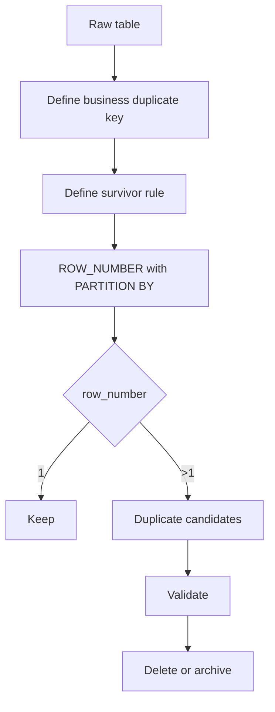
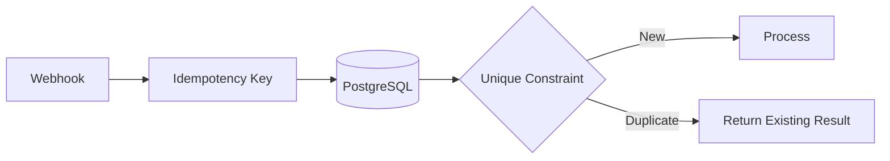

# 09- Deduplication with ROW_NUMBER

## Overview

`ROW_NUMBER()` is one of the most reliable SQL techniques for identifying and removing duplicate rows when the requirement is to keep exactly one representative row from each duplicate group.

The key pattern is:

```sql
ROW_NUMBER() OVER (
    PARTITION BY duplicate_key
    ORDER BY survivor_preference
)
```

Rows with:

```text
row_number = 1
```

are the rows selected to survive.

Rows with:

```text
row_number > 1
```

are duplicates relative to the chosen business key and ordering.

This pattern is useful for:

- Removing duplicate records.
- Keeping the newest record for each entity.
- Keeping the oldest record for each entity.
- Selecting the preferred record from duplicate imports.
- Deduplicating event or integration data.
- Identifying duplicate customer, email, or external-reference records.
- Cleaning staging tables before loading production data.

The important engineering principle is that **deduplication requires two separate decisions**:

1. What makes two rows duplicates?
2. Which row should survive?

`PARTITION BY` answers the first question. The window `ORDER BY` answers the second.

## Why `ROW_NUMBER()` Works for Deduplication

Consider a table containing duplicate customer records:

| id | email | name | created_at |
|---:|---|---|---|
| 101 | alice@example.com | Alice | 2026-01-10 |
| 102 | alice@example.com | Alice Smith | 2026-02-01 |
| 103 | bob@example.com | Bob | 2026-02-03 |
| 104 | alice@example.com | Alice S. | 2026-03-01 |

If `email` is the duplicate key and the newest record should survive:

```sql
ROW_NUMBER() OVER (
    PARTITION BY email
    ORDER BY created_at DESC, id DESC
)
```

produces:

| id | email | created_at | row_number |
|---:|---|---|---:|
| 104 | alice@example.com | 2026-03-01 | 1 |
| 102 | alice@example.com | 2026-02-01 | 2 |
| 101 | alice@example.com | 2026-01-10 | 3 |
| 103 | bob@example.com | 2026-02-03 | 1 |

Therefore:

```sql
row_number = 1
```

identifies the survivor for each email.

## Identify Duplicates Without Deleting

Always separate **identification** from **destructive cleanup**.

Start with a read-only query:

```sql
WITH ranked AS (
    SELECT
        id,
        email,
        name,
        created_at,
        ROW_NUMBER() OVER (
            PARTITION BY email
            ORDER BY created_at DESC, id DESC
        ) AS row_number
    FROM customers
)
SELECT
    id,
    email,
    name,
    created_at
FROM ranked
WHERE row_number > 1
ORDER BY email, row_number;
```

This returns only the rows considered duplicates.

Before deleting anything, validate that:

- The duplicate key is correct.
- The survivor rule is correct.
- The expected number of rows is affected.
- Important relationships will not be broken.
- The cleanup is reversible or backed up when necessary.

## Define the Duplicate Key Correctly

The `PARTITION BY` clause must represent the actual business uniqueness rule.

For example:

```sql
PARTITION BY email
```

means:

> Every row with the same email belongs to one duplicate group.

But perhaps the real uniqueness rule is tenant-specific:

```sql
PARTITION BY tenant_id, email
```

This means:

> The same email may exist in different tenants, but should appear only once within each tenant.

Other examples include:

```sql
PARTITION BY customer_id, external_system
```

or:

```sql
PARTITION BY tenant_id, external_reference
```

Choosing the wrong partition key can cause valid records to be classified as duplicates.

### Business Key vs Physical ID

Do not normally partition by a unique primary key:

```sql
PARTITION BY id
```

Every row already has a different `id`, so every partition contains one row and nothing is deduplicated.

Instead, use the column or combination of columns that defines logical identity.

| Business requirement | Possible duplicate key |
|---|---|
| One email per tenant | `tenant_id, email` |
| One external ID per provider | `provider, external_id` |
| One device event by source ID | `source_system, event_id` |
| One product SKU per tenant | `tenant_id, sku` |
| One account per external reference | `account_id, external_reference` |

## Choosing the Survivor

`ROW_NUMBER()` does not inherently know which duplicate is correct.

The survivor is determined by:

```sql
ORDER BY ...
```

### Keep the Newest

```sql
ROW_NUMBER() OVER (
    PARTITION BY email
    ORDER BY created_at DESC, id DESC
)
```

Use this when the newest record is authoritative.

### Keep the Oldest

```sql
ROW_NUMBER() OVER (
    PARTITION BY email
    ORDER BY created_at ASC, id ASC
)
```

This is common when the first imported or created record should remain canonical.

### Keep the Most Complete Record

Suppose records contain optional profile data.

A practical ordering might be:

```sql
ROW_NUMBER() OVER (
    PARTITION BY email
    ORDER BY
        (phone IS NOT NULL)::int +
        (address IS NOT NULL)::int +
        (date_of_birth IS NOT NULL)::int DESC,
        created_at DESC,
        id DESC
)
```

The exact expression is database-specific, but the principle is important:

> Encode the business survivor rule explicitly instead of assuming the database will choose the desired row.

### Keep a Preferred Status

For example, prefer verified users:

```sql
ROW_NUMBER() OVER (
    PARTITION BY email
    ORDER BY
        CASE WHEN email_verified THEN 0 ELSE 1 END,
        created_at DESC,
        id DESC
)
```

The first row is now the verified record when one exists.

## Deterministic Deduplication

A production deduplication query should normally have a deterministic ordering.

Avoid:

```sql
ROW_NUMBER() OVER (
    PARTITION BY email
    ORDER BY created_at DESC
)
```

when multiple rows can have the same timestamp.

Instead:

```sql
ROW_NUMBER() OVER (
    PARTITION BY email
    ORDER BY created_at DESC, id DESC
)
```

The unique `id` provides a stable tie-breaker.

Without a deterministic tie-breaker, two otherwise identical executions may choose different survivors when multiple rows have equal ordering values.

This is especially important for:

- Repeated cleanup jobs.
- Data migrations.
- Replication pipelines.
- Auditable transformations.
- Automated reconciliation.
- Tests that expect stable results.

## Read-Only Deduplication Pattern

The safest initial workflow is:



The ranking query should first be used to understand the data before any mutation occurs.

## Delete Duplicates in PostgreSQL

For PostgreSQL, a common pattern is:

```sql
WITH ranked AS (
    SELECT
        id,
        ROW_NUMBER() OVER (
            PARTITION BY email
            ORDER BY created_at DESC, id DESC
        ) AS row_number
    FROM customers
)
DELETE FROM customers AS c
USING ranked AS r
WHERE c.id = r.id
  AND r.row_number > 1;
```

This keeps the newest row per email and deletes the remaining rows.

Before executing the delete, run the equivalent selection:

```sql
WITH ranked AS (
    SELECT
        id,
        email,
        created_at,
        ROW_NUMBER() OVER (
            PARTITION BY email
            ORDER BY created_at DESC, id DESC
        ) AS row_number
    FROM customers
)
SELECT *
FROM ranked
WHERE row_number > 1;
```

The selected IDs should be reviewed before performing the destructive operation.

## Safer Transactional Cleanup

For production data, use a transaction when the database and workload allow it:

```sql
BEGIN;

WITH ranked AS (
    SELECT
        id,
        ROW_NUMBER() OVER (
            PARTITION BY email
            ORDER BY created_at DESC, id DESC
        ) AS row_number
    FROM customers
)
DELETE FROM customers AS c
USING ranked AS r
WHERE c.id = r.id
  AND r.row_number > 1;

-- Validate affected rows and application-specific invariants.

COMMIT;
```

If validation fails:

```sql
ROLLBACK;
```

For very large tables, however, one massive transaction can create substantial:

- Lock pressure.
- WAL generation.
- Replication lag.
- Vacuum debt.
- Transaction duration.
- Storage consumption.

Large cleanup operations may need a batched strategy rather than one transaction containing millions of deletes.

## Referential Integrity Considerations

Deduplication becomes more complex when duplicate rows are referenced by other tables.

For example:

```text
customers
   │
   ├── orders
   ├── payments
   └── support_tickets
```

If customer `102` is identified as a duplicate of customer `104`, deleting `102` may fail because other tables reference it.

Do not blindly delete duplicate parent records.

A production cleanup may require:

1. Identify survivor and duplicate IDs.
2. Repoint foreign-key relationships to the survivor.
3. Validate referential integrity.
4. Delete duplicate parents.
5. Add a uniqueness constraint to prevent recurrence.

The correct strategy depends on the domain and foreign-key semantics.

## Repointing Foreign Keys

Suppose:

```text
customers
orders.customer_id → customers.id
```

and customer `102` should be merged into `104`.

A migration might conceptually perform:

```sql
UPDATE orders
SET customer_id = 104
WHERE customer_id = 102;
```

Only after all dependent records have been safely migrated should the duplicate customer be removed.

For many duplicate groups, this should be driven by an explicit survivor mapping rather than ad hoc updates.

## Deduplication in Staging Tables

A common production pattern is to deduplicate data during ingestion.

For example, an integration may repeatedly send:

```text
tenant_id + external_id
```

and the staging table may contain multiple copies.

Use:

```sql
WITH ranked AS (
    SELECT
        *,
        ROW_NUMBER() OVER (
            PARTITION BY tenant_id, external_id
            ORDER BY received_at DESC, id DESC
        ) AS row_number
    FROM integration_events
)
SELECT
    tenant_id,
    external_id,
    payload,
    received_at
FROM ranked
WHERE row_number = 1;
```

This allows the ingestion pipeline to select one authoritative event without immediately mutating the raw staging data.

This pattern is particularly useful for:

- ETL pipelines.
- Kafka consumers.
- Webhook ingestion.
- Batch imports.
- CDC processing.
- External API synchronization.

## Deduplication of Kafka or Event Data

Distributed systems frequently encounter duplicate delivery.

For example:

```text
Kafka event
    ↓
Consumer
    ↓
Database insert
```

A consumer may process the same event more than once because of retries or offset-management behavior.

If events have a stable identity:

```text
tenant_id + event_id
```

the database can deduplicate them:

```sql
WITH ranked AS (
    SELECT
        id,
        tenant_id,
        event_id,
        ROW_NUMBER() OVER (
            PARTITION BY tenant_id, event_id
            ORDER BY received_at ASC, id ASC
        ) AS row_number
    FROM incoming_events
)
SELECT
    id,
    tenant_id,
    event_id
FROM ranked
WHERE row_number = 1;
```

However, `ROW_NUMBER()` is primarily a **data-processing technique**, not a substitute for proper idempotency.

For transactional ingestion, prefer a database uniqueness constraint where possible:

```sql
CREATE UNIQUE INDEX CONCURRENTLY
    uq_incoming_events_tenant_event
ON incoming_events (tenant_id, event_id);
```

Then make the consumer operation idempotent.

## Deduplication vs Idempotency

These concepts are related but different.

| Concept | Purpose |
|---|---|
| Deduplication | Finds or removes already-existing duplicate records |
| Idempotency | Prevents repeated processing from producing additional effects |
| Unique constraint | Enforces uniqueness at the database boundary |
| `ROW_NUMBER()` | Provides flexible row selection among duplicates |

For example, if a webhook is delivered five times, the ideal architecture should prevent five logical payments from being created.

Do not rely on a periodic cleanup query to fix the problem afterward.

A better design is:



`ROW_NUMBER()` remains valuable for cleaning historical duplicates and resolving existing data-quality problems.

## Enforcing Uniqueness After Cleanup

If duplicates are not supposed to exist, deleting them is only half the solution.

After cleanup, enforce the invariant:

```sql
CREATE UNIQUE INDEX CONCURRENTLY
    uq_customers_tenant_email
ON customers (tenant_id, email);
```

This converts a data-quality assumption into a database-enforced invariant.

Without the constraint, the application may recreate duplicates later due to:

- Race conditions.
- Retry behavior.
- Concurrent requests.
- Missing validation.
- Multiple application instances.
- Faulty background workers.

Application-level checks such as:

```sql
SELECT 1
FROM customers
WHERE tenant_id = :tenant_id
  AND email = :email;
```

are not sufficient by themselves under concurrency.

Two requests can both observe no existing row and then both insert.

## Case Sensitivity and Normalization

Duplicate detection depends on how values are normalized.

For example:

```text
Alice@example.com
alice@example.com
```

may or may not represent the same logical email according to the application's business rules.

A query using:

```sql
PARTITION BY email
```

treats values according to the database's comparison semantics.

If the application requires normalized identity, normalize consistently before deduplication.

In PostgreSQL, depending on the desired semantics, options include:

- Storing normalized values.
- Functional indexes.
- `citext`.
- Explicit normalization logic.

For example:

```sql
CREATE UNIQUE INDEX CONCURRENTLY
    uq_customers_normalized_email
ON customers (LOWER(email));
```

The normalization strategy must match the application's actual identity rules.

## `NULL` and Duplicate Semantics

`NULL` requires special attention.

SQL's treatment of `NULL` in uniqueness constraints and equality operations can differ from intuitive business semantics and can also vary by database/version/configuration.

Before deduplicating nullable keys, determine whether:

```text
NULL + NULL
```

should mean:

- The same missing identity.
- Separate unknown identities.
- Invalid data that should be rejected.

Do not blindly treat all `NULL` values as duplicates without understanding the domain.

## Performance Considerations

Window-based deduplication can require the database to process and order a large number of rows.

For:

```sql
ROW_NUMBER() OVER (
    PARTITION BY tenant_id, external_id
    ORDER BY received_at DESC, id DESC
)
```

the database needs to establish the ordering within each duplicate group.

For large tables:

- Restrict the source rows when possible.
- Process recent or affected partitions rather than the entire table.
- Avoid unnecessary columns in intermediate queries.
- Inspect the execution plan.
- Consider staging tables for large migrations.
- Batch destructive operations.
- Monitor replication and WAL impact.

Use:

```sql
EXPLAIN (ANALYZE, BUFFERS)
WITH ranked AS (
    SELECT
        id,
        ROW_NUMBER() OVER (
            PARTITION BY tenant_id, external_id
            ORDER BY received_at DESC, id DESC
        ) AS row_number
    FROM incoming_events
)
SELECT id
FROM ranked
WHERE row_number > 1;
```

to understand actual behavior in PostgreSQL.

## Batch Cleanup for Large Tables

For a very large table, deleting millions of rows in one transaction can be operationally risky.

A safer architecture can be:

```text
Detect duplicate IDs
        ↓
Store candidate IDs
        ↓
Process bounded batches
        ↓
Delete batch
        ↓
Commit
        ↓
Monitor
        ↓
Repeat
```

A dedicated cleanup job can run through Celery or another controlled worker system.

Monitor:

- Delete throughput.
- Transaction duration.
- Database CPU.
- I/O.
- Lock waits.
- WAL volume.
- Replica lag.
- Application latency.

Do not run an unbounded cleanup query against a heavily loaded production database without evaluating its operational impact.

## Archive Before Delete

For high-value or compliance-sensitive data, consider archiving duplicate records before deletion.

A conceptual PostgreSQL workflow is:

```sql
CREATE TABLE customer_duplicates_archive AS
SELECT
    c.*,
    CURRENT_TIMESTAMP AS archived_at
FROM customers AS c
JOIN (
    SELECT
        id,
        ROW_NUMBER() OVER (
            PARTITION BY email
            ORDER BY created_at DESC, id DESC
        ) AS row_number
    FROM customers
) AS ranked
    ON ranked.id = c.id
WHERE ranked.row_number > 1;
```

The exact approach should account for:

- Retention requirements.
- PII handling.
- Storage costs.
- Audit requirements.
- Access controls.
- Backup policies.

Do not create an archive containing sensitive data without applying the same security and retention standards as the production dataset.

## Production Workflow

A robust deduplication migration generally follows this sequence:

### Inspect

Determine:

- Candidate duplicate key.
- Number of duplicate groups.
- Number of affected rows.
- Distribution by tenant or business domain.
- Survivor criteria.

Example:

```sql
SELECT
    tenant_id,
    email,
    COUNT(*) AS duplicate_count
FROM customers
GROUP BY tenant_id, email
HAVING COUNT(*) > 1
ORDER BY duplicate_count DESC;
```

### Rank

Create an explicit survivor mapping:

```sql
WITH ranked AS (
    SELECT
        id,
        tenant_id,
        email,
        ROW_NUMBER() OVER (
            PARTITION BY tenant_id, email
            ORDER BY created_at DESC, id DESC
        ) AS row_number
    FROM customers
)
SELECT
    id,
    tenant_id,
    email,
    row_number
FROM ranked
ORDER BY tenant_id, email, row_number;
```

### Validate

Check:

- Expected survivor counts.
- Foreign-key dependencies.
- Business-critical records.
- Tie behavior.
- `NULL` behavior.
- Tenant isolation.
- Data retention requirements.

### Migrate Dependencies

Repoint dependent records where required.

### Delete or Archive

Remove only verified duplicate rows.

### Enforce

Add the appropriate unique constraint or index.

### Monitor

Watch database and application behavior after deployment.

## Common Mistakes

| Mistake | Why it is dangerous | Better approach |
|---|---|---|
| `PARTITION BY id` | Every row becomes its own group | Use the logical business key |
| No explicit survivor rule | Arbitrary record may survive | Define a deterministic `ORDER BY` |
| No unique tie-breaker | Equal timestamps can produce unstable results | Add a unique column such as `id` |
| Deleting before inspecting | Data can be irreversibly lost | Run the ranking query first |
| Ignoring foreign keys | Deletes can fail or orphan data | Repoint dependencies first |
| Treating deduplication as idempotency | New duplicates can continue appearing | Enforce uniqueness and idempotent writes |
| Ignoring tenant boundaries | Valid records across tenants may be merged | Include tenant identity in the business key |
| Ignoring normalization | Logically equivalent values may remain separate | Normalize according to business rules |
| Deleting millions of rows at once | Long transactions and replication impact | Batch large cleanups |
| Assuming application validation guarantees uniqueness | Concurrent requests can race | Use database constraints |
| Using `ROW_NUMBER()` as the permanent integrity mechanism | It detects duplicates after they exist | Prevent duplicates with constraints |
| Ignoring `NULL` semantics | Missing values may be incorrectly grouped | Define explicit business semantics |

## Interview Traps

### "Delete Duplicate Rows and Keep One"

The important part is not the `DELETE`.

First define:

```sql
ROW_NUMBER() OVER (
    PARTITION BY business_key
    ORDER BY survivor_preference
)
```

Then delete rows where:

```sql
row_number > 1
```

### "Keep the Latest Record"

Use:

```sql
ORDER BY created_at DESC, id DESC
```

not only:

```sql
ORDER BY created_at DESC
```

when timestamps are not guaranteed to be unique.

### "Duplicates Are Based on Multiple Columns"

Use:

```sql
PARTITION BY column_a, column_b, column_c
```

The partition represents the complete logical identity.

### "Why Not Use `DISTINCT`?"

`DISTINCT` can remove identical projected rows, but it cannot express:

> Keep the newest row for each business key.

For example:

```sql
SELECT DISTINCT email
FROM customers;
```

returns unique emails, but it does not select a complete customer record according to a survivor rule.

`ROW_NUMBER()` lets you retain the full row while explicitly selecting which row survives.

## Key Takeaways

- **Use `PARTITION BY` to define the logical duplicate group and `ORDER BY` to define which record survives.**
- **Make survivor selection deterministic with an explicit business rule and a stable unique tie-breaker.**
- **Treat `ROW_NUMBER()` as a cleanup and selection mechanism, not as a replacement for database-enforced uniqueness or idempotent writes.**
- **For production cleanup, inspect first, validate dependencies, batch large mutations, and account for transactions, replication, locks, and audit requirements.**
- **After historical duplicates are removed, enforce the intended uniqueness invariant with an appropriate database constraint or unique index.**