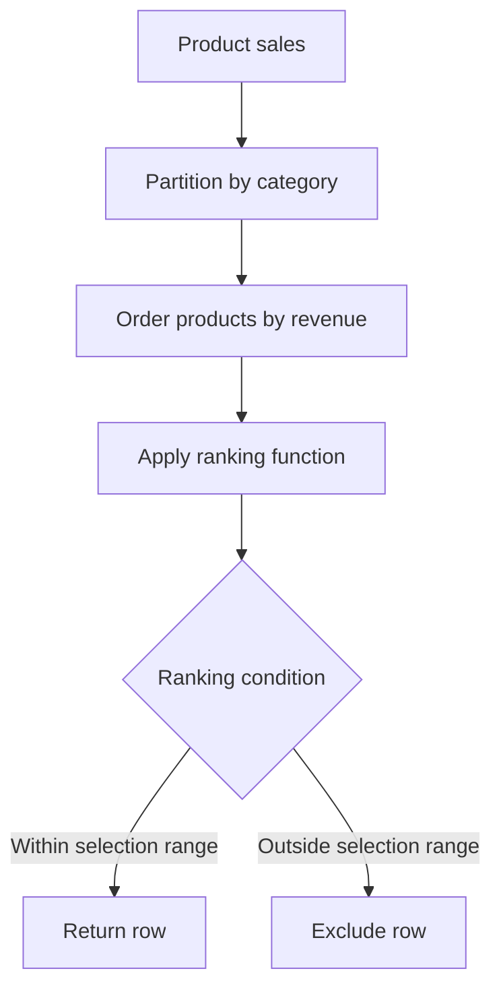

# 10- Ranking Selection Rules

## Overview

Ranking window functions are often introduced as a way to assign positions to rows, but their real value in backend systems is **controlled row selection**.

Functions such as `ROW_NUMBER()`, `RANK()`, and `DENSE_RANK()` can all rank rows within an ordered set, but they answer different questions when ties exist. Choosing the correct function is therefore a business-rule decision, not merely a syntax decision.

A common pattern is:

```sql
SELECT *
FROM (
    SELECT
        ...,
        ROW_NUMBER() OVER (
            PARTITION BY group_key
            ORDER BY selection_criteria
        ) AS row_number
    FROM source_table
) ranked
WHERE row_number <= 3;
```

The critical design questions are:

- What defines the group?
- What determines the ranking?
- Should ties share the same rank?
- Should a tie consume one position or multiple positions?
- Should the query return exactly `N` rows or potentially more than `N` rows?

These decisions determine whether `ROW_NUMBER()`, `RANK()`, or `DENSE_RANK()` is appropriate.

## Ranking as a Selection Mechanism

Suppose an API needs to return the top products for each category.

The business requirement might be:

> Return the three highest-revenue products per category.

That sounds simple, but ties create ambiguity.

Consider:

| category | product | revenue |
|---|---|---:|
| Books | A | 1000 |
| Books | B | 900 |
| Books | C | 900 |
| Books | D | 800 |

There are several possible interpretations of "top 3":

- Exactly three products.
- The top three positions, where tied products share a position.
- The top three distinct revenue levels.

Those correspond to different ranking functions.

| Function | Ties share rank? | Gaps after ties? | Typical selection behavior |
|---|---|---|---|
| `ROW_NUMBER()` | No | No | Exactly `N` rows per partition |
| `RANK()` | Yes | Yes | All rows within the first `N` ranking positions |
| `DENSE_RANK()` | Yes | No | All rows within the first `N` distinct ranking levels |

## The Core Selection Rule

The ranking function should be selected based on the **business meaning of `N`**.

### Exact Number of Rows

Use `ROW_NUMBER()` when the requirement is:

> Select exactly `N` rows from each group.

```sql
ROW_NUMBER() OVER (
    PARTITION BY category_id
    ORDER BY revenue DESC, product_id
)
```

Then:

```sql
WHERE row_number <= 3
```

returns at most three rows per category.

A unique tie-breaker is important because the database must still choose an ordering among products with equal revenue.

### Ranking Positions

Use `RANK()` when the requirement is:

> Select every row whose competition ranking is within the first `N` positions.

Example:

| product | revenue | rank |
|---|---:|---:|
| A | 1000 | 1 |
| B | 900 | 2 |
| C | 900 | 2 |
| D | 800 | 4 |

Selecting:

```sql
WHERE rank <= 3
```

returns A, B, and C.

The tie at rank 2 causes rank 3 to be skipped.

### Distinct Ranking Levels

Use `DENSE_RANK()` when the requirement is:

> Select every row belonging to the first `N` distinct ranking values.

Example:

| product | revenue | dense_rank |
|---|---:|---:|
| A | 1000 | 1 |
| B | 900 | 2 |
| C | 900 | 2 |
| D | 800 | 3 |

Selecting:

```sql
WHERE dense_rank <= 3
```

returns all four rows.

This is useful when each distinct value represents a meaningful tier.

## Tie Behavior

Tie handling is the most important distinction.

For:

```text
1000
900
900
800
```

the functions produce:

| value | `ROW_NUMBER()` | `RANK()` | `DENSE_RANK()` |
|---:|---:|---:|---:|
| 1000 | 1 | 1 | 1 |
| 900 | 2 | 2 | 2 |
| 900 | 3 | 2 | 2 |
| 800 | 4 | 4 | 3 |

The difference becomes important when filtering.

For `N = 3`:

| Function | Condition | Rows returned |
|---|---|---|
| `ROW_NUMBER()` | `<= 3` | 3 |
| `RANK()` | `<= 3` | 3 |
| `DENSE_RANK()` | `<= 3` | 4 |

The number of returned rows is therefore **not necessarily equal to `N`**.

## Deterministic vs Tie-Preserving Ranking

There is an important subtlety when ordering ranking functions.

Consider:

```sql
RANK() OVER (
    PARTITION BY category_id
    ORDER BY revenue DESC
)
```

Products with the same revenue receive the same rank.

If you add a unique column:

```sql
RANK() OVER (
    PARTITION BY category_id
    ORDER BY revenue DESC, product_id
)
```

the ordering becomes unique, so ties disappear.

The result changes from:

```text
1000 → 1
900  → 2
900  → 2
800  → 4
```

to:

```text
1000 → 1
900  → 2
900  → 3
800  → 4
```

Therefore:

> **Do not add a tie-breaker to `RANK()` or `DENSE_RANK()` if preserving ties is part of the requirement.**

A unique tie-breaker is essential for `ROW_NUMBER()`, but can fundamentally change the semantics of `RANK()` and `DENSE_RANK()`.

## Ranking Without Partitioning

Without `PARTITION BY`, the entire result set is treated as one ranking group.

```sql
SELECT
    product_id,
    revenue,
    ROW_NUMBER() OVER (
        ORDER BY revenue DESC, product_id
    ) AS row_number
FROM products;
```

This produces one global ranking.

Use this when the requirement is:

> Find the top products across the entire system.

Do not use it when the requirement is:

> Find the top products for each category.

For the latter:

```sql
ROW_NUMBER() OVER (
    PARTITION BY category_id
    ORDER BY revenue DESC, product_id
)
```

is required.

## Ranking Within Each Group

The combination of `PARTITION BY` and `ORDER BY` defines the selection boundary.

```sql
SELECT
    category_id,
    product_id,
    revenue,
    ROW_NUMBER() OVER (
        PARTITION BY category_id
        ORDER BY revenue DESC, product_id
    ) AS row_number
FROM product_sales;
```

Conceptually:



The partition is reset for every category.

## Filtering Ranked Rows

Window functions are evaluated after the logical `WHERE` filtering stage, so you generally cannot filter their result directly in the same query block's `WHERE` clause.

This is invalid:

```sql
SELECT
    product_id,
    ROW_NUMBER() OVER (
        PARTITION BY category_id
        ORDER BY revenue DESC
    ) AS row_number
FROM product_sales
WHERE row_number <= 3;
```

Instead, use a derived table:

```sql
SELECT
    category_id,
    product_id,
    revenue
FROM (
    SELECT
        category_id,
        product_id,
        revenue,
        ROW_NUMBER() OVER (
            PARTITION BY category_id
            ORDER BY revenue DESC, product_id
        ) AS row_number
    FROM product_sales
) ranked
WHERE row_number <= 3;
```

Or a CTE:

```sql
WITH ranked AS (
    SELECT
        category_id,
        product_id,
        revenue,
        ROW_NUMBER() OVER (
            PARTITION BY category_id
            ORDER BY revenue DESC, product_id
        ) AS row_number
    FROM product_sales
)
SELECT
    category_id,
    product_id,
    revenue
FROM ranked
WHERE row_number <= 3;
```

## Top N per Group Decision Matrix

| Requirement | Function | Tie behavior | Result size |
|---|---|---|---|
| Exactly three products per category | `ROW_NUMBER()` | Break ties | At most 3 |
| Top three competition positions | `RANK()` | Preserve ties | At least up to 3 |
| Top three distinct revenue tiers | `DENSE_RANK()` | Preserve ties | At least up to 3 |
| One deterministic winner | `ROW_NUMBER()` | Break ties | Exactly 1 per group |
| All products tied for first | `RANK()` or `DENSE_RANK()` | Preserve ties | Potentially many |
| First three distinct scores | `DENSE_RANK()` | Preserve ties | Potentially many |

## Selecting One Row per Group

A very common production use case is:

> Select the latest record for each customer.

Use:

```sql
WITH ranked AS (
    SELECT
        customer_id,
        id,
        status,
        created_at,
        ROW_NUMBER() OVER (
            PARTITION BY customer_id
            ORDER BY created_at DESC, id DESC
        ) AS row_number
    FROM customer_status_history
)
SELECT
    customer_id,
    id,
    status,
    created_at
FROM ranked
WHERE row_number = 1;
```

The `id` tie-breaker makes selection deterministic when two records have the same `created_at`.

This pattern is useful for:

- Latest state selection.
- Latest configuration.
- Most recent synchronization record.
- Current subscription state.
- Latest external-system response.
- Deduplication.

## Selecting All Winners

If the requirement is:

> Return everyone tied for the highest score.

Use:

```sql
WITH ranked AS (
    SELECT
        department_id,
        employee_id,
        performance_score,
        RANK() OVER (
            PARTITION BY department_id
            ORDER BY performance_score DESC
        ) AS rank
    FROM employee_performance
)
SELECT
    department_id,
    employee_id,
    performance_score
FROM ranked
WHERE rank = 1;
```

This can return multiple employees per department.

`ROW_NUMBER()` would incorrectly discard all but one tied employee.

## `RANK()` vs `DENSE_RANK()` for Top N

Consider:

```text
100
90
90
80
70
```

For `N = 3`:

### `RANK()`

```text
100 → 1
90  → 2
90  → 2
80  → 4
70  → 5
```

```sql
WHERE rank <= 3
```

returns:

```text
100
90
90
```

The score `80` is excluded because it has rank 4.

### `DENSE_RANK()`

```text
100 → 1
90  → 2
90  → 2
80  → 3
70  → 4
```

```sql
WHERE dense_rank <= 3
```

returns:

```text
100
90
90
80
```

This distinction matters when "top N" means either **ranking positions** or **distinct value levels**.

## Business Examples

### Leaderboards

For a competition leaderboard:

```sql
RANK() OVER (
    ORDER BY score DESC
)
```

is often appropriate because players with equal scores should occupy the same position.

### Latest Record

For latest state per entity:

```sql
ROW_NUMBER() OVER (
    PARTITION BY entity_id
    ORDER BY updated_at DESC, id DESC
)
```

is usually appropriate because exactly one current row is required.

### Pricing Tiers

For selecting products in the top three distinct price levels:

```sql
DENSE_RANK() OVER (
    PARTITION BY category_id
    ORDER BY price DESC
)
```

can represent the business requirement more accurately.

### Top Sellers

For exactly five sellers per region:

```sql
ROW_NUMBER() OVER (
    PARTITION BY region_id
    ORDER BY revenue DESC, seller_id
)
```

ensures the API receives a deterministic maximum of five sellers per region.

## Ranking and API Pagination

Ranking functions are useful for generating bounded result sets, but they are not automatically a replacement for pagination.

For an API returning top products per category:

```sql
WITH ranked AS (
    SELECT
        category_id,
        product_id,
        revenue,
        ROW_NUMBER() OVER (
            PARTITION BY category_id
            ORDER BY revenue DESC, product_id
        ) AS position
    FROM product_sales
)
SELECT
    category_id,
    product_id,
    revenue,
    position
FROM ranked
WHERE position <= 10
ORDER BY category_id, position;
```

This is suitable for a bounded "top 10 per category" response.

For large, continuously changing datasets, conventional pagination and keyset pagination may be more appropriate for general browsing APIs.

## Ordering Stability

A ranking query should have an ordering that matches the business requirement.

For deterministic `ROW_NUMBER()`:

```sql
ORDER BY revenue DESC, product_id ASC
```

is preferable to:

```sql
ORDER BY revenue DESC
```

when `revenue` is not unique.

The unique key should normally be:

- Stable.
- Non-null.
- Unique.
- Appropriate as a final ordering criterion.

Do not use a random ordering to break ties in production selection logic unless nondeterminism is explicitly required.

## Performance Considerations

Ranking can be computationally expensive because the database may need to partition and order a substantial result set.

For example:

```sql
ROW_NUMBER() OVER (
    PARTITION BY tenant_id
    ORDER BY created_at DESC, id DESC
)
```

may require substantial sorting when processing millions of rows.

Use:

```sql
EXPLAIN (ANALYZE, BUFFERS)
SELECT ...
```

in PostgreSQL to inspect the actual execution plan.

Performance considerations include:

- Reduce the input dataset before applying the window function.
- Select only required columns.
- Avoid ranking an unnecessarily large historical dataset.
- Use appropriate indexes where they help the query plan.
- Consider pre-aggregated or materialized data for expensive recurring leaderboards.
- Monitor memory usage and temporary-file activity for large sorts.

Indexes can help with filtering and data access, but they do not guarantee that a window query avoids all sorting or materialization work. Always validate with the actual execution plan and production-like data.

## Filtering Before Ranking

Filtering rows before the window function changes the ranking population.

Consider:

```sql
WITH ranked AS (
    SELECT
        product_id,
        category_id,
        revenue,
        ROW_NUMBER() OVER (
            PARTITION BY category_id
            ORDER BY revenue DESC, product_id
        ) AS row_number
    FROM product_sales
    WHERE sale_date >= CURRENT_DATE - INTERVAL '30 days'
)
SELECT *
FROM ranked
WHERE row_number <= 3;
```

This means:

> Top three products per category among the last 30 days.

It does **not** mean:

> Find the all-time top three products and then show only products active in the last 30 days.

The filtering stage defines which rows participate in the ranking.

## Security and Multi-Tenant Systems

In multi-tenant applications, tenant boundaries must be included in the ranking partition whenever rankings are tenant-scoped.

Correct:

```sql
ROW_NUMBER() OVER (
    PARTITION BY tenant_id, category_id
    ORDER BY revenue DESC, product_id
)
```

Potentially dangerous:

```sql
ROW_NUMBER() OVER (
    PARTITION BY category_id
    ORDER BY revenue DESC, product_id
)
```

If the query is intended to return tenant-specific rankings, omitting `tenant_id` can mix data across tenants.

Tenant filtering should also be applied at the query level:

```sql
WHERE tenant_id = :tenant_id
```

and should be enforced consistently with the application's authorization model.

Never rely on ranking logic to provide tenant isolation.

## Production Considerations

For production ranking queries:

- Define tie semantics explicitly with product or business stakeholders.
- Use `ROW_NUMBER()` when exactly one row must occupy each position.
- Preserve ties with `RANK()` or `DENSE_RANK()` when business semantics require it.
- Add stable tie-breakers to `ROW_NUMBER()`.
- Do not add unique tie-breakers to `RANK()` or `DENSE_RANK()` when ties must remain tied.
- Validate result cardinality with realistic data.
- Consider the effect of `NULL` values in ordering columns.
- Ensure tenant or authorization boundaries are applied before ranking.
- Use `EXPLAIN (ANALYZE, BUFFERS)` for expensive queries.
- Avoid ranking unnecessarily large datasets.
- For frequently requested leaderboards, consider precomputation or materialization.

## Common Mistakes

| Mistake | Why it happens | Better approach |
|---|---|---|
| Using `ROW_NUMBER()` for tied winners | Assumes ranking means exactly one winner | Use `RANK()` or `DENSE_RANK()` |
| Using `RANK()` for exactly N rows | Assumes rank equals row count | Use `ROW_NUMBER()` |
| Confusing `RANK()` with `DENSE_RANK()` | Ignores gaps after ties | Choose based on ranking-position semantics |
| Adding `id` to `RANK()` ordering | Attempts to make results deterministic | Only do this if ties should actually be broken |
| Filtering window aliases in `WHERE` | Window functions are evaluated later | Use a CTE or derived table |
| Forgetting `PARTITION BY` | Produces a global ranking | Partition by the required business group |
| Missing tenant in `PARTITION BY` | Can mix tenant rankings | Include tenant scope where required |
| Filtering after ranking when pre-filtering was intended | Changes the ranking population | Place filters at the correct query stage |
| Assuming `N` means N rows | "Top N" can mean positions or value tiers | Define the business meaning explicitly |
| Ignoring ties in API contracts | Response cardinality becomes unpredictable | Document whether ties can expand results |

## Interview Traps

### "Top 3 Employees Per Department"

If exactly three employees are required:

```sql
ROW_NUMBER() OVER (
    PARTITION BY department_id
    ORDER BY salary DESC, employee_id
)
```

If all employees in the top three salary positions should be returned:

```sql
RANK() OVER (
    PARTITION BY department_id
    ORDER BY salary DESC
)
```

If the requirement is the top three distinct salary levels:

```sql
DENSE_RANK() OVER (
    PARTITION BY department_id
    ORDER BY salary DESC
)
```

### "Why Does `RANK()` Skip a Number?"

Because tied rows occupy the same rank position.

For:

```text
100
90
90
80
```

the ranks are:

```text
1
2
2
4
```

The two rows at rank 2 consume two positions in the ordered population.

### "Why Does `DENSE_RANK()` Not Skip?"

Because it counts distinct ordering values rather than physical positions.

```text
100 → 1
90  → 2
90  → 2
80  → 3
```

### "Which Function Guarantees Exactly N Rows?"

`ROW_NUMBER()` can guarantee at most `N` rows per partition when filtering with:

```sql
WHERE row_number <= N
```

If every partition contains at least `N` rows, it returns exactly `N` rows per partition.

`RANK()` and `DENSE_RANK()` can return more than `N` rows because of ties.

### "Does `ORDER BY id` Make `RANK()` Deterministic?"

It makes the ordering unique, but it also breaks ties.

Therefore, the answer depends on whether preserving ties is part of the requirement.

## Key Takeaways

- **Choose the ranking function from the business selection rule: `ROW_NUMBER()` for exact row counts, `RANK()` for competition positions, and `DENSE_RANK()` for distinct ranking levels.**
- **`RANK()` preserves ties and introduces gaps; `DENSE_RANK()` preserves ties without gaps.**
- **A unique tie-breaker is essential for deterministic `ROW_NUMBER()` selection but can destroy tie semantics when added to `RANK()` or `DENSE_RANK()`.**
- **`PARTITION BY` defines the ranking scope, so tenant and business-group boundaries must be included whenever rankings are scoped.**
- **Treat "Top N" as an ambiguous business requirement until you establish whether N means rows, ranking positions, or distinct value levels.**