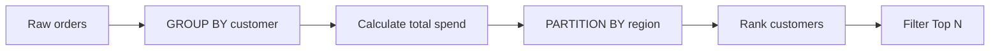
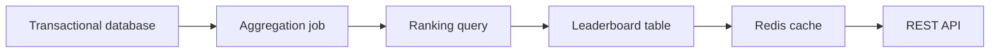

# 11- Practical Ranking Patterns

## Overview

Ranking window functions become most useful when they are treated as **row-selection primitives** rather than merely reporting functions. In backend systems, they solve recurring problems such as selecting the latest record per entity, finding top performers per group, identifying winners, detecting duplicates, and returning bounded leaderboards.

The three core ranking functions are:

| Function | Tie behavior | Gaps | Best suited for |
|---|---|---|---|
| `ROW_NUMBER()` | Breaks ties | No | Exactly one row or exactly N rows |
| `RANK()` | Preserves ties | Yes | Competition-style ranking |
| `DENSE_RANK()` | Preserves ties | No | Distinct ranking levels |

A ranking query typically has four logical components:

```sql
SELECT ...
FROM source
WHERE input_filter
```

then:

```sql
RANK_FUNCTION() OVER (
    PARTITION BY grouping_columns
    ORDER BY ranking_columns
)
```

and finally an outer query filters the generated rank.

The important engineering question is not "Which ranking function do I know?" but:

> **What should happen when two rows have the same ranking value?**

## Core Ranking Pattern

A reusable pattern for selecting ranked rows is:

```sql
WITH ranked AS (
    SELECT
        group_id,
        entity_id,
        metric,
        ROW_NUMBER() OVER (
            PARTITION BY group_id
            ORDER BY metric DESC, entity_id
        ) AS position
    FROM entities
)
SELECT
    group_id,
    entity_id,
    metric,
    position
FROM ranked
WHERE position <= 3;
```

The query performs three distinct operations:

1. Restricts the input dataset.
2. Creates an independent ranking for every partition.
3. Filters the generated ranking in an outer query.

This separation is important because the window function operates on the rows available to its query block.

## Latest Row per Entity

One of the most common production patterns is selecting the latest record for every entity.

For example, an order may have multiple status-history records:

```text
order_id | status      | created_at
---------+-------------+-------------------
101      | pending     | 2026-08-01 10:00
101      | processing  | 2026-08-01 10:05
101      | shipped     | 2026-08-01 10:30
102      | pending     | 2026-08-01 11:00
102      | processing  | 2026-08-01 11:10
```

Use `ROW_NUMBER()`:

```sql
WITH ranked AS (
    SELECT
        order_id,
        status,
        created_at,
        ROW_NUMBER() OVER (
            PARTITION BY order_id
            ORDER BY created_at DESC, id DESC
        ) AS position
    FROM order_status_history
)
SELECT
    order_id,
    status,
    created_at
FROM ranked
WHERE position = 1;
```

The `id` column acts as a deterministic tie-breaker when multiple records have the same timestamp.

### Why `ROW_NUMBER()` Is Appropriate

The requirement is:

> Return exactly one current record per order.

Ties in `created_at` should not result in multiple rows. Therefore, the query explicitly defines which row wins.

This pattern is useful for:

- Latest user profile state.
- Latest payment attempt.
- Current subscription state.
- Latest synchronization result.
- Most recent configuration.
- Latest event per aggregate.

## Top N per Group

Suppose a marketplace needs the top five products by revenue within every category.

```sql
WITH ranked AS (
    SELECT
        category_id,
        product_id,
        revenue,
        ROW_NUMBER() OVER (
            PARTITION BY category_id
            ORDER BY revenue DESC, product_id
        ) AS position
    FROM product_sales
)
SELECT
    category_id,
    product_id,
    revenue,
    position
FROM ranked
WHERE position <= 5
ORDER BY category_id, position;
```

This returns at most five products per category.

The final `ORDER BY` is separate from the window `ORDER BY`.

```sql
ROW_NUMBER() OVER (
    PARTITION BY category_id
    ORDER BY revenue DESC, product_id
)
```

defines **how rows are ranked**.

```sql
ORDER BY category_id, position
```

defines **how the final result is displayed**.

Do not assume that the window ordering automatically guarantees the final result ordering.

## Top N with Ties

If the requirement changes to:

> Return every product that belongs to the top three revenue positions per category.

`RANK()` may be appropriate:

```sql
WITH ranked AS (
    SELECT
        category_id,
        product_id,
        revenue,
        RANK() OVER (
            PARTITION BY category_id
            ORDER BY revenue DESC
        ) AS position
    FROM product_sales
)
SELECT
    category_id,
    product_id,
    revenue,
    position
FROM ranked
WHERE position <= 3;
```

Consider:

| product | revenue | rank |
|---|---:|---:|
| A | 1000 | 1 |
| B | 900 | 2 |
| C | 900 | 2 |
| D | 800 | 4 |

Both B and C are retained.

The result can therefore contain more than three rows per category.

## Top N Distinct Values

`DENSE_RANK()` is useful when the requirement is based on distinct ranking values.

```sql
WITH ranked AS (
    SELECT
        category_id,
        product_id,
        revenue,
        DENSE_RANK() OVER (
            PARTITION BY category_id
            ORDER BY revenue DESC
        ) AS revenue_level
    FROM product_sales
)
SELECT
    category_id,
    product_id,
    revenue,
    revenue_level
FROM ranked
WHERE revenue_level <= 3;
```

For:

```text
1000
900
900
800
700
```

the dense ranks are:

```text
1000 → 1
900  → 2
900  → 2
800  → 3
700  → 4
```

Therefore, the query returns all rows belonging to the first three distinct revenue levels.

## Leaderboards

Leaderboards normally need tie-aware ranking.

```sql
SELECT
    player_id,
    score,
    RANK() OVER (
        ORDER BY score DESC
    ) AS leaderboard_position
FROM player_scores;
```

For:

| player | score | position |
|---|---:|---:|
| A | 1000 | 1 |
| B | 950 | 2 |
| C | 950 | 2 |
| D | 900 | 4 |

This matches competition-style ranking.

If the product requires every player to have a unique position, use:

```sql
ROW_NUMBER() OVER (
    ORDER BY score DESC, player_id
)
```

The difference should be reflected in the API contract.

For example:

```json
{
  "player_id": 42,
  "score": 950,
  "rank": 2
}
```

does not imply whether another player may also have rank `2`. That behavior should be intentionally defined.

## Winner Selection

A common backend requirement is:

> Select the highest-scoring candidate for each group.

Use `ROW_NUMBER()` when exactly one winner is required:

```sql
WITH ranked AS (
    SELECT
        group_id,
        candidate_id,
        score,
        ROW_NUMBER() OVER (
            PARTITION BY group_id
            ORDER BY score DESC, candidate_id
        ) AS position
    FROM candidates
)
SELECT
    group_id,
    candidate_id,
    score
FROM ranked
WHERE position = 1;
```

The final `candidate_id` ordering makes the selection deterministic.

If all tied winners must be returned:

```sql
WITH ranked AS (
    SELECT
        group_id,
        candidate_id,
        score,
        RANK() OVER (
            PARTITION BY group_id
            ORDER BY score DESC
        ) AS position
    FROM candidates
)
SELECT
    group_id,
    candidate_id,
    score
FROM ranked
WHERE position = 1;
```

These queries implement different business rules.

## Deduplication

Ranking functions can identify duplicate records without requiring procedural application logic.

Suppose an ingestion pipeline accidentally stores multiple records for the same external event:

```text
external_event_id | received_at
------------------+-------------------
evt-100           | 10:00
evt-100           | 10:02
evt-100           | 10:03
evt-101           | 10:05
```

To keep the latest copy:

```sql
WITH ranked AS (
    SELECT
        id,
        external_event_id,
        received_at,
        ROW_NUMBER() OVER (
            PARTITION BY external_event_id
            ORDER BY received_at DESC, id DESC
        ) AS position
    FROM inbound_events
)
SELECT
    id,
    external_event_id,
    received_at
FROM ranked
WHERE position = 1;
```

For a cleanup operation, the same ranking can identify rows to remove.

```sql
WITH ranked AS (
    SELECT
        id,
        ROW_NUMBER() OVER (
            PARTITION BY external_event_id
            ORDER BY received_at DESC, id DESC
        ) AS position
    FROM inbound_events
)
DELETE FROM inbound_events AS e
USING ranked AS r
WHERE e.id = r.id
  AND r.position > 1;
```

Before performing destructive cleanup, validate the candidate set with a `SELECT`.

In production, deduplication should ideally also be prevented through an appropriate unique constraint or idempotency design.

## Conditional Ranking

Sometimes only rows satisfying a business condition should participate in ranking.

For example:

> Find the top three active products per category.

Filter before ranking:

```sql
WITH ranked AS (
    SELECT
        category_id,
        product_id,
        revenue,
        ROW_NUMBER() OVER (
            PARTITION BY category_id
            ORDER BY revenue DESC, product_id
        ) AS position
    FROM products
    WHERE is_active = TRUE
)
SELECT
    category_id,
    product_id,
    revenue
FROM ranked
WHERE position <= 3;
```

This ranks only active products.

That differs from ranking all products and filtering inactive rows afterward.

The distinction is critical:

```text
Filter → Rank → Select
```

is not equivalent to:

```text
Rank → Filter → Select
```

when the filter changes which rows should compete.

## Conditional Ranking with `CASE`

Ranking can also incorporate conditional business logic.

For example, a promotion might prioritize preferred sellers:

```sql
ROW_NUMBER() OVER (
    PARTITION BY category_id
    ORDER BY
        CASE WHEN seller_tier = 'preferred' THEN 0 ELSE 1 END,
        revenue DESC,
        product_id
)
```

This means:

1. Preferred sellers are ranked first.
2. Revenue determines ordering within each priority.
3. Product ID provides deterministic ordering.

This is useful when ranking is based on a composite business rule.

However, complex business rules should remain understandable. If the ordering expression becomes difficult to review or test, consider computing a business-specific score upstream.

## Ranking with Multiple Criteria

Production ranking rarely depends on one column.

For example:

```sql
ROW_NUMBER() OVER (
    PARTITION BY region_id
    ORDER BY
        revenue DESC,
        customer_count DESC,
        seller_id ASC
)
```

The ordering is lexicographic:

1. Higher revenue wins.
2. If revenue ties, higher customer count wins.
3. If both tie, lower seller ID wins.

This is preferable to implementing ranking logic in application code because the database can perform selection close to the data.

## Ranking by Aggregated Metrics

Ranking is frequently combined with aggregation.

Suppose `orders` contains individual orders and the requirement is:

> Find the top three customers by total spending in each region.

First aggregate:

```sql
WITH customer_totals AS (
    SELECT
        region_id,
        customer_id,
        SUM(amount) AS total_spend
    FROM orders
    GROUP BY
        region_id,
        customer_id
),
ranked AS (
    SELECT
        region_id,
        customer_id,
        total_spend,
        ROW_NUMBER() OVER (
            PARTITION BY region_id
            ORDER BY total_spend DESC, customer_id
        ) AS position
    FROM customer_totals
)
SELECT
    region_id,
    customer_id,
    total_spend,
    position
FROM ranked
WHERE position <= 3;
```

The important data flow is:



Ranking the raw order rows would produce a completely different result.

## Ranking Within Time Windows

A common analytics pattern is ranking entities independently for each period.

For example:

> Find the top three products per month.

```sql
WITH monthly_sales AS (
    SELECT
        DATE_TRUNC('month', sold_at) AS month,
        product_id,
        SUM(amount) AS revenue
    FROM sales
    GROUP BY
        DATE_TRUNC('month', sold_at),
        product_id
),
ranked AS (
    SELECT
        month,
        product_id,
        revenue,
        ROW_NUMBER() OVER (
            PARTITION BY month
            ORDER BY revenue DESC, product_id
        ) AS position
    FROM monthly_sales
)
SELECT
    month,
    product_id,
    revenue,
    position
FROM ranked
WHERE position <= 3
ORDER BY month, position;
```

Here the monthly aggregation creates the ranking population.

## Finding the First and Last Record

Ranking can replace correlated subqueries for many "first/last per group" problems.

Latest:

```sql
ROW_NUMBER() OVER (
    PARTITION BY customer_id
    ORDER BY created_at DESC, id DESC
)
```

Earliest:

```sql
ROW_NUMBER() OVER (
    PARTITION BY customer_id
    ORDER BY created_at ASC, id ASC
)
```

This is useful for:

- First purchase.
- Latest login.
- First support ticket.
- Latest payment.
- Initial configuration.
- Most recent event.

The tie-breaker should use a stable unique column where deterministic selection is required.

## Ranking Changes Under Filtering

Consider:

```sql
WITH ranked AS (
    SELECT
        employee_id,
        department_id,
        salary,
        RANK() OVER (
            PARTITION BY department_id
            ORDER BY salary DESC
        ) AS position
    FROM employees
)
SELECT *
FROM ranked
WHERE salary > 50000
  AND position <= 3;
```

This does **not** calculate the top three employees among employees earning more than `50000`.

The ranking happens before the outer query's salary filter.

If the business rule is:

> Top three employees among those earning more than 50000.

the filter belongs inside the ranking query:

```sql
WITH ranked AS (
    SELECT
        employee_id,
        department_id,
        salary,
        RANK() OVER (
            PARTITION BY department_id
            ORDER BY salary DESC
        ) AS position
    FROM employees
    WHERE salary > 50000
)
SELECT *
FROM ranked
WHERE position <= 3;
```

This is a frequent interview and production bug.

## Combining Ranking Functions

Sometimes multiple rankings answer different questions in the same query.

```sql
SELECT
    product_id,
    category_id,
    revenue,
    ROW_NUMBER() OVER (
        PARTITION BY category_id
        ORDER BY revenue DESC, product_id
    ) AS row_position,
    RANK() OVER (
        PARTITION BY category_id
        ORDER BY revenue DESC
    ) AS competition_rank,
    DENSE_RANK() OVER (
        PARTITION BY category_id
        ORDER BY revenue DESC
    ) AS revenue_level
FROM product_sales;
```

This can expose all three interpretations simultaneously:

| product | revenue | row position | competition rank | revenue level |
|---|---:|---:|---:|---:|
| A | 1000 | 1 | 1 | 1 |
| B | 900 | 2 | 2 | 2 |
| C | 900 | 3 | 2 | 2 |
| D | 800 | 4 | 4 | 3 |

This is useful for analytics APIs and reporting systems where clients need both deterministic position and tie-aware rank.

## Choosing the Correct Pattern

| Requirement | Recommended pattern |
|---|---|
| Latest row per customer | `ROW_NUMBER() = 1` |
| Earliest row per customer | `ROW_NUMBER() = 1` with ascending order |
| Exactly N rows per group | `ROW_NUMBER() <= N` |
| Top N competition positions | `RANK() <= N` |
| Top N distinct metric values | `DENSE_RANK() <= N` |
| All tied winners | `RANK() = 1` |
| One deterministic winner | `ROW_NUMBER() = 1` + stable tie-breaker |
| Deduplicate and retain one row | `ROW_NUMBER() = 1` |
| Identify duplicate rows | `ROW_NUMBER() > 1` |
| Monthly top N | Aggregate by month, then rank |
| Top N based on total revenue | Aggregate first, then rank |
| Tenant-specific ranking | Include tenant in partition/filter |

## Production Performance

Ranking requires the database to establish ordering within each partition. On large datasets, this can involve significant CPU, memory, and temporary storage.

A query such as:

```sql
ROW_NUMBER() OVER (
    PARTITION BY tenant_id
    ORDER BY created_at DESC, id DESC
)
```

may process millions of rows if the input is insufficiently restricted.

Before optimizing, inspect the actual plan:

```sql
EXPLAIN (ANALYZE, BUFFERS)
WITH ranked AS (
    SELECT
        tenant_id,
        id,
        created_at,
        ROW_NUMBER() OVER (
            PARTITION BY tenant_id
            ORDER BY created_at DESC, id DESC
        ) AS position
    FROM events
)
SELECT *
FROM ranked
WHERE position <= 10;
```

Production considerations include:

- Filter unnecessary rows before ranking.
- Aggregate before ranking when the business metric is aggregated.
- Avoid selecting unused columns.
- Use appropriate indexes for filtering and ordering.
- Test with production-scale cardinality.
- Watch for sort operations spilling to temporary storage.
- Avoid recalculating expensive rankings on every API request when the data is relatively static.
- Consider materialized views, summary tables, caches, or precomputed leaderboards for high-read workloads.

Indexes can reduce input-access costs, but they do not guarantee that a window query will avoid sorting. Query-plan validation is required.

## Pagination vs Ranking

Ranking and pagination solve different problems.

Ranking:

```sql
ROW_NUMBER() OVER (
    PARTITION BY category_id
    ORDER BY revenue DESC, product_id
)
```

answers:

> What position does this row occupy within its category?

Pagination answers:

> Which subset of a larger ordered result should this request return?

For a bounded top-N endpoint, ranking is appropriate:

```sql
WHERE position <= 10
```

For general browsing over millions of records, use a pagination strategy designed for that workload, such as keyset pagination.

Do not use ranking as a substitute for pagination simply because both involve ordering.

## Concurrency and Consistency

Ranking is calculated from the database snapshot used by the query.

If rows are being inserted or updated concurrently, two API requests can legitimately produce different rankings.

This matters for:

- Live leaderboards.
- Real-time seller rankings.
- Inventory-based ordering.
- Dynamic recommendation lists.

If a ranking must represent a consistent business snapshot, consider:

- Transaction isolation.
- Materialized snapshots.
- Periodic ranking jobs.
- Versioned datasets.
- Precomputed leaderboard tables.

Do not assume that a ranking query is a permanent assignment of positions. It is normally a calculation over the data visible to that query.

## Caching and Precomputation

For frequently accessed rankings, recalculating a large window query for every request may be wasteful.

A typical architecture is:



For example, a Celery worker could periodically calculate rankings and store them in a dedicated table.

This is useful when:

- Rankings are expensive.
- Rankings do not need second-by-second freshness.
- Read traffic is much higher than ranking-update traffic.
- API latency must be predictable.

The trade-off is freshness and operational complexity.

## Multi-Tenant Ranking

In a SaaS system, rankings are usually tenant-scoped.

Use:

```sql
ROW_NUMBER() OVER (
    PARTITION BY tenant_id, team_id
    ORDER BY score DESC, user_id
)
```

rather than accidentally ranking all tenants together.

Tenant authorization should also constrain the source rows:

```sql
WHERE tenant_id = :tenant_id
```

The partition is not a replacement for authorization.

For security-sensitive systems, enforce tenant isolation through the application's authorization layer and, where appropriate, database-level mechanisms such as PostgreSQL Row-Level Security.

## ORM Considerations

Django supports window expressions through its ORM.

Conceptually:

```python
from django.db.models import F, Window
from django.db.models.functions import RowNumber

queryset = (
    ProductSale.objects
    .annotate(
        position=Window(
            expression=RowNumber(),
            partition_by=[F("category_id")],
            order_by=[
                F("revenue").desc(),
                F("product_id").asc(),
            ],
        )
    )
)
```

The generated SQL should still be reviewed for complex or performance-sensitive queries.

For senior backend work, ORM abstraction should not prevent understanding the SQL execution model.

A query that looks concise in Django can still produce:

- Large sorts.
- Expensive scans.
- High memory usage.
- Unexpected joins.
- Poor cardinality estimates.

Use database-level profiling and `EXPLAIN` when performance matters.

## Common Mistakes and Pitfalls

| Mistake | Problem | Correct approach |
|---|---|---|
| Using `ROW_NUMBER()` for tied winners | Arbitrarily eliminates tied rows | Use `RANK()` when ties must survive |
| Using `RANK()` for exactly N rows | Ties can produce more than N rows | Use `ROW_NUMBER()` |
| Using `DENSE_RANK()` without understanding distinct values | Returns all rows in the first N distinct levels | Confirm the business definition of N |
| Missing `PARTITION BY` | Creates a global ranking | Partition by the required group |
| Missing a tie-breaker with `ROW_NUMBER()` | Winner can be nondeterministic | Add a stable unique ordering column |
| Adding a tie-breaker to `RANK()` | Breaks intended ties | Only add it when ties should be broken |
| Filtering after ranking unintentionally | Changes the selected population | Put filters before ranking when they define eligibility |
| Ranking raw rows instead of aggregates | Ranks individual events instead of business metrics | Aggregate first, then rank |
| Assuming window ordering controls output order | Final row order is not guaranteed | Add an outer `ORDER BY` |
| Ranking every historical row on every API request | Causes unnecessary database work | Precompute or restrict the input |
| Using ranking for pagination | Solves a different problem | Use keyset or appropriate pagination |
| Ignoring tenant scope | Can mix unrelated data | Filter and partition by tenant as required |
| Treating ranking as permanent state | Rankings change as source data changes | Materialize if stable snapshots are required |

## Interview Patterns

### Top Two Salaries Per Department

Exactly two employees:

```sql
WITH ranked AS (
    SELECT
        department_id,
        employee_id,
        salary,
        ROW_NUMBER() OVER (
            PARTITION BY department_id
            ORDER BY salary DESC, employee_id
        ) AS position
    FROM employees
)
SELECT *
FROM ranked
WHERE position <= 2;
```

Top two salary positions, including ties:

```sql
WITH ranked AS (
    SELECT
        department_id,
        employee_id,
        salary,
        RANK() OVER (
            PARTITION BY department_id
            ORDER BY salary DESC
        ) AS position
    FROM employees
)
SELECT *
FROM ranked
WHERE position <= 2;
```

Top two distinct salaries:

```sql
WITH ranked AS (
    SELECT
        department_id,
        employee_id,
        salary,
        DENSE_RANK() OVER (
            PARTITION BY department_id
            ORDER BY salary DESC
        ) AS salary_level
    FROM employees
)
SELECT *
FROM ranked
WHERE salary_level <= 2;
```

### Latest Record per User

```sql
WITH ranked AS (
    SELECT
        user_id,
        id,
        created_at,
        ROW_NUMBER() OVER (
            PARTITION BY user_id
            ORDER BY created_at DESC, id DESC
        ) AS position
    FROM user_events
)
SELECT *
FROM ranked
WHERE position = 1;
```

### Detect Duplicates

```sql
WITH ranked AS (
    SELECT
        id,
        ROW_NUMBER() OVER (
            PARTITION BY external_id
            ORDER BY created_at DESC, id DESC
        ) AS position
    FROM records
)
SELECT *
FROM ranked
WHERE position > 1;
```

### Top Product per Category

```sql
WITH ranked AS (
    SELECT
        category_id,
        product_id,
        revenue,
        ROW_NUMBER() OVER (
            PARTITION BY category_id
            ORDER BY revenue DESC, product_id
        ) AS position
    FROM product_sales
)
SELECT *
FROM ranked
WHERE position = 1;
```

## Practical Decision Checklist

Before writing a ranking query, establish:

1. **What is the ranking population?**
   - Entire table?
   - Tenant?
   - Category?
   - Region?
   - Time period?

2. **What metric determines ranking?**
   - Timestamp?
   - Revenue?
   - Score?
   - Count?
   - Aggregated metric?

3. **What should happen on ties?**
   - Break ties?
   - Preserve ties?
   - Treat distinct values as levels?

4. **What does N mean?**
   - Number of physical rows?
   - Number of ranking positions?
   - Number of distinct values?

5. **Must the result be deterministic?**
   - If yes, define a stable final tie-breaker.

6. **How large is the ranking population?**
   - If large, inspect the execution plan and consider precomputation.

7. **Does the result require a consistent snapshot?**
   - If yes, account for transaction and materialization requirements.

This checklist prevents most ranking-query design errors before SQL is written.

## Key Takeaways

- **Use `ROW_NUMBER()` for deterministic row selection, `RANK()` for competition-style ties, and `DENSE_RANK()` for distinct ranking levels.**
- **The strongest practical ranking pattern is `PARTITION BY → ORDER BY → rank → outer filter`, with aggregation performed before ranking when the metric is aggregated.**
- **Tie handling, ranking scope, and the meaning of N are business requirements that must be defined before choosing a ranking function.**
- **For production workloads, restrict the ranking population, use stable ordering, inspect execution plans, and consider precomputed rankings for expensive high-read workloads.**
- **Ranking is a query-time calculation, not permanent state; if a ranking must remain stable across requests, materialize an explicit snapshot.**