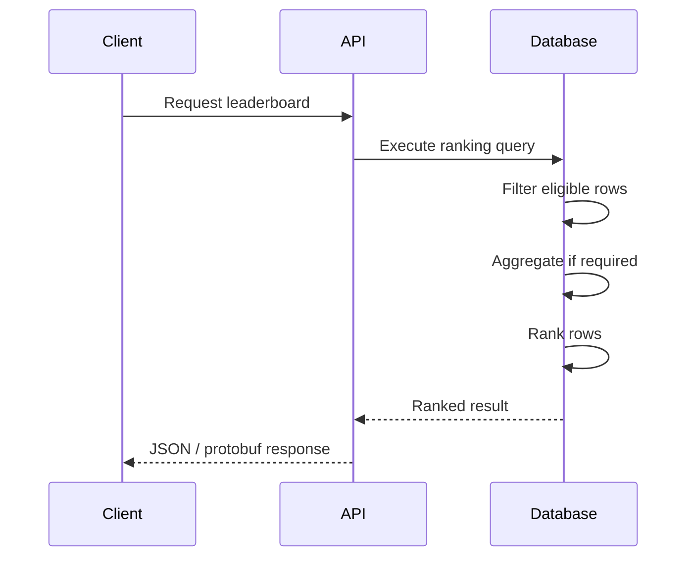
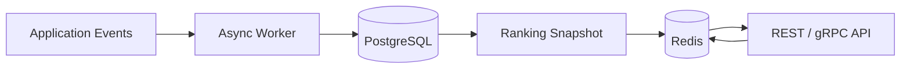

# README

## Overview

Ranking functions assign an ordered position to rows without collapsing the underlying result set. They are particularly useful when a backend query needs to identify leaders, latest records, top-N entities, or ordered records within independent groups.

This folder focuses on the three core SQL ranking functions:

- `ROW_NUMBER()` — assigns a unique sequential number to every row.
- `RANK()` — assigns the same rank to tied rows and leaves gaps after ties.
- `DENSE_RANK()` — assigns the same rank to tied rows without gaps.

The ranking function is only one part of the problem. Correct production queries also require deliberate decisions about:

- The rows eligible for ranking.
- The partitioning boundary.
- The ranking order.
- Tie behavior.
- Deterministic tie-breaking.
- Filtering ranked results.
- Aggregation before ranking.
- Performance on large datasets.

## Navigation

- [01- Ranking Functions Introduction](./01-%20Ranking%20Functions%20Introduction.md) — Ranking functions, their purpose, syntax, and core concepts
- [02- ROW_NUMBER](./02-%20ROW_NUMBER.md) — Unique sequential row numbering
- [03- RANK](./03-%20RANK.md) — Competition ranking with gaps after ties
- [04- DENSE_RANK](./04-%20DENSE_RANK.md) — Ranking distinct values without gaps
- [05- NTILE](./05-%20NTILE.md) — Dividing ordered rows into approximately equal buckets
- [06- ROW_NUMBER vs RANK vs DENSE_RANK](./06-%20ROW_NUMBER%20vs%20RANK%20vs%20DENSE_RANK.md) — Semantic and practical comparison of ranking functions
- [07- Ranking with PARTITION BY](./07-%20Ranking%20with%20PARTITION%20BY.md) — Independent ranking within groups
- [08- Top N per Group](./08-%20Top%20N%20per%20Group.md) — Selecting the top N rows or ranks within each group
- [09- Deduplication with ROW_NUMBER](./09-%20Deduplication%20with%20ROW_NUMBER.md) — Keeping one preferred row from duplicate groups
- [10- Ranking Selection Rules](./10-%20Ranking%20Selection%20Rules.md) — Choosing ranking strategies based on business requirements
- [11- Practical Ranking Patterns](./11-%20Practical%20Ranking%20Patterns.md) — Common production-oriented ranking patterns
- [12- Common Ranking Mistakes](./12-%20Common%20Ranking%20Mistakes.md) — Correctness, performance, and production pitfalls

## Ranking Functions at a Glance

```sql
ROW_NUMBER() OVER (
    PARTITION BY group_id
    ORDER BY metric DESC
)
```

```sql
RANK() OVER (
    PARTITION BY group_id
    ORDER BY metric DESC
)
```

```sql
DENSE_RANK() OVER (
    PARTITION BY group_id
    ORDER BY metric DESC
)
```

All three use the same window-function structure, but their treatment of ties differs.

| Function | Ties receive same rank | Gaps after ties | Every row gets unique position |
|---|---:|---:|---:|
| `ROW_NUMBER()` | No | No | Yes |
| `RANK()` | Yes | Yes | No |
| `DENSE_RANK()` | Yes | No | No |

For example:

| Score | `ROW_NUMBER()` | `RANK()` | `DENSE_RANK()` |
|---:|---:|---:|---:|
| 100 | 1 | 1 | 1 |
| 90 | 2 | 2 | 2 |
| 90 | 3 | 2 | 2 |
| 80 | 4 | 4 | 3 |
| 70 | 5 | 5 | 4 |

## How Ranking Fits into Query Processing

A useful mental model is:

```text
FROM / JOIN
      ↓
WHERE
      ↓
GROUP BY
      ↓
HAVING
      ↓
Window Functions
      ↓
SELECT / ORDER BY
```

The exact optimizer execution strategy can differ from this logical model, but the model explains many ranking-related mistakes.

For example, if inactive rows must not participate in a ranking, the predicate generally belongs before the window calculation:

```sql
WITH ranked AS (
    SELECT
        id,
        department_id,
        salary,
        ROW_NUMBER() OVER (
            PARTITION BY department_id
            ORDER BY salary DESC, id
        ) AS position
    FROM employees
    WHERE is_active = TRUE
)
SELECT *
FROM ranked
WHERE position <= 3;
```

The ranking is therefore performed over the eligible population rather than ranking all rows and filtering afterward.

## Core Ranking Patterns

### Global Ranking

Use a global window when every row competes against every other row:

```sql
SELECT
    product_id,
    revenue,
    RANK() OVER (
        ORDER BY revenue DESC
    ) AS revenue_rank
FROM products;
```

Typical uses include global leaderboards and company-wide rankings.

### Ranking Within Groups

Use `PARTITION BY` when each group needs an independent ranking:

```sql
SELECT
    category_id,
    product_id,
    revenue,
    ROW_NUMBER() OVER (
        PARTITION BY category_id
        ORDER BY revenue DESC, product_id
    ) AS position
FROM product_sales;
```

The partition defines the competition boundary.

### Top N per Group

The standard pattern is to rank in an inner query and filter in an outer query:

```sql
WITH ranked AS (
    SELECT
        category_id,
        product_id,
        revenue,
        ROW_NUMBER() OVER (
            PARTITION BY category_id
            ORDER BY revenue DESC, product_id
        ) AS position
    FROM product_sales
)
SELECT
    category_id,
    product_id,
    revenue
FROM ranked
WHERE position <= 3;
```

Use `RANK()` or `DENSE_RANK()` instead when tied values must be included.

### Latest Record per Group

`ROW_NUMBER()` is frequently used to select one preferred record:

```sql
WITH ranked AS (
    SELECT
        customer_id,
        event_id,
        created_at,
        ROW_NUMBER() OVER (
            PARTITION BY customer_id
            ORDER BY created_at DESC, event_id DESC
        ) AS position
    FROM customer_events
)
SELECT
    customer_id,
    event_id,
    created_at
FROM ranked
WHERE position = 1;
```

A stable unique tie-breaker is important when exactly one row must be selected.

### Deduplication

The same pattern can identify duplicates:

```sql
WITH ranked AS (
    SELECT
        id,
        email,
        created_at,
        ROW_NUMBER() OVER (
            PARTITION BY email
            ORDER BY created_at DESC, id DESC
        ) AS position
    FROM users
)
SELECT *
FROM ranked
WHERE position > 1;
```

This identifies rows that are candidates for duplicate cleanup while retaining the preferred record at `position = 1`.

## Ranking After Aggregation

Ranking is often applied to a derived business metric rather than raw rows.

For example, to find the top customers by total spending within each region:

```sql
WITH customer_totals AS (
    SELECT
        region_id,
        customer_id,
        SUM(amount) AS total_spend
    FROM orders
    GROUP BY
        region_id,
        customer_id
),
ranked AS (
    SELECT
        region_id,
        customer_id,
        total_spend,
        DENSE_RANK() OVER (
            PARTITION BY region_id
            ORDER BY total_spend DESC
        ) AS spending_rank
    FROM customer_totals
)
SELECT
    region_id,
    customer_id,
    total_spend,
    spending_rank
FROM ranked
WHERE spending_rank <= 3;
```

The important sequence is:

```text
Raw transactional data
        ↓
Aggregation
        ↓
Business metric
        ↓
Ranking
        ↓
Rank selection
```

Ranking raw transactional rows when the requirement is based on an aggregate metric produces the wrong result.

## Choosing the Correct Ranking Function

Use the business requirement to select the function.

| Requirement | Recommended function |
|---|---|
| Assign a unique position to every row | `ROW_NUMBER()` |
| Select exactly one preferred row | `ROW_NUMBER()` |
| Deduplicate and retain one row | `ROW_NUMBER()` |
| Exactly N physical rows per group | `ROW_NUMBER()` |
| Competition ranking with skipped positions | `RANK()` |
| Include all rows sharing one of the first N competition ranks | `RANK()` |
| Rank distinct metric values without gaps | `DENSE_RANK()` |
| Select the first N distinct metric values | `DENSE_RANK()` |

The phrase **"top N"** is incomplete until the meaning of N is defined.

It may mean:

- N physical rows.
- N competition ranks.
- N distinct metric values.

## Tie Handling

Tie behavior is one of the most important differences between ranking functions.

Given:

```text
100
90
90
80
```

`ROW_NUMBER()` produces:

```text
1
2
3
4
```

`RANK()` produces:

```text
1
2
2
4
```

`DENSE_RANK()` produces:

```text
1
2
2
3
```

Do not add a unique tie-breaker to `RANK()` or `DENSE_RANK()` unless the business requirement is to break ties.

For example:

```sql
RANK() OVER (
    ORDER BY score DESC, player_id
)
```

causes two players with the same score but different IDs to receive different ranks.

If equal scores must remain tied:

```sql
RANK() OVER (
    ORDER BY score DESC
)
```

## Deterministic Ordering

When `ROW_NUMBER()` must consistently select one row, the window ordering should resolve ties.

Prefer:

```sql
ROW_NUMBER() OVER (
    PARTITION BY customer_id
    ORDER BY created_at DESC, id DESC
)
```

over:

```sql
ROW_NUMBER() OVER (
    PARTITION BY customer_id
    ORDER BY created_at DESC
)
```

The second query does not fully define which row wins when multiple rows have the same timestamp.

This matters for:

- Latest-record queries.
- Deduplication.
- Leaderboard APIs.
- ETL processing.
- Data migrations.
- Batch jobs.

A deterministic ordering requirement should be treated as a correctness requirement, not merely a performance preference.

## Filtering Ranked Results

Window-function results generally need to be filtered in an outer query or CTE.

Use:

```sql
WITH ranked AS (
    SELECT
        id,
        score,
        ROW_NUMBER() OVER (
            ORDER BY score DESC, id
        ) AS position
    FROM scores
)
SELECT *
FROM ranked
WHERE position <= 10;
```

This separates:

```text
Ranking
```

from:

```text
Rank selection
```

and makes the query easier to reason about.

## Common Production Pitfalls

### Ranking Before Applying Eligibility Filters

If only active products should compete, filter them before ranking:

```sql
FROM products
WHERE is_active = TRUE
```

Do not rank inactive products and remove them afterward unless their participation in the ranking is intentional.

### Ranking After a Join Explosion

One-to-many joins can duplicate logical entities.

Always verify the grain entering the ranking operation.

If ranking orders, joining `order_items` can accidentally turn one order into many rows.

### Forgetting the Outer `ORDER BY`

The ordering inside:

```sql
OVER (ORDER BY ...)
```

controls the window calculation.

It does not necessarily define the final output order.

If the returned result must be ordered, use an outer:

```sql
ORDER BY
```

as well.

### Ignoring `NULL` Ordering

Define the desired behavior explicitly when missing values can affect ranking.

In PostgreSQL:

```sql
ORDER BY score DESC NULLS LAST
```

is often preferable when unknown scores should not appear at the top.

### Ranking Entire Large Tables

Ranking millions of rows to return a small subset can be expensive.

For production workloads:

- Apply valid filters before ranking.
- Aggregate before ranking when appropriate.
- Select only required columns.
- Review execution plans.
- Consider summary tables or materialized views for repeated expensive computations.
- Consider precomputed leaderboards when slight staleness is acceptable.

In PostgreSQL:

```sql
EXPLAIN (ANALYZE, BUFFERS)
SELECT ...;
```

should be used to validate the actual plan and resource consumption.

## Multi-Tenant Ranking

Ranking scope and data visibility are separate concerns.

This:

```sql
RANK() OVER (
    PARTITION BY tenant_id
    ORDER BY score DESC
)
```

defines independent ranking groups.

It does not by itself prevent unauthorized rows from being returned.

A tenant-scoped query should enforce visibility separately:

```sql
SELECT
    user_id,
    score,
    RANK() OVER (
        ORDER BY score DESC
    ) AS position
FROM user_scores
WHERE tenant_id = :tenant_id;
```

For PostgreSQL applications with strong tenant isolation requirements, Row-Level Security can provide an additional database-level enforcement layer.

## Ranking and Backend APIs

Ranking functions fit naturally into REST and gRPC backends when the database is the authoritative source for the ranking.

A typical request path is:



For Django or FastAPI applications, prefer pushing ranking work into SQL when the database can efficiently express the requirement. Avoid loading an entire dataset into Python just to sort and rank it in application memory.

For frequently requested leaderboards, consider whether the ranking should be:

- Calculated on demand.
- Cached in Redis.
- Materialized in PostgreSQL.
- Precomputed asynchronously with Celery.
- Produced from an event-driven pipeline using Kafka.

The correct choice depends on freshness, consistency, dataset size, request rate, and operational complexity.

## Ranking vs Pagination

Ranking and pagination solve different problems.

Use ranking when the application needs an actual position:

```text
Player A → rank 12
Player B → rank 13
```

For large APIs, do not automatically use `ROW_NUMBER()` as a pagination mechanism.

Keyset pagination is often more efficient:

```sql
SELECT
    id,
    created_at,
    title
FROM posts
WHERE (created_at, id) < (:cursor_created_at, :cursor_id)
ORDER BY created_at DESC, id DESC
LIMIT 50;
```

Use ranking when position is part of the business result. Use keyset pagination when the requirement is efficient traversal of a large ordered dataset.

## Performance and Scalability

Window functions can require substantial sorting or partition processing.

Performance depends on:

- Number of rows entering the window.
- Number and size of partitions.
- Window ordering.
- Existing filters.
- Joins.
- Aggregation.
- Available indexes.
- Database engine and version.
- Memory available for sorting.
- Data distribution.

A useful optimization strategy is:

```text
Reduce input rows
      ↓
Reduce row width
      ↓
Aggregate when appropriate
      ↓
Rank
      ↓
Filter ranked result
```

Indexes can help with predicates and, depending on the query and planner, may help avoid or reduce sorting. They are not a guarantee that a window query will be inexpensive.

Always validate with the actual execution plan.

## Materializing Expensive Rankings

For high-read, low-change leaderboards, calculating the ranking for every request may be wasteful.

A production architecture may instead use:



Materialization can reduce request latency and database load, but introduces:

- Staleness.
- Cache invalidation.
- Rebuild requirements.
- Additional operational complexity.
- Consistency decisions.

Use it only when the workload justifies the additional architecture.

## Interview Patterns

The most common ranking problems include:

| Problem | Typical approach |
|---|---|
| Latest row per customer | `ROW_NUMBER()` + `PARTITION BY` |
| Top N per category | `ROW_NUMBER()` or `RANK()` + `PARTITION BY` |
| Second highest distinct salary | `DENSE_RANK()` |
| Competition leaderboard | `RANK()` |
| Remove duplicates | `ROW_NUMBER()` |
| Divide rows into buckets | `NTILE()` |
| Rank aggregated metrics | `GROUP BY` followed by ranking |

The important interview skill is not memorizing syntax. It is identifying:

1. The row grain.
2. The partition boundary.
3. The metric being ordered.
4. The tie semantics.
5. Whether exactly one row or multiple tied rows should survive.
6. Whether filtering happens before or after ranking.

## Recommended Learning Order

Study this folder in the following order:

```text
Ranking Functions Introduction
          ↓
ROW_NUMBER
          ↓
RANK
          ↓
DENSE_RANK
          ↓
NTILE
          ↓
ROW_NUMBER vs RANK vs DENSE_RANK
          ↓
Ranking with PARTITION BY
          ↓
Top N per Group
          ↓
Deduplication with ROW_NUMBER
          ↓
Ranking Selection Rules
          ↓
Practical Ranking Patterns
          ↓
Common Ranking Mistakes
```

The progression moves from function semantics to real-world query design and finally to correctness and production concerns.

## Key Takeaways

- **Choose ranking functions based on business semantics: `ROW_NUMBER()` for unique row positions, `RANK()` for competition ranking, and `DENSE_RANK()` for distinct ranking levels.**
- **`PARTITION BY` defines the ranking population, while `WHERE` and database authorization mechanisms define which rows are visible and eligible.**
- **For reliable production queries, explicitly define tie behavior, deterministic ordering, `NULL` handling, and the grain of rows entering the window function.**
- **Top-N, latest-record, deduplication, and leaderboard queries commonly combine filtering, aggregation, partitioning, ranking, and outer filtering.**
- **For large or frequently accessed workloads, validate execution plans and consider caching, materialization, or precomputation instead of recalculating expensive rankings on every request.**