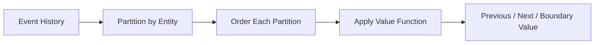

# 01- Value Functions Introduction

## Overview

Value functions are SQL window functions that retrieve a value from another row relative to the current row, rather than calculating a rank or aggregate over the window.

They are useful when a query needs to answer questions such as:

- What was the previous event?
- What is the next event?
- What was the first value in this customer's ordered history?
- What was the most recent value?
- How does the current value compare with a value elsewhere in the partition?

The primary value-oriented window functions are:

| Function | Purpose |
|---|---|
| `LAG()` | Access a preceding row |
| `LEAD()` | Access a following row |
| `FIRST_VALUE()` | Return the first value in the window frame |
| `LAST_VALUE()` | Return the last value in the window frame |
| `NTH_VALUE()` | Return the value from the Nth row in the window frame |

These functions preserve the original row grain. Unlike `GROUP BY`, they do not collapse multiple rows into one result.

## Why Value Functions Matter

Backend systems frequently store state transitions, transactions, events, metrics, and time-series records where the relationship between neighboring rows is important.

For example, an order-status history may look like:

| order_id | status | changed_at |
|---:|---|---|
| 1001 | pending | 09:00 |
| 1001 | paid | 09:03 |
| 1001 | shipped | 09:45 |
| 1001 | delivered | 14:20 |

A value function can transform this into:

| status | changed_at | previous_status |
|---|---|---|
| pending | 09:00 | `NULL` |
| paid | 09:03 | pending |
| shipped | 09:45 | paid |
| delivered | 14:20 | shipped |

This enables SQL to perform sequential analysis without loading the complete dataset into Python or another application layer.

## Core Syntax

The general syntax is:

```sql
value_function(value_expression [, offset] [, default])
OVER (
    [PARTITION BY partition_expression]
    ORDER BY ordering_expression
    [frame_clause]
)
```

The exact arguments vary by function.

A typical example:

```sql
SELECT
    customer_id,
    created_at,
    amount,
    LAG(amount) OVER (
        PARTITION BY customer_id
        ORDER BY created_at, id
    ) AS previous_amount
FROM payments;
```

The important components are:

- `PARTITION BY` — defines the independent sequence.
- `ORDER BY` — defines the row sequence within that partition.
- The window frame — controls which rows are visible to frame-sensitive functions such as `FIRST_VALUE()` and `LAST_VALUE()`.

## `LAG()`

`LAG()` retrieves a value from a preceding row.

```sql
SELECT
    customer_id,
    created_at,
    amount,
    LAG(amount) OVER (
        PARTITION BY customer_id
        ORDER BY created_at, id
    ) AS previous_amount
FROM payments;
```

For each customer, the database orders payments and retrieves the amount from the previous row.

The first row in each partition has no preceding row, so the result is `NULL` unless a default is specified.

### Offset

The default offset is `1`.

```sql
LAG(amount, 2) OVER (
    PARTITION BY customer_id
    ORDER BY created_at, id
)
```

This retrieves the value two rows earlier.

### Default Value

A default can be supplied:

```sql
LAG(amount, 1, 0) OVER (
    PARTITION BY customer_id
    ORDER BY created_at, id
)
```

The default is used when the requested preceding row does not exist.

## `LEAD()`

`LEAD()` is the forward-looking counterpart to `LAG()`.

```sql
SELECT
    customer_id,
    created_at,
    amount,
    LEAD(amount) OVER (
        PARTITION BY customer_id
        ORDER BY created_at, id
    ) AS next_amount
FROM payments;
```

It retrieves a value from a following row.

Typical uses include:

- Determining the next state.
- Calculating time until the next event.
- Detecting gaps.
- Building session boundaries.
- Comparing current and future records.

For example:

```sql
SELECT
    customer_id,
    created_at,
    LEAD(created_at) OVER (
        PARTITION BY customer_id
        ORDER BY created_at, id
    ) AS next_payment_at
FROM payments;
```

## `FIRST_VALUE()`

`FIRST_VALUE()` returns a value from the first row of the window frame.

```sql
SELECT
    customer_id,
    created_at,
    amount,
    FIRST_VALUE(amount) OVER (
        PARTITION BY customer_id
        ORDER BY created_at, id
    ) AS first_payment_amount
FROM payments;
```

Every row for a customer can therefore carry the customer's first payment amount.

This is useful for comparisons such as:

```sql
SELECT
    customer_id,
    created_at,
    amount,
    amount - FIRST_VALUE(amount) OVER (
        PARTITION BY customer_id
        ORDER BY created_at, id
    ) AS difference_from_first
FROM payments;
```

## `LAST_VALUE()` and Window Frames

`LAST_VALUE()` requires particular attention because its result depends heavily on the window frame.

Consider:

```sql
LAST_VALUE(amount) OVER (
    PARTITION BY customer_id
    ORDER BY created_at, id
)
```

With the default frame behavior in many SQL systems, the frame ends at the current row. Therefore, `LAST_VALUE()` can return the **current row's value**, not the final value of the entire partition.

To explicitly request the last value across the full partition:

```sql
LAST_VALUE(amount) OVER (
    PARTITION BY customer_id
    ORDER BY created_at, id
    ROWS BETWEEN UNBOUNDED PRECEDING AND UNBOUNDED FOLLOWING
)
```

This distinction is a common interview and production trap.

### Frame-Sensitive Behavior

```text
Partition:
A → B → C → D

Current row = C

Default/current-row-ending frame:
A → B → C
            ↑
       LAST_VALUE = C

Full partition frame:
A → B → C → D
               ↑
       LAST_VALUE = D
```

When using `LAST_VALUE()`, explicitly define the intended frame rather than relying on implicit defaults.

## `NTH_VALUE()`

`NTH_VALUE()` returns the value from a specified position within the window frame.

For example:

```sql
SELECT
    customer_id,
    created_at,
    amount,
    NTH_VALUE(amount, 2) OVER (
        PARTITION BY customer_id
        ORDER BY created_at, id
        ROWS BETWEEN UNBOUNDED PRECEDING AND UNBOUNDED FOLLOWING
    ) AS second_payment_amount
FROM payments;
```

This can be useful when a query needs a specific positional value rather than a neighboring row.

Its behavior is also frame-sensitive, so the frame should be specified deliberately when the requirement refers to the entire partition.

## `LAG()` and `LEAD()` vs `FIRST_VALUE()` and `LAST_VALUE()`

These functions solve related but different problems.

| Function | Looks relative to | Typical use |
|---|---|---|
| `LAG()` | Previous row | Previous state/value |
| `LEAD()` | Next row | Next state/value |
| `FIRST_VALUE()` | First row of frame | Baseline/initial value |
| `LAST_VALUE()` | Last row of frame | Final value |
| `NTH_VALUE()` | Nth row of frame | Positional value |

A useful rule:

```text
Previous / next row
        ↓
LAG / LEAD

Beginning / ending / specific position
        ↓
FIRST_VALUE / LAST_VALUE / NTH_VALUE
```

## `PARTITION BY` Defines the Sequence

Value functions operate over an ordered sequence.

Without `PARTITION BY`:

```sql
LAG(status) OVER (
    ORDER BY changed_at, id
)
```

all rows participate in one sequence.

With:

```sql
LAG(status) OVER (
    PARTITION BY order_id
    ORDER BY changed_at, id
)
```

each order has its own independent sequence.

This is usually essential when analyzing entity histories.

For example:



## Ordering Is a Correctness Requirement

Value functions depend on row order.

This query:

```sql
LAG(status) OVER (
    PARTITION BY order_id
    ORDER BY changed_at
)
```

can be ambiguous if multiple events have the same `changed_at`.

Prefer a deterministic ordering:

```sql
LAG(status) OVER (
    PARTITION BY order_id
    ORDER BY changed_at, id
)
```

The unique identifier provides a stable tie-breaker.

This matters for:

- Event histories.
- Payment records.
- Audit logs.
- CDC data.
- State transitions.
- Deduplication workflows.

Do not assume that physical insertion order defines SQL ordering.

## Practical Backend Pattern: State Transitions

Suppose an order history stores every status transition.

```sql
SELECT
    order_id,
    status,
    changed_at,
    LAG(status) OVER (
        PARTITION BY order_id
        ORDER BY changed_at, id
    ) AS previous_status
FROM order_status_history;
```

The application can then identify transitions:

```sql
WITH transitions AS (
    SELECT
        order_id,
        status,
        changed_at,
        LAG(status) OVER (
            PARTITION BY order_id
            ORDER BY changed_at, id
        ) AS previous_status
    FROM order_status_history
)
SELECT *
FROM transitions
WHERE previous_status IS DISTINCT FROM status;
```

This is useful for auditing and validating state-machine behavior.

## Practical Backend Pattern: Duration Between Events

`LEAD()` can calculate how long an entity remained in a state.

```sql
SELECT
    order_id,
    status,
    changed_at,
    LEAD(changed_at) OVER (
        PARTITION BY order_id
        ORDER BY changed_at, id
    ) AS next_changed_at
FROM order_status_history;
```

In PostgreSQL, this can be extended:

```sql
SELECT
    order_id,
    status,
    changed_at,
    LEAD(changed_at) OVER (
        PARTITION BY order_id
        ORDER BY changed_at, id
    ) - changed_at AS duration
FROM order_status_history;
```

The final state naturally has no next event, so its duration is `NULL`.

## Practical Backend Pattern: Compare Against Baseline

`FIRST_VALUE()` is useful for calculating change relative to an initial value.

```sql
SELECT
    customer_id,
    created_at,
    balance,
    balance - FIRST_VALUE(balance) OVER (
        PARTITION BY customer_id
        ORDER BY created_at, id
    ) AS change_from_initial
FROM account_snapshots;
```

This avoids a separate join to retrieve the initial record.

## Practical Backend Pattern: Final State

To expose the final known state alongside every historical row:

```sql
SELECT
    order_id,
    status,
    changed_at,
    LAST_VALUE(status) OVER (
        PARTITION BY order_id
        ORDER BY changed_at, id
        ROWS BETWEEN UNBOUNDED PRECEDING AND UNBOUNDED FOLLOWING
    ) AS final_status
FROM order_status_history;
```

The explicit full-partition frame is important.

If only the current row's value is needed, `LAST_VALUE()` may be unnecessary; simply selecting the current column is clearer.

## Combining Value Functions

Multiple value functions can be used in the same query.

```sql
SELECT
    customer_id,
    created_at,
    amount,
    LAG(amount) OVER (
        PARTITION BY customer_id
        ORDER BY created_at, id
    ) AS previous_amount,
    LEAD(amount) OVER (
        PARTITION BY customer_id
        ORDER BY created_at, id
    ) AS next_amount,
    FIRST_VALUE(amount) OVER (
        PARTITION BY customer_id
        ORDER BY created_at, id
    ) AS first_amount
FROM payments;
```

This creates a row-level view of the customer's transaction sequence.

## Value Functions vs Self-Joins

Before window functions, previous or next row relationships were often implemented with self-joins or correlated subqueries.

A window function is usually easier to express:

```sql
SELECT
    id,
    created_at,
    amount,
    LAG(amount) OVER (
        ORDER BY created_at, id
    ) AS previous_amount
FROM payments;
```

Instead of manually finding the previous record.

Benefits include:

- Clearer intent.
- Less complex join logic.
- Natural partitioning.
- Better support for offsets.
- Easier extension to multiple neighboring values.

However, window functions are not automatically faster than every alternative. Always validate the actual execution plan for production workloads.

## Logical Query Processing

A useful model is:

```text
FROM / JOIN
      ↓
WHERE
      ↓
GROUP BY
      ↓
HAVING
      ↓
Window Functions
      ↓
SELECT / ORDER BY
```

This has an important consequence: filtering before a value function changes the population visible to that function.

For example:

```sql
SELECT
    customer_id,
    created_at,
    amount,
    LAG(amount) OVER (
        PARTITION BY customer_id
        ORDER BY created_at, id
    ) AS previous_amount
FROM payments
WHERE status = 'completed';
```

Here, `LAG()` sees only completed payments.

If the requirement is to compare each completed payment against the previous payment **regardless of status**, calculate the window value first and filter afterward:

```sql
WITH ordered AS (
    SELECT
        customer_id,
        created_at,
        status,
        amount,
        LAG(amount) OVER (
            PARTITION BY customer_id
            ORDER BY created_at, id
        ) AS previous_amount
    FROM payments
)
SELECT *
FROM ordered
WHERE status = 'completed';
```

This distinction is critical for analytical correctness.

## Performance Considerations

Value functions commonly require the database to establish an ordered sequence within each partition.

Performance is affected by:

- Number of rows.
- Partition size.
- Sorting requirements.
- `PARTITION BY` cardinality.
- `ORDER BY` columns.
- Joins before the window operation.
- Row width.
- Memory available for sorting.

For large production tables:

- Filter rows that are genuinely outside the analytical population before the window operation.
- Avoid unnecessary joins before ranking or value calculations.
- Select only required columns.
- Use deterministic but appropriate ordering.
- Inspect execution plans.
- Consider summary tables or materialization for repeated expensive analysis.

In PostgreSQL:

```sql
EXPLAIN (ANALYZE, BUFFERS)
SELECT
    customer_id,
    created_at,
    LAG(amount) OVER (
        PARTITION BY customer_id
        ORDER BY created_at, id
    )
FROM payments;
```

Indexes can improve filtering and may help the planner, but an index does not guarantee that a window operation will avoid sorting.

## Production Considerations

### Deterministic Event Ordering

Event timestamps alone are often insufficient.

Prefer:

```sql
ORDER BY event_time, event_id
```

when `event_id` is unique.

### Late-Arriving Events

If events can arrive out of order, ranking by ingestion time may not represent business chronology.

Decide whether the sequence should use:

- Event time.
- Ingestion time.
- Database creation time.
- A domain-specific sequence number.

The choice affects the meaning of `LAG()` and `LEAD()`.

### Mutable Historical Data

Value functions operate on the rows visible at query time.

If historical events can be corrected or deleted, previously calculated transitions may change.

For audit-sensitive systems, immutable event histories are often preferable.

### Time Zones

When analyzing temporal events, store timestamps consistently and define the business timezone explicitly.

Do not use application-local timestamps as an implicit ordering contract.

### Security and Tenant Isolation

`PARTITION BY tenant_id` is not an authorization mechanism.

A query must first enforce which tenant rows the caller is allowed to access. The partition only determines how eligible rows are grouped for the window calculation.

## Common Mistakes

| Mistake | Why it causes problems | Better approach |
|---|---|---|
| Omitting `ORDER BY` | No meaningful sequence for `LAG()`/`LEAD()` | Define the business order |
| Ordering only by timestamp | Ties can make results ambiguous | Add a stable tie-breaker |
| Forgetting `PARTITION BY` | Different entities become one sequence | Partition by entity/group |
| Misusing `LAST_VALUE()` | Default frame may end at current row | Explicitly define the frame |
| Filtering too early | Window sees a different population | Filter before or after intentionally |
| Ranking application-side | Excess memory and network transfer | Push set-based work to SQL |
| Assuming index guarantees ordering | Planner may still sort | Verify with `EXPLAIN` |
| Treating `NULL` as an ordinary value | Missing predecessors/successors can be misinterpreted | Define null semantics explicitly |

## Interview Traps

### `LAG()` vs `LEAD()`

- `LAG()` looks backward.
- `LEAD()` looks forward.

### `FIRST_VALUE()` vs `MIN()`

They are not interchangeable.

`MIN()` returns the smallest value according to the expression's comparison semantics.

`FIRST_VALUE()` returns the value associated with the first row according to the window ordering.

For example:

```sql
FIRST_VALUE(price) OVER (
    ORDER BY created_at
)
```

means "price from the earliest row."

It does **not** mean "minimum price."

### `LAST_VALUE()` Trap

This is a classic interview question:

```sql
LAST_VALUE(status) OVER (
    PARTITION BY order_id
    ORDER BY changed_at
)
```

The result may be the current row's status because the default frame ends at the current row.

When the requirement is the final partition value, use an explicit full frame:

```sql
LAST_VALUE(status) OVER (
    PARTITION BY order_id
    ORDER BY changed_at, id
    ROWS BETWEEN UNBOUNDED PRECEDING AND UNBOUNDED FOLLOWING
)
```

### Window Functions Do Not Collapse Rows

This:

```sql
LAG(amount) OVER (...)
```

adds information to every row.

It does not behave like:

```sql
GROUP BY customer_id
```

which reduces the number of rows.

## When to Use Value Functions

Use value functions when the relationship between rows matters.

Good candidates include:

- Event-stream analysis.
- Audit histories.
- State transitions.
- Time-series calculations.
- Previous/next record comparisons.
- Customer lifecycle analysis.
- Sessionization.
- Change detection.
- Baseline comparisons.
- Duration calculations.
- Sequential anomaly detection.

Avoid them when a simple scalar expression, aggregate, or direct join expresses the requirement more clearly.

## Key Takeaways

- **`LAG()` and `LEAD()` retrieve values from neighboring rows, while `FIRST_VALUE()`, `LAST_VALUE()`, and `NTH_VALUE()` retrieve positional values from a window frame.**
- **`PARTITION BY` defines independent sequences, and `ORDER BY` defines their business ordering; both are correctness concerns, not merely syntax.**
- **`LAST_VALUE()` is frame-sensitive, so explicitly use a full-partition frame when the requirement is the final value across the entire partition.**
- **Window functions preserve row-level results and are especially effective for event histories, state transitions, temporal comparisons, and baseline calculations.**
- **For production workloads, control the rows entering the window, use deterministic ordering, understand filtering semantics, and validate performance with execution plans.**