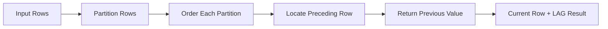

# 02- LAG

## Overview

`LAG()` is a SQL window function that retrieves a value from a preceding row in the ordered window without collapsing the result set.

It is one of the most useful functions for analyzing sequences in backend systems because many production datasets represent state or events over time:

- Order status histories
- Payment transactions
- Account balances
- User activity
- Sensor or service metrics
- Audit events
- CDC records
- Time-series measurements

The core problem it solves is **row-to-row comparison**. Instead of joining a table to itself to find the previous record, `LAG()` allows the database to express that relationship directly.

```sql
LAG(value_expression [, offset [, default]])
OVER (
    [PARTITION BY partition_expression]
    ORDER BY ordering_expression
)
```

The most important rule is:

> `LAG()` retrieves a value from a previous row according to the window's `ORDER BY`; it does not mean "previous row physically stored in the table."

## Why `LAG()` Exists

Suppose an order has the following status history:

| order_id | status | changed_at |
|---:|---|---|
| 1001 | pending | 09:00 |
| 1001 | paid | 09:03 |
| 1001 | shipped | 09:45 |
| 1001 | delivered | 14:20 |

A backend application may need to determine the transition:

| status | previous_status |
|---|---|
| pending | `NULL` |
| paid | pending |
| shipped | paid |
| delivered | shipped |

A traditional approach could use a self-join or correlated subquery. `LAG()` makes the intent explicit:

```sql
SELECT
    order_id,
    status,
    changed_at,
    LAG(status) OVER (
        PARTITION BY order_id
        ORDER BY changed_at
    ) AS previous_status
FROM order_status_history;
```

The result retains every original row while adding information from the preceding row.

## Syntax

The general syntax is:

```sql
LAG(
    value_expression
    [, offset]
    [, default]
) OVER (
    [PARTITION BY partition_expression]
    ORDER BY ordering_expression
)
```

| Component | Purpose |
|---|---|
| `value_expression` | Column or expression whose previous value is returned |
| `offset` | Number of rows to move backward |
| `default` | Value returned when the requested preceding row does not exist |
| `PARTITION BY` | Separates rows into independent sequences |
| `ORDER BY` | Defines what "previous" means |

A basic example:

```sql
SELECT
    created_at,
    amount,
    LAG(amount) OVER (
        ORDER BY created_at
    ) AS previous_amount
FROM payments;
```

## How `LAG()` Works

Conceptually, the database first establishes the window partition and its ordering:

```text
Partition
────────────────────────────────────────────
09:00     $100
09:05     $250
09:15     $175
09:30     $400
────────────────────────────────────────────

Current row       LAG(amount)
09:00             NULL
09:05             $100
09:15             $250
09:30             $175
```

For each row, `LAG()` moves backward by the requested offset.

The function does not require a self-join and does not remove rows from the result.



## Default Offset

If the offset is omitted, it is `1`.

These are equivalent:

```sql
LAG(amount) OVER (
    ORDER BY created_at
)
```

```sql
LAG(amount, 1) OVER (
    ORDER BY created_at
)
```

Both retrieve the immediately preceding row.

## Offset

An offset allows the query to look farther back.

For example, to retrieve the value two rows earlier:

```sql
SELECT
    created_at,
    amount,
    LAG(amount, 2) OVER (
        ORDER BY created_at
    ) AS amount_two_rows_ago
FROM payments;
```

For:

| amount |
|---:|
| 100 |
| 200 |
| 300 |
| 400 |

the result is:

| amount | amount_two_rows_ago |
|---:|---:|
| 100 | `NULL` |
| 200 | `NULL` |
| 300 | 100 |
| 400 | 200 |

The offset is measured in **rows**, not time.

This distinction is important in time-series workloads.

```sql
LAG(amount, 1)
```

means "previous row," not "one hour ago."

If events are irregularly spaced, use timestamp-aware logic when the requirement is based on elapsed time rather than row position.

## Default Value

The optional third argument specifies the value to return when the requested preceding row does not exist.

```sql
SELECT
    created_at,
    amount,
    LAG(amount, 1, 0) OVER (
        ORDER BY created_at
    ) AS previous_amount
FROM payments;
```

The first row receives `0` instead of `NULL`.

Without the default:

```text
100 → NULL
200 → 100
300 → 200
```

With a default of `0`:

```text
100 → 0
200 → 100
300 → 200
```

Be careful when choosing a default. `NULL` can carry meaningful information: it may indicate that no previous row exists. Replacing it with `0` can make "no previous value" indistinguishable from a legitimate zero.

## `PARTITION BY`

`PARTITION BY` defines independent sequences.

Consider payments from multiple customers:

| customer_id | created_at | amount |
|---:|---|---:|
| 1 | 09:00 | 100 |
| 1 | 10:00 | 200 |
| 2 | 09:30 | 500 |
| 2 | 11:00 | 300 |

Use:

```sql
SELECT
    customer_id,
    created_at,
    amount,
    LAG(amount) OVER (
        PARTITION BY customer_id
        ORDER BY created_at
    ) AS previous_amount
FROM payments;
```

The database creates a separate sequence for each customer.

Result:

| customer_id | amount | previous_amount |
|---:|---:|---:|
| 1 | 100 | `NULL` |
| 1 | 200 | 100 |
| 2 | 500 | `NULL` |
| 2 | 300 | 500 |

Without `PARTITION BY`, the previous row could belong to another customer.

### Production Rule

If the business requirement says:

> "Previous record for this entity"

the entity usually belongs in `PARTITION BY`.

Examples:

```sql
PARTITION BY customer_id
```

```sql
PARTITION BY order_id
```

```sql
PARTITION BY account_id
```

```sql
PARTITION BY device_id
```

## `ORDER BY` Defines "Previous"

`LAG()` cannot determine a meaningful previous row without an ordering definition.

This is correct:

```sql
LAG(status) OVER (
    PARTITION BY order_id
    ORDER BY changed_at
)
```

But timestamp columns may contain ties.

Consider:

| id | order_id | changed_at | status |
|---:|---:|---|---|
| 10 | 1001 | 09:00 | pending |
| 11 | 1001 | 09:00 | paid |

There is no deterministic order between IDs `10` and `11` if the query uses only:

```sql
ORDER BY changed_at
```

Prefer:

```sql
ORDER BY changed_at, id
```

where `id` is a stable unique tie-breaker.

This makes the sequence deterministic.

## Deterministic Ordering

For production event histories, prefer:

```sql
ORDER BY event_time, event_id
```

over:

```sql
ORDER BY event_time
```

when timestamps are not guaranteed to be unique.

A deterministic ordering is especially important for:

- Audit histories
- Financial transactions
- State transitions
- CDC events
- Message processing records
- User activity streams

Never rely on:

- Physical row order
- Insert order
- Primary-key order unless it represents the required chronology
- The order returned by a query without `ORDER BY`

## `LAG()` and `NULL`

There are two different reasons a `LAG()` result can be `NULL`.

### No Previous Row

```text
Current row = first row
Previous row = does not exist
Result = NULL
```

### Previous Row Contains `NULL`

The previous row may exist but its value may itself be `NULL`.

These cases are semantically different.

For example:

| id | amount |
|---:|---:|
| 1 | 100 |
| 2 | `NULL` |
| 3 | 200 |

For row `3`, `LAG(amount)` returns `NULL` because the previous row exists but its `amount` is `NULL`.

For row `1`, `LAG(amount)` also returns `NULL` because there is no previous row.

If the distinction matters, do not infer it from the returned value alone. Use additional row metadata or an appropriate query design.

## Comparing Current and Previous Values

One of the most common patterns is calculating a change.

```sql
SELECT
    customer_id,
    created_at,
    balance,
    balance - LAG(balance) OVER (
        PARTITION BY customer_id
        ORDER BY created_at, id
    ) AS balance_change
FROM account_snapshots;
```

Example:

| balance | previous_balance | balance_change |
|---:|---:|---:|
| 1000 | `NULL` | `NULL` |
| 1200 | 1000 | 200 |
| 950 | 1200 | -250 |

This is useful for:

- Balance changes
- Price changes
- Metric deltas
- Inventory changes
- Score changes
- Configuration changes

## Percentage Change

`LAG()` can provide the baseline for percentage calculations.

```sql
SELECT
    product_id,
    recorded_at,
    price,
    (
        (price - LAG(price) OVER (
            PARTITION BY product_id
            ORDER BY recorded_at, id
        ))
        / NULLIF(
            LAG(price) OVER (
                PARTITION BY product_id
                ORDER BY recorded_at, id
            ),
            0
        )
    ) * 100 AS percentage_change
FROM product_price_history;
```

The `NULLIF()` prevents division by zero.

For readability and to avoid repeating the window expression, a CTE can be preferable:

```sql
WITH ordered_prices AS (
    SELECT
        product_id,
        recorded_at,
        price,
        LAG(price) OVER (
            PARTITION BY product_id
            ORDER BY recorded_at, id
        ) AS previous_price
    FROM product_price_history
)
SELECT
    product_id,
    recorded_at,
    price,
    previous_price,
    (
        (price - previous_price)
        / NULLIF(previous_price, 0)
    ) * 100 AS percentage_change
FROM ordered_prices;
```

## Detecting State Transitions

`LAG()` is particularly useful for state-machine analysis.

```sql
WITH ordered_events AS (
    SELECT
        order_id,
        status,
        changed_at,
        LAG(status) OVER (
            PARTITION BY order_id
            ORDER BY changed_at, id
        ) AS previous_status
    FROM order_status_history
)
SELECT
    order_id,
    previous_status,
    status,
    changed_at
FROM ordered_events
WHERE previous_status IS DISTINCT FROM status;
```

This can expose transitions such as:

```text
pending → paid
paid → processing
processing → shipped
shipped → delivered
```

The result can be used to validate business-state transitions or generate operational metrics.

## Detecting Duplicate Consecutive States

Suppose an event stream contains:

```text
pending
paid
paid
paid
shipped
```

`LAG()` can identify repeated consecutive states:

```sql
WITH ordered_events AS (
    SELECT
        order_id,
        status,
        changed_at,
        LAG(status) OVER (
            PARTITION BY order_id
            ORDER BY changed_at, id
        ) AS previous_status
    FROM order_status_history
)
SELECT *
FROM ordered_events
WHERE status = previous_status;
```

This is useful for detecting:

- Duplicate events
- Redundant state updates
- Faulty producers
- Idempotency issues

## Detecting Changes in Configuration

For versioned configuration:

```sql
SELECT
    service_id,
    version,
    deployed_at,
    config_hash,
    LAG(config_hash) OVER (
        PARTITION BY service_id
        ORDER BY deployed_at, version
    ) AS previous_config_hash
FROM service_deployments;
```

A difference between the hashes indicates a configuration change.

This pattern is useful for deployment auditing and operational investigations.

## Finding Gaps Between Events

`LAG()` can retrieve the previous timestamp.

```sql
SELECT
    user_id,
    occurred_at,
    occurred_at - LAG(occurred_at) OVER (
        PARTITION BY user_id
        ORDER BY occurred_at, id
    ) AS time_since_previous_event
FROM user_events;
```

In PostgreSQL, this produces an interval.

The result can be filtered to identify inactivity periods:

```sql
WITH events AS (
    SELECT
        user_id,
        occurred_at,
        occurred_at - LAG(occurred_at) OVER (
            PARTITION BY user_id
            ORDER BY occurred_at, id
        ) AS gap
    FROM user_events
)
SELECT *
FROM events
WHERE gap > INTERVAL '30 minutes';
```

This is a common building block for sessionization.

## `LAG()` vs Self-Join

A self-join can also retrieve a previous row, but the logic is typically more complicated.

A window-function solution:

```sql
SELECT
    id,
    created_at,
    amount,
    LAG(amount) OVER (
        ORDER BY created_at, id
    ) AS previous_amount
FROM payments;
```

A self-join must first define what constitutes the previous record, often using a correlated subquery or another derived relation.

`LAG()` generally provides:

- Clearer intent
- Less query complexity
- Natural partitioning
- Arbitrary row offsets
- Better support for sequence analysis

However, "window function" does not automatically mean "faster." The database still needs to process and order the relevant rows. Production performance should be verified using the actual execution plan.

## `LAG()` vs `LEAD()`

The distinction is simple:

| Function | Direction | Example |
|---|---|---|
| `LAG()` | Backward | Previous payment |
| `LEAD()` | Forward | Next payment |

For:

```text
A → B → C → D
```

`LAG()` for `C` returns `B`.

`LEAD()` for `C` returns `D`.

Use `LAG()` when the current row needs historical context.

Use `LEAD()` when the current row needs future context.

## `LAG()` vs `FIRST_VALUE()`

These functions answer different questions.

```sql
LAG(amount) OVER (
    PARTITION BY customer_id
    ORDER BY created_at
)
```

means:

> What was the amount in the previous row?

Whereas:

```sql
FIRST_VALUE(amount) OVER (
    PARTITION BY customer_id
    ORDER BY created_at
)
```

means:

> What was the amount in the first row of the window frame?

For a customer transaction history:

| row | amount | `LAG()` | `FIRST_VALUE()` |
|---:|---:|---:|---:|
| 1 | 100 | `NULL` | 100 |
| 2 | 250 | 100 | 100 |
| 3 | 175 | 250 | 100 |

## Filtering Results After `LAG()`

Window functions are evaluated after `WHERE` filtering in the logical query-processing model.

Consider:

```sql
SELECT
    customer_id,
    created_at,
    status,
    LAG(status) OVER (
        PARTITION BY customer_id
        ORDER BY created_at, id
    ) AS previous_status
FROM payments
WHERE status = 'completed';
```

Here, `LAG()` operates only on completed payments.

If the requirement is:

> Show completed payments and compare each one with the previous payment of any status.

calculate `LAG()` before filtering:

```sql
WITH ordered_payments AS (
    SELECT
        customer_id,
        created_at,
        status,
        amount,
        LAG(amount) OVER (
            PARTITION BY customer_id
            ORDER BY created_at, id
        ) AS previous_amount
    FROM payments
)
SELECT *
FROM ordered_payments
WHERE status = 'completed';
```

This distinction can completely change the result.

## Window Frames and `LAG()`

Unlike `FIRST_VALUE()`, `LAST_VALUE()`, and `NTH_VALUE()`, `LAG()` is conceptually based on row offsets and does not use the window frame in the same way.

The key inputs for `LAG()` are:

```text
PARTITION BY
      ↓
Defines the sequence

ORDER BY
      ↓
Defines row position

OFFSET
      ↓
Moves backward from current row
```

Do not add a frame clause simply because another window function requires one. Keep the window specification aligned with the semantics of the function being used.

## Multiple `LAG()` Calls

A query can retrieve multiple historical values:

```sql
SELECT
    customer_id,
    created_at,
    amount,
    LAG(amount, 1) OVER (
        PARTITION BY customer_id
        ORDER BY created_at, id
    ) AS amount_1_row_ago,
    LAG(amount, 2) OVER (
        PARTITION BY customer_id
        ORDER BY created_at, id
    ) AS amount_2_rows_ago,
    LAG(amount, 3) OVER (
        PARTITION BY customer_id
        ORDER BY created_at, id
    ) AS amount_3_rows_ago
FROM payments;
```

This is useful for rolling comparisons such as:

- Current vs previous transaction
- Current vs previous week
- Current vs previous version
- Current vs previous deployment

Remember that the offset is row-based unless the query explicitly models a time-based interval.

## Production Performance

`LAG()` often requires the database engine to establish the requested partition ordering.

A query such as:

```sql
SELECT
    customer_id,
    created_at,
    LAG(amount) OVER (
        PARTITION BY customer_id
        ORDER BY created_at, id
    )
FROM payments;
```

may require substantial sorting for a large table.

Inspect the plan:

```sql
EXPLAIN (ANALYZE, BUFFERS)
SELECT
    customer_id,
    created_at,
    LAG(amount) OVER (
        PARTITION BY customer_id
        ORDER BY created_at, id
    )
FROM payments;
```

Pay attention to:

- Sort operations
- Sort memory
- Disk-based temporary operations
- Rows processed
- Join expansion before the window
- Sequential scans
- Filter selectivity

An index such as:

```sql
CREATE INDEX idx_payments_customer_created_id
ON payments (customer_id, created_at, id);
```

may help the planner, especially when it also supports filtering or other parts of the query. It does not guarantee that the window operation will avoid sorting.

Always validate with `EXPLAIN (ANALYZE, BUFFERS)` for the actual production-shaped workload.

## Large Event Tables

For very large event histories, avoid calculating `LAG()` over more data than required.

Prefer:

```sql
WHERE customer_id = $1
```

when the application only needs one customer.

For time-bounded analysis:

```sql
WHERE occurred_at >= $1
  AND occurred_at < $2
```

However, be careful: filtering the input changes which row is considered "previous."

For example, if the previous event occurred before `$1`, it will not be visible to the window function.

If the business requirement needs the immediately preceding event even when it lies outside the reporting range, first retrieve enough context and then filter the final result.

## Backend API Example

A FastAPI or Django endpoint might expose transaction deltas:

```sql
WITH ordered_payments AS (
    SELECT
        customer_id,
        created_at,
        amount,
        LAG(amount) OVER (
            PARTITION BY customer_id
            ORDER BY created_at, id
        ) AS previous_amount
    FROM payments
    WHERE customer_id = $1
)
SELECT
    created_at,
    amount,
    previous_amount,
    amount - previous_amount AS amount_change
FROM ordered_payments
ORDER BY created_at, id;
```

The application receives already-computed relational information rather than downloading all historical rows and calculating the previous value in Python.

This is generally preferable when the operation is fundamentally relational and the database can execute it efficiently.

## Common Mistakes

| Mistake | Problem | Better approach |
|---|---|---|
| Omitting `ORDER BY` | "Previous" has no meaningful business definition | Define the required sequence |
| Forgetting `PARTITION BY` | Previous row may belong to another entity | Partition by the entity |
| Ordering only by timestamp | Ties can produce ambiguous sequences | Add a stable tie-breaker |
| Assuming offset means time | `LAG(..., 1)` means one row, not one hour/day | Use timestamp logic for time-based requirements |
| Replacing `NULL` with `0` blindly | Missing history becomes indistinguishable from zero | Preserve `NULL` unless zero is semantically correct |
| Filtering before `LAG()` unintentionally | The previous row may disappear from the window | Calculate first, filter afterward when required |
| Assuming physical row order | Storage order is not a business ordering guarantee | Always use `ORDER BY` |
| Moving large datasets to Python | Unnecessary network and application overhead | Push relational calculations into SQL |
| Assuming an index guarantees performance | Window operations may still require sorting | Validate with execution plans |

## Production Considerations

### Event Ordering

Define a clear ordering contract for every event stream.

For example:

```sql
ORDER BY occurred_at, event_id
```

Document whether `occurred_at` represents:

- Business event time
- Ingestion time
- Processing time

These can produce different sequences.

### Late-Arriving Events

If events can arrive after their business timestamp, `LAG()` will follow the ordering expression, not ingestion order.

That may be correct or incorrect depending on the business requirement.

For financial and audit workflows, explicitly define the authoritative event sequence.

### Immutable Histories

If historical records are updated or deleted, the result of `LAG()` can change.

For audit-sensitive workflows, immutable event records provide stronger reproducibility.

### Multi-Tenant Systems

Do not confuse:

```sql
PARTITION BY tenant_id
```

with authorization.

Tenant isolation must be enforced by the application's authorization and data-access policy. `PARTITION BY` only controls analytical grouping.

### Transaction Isolation

`LAG()` sees the rows visible to the query's transaction snapshot.

If concurrent transactions are modifying the underlying history, different isolation levels and execution timing can produce different visible datasets.

For reproducible reporting, use an appropriate transaction boundary and consistent source data.

## Interview Traps

### What Does `LAG()` Return for the First Row?

Normally:

```text
NULL
```

because there is no preceding row in that partition.

A default can change that:

```sql
LAG(amount, 1, 0) OVER (...)
```

### Does `LAG()` Collapse Rows?

No.

It adds a value to each existing row.

### Does `LAG()` Mean Previous Inserted Row?

No.

It means the previous row according to the window's `ORDER BY`.

### Does `LAG(amount, 1)` Mean One Time Unit Ago?

No.

It means one preceding row.

### Why Add a Unique Tie-Breaker?

Because:

```sql
ORDER BY occurred_at
```

may not uniquely determine row order.

Prefer:

```sql
ORDER BY occurred_at, id
```

when `id` provides deterministic ordering.

### Does `WHERE` Run Before `LAG()`?

Under SQL's logical query-processing model, rows filtered by `WHERE` are not available to the window function in the same query block.

Use a CTE or subquery when the window must see a broader population than the final result.

## When to Use `LAG()`

Use `LAG()` when the requirement involves a previous row in an ordered sequence.

Common production use cases include:

- Previous transaction comparison
- Previous account balance
- Previous order status
- State-transition validation
- Price-change detection
- Metric deltas
- Event-gap detection
- Sessionization
- Duplicate consecutive event detection
- Deployment/configuration comparison
- Historical audit analysis

Avoid `LAG()` when a simple expression is sufficient or when the requirement is actually based on elapsed time rather than row position.

## Key Takeaways

- **`LAG()` retrieves a value from a preceding row based on the window's `ORDER BY`; it does not rely on physical or insertion order.**
- **Use `PARTITION BY` to create independent sequences and add a deterministic tie-breaker when the primary ordering column is not unique.**
- **Offsets are row-based, not time-based; `LAG(value, 1)` means one preceding row, not one hour or one day earlier.**
- **Filtering before a window function changes the rows visible to `LAG()`, so calculate the window value first when the comparison needs records that will later be filtered out.**
- **For production workloads, control the input row set, preserve meaningful `NULL` semantics, and validate sorting and execution costs with `EXPLAIN (ANALYZE, BUFFERS)`.**