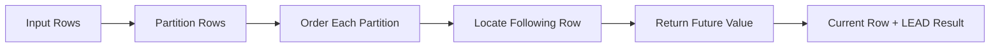

# 03- LEAD

## Overview

`LEAD()` is a SQL window function that retrieves a value from a subsequent row in an ordered window without collapsing the result set.

It is the forward-looking counterpart to `LAG()`:

- `LAG()` looks backward.
- `LEAD()` looks forward.

This makes `LEAD()` useful whenever the meaning of the current row depends on what happens next:

- Finding the next event
- Calculating time until the next event
- Determining how long a state lasted
- Comparing the current price with the next price
- Identifying the next deployment
- Building event sessions
- Detecting gaps between records
- Analyzing ordered business workflows

The general syntax is:

```sql
LEAD(value_expression [, offset [, default]])
OVER (
    [PARTITION BY partition_expression]
    ORDER BY ordering_expression
)
```

The critical concept is that **"next" is defined by the window's `ORDER BY`**, not by physical storage order or insertion order.

## Why `LEAD()` Exists

Consider an order status history:

| order_id | status | changed_at |
|---:|---|---|
| 1001 | pending | 09:00 |
| 1001 | paid | 09:03 |
| 1001 | shipped | 09:45 |
| 1001 | delivered | 14:20 |

Suppose the application needs to know the next state:

| status | next_status |
|---|---|
| pending | paid |
| paid | shipped |
| shipped | delivered |
| delivered | `NULL` |

Without `LEAD()`, this commonly requires a self-join or correlated query to locate the next record.

With `LEAD()`:

```sql
SELECT
    order_id,
    status,
    changed_at,
    LEAD(status) OVER (
        PARTITION BY order_id
        ORDER BY changed_at, id
    ) AS next_status
FROM order_status_history;
```

The original rows remain intact while the next row's value is added.

## Syntax

```sql
LEAD(
    value_expression
    [, offset]
    [, default]
) OVER (
    [PARTITION BY partition_expression]
    ORDER BY ordering_expression
)
```

| Component | Purpose |
|---|---|
| `value_expression` | Column or expression whose future value is retrieved |
| `offset` | Number of rows forward to look |
| `default` | Value returned when the requested future row does not exist |
| `PARTITION BY` | Creates independent sequences |
| `ORDER BY` | Defines what "next" means |

Basic usage:

```sql
SELECT
    created_at,
    amount,
    LEAD(amount) OVER (
        ORDER BY created_at, id
    ) AS next_amount
FROM payments;
```

## How `LEAD()` Works

Conceptually, the database creates an ordered sequence and evaluates each row against a later position:

```text
Partition
────────────────────────────────────────────
09:00     $100
09:05     $250
09:15     $175
09:30     $400
────────────────────────────────────────────

Current row       LEAD(amount)
09:00             $250
09:05             $175
09:15             $400
09:30             NULL
```

For each row, `LEAD()` moves forward by the specified offset.



## Default Offset

If the offset is omitted, it defaults to `1`.

These expressions are equivalent:

```sql
LEAD(amount) OVER (
    ORDER BY created_at
)
```

```sql
LEAD(amount, 1) OVER (
    ORDER BY created_at
)
```

Both retrieve the immediately following row.

## Offset

The offset controls how many rows forward the function looks.

```sql
SELECT
    created_at,
    amount,
    LEAD(amount, 2) OVER (
        ORDER BY created_at, id
    ) AS amount_two_rows_ahead
FROM payments;
```

For:

| amount |
|---:|
| 100 |
| 200 |
| 300 |
| 400 |

the result is:

| amount | amount_two_rows_ahead |
|---:|---:|
| 100 | 300 |
| 200 | 400 |
| 300 | `NULL` |
| 400 | `NULL` |

The offset is **row-based**.

`LEAD(amount, 1)` means:

> Retrieve the value from one following row.

It does not mean:

> Retrieve the value one hour, day, or week later.

This distinction is critical for irregular event streams.

## Default Value

The third argument provides a value when the requested following row does not exist.

```sql
SELECT
    created_at,
    amount,
    LEAD(amount, 1, 0) OVER (
        ORDER BY created_at, id
    ) AS next_amount
FROM payments;
```

Without a default:

```text
100 → 200
200 → 300
300 → NULL
```

With `0` as the default:

```text
100 → 200
200 → 300
300 → 0
```

Use defaults carefully. `NULL` communicates that no following row exists, while `0` represents an actual numeric value. Replacing the former with the latter can introduce incorrect business semantics.

## `PARTITION BY`

`PARTITION BY` creates independent sequences.

Suppose payments belong to different customers:

| customer_id | created_at | amount |
|---:|---|---:|
| 1 | 09:00 | 100 |
| 1 | 10:00 | 200 |
| 2 | 09:30 | 500 |
| 2 | 11:00 | 300 |

Use:

```sql
SELECT
    customer_id,
    created_at,
    amount,
    LEAD(amount) OVER (
        PARTITION BY customer_id
        ORDER BY created_at, id
    ) AS next_amount
FROM payments;
```

Result:

| customer_id | amount | next_amount |
|---:|---:|---:|
| 1 | 100 | 200 |
| 1 | 200 | `NULL` |
| 2 | 500 | 300 |
| 2 | 300 | `NULL` |

Without `PARTITION BY`, the "next" row could belong to a different customer.

### Production Rule

If the requirement is:

> "Find the next record for this entity"

the entity generally belongs in `PARTITION BY`.

Common examples:

```sql
PARTITION BY order_id
```

```sql
PARTITION BY customer_id
```

```sql
PARTITION BY account_id
```

```sql
PARTITION BY device_id
```

```sql
PARTITION BY service_id
```

## `ORDER BY` Defines "Next"

`LEAD()` depends on a deterministic ordering.

This:

```sql
LEAD(status) OVER (
    PARTITION BY order_id
    ORDER BY changed_at
)
```

is only deterministic if `changed_at` uniquely identifies the sequence.

Suppose two events have the same timestamp:

| id | order_id | changed_at | status |
|---:|---:|---|---|
| 10 | 1001 | 09:00 | pending |
| 11 | 1001 | 09:00 | paid |
| 12 | 1001 | 09:05 | shipped |

The database has no business-defined order between IDs `10` and `11` if only `changed_at` is specified.

Prefer:

```sql
ORDER BY changed_at, id
```

where `id` is a stable unique tie-breaker.

## Deterministic Ordering

For production event histories, define a complete ordering:

```sql
ORDER BY event_time, event_id
```

rather than:

```sql
ORDER BY event_time
```

when timestamps can collide.

This matters for:

- Audit histories
- Financial transactions
- State transitions
- CDC events
- Deployment histories
- User activity
- Message processing records

Never depend on:

- Physical row order
- Insertion order
- Clustered storage order
- Primary-key order unless it represents the intended business sequence
- An unordered query result

## Finding the Next Event

A common event-processing query is:

```sql
SELECT
    user_id,
    occurred_at,
    event_type,
    LEAD(occurred_at) OVER (
        PARTITION BY user_id
        ORDER BY occurred_at, id
    ) AS next_event_at
FROM user_events;
```

The result might look like:

| event_type | occurred_at | next_event_at |
|---|---|---|
| login | 09:00 | 09:05 |
| view_product | 09:05 | 09:12 |
| add_to_cart | 09:12 | 09:15 |
| purchase | 09:15 | `NULL` |

This provides the basis for event-duration analysis.

## Calculating Time Until the Next Event

In PostgreSQL:

```sql
SELECT
    user_id,
    event_type,
    occurred_at,
    LEAD(occurred_at) OVER (
        PARTITION BY user_id
        ORDER BY occurred_at, id
    ) - occurred_at AS time_until_next_event
FROM user_events;
```

Example:

| event_type | occurred_at | time_until_next_event |
|---|---|---|
| login | 09:00 | `00:05:00` |
| view_product | 09:05 | `00:07:00` |
| add_to_cart | 09:12 | `00:03:00` |
| purchase | 09:15 | `NULL` |

This is useful for:

- User-session analysis
- Workflow timing
- Processing latency
- Event-stream analysis
- Operational investigations

## Measuring State Duration

`LEAD()` is especially valuable when records represent state transitions.

Consider:

| order_id | status | changed_at |
|---:|---|---|
| 1001 | pending | 09:00 |
| 1001 | paid | 09:03 |
| 1001 | processing | 09:10 |
| 1001 | shipped | 09:45 |

To calculate how long each state lasted:

```sql
WITH ordered_states AS (
    SELECT
        order_id,
        status,
        changed_at,
        LEAD(changed_at) OVER (
            PARTITION BY order_id
            ORDER BY changed_at, id
        ) AS next_changed_at
    FROM order_status_history
)
SELECT
    order_id,
    status,
    changed_at,
    next_changed_at,
    next_changed_at - changed_at AS state_duration
FROM ordered_states;
```

Result:

| status | changed_at | next_changed_at | state_duration |
|---|---|---|---|
| pending | 09:00 | 09:03 | 3 minutes |
| paid | 09:03 | 09:10 | 7 minutes |
| processing | 09:10 | 09:45 | 35 minutes |
| shipped | 09:45 | `NULL` | `NULL` |

The final state has no known end time unless another source provides one.

## Finding Gaps Between Events

`LEAD()` can identify the start and end of gaps.

```sql
WITH events AS (
    SELECT
        user_id,
        occurred_at,
        LEAD(occurred_at) OVER (
            PARTITION BY user_id
            ORDER BY occurred_at, id
        ) AS next_occurred_at
    FROM user_events
)
SELECT
    user_id,
    occurred_at,
    next_occurred_at,
    next_occurred_at - occurred_at AS gap
FROM events
WHERE next_occurred_at - occurred_at > INTERVAL '30 minutes';
```

This identifies periods where no event occurred for more than 30 minutes.

For sessionization, the logic can then be expanded to assign session boundaries.

## Comparing Current and Next Values

`LEAD()` can compare a row with its future state.

```sql
WITH ordered_prices AS (
    SELECT
        product_id,
        recorded_at,
        price,
        LEAD(price) OVER (
            PARTITION BY product_id
            ORDER BY recorded_at, id
        ) AS next_price
    FROM product_price_history
)
SELECT
    product_id,
    recorded_at,
    price,
    next_price,
    next_price - price AS future_price_change
FROM ordered_prices;
```

This is useful when analyzing:

- Price changes
- Configuration changes
- Score progression
- Inventory changes
- Metric trends
- Version transitions

## Detecting State Transitions

`LEAD()` can be used to inspect where the current state will transition next.

```sql
WITH ordered_events AS (
    SELECT
        order_id,
        status,
        changed_at,
        LEAD(status) OVER (
            PARTITION BY order_id
            ORDER BY changed_at, id
        ) AS next_status
    FROM order_status_history
)
SELECT
    order_id,
    status,
    next_status,
    changed_at
FROM ordered_events
WHERE status IS DISTINCT FROM next_status;
```

This can reveal transitions such as:

```text
pending → paid
paid → processing
processing → shipped
shipped → delivered
```

It can also help identify invalid transitions by comparing observed transitions against an expected state machine.

## Detecting Duplicate Consecutive States

Consider:

```text
pending
paid
paid
paid
shipped
```

Use:

```sql
WITH ordered_events AS (
    SELECT
        order_id,
        status,
        changed_at,
        LEAD(status) OVER (
            PARTITION BY order_id
            ORDER BY changed_at, id
        ) AS next_status
    FROM order_status_history
)
SELECT *
FROM ordered_events
WHERE status = next_status;
```

This identifies consecutive duplicate states.

The same pattern can help investigate:

- Duplicate events
- Faulty producers
- Idempotency failures
- Repeated state writes
- Event replay problems

## `LEAD()` vs `LAG()`

The core difference is direction:

| Function | Direction | Typical question |
|---|---|---|
| `LAG()` | Backward | What happened immediately before this row? |
| `LEAD()` | Forward | What happens immediately after this row? |

For:

```text
A → B → C → D
```

At row `C`:

```text
LAG()  → B
LEAD() → D
```

Use `LAG()` for historical comparison and `LEAD()` for forward-looking comparison.

They can also be combined:

```sql
SELECT
    occurred_at,
    event_type,
    LAG(occurred_at) OVER (
        PARTITION BY user_id
        ORDER BY occurred_at, id
    ) AS previous_event_at,
    LEAD(occurred_at) OVER (
        PARTITION BY user_id
        ORDER BY occurred_at, id
    ) AS next_event_at
FROM user_events;
```

This produces a local neighborhood around every event.

## `LEAD()` vs `FIRST_VALUE()` and `LAST_VALUE()`

These functions answer different questions.

| Function | Question |
|---|---|
| `LEAD()` | What value exists at a specified future row? |
| `LAG()` | What value existed at a specified previous row? |
| `FIRST_VALUE()` | What value belongs to the first row of the window frame? |
| `LAST_VALUE()` | What value belongs to the last row of the window frame? |

For example:

```sql
SELECT
    amount,
    LEAD(amount) OVER (
        ORDER BY created_at, id
    ) AS next_amount,
    FIRST_VALUE(amount) OVER (
        ORDER BY created_at, id
    ) AS first_amount
FROM payments;
```

`LEAD()` is position-relative to the current row, while `FIRST_VALUE()` is relative to the window frame.

## `LEAD()` and Window Frames

`LEAD()` uses an offset relative to the current row and does not depend on a window frame in the same way that functions such as `LAST_VALUE()` do.

For example:

```sql
LEAD(amount) OVER (
    PARTITION BY customer_id
    ORDER BY created_at, id
)
```

is generally sufficient.

Do not add frame clauses mechanically. Understand whether the function's semantics actually depend on the frame.

This distinction becomes important when combining multiple value functions in the same analytical query.

## Filtering Before or After `LEAD()`

Window functions operate over the rows visible to their query block.

Consider:

```sql
SELECT
    user_id,
    occurred_at,
    event_type,
    LEAD(event_type) OVER (
        PARTITION BY user_id
        ORDER BY occurred_at, id
    ) AS next_event
FROM user_events
WHERE event_type = 'purchase';
```

Here, `LEAD()` only sees purchase events.

If the requirement is:

> Find the event immediately following each purchase, regardless of event type.

the query must calculate `LEAD()` before filtering:

```sql
WITH ordered_events AS (
    SELECT
        user_id,
        occurred_at,
        event_type,
        LEAD(event_type) OVER (
            PARTITION BY user_id
            ORDER BY occurred_at, id
        ) AS next_event
    FROM user_events
)
SELECT *
FROM ordered_events
WHERE event_type = 'purchase';
```

This distinction is a common source of incorrect analytical queries.

## Multiple `LEAD()` Calls

You can retrieve multiple future positions:

```sql
SELECT
    customer_id,
    created_at,
    amount,
    LEAD(amount, 1) OVER (
        PARTITION BY customer_id
        ORDER BY created_at, id
    ) AS amount_next,
    LEAD(amount, 2) OVER (
        PARTITION BY customer_id
        ORDER BY created_at, id
    ) AS amount_two_rows_ahead
FROM payments;
```

This is useful for sequence analysis and forecasting-style reporting.

Remember that the offsets represent row positions, not elapsed time.

## Combining `LAG()` and `LEAD()`

A powerful event-analysis pattern is to retrieve both neighbors:

```sql
SELECT
    user_id,
    occurred_at,
    event_type,
    LAG(event_type) OVER (
        PARTITION BY user_id
        ORDER BY occurred_at, id
    ) AS previous_event,
    LEAD(event_type) OVER (
        PARTITION BY user_id
        ORDER BY occurred_at, id
    ) AS next_event
FROM user_events;
```

The resulting structure is:

```text
previous event ← current event → next event
```

This is useful for:

- Sequence-pattern detection
- Event classification
- Session analysis
- Workflow validation
- Behavioral analytics

## Production Performance

`LEAD()` commonly requires the database to establish the requested partition ordering.

For example:

```sql
SELECT
    customer_id,
    created_at,
    amount,
    LEAD(amount) OVER (
        PARTITION BY customer_id
        ORDER BY created_at, id
    ) AS next_amount
FROM payments;
```

On a large table, sorting and processing the window can be expensive.

Inspect the actual plan:

```sql
EXPLAIN (ANALYZE, BUFFERS)
SELECT
    customer_id,
    created_at,
    amount,
    LEAD(amount) OVER (
        PARTITION BY customer_id
        ORDER BY created_at, id
    ) AS next_amount
FROM payments;
```

Pay attention to:

- Sort operations
- Sort memory
- Temporary disk usage
- Number of rows entering the window operation
- Sequential scans
- Join expansion
- Filter selectivity
- Execution time

An index aligned with the partition and ordering columns may help:

```sql
CREATE INDEX idx_payments_customer_created_id
ON payments (customer_id, created_at, id);
```

However, an index does not guarantee that PostgreSQL will avoid sorting. The planner considers the complete query, estimated costs, filters, and available access paths.

Always validate with realistic data and execution plans.

## Large Event Tables

Avoid calculating a window over an unnecessarily large dataset.

If an API only needs one customer:

```sql
WHERE customer_id = $1
```

If the requirement is time-bounded:

```sql
WHERE occurred_at >= $1
  AND occurred_at < $2
```

But filtering the source rows changes the window population.

Suppose the first event inside the reporting period has a previous event just before the period starts. That earlier event is invisible if it was filtered out before `LEAD()` or `LAG()` is evaluated.

When historical context matters, retrieve sufficient context first and apply the final filter afterward.

## Backend API Example

A backend service can expose the next event and event duration directly from PostgreSQL:

```sql
WITH ordered_events AS (
    SELECT
        user_id,
        occurred_at,
        event_type,
        LEAD(occurred_at) OVER (
            PARTITION BY user_id
            ORDER BY occurred_at, id
        ) AS next_event_at
    FROM user_events
    WHERE user_id = $1
)
SELECT
    occurred_at,
    event_type,
    next_event_at,
    next_event_at - occurred_at AS duration_until_next_event
FROM ordered_events
ORDER BY occurred_at;
```

A Django or FastAPI service can return this result directly rather than loading the complete event history into Python and performing row-by-row processing in application memory.

This is usually preferable when the computation is relational and the database can execute it efficiently.

## Production Considerations

### Event Ordering

Define the authoritative sequence explicitly.

For example:

```sql
ORDER BY occurred_at, event_id
```

Determine whether the timestamp represents:

- Business event time
- Ingestion time
- Processing time

These can produce different sequences.

### Late-Arriving Events

If an event arrives late but has an earlier business timestamp, `LEAD()` will place it according to the specified ordering.

That may differ from ingestion order.

For audit and financial systems, the authoritative ordering rule should be explicit and documented.

### Mutable Histories

If historical rows can be updated or deleted, the result of `LEAD()` can change.

For audit-sensitive workloads, immutable event histories provide more reproducible analytical results.

### Multi-Tenant Systems

This:

```sql
PARTITION BY tenant_id
```

only defines an analytical partition.

It does not provide tenant security.

Authorization and tenant isolation must be enforced independently through the application's data-access controls.

### Transaction Consistency

`LEAD()` operates over the rows visible to the query's transaction.

Concurrent changes to the underlying event history can therefore affect results between executions.

For important reports and reconciliations, use a consistent transaction boundary and well-defined source data.

## Common Mistakes

| Mistake | Problem | Better approach |
|---|---|---|
| Omitting `ORDER BY` | "Next" has no deterministic meaning | Define the required sequence |
| Forgetting `PARTITION BY` | The next row can belong to another entity | Partition by the entity |
| Ordering only by a non-unique timestamp | Tied rows can be ambiguous | Add a stable unique tie-breaker |
| Assuming offset means time | `LEAD(..., 1)` means one row forward | Use timestamp calculations for elapsed time |
| Replacing missing future rows with `0` | No future row becomes indistinguishable from zero | Preserve `NULL` unless zero is correct |
| Filtering before `LEAD()` unintentionally | Rows needed for future context disappear | Calculate the window before final filtering |
| Relying on physical row order | Storage order is not a business ordering | Always define `ORDER BY` |
| Assuming an index guarantees no sort | The optimizer may still need to sort | Validate using `EXPLAIN (ANALYZE, BUFFERS)` |
| Processing the entire history in Python | Increases network and application overhead | Push relational sequence analysis into SQL |

## Interview Traps

### What Does `LEAD()` Return for the Last Row?

Normally:

```text
NULL
```

because there is no following row.

A default can change this:

```sql
LEAD(amount, 1, 0) OVER (...)
```

### Does `LEAD()` Modify or Collapse Rows?

No.

It returns a value alongside every existing row.

### Does `LEAD()` Mean the Next Inserted Row?

No.

It means the next row according to the window's `ORDER BY`.

### Does `LEAD(value, 1)` Mean One Day Later?

No.

It means one row forward.

### Why Add a Unique Tie-Breaker?

Because:

```sql
ORDER BY occurred_at
```

may not uniquely determine the sequence.

Prefer:

```sql
ORDER BY occurred_at, id
```

when `id` provides deterministic ordering.

### Can `LEAD()` Be Used for Duration Calculations?

Yes.

A common PostgreSQL pattern is:

```sql
LEAD(occurred_at) OVER (
    PARTITION BY user_id
    ORDER BY occurred_at, id
) - occurred_at
```

The final row generally has no future timestamp and therefore produces `NULL`.

### Does `WHERE` Run Before `LEAD()`?

Within the logical query-processing model, `WHERE` removes rows before the window function operates in that query block.

Use a CTE or subquery when the window must see rows that will later be filtered.

## When to Use `LEAD()`

Use `LEAD()` when the business requirement needs information from a later row in an ordered sequence.

Common production use cases include:

- Next event detection
- Time until the next event
- State-duration calculation
- Workflow transition analysis
- Price-change analysis
- Configuration-version comparison
- Event-gap detection
- Sessionization
- Sequence-pattern analysis
- Deployment analysis
- Audit-history analysis

Avoid using `LEAD()` when the requirement is based on elapsed time but the query only models row positions. Combine it with timestamp arithmetic or another time-aware approach when the business requirement is temporal.

## Key Takeaways

- **`LEAD()` retrieves a value from a subsequent row according to the window's `ORDER BY`; it is the forward-looking counterpart to `LAG()`.**
- **Use `PARTITION BY` for independent entity sequences and add a deterministic tie-breaker when the ordering column is not unique.**
- **Offsets are row-based, not time-based; use timestamp arithmetic when the requirement concerns elapsed time.**
- **Calculate `LEAD()` before filtering when the future context must include rows that are excluded from the final result.**
- **For production workloads, minimize the window input, preserve meaningful `NULL` semantics, and validate sorting and execution costs with `EXPLAIN (ANALYZE, BUFFERS)`.**