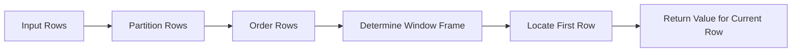

# 04- FIRST_VALUE

## Overview

`FIRST_VALUE()` is a SQL window value function that returns the value from the first row of a window frame.

It is useful when each row needs to be compared with, or enriched by, a reference value from the beginning of an ordered sequence without collapsing the result set.

Typical backend and analytical use cases include:

- Comparing every order against a customer's first order
- Finding the initial state of a workflow
- Comparing current values with an account's opening value
- Retrieving the first event in a user's activity sequence
- Carrying an initial configuration value across related rows
- Calculating change from the first observed value
- Identifying the first or baseline record within each entity

The key distinction from `LAG()` and `LEAD()` is that `FIRST_VALUE()` is generally concerned with a **reference position in the window frame**, rather than a fixed number of rows immediately before or after the current row.

## Syntax

```sql
FIRST_VALUE(value_expression) OVER (
    [PARTITION BY partition_expression]
    ORDER BY ordering_expression
    [frame_clause]
)
```

Example:

```sql
SELECT
    customer_id,
    created_at,
    amount,
    FIRST_VALUE(amount) OVER (
        PARTITION BY customer_id
        ORDER BY created_at, id
    ) AS first_amount
FROM payments;
```

| Component | Purpose |
|---|---|
| `value_expression` | Value to retrieve from the first row |
| `PARTITION BY` | Creates independent sequences |
| `ORDER BY` | Determines which row is first |
| `frame_clause` | Controls the rows included in the window frame |

The `ORDER BY` is essential because "first" has no meaningful definition without an ordering rule.

## Why `FIRST_VALUE()` Exists

A normal aggregate such as:

```sql
MIN(amount)
```

answers:

> What is the smallest amount?

It does **not** necessarily answer:

> What was the amount on the first chronological row?

These are different requirements.

For example:

| created_at | amount |
|---|---:|
| 09:00 | 500 |
| 10:00 | 200 |
| 11:00 | 700 |

`MIN(amount)` returns `200`.

`FIRST_VALUE(amount)` ordered chronologically returns `500`.

```sql
SELECT
    created_at,
    amount,
    FIRST_VALUE(amount) OVER (
        ORDER BY created_at, id
    ) AS first_amount
FROM payments;
```

Result:

| created_at | amount | first_amount |
|---|---:|---:|
| 09:00 | 500 | 500 |
| 10:00 | 200 | 500 |
| 11:00 | 700 | 500 |

The function therefore preserves the row-level result while providing a value from the beginning of the ordered sequence.

## Basic Example

Consider customer payments:

```sql
CREATE TABLE payments (
    id BIGINT PRIMARY KEY,
    customer_id BIGINT NOT NULL,
    amount NUMERIC(12, 2) NOT NULL,
    created_at TIMESTAMPTZ NOT NULL
);
```

Retrieve each payment alongside the customer's first payment amount:

```sql
SELECT
    customer_id,
    created_at,
    amount,
    FIRST_VALUE(amount) OVER (
        PARTITION BY customer_id
        ORDER BY created_at, id
    ) AS first_payment_amount
FROM payments;
```

Possible result:

| customer_id | created_at | amount | first_payment_amount |
|---:|---|---:|---:|
| 101 | 09:00 | 100.00 | 100.00 |
| 101 | 10:00 | 250.00 | 100.00 |
| 101 | 11:00 | 175.00 | 100.00 |
| 202 | 08:30 | 500.00 | 500.00 |
| 202 | 09:45 | 300.00 | 500.00 |

Each customer receives an independent first value because of `PARTITION BY customer_id`.

## How `FIRST_VALUE()` Works

Conceptually, the database:

1. Divides rows into partitions.
2. Orders each partition.
3. Determines the applicable window frame.
4. Finds the first row within that frame.
5. Returns the requested expression from that row.
6. Produces one result for every input row.

For a single partition:

```text
Ordered rows
────────────────────────────────────
Row 1       Row 2       Row 3       Row 4
  ↓
FIRST_VALUE
```

For each row, the function can reference the beginning of the applicable frame.



## `PARTITION BY`

`PARTITION BY` determines the independent groups over which the function operates.

Without it:

```sql
FIRST_VALUE(amount) OVER (
    ORDER BY created_at, id
)
```

the first row belongs to the entire result set.

With:

```sql
FIRST_VALUE(amount) OVER (
    PARTITION BY customer_id
    ORDER BY created_at, id
)
```

each customer has its own first value.

This pattern is common for:

- Customer histories
- Account transactions
- Device telemetry
- User events
- Product price histories
- Order state histories
- Service deployments

A useful production rule is:

> If "first" means the first record for each business entity, that entity normally belongs in `PARTITION BY`.

## `ORDER BY` Defines "First"

The first row is determined by the window's ordering.

For chronological data:

```sql
ORDER BY created_at, id
```

For highest-priority data:

```sql
ORDER BY priority DESC, id
```

For earliest deployment:

```sql
ORDER BY deployed_at, deployment_id
```

For highest score:

```sql
ORDER BY score DESC, id
```

The word "first" therefore does not inherently mean earliest timestamp. It means the first row according to the specified ordering.

## Deterministic Ordering

A production query should define a deterministic ordering whenever ties are possible.

Avoid:

```sql
ORDER BY created_at
```

if multiple rows can have the same timestamp.

Prefer:

```sql
ORDER BY created_at, id
```

where `id` is a stable unique tie-breaker.

For example:

| id | created_at | amount |
|---:|---|---:|
| 10 | 09:00 | 100 |
| 11 | 09:00 | 200 |
| 12 | 09:05 | 300 |

If the business sequence is defined by timestamp followed by ID:

```sql
ORDER BY created_at, id
```

then row `10` is unambiguously first.

This matters for:

- Financial transactions
- Audit records
- State histories
- CDC data
- User events
- Deployment records

Never rely on physical table order to determine which row is first.

## The Important Role of the Window Frame

`FIRST_VALUE()` is sensitive to the window frame.

Consider:

```sql
FIRST_VALUE(amount) OVER (
    PARTITION BY customer_id
    ORDER BY created_at, id
)
```

For common chronological use cases, this gives the first value as the frame progresses.

Explicitly specifying the frame can make the intended semantics clearer:

```sql
FIRST_VALUE(amount) OVER (
    PARTITION BY customer_id
    ORDER BY created_at, id
    ROWS BETWEEN UNBOUNDED PRECEDING AND CURRENT ROW
)
```

This means:

> Start at the first row of the partition and include rows through the current row.

For a first-value calculation, this is often the most intuitive frame.

## Full-Partition Reference

If the intended semantics are explicitly:

> Always use the first row of the entire partition.

you can define the complete partition frame:

```sql
FIRST_VALUE(amount) OVER (
    PARTITION BY customer_id
    ORDER BY created_at, id
    ROWS BETWEEN UNBOUNDED PRECEDING AND UNBOUNDED FOLLOWING
)
```

This makes the full-partition intent explicit.

For `FIRST_VALUE()`, the first row remains the beginning of the ordered partition, so a full-partition frame is often semantically equivalent for this particular use case. Explicit frames become especially important when combining value functions whose behavior depends on the frame boundary.

## `ROWS` vs `RANGE`

When precise row-based semantics matter, prefer an explicit `ROWS` frame.

Example:

```sql
FIRST_VALUE(amount) OVER (
    PARTITION BY customer_id
    ORDER BY created_at, id
    ROWS BETWEEN UNBOUNDED PRECEDING AND CURRENT ROW
)
```

`ROWS` describes physical row positions in the ordered window.

`RANGE` uses ordering-value semantics and can treat peer rows differently when ordering values are equal.

For production analytics where deterministic row-by-row behavior is required, using a unique ordering and an explicit `ROWS` frame can make the query easier to reason about.

## `FIRST_VALUE()` vs `MIN()`

These functions answer different questions.

| Requirement | Appropriate function |
|---|---|
| Smallest value | `MIN()` |
| Value from chronologically first row | `FIRST_VALUE()` |
| Value from highest-priority row | `FIRST_VALUE()` with descending ordering |
| First row's ID | `FIRST_VALUE(id)` |
| First row's timestamp | `FIRST_VALUE(created_at)` |

Example:

```sql
SELECT
    customer_id,
    created_at,
    amount,
    MIN(amount) OVER (
        PARTITION BY customer_id
    ) AS minimum_amount,
    FIRST_VALUE(amount) OVER (
        PARTITION BY customer_id
        ORDER BY created_at, id
    ) AS first_amount
FROM payments;
```

A customer can have:

```text
First payment = $500
Minimum payment = $200
```

These are not interchangeable.

## Finding the First Event

For an event history:

```sql
SELECT
    user_id,
    occurred_at,
    event_type,
    FIRST_VALUE(event_type) OVER (
        PARTITION BY user_id
        ORDER BY occurred_at, id
    ) AS first_event
FROM user_events;
```

Possible result:

| user_id | occurred_at | event_type | first_event |
|---:|---|---|---|
| 1 | 09:00 | signup | signup |
| 1 | 09:05 | login | signup |
| 1 | 09:10 | view_product | signup |
| 2 | 10:00 | signup | signup |
| 2 | 10:20 | purchase | signup |

This can be useful for behavioral analytics and customer lifecycle analysis.

## Finding the First Timestamp

Sometimes the required value is the first timestamp rather than another column.

```sql
SELECT
    user_id,
    occurred_at,
    event_type,
    FIRST_VALUE(occurred_at) OVER (
        PARTITION BY user_id
        ORDER BY occurred_at, id
    ) AS first_event_at
FROM user_events;
```

For many simple "first timestamp" requirements, `MIN(occurred_at) OVER (...)` may be simpler.

Use `FIRST_VALUE()` when you need the value associated with a specific ordered row.

## Finding the First Row's Related Attribute

Suppose each deployment has a version:

```sql
SELECT
    service_id,
    deployed_at,
    version,
    FIRST_VALUE(version) OVER (
        PARTITION BY service_id
        ORDER BY deployed_at, deployment_id
    ) AS initial_version
FROM deployments;
```

This returns the version deployed first for each service while retaining every deployment row.

This is more expressive than separately calculating the earliest timestamp and joining back to the deployment table.

## Comparing Current Value with the First Value

A common analytical pattern is baseline comparison:

```sql
SELECT
    customer_id,
    created_at,
    amount,
    FIRST_VALUE(amount) OVER (
        PARTITION BY customer_id
        ORDER BY created_at, id
    ) AS first_amount,
    amount - FIRST_VALUE(amount) OVER (
        PARTITION BY customer_id
        ORDER BY created_at, id
    ) AS change_from_first
FROM payments;
```

Example:

| amount | first_amount | change_from_first |
|---:|---:|---:|
| 100 | 100 | 0 |
| 250 | 100 | 150 |
| 175 | 100 | 75 |

For readability and to avoid repeating the window expression, calculate the value once in a CTE:

```sql
WITH payment_history AS (
    SELECT
        customer_id,
        created_at,
        amount,
        FIRST_VALUE(amount) OVER (
            PARTITION BY customer_id
            ORDER BY created_at, id
        ) AS first_amount
    FROM payments
)
SELECT
    customer_id,
    created_at,
    amount,
    first_amount,
    amount - first_amount AS change_from_first
FROM payment_history;
```

## First State of a Workflow

`FIRST_VALUE()` works well with state histories.

```sql
SELECT
    order_id,
    status,
    changed_at,
    FIRST_VALUE(status) OVER (
        PARTITION BY order_id
        ORDER BY changed_at, id
    ) AS initial_status
FROM order_status_history;
```

This can support:

- Workflow analysis
- State-machine validation
- Operational reporting
- SLA analysis
- Order lifecycle reporting

If the first status is expected to always be `pending`, unexpected values can identify data-quality problems.

## Finding the First Non-NULL Value

`FIRST_VALUE()` does not universally provide a portable `IGNORE NULLS` behavior across SQL engines.

For example, if:

```text
NULL
NULL
A
B
```

is ordered chronologically, a straightforward `FIRST_VALUE(value)` can return `NULL`.

If the requirement is specifically:

> Find the first non-NULL value.

one portable approach is to alter the ordering so non-NULL values are preferred:

```sql
FIRST_VALUE(value) OVER (
    PARTITION BY entity_id
    ORDER BY
        CASE WHEN value IS NULL THEN 1 ELSE 0 END,
        occurred_at,
        id
)
```

This changes the ordering semantics, so use it only when that ordering represents the intended business rule.

Another approach is to filter candidate rows in a separate query and join the result back when the requirements are more complex.

Database-specific support varies, so verify the syntax and behavior for the target engine.

## Filtering Results Involving `FIRST_VALUE()`

Window functions are evaluated after `WHERE` filtering within the same query block.

This can change the rows visible to `FIRST_VALUE()`.

For example:

```sql
SELECT
    customer_id,
    created_at,
    amount,
    FIRST_VALUE(amount) OVER (
        PARTITION BY customer_id
        ORDER BY created_at, id
    ) AS first_amount
FROM payments
WHERE created_at >= DATE '2026-01-01';
```

Here, the first value means:

> First payment visible after the filter.

It does **not** necessarily mean:

> Customer's first payment ever.

If the business requirement is the customer's lifetime first payment, calculate it before applying the reporting-period filter:

```sql
WITH payment_history AS (
    SELECT
        customer_id,
        created_at,
        amount,
        FIRST_VALUE(amount) OVER (
            PARTITION BY customer_id
            ORDER BY created_at, id
        ) AS first_amount
    FROM payments
)
SELECT
    customer_id,
    created_at,
    amount,
    first_amount
FROM payment_history
WHERE created_at >= DATE '2026-01-01';
```

This is a critical distinction in reporting queries.

## Performance Considerations

Window functions may require the database to partition and order large amounts of data.

For:

```sql
FIRST_VALUE(amount) OVER (
    PARTITION BY customer_id
    ORDER BY created_at, id
)
```

the database needs an execution strategy capable of producing rows in the required partition/order sequence.

Inspect production queries with:

```sql
EXPLAIN (ANALYZE, BUFFERS)
SELECT
    customer_id,
    created_at,
    amount,
    FIRST_VALUE(amount) OVER (
        PARTITION BY customer_id
        ORDER BY created_at, id
    ) AS first_amount
FROM payments;
```

Look for:

- Large sort operations
- Disk-based sorts
- High row counts
- Sequential scans over large tables
- Expensive joins before the window operation
- Excessive memory consumption

An aligned index may help:

```sql
CREATE INDEX idx_payments_customer_created_id
ON payments (customer_id, created_at, id);
```

However, an index is not a guarantee that PostgreSQL will avoid sorting. Always verify the actual execution plan against production-scale data.

## Reduce the Window Input

A window function operates on the rows visible to its query block.

If a report only concerns a subset of entities, filtering before the window can significantly reduce work:

```sql
SELECT
    customer_id,
    created_at,
    amount,
    FIRST_VALUE(amount) OVER (
        PARTITION BY customer_id
        ORDER BY created_at, id
    ) AS first_amount
FROM payments
WHERE customer_id = $1;
```

For a multi-tenant system, similarly constrain the query to the appropriate tenant and authorized dataset.

Be careful, however, not to filter away historical rows required to define the intended "first" value.

## Backend Engineering Use Cases

`FIRST_VALUE()` is useful in backend systems when the database already owns the historical data and the application needs a row-level analytical result.

Examples include:

| Backend problem | `FIRST_VALUE()` usage |
|---|---|
| Customer lifecycle | Initial customer event |
| Payment history | First payment amount |
| Order history | Initial order state |
| Price history | Initial recorded price |
| Deployment history | Initial deployed version |
| Device telemetry | Initial observed reading |
| Account activity | Opening value |
| Audit history | Initial recorded attribute |

For Django or FastAPI services, this can keep analytical computation inside PostgreSQL instead of transferring large histories to Python.

For example, PostgreSQL can calculate the initial value and the application can serialize the resulting rows directly into a REST or gRPC response.

## Production Considerations

### Define What "First" Means

"First" should be a business rule, not an assumption.

Possible definitions include:

- Earliest business timestamp
- Earliest ingestion timestamp
- Lowest sequence number
- First successful transaction
- First non-cancelled record
- First record after account activation

Encode the intended definition directly into the query.

### Use Stable Tie-Breakers

Prefer:

```sql
ORDER BY occurred_at, event_id
```

over:

```sql
ORDER BY occurred_at
```

when timestamps can collide.

### Be Careful With Time Zones

For event histories stored as timestamps, ensure the ordering uses the intended time semantics.

In PostgreSQL, `TIMESTAMPTZ` is generally preferable for absolute event times when the application operates across time zones.

### Immutable History

For audit and event-history workloads, immutable records make "first" easier to reason about and make analytical results more reproducible.

If historical records can be rewritten, the initial value may change over time.

### Multi-Tenant Systems

`PARTITION BY tenant_id` controls analytical grouping, not authorization.

Tenant isolation must still be enforced through application-level access controls, database policies where appropriate, and parameterized queries.

### Data Quality

A "first" value can be technically correct but operationally wrong if source events are missing, duplicated, or arrive late.

For critical reporting, define:

- Source of truth
- Event ordering
- Deduplication rules
- Late-event handling
- Null semantics
- Correction procedures

## Common Mistakes

| Mistake | Why it happens | Better approach |
|---|---|---|
| Using `MIN()` instead of `FIRST_VALUE()` | Confusing smallest with first | Use `FIRST_VALUE()` when row order matters |
| Omitting `ORDER BY` | Assuming table order defines first | Explicitly define the business ordering |
| Forgetting `PARTITION BY` | Treating all entities as one sequence | Partition by the relevant entity |
| Ordering only by a timestamp | Timestamps can collide | Add a stable tie-breaker |
| Ignoring the window frame | `FIRST_VALUE()` is frame-sensitive | Understand and explicitly define the frame when needed |
| Filtering before calculating lifetime first value | Historical rows disappear | Calculate the window in a CTE/subquery first |
| Assuming first means earliest inserted row | Physical/insertion order may not represent business order | Use the authoritative sequence |
| Treating `NULL` as an ordinary first value | Missing data may produce unexpected results | Define explicit NULL semantics |
| Loading all history into Python | Adds network and application overhead | Push relational analysis into SQL |
| Assuming an index guarantees fast execution | The planner may still sort or scan | Validate with `EXPLAIN (ANALYZE, BUFFERS)` |

## Interview Traps

### Is `FIRST_VALUE()` an Aggregate Function?

No.

It is a **window value function**. It can return a value from a particular row while preserving the original row cardinality.

### Is `FIRST_VALUE()` the Same as `MIN()`?

No.

`MIN()` returns the smallest value.

`FIRST_VALUE()` returns the value associated with the first row according to the window ordering and frame.

### What Determines the First Row?

The window's `ORDER BY`.

For example:

```sql
ORDER BY created_at, id
```

means the earliest `created_at`, with `id` resolving ties.

### Why Is the Window Frame Important?

Because `FIRST_VALUE()` operates against the applicable window frame. Explicitly defining the frame can prevent ambiguity, especially in queries combining multiple window value functions.

### Does `FIRST_VALUE()` Collapse Rows?

No.

If the input contains 1,000 rows, the window expression normally returns a value for those same 1,000 rows.

### What Happens If the First Value Is `NULL`?

A straightforward `FIRST_VALUE()` can return `NULL`.

If the requirement is "first non-NULL value," that is a different requirement and should be expressed explicitly rather than assuming all databases support identical `IGNORE NULLS` syntax.

### Why Not Use a Correlated Subquery?

A correlated query can sometimes retrieve the first record, but `FIRST_VALUE()` is often clearer when the query already needs row-level analytical context.

For example:

```sql
SELECT
    customer_id,
    created_at,
    amount,
    FIRST_VALUE(amount) OVER (
        PARTITION BY customer_id
        ORDER BY created_at, id
    ) AS first_amount
FROM payments;
```

This directly communicates the analytical relationship.

## `FIRST_VALUE()` vs `LAG()` vs `LEAD()`

| Function | Relative reference | Typical question |
|---|---|---|
| `FIRST_VALUE()` | Beginning of window frame | What was the initial value? |
| `LAG()` | Previous row | What happened immediately before? |
| `LEAD()` | Following row | What happens immediately after? |

For an ordered sequence:

```text
A → B → C → D
```

`FIRST_VALUE()` can reference:

```text
A
```

while at row `C`:

```text
LAG()        → B
Current row  → C
LEAD()       → D
FIRST_VALUE()→ A
```

This distinction is useful when designing event and lifecycle queries.

## Practical Pattern: Customer Baseline

A production-style reporting query can establish a customer's initial purchase baseline:

```sql
WITH customer_payments AS (
    SELECT
        customer_id,
        created_at,
        amount,
        FIRST_VALUE(amount) OVER (
            PARTITION BY customer_id
            ORDER BY created_at, id
            ROWS BETWEEN UNBOUNDED PRECEDING AND CURRENT ROW
        ) AS initial_amount
    FROM payments
)
SELECT
    customer_id,
    created_at,
    amount,
    initial_amount,
    amount - initial_amount AS change_from_initial
FROM customer_payments
ORDER BY customer_id, created_at;
```

This pattern is useful for customer analytics, cohort reporting, and financial trend analysis.

The important engineering principle is to define the baseline explicitly and preserve the complete entity history needed to calculate it.

## Key Takeaways

- **`FIRST_VALUE()` returns a value from the first row of the applicable ordered window frame while preserving row-level results.**
- **`ORDER BY` defines what "first" means, and production queries should use a deterministic tie-breaker when ordering values can collide.**
- **`FIRST_VALUE()` is not interchangeable with `MIN()`; one is position-based while the other is value-based.**
- **Window-frame and filtering semantics matter: calculate the function over the complete dataset required to establish the intended baseline.**
- **For production workloads, minimize window input, define NULL and ordering semantics explicitly, and validate execution cost with realistic query plans.**