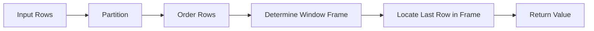

# 05- LAST_VALUE

## Overview

`LAST_VALUE()` is a SQL window value function that returns the value from the last row of the current window frame.

It is useful when each row needs access to a value from the end of an ordered sequence without collapsing the result set. Common backend engineering use cases include:

- Comparing the current value with the final value in a lifecycle
- Finding the final status of an order or workflow
- Comparing a historical price with the latest recorded price
- Determining the final version of a deployment sequence
- Calculating progress toward an eventual value
- Enriching event histories with partition-level endpoint values

`LAST_VALUE()` has one important trap: **the default window frame frequently ends at the current row**. As a result, a query that appears to request the "last value" can return the current row's value instead.

Understanding the window frame is therefore essential when using `LAST_VALUE()` in production.

## Syntax

```sql
LAST_VALUE(value_expression) OVER (
    [PARTITION BY partition_expression]
    ORDER BY ordering_expression
    [frame_clause]
)
```

Example:

```sql
SELECT
    customer_id,
    created_at,
    amount,
    LAST_VALUE(amount) OVER (
        PARTITION BY customer_id
        ORDER BY created_at, id
        ROWS BETWEEN UNBOUNDED PRECEDING AND UNBOUNDED FOLLOWING
    ) AS final_amount
FROM payments;
```

| Component | Purpose |
|---|---|
| `value_expression` | Value to retrieve from the last row |
| `PARTITION BY` | Defines independent sequences |
| `ORDER BY` | Defines the sequence and therefore what "last" means |
| `frame_clause` | Defines which rows are visible to `LAST_VALUE()` |

## Why `LAST_VALUE()` Exists

A normal aggregate such as:

```sql
MAX(amount)
```

answers:

> What is the largest amount?

It does not necessarily answer:

> What was the amount on the final chronological row?

Consider:

| created_at | amount |
|---|---:|
| 09:00 | 500 |
| 10:00 | 200 |
| 11:00 | 700 |

`MAX(amount)` returns `700`, but if the final chronological payment happened to be `$200`, then the final amount and maximum amount would be different.

`LAST_VALUE()` is position-oriented:

```sql
LAST_VALUE(amount) OVER (
    ORDER BY created_at, id
    ROWS BETWEEN UNBOUNDED PRECEDING AND UNBOUNDED FOLLOWING
)
```

It asks for the value associated with the final row in the ordered frame.

## The Most Important `LAST_VALUE()` Trap

Consider:

```sql
SELECT
    created_at,
    amount,
    LAST_VALUE(amount) OVER (
        ORDER BY created_at
    ) AS last_amount
FROM payments;
```

A common expectation is:

```text
500 → 700
200 → 700
700 → 700
```

But the result can instead behave like:

```text
500 → 500
200 → 200
700 → 700
```

Why?

Because the default frame for an ordered window commonly ends at the current row. Therefore, the last row **visible to the current row** is often the current row itself.

The fix is to explicitly extend the frame through the end of the partition:

```sql
SELECT
    created_at,
    amount,
    LAST_VALUE(amount) OVER (
        ORDER BY created_at, id
        ROWS BETWEEN UNBOUNDED PRECEDING AND UNBOUNDED FOLLOWING
    ) AS last_amount
FROM payments;
```

Now every row can see the final row.

## How `LAST_VALUE()` Works

Conceptually, the database:

1. Creates partitions.
2. Orders rows within each partition.
3. Determines the window frame for the current row.
4. Finds the last row inside that frame.
5. Returns `value_expression` from that row.
6. Produces one result for each input row.



The crucial point is that **"last" means last row of the frame, not automatically last row of the partition**.

## Basic Example

Consider an order status history:

```sql
CREATE TABLE order_status_history (
    id BIGINT PRIMARY KEY,
    order_id BIGINT NOT NULL,
    status TEXT NOT NULL,
    changed_at TIMESTAMPTZ NOT NULL
);
```

Retrieve the final status of every order alongside every historical status:

```sql
SELECT
    order_id,
    changed_at,
    status,
    LAST_VALUE(status) OVER (
        PARTITION BY order_id
        ORDER BY changed_at, id
        ROWS BETWEEN UNBOUNDED PRECEDING AND UNBOUNDED FOLLOWING
    ) AS final_status
FROM order_status_history;
```

Possible result:

| order_id | changed_at | status | final_status |
|---:|---|---|---|
| 101 | 09:00 | pending | shipped |
| 101 | 09:10 | paid | shipped |
| 101 | 09:30 | shipped | shipped |
| 202 | 10:00 | pending | cancelled |
| 202 | 10:15 | cancelled | cancelled |

Every historical row now knows the eventual status of its order.

## `PARTITION BY`

`PARTITION BY` creates independent sequences.

Without:

```sql
PARTITION BY order_id
```

the query considers the entire result set as one sequence.

With:

```sql
PARTITION BY order_id
```

each order has its own final value.

This pattern is useful for:

- Order histories
- Customer activity
- Account transactions
- Deployment histories
- Device telemetry
- Workflow state changes
- Product price histories

For example:

```sql
LAST_VALUE(status) OVER (
    PARTITION BY order_id
    ORDER BY changed_at, id
    ROWS BETWEEN UNBOUNDED PRECEDING AND UNBOUNDED FOLLOWING
)
```

means:

> For each order, find the status on the final row according to `changed_at, id`.

## `ORDER BY` Defines "Last"

`LAST_VALUE()` cannot determine a meaningful final row without ordering.

Chronological ordering:

```sql
ORDER BY changed_at, id
```

means:

> Last chronologically recorded row.

Priority ordering:

```sql
ORDER BY priority, id
```

means:

> Row with the greatest priority according to the ordering.

Descending ordering changes the meaning of "last":

```sql
ORDER BY changed_at DESC, id DESC
```

Now the first chronological event appears at the end of the ordering.

This is why `LAST_VALUE()` should always be read together with its `ORDER BY`.

## Deterministic Ordering

Production queries should use a stable tie-breaker when the primary ordering column is not unique.

Avoid:

```sql
ORDER BY changed_at
```

when multiple events can share the same timestamp.

Prefer:

```sql
ORDER BY changed_at, id
```

where `id` is unique and stable.

For example:

| id | changed_at | status |
|---:|---|---|
| 10 | 09:00 | paid |
| 11 | 09:00 | shipped |
| 12 | 09:05 | delivered |

The ordering:

```sql
ORDER BY changed_at, id
```

unambiguously establishes row `12` as the last row.

Do not rely on:

- Physical table order
- Insertion order
- Execution-plan order
- Storage layout
- Accidental ordering from an index

SQL result ordering is only guaranteed when explicitly requested.

## The Window Frame

The frame is the most important part of understanding `LAST_VALUE()`.

Consider:

```sql
ROWS BETWEEN UNBOUNDED PRECEDING AND CURRENT ROW
```

This means:

```text
First row ─────────────── Current row
         Window frame
```

Therefore, the last row in the frame is the current row.

For a true partition-wide final value:

```sql
ROWS BETWEEN UNBOUNDED PRECEDING AND UNBOUNDED FOLLOWING
```

the frame becomes:

```text
First row ───────────────────────── Last row
              Entire partition
```

Now `LAST_VALUE()` can return the final partition value for every row.

## Recommended Production Pattern

When the requirement is:

> Return the value from the final row of each partition.

Use an explicit full frame:

```sql
LAST_VALUE(value) OVER (
    PARTITION BY entity_id
    ORDER BY event_time, event_id
    ROWS BETWEEN UNBOUNDED PRECEDING AND UNBOUNDED FOLLOWING
)
```

This makes the intent explicit and avoids the most common `LAST_VALUE()` mistake.

## `ROWS` vs `RANGE`

`ROWS` defines the frame using physical row positions.

```sql
ROWS BETWEEN UNBOUNDED PRECEDING AND UNBOUNDED FOLLOWING
```

`RANGE` uses ordering-value semantics and can treat rows with equal ordering values as peers.

For production event histories, a deterministic ordering combined with an explicit `ROWS` frame is often easier to reason about.

For example:

```sql
ORDER BY occurred_at, event_id
ROWS BETWEEN UNBOUNDED PRECEDING AND UNBOUNDED FOLLOWING
```

makes both the ordering and frame boundaries explicit.

## `LAST_VALUE()` vs `MAX()`

These functions answer different questions.

| Requirement | Function |
|---|---|
| Numerically largest value | `MAX()` |
| Final chronological value | `LAST_VALUE()` |
| Final row's ID | `LAST_VALUE(id)` |
| Final row's status | `LAST_VALUE(status)` |
| Latest timestamp | Often `MAX(timestamp)` |
| Attribute associated with latest row | `LAST_VALUE(attribute)` |

Example:

```sql
SELECT
    order_id,
    status,
    changed_at,
    MAX(changed_at) OVER (
        PARTITION BY order_id
    ) AS latest_timestamp,
    LAST_VALUE(status) OVER (
        PARTITION BY order_id
        ORDER BY changed_at, id
        ROWS BETWEEN UNBOUNDED PRECEDING AND UNBOUNDED FOLLOWING
    ) AS final_status
FROM order_status_history;
```

`MAX(changed_at)` finds the greatest timestamp.

`LAST_VALUE(status)` retrieves the status associated with the final ordered row.

## Finding the Final Status

A common production pattern is to expose the eventual state on every historical row:

```sql
SELECT
    order_id,
    changed_at,
    status,
    LAST_VALUE(status) OVER (
        PARTITION BY order_id
        ORDER BY changed_at, id
        ROWS BETWEEN UNBOUNDED PRECEDING AND UNBOUNDED FOLLOWING
    ) AS final_status
FROM order_status_history;
```

This can support:

- Order lifecycle reporting
- Workflow analytics
- SLA analysis
- Operational dashboards
- State transition analysis

It is especially useful when the report needs both historical rows and the final state.

## Finding the Final Price

For product price history:

```sql
SELECT
    product_id,
    effective_at,
    price,
    LAST_VALUE(price) OVER (
        PARTITION BY product_id
        ORDER BY effective_at, price_history_id
        ROWS BETWEEN UNBOUNDED PRECEDING AND UNBOUNDED FOLLOWING
    ) AS final_recorded_price
FROM product_price_history;
```

This returns the price from the final history row, not necessarily the maximum price ever recorded.

If the table represents corrections or scheduled changes, verify that `effective_at` is actually the business ordering required by the application.

## Finding the Final Deployment Version

For deployment history:

```sql
SELECT
    service_id,
    deployed_at,
    version,
    LAST_VALUE(version) OVER (
        PARTITION BY service_id
        ORDER BY deployed_at, deployment_id
        ROWS BETWEEN UNBOUNDED PRECEDING AND UNBOUNDED FOLLOWING
    ) AS final_version
FROM deployments;
```

Every deployment row can now be compared with the final deployment version.

This can be useful for release analysis:

```sql
WITH deployment_history AS (
    SELECT
        service_id,
        deployed_at,
        version,
        LAST_VALUE(version) OVER (
            PARTITION BY service_id
            ORDER BY deployed_at, deployment_id
            ROWS BETWEEN UNBOUNDED PRECEDING AND UNBOUNDED FOLLOWING
        ) AS final_version
    FROM deployments
)
SELECT
    service_id,
    deployed_at,
    version,
    final_version,
    version = final_version AS is_current_version
FROM deployment_history;
```

## Comparing Current and Final Values

A typical analytical pattern compares historical values against the endpoint:

```sql
WITH price_history AS (
    SELECT
        product_id,
        effective_at,
        price,
        LAST_VALUE(price) OVER (
            PARTITION BY product_id
            ORDER BY effective_at, price_history_id
            ROWS BETWEEN UNBOUNDED PRECEDING AND UNBOUNDED FOLLOWING
        ) AS final_price
    FROM product_price_history
)
SELECT
    product_id,
    effective_at,
    price,
    final_price,
    price - final_price AS difference_from_final
FROM price_history;
```

This avoids pulling the complete history into Python merely to calculate a final reference value.

## `LAST_VALUE()` vs `LAG()` and `LEAD()`

The functions answer different positional questions.

For:

```text
A → B → C → D
```

at row `C`:

| Function | Referenced value |
|---|---|
| `LAG()` | `B` |
| Current row | `C` |
| `LEAD()` | `D` |
| `LAST_VALUE()` with full frame | `D` |

`LAG()` and `LEAD()` use relative offsets.

`LAST_VALUE()` references the final row of the applicable frame.

This distinction matters because:

```sql
LEAD(value)
```

usually means:

> What happens one or more rows after the current row?

while:

```sql
LAST_VALUE(value) OVER (
    ...
    ROWS BETWEEN UNBOUNDED PRECEDING AND UNBOUNDED FOLLOWING
)
```

means:

> What value exists at the end of this entire window?

## Filtering and Historical Context

Window functions operate on the rows visible to their query block.

Consider:

```sql
SELECT
    order_id,
    changed_at,
    status,
    LAST_VALUE(status) OVER (
        PARTITION BY order_id
        ORDER BY changed_at, id
        ROWS BETWEEN UNBOUNDED PRECEDING AND UNBOUNDED FOLLOWING
    ) AS final_status
FROM order_status_history
WHERE changed_at >= DATE '2026-01-01';
```

Here, `final_status` is the final status **among rows surviving the filter**.

It is not necessarily the order's final status across its complete history.

If the requirement is lifetime final status while displaying only 2026 rows, calculate the window first:

```sql
WITH history AS (
    SELECT
        order_id,
        changed_at,
        status,
        LAST_VALUE(status) OVER (
            PARTITION BY order_id
            ORDER BY changed_at, id
            ROWS BETWEEN UNBOUNDED PRECEDING AND UNBOUNDED FOLLOWING
        ) AS final_status
    FROM order_status_history
)
SELECT
    order_id,
    changed_at,
    status,
    final_status
FROM history
WHERE changed_at >= DATE '2026-01-01';
```

This distinction is critical in historical reporting.

## `LAST_VALUE()` and NULLs

If the final row contains `NULL`, a straightforward `LAST_VALUE()` can return `NULL`.

For example:

```text
A
B
NULL
```

with chronological ordering produces `NULL` as the final value.

Do not automatically interpret `NULL` as:

> No final value exists.

It may mean:

- Missing source data
- Explicitly cleared value
- Unknown state
- Incomplete ingestion
- Invalid historical record

If the business requirement is "last non-NULL value," use database-specific functionality where supported or construct an explicit ordering/filtering strategy.

Do not assume `IGNORE NULLS` syntax behaves identically across PostgreSQL, MySQL, SQL Server, Oracle, and other engines.

## Performance Considerations

Window functions can require significant work when operating over large partitions.

For:

```sql
LAST_VALUE(status) OVER (
    PARTITION BY order_id
    ORDER BY changed_at, id
    ROWS BETWEEN UNBOUNDED PRECEDING AND UNBOUNDED FOLLOWING
)
```

the database must establish the required partition and ordering before evaluating the window expression.

Inspect production queries with:

```sql
EXPLAIN (ANALYZE, BUFFERS)
SELECT
    order_id,
    changed_at,
    status,
    LAST_VALUE(status) OVER (
        PARTITION BY order_id
        ORDER BY changed_at, id
        ROWS BETWEEN UNBOUNDED PRECEDING AND UNBOUNDED FOLLOWING
    ) AS final_status
FROM order_status_history;
```

Pay attention to:

- Large sort operations
- Disk-based sorts
- Large partitions
- Excessive memory usage
- Rows processed before filtering
- Expensive joins before the window operation

An index aligned with the partition and ordering can sometimes help:

```sql
CREATE INDEX idx_order_status_history_order_changed_id
ON order_status_history (order_id, changed_at, id);
```

However, indexes do not guarantee that PostgreSQL will avoid sorting. Validate the actual execution plan using production-scale data.

## Reduce Window Input Carefully

If only a subset of orders is required, filtering early can reduce the window workload:

```sql
SELECT
    order_id,
    changed_at,
    status,
    LAST_VALUE(status) OVER (
        PARTITION BY order_id
        ORDER BY changed_at, id
        ROWS BETWEEN UNBOUNDED PRECEDING AND UNBOUNDED FOLLOWING
    ) AS final_status
FROM order_status_history
WHERE order_id = $1;
```

However, do not filter away rows required to determine the true final state.

For example, this can be semantically wrong:

```sql
WHERE changed_at >= CURRENT_DATE - INTERVAL '7 days'
```

if the final state may have been established outside that seven-day window.

Performance optimization must preserve the intended business semantics.

## Production Considerations

### Define the Meaning of "Last"

"Last" might mean:

- Latest event time
- Latest effective time
- Highest sequence number
- Last successfully processed event
- Last confirmed state
- Last event according to ingestion order

Choose the ordering column according to the business requirement.

### Use a Stable Tie-Breaker

Prefer:

```sql
ORDER BY changed_at, id
```

over:

```sql
ORDER BY changed_at
```

when timestamps are not unique.

### Be Explicit About the Frame

For partition-wide final values, prefer:

```sql
ROWS BETWEEN UNBOUNDED PRECEDING AND UNBOUNDED FOLLOWING
```

This prevents the common mistake where `LAST_VALUE()` returns the current row's value.

### Treat Historical Data as a Contract

For event-sourced or audit-style tables, establish:

- Ordering semantics
- Event immutability
- Late-event behavior
- Duplicate handling
- Correction policy
- NULL semantics

Without these rules, "last event" may not have stable business meaning.

### Time Zone Consistency

When timestamps represent real-world events across regions, use a consistent temporal representation.

In PostgreSQL, `TIMESTAMPTZ` is generally appropriate for absolute event times.

### Multi-Tenant Data

`PARTITION BY tenant_id` controls analytical grouping but is not an authorization mechanism.

Tenant isolation must still be enforced through:

- Parameterized queries
- Application authorization
- Database row-level security where appropriate
- Correct service-layer access controls

## Common Mistakes

| Mistake | Why it happens | Better approach |
|---|---|---|
| Omitting the frame | Assuming `LAST_VALUE()` automatically sees the whole partition | Use an explicit full frame for partition-wide final values |
| Using `MAX()` instead | Confusing largest value with final row's value | Use `LAST_VALUE()` when row position matters |
| Forgetting `PARTITION BY` | Treating independent entities as one sequence | Partition by the relevant entity |
| Ordering only by timestamp | Multiple rows can share timestamps | Add a deterministic tie-breaker |
| Assuming table order | Storage order is not guaranteed | Define `ORDER BY` explicitly |
| Filtering before calculating lifetime final value | Historical rows disappear | Calculate the window in a CTE/subquery first |
| Ignoring NULL semantics | Final row may contain NULL | Define how NULL should be interpreted |
| Using descending order unintentionally | "Last" changes meaning when ordering changes | Verify the ordering direction |
| Loading history into Python | Creates unnecessary network/application work | Perform row-relative analysis in SQL |
| Assuming indexes eliminate all sorting | Planner behavior depends on the query and data | Validate with `EXPLAIN (ANALYZE, BUFFERS)` |

## Interview Traps

### Why Does `LAST_VALUE()` Often Return the Current Row?

Because the default frame for an ordered window can end at the current row.

Therefore, the last row visible to the current row is the current row.

For a partition-wide final value, use:

```sql
ROWS BETWEEN UNBOUNDED PRECEDING AND UNBOUNDED FOLLOWING
```

### Is `LAST_VALUE()` the Same as `MAX()`?

No.

`MAX()` returns the largest value.

`LAST_VALUE()` returns the value from the last row according to the window's ordering and frame.

### Does `LAST_VALUE()` Return the Last Row of the Table?

No.

It returns the value from the last row of the **applicable window frame**.

`PARTITION BY` and the frame determine which rows are considered.

### Does `LAST_VALUE()` Collapse Rows?

No.

It is a window function and normally preserves the input row count.

### How Do You Get the Final Status of Every Order?

Use:

```sql
LAST_VALUE(status) OVER (
    PARTITION BY order_id
    ORDER BY changed_at, id
    ROWS BETWEEN UNBOUNDED PRECEDING AND UNBOUNDED FOLLOWING
)
```

The explicit frame is the important part.

### Why Is a Tie-Breaker Important?

If two rows have the same ordering value, the database needs a deterministic way to establish their relative order when business correctness depends on it.

Use a stable unique column such as an event ID.

### When Should You Use `MAX()` Instead?

Use `MAX()` when the requirement is actually:

> Find the greatest value.

Use `LAST_VALUE()` when the requirement is:

> Find the value belonging to the final ordered row.

## Practical Backend Pattern

Suppose an API needs to return every order status transition together with the order's eventual status.

PostgreSQL can perform the computation:

```sql
WITH status_history AS (
    SELECT
        order_id,
        changed_at,
        status,
        LAST_VALUE(status) OVER (
            PARTITION BY order_id
            ORDER BY changed_at, id
            ROWS BETWEEN UNBOUNDED PRECEDING AND UNBOUNDED FOLLOWING
        ) AS final_status
    FROM order_status_history
)
SELECT
    order_id,
    changed_at,
    status,
    final_status
FROM status_history
WHERE order_id = $1
ORDER BY changed_at, id;
```

A Django or FastAPI service can consume these rows directly rather than:

1. Fetching the entire history.
2. Sorting it in Python.
3. Finding the final state.
4. Attaching that value to every record.

Keeping relational operations inside PostgreSQL reduces application complexity and avoids unnecessary data transfer.

## Choosing Between Value Functions

| Requirement | Recommended function |
|---|---|
| Previous row's value | `LAG()` |
| Next row's value | `LEAD()` |
| First value in a window | `FIRST_VALUE()` |
| Final value in a full window | `LAST_VALUE()` |
| Smallest value | `MIN()` |
| Largest value | `MAX()` |
| Value from a specific relative offset | `LAG()` / `LEAD()` |

The most important distinction is whether the requirement is **value-based** or **position-based**.

## Key Takeaways

- **`LAST_VALUE()` returns the value from the last row of the applicable window frame, not automatically the last row of the partition.**
- **For a partition-wide final value, explicitly use `ROWS BETWEEN UNBOUNDED PRECEDING AND UNBOUNDED FOLLOWING`.**
- **`ORDER BY` defines what "last" means, so use the business-correct ordering and a deterministic tie-breaker.**
- **`LAST_VALUE()` is position-based and is not interchangeable with `MAX()`, which is value-based.**
- **For production workloads, preserve historical context, define NULL and ordering semantics explicitly, and validate window-query performance with realistic execution plans.**