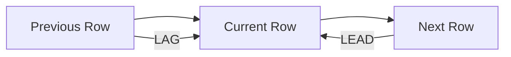

# 06- Previous and Next Row Analysis

## Overview

Previous-and-next-row analysis compares a row with adjacent rows in an ordered result set. SQL window functions make this possible without self-joins, correlated subqueries, or application-side iteration.

The primary functions are:

- `LAG()` — retrieves a value from a previous row.
- `LEAD()` — retrieves a value from a following row.

These functions are especially useful for event histories, time-series analysis, state transitions, price changes, user activity, operational metrics, and audit data.

The core pattern is:

```sql
LAG(value) OVER (
    PARTITION BY entity_id
    ORDER BY event_time, event_id
)
```

or:

```sql
LEAD(value) OVER (
    PARTITION BY entity_id
    ORDER BY event_time, event_id
)
```

The important engineering principle is that **previous and next are defined by the window's ordering, not by physical table order**.

## Why Previous and Next Row Analysis Matters

Backend systems frequently store data as sequences:

```text
Event A → Event B → Event C → Event D
```

Many business questions are relational between adjacent events:

- How much did the price change from the previous record?
- How long after the previous login did this login occur?
- What status came immediately before `shipped`?
- How long until the next scheduled event?
- Did a deployment immediately follow another deployment?
- What was the previous balance?
- What is the next event for this customer?

Without window functions, developers often resort to self-joins or application-side processing.

With `LAG()` and `LEAD()`, the database can perform this positional analysis directly.

## Core Functions

| Function | Relative position | Typical use |
|---|---|---|
| `LAG()` | Previous row | Previous state, previous price, previous event |
| `LEAD()` | Next row | Next event, next price, next scheduled action |
| `LAG(value, 2)` | Two rows before | Comparing against an earlier observation |
| `LEAD(value, 2)` | Two rows after | Looking ahead multiple events |

Basic example:

```sql
SELECT
    event_id,
    occurred_at,
    value,
    LAG(value) OVER (
        ORDER BY occurred_at, event_id
    ) AS previous_value,
    LEAD(value) OVER (
        ORDER BY occurred_at, event_id
    ) AS next_value
FROM events;
```

Possible result:

| event_id | value | previous_value | next_value |
|---:|---:|---:|---:|
| 1 | 100 | `NULL` | 120 |
| 2 | 120 | 100 | 115 |
| 3 | 115 | 120 | 130 |
| 4 | 130 | 115 | `NULL` |

## How `LAG()` Works

`LAG()` returns an expression from a row before the current row according to the window ordering.

```sql
LAG(value)
```

is equivalent conceptually to:

```text
current row → one row backward
```

The default offset is `1`.

For an offset of two:

```sql
LAG(value, 2)
```

the database looks two rows backward.

Example:

```sql
SELECT
    occurred_at,
    amount,
    LAG(amount) OVER (
        ORDER BY occurred_at, event_id
    ) AS previous_amount,
    LAG(amount, 2) OVER (
        ORDER BY occurred_at, event_id
    ) AS amount_two_events_ago
FROM payments;
```

## How `LEAD()` Works

`LEAD()` performs the opposite operation.

```sql
LEAD(value)
```

retrieves the value from the next row according to the window ordering.

Example:

```sql
SELECT
    occurred_at,
    status,
    LEAD(status) OVER (
        ORDER BY occurred_at, event_id
    ) AS next_status
FROM order_status_history;
```

This is useful when the current row needs information about what happens next.

## Offset

Both functions accept an optional offset:

```sql
LAG(value, offset)
LEAD(value, offset)
```

For example:

```sql
SELECT
    occurred_at,
    revenue,
    LAG(revenue, 1) OVER (
        ORDER BY occurred_at
    ) AS previous_day_revenue,
    LAG(revenue, 7) OVER (
        ORDER BY occurred_at
    ) AS revenue_seven_rows_ago
FROM daily_revenue;
```

The offset is based on **rows**, not necessarily calendar time.

That distinction is important.

If dates are missing:

```text
2026-01-01
2026-01-02
2026-01-10
```

then:

```sql
LAG(revenue, 1)
```

returns the previous available row, not necessarily the previous calendar day.

## Default Values

`LAG()` and `LEAD()` can accept a default value:

```sql
LAG(value, 1, 0)
```

For example:

```sql
SELECT
    occurred_at,
    amount,
    LAG(amount, 1, 0) OVER (
        ORDER BY occurred_at, event_id
    ) AS previous_amount
FROM payments;
```

The first row receives `0` instead of `NULL`.

However, using a synthetic default can change business semantics.

For financial data, these two meanings are very different:

```text
NULL → no previous observation exists
0    → previous observation was zero
```

Prefer `NULL` unless the business rule explicitly defines an appropriate default.

## `PARTITION BY`

`PARTITION BY` creates independent sequences.

Consider customer events:

```sql
SELECT
    customer_id,
    occurred_at,
    event_type,
    LAG(event_type) OVER (
        PARTITION BY customer_id
        ORDER BY occurred_at, event_id
    ) AS previous_event
FROM customer_events;
```

The previous event is calculated separately for each customer.

Without `PARTITION BY`, the database could incorrectly compare:

```text
Customer A event
        ↓
Customer B event
```

as adjacent rows.

For multi-entity systems, partitioning is often essential for correctness.

## Ordering Defines Adjacency

This:

```sql
LAG(status) OVER (
    PARTITION BY order_id
    ORDER BY changed_at, id
)
```

means:

> Previous status according to `changed_at`, with `id` breaking timestamp ties.

It does **not** mean:

> Previous row inserted into the table.

Never rely on:

- Physical row order
- Primary key order unless explicitly requested
- Insertion order
- Execution-plan ordering
- Storage layout

Use an explicit business ordering.

## Deterministic Ordering

A timestamp may not uniquely identify an event.

Suppose:

| id | changed_at | status |
|---:|---|---|
| 101 | 10:00:00 | paid |
| 102 | 10:00:00 | packed |
| 103 | 10:05:00 | shipped |

Use:

```sql
ORDER BY changed_at, id
```

instead of:

```sql
ORDER BY changed_at
```

This gives the database a deterministic sequence.

A stable unique tie-breaker is especially important when previous/next relationships affect business decisions.

## Previous State Analysis

A common backend use case is analyzing status transitions.

```sql
SELECT
    order_id,
    changed_at,
    status,
    LAG(status) OVER (
        PARTITION BY order_id
        ORDER BY changed_at, id
    ) AS previous_status
FROM order_status_history;
```

Possible result:

| order_id | status | previous_status |
|---:|---|---|
| 1001 | pending | `NULL` |
| 1001 | paid | pending |
| 1001 | packed | paid |
| 1001 | shipped | packed |

This makes state transitions directly queryable.

## Detecting State Transitions

Once the previous state is available, transitions can be filtered:

```sql
WITH history AS (
    SELECT
        order_id,
        changed_at,
        status,
        LAG(status) OVER (
            PARTITION BY order_id
            ORDER BY changed_at, id
        ) AS previous_status
    FROM order_status_history
)
SELECT
    order_id,
    changed_at,
    previous_status,
    status AS current_status
FROM history
WHERE previous_status IS NOT NULL
  AND previous_status <> status;
```

This can support:

- Workflow analytics
- Audit reporting
- Operational debugging
- State-machine validation
- SLA analysis

## Detecting Invalid Transitions

A more advanced pattern uses `LAG()` to validate a state machine.

For example, suppose valid order transitions are:

```text
pending → paid → packed → shipped → delivered
```

You can identify suspicious transitions:

```sql
WITH transitions AS (
    SELECT
        order_id,
        changed_at,
        status,
        LAG(status) OVER (
            PARTITION BY order_id
            ORDER BY changed_at, id
        ) AS previous_status
    FROM order_status_history
)
SELECT
    order_id,
    changed_at,
    previous_status,
    status
FROM transitions
WHERE previous_status IS NOT NULL
  AND NOT (
      (previous_status = 'pending' AND status = 'paid')
      OR (previous_status = 'paid' AND status = 'packed')
      OR (previous_status = 'packed' AND status = 'shipped')
      OR (previous_status = 'shipped' AND status = 'delivered')
  );
```

For complex state machines, a dedicated transition table or application-level validation may be preferable, but window functions are valuable for auditing existing data.

## Measuring Time Between Events

One of the most useful patterns is comparing timestamps.

```sql
SELECT
    order_id,
    changed_at,
    status,
    changed_at
        - LAG(changed_at) OVER (
            PARTITION BY order_id
            ORDER BY changed_at, id
        ) AS time_since_previous
FROM order_status_history;
```

This allows metrics such as:

- Time from payment to packing
- Time between customer actions
- Time between deployments
- Time between incidents
- Time between workflow transitions

In PostgreSQL, subtracting timestamps produces an interval.

## Measuring Time Until the Next Event

Use `LEAD()` when the question looks forward:

```sql
SELECT
    order_id,
    changed_at,
    status,
    LEAD(changed_at) OVER (
        PARTITION BY order_id
        ORDER BY changed_at, id
    ) - changed_at AS time_until_next
FROM order_status_history;
```

This is useful for measuring the duration of the state represented by the current row.

For example:

```text
pending
  │
  ├── 12 minutes
  ↓
paid
  │
  ├── 8 minutes
  ↓
packed
```

The `LEAD()` result on `pending` can represent how long the order remained in that state.

## Sequence Analysis

A useful mental model is:



For a sequence:

```text
Row 1 → Row 2 → Row 3 → Row 4
```

at Row 3:

```text
LAG(value)  = Row 2
current     = Row 3
LEAD(value) = Row 4
```

This positional model makes more complex window queries easier to reason about.

## Comparing Current and Previous Values

A common analytical requirement is calculating change:

```sql
SELECT
    product_id,
    effective_at,
    price,
    LAG(price) OVER (
        PARTITION BY product_id
        ORDER BY effective_at, price_history_id
    ) AS previous_price,
    price - LAG(price) OVER (
        PARTITION BY product_id
        ORDER BY effective_at, price_history_id
    ) AS price_change
FROM product_price_history;
```

A cleaner approach is to calculate the previous value once:

```sql
WITH prices AS (
    SELECT
        product_id,
        effective_at,
        price,
        LAG(price) OVER (
            PARTITION BY product_id
            ORDER BY effective_at, price_history_id
        ) AS previous_price
    FROM product_price_history
)
SELECT
    product_id,
    effective_at,
    price,
    previous_price,
    price - previous_price AS price_change
FROM prices;
```

This is easier to extend and reason about.

## Percentage Change

The same pattern can calculate percentage changes:

```sql
WITH prices AS (
    SELECT
        product_id,
        effective_at,
        price,
        LAG(price) OVER (
            PARTITION BY product_id
            ORDER BY effective_at, price_history_id
        ) AS previous_price
    FROM product_price_history
)
SELECT
    product_id,
    effective_at,
    price,
    previous_price,
    CASE
        WHEN previous_price IS NULL OR previous_price = 0 THEN NULL
        ELSE (price - previous_price) / previous_price * 100
    END AS percentage_change
FROM prices;
```

The zero check prevents division-by-zero errors.

The `NULL` handling also preserves the distinction between:

- No previous observation
- Previous value of zero

## Comparing Current and Next Values

The same pattern can look forward:

```sql
SELECT
    product_id,
    effective_at,
    price,
    LEAD(price) OVER (
        PARTITION BY product_id
        ORDER BY effective_at, price_history_id
    ) AS next_price
FROM product_price_history;
```

This can be useful for identifying upcoming changes or comparing neighboring observations.

## Multiple Offsets

You can calculate multiple relative positions in one query:

```sql
SELECT
    occurred_at,
    metric_value,
    LAG(metric_value, 1) OVER (
        ORDER BY occurred_at
    ) AS previous_value,
    LAG(metric_value, 2) OVER (
        ORDER BY occurred_at
    ) AS two_rows_back,
    LEAD(metric_value, 1) OVER (
        ORDER BY occurred_at
    ) AS next_value,
    LEAD(metric_value, 2) OVER (
        ORDER BY occurred_at
    ) AS two_rows_ahead
FROM metrics;
```

This is useful for local sequence analysis.

However, an offset of `7` means seven rows, not necessarily seven days.

## Event Stream Analysis

Consider an event table:

```sql
CREATE TABLE service_events (
    event_id BIGINT PRIMARY KEY,
    service_id BIGINT NOT NULL,
    event_type TEXT NOT NULL,
    occurred_at TIMESTAMPTZ NOT NULL
);
```

You can inspect event transitions:

```sql
SELECT
    service_id,
    event_id,
    occurred_at,
    event_type,
    LAG(event_type) OVER (
        PARTITION BY service_id
        ORDER BY occurred_at, event_id
    ) AS previous_event,
    LEAD(event_type) OVER (
        PARTITION BY service_id
        ORDER BY occurred_at, event_id
    ) AS next_event
FROM service_events;
```

This is useful for:

- Operational event analysis
- Incident investigation
- Deployment sequences
- Workflow debugging
- Behavioral analytics

Kafka may be the transport mechanism for these events, but once events are persisted in PostgreSQL, `LAG()` and `LEAD()` can efficiently analyze their stored sequence.

## Session and Activity Analysis

Suppose user activity is stored as:

```sql
CREATE TABLE user_events (
    event_id BIGINT PRIMARY KEY,
    user_id BIGINT NOT NULL,
    occurred_at TIMESTAMPTZ NOT NULL,
    event_type TEXT NOT NULL
);
```

Calculate the time since the previous event:

```sql
SELECT
    user_id,
    occurred_at,
    event_type,
    occurred_at
        - LAG(occurred_at) OVER (
            PARTITION BY user_id
            ORDER BY occurred_at, event_id
        ) AS gap_since_previous
FROM user_events;
```

You can then classify long inactivity gaps:

```sql
WITH activity AS (
    SELECT
        user_id,
        occurred_at,
        event_type,
        occurred_at
            - LAG(occurred_at) OVER (
                PARTITION BY user_id
                ORDER BY occurred_at, event_id
            ) AS gap_since_previous
    FROM user_events
)
SELECT *
FROM activity
WHERE gap_since_previous > INTERVAL '30 minutes';
```

This is a useful building block for sessionization.

## Sessionization

A common advanced pattern is identifying the beginning of a new session whenever the gap exceeds a threshold.

```sql
WITH activity AS (
    SELECT
        user_id,
        occurred_at,
        event_id,
        occurred_at
            - LAG(occurred_at) OVER (
                PARTITION BY user_id
                ORDER BY occurred_at, event_id
            ) AS gap
    FROM user_events
),
marked AS (
    SELECT
        *,
        CASE
            WHEN gap IS NULL OR gap > INTERVAL '30 minutes'
            THEN 1
            ELSE 0
        END AS new_session
    FROM activity
)
SELECT
    *,
    SUM(new_session) OVER (
        PARTITION BY user_id
        ORDER BY occurred_at, event_id
        ROWS UNBOUNDED PRECEDING
    ) AS session_number
FROM marked;
```

This combines:

- `LAG()` to identify the previous event
- Conditional logic to mark session boundaries
- A cumulative window aggregate to assign session numbers

This pattern is common in analytics systems and behavioral data processing.

## Finding the Next State

`LEAD()` can identify what happened immediately after a state:

```sql
SELECT
    order_id,
    changed_at,
    status,
    LEAD(status) OVER (
        PARTITION BY order_id
        ORDER BY changed_at, id
    ) AS next_status
FROM order_status_history;
```

For example:

| status | next_status |
|---|---|
| pending | paid |
| paid | packed |
| packed | shipped |
| shipped | delivered |
| delivered | `NULL` |

This is useful for transition-frequency analysis.

## Transition Counts

You can aggregate adjacent states:

```sql
WITH transitions AS (
    SELECT
        status AS current_status,
        LEAD(status) OVER (
            PARTITION BY order_id
            ORDER BY changed_at, id
        ) AS next_status
    FROM order_status_history
)
SELECT
    current_status,
    next_status,
    COUNT(*) AS transition_count
FROM transitions
WHERE next_status IS NOT NULL
GROUP BY current_status, next_status
ORDER BY transition_count DESC;
```

This can reveal common workflow paths and unexpected transitions.

## First and Last Rows

`LAG()` and `LEAD()` can also help identify boundaries.

The first row of a partition has:

```sql
LAG(value) = NULL
```

The last row has:

```sql
LEAD(value) = NULL
```

For example:

```sql
SELECT
    order_id,
    changed_at,
    status,
    CASE
        WHEN LAG(status) OVER (
            PARTITION BY order_id
            ORDER BY changed_at, id
        ) IS NULL
        THEN true
        ELSE false
    END AS is_first_row,
    CASE
        WHEN LEAD(status) OVER (
            PARTITION BY order_id
            ORDER BY changed_at, id
        ) IS NULL
        THEN true
        ELSE false
    END AS is_last_row
FROM order_status_history;
```

However, checking for `NULL` can be ambiguous if the actual value being inspected is nullable. When row-boundary detection is important, `ROW_NUMBER()` or `COUNT(*) OVER (...)` may express the intent more clearly.

## `LAG()` / `LEAD()` vs Self-Joins

Before window functions, adjacent-row analysis was often implemented using self-joins.

For example, using a correlated lookup or complex join to find the previous event can be substantially harder to maintain.

Window functions express the intent directly:

```sql
LAG(status) OVER (
    PARTITION BY order_id
    ORDER BY changed_at, id
)
```

Advantages include:

- Clear positional semantics
- Less complex SQL
- Easier maintenance
- Better suitability for sequence analysis
- No need to construct explicit row-to-row join relationships

Self-joins can still be appropriate when the relationship is not simply positional or when the business rule requires a non-adjacent relational lookup.

## `LAG()` / `LEAD()` vs Application-Side Processing

Avoid patterns such as:

```python
rows = fetch_all_events()

for index, row in enumerate(rows):
    previous = rows[index - 1] if index else None
    ...
```

This can cause:

- Large result sets transferred over the network
- Higher application memory usage
- More Python CPU consumption
- Duplicate implementation of database ordering logic
- Increased service complexity

Prefer database-side analysis:

```sql
SELECT
    event_id,
    occurred_at,
    value,
    LAG(value) OVER (
        PARTITION BY entity_id
        ORDER BY occurred_at, event_id
    ) AS previous_value
FROM events;
```

The application receives the result it actually needs.

## Filtering and Query Semantics

Window functions operate on the rows available to their query block.

Consider:

```sql
SELECT
    order_id,
    changed_at,
    status,
    LAG(status) OVER (
        PARTITION BY order_id
        ORDER BY changed_at, id
    ) AS previous_status
FROM order_status_history
WHERE changed_at >= DATE '2026-01-01';
```

The previous status is the previous status **among rows surviving the `WHERE` clause**.

It may not be the order's actual previous status in its complete history.

If you need the complete history to establish the relationship and only want to display recent rows, calculate the window first:

```sql
WITH history AS (
    SELECT
        order_id,
        changed_at,
        status,
        LAG(status) OVER (
            PARTITION BY order_id
            ORDER BY changed_at, id
        ) AS previous_status
    FROM order_status_history
)
SELECT
    order_id,
    changed_at,
    status,
    previous_status
FROM history
WHERE changed_at >= DATE '2026-01-01';
```

This distinction is a frequent source of subtle reporting bugs.

## Missing Rows and Time-Series Semantics

`LAG()` and `LEAD()` operate on rows, not conceptual time periods.

Suppose:

```text
Monday
Tuesday
Friday
```

Then:

```sql
LAG(value)
```

for Friday returns Tuesday's value.

It does not return a missing Wednesday or Thursday value.

If the requirement is specifically:

> Compare today's value with the previous calendar day.

you may need to generate a date series, join against a calendar table, or otherwise normalize the time series before applying the window function.

This distinction is particularly important for:

- Financial reporting
- Daily metrics
- SLA calculations
- IoT telemetry
- Monitoring dashboards

## Performance Considerations

Window functions may require sorting rows according to the partition and ordering expressions.

For example:

```sql
LAG(status) OVER (
    PARTITION BY order_id
    ORDER BY changed_at, id
)
```

may require the database to organize rows by:

```text
order_id → changed_at → id
```

For large tables, inspect the execution plan:

```sql
EXPLAIN (ANALYZE, BUFFERS)
SELECT
    order_id,
    changed_at,
    status,
    LAG(status) OVER (
        PARTITION BY order_id
        ORDER BY changed_at, id
    ) AS previous_status
FROM order_status_history;
```

For PostgreSQL, an index aligned with the partition and ordering columns can sometimes help:

```sql
CREATE INDEX idx_order_history_order_changed_id
ON order_status_history (order_id, changed_at, id);
```

Do not assume that an index automatically eliminates sorting. The optimizer may choose another plan depending on:

- Cardinality
- Selectivity
- Query filters
- Table size
- Statistics
- Cost estimates
- Required output ordering

Always validate with realistic data.

## Large Partitions

A single entity with millions of historical events can create an expensive window partition.

Examples include:

- Highly active users
- Large IoT streams
- Long-lived accounts
- High-volume trading data
- Service-wide event streams

Mitigation strategies include:

- Restricting the input dataset when semantically safe
- Partitioning historical storage
- Pre-aggregating older data
- Using appropriate indexes
- Separating hot and cold data
- Materializing frequently requested analytical results
- Moving heavy analytical workloads to an analytical data store

Do not sacrifice correctness merely to reduce query cost.

## Production Considerations

### Define Adjacency Explicitly

Before writing the query, determine:

> What exactly makes one row the previous row?

It could be:

- Event timestamp
- Sequence number
- Version number
- Effective timestamp
- Business priority
- Composite ordering

The SQL should encode that definition.

### Use Stable Ordering

Prefer:

```sql
ORDER BY occurred_at, event_id
```

over a non-unique timestamp alone.

### Preserve Business Semantics

Do not assume that:

```sql
LAG(value)
```

means "previous day," "previous transaction," or "previous state" unless the ordering and data model establish that meaning.

### Keep Window Logic in SQL

When the database already contains the ordered dataset, use window functions instead of downloading large histories to Django, FastAPI, or another service for positional calculations.

### Test Boundary Rows

Always test:

- First row
- Last row
- Single-row partitions
- Duplicate timestamps
- NULL values
- Missing dates
- Multiple entities
- Large partitions

Boundary conditions are where most positional-query bugs appear.

## Security Considerations

`LAG()` and `LEAD()` do not bypass database authorization, but the query can still expose sensitive historical data.

For multi-tenant systems, ensure that tenant filtering is applied to the dataset before returning results:

```sql
SELECT
    tenant_id,
    user_id,
    occurred_at,
    event_type,
    LAG(event_type) OVER (
        PARTITION BY tenant_id, user_id
        ORDER BY occurred_at, event_id
    ) AS previous_event
FROM user_events
WHERE tenant_id = $1;
```

Use parameterized queries rather than interpolating tenant IDs or other user-controlled values into SQL.

Window functions themselves are not an authorization boundary.

## Common Mistakes

| Mistake | Why it happens | Better approach |
|---|---|---|
| No `ORDER BY` | Assuming table order defines adjacency | Always define the required sequence |
| Missing `PARTITION BY` | Forgetting that entities have independent histories | Partition by the relevant entity |
| Ordering only by timestamp | Timestamps can collide | Add a stable tie-breaker |
| Treating offset as time | `LAG(..., 7)` means seven rows | Normalize the time series if calendar intervals matter |
| Filtering too early | Required historical rows disappear | Calculate the window in a CTE first when necessary |
| Replacing `NULL` with `0` blindly | Confuses missing observation with zero | Preserve `NULL` unless a default is business-defined |
| Assuming first/last detection from NULL | Actual values may also be NULL | Use row-position functions when boundaries matter |
| Processing rows in Python | Creates unnecessary data transfer and memory usage | Push positional analysis into SQL |
| Ignoring duplicate timestamps | Previous/next relationships become ambiguous | Use deterministic composite ordering |
| Ignoring large partitions | Window processing can become expensive | Inspect plans and control partition size where possible |

## Interview Traps

### Does `LAG()` Mean Previous Row in the Table?

No.

It means the previous row according to the window's `ORDER BY`.

### Does `LAG(value, 7)` Mean Seven Days Ago?

No.

It means seven rows before the current row.

If there are missing dates, seven rows may span a much larger or smaller calendar interval.

### What Happens on the First Row?

With the default offset:

```sql
LAG(value)
```

the first row has no previous row, so the result is `NULL` unless a default is specified.

### What Happens on the Last Row with `LEAD()`?

There is no next row, so:

```sql
LEAD(value)
```

returns `NULL` unless a default is provided.

### Why Use a Tie-Breaker?

Because the ordering must be deterministic when multiple rows share the same primary ordering value.

For example:

```sql
ORDER BY occurred_at, event_id
```

is more reliable than:

```sql
ORDER BY occurred_at
```

when timestamps can collide.

### Can `LAG()` Be Used Without `PARTITION BY`?

Yes.

Without `PARTITION BY`, the entire result set is treated as one sequence.

This is correct when a global sequence is intended and incorrect when independent entity histories must be analyzed.

### Can `LAG()` and `LEAD()` Be Used Together?

Yes.

A common pattern is:

```sql
SELECT
    event_id,
    LAG(event_type) OVER (
        PARTITION BY entity_id
        ORDER BY occurred_at, event_id
    ) AS previous_event,
    LEAD(event_type) OVER (
        PARTITION BY entity_id
        ORDER BY occurred_at, event_id
    ) AS next_event
FROM events;
```

This gives each row local context on both sides.

## Practical Backend Pattern

A production order-history API may need to expose:

- Current status
- Previous status
- Next status
- Time spent in the current status

These can be calculated in SQL:

```sql
WITH transitions AS (
    SELECT
        order_id,
        changed_at,
        status,
        LAG(status) OVER (
            PARTITION BY order_id
            ORDER BY changed_at, id
        ) AS previous_status,
        LEAD(status) OVER (
            PARTITION BY order_id
            ORDER BY changed_at, id
        ) AS next_status,
        LEAD(changed_at) OVER (
            PARTITION BY order_id
            ORDER BY changed_at, id
        ) AS next_changed_at
    FROM order_status_history
)
SELECT
    order_id,
    changed_at,
    status,
    previous_status,
    next_status,
    next_changed_at - changed_at AS duration
FROM transitions
WHERE order_id = $1
ORDER BY changed_at;
```

A Django or FastAPI service can return these rows directly through its API layer without implementing positional calculations in application code.

## Combining `LAG()` and `LEAD()` with Other Window Functions

Window functions become particularly powerful when composed.

For example, detect state transitions and assign a sequence number:

```sql
WITH transitions AS (
    SELECT
        order_id,
        changed_at,
        status,
        LAG(status) OVER (
            PARTITION BY order_id
            ORDER BY changed_at, id
        ) AS previous_status
    FROM order_status_history
),
marked AS (
    SELECT
        *,
        CASE
            WHEN previous_status IS NULL
                 OR previous_status <> status
            THEN 1
            ELSE 0
        END AS transition_group
    FROM transitions
)
SELECT
    *,
    SUM(transition_group) OVER (
        PARTITION BY order_id
        ORDER BY changed_at
        ROWS UNBOUNDED PRECEDING
    ) AS transition_number
FROM marked;
```

This demonstrates a common senior-level SQL pattern:

1. Derive row-relative information.
2. Turn it into a marker.
3. Feed the marker into another window calculation.
4. Use the result for grouping or analysis.

## Choosing the Right Function

| Requirement | Function |
|---|---|
| Previous row | `LAG()` |
| Next row | `LEAD()` |
| First value of a window | `FIRST_VALUE()` |
| Last value of a window | `LAST_VALUE()` |
| Rank rows | `ROW_NUMBER()`, `RANK()`, `DENSE_RANK()` |
| Running total | `SUM() OVER (...)` |
| Previous row number | `LAG(row_number)` or other positional logic |
| Calendar-based comparison | Often requires date/calendar modeling before window analysis |

The key question is:

> Is the requirement about a relative row position, an endpoint, a rank, or an aggregate?

That determines which window function best expresses the intent.

## Key Takeaways

- **`LAG()` looks backward and `LEAD()` looks forward according to the window's explicit ordering.**
- **`PARTITION BY` is essential when previous/next relationships must be calculated independently for each entity.**
- **Offsets count rows, not time intervals, so `LAG(..., 7)` does not inherently mean seven days ago.**
- **Use deterministic ordering with stable tie-breakers, and calculate the window before filtering when complete historical context is required.**
- **Push positional analysis into SQL for large backend datasets, but validate execution plans and partition sizes for production workloads.**