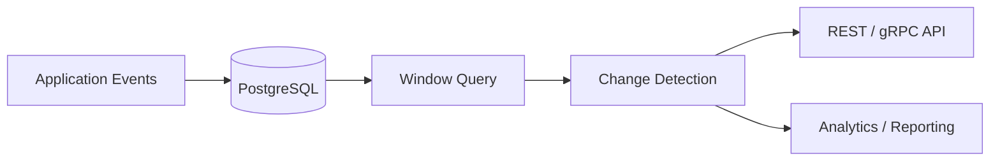

# 07- Change Detection

## Overview

Change detection identifies when a value, state, or attribute differs from the preceding observation in an ordered dataset. In SQL, the most common implementation uses `LAG()` to compare the current row with its previous row.

The general pattern is:

```sql
WITH changes AS (
    SELECT
        entity_id,
        occurred_at,
        value,
        LAG(value) OVER (
            PARTITION BY entity_id
            ORDER BY occurred_at, event_id
        ) AS previous_value
    FROM entity_events
)
SELECT
    entity_id,
    occurred_at,
    value,
    previous_value
FROM changes
WHERE value IS DISTINCT FROM previous_value;
```

This pattern is useful for:

- Detecting state transitions
- Finding price changes
- Tracking configuration changes
- Identifying changed attributes in audit histories
- Detecting metric increases or decreases
- Building change histories
- Identifying boundaries in event streams
- Validating state-machine transitions

The key idea is simple:

```text
Previous row ──compare──> Current row
      ↑                         ↑
    LAG()                     value
```

The engineering challenge is not writing `LAG()` itself. It is defining **what constitutes the previous observation**, handling `NULL` correctly, and ensuring that filtering and ordering preserve the intended business semantics.

## Why Change Detection Matters

Operational systems often store snapshots or events rather than explicit "change" records.

For example:

```text
10:00  pending
10:05  pending
10:10  paid
10:15  paid
10:20  shipped
```

The application may only need the meaningful transitions:

```text
pending → paid
paid    → shipped
```

Instead of comparing every row in Python or joining a table against itself, SQL can derive the previous value and filter to actual changes.

This is especially useful for:

- Order and payment workflows
- User profile history
- Product price history
- Feature-flag changes
- Infrastructure configuration
- Deployment events
- Customer account states
- CDC and audit pipelines

## Core Pattern

Consider an order status history:

```sql
CREATE TABLE order_status_history (
    id BIGINT PRIMARY KEY,
    order_id BIGINT NOT NULL,
    status TEXT NOT NULL,
    changed_at TIMESTAMPTZ NOT NULL
);
```

Detect status changes with:

```sql
WITH status_history AS (
    SELECT
        order_id,
        id,
        changed_at,
        status,
        LAG(status) OVER (
            PARTITION BY order_id
            ORDER BY changed_at, id
        ) AS previous_status
    FROM order_status_history
)
SELECT
    order_id,
    changed_at,
    previous_status,
    status AS current_status
FROM status_history
WHERE previous_status IS DISTINCT FROM status;
```

The result might be:

| order_id | changed_at | previous_status | current_status |
|---:|---|---|---|
| 1001 | 09:00 | `NULL` | pending |
| 1001 | 09:15 | pending | paid |
| 1001 | 10:00 | paid | shipped |

The first row is included because there is no previous observation.

If the requirement is specifically to detect **transitions between existing states**, exclude the first row:

```sql
WHERE previous_status IS NOT NULL
  AND previous_status IS DISTINCT FROM status
```

## Why `LAG()` Is Used

`LAG()` exposes the previous row's value within an ordered window.

```sql
LAG(status) OVER (
    PARTITION BY order_id
    ORDER BY changed_at, id
)
```

For:

```text
pending
paid
packed
shipped
```

the result is:

| status | previous_status |
|---|---|
| pending | `NULL` |
| paid | pending |
| packed | paid |
| shipped | packed |

The comparison then becomes:

```sql
status IS DISTINCT FROM previous_status
```

This separates two concerns:

1. Establish the sequence.
2. Determine whether the value changed.

That separation makes complex change-detection queries easier to reason about.

## `IS DISTINCT FROM` and NULL-Safe Comparison

A common mistake is:

```sql
WHERE current_value <> previous_value
```

This does not handle `NULL` the same way as ordinary values.

SQL uses three-valued logic:

```text
TRUE
FALSE
UNKNOWN
```

For example:

```sql
NULL <> 'active'
```

evaluates to `UNKNOWN`, not `TRUE`.

PostgreSQL provides:

```sql
current_value IS DISTINCT FROM previous_value
```

which treats `NULL` as a comparable value.

Examples:

| Current | Previous | `<>` | `IS DISTINCT FROM` |
|---|---|---|---|
| `paid` | `pending` | TRUE | TRUE |
| `paid` | `paid` | FALSE | FALSE |
| `NULL` | `paid` | UNKNOWN | TRUE |
| `paid` | `NULL` | UNKNOWN | TRUE |
| `NULL` | `NULL` | UNKNOWN | FALSE |

For PostgreSQL, `IS DISTINCT FROM` is generally the preferred operator when change detection must be NULL-safe.

For portable SQL, the exact implementation may vary by database engine.

## Detecting Numeric Changes

The same pattern works for numeric attributes.

Suppose product prices are recorded historically:

```sql
WITH prices AS (
    SELECT
        product_id,
        price,
        effective_at,
        LAG(price) OVER (
            PARTITION BY product_id
            ORDER BY effective_at, id
        ) AS previous_price
    FROM product_price_history
)
SELECT
    product_id,
    effective_at,
    previous_price,
    price AS current_price,
    price - previous_price AS price_change
FROM prices
WHERE price IS DISTINCT FROM previous_price;
```

This returns only observations where the price differs from the preceding observation.

For example:

| product_id | previous_price | current_price | price_change |
|---:|---:|---:|---:|
| 101 | `NULL` | 49.99 | `NULL` |
| 101 | 49.99 | 59.99 | 10.00 |
| 101 | 59.99 | 54.99 | -5.00 |

## Detecting Increases and Decreases

Change detection can be extended to classify the direction of change:

```sql
WITH prices AS (
    SELECT
        product_id,
        effective_at,
        price,
        LAG(price) OVER (
            PARTITION BY product_id
            ORDER BY effective_at, id
        ) AS previous_price
    FROM product_price_history
)
SELECT
    product_id,
    effective_at,
    previous_price,
    price,
    CASE
        WHEN previous_price IS NULL THEN 'initial'
        WHEN price > previous_price THEN 'increase'
        WHEN price < previous_price THEN 'decrease'
        ELSE 'unchanged'
    END AS change_type
FROM prices;
```

This creates a reusable classification layer.

## Detecting State Transitions

State changes are common in backend workflows.

```sql
WITH transitions AS (
    SELECT
        order_id,
        changed_at,
        status,
        LAG(status) OVER (
            PARTITION BY order_id
            ORDER BY changed_at, id
        ) AS previous_status
    FROM order_status_history
)
SELECT
    order_id,
    changed_at,
    previous_status,
    status AS current_status
FROM transitions
WHERE previous_status IS NOT NULL
  AND status IS DISTINCT FROM previous_status;
```

The result represents transitions rather than raw history:

```text
pending → paid
paid    → packed
packed  → shipped
```

This is useful for:

- Workflow analytics
- SLA calculations
- Audit reporting
- State-machine validation
- Debugging unexpected transitions

## Detecting Changes Across Multiple Columns

Real systems often need to detect changes to an entire record rather than one column.

Suppose customer configuration history contains:

```text
customer_id
plan
region
status
limit
```

You can compare each attribute separately:

```sql
WITH history AS (
    SELECT
        customer_id,
        changed_at,
        plan,
        region,
        status,
        request_limit,
        LAG(plan) OVER (
            PARTITION BY customer_id
            ORDER BY changed_at, id
        ) AS previous_plan,
        LAG(region) OVER (
            PARTITION BY customer_id
            ORDER BY changed_at, id
        ) AS previous_region,
        LAG(status) OVER (
            PARTITION BY customer_id
            ORDER BY changed_at, id
        ) AS previous_status,
        LAG(request_limit) OVER (
            PARTITION BY customer_id
            ORDER BY changed_at, id
        ) AS previous_request_limit
    FROM customer_configuration_history
)
SELECT *
FROM history
WHERE plan IS DISTINCT FROM previous_plan
   OR region IS DISTINCT FROM previous_region
   OR status IS DISTINCT FROM previous_status
   OR request_limit IS DISTINCT FROM previous_request_limit;
```

This identifies rows where at least one tracked attribute changed.

## Producing a Change Flag

Sometimes the downstream query needs all rows plus an explicit change indicator:

```sql
WITH history AS (
    SELECT
        entity_id,
        occurred_at,
        value,
        LAG(value) OVER (
            PARTITION BY entity_id
            ORDER BY occurred_at, event_id
        ) AS previous_value
    FROM entity_events
)
SELECT
    entity_id,
    occurred_at,
    value,
    previous_value,
    CASE
        WHEN value IS DISTINCT FROM previous_value THEN 1
        ELSE 0
    END AS changed
FROM history;
```

The output becomes:

| value | previous_value | changed |
|---:|---:|---:|
| 10 | `NULL` | 1 |
| 10 | 10 | 0 |
| 15 | 10 | 1 |
| 15 | 15 | 0 |
| 20 | 15 | 1 |

This flag can later be used for cumulative grouping.

## Creating Change Groups

A powerful pattern is converting change markers into version or segment numbers.

```sql
WITH history AS (
    SELECT
        entity_id,
        occurred_at,
        value,
        LAG(value) OVER (
            PARTITION BY entity_id
            ORDER BY occurred_at, event_id
        ) AS previous_value
    FROM entity_events
),
marked AS (
    SELECT
        *,
        CASE
            WHEN value IS DISTINCT FROM previous_value THEN 1
            ELSE 0
        END AS is_change
    FROM history
)
SELECT
    *,
    SUM(is_change) OVER (
        PARTITION BY entity_id
        ORDER BY occurred_at, event_id
        ROWS UNBOUNDED PRECEDING
    ) AS change_group
FROM marked;
```

This transforms:

```text
10
10
10
20
20
15
15
```

into conceptual groups:

```text
Group 1 → 10
Group 2 → 20
Group 3 → 15
```

This is useful for identifying periods during which an entity maintained the same value.

## Compressing Repeated Values

Change groups can be used to collapse consecutive duplicate observations.

```sql
WITH history AS (
    SELECT
        entity_id,
        occurred_at,
        value,
        LAG(value) OVER (
            PARTITION BY entity_id
            ORDER BY occurred_at, event_id
        ) AS previous_value
    FROM entity_events
),
marked AS (
    SELECT
        *,
        CASE
            WHEN value IS DISTINCT FROM previous_value THEN 1
            ELSE 0
        END AS is_change
    FROM history
),
grouped AS (
    SELECT
        *,
        SUM(is_change) OVER (
            PARTITION BY entity_id
            ORDER BY occurred_at, event_id
            ROWS UNBOUNDED PRECEDING
        ) AS change_group
    FROM marked
)
SELECT
    entity_id,
    change_group,
    MIN(occurred_at) AS started_at,
    MAX(occurred_at) AS last_observed_at,
    MAX(value) AS value
FROM grouped
GROUP BY entity_id, change_group
ORDER BY entity_id, started_at;
```

This converts event-like snapshots into periods of stable values.

For example:

```text
10 at 09:00
10 at 09:05
10 at 09:10
20 at 09:20
20 at 09:25
```

becomes approximately:

| entity_id | change_group | started_at | value |
|---:|---:|---|---:|
| 1 | 1 | 09:00 | 10 |
| 1 | 2 | 09:20 | 20 |

## Detecting Changes in JSON or Structured Data

PostgreSQL can compare JSON values as well.

For example:

```sql
WITH history AS (
    SELECT
        service_id,
        changed_at,
        configuration,
        LAG(configuration) OVER (
            PARTITION BY service_id
            ORDER BY changed_at, id
        ) AS previous_configuration
    FROM service_configuration_history
)
SELECT
    service_id,
    changed_at,
    previous_configuration,
    configuration
FROM history
WHERE configuration IS DISTINCT FROM previous_configuration;
```

This is useful for configuration history, but whole-document comparison can become expensive when JSON payloads are large.

For frequently queried attributes, consider storing important fields in typed columns and indexing them appropriately rather than relying entirely on large JSON comparisons.

## Change Detection in Audit Histories

Audit tables frequently contain snapshots:

```text
entity_id | changed_at | status | plan | limit
```

A change-detection query can identify which rows represent meaningful modifications.

For a single attribute:

```sql
WITH audit AS (
    SELECT
        entity_id,
        changed_at,
        status,
        LAG(status) OVER (
            PARTITION BY entity_id
            ORDER BY changed_at, audit_id
        ) AS previous_status
    FROM entity_audit
)
SELECT
    entity_id,
    changed_at,
    previous_status,
    status
FROM audit
WHERE status IS DISTINCT FROM previous_status;
```

For multiple attributes, compare each relevant field or use a normalized representation appropriate to the database.

## Change Detection vs Snapshot Diffing

There are two related but different problems.

| Requirement | Typical approach |
|---|---|
| Did one column change? | `LAG(column)` |
| Did several columns change? | Multiple `LAG()` expressions |
| Did any tracked attribute change? | Compare current and previous values |
| What was the exact transition? | Current + previous values |
| When did a value become active? | Change grouping + timestamps |
| What changed in a JSON document? | JSON comparison or structured diff |
| Did a record appear/disappear between snapshots? | Snapshot comparison / joins |

`LAG()` is excellent for **adjacent-row comparison**. It is not a universal solution for comparing arbitrary datasets.

## Filtering Before Change Detection

This is one of the most important correctness considerations.

Suppose the complete history is:

```text
January   pending
February  paid
March     shipped
```

If you write:

```sql
SELECT
    order_id,
    changed_at,
    status,
    LAG(status) OVER (
        PARTITION BY order_id
        ORDER BY changed_at, id
    ) AS previous_status
FROM order_status_history
WHERE changed_at >= DATE '2026-03-01';
```

the February row is removed before the window calculation for that query block.

The March row may therefore have:

```text
previous_status = NULL
```

instead of:

```text
previous_status = paid
```

If historical context must be preserved, calculate the window first:

```sql
WITH history AS (
    SELECT
        order_id,
        changed_at,
        status,
        LAG(status) OVER (
            PARTITION BY order_id
            ORDER BY changed_at, id
        ) AS previous_status
    FROM order_status_history
)
SELECT
    order_id,
    changed_at,
    status,
    previous_status
FROM history
WHERE changed_at >= DATE '2026-03-01';
```

This distinction is critical for reporting and APIs that expose only a recent portion of a complete history.

## Ordering and Determinism

Change detection is only correct if the row sequence is deterministic.

Avoid:

```sql
ORDER BY changed_at
```

when multiple records can have the same timestamp.

Prefer:

```sql
ORDER BY changed_at, audit_id
```

where `audit_id` is unique.

Consider:

```text
id | changed_at | status
---|------------|--------
10 | 10:00      | paid
11 | 10:00      | packed
```

Without a tie-breaker, the database is not required to use a particular order among rows with identical ordering values.

That can change which row is considered "previous."

## First Row Semantics

The first row in each partition has no previous row:

```sql
LAG(value) → NULL
```

There are two common interpretations.

### Initial Observation Is a Change

Use:

```sql
value IS DISTINCT FROM previous_value
```

This treats the first row as a change from "no previous observation."

### Only Transitions Between Existing Observations Count

Use:

```sql
previous_value IS NOT NULL
AND value IS DISTINCT FROM previous_value
```

Do not choose between these definitions accidentally. The distinction should be explicit in the business requirement.

## Detecting Only Meaningful Changes

Not every numerical difference should necessarily count as a business change.

For example, a metric might fluctuate due to measurement noise:

```text
100.01
100.02
100.01
100.03
```

A threshold can be applied:

```sql
WITH measurements AS (
    SELECT
        device_id,
        measured_at,
        temperature,
        LAG(temperature) OVER (
            PARTITION BY device_id
            ORDER BY measured_at, reading_id
        ) AS previous_temperature
    FROM sensor_readings
)
SELECT *
FROM measurements
WHERE previous_temperature IS NOT NULL
  AND ABS(temperature - previous_temperature) >= 1.0;
```

This detects only changes of at least one degree.

The threshold should come from domain requirements rather than being introduced merely to reduce query output.

## Detecting Status Changes in a Backend Workflow

A practical order workflow might contain:

```text
pending
paid
paid
packed
packed
shipped
delivered
```

The change-detection query can produce:

```sql
WITH history AS (
    SELECT
        order_id,
        changed_at,
        status,
        LAG(status) OVER (
            PARTITION BY order_id
            ORDER BY changed_at, id
        ) AS previous_status
    FROM order_status_history
)
SELECT
    order_id,
    changed_at,
    previous_status,
    status AS current_status
FROM history
WHERE previous_status IS NOT NULL
  AND status IS DISTINCT FROM previous_status;
```

A REST API or gRPC service can use this result for an order timeline without loading the entire history into application memory.

## Architecture Perspective

In a typical backend system:



The database is responsible for deriving positional relationships from persisted history.

The application layer should generally consume the derived result rather than repeatedly implementing the same previous-row logic in Python.

## Performance Considerations

Window functions commonly require ordering the rows according to the window definition.

For:

```sql
LAG(status) OVER (
    PARTITION BY order_id
    ORDER BY changed_at, id
)
```

the database needs access to rows organized logically by:

```text
order_id → changed_at → id
```

For PostgreSQL, an aligned index can sometimes help:

```sql
CREATE INDEX idx_order_status_history_order_time_id
ON order_status_history (order_id, changed_at, id);
```

Validate the actual execution plan:

```sql
EXPLAIN (ANALYZE, BUFFERS)
SELECT
    order_id,
    changed_at,
    status,
    LAG(status) OVER (
        PARTITION BY order_id
        ORDER BY changed_at, id
    ) AS previous_status
FROM order_status_history;
```

An index is not automatically a guarantee of a faster query. PostgreSQL may still choose a sequential scan and sort when that is cheaper.

## Large Histories

Change detection can become expensive when partitions contain millions of rows.

Potential examples include:

- Long-lived user event histories
- High-volume service telemetry
- IoT readings
- Audit tables
- Financial transaction histories

Possible strategies include:

- Restricting the input range when historical context permits it
- Maintaining appropriate indexes
- Partitioning very large tables
- Archiving cold historical data
- Materializing frequently requested change summaries
- Moving analytical workloads to an analytical database

Be careful with time-based filtering. If the first row in the requested period must be compared with the last row before the period, the query needs access to that preceding observation.

## Incremental Change Detection

For very high-volume systems, repeatedly scanning the entire history is inefficient.

A production architecture may instead detect changes as data arrives:

```text
Event producer
     ↓
Kafka / ingestion
     ↓
Stream processor
     ↓
Current state store
     ↓
Change event
     ↓
PostgreSQL / analytics store
```

SQL window functions remain valuable for:

- Backfills
- Audits
- Reconciliation
- Historical analysis
- Reprocessing

For real-time change propagation, event-driven architectures may be more appropriate than repeatedly executing large historical window queries.

## Common Mistakes

| Mistake | Problem | Better approach |
|---|---|---|
| Using `<>` with nullable values | `NULL` comparisons become `UNKNOWN` | Use `IS DISTINCT FROM` where supported |
| Omitting `PARTITION BY` | Different entities can be compared | Partition by the entity whose history is being analyzed |
| Omitting `ORDER BY` | Previous row is undefined | Define explicit ordering |
| Ordering only by timestamp | Equal timestamps create ambiguity | Add a unique tie-breaker |
| Filtering before `LAG()` | Historical context can disappear | Calculate the window in an inner query first |
| Treating first row as a normal transition | No previous observation exists | Decide explicitly whether initial state counts |
| Comparing every column unnecessarily | More CPU and query complexity | Compare only business-relevant attributes |
| Performing comparison in Python | More network transfer and application memory | Push adjacent-row comparison into SQL |
| Assuming row offset equals time | Missing observations break the assumption | Use timestamp arithmetic for time-based comparisons |
| Ignoring large partitions | Sorting and window processing can become expensive | Inspect plans and control data volume |

## Security Considerations

Change detection does not provide authorization by itself.

In multi-tenant applications, tenant isolation must be enforced in the query:

```sql
SELECT
    tenant_id,
    customer_id,
    changed_at,
    status,
    LAG(status) OVER (
        PARTITION BY tenant_id, customer_id
        ORDER BY changed_at, audit_id
    ) AS previous_status
FROM customer_status_history
WHERE tenant_id = $1;
```

Use parameterized queries for values supplied by the application.

Be especially careful with audit and configuration history because these datasets may contain:

- Personally identifiable information
- Internal configuration
- Security-sensitive state
- Administrative changes
- Historical credentials or tokens if poorly designed

Sensitive data should not be copied into audit records unnecessarily.

## Operational Considerations

For production change-detection queries:

- Measure execution time with realistic data volumes.
- Inspect `EXPLAIN (ANALYZE, BUFFERS)` for expensive reports.
- Monitor database CPU, memory, temporary-file usage, and I/O.
- Test duplicate timestamps explicitly.
- Test NULL transitions explicitly.
- Test first and last rows of each partition.
- Validate behavior across tenant boundaries.
- Avoid running expensive historical scans synchronously on latency-sensitive API paths.
- Consider asynchronous jobs through Celery or a dedicated analytics pipeline for large reports.

For recurring reports, materialized views or precomputed change tables can be appropriate when the underlying history changes less frequently than the report is queried.

## Interview Traps

### Why use `LAG()` instead of a self-join?

`LAG()` directly expresses positional relationships within an ordered partition and generally makes the query simpler and easier to maintain.

A self-join can still be appropriate when the required relationship is based on a non-adjacent business condition rather than row position.

### Why is `LAG()` not enough for calendar-based comparisons?

Because:

```sql
LAG(value, 1)
```

means the previous row, not necessarily the previous calendar period.

Missing dates can make row position and time position diverge.

### Why does `WHERE current <> previous` miss some changes?

Because SQL's three-valued logic treats comparisons involving `NULL` as `UNKNOWN`.

Use:

```sql
current IS DISTINCT FROM previous
```

when NULL-safe comparison is required.

### Why does adding a filter sometimes change the previous value?

Because the window function operates on the rows visible to its query block.

If rows are removed before the window calculation, they cannot participate in determining the previous row.

### Can change detection identify arbitrary differences between two datasets?

Not by itself.

`LAG()` compares adjacent rows in one ordered result. Comparing independent snapshots may require joins, set operations, or other comparison strategies.

## Production Checklist

Before deploying a change-detection query, verify:

- [ ] The business definition of "change" is explicit.
- [ ] `PARTITION BY` matches the entity boundary.
- [ ] `ORDER BY` represents the correct business sequence.
- [ ] A deterministic tie-breaker exists.
- [ ] NULL transitions are handled intentionally.
- [ ] First-row behavior is intentional.
- [ ] Time-based comparisons are not incorrectly implemented as row offsets.
- [ ] Filters do not accidentally remove required historical context.
- [ ] Query performance has been tested with production-scale data.
- [ ] Sensitive historical fields are appropriately protected.
- [ ] Expensive analytical queries are not blocking latency-sensitive API traffic.

## Key Takeaways

- **Use `LAG()` to compare each observation with the preceding observation in a deterministic, explicitly ordered partition.**
- **Use `IS DISTINCT FROM` for NULL-safe change detection when supported by the database.**
- **Define partitioning, ordering, tie-breaking, and first-row semantics explicitly; these determine whether the result is correct.**
- **Calculate the window before applying presentation filters when historical context outside the requested range is required.**
- **For large histories, validate execution plans and consider indexing, partitioning, materialization, or event-driven change processing.**