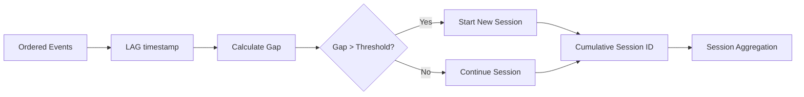
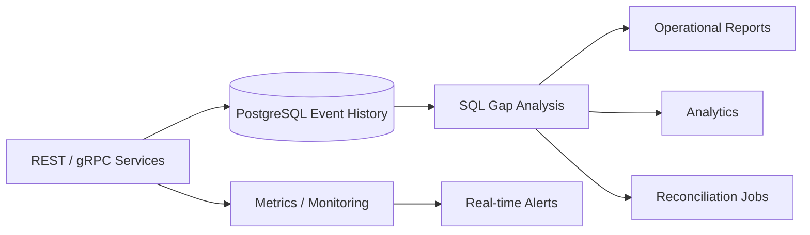

# 08- Gap Analysis

## Overview

Gap analysis compares the current row with a previous or next row to identify the distance between observations. In SQL, this is commonly implemented with `LAG()` or `LEAD()` over a deterministic ordering.

The most common form is temporal gap analysis:

```sql
SELECT
    event_id,
    occurred_at,
    LAG(occurred_at) OVER (
        PARTITION BY user_id
        ORDER BY occurred_at, event_id
    ) AS previous_occurred_at
FROM user_events;
```

The difference between the current and previous timestamp can then be calculated:

```sql
WITH ordered_events AS (
    SELECT
        event_id,
        user_id,
        occurred_at,
        LAG(occurred_at) OVER (
            PARTITION BY user_id
            ORDER BY occurred_at, event_id
        ) AS previous_occurred_at
    FROM user_events
)
SELECT
    event_id,
    user_id,
    occurred_at,
    previous_occurred_at,
    occurred_at - previous_occurred_at AS gap
FROM ordered_events;
```

Gap analysis is useful for:

- Detecting inactive periods
- Measuring time between user actions
- Finding delayed processing
- Detecting missing events
- Identifying unusually long intervals
- Measuring session boundaries
- Analyzing machine or service telemetry
- Comparing sequential business events

The important distinction is that `LAG()` finds the **previous row**, while the business requirement may be about the **previous point in time** or a specific prior business event. The ordering and filtering rules therefore determine whether the result is meaningful.

## Why Gap Analysis Matters

Many backend systems record events continuously but do not explicitly store the duration between events.

For example:

```text
10:00  login
10:05  page_view
10:07  purchase
11:30  logout
```

The database can derive:

```text
login    → page_view = 5 minutes
page_view → purchase = 2 minutes
purchase → logout    = 83 minutes
```

That enables queries such as:

- Which users had more than 30 minutes between actions?
- Which orders spent more than 2 hours between workflow states?
- Which services experienced an unusually long processing interval?
- Which devices stopped reporting for more than 10 minutes?

Gap analysis converts an ordered event stream into measurable intervals.

## Core Pattern

The basic pattern is:

```sql
WITH ordered_rows AS (
    SELECT
        entity_id,
        occurred_at,
        LAG(occurred_at) OVER (
            PARTITION BY entity_id
            ORDER BY occurred_at, event_id
        ) AS previous_occurred_at
    FROM events
)
SELECT
    entity_id,
    occurred_at,
    previous_occurred_at,
    occurred_at - previous_occurred_at AS gap
FROM ordered_rows;
```

Conceptually:

```text
Current row
     │
     ├── occurred_at
     │
     └── previous row
             │
             └── LAG(occurred_at)
                      │
                      ▼
              current - previous
                      │
                      ▼
                   gap
```

The first row in every partition has no previous observation, so its gap is `NULL`.

## Temporal Gap Analysis

PostgreSQL's timestamp arithmetic makes temporal gaps straightforward.

Given:

```sql
CREATE TABLE user_events (
    event_id BIGINT PRIMARY KEY,
    user_id BIGINT NOT NULL,
    event_type TEXT NOT NULL,
    occurred_at TIMESTAMPTZ NOT NULL
);
```

calculate gaps with:

```sql
WITH ordered_events AS (
    SELECT
        event_id,
        user_id,
        event_type,
        occurred_at,
        LAG(occurred_at) OVER (
            PARTITION BY user_id
            ORDER BY occurred_at, event_id
        ) AS previous_occurred_at
    FROM user_events
)
SELECT
    event_id,
    user_id,
    event_type,
    occurred_at,
    previous_occurred_at,
    occurred_at - previous_occurred_at AS gap
FROM ordered_events;
```

Example:

| event_id | event_type | occurred_at | previous_occurred_at | gap |
|---:|---|---|---|---|
| 1 | login | 09:00 | `NULL` | `NULL` |
| 2 | page_view | 09:05 | 09:00 | 00:05 |
| 3 | purchase | 09:07 | 09:05 | 00:02 |
| 4 | logout | 10:30 | 09:07 | 01:23 |

## Finding Large Gaps

Once the gap is calculated, filtering is usually performed in an outer query:

```sql
WITH ordered_events AS (
    SELECT
        event_id,
        user_id,
        occurred_at,
        LAG(occurred_at) OVER (
            PARTITION BY user_id
            ORDER BY occurred_at, event_id
        ) AS previous_occurred_at
    FROM user_events
)
SELECT
    user_id,
    previous_occurred_at,
    occurred_at,
    occurred_at - previous_occurred_at AS gap
FROM ordered_events
WHERE occurred_at - previous_occurred_at > INTERVAL '30 minutes';
```

This pattern is preferable to trying to reference the window function directly in `WHERE`, because window functions are evaluated after the filtering phase of the same query block.

## Detecting Missing Events

Gap analysis is particularly useful when events are expected at a regular interval.

Suppose a device should report every five minutes.

```sql
WITH readings AS (
    SELECT
        device_id,
        reading_id,
        recorded_at,
        LAG(recorded_at) OVER (
            PARTITION BY device_id
            ORDER BY recorded_at, reading_id
        ) AS previous_recorded_at
    FROM device_readings
)
SELECT
    device_id,
    previous_recorded_at,
    recorded_at,
    recorded_at - previous_recorded_at AS gap
FROM readings
WHERE recorded_at - previous_recorded_at > INTERVAL '10 minutes';
```

A gap greater than the expected reporting interval may indicate:

- Device downtime
- Network failure
- Ingestion failure
- Processing backlog
- Clock problems
- Missing data

A gap is evidence of an interval without an observed event; it does not by itself prove why the event is missing.

## Expected Interval vs Actual Interval

For periodic workloads, distinguish between:

```text
expected interval
```

and:

```text
observed interval
```

For example:

```text
Expected: every 5 minutes

10:00
10:05
10:10
10:30
```

The observed gap between 10:10 and 10:30 is 20 minutes.

There may therefore be approximately three expected reporting points missing:

```text
10:15
10:20
10:25
```

However, the exact number depends on the business definition and timestamp precision.

## Detecting Processing Delays

Backend workflows often contain events such as:

```text
job_created
job_started
job_completed
```

Gap analysis can measure processing latency:

```sql
WITH jobs AS (
    SELECT
        job_id,
        created_at,
        started_at,
        completed_at
    FROM background_jobs
)
SELECT
    job_id,
    started_at - created_at AS queue_delay,
    completed_at - started_at AS execution_time,
    completed_at - created_at AS total_time
FROM jobs;
```

This is not technically a row-to-row gap because the timestamps are columns in the same row, but the same interval-analysis principle applies.

When events are stored as separate rows, `LAG()` can derive the corresponding intervals.

## Gap Analysis Across State Transitions

Consider order status events:

```text
pending
paid
packed
shipped
delivered
```

You can measure how long each order stayed between status events:

```sql
WITH status_history AS (
    SELECT
        order_id,
        status,
        changed_at,
        LAG(changed_at) OVER (
            PARTITION BY order_id
            ORDER BY changed_at, history_id
        ) AS previous_changed_at,
        LAG(status) OVER (
            PARTITION BY order_id
            ORDER BY changed_at, history_id
        ) AS previous_status
    FROM order_status_history
)
SELECT
    order_id,
    previous_status,
    status AS current_status,
    previous_changed_at,
    changed_at,
    changed_at - previous_changed_at AS transition_gap
FROM status_history
WHERE previous_status IS NOT NULL;
```

Example:

| previous_status | current_status | transition_gap |
|---|---|---:|
| pending | paid | 00:04 |
| paid | packed | 00:18 |
| packed | shipped | 02:31 |
| shipped | delivered | 19:45 |

This is directly useful for SLA analysis.

## Finding SLA Violations

Suppose an order should move from `paid` to `packed` within 30 minutes.

```sql
WITH transitions AS (
    SELECT
        order_id,
        status,
        changed_at,
        LAG(status) OVER (
            PARTITION BY order_id
            ORDER BY changed_at, history_id
        ) AS previous_status,
        LAG(changed_at) OVER (
            PARTITION BY order_id
            ORDER BY changed_at, history_id
        ) AS previous_changed_at
    FROM order_status_history
)
SELECT
    order_id,
    previous_status,
    status,
    previous_changed_at,
    changed_at,
    changed_at - previous_changed_at AS transition_gap
FROM transitions
WHERE previous_status = 'paid'
  AND status = 'packed'
  AND changed_at - previous_changed_at > INTERVAL '30 minutes';
```

This is more useful than calculating a generic gap because it applies the SLA to a specific business transition.

## Partitioning Is Critical

Without `PARTITION BY`, the previous row may belong to a completely different entity.

Incorrect:

```sql
LAG(occurred_at) OVER (
    ORDER BY occurred_at
)
```

If events from multiple users are interleaved, the result might compare:

```text
user A event → user B event
```

instead of:

```text
user A event → previous user A event
```

Correct:

```sql
LAG(occurred_at) OVER (
    PARTITION BY user_id
    ORDER BY occurred_at, event_id
)
```

The partition defines the independent sequence within which gaps are meaningful.

## Deterministic Ordering

A gap is meaningful only if the sequence is deterministic.

Avoid relying exclusively on:

```sql
ORDER BY occurred_at
```

when multiple events can have the same timestamp.

Prefer:

```sql
ORDER BY occurred_at, event_id
```

For example:

```text
event_id | occurred_at
---------|-----------
101      | 10:00:00
102      | 10:00:00
103      | 10:05:00
```

A unique tie-breaker establishes a stable ordering between events 101 and 102.

This matters particularly in audit logs, distributed systems, and high-throughput event ingestion where timestamp collisions are normal.

## Row Gaps vs Time Gaps

A critical distinction:

```sql
LAG(value, 1)
```

means:

> Give me the value from the previous row.

It does **not** mean:

> Give me the value from the previous minute, hour, or day.

For example:

```text
10:00
10:01
10:10
```

The previous row to 10:10 is 10:01, producing a nine-minute gap.

If the requirement is specifically "previous calendar minute," row-based windowing alone is insufficient. You may need time-series bucketing, generated time intervals, or joins against a calendar series.

## Finding Longest Gaps

Once gaps are calculated, aggregation can identify the largest inactivity period.

```sql
WITH ordered_events AS (
    SELECT
        user_id,
        occurred_at,
        LAG(occurred_at) OVER (
            PARTITION BY user_id
            ORDER BY occurred_at, event_id
        ) AS previous_occurred_at
    FROM user_events
),
gaps AS (
    SELECT
        user_id,
        previous_occurred_at,
        occurred_at,
        occurred_at - previous_occurred_at AS gap
    FROM ordered_events
    WHERE previous_occurred_at IS NOT NULL
)
SELECT
    user_id,
    MAX(gap) AS longest_gap
FROM gaps
GROUP BY user_id
ORDER BY longest_gap DESC;
```

This is useful for identifying:

- Least active users
- Longest processing delays
- Device outages
- Large workflow bottlenecks

## Finding the Row With the Longest Gap

If the actual interval is needed rather than only the maximum:

```sql
WITH ordered_events AS (
    SELECT
        user_id,
        event_id,
        occurred_at,
        LAG(occurred_at) OVER (
            PARTITION BY user_id
            ORDER BY occurred_at, event_id
        ) AS previous_occurred_at
    FROM user_events
),
gaps AS (
    SELECT
        user_id,
        event_id,
        previous_occurred_at,
        occurred_at,
        occurred_at - previous_occurred_at AS gap
    FROM ordered_events
    WHERE previous_occurred_at IS NOT NULL
)
SELECT
    user_id,
    event_id,
    previous_occurred_at,
    occurred_at,
    gap
FROM gaps
ORDER BY gap DESC
LIMIT 1;
```

For the longest gap **per user**, combine the gap calculation with a ranking window:

```sql
WITH ordered_events AS (
    SELECT
        user_id,
        event_id,
        occurred_at,
        LAG(occurred_at) OVER (
            PARTITION BY user_id
            ORDER BY occurred_at, event_id
        ) AS previous_occurred_at
    FROM user_events
),
gaps AS (
    SELECT
        user_id,
        event_id,
        previous_occurred_at,
        occurred_at,
        occurred_at - previous_occurred_at AS gap
    FROM ordered_events
    WHERE previous_occurred_at IS NOT NULL
),
ranked AS (
    SELECT
        *,
        ROW_NUMBER() OVER (
            PARTITION BY user_id
            ORDER BY gap DESC, event_id
        ) AS row_number
    FROM gaps
)
SELECT
    user_id,
    event_id,
    previous_occurred_at,
    occurred_at,
    gap
FROM ranked
WHERE row_number = 1;
```

This combines value and ranking window functions effectively.

## Gap Analysis With `LEAD()`

`LEAD()` performs the same type of analysis from the opposite direction.

```sql
SELECT
    event_id,
    occurred_at,
    LEAD(occurred_at) OVER (
        PARTITION BY user_id
        ORDER BY occurred_at, event_id
    ) AS next_occurred_at
FROM user_events;
```

You can calculate the upcoming gap:

```sql
WITH ordered_events AS (
    SELECT
        user_id,
        event_id,
        occurred_at,
        LEAD(occurred_at) OVER (
            PARTITION BY user_id
            ORDER BY occurred_at, event_id
        ) AS next_occurred_at
    FROM user_events
)
SELECT
    user_id,
    event_id,
    occurred_at,
    next_occurred_at,
    next_occurred_at - occurred_at AS upcoming_gap
FROM ordered_events;
```

In practice:

- `LAG()` is natural when asking "how long since the previous event?"
- `LEAD()` is natural when asking "how long until the next event?"

Both describe the same sequence from different perspectives.

## Sessionization With Gap Analysis

One of the most important production patterns is session detection.

Suppose a user is considered to have started a new session after 30 minutes of inactivity.

First calculate the previous event:

```sql
WITH events AS (
    SELECT
        user_id,
        event_id,
        occurred_at,
        LAG(occurred_at) OVER (
            PARTITION BY user_id
            ORDER BY occurred_at, event_id
        ) AS previous_occurred_at
    FROM user_events
)
SELECT
    *,
    CASE
        WHEN previous_occurred_at IS NULL THEN 1
        WHEN occurred_at - previous_occurred_at > INTERVAL '30 minutes'
            THEN 1
        ELSE 0
    END AS new_session
FROM events;
```

Then turn those markers into session identifiers:

```sql
WITH events AS (
    SELECT
        user_id,
        event_id,
        occurred_at,
        LAG(occurred_at) OVER (
            PARTITION BY user_id
            ORDER BY occurred_at, event_id
        ) AS previous_occurred_at
    FROM user_events
),
marked AS (
    SELECT
        *,
        CASE
            WHEN previous_occurred_at IS NULL THEN 1
            WHEN occurred_at - previous_occurred_at > INTERVAL '30 minutes'
                THEN 1
            ELSE 0
        END AS new_session
    FROM events
)
SELECT
    *,
    SUM(new_session) OVER (
        PARTITION BY user_id
        ORDER BY occurred_at, event_id
        ROWS UNBOUNDED PRECEDING
    ) AS session_id
FROM marked;
```

The resulting session identifier can then be used for session-level aggregation.

## Sessionization Flow



The threshold is a business rule. Thirty minutes is common in analytics systems, but it should not be assumed universally.

## Detecting Service Inactivity

The same pattern can monitor infrastructure events.

Suppose a service emits heartbeat records:

```sql
WITH heartbeats AS (
    SELECT
        service_id,
        emitted_at,
        LAG(emitted_at) OVER (
            PARTITION BY service_id
            ORDER BY emitted_at, heartbeat_id
        ) AS previous_emitted_at
    FROM service_heartbeats
)
SELECT
    service_id,
    previous_emitted_at,
    emitted_at,
    emitted_at - previous_emitted_at AS gap
FROM heartbeats
WHERE emitted_at - previous_emitted_at > INTERVAL '2 minutes';
```

This can identify unusually long heartbeat intervals.

For real-time alerting, however, repeatedly scanning a large historical table may not be the right architecture. A metrics or monitoring system is generally better suited to continuous availability detection, while SQL gap analysis is valuable for historical investigation and reconciliation.

## Filtering and Historical Context

Filtering before the window calculation can change the meaning of the gap.

Suppose the history is:

```text
10:00
10:05
10:10
11:00
```

If you need to report events after 10:30, this query:

```sql
SELECT
    occurred_at,
    LAG(occurred_at) OVER (
        ORDER BY occurred_at, event_id
    ) AS previous_occurred_at
FROM user_events
WHERE occurred_at >= TIMESTAMP '2026-08-30 10:30:00';
```

removes the 10:10 event before `LAG()` executes.

The 11:00 event may therefore appear to have no previous event in the filtered dataset.

If the gap must include the earlier observation, calculate the window first:

```sql
WITH ordered_events AS (
    SELECT
        occurred_at,
        LAG(occurred_at) OVER (
            ORDER BY occurred_at, event_id
        ) AS previous_occurred_at
    FROM user_events
)
SELECT
    occurred_at,
    previous_occurred_at,
    occurred_at - previous_occurred_at AS gap
FROM ordered_events
WHERE occurred_at >= TIMESTAMP '2026-08-30 10:30:00';
```

This distinction is critical for time-windowed reports and APIs.

## Time Zones and Timestamp Types

Production systems should generally store event timestamps consistently, commonly using UTC-aware timestamps.

PostgreSQL's `TIMESTAMPTZ` is usually preferable for instants in time:

```sql
occurred_at TIMESTAMPTZ NOT NULL
```

Gap calculations between timestamps represent elapsed time.

Avoid converting timestamps to local display time before performing interval calculations unless the business requirement explicitly concerns local wall-clock behavior.

For example, daylight-saving transitions can make local calendar calculations different from elapsed-time calculations.

## Handling Duplicate Events

Duplicate records can distort gap analysis:

```text
10:00 login
10:00 login
10:05 purchase
```

The gap between the first two events is zero.

Whether that is correct depends on the data model.

If duplicate events are accidental, deduplicate according to a stable event identity before performing analytical calculations.

If they are legitimate repeated observations, keep them.

Do not silently use `DISTINCT` to remove duplicates without understanding the event semantics.

## Performance Considerations

Gap analysis typically requires ordering within each partition:

```sql
PARTITION BY user_id
ORDER BY occurred_at, event_id
```

For PostgreSQL, an index aligned with common access patterns can help:

```sql
CREATE INDEX idx_user_events_user_time_id
ON user_events (user_id, occurred_at, event_id);
```

Validate with the actual execution plan:

```sql
EXPLAIN (ANALYZE, BUFFERS)
SELECT
    user_id,
    occurred_at,
    LAG(occurred_at) OVER (
        PARTITION BY user_id
        ORDER BY occurred_at, event_id
    ) AS previous_occurred_at
FROM user_events;
```

An index does not guarantee that PostgreSQL will avoid sorting. The planner chooses the cheapest strategy based on cardinality, selectivity, table size, and other factors.

For very large event histories:

- Restrict the input dataset when historical context permits.
- Partition large tables when appropriate.
- Archive cold events.
- Precompute frequently requested analytics.
- Separate transactional workloads from heavy analytical workloads.
- Consider dedicated analytical systems for large-scale event analysis.

## Production Architecture

For a backend service, gap analysis might be used in several layers:



SQL is well suited to historical analysis and reconciliation.

A dedicated monitoring system is usually better for real-time alerting because it avoids repeatedly querying large transactional tables for rapidly changing conditions.

## Common Mistakes

| Mistake | Problem | Better approach |
|---|---|---|
| Omitting `PARTITION BY` | Events from different entities can be compared | Partition by the entity |
| Ordering only by a non-unique timestamp | Previous row can be ambiguous | Add a deterministic tie-breaker |
| Assuming `LAG(1)` means previous minute | It means previous row | Use time-aware logic for calendar intervals |
| Filtering before calculating `LAG()` | Required historical context may disappear | Calculate the window in an inner query |
| Treating the first row as a real gap | No previous observation exists | Explicitly handle `NULL` |
| Ignoring duplicate events | Gaps can be artificially shortened | Define duplicate-event semantics |
| Using local timestamps carelessly | DST and timezone rules can distort elapsed-time calculations | Store and calculate using consistent timezone-aware timestamps |
| Using SQL polling for real-time monitoring | Can overload the transactional database | Use metrics/event-driven monitoring for real-time detection |
| Assuming a gap proves an outage | Missing observations have multiple possible causes | Correlate with logs, metrics, and ingestion health |
| Running large historical scans on API requests | Creates unpredictable latency | Precompute or run asynchronously |

## Security Considerations

Gap analysis itself is not a security boundary.

If the underlying events are tenant-specific, preserve tenant isolation in the query:

```sql
WITH ordered_events AS (
    SELECT
        tenant_id,
        user_id,
        event_id,
        occurred_at,
        LAG(occurred_at) OVER (
            PARTITION BY tenant_id, user_id
            ORDER BY occurred_at, event_id
        ) AS previous_occurred_at
    FROM user_events
    WHERE tenant_id = $1
)
SELECT
    tenant_id,
    user_id,
    event_id,
    occurred_at,
    occurred_at - previous_occurred_at AS gap
FROM ordered_events;
```

Use parameterized queries from Django, FastAPI, or other application layers.

Do not expose internal event data merely because a gap-analysis endpoint exists. Authorization should be enforced according to the same tenant and resource-access rules as the underlying data.

## Operational Considerations

For production gap-analysis workloads:

- Define the expected event sequence explicitly.
- Define acceptable gap thresholds as business or operational rules.
- Test duplicate timestamps and duplicate events.
- Test missing events and out-of-order ingestion.
- Test the first event in every partition.
- Test events around timezone and daylight-saving boundaries where relevant.
- Monitor query latency and database resource consumption.
- Use `EXPLAIN (ANALYZE, BUFFERS)` for expensive queries.
- Avoid synchronous execution of large analytical queries on latency-sensitive endpoints.
- Use asynchronous processing through Celery or an analytical pipeline when appropriate.
- Correlate SQL findings with application logs and metrics before treating them as incidents.

## Interview Traps

### Does `LAG()` find the previous time interval?

No.

`LAG()` finds the previous row according to the window's `ORDER BY`.

A missing period does not cause SQL to synthesize an intermediate row.

### Why is `PARTITION BY` necessary?

It defines independent sequences.

Without it, the previous event for one user could become the current event for another user.

### Why can filtering change the calculated gap?

Window functions operate over the rows visible to their query block.

Filtering before the window calculation removes historical rows that could otherwise be used as the previous observation.

### How would you implement sessionization?

A common approach is:

1. Use `LAG()` to obtain the previous timestamp.
2. Calculate the elapsed gap.
3. Mark rows where the gap exceeds the session threshold.
4. Use a cumulative `SUM()` to assign session identifiers.
5. Aggregate by entity and session.

### Is a large gap proof of an outage?

No.

It only establishes that no qualifying event was observed during that interval. The cause could be an outage, delayed ingestion, dropped events, clock skew, filtering, or a legitimate absence of activity.

## Key Takeaways

- **Use `LAG()` with deterministic ordering to calculate the elapsed gap between consecutive observations within each entity.**
- **Treat row adjacency and time adjacency as different concepts; `LAG()` finds the previous row, not the previous calendar interval.**
- **Use gap thresholds for practical patterns such as SLA detection, inactivity analysis, missing-event detection, and sessionization.**
- **Calculate windows before presentation filters when the previous observation may fall outside the requested time range.**
- **For production systems, combine SQL gap analysis with correct timestamp semantics, indexing, tenant isolation, and operational monitoring.**