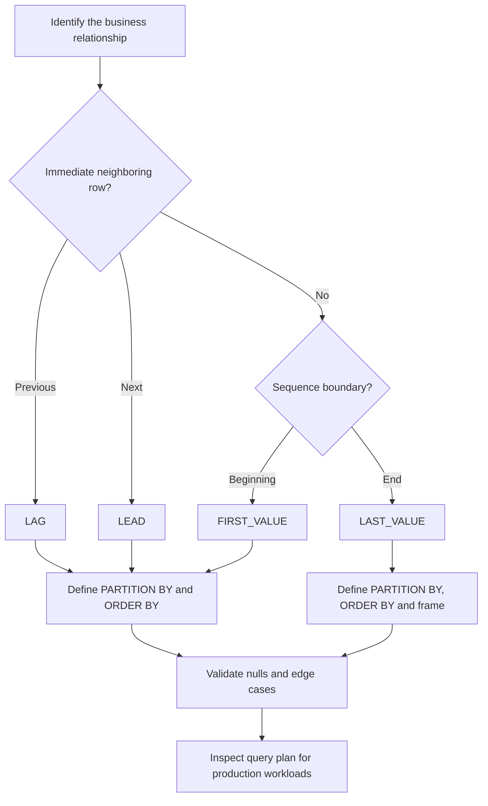

# 10- Value Function Selection Rules

## Overview

SQL value window functions answer questions about a row's position relative to other rows in an ordered sequence. The most useful functions in this family include:

- `LAG()` — retrieve a value from a preceding row.
- `LEAD()` — retrieve a value from a following row.
- `FIRST_VALUE()` — retrieve the first value in the window frame.
- `LAST_VALUE()` — retrieve the last value in the window frame.

The difficult part is rarely the function syntax. The important engineering decision is selecting the function whose semantics match the business question and defining the correct `PARTITION BY`, `ORDER BY`, and window frame.

| Requirement | Typical function |
|---|---|
| Compare with previous row | `LAG()` |
| Compare with next row | `LEAD()` |
| Compare with the first observation | `FIRST_VALUE()` |
| Compare with the final observation | `LAST_VALUE()` |
| Calculate elapsed time between events | `LAG()` / `LEAD()` |
| Find initial state | `FIRST_VALUE()` |
| Find final state | `LAST_VALUE()` with an appropriate frame |
| Analyze both neighbors | `LAG()` + `LEAD()` |

## Value Window Functions

A value window function returns a value from another row without collapsing the result set.

The general structure is:

```sql
FUNCTION(expression)
OVER (
    PARTITION BY ...
    ORDER BY ...
)
```

Unlike `GROUP BY`, the original rows remain available.

For example:

```sql
SELECT
    user_id,
    occurred_at,
    event_type,
    LAG(event_type) OVER (
        PARTITION BY user_id
        ORDER BY occurred_at, event_id
    ) AS previous_event
FROM user_events;
```

The database can calculate a relationship between adjacent rows while still returning one result row per event.

## Choosing the Direction

The first decision is whether the requirement is backward-looking or forward-looking.

### Use `LAG()` for Previous-Row Questions

Use `LAG()` when the business question contains concepts such as:

- Previous
- Before
- Since the last event
- Previous state
- Change from the previous value
- Time since the previous event

Example:

```sql
SELECT
    account_id,
    recorded_at,
    balance,
    LAG(balance) OVER (
        PARTITION BY account_id
        ORDER BY recorded_at, transaction_id
    ) AS previous_balance
FROM account_balances;
```

The relationship is:

```text
previous row ← current row
```

### Use `LEAD()` for Next-Row Questions

Use `LEAD()` when the requirement is:

- Next
- After
- Until the next event
- Next state
- Time until the next event

Example:

```sql
SELECT
    order_id,
    status,
    changed_at,
    LEAD(changed_at) OVER (
        PARTITION BY order_id
        ORDER BY changed_at, history_id
    ) AS next_changed_at
FROM order_status_history;
```

The relationship is:

```text
current row → next row
```

### Use `FIRST_VALUE()` for Initial-Value Questions

Use `FIRST_VALUE()` when the requirement is:

- First observed value
- Initial state
- Original price
- Starting balance
- First event in a sequence

Example:

```sql
SELECT
    customer_id,
    occurred_at,
    amount,
    FIRST_VALUE(amount) OVER (
        PARTITION BY customer_id
        ORDER BY occurred_at, transaction_id
    ) AS first_transaction_amount
FROM transactions;
```

Every row in the customer's partition can be compared against the customer's first transaction.

### Use `LAST_VALUE()` for Final-Value Questions

Use `LAST_VALUE()` when the requirement is:

- Final observed value
- Ending state
- Most recent value within a defined window
- Last event in a sequence

The important distinction is that `LAST_VALUE()` is **frame-sensitive**. A naive query can return the current row rather than the final row of the partition.

A reliable full-partition pattern is:

```sql
LAST_VALUE(status) OVER (
    PARTITION BY order_id
    ORDER BY changed_at, history_id
    ROWS BETWEEN UNBOUNDED PRECEDING AND UNBOUNDED FOLLOWING
)
```

## Selection Matrix

| Business question | Function | Important configuration |
|---|---|---|
| What was the previous value? | `LAG()` | Correct chronological ordering |
| What will the next recorded value be? | `LEAD()` | Correct chronological ordering |
| How much did the value change? | `LAG()` | Current value minus previous |
| How long since the previous event? | `LAG()` | Order by event timestamp |
| How long until the next event? | `LEAD()` | Order by event timestamp |
| What was the initial state? | `FIRST_VALUE()` | Order from earliest to latest |
| What was the first recorded amount? | `FIRST_VALUE()` | Stable ordering |
| What is the final state? | `LAST_VALUE()` | Explicit full frame |
| What is the current value compared with both boundaries? | `FIRST_VALUE()` + `LAST_VALUE()` | Same logical window |
| What happened immediately before and after? | `LAG()` + `LEAD()` | Same ordering |

## `PARTITION BY` Determines the Sequence

`PARTITION BY` should represent the entity whose history is being analyzed.

For customer transactions:

```sql
LAG(amount) OVER (
    PARTITION BY customer_id
    ORDER BY occurred_at, transaction_id
)
```

For order history:

```sql
LAG(status) OVER (
    PARTITION BY order_id
    ORDER BY changed_at, history_id
)
```

For multi-tenant systems:

```sql
LAG(status) OVER (
    PARTITION BY tenant_id, entity_id
    ORDER BY changed_at, history_id
)
```

Without the appropriate partition, the database can compare unrelated entities.

For example, this is usually incorrect for customer histories:

```sql
LAG(amount) OVER (
    ORDER BY occurred_at
)
```

The previous row may belong to a different customer.

## `ORDER BY` Defines Meaning

Window functions do not inherently know what "first", "previous", "next", or "last" means.

The window ordering defines it.

```sql
LAG(value) OVER (
    ORDER BY occurred_at, event_id
)
```

means:

> Find the value from the immediately preceding row according to `occurred_at, event_id`.

Similarly:

```sql
FIRST_VALUE(value) OVER (
    ORDER BY occurred_at, event_id
)
```

means:

> Return the value from the first row according to `occurred_at, event_id`.

### Make Ordering Deterministic

If timestamps are not unique, include a stable tie-breaker:

```sql
ORDER BY occurred_at, event_id
```

instead of:

```sql
ORDER BY occurred_at
```

For event data, a unique event identifier is often an appropriate tie-breaker.

Deterministic ordering matters for:

- Reproducible reports
- Auditing
- State-transition analysis
- Pagination-related analytics
- Distributed event ingestion
- Tests and debugging

## `LAST_VALUE()` and Window Frames

`LAST_VALUE()` deserves special attention.

Consider:

```sql
SELECT
    order_id,
    changed_at,
    status,
    LAST_VALUE(status) OVER (
        PARTITION BY order_id
        ORDER BY changed_at, history_id
    ) AS final_status
FROM order_status_history;
```

Depending on the database and default frame semantics, the frame commonly ends at the current row. In that case, `LAST_VALUE()` can return the current row's `status`, not the final status of the entire partition.

Use an explicit full frame when the intent is the partition's final value:

```sql
SELECT
    order_id,
    changed_at,
    status,
    LAST_VALUE(status) OVER (
        PARTITION BY order_id
        ORDER BY changed_at, history_id
        ROWS BETWEEN UNBOUNDED PRECEDING AND UNBOUNDED FOLLOWING
    ) AS final_status
FROM order_status_history;
```

The conceptual difference is:

```text
Default/current-row frame:

[first] ─────────── [current]
                         ▲
                    LAST_VALUE()

Full partition frame:

[first] ─────────── [current] ─────────── [last]
                                             ▲
                                        LAST_VALUE()
```

This is one of the most common window-function interview and production mistakes.

## `FIRST_VALUE()` vs `LAST_VALUE()`

These functions are often paired when analyzing a complete entity lifecycle.

```sql
SELECT
    order_id,
    changed_at,
    status,
    FIRST_VALUE(status) OVER (
        PARTITION BY order_id
        ORDER BY changed_at, history_id
    ) AS initial_status,
    LAST_VALUE(status) OVER (
        PARTITION BY order_id
        ORDER BY changed_at, history_id
        ROWS BETWEEN UNBOUNDED PRECEDING AND UNBOUNDED FOLLOWING
    ) AS final_status
FROM order_status_history;
```

The result can expose the lifecycle boundaries on every row:

| order_id | status | initial_status | final_status |
|---:|---|---|---|
| 1001 | pending | pending | delivered |
| 1001 | paid | pending | delivered |
| 1001 | shipped | pending | delivered |
| 1001 | delivered | pending | delivered |

This is useful for lifecycle reporting and downstream analytical processing.

## `LAG()` vs `FIRST_VALUE()`

These functions answer different questions even though both can reference earlier rows.

```sql
LAG(value) OVER (
    PARTITION BY customer_id
    ORDER BY occurred_at
)
```

asks:

> What was the value immediately before this row?

```sql
FIRST_VALUE(value) OVER (
    PARTITION BY customer_id
    ORDER BY occurred_at
)
```

asks:

> What was the value at the beginning of this customer's ordered sequence?

For a sequence:

```text
100 → 120 → 150 → 130
```

the result is:

| Current | `LAG()` | `FIRST_VALUE()` |
|---:|---:|---:|
| 100 | `NULL` | 100 |
| 120 | 100 | 100 |
| 150 | 120 | 100 |
| 130 | 150 | 100 |

Choose based on the business relationship rather than the physical implementation.

## `LEAD()` vs `LAST_VALUE()`

These functions are similarly easy to confuse.

```sql
LEAD(status) OVER (
    PARTITION BY order_id
    ORDER BY changed_at, history_id
)
```

asks:

> What is the next status?

```sql
LAST_VALUE(status) OVER (
    PARTITION BY order_id
    ORDER BY changed_at, history_id
    ROWS BETWEEN UNBOUNDED PRECEDING AND UNBOUNDED FOLLOWING
)
```

asks:

> What is the final status of the entire partition?

For:

```text
pending → paid → shipped → delivered
```

the distinction is:

| Current state | `LEAD()` | Full-frame `LAST_VALUE()` |
|---|---|---|
| pending | paid | delivered |
| paid | shipped | delivered |
| shipped | delivered | delivered |
| delivered | `NULL` | delivered |

`LEAD()` is about the **neighbor**.

`LAST_VALUE()` with a full frame is about the **boundary**.

## Row Relationships vs Boundary Values

A useful mental model is:

```text
                 Sequence
┌──────────────────────────────────────┐
│ A → B → C → D → E                    │
└──────────────────────────────────────┘
  ▲   ▲   ▲   ▲   ▲
  │   │   │   │   │
  │   └── LAG / LEAD: row relationships
  │
  └────── FIRST_VALUE: beginning

                          LAST_VALUE: end
```

| Function | Think in terms of |
|---|---|
| `LAG()` | Neighbor behind |
| `LEAD()` | Neighbor ahead |
| `FIRST_VALUE()` | Sequence boundary at the beginning |
| `LAST_VALUE()` | Sequence boundary at the end |

This distinction makes function selection much easier.

## Common Production Patterns

### Compare Against the Initial Value

For cumulative customer growth:

```sql
WITH customer_metrics AS (
    SELECT
        customer_id,
        recorded_at,
        balance,
        FIRST_VALUE(balance) OVER (
            PARTITION BY customer_id
            ORDER BY recorded_at, metric_id
        ) AS initial_balance
    FROM customer_balance_history
)
SELECT
    customer_id,
    recorded_at,
    balance,
    initial_balance,
    balance - initial_balance AS change_from_initial
FROM customer_metrics;
```

Use `FIRST_VALUE()` when the baseline is the first observation rather than the immediately preceding observation.

### Compare Against the Final Value

```sql
WITH order_history AS (
    SELECT
        order_id,
        changed_at,
        status,
        LAST_VALUE(status) OVER (
            PARTITION BY order_id
            ORDER BY changed_at, history_id
            ROWS BETWEEN UNBOUNDED PRECEDING AND UNBOUNDED FOLLOWING
        ) AS final_status
    FROM order_status_history
)
SELECT DISTINCT
    order_id,
    final_status
FROM order_history;
```

If only the final row is required, a different query may be more efficient and simpler, such as PostgreSQL's `DISTINCT ON` or an aggregate/query using an appropriate index. Window functions are most valuable when the boundary value needs to remain available alongside each row.

### Calculate Change From the Previous Event

```sql
SELECT
    account_id,
    occurred_at,
    balance,
    balance - LAG(balance) OVER (
        PARTITION BY account_id
        ORDER BY occurred_at, transaction_id
    ) AS balance_change
FROM account_transactions;
```

Use `LAG()` rather than `FIRST_VALUE()` because the comparison is between adjacent observations.

### Calculate Time Until the Next Event

```sql
SELECT
    order_id,
    status,
    changed_at,
    LEAD(changed_at) OVER (
        PARTITION BY order_id
        ORDER BY changed_at, history_id
    ) - changed_at AS time_in_state
FROM order_status_history;
```

This is a natural `LEAD()` use case because the duration ends at the next recorded event.

## Filtering Window Results

Window functions cannot generally be filtered directly in the `WHERE` clause of the same query block.

For example, this is invalid in PostgreSQL:

```sql
SELECT
    user_id,
    occurred_at,
    LAG(occurred_at) OVER (
        PARTITION BY user_id
        ORDER BY occurred_at, event_id
    ) AS previous_occurred_at
FROM user_events
WHERE LAG(occurred_at) OVER (
    PARTITION BY user_id
    ORDER BY occurred_at, event_id
) IS NOT NULL;
```

Calculate the window value first:

```sql
WITH ordered_events AS (
    SELECT
        user_id,
        event_id,
        occurred_at,
        LAG(occurred_at) OVER (
            PARTITION BY user_id
            ORDER BY occurred_at, event_id
        ) AS previous_occurred_at
    FROM user_events
)
SELECT
    user_id,
    event_id,
    occurred_at,
    previous_occurred_at
FROM ordered_events
WHERE previous_occurred_at IS NOT NULL;
```

This also makes the logical processing stages explicit.

## Filtering Before vs After Window Calculation

The position of a filter changes the rows visible to the window function.

If you need the previous event from the complete history:

```sql
WITH ordered_events AS (
    SELECT
        user_id,
        event_id,
        occurred_at,
        LAG(occurred_at) OVER (
            PARTITION BY user_id
            ORDER BY occurred_at, event_id
        ) AS previous_occurred_at
    FROM user_events
)
SELECT
    *
FROM ordered_events
WHERE occurred_at >= TIMESTAMP '2026-08-01 00:00:00';
```

The window is calculated before the outer filter.

If instead the filter is inside the window-producing query:

```sql
SELECT
    user_id,
    event_id,
    occurred_at,
    LAG(occurred_at) OVER (
        PARTITION BY user_id
        ORDER BY occurred_at, event_id
    ) AS previous_occurred_at
FROM user_events
WHERE occurred_at >= TIMESTAMP '2026-08-01 00:00:00';
```

events before August 1 are removed before the window calculation.

The correct approach depends on the business definition.

## Performance Considerations

Value window functions can require significant work for large datasets because the database must establish the requested partition ordering and maintain enough state to evaluate the window.

For example:

```sql
PARTITION BY customer_id
ORDER BY occurred_at, transaction_id
```

may benefit from an aligned index:

```sql
CREATE INDEX idx_transactions_customer_time_id
ON transactions (customer_id, occurred_at, transaction_id);
```

However, an index does not guarantee that the optimizer will avoid sorting or scanning substantial portions of the table.

Inspect the actual plan:

```sql
EXPLAIN (ANALYZE, BUFFERS)
SELECT
    customer_id,
    occurred_at,
    amount,
    LAG(amount) OVER (
        PARTITION BY customer_id
        ORDER BY occurred_at, transaction_id
    ) AS previous_amount
FROM transactions;
```

For production workloads:

- Filter data before the window when doing so preserves semantics.
- Use deterministic ordering.
- Avoid unnecessary columns in large analytical queries.
- Index the common partition/order pattern when beneficial.
- Avoid repeatedly calculating expensive historical windows on synchronous API requests.
- Precompute frequently requested analytics when the access pattern justifies it.
- Use read replicas or analytical infrastructure when workload volume warrants separation from transactional traffic.

## Backend API Considerations

Suppose a FastAPI service exposes:

```text
GET /orders/{order_id}/history
```

The database can return each status transition together with its neighboring states:

```sql
SELECT
    history_id,
    status,
    changed_at,
    LAG(status) OVER (
        PARTITION BY order_id
        ORDER BY changed_at, history_id
    ) AS previous_status,
    LEAD(status) OVER (
        PARTITION BY order_id
        ORDER BY changed_at, history_id
    ) AS next_status
FROM order_status_history
WHERE order_id = $1
ORDER BY changed_at, history_id;
```

The application can serialize the result directly instead of fetching the complete history into Python and manually calculating neighbors.

For frequently accessed lifecycle information, however, consider whether the database should calculate it on every request or whether a read model/materialized representation is more appropriate.

## Security and Multi-Tenant Systems

Window functions do not enforce authorization boundaries.

In a multi-tenant application, the query must operate only on rows the caller is authorized to access.

For example:

```sql
LAG(status) OVER (
    PARTITION BY tenant_id, order_id
    ORDER BY changed_at, history_id
)
```

can define independent sequences, but it does not itself prevent unauthorized rows from entering the query.

Production APIs should still enforce:

- Tenant isolation
- Resource-level authorization
- Parameterized values
- Appropriate database roles
- Row-level security where applicable
- Explicit filtering of accessible resources

Do not rely on `PARTITION BY` as a security mechanism.

## Common Mistakes

| Mistake | Problem | Better approach |
|---|---|---|
| Using `LAG()` when the requirement is the first value | Returns the immediate predecessor rather than the sequence baseline | Use `FIRST_VALUE()` |
| Using `LEAD()` when the requirement is the final value | Returns only the immediate successor | Use `LAST_VALUE()` with the correct frame |
| Using `LAST_VALUE()` without considering the frame | May return the current row | Specify the intended frame explicitly |
| Omitting `ORDER BY` | "Previous" and "first" become undefined or invalid depending on function/database | Define the sequence explicitly |
| Ordering only by a non-unique timestamp | Ties can make row relationships ambiguous | Add a stable unique tie-breaker |
| Forgetting `PARTITION BY` | Different entities can be mixed together | Partition by the sequence owner |
| Treating row offsets as time intervals | One row is not necessarily one day/hour | Use explicit temporal logic |
| Filtering before a window unintentionally | Required historical rows disappear | Move the filter outside the window-producing query |
| Assuming `LEAD()` finds the next matching event | `LEAD()` uses row position, not predicates | Use a query designed for conditional matching |
| Using a window function for a query that needs only one row | Can add unnecessary processing | Consider `DISTINCT ON`, `ORDER BY ... LIMIT`, aggregation, or another targeted query |

## Interview Traps

### Which function should be used for the previous row?

`LAG()`.

### Which function should be used for the next row?

`LEAD()`.

### Which function should be used to compare every row with the first row?

`FIRST_VALUE()`.

### Which function should be used to compare every row with the final row?

`LAST_VALUE()` with a frame that actually includes the final row, commonly:

```sql
ROWS BETWEEN UNBOUNDED PRECEDING AND UNBOUNDED FOLLOWING
```

### Why can `LAST_VALUE()` produce an unexpected result?

Because window functions operate over a window frame, not necessarily the entire partition. With a frame ending at the current row, the current row can be the last row of the frame.

### Does `LEAD()` mean the next chronological event?

Only if the `ORDER BY` correctly represents chronology.

### Does `FIRST_VALUE()` always return the earliest value?

Only according to the window's ordering. If the ordering does not represent chronological order, "first" has a different meaning.

### Can these functions be combined?

Yes. A single query can use:

```sql
LAG(...)
LEAD(...)
FIRST_VALUE(...)
LAST_VALUE(...)
```

over compatible windows.

This is useful when an event needs both neighbor and lifecycle-boundary context.

## Practical Decision Process

When selecting a value window function, reason through the requirement in this order:



The most important distinction is:

```text
Neighbor relationship
    ├── Previous → LAG
    └── Next     → LEAD

Boundary relationship
    ├── First    → FIRST_VALUE
    └── Last     → LAST_VALUE
```

## Production Checklist

Before deploying a query using value window functions, verify:

- The function matches the actual business question.
- `PARTITION BY` represents the correct entity boundary.
- `ORDER BY` represents the correct sequence.
- Ordering is deterministic when ties are possible.
- `LAST_VALUE()` has an explicitly reviewed frame.
- Boundary `NULL` values are handled intentionally.
- Row offsets are not being confused with temporal intervals.
- Filtering occurs at the correct logical stage.
- Historical context is preserved when required.
- The query plan has been tested against realistic data volume.
- Large analytical queries are not unnecessarily placed on latency-sensitive API paths.
- Tenant isolation and authorization are enforced independently of window-function semantics.

## Key Takeaways

- **Choose `LAG()` and `LEAD()` for immediate row relationships, and `FIRST_VALUE()` and `LAST_VALUE()` for sequence boundaries.**
- **`PARTITION BY` defines independent histories, while `ORDER BY` defines the meaning of first, previous, next, and last.**
- **Treat `LAST_VALUE()` carefully because its result depends on the window frame; use an explicit full frame when the final partition value is required.**
- **Filtering, null handling, duplicate ordering keys, and row-vs-time semantics can materially change the correctness of a value-window query.**
- **For production systems, optimize the access pattern and query plan rather than automatically using a window function when a simpler targeted query or precomputed read model is more appropriate.**