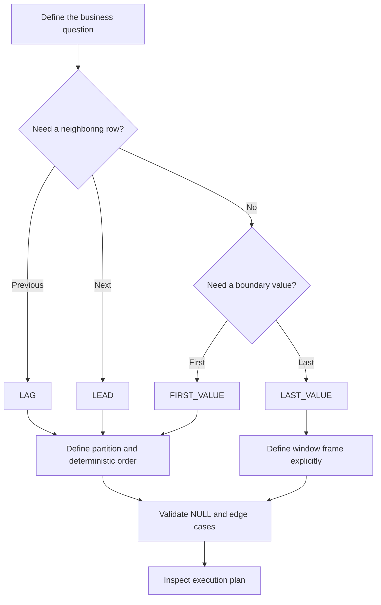

# 11- Practical Value Function Patterns

## Overview

Value window functions are most useful when a query needs to preserve every row while also exposing values from other positions in the same ordered sequence. In backend systems, this commonly means comparing an event with its previous event, next event, initial state, or final state.

The core functions are:

| Function | Primary question |
|---|---|
| `LAG()` | What was the value immediately before this row? |
| `LEAD()` | What is the value immediately after this row? |
| `FIRST_VALUE()` | What was the first value in this ordered sequence? |
| `LAST_VALUE()` | What is the final value in this window frame? |

The production-quality implementation depends on three things:

1. Correct partition boundaries.
2. Deterministic ordering.
3. Correct window-frame semantics, especially for `LAST_VALUE()`.

These functions are particularly valuable for event histories, status transitions, audit trails, time-series data, customer behavior analysis, and lifecycle reporting.

## Common Data Model

The examples use an order-status history table:

```sql
CREATE TABLE order_status_history (
    history_id BIGINT PRIMARY KEY,
    order_id BIGINT NOT NULL,
    status VARCHAR(32) NOT NULL,
    changed_at TIMESTAMPTZ NOT NULL
);
```

A typical history might look like:

| history_id | order_id | status | changed_at |
|---:|---:|---|---|
| 101 | 5001 | pending | 2026-08-01 09:00 |
| 102 | 5001 | paid | 2026-08-01 09:03 |
| 103 | 5001 | shipped | 2026-08-01 14:00 |
| 104 | 5001 | delivered | 2026-08-03 11:00 |

The business requirement determines which value function is appropriate.

## Pattern: Previous State With `LAG()`

### Use Case

Use `LAG()` when the current row needs context from the immediately preceding row.

Typical backend use cases include:

- Detecting state transitions.
- Calculating changes in metrics.
- Finding time since the previous event.
- Identifying the previous price.
- Comparing consecutive records.

```sql
SELECT
    order_id,
    changed_at,
    status,
    LAG(status) OVER (
        PARTITION BY order_id
        ORDER BY changed_at, history_id
    ) AS previous_status
FROM order_status_history;
```

Result:

| status | previous_status |
|---|---|
| pending | `NULL` |
| paid | pending |
| shipped | paid |
| delivered | shipped |

### Detect State Changes

If the table can contain repeated states:

```text
pending → pending → paid → paid → shipped
```

use `LAG()` to identify actual transitions:

```sql
WITH ordered_history AS (
    SELECT
        order_id,
        history_id,
        changed_at,
        status,
        LAG(status) OVER (
            PARTITION BY order_id
            ORDER BY changed_at, history_id
        ) AS previous_status
    FROM order_status_history
)
SELECT
    order_id,
    history_id,
    changed_at,
    previous_status,
    status AS current_status
FROM ordered_history
WHERE previous_status IS DISTINCT FROM status;
```

`IS DISTINCT FROM` is preferable to `<>` when nullable expressions are involved because it treats `NULL` as a comparable state.

## Pattern: Next State With `LEAD()`

### Use Case

Use `LEAD()` when the current row needs information about the next row.

This is useful for:

- Determining the next lifecycle state.
- Calculating time spent in a state.
- Finding the next event.
- Building intervals from event records.
- Analyzing future behavior.

```sql
SELECT
    order_id,
    status,
    changed_at,
    LEAD(status) OVER (
        PARTITION BY order_id
        ORDER BY changed_at, history_id
    ) AS next_status
FROM order_status_history;
```

Result:

| status | next_status |
|---|---|
| pending | paid |
| paid | shipped |
| shipped | delivered |
| delivered | `NULL` |

The final row naturally has no following row, so `LEAD()` returns `NULL` unless a default value is supplied.

## Pattern: Calculate Time in Each State

A common production use of `LEAD()` is converting event points into intervals.

```sql
SELECT
    order_id,
    status,
    changed_at AS entered_at,
    LEAD(changed_at) OVER (
        PARTITION BY order_id
        ORDER BY changed_at, history_id
    ) AS exited_at,
    LEAD(changed_at) OVER (
        PARTITION BY order_id
        ORDER BY changed_at, history_id
    ) - changed_at AS duration
FROM order_status_history;
```

For an order:

```text
pending ────────→ paid ─────────────────→ shipped ─────→ delivered
   09:00            09:03                    14:00          11:00
```

The last state has no recorded exit time.

For production reporting, decide explicitly whether an open-ended state should:

- Remain `NULL`.
- End at the current timestamp.
- End at an SLA cutoff.
- Be excluded from duration calculations.

Do not silently substitute the current time if the business meaning requires a recorded transition.

## Pattern: First Observed Value With `FIRST_VALUE()`

### Use Case

Use `FIRST_VALUE()` when every row should know the value at the beginning of its ordered sequence.

```sql
SELECT
    order_id,
    changed_at,
    status,
    FIRST_VALUE(status) OVER (
        PARTITION BY order_id
        ORDER BY changed_at, history_id
    ) AS initial_status
FROM order_status_history;
```

Every row receives:

```text
initial_status = pending
```

This is useful for questions such as:

- What state did the entity start in?
- What was the customer's first recorded price?
- What was the initial balance?
- How has the current value changed from the baseline?

### Compare Against the Initial Value

For numeric data:

```sql
SELECT
    customer_id,
    recorded_at,
    balance,
    FIRST_VALUE(balance) OVER (
        PARTITION BY customer_id
        ORDER BY recorded_at, balance_history_id
    ) AS initial_balance
FROM customer_balance_history;
```

The application can then calculate:

```text
current_balance - initial_balance
```

without issuing a separate query for the initial record.

## Pattern: Final Value With `LAST_VALUE()`

### Use Case

Use `LAST_VALUE()` when each row needs the final value according to the intended window frame.

The critical point is that `LAST_VALUE()` is frame-sensitive.

Use an explicit full frame when the requirement is the final value of the complete partition:

```sql
SELECT
    order_id,
    changed_at,
    status,
    LAST_VALUE(status) OVER (
        PARTITION BY order_id
        ORDER BY changed_at, history_id
        ROWS BETWEEN UNBOUNDED PRECEDING AND UNBOUNDED FOLLOWING
    ) AS final_status
FROM order_status_history;
```

Result:

| status | final_status |
|---|---|
| pending | delivered |
| paid | delivered |
| shipped | delivered |
| delivered | delivered |

### Why the Explicit Frame Matters

A window frame can end at the current row. If that happens, the current row may be the last row in the frame.

Conceptually:

```text
Partition:

pending → paid → shipped → delivered
   ↑          ↑        ↑          ↑
 first      current               last

Current-row frame:
pending ─────────────── current
                           ↑
                      LAST_VALUE()

Full-partition frame:
pending ───────────────────────── delivered
                                      ↑
                                 LAST_VALUE()
```

For `LAST_VALUE()`, never assume that omitting the frame means "last row of the partition."

## Pattern: Initial and Final State Together

Lifecycle reporting often needs both boundaries:

```sql
SELECT
    order_id,
    changed_at,
    status,
    FIRST_VALUE(status) OVER (
        PARTITION BY order_id
        ORDER BY changed_at, history_id
    ) AS initial_status,
    LAST_VALUE(status) OVER (
        PARTITION BY order_id
        ORDER BY changed_at, history_id
        ROWS BETWEEN UNBOUNDED PRECEDING AND UNBOUNDED FOLLOWING
    ) AS final_status
FROM order_status_history;
```

This produces a complete lifecycle context for every history row.

For a more compact final-state report, however, a window function may not be the best tool. If the application only needs the final row, PostgreSQL can often use an indexed `ORDER BY ... LIMIT 1` or `DISTINCT ON` pattern more directly.

## Pattern: Previous and Next State Together

When analyzing an event in context, calculate both neighbors:

```sql
SELECT
    order_id,
    history_id,
    changed_at,
    status,
    LAG(status) OVER (
        PARTITION BY order_id
        ORDER BY changed_at, history_id
    ) AS previous_status,
    LEAD(status) OVER (
        PARTITION BY order_id
        ORDER BY changed_at, history_id
    ) AS next_status
FROM order_status_history;
```

This is useful for validating state transitions:

```text
previous → current → next

NULL      → pending → paid
pending   → paid    → shipped
paid      → shipped → delivered
shipped   → delivered → NULL
```

A downstream validation query can then identify unexpected transitions.

## Pattern: Detect Invalid State Transitions

Suppose valid transitions are:

```text
pending → paid
paid → shipped
shipped → delivered
```

The window query can expose adjacent states:

```sql
WITH transitions AS (
    SELECT
        order_id,
        history_id,
        status,
        LAG(status) OVER (
            PARTITION BY order_id
            ORDER BY changed_at, history_id
        ) AS previous_status
    FROM order_status_history
)
SELECT
    order_id,
    history_id,
    previous_status,
    status
FROM transitions
WHERE previous_status IS NOT NULL
  AND NOT (
      (previous_status = 'pending' AND status = 'paid')
      OR (previous_status = 'paid' AND status = 'shipped')
      OR (previous_status = 'shipped' AND status = 'delivered')
  );
```

For a large state machine, keep transition rules in a dedicated table rather than embedding a large collection of predicates in application SQL.

## Pattern: Calculate Metric Changes

`LAG()` is useful for time-series metrics.

```sql
SELECT
    service_id,
    recorded_at,
    request_count,
    request_count
        - LAG(request_count) OVER (
            PARTITION BY service_id
            ORDER BY recorded_at, metric_id
        ) AS request_count_delta
FROM service_metrics;
```

This can support:

- Growth calculations.
- Rate-of-change analysis.
- Anomaly detection.
- Operational dashboards.
- Capacity analysis.

If the metric is cumulative, be careful with resets. A counter reset can produce a large negative delta that is not an actual decrease in traffic.

## Pattern: Compare Against the Initial Baseline

For a customer metric:

```sql
WITH metrics AS (
    SELECT
        customer_id,
        recorded_at,
        monthly_revenue,
        FIRST_VALUE(monthly_revenue) OVER (
            PARTITION BY customer_id
            ORDER BY recorded_at, metric_id
        ) AS initial_revenue
    FROM customer_revenue_history
)
SELECT
    customer_id,
    recorded_at,
    monthly_revenue,
    initial_revenue,
    monthly_revenue - initial_revenue AS change_from_initial
FROM metrics;
```

This is different from:

```sql
monthly_revenue
    - LAG(monthly_revenue) ...
```

The first compares against the **initial baseline**.

The second compares against the **previous observation**.

## Pattern: Find the Next Event Time

For event-driven systems:

```sql
SELECT
    user_id,
    event_id,
    event_type,
    occurred_at,
    LEAD(occurred_at) OVER (
        PARTITION BY user_id
        ORDER BY occurred_at, event_id
    ) AS next_event_at
FROM user_events;
```

This is useful for:

- Session analysis.
- Event spacing.
- Funnel analysis.
- User activity analysis.
- Time-to-next-action calculations.

In systems backed by Kafka or other event pipelines, ensure that the database ordering represents the business event sequence rather than simply the ingestion timestamp.

## Pattern: Event Gaps

Calculate the time between consecutive events:

```sql
SELECT
    user_id,
    event_id,
    occurred_at,
    occurred_at
        - LAG(occurred_at) OVER (
            PARTITION BY user_id
            ORDER BY occurred_at, event_id
        ) AS gap_from_previous_event
FROM user_events;
```

Then identify unusually large gaps:

```sql
WITH event_gaps AS (
    SELECT
        user_id,
        event_id,
        occurred_at,
        occurred_at
            - LAG(occurred_at) OVER (
                PARTITION BY user_id
                ORDER BY occurred_at, event_id
            ) AS gap
    FROM user_events
)
SELECT
    user_id,
    event_id,
    occurred_at,
    gap
FROM event_gaps
WHERE gap > INTERVAL '24 hours';
```

The definition of an event gap depends on the ordering key. If late-arriving events can be inserted, use the event's business timestamp when appropriate and understand that historical results may change.

## Pattern: Combine Value Functions With Aggregates

Window functions can coexist with aggregates.

For example:

```sql
SELECT
    customer_id,
    recorded_at,
    amount,
    AVG(amount) OVER (
        PARTITION BY customer_id
    ) AS customer_average,
    FIRST_VALUE(amount) OVER (
        PARTITION BY customer_id
        ORDER BY recorded_at, transaction_id
    ) AS first_amount,
    LAG(amount) OVER (
        PARTITION BY customer_id
        ORDER BY recorded_at, transaction_id
    ) AS previous_amount
FROM transactions;
```

This allows a single result set to expose:

- The current observation.
- The average for the partition.
- The initial observation.
- The previous observation.

Avoid adding calculations simply because they can be combined. Each window expression increases the amount of work the database may need to perform.

## Pattern: Reuse Window Definitions

When several functions use the same partition and ordering, a named window can improve readability:

```sql
SELECT
    order_id,
    changed_at,
    status,
    LAG(status) OVER history_window AS previous_status,
    LEAD(status) OVER history_window AS next_status,
    FIRST_VALUE(status) OVER history_window AS initial_status
FROM order_status_history
WINDOW history_window AS (
    PARTITION BY order_id
    ORDER BY changed_at, history_id
);
```

For `LAST_VALUE()`, use a separate frame when necessary:

```sql
SELECT
    order_id,
    changed_at,
    status,
    LAST_VALUE(status) OVER (
        history_window
        ROWS BETWEEN UNBOUNDED PRECEDING AND UNBOUNDED FOLLOWING
    ) AS final_status
FROM order_status_history
WINDOW history_window AS (
    PARTITION BY order_id
    ORDER BY changed_at, history_id
);
```

Named windows reduce accidental differences between expressions.

## Pattern: Default Values for Missing Neighbors

`LAG()` and `LEAD()` accept an optional default value.

For example:

```sql
SELECT
    order_id,
    changed_at,
    status,
    LAG(status, 1, 'unknown') OVER (
        PARTITION BY order_id
        ORDER BY changed_at, history_id
    ) AS previous_status
FROM order_status_history;
```

Use defaults carefully.

A real `NULL` can mean:

> There is no previous row.

Replacing it with `'unknown'` changes the semantics to:

> There is a previous conceptual state, but its value is unknown.

For analytics and auditing, preserving `NULL` is often safer.

## Pattern: Multiple-Row Lookback

`LAG()` can look back more than one row:

```sql
SELECT
    user_id,
    occurred_at,
    amount,
    LAG(amount, 1) OVER (
        PARTITION BY user_id
        ORDER BY occurred_at, transaction_id
    ) AS previous_amount,
    LAG(amount, 2) OVER (
        PARTITION BY user_id
        ORDER BY occurred_at, transaction_id
    ) AS amount_two_events_ago
FROM transactions;
```

Likewise, `LEAD()` can look forward:

```sql
SELECT
    user_id,
    occurred_at,
    amount,
    LEAD(amount, 1) OVER (
        PARTITION BY user_id
        ORDER BY occurred_at, transaction_id
    ) AS next_amount,
    LEAD(amount, 2) OVER (
        PARTITION BY user_id
        ORDER BY occurred_at, transaction_id
    ) AS amount_two_events_ahead
FROM transactions;
```

The offset represents a **row position**, not a duration.

`LAG(value, 2)` means two rows earlier, not two days earlier.

## Pattern: Stable Ordering for Event Data

This is dangerous:

```sql
LAG(status) OVER (
    PARTITION BY order_id
    ORDER BY changed_at
)
```

if multiple records can have the same `changed_at`.

Prefer:

```sql
LAG(status) OVER (
    PARTITION BY order_id
    ORDER BY changed_at, history_id
)
```

The tie-breaker should be deterministic and represent the desired event sequence.

This is especially important when:

- Events are generated concurrently.
- Multiple updates share the same timestamp precision.
- Data is imported in batches.
- Events are replayed.
- Multiple application instances write concurrently.

## Pattern: Filter After Computing Historical Context

Suppose the API wants events from the last seven days but needs the previous event from the complete history.

Calculate the window first:

```sql
WITH events_with_previous AS (
    SELECT
        user_id,
        event_id,
        occurred_at,
        event_type,
        LAG(occurred_at) OVER (
            PARTITION BY user_id
            ORDER BY occurred_at, event_id
        ) AS previous_occurred_at
    FROM user_events
)
SELECT
    user_id,
    event_id,
    occurred_at,
    event_type,
    previous_occurred_at
FROM events_with_previous
WHERE occurred_at >= CURRENT_TIMESTAMP - INTERVAL '7 days';
```

If the seven-day filter is applied before `LAG()`, the first event in the seven-day period may incorrectly appear to have no predecessor.

The correct location of a filter is therefore a semantic decision, not merely an optimization.

## Pattern: PostgreSQL `DISTINCT ON` vs Value Windows

If the requirement is only:

> Return the latest status for each order.

A window function may be unnecessary.

PostgreSQL can use:

```sql
SELECT DISTINCT ON (order_id)
    order_id,
    status,
    changed_at
FROM order_status_history
ORDER BY order_id, changed_at DESC, history_id DESC;
```

A window function is more appropriate when the latest status must be available alongside other rows:

```sql
SELECT
    order_id,
    history_id,
    status,
    changed_at,
    LAST_VALUE(status) OVER (
        PARTITION BY order_id
        ORDER BY changed_at, history_id
        ROWS BETWEEN UNBOUNDED PRECEDING AND UNBOUNDED FOLLOWING
    ) AS final_status
FROM order_status_history;
```

Senior-level SQL design means choosing the simplest query that matches the required result shape.

## Performance Considerations

Window functions commonly require the database to process rows in partition/order sequence.

For a query such as:

```sql
LAG(status) OVER (
    PARTITION BY order_id
    ORDER BY changed_at, history_id
)
```

an index aligned with the access pattern can be useful:

```sql
CREATE INDEX idx_order_status_history_order_time
ON order_status_history (order_id, changed_at, history_id);
```

Validate the actual execution plan:

```sql
EXPLAIN (ANALYZE, BUFFERS)
SELECT
    order_id,
    changed_at,
    status,
    LAG(status) OVER (
        PARTITION BY order_id
        ORDER BY changed_at, history_id
    ) AS previous_status
FROM order_status_history;
```

Important considerations:

- Indexes do not guarantee that a sort will be avoided.
- Large partitions can require substantial memory.
- Multiple incompatible window orderings can require additional sorting.
- Filtering can dramatically reduce work, but only when it preserves the intended semantics.
- Very large analytical workloads may belong on a read replica, warehouse, or dedicated analytical system rather than the primary OLTP database.

## Backend API Pattern

A Django or FastAPI service should generally let PostgreSQL perform sequence analysis rather than loading thousands of history rows into Python and manually calculating neighbors.

For example:

```sql
SELECT
    history_id,
    status,
    changed_at,
    LAG(status) OVER (
        PARTITION BY order_id
        ORDER BY changed_at, history_id
    ) AS previous_status,
    LEAD(status) OVER (
        PARTITION BY order_id
        ORDER BY changed_at, history_id
    ) AS next_status
FROM order_status_history
WHERE order_id = $1
ORDER BY changed_at, history_id;
```

The application receives a result that is already suitable for serialization.

This reduces:

- Python-side iteration.
- Application memory usage.
- Duplicate query logic.
- Network transfer of unnecessary rows.
- Differences between service implementations.

However, avoid placing expensive cross-partition analytical queries directly on latency-sensitive request paths without measuring their impact.

## Production Design Considerations

### Partition Correctly

The partition should correspond to the business entity:

```sql
PARTITION BY tenant_id, order_id
```

may be appropriate in a multi-tenant order system.

Do not assume that `PARTITION BY` provides security isolation. Authorization and tenant filtering must still be enforced.

### Treat Event Ordering as Business Logic

Define what ordering actually means:

- Business event timestamp.
- Database insertion timestamp.
- Sequence number.
- Kafka offset.
- Monotonic event ID.

Do not automatically assume `created_at` is the correct ordering key.

### Handle Late Events

In distributed systems, events can arrive out of order.

If an event with an earlier business timestamp is inserted later, historical `LAG()` and `LEAD()` results can change.

For audit and reporting systems, decide whether results should be:

- Recomputed from canonical history.
- Based on ingestion order.
- Based on business event order.
- Materialized periodically.

### Avoid Unbounded API Results

A value window can be logically correct while still being operationally expensive.

For large histories:

- Restrict the entity being analyzed.
- Paginate carefully.
- Avoid forcing the database to process millions of unrelated rows.
- Consider precomputed read models for high-volume dashboards.
- Measure query latency under realistic cardinality.

### Monitor Query Performance

For PostgreSQL production systems, monitor:

- Execution time.
- Rows processed.
- Sort operations.
- Temporary file usage.
- Buffer reads.
- Memory consumption.
- Query frequency.
- Lock contention where relevant.

A query that is fast against 10,000 history rows may behave very differently against 100 million rows.

## Common Mistakes

| Mistake | Why it happens | Correct approach |
|---|---|---|
| Using `LAG()` for a partition baseline | Confuses previous row with first row | Use `FIRST_VALUE()` |
| Using `LEAD()` to find the final row | Confuses next row with partition boundary | Use `LAST_VALUE()` with an appropriate frame |
| Assuming `LAST_VALUE()` means final partition value | Ignores frame semantics | Explicitly define the frame |
| Omitting `PARTITION BY` | Treats unrelated entities as one sequence | Partition by the sequence owner |
| Ordering only by a timestamp | Ties make row relationships ambiguous | Add a deterministic tie-breaker |
| Treating `LAG(..., 7)` as seven days | Offset counts rows, not time | Use temporal calculations |
| Filtering before `LAG()` unintentionally | Removes historical context | Filter after window calculation when required |
| Replacing boundary `NULL` values blindly | Hides the absence of a row | Preserve `NULL` unless a default has clear semantics |
| Computing analytics in Python | Moves set-based work into application code | Prefer SQL when the database can perform it efficiently |
| Using a window function to return one row | Adds unnecessary complexity/work | Consider an indexed targeted query |
| Assuming event ingestion order equals event order | Distributed systems can reorder events | Define and enforce business ordering |
| Ignoring large partitions | Small tests hide production costs | Test with realistic cardinality and inspect plans |

## Interview-Oriented Decision Table

| Question | Preferred function |
|---|---|
| Previous transaction amount? | `LAG()` |
| Next transaction amount? | `LEAD()` |
| Amount at customer's first transaction? | `FIRST_VALUE()` |
| Amount at customer's final transaction? | `LAST_VALUE()` |
| Change from previous transaction? | `LAG()` |
| Change from initial transaction? | `FIRST_VALUE()` |
| Time until next event? | `LEAD()` |
| Time since previous event? | `LAG()` |
| Initial state and final state? | `FIRST_VALUE()` + `LAST_VALUE()` |
| Previous, current, and next state? | `LAG()` + `LEAD()` |
| Only latest row per entity? | Often a targeted query rather than a value window |

## Practical Selection Flow



## Key Takeaways

- **Use `LAG()` and `LEAD()` for adjacent-row relationships; use `FIRST_VALUE()` and `LAST_VALUE()` for sequence boundaries.**
- **Always define the correct `PARTITION BY` and deterministic `ORDER BY`; these clauses establish what the row relationship actually means.**
- **`LAST_VALUE()` is frame-sensitive, so explicitly use a full partition frame when the final value of the partition is required.**
- **Use value functions for set-based event and lifecycle analysis, but prefer simpler indexed queries when only one boundary row is needed.**
- **Production correctness depends on event ordering, filtering stage, `NULL` semantics, late-arriving data, and query-plan behavior—not just function syntax.**