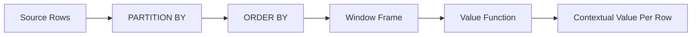
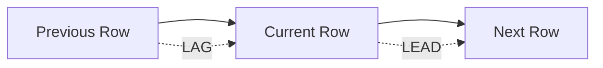
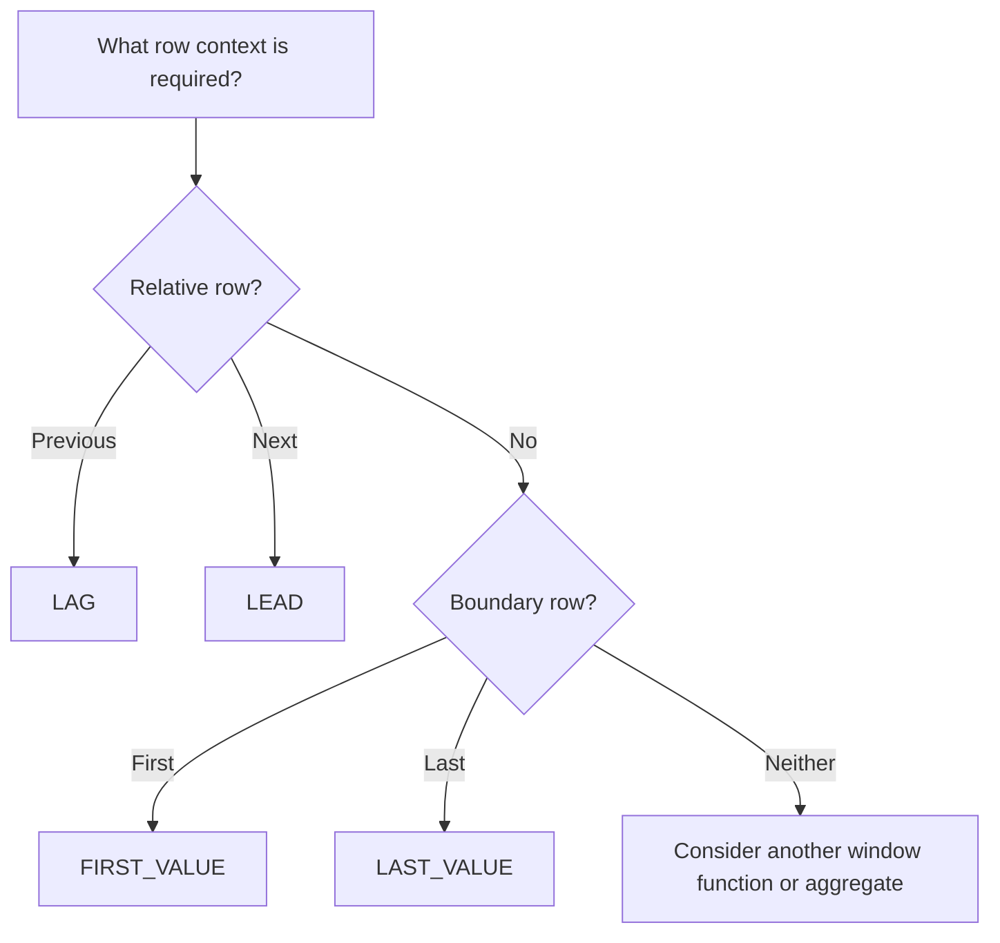

# README

## Overview

Value window functions retrieve values from other rows in the same window while preserving the original row set. They are useful when a query needs **row context** rather than simply an aggregate result.

The core value functions in this section are:

| Function | Primary purpose |
|---|---|
| `LAG()` | Read a value from a previous row |
| `LEAD()` | Read a value from a following row |
| `FIRST_VALUE()` | Read the value from the first row in the window |
| `LAST_VALUE()` | Read the value from the last row in the window |

These functions are particularly useful for backend systems that process ordered data such as order histories, user activity, financial transactions, application events, and state transitions.

Unlike `GROUP BY`, window functions do not collapse rows. Each source row remains available while additional contextual values are calculated.

## Navigation

- [01- Value Functions Introduction](./01-%20Value%20Functions%20Introduction.md) — Value-function fundamentals and mental model
- [02- LAG](./02-%20LAG.md) — Previous-row access
- [03- LEAD](./03-%20LEAD.md) — Next-row access
- [04- FIRST_VALUE](./04-%20FIRST_VALUE.md) — First ordered value
- [05- LAST_VALUE](./05-%20LAST_VALUE.md) — Last ordered value and frame semantics
- [06- Previous and Next Row Analysis](./06-%20Previous%20and%20Next%20Row%20Analysis.md) — Combining previous and next row context
- [07- Change Detection](./07-%20Change%20Detection.md) — Detecting state and value changes
- [08- Gap Analysis](./08-%20Gap%20Analysis.md) — Measuring gaps between ordered events
- [09- LAG vs LEAD](./09-%20LAG%20vs%20LEAD.md) — Choosing previous vs next row analysis
- [10- Value Function Selection Rules](./10-%20Value%20Function%20Selection%20Rules.md) — Systematic function selection
- [11- Practical Value Function Patterns](./11-%20Practical%20Value%20Function%20Patterns.md) — Production-oriented query patterns
- [12- Common Value Function Mistakes](./12-%20Common%20Value%20Function%20Mistakes.md) — Debugging, pitfalls, and interview traps

## Why Value Functions Matter

Many backend queries need to answer questions involving relationships between adjacent or boundary rows:

- What was the previous order status?
- When did the next user event occur?
- What was the user's first recorded activity?
- What is the final state of an order?
- When did a value change?
- How long did a user remain in a state?
- What was the previous or next transaction?
- Did a record change compared with the preceding record?

Without window functions, these problems often require self-joins, correlated subqueries, application-side processing, or multiple queries.

Value functions allow the database to express these relationships directly over an ordered dataset.

## Core Mental Model

A value window function should be understood as a calculation over a **partitioned and ordered sequence**.



For example:

```sql
LAG(status) OVER (
    PARTITION BY order_id
    ORDER BY changed_at, history_id
)
```

The database conceptually:

1. Groups rows belonging to the same `order_id`.
2. Establishes their deterministic order.
3. Identifies the row relative to the current row.
4. Returns the requested value.
5. Preserves the original row.

The function is therefore only one part of the problem. Correct partitioning, ordering, filtering, and frame semantics are equally important.

## Value Functions in This Section

### `LAG()`

`LAG()` accesses a value from a previous row relative to the current row.

```sql
SELECT
    order_id,
    changed_at,
    status,
    LAG(status) OVER (
        PARTITION BY order_id
        ORDER BY changed_at, history_id
    ) AS previous_status
FROM order_status_history;
```

Typical uses:

- Previous status.
- Previous transaction amount.
- Previous event timestamp.
- Change detection.
- Inter-event duration.
- Comparing consecutive measurements.

The offset is row-based:

```sql
LAG(status, 1)
```

means one row earlier, not one unit of time earlier.

See [`02- LAG.md`](./02-%20LAG.md).

### `LEAD()`

`LEAD()` accesses a value from a following row relative to the current row.

```sql
SELECT
    order_id,
    changed_at,
    status,
    LEAD(status) OVER (
        PARTITION BY order_id
        ORDER BY changed_at, history_id
    ) AS next_status
FROM order_status_history;
```

Typical uses:

- Next state.
- Next event.
- Next transaction.
- Time until the next event.
- Identifying terminal records.

See [`03- LEAD.md`](./03-%20LEAD.md).

### `FIRST_VALUE()`

`FIRST_VALUE()` returns a value from the first row within the relevant window ordering and frame.

```sql
SELECT
    customer_id,
    recorded_at,
    amount,
    FIRST_VALUE(amount) OVER (
        PARTITION BY customer_id
        ORDER BY recorded_at, payment_id
    ) AS first_amount
FROM payments;
```

It answers positional questions such as:

> What was this customer's first recorded amount?

It is not equivalent to `MIN()`.

See [`04- FIRST_VALUE.md`](./04-%20FIRST_VALUE.md).

### `LAST_VALUE()`

`LAST_VALUE()` returns a value from the last row within the relevant window frame.

```sql
SELECT
    customer_id,
    recorded_at,
    amount,
    LAST_VALUE(amount) OVER (
        PARTITION BY customer_id
        ORDER BY recorded_at, payment_id
        ROWS BETWEEN UNBOUNDED PRECEDING AND UNBOUNDED FOLLOWING
    ) AS final_amount
FROM payments;
```

`LAST_VALUE()` requires particular attention to the window frame. A common mistake is assuming that it automatically means the final row of the entire partition.

See [`05- LAST_VALUE.md`](./05-%20LAST_VALUE.md).

## Previous and Next Row Analysis

`LAG()` and `LEAD()` are complementary functions.



For an ordered sequence:

| Position | Value |
|---:|---|
| 1 | A |
| 2 | B |
| 3 | C |
| 4 | D |

At row `C`:

- `LAG(value)` → `B`
- `LEAD(value)` → `D`

Combining them enables useful interval and transition analysis:

```sql
SELECT
    user_id,
    occurred_at,
    LAG(occurred_at) OVER (
        PARTITION BY user_id
        ORDER BY occurred_at, event_id
    ) AS previous_event_at,
    LEAD(occurred_at) OVER (
        PARTITION BY user_id
        ORDER BY occurred_at, event_id
    ) AS next_event_at
FROM user_events;
```

See [`06- Previous and Next Row Analysis.md`](./06-%20Previous%20and%20Next%20Row%20Analysis.md).

## Change Detection

Value functions are frequently combined with conditional expressions to detect state changes.

```sql
WITH ordered_events AS (
    SELECT
        order_id,
        changed_at,
        status,
        LAG(status) OVER (
            PARTITION BY order_id
            ORDER BY changed_at, history_id
        ) AS previous_status
    FROM order_status_history
)
SELECT
    order_id,
    changed_at,
    status,
    previous_status,
    status IS DISTINCT FROM previous_status AS status_changed
FROM ordered_events;
```

This pattern is useful for:

- Audit histories.
- Status transitions.
- Configuration changes.
- User lifecycle events.
- CDC-style analysis.
- Operational reporting.

See [`07- Change Detection.md`](./07-%20Change%20Detection.md).

## Gap Analysis

`LAG()` and timestamp arithmetic can identify gaps between consecutive events.

```sql
SELECT
    user_id,
    occurred_at,
    occurred_at
        - LAG(occurred_at) OVER (
            PARTITION BY user_id
            ORDER BY occurred_at, event_id
        ) AS gap_from_previous
FROM user_events;
```

This supports questions such as:

- Which customers had unusually long inactivity periods?
- How long did a request workflow remain idle?
- Which devices stopped sending telemetry?
- Where are gaps in event ingestion?

See [`08- Gap Analysis.md`](./08-%20Gap%20Analysis.md).

## Choosing the Correct Value Function

A practical selection rule is:

| Requirement | Function |
|---|---|
| Previous row | `LAG()` |
| Next row | `LEAD()` |
| First row's value | `FIRST_VALUE()` |
| Final row's value | `LAST_VALUE()` |
| Smallest value | `MIN()` |
| Largest value | `MAX()` |
| Row-to-row comparison | Usually `LAG()` |
| Future-row comparison | Usually `LEAD()` |
| First/last according to ordering | `FIRST_VALUE()` / `LAST_VALUE()` |

The important distinction is **row position versus value magnitude**.

For example:

```sql
FIRST_VALUE(amount) OVER (
    PARTITION BY customer_id
    ORDER BY recorded_at
)
```

means:

> Amount belonging to the earliest record.

Whereas:

```sql
MIN(amount) OVER (
    PARTITION BY customer_id
)
```

means:

> Smallest amount.

These are different business requirements.

## `LAG()` vs `LEAD()`

| Characteristic | `LAG()` | `LEAD()` |
|---|---|---|
| Direction | Previous | Following |
| Typical use | Historical comparison | Future comparison |
| First boundary | `NULL` by default | Normal value if a next row exists |
| Last boundary | Normal value if a previous row exists | `NULL` by default |
| Common pattern | Detect changes | Calculate time until next event |

See [`09- LAG vs LEAD.md`](./09-%20LAG%20vs%20LEAD.md).

## Value Function Selection Rules

When selecting a value function, start with the business question rather than the SQL function.

Ask:

1. Do I need a previous row?
2. Do I need a following row?
3. Do I need the first row according to an ordering?
4. Do I need the final row according to an ordering?
5. Does the calculation require a specific window frame?
6. Does the sequence require `PARTITION BY`?
7. Is the ordering deterministic?

A useful decision model is:



See [`10- Value Function Selection Rules.md`](./10-%20Value%20Function%20Selection%20Rules.md).

## Practical Value Function Patterns

Value functions become more useful when combined with other SQL features.

Common production patterns include:

- Previous/next event analysis.
- State transition detection.
- Duration calculations.
- First/last observed state.
- Customer lifecycle analysis.
- Sessionization.
- Audit history analysis.
- Time-series comparisons.
- Event-stream diagnostics.
- Historical reporting.

See [`11- Practical Value Function Patterns.md`](./11-%20Practical%20Value%20Function%20Patterns.md).

## Common Mistakes

The most important pitfalls in this topic are:

| Mistake | Why it causes problems |
|---|---|
| Missing `PARTITION BY` | Rows from different entities can become adjacent |
| Non-deterministic `ORDER BY` | Tied rows can produce ambiguous predecessor/successor relationships |
| Treating offsets as time | `LAG(x, 1)` means one row, not one hour/day |
| Ignoring window frames | `LAST_VALUE()` may not represent the partition's final row |
| Confusing positional and aggregate functions | `FIRST_VALUE()` is not `MIN()` |
| Filtering too early | Required historical rows may disappear before window evaluation |
| Ignoring `NULL` boundaries | Missing predecessor/successor can be mistaken for missing data |
| Processing everything in Python | Large datasets may incur unnecessary network and memory costs |
| Ignoring partition size | Large partitions can produce expensive sorts and window processing |

See [`12- Common Value Function Mistakes.md`](./12-%20Common%20Value%20Function%20Mistakes.md).

## Production Query Pattern

A robust value-function query typically makes its semantics explicit:

```sql
WITH ordered_history AS (
    SELECT
        order_id,
        history_id,
        status,
        changed_at,
        LAG(status) OVER (
            PARTITION BY order_id
            ORDER BY changed_at, history_id
        ) AS previous_status,
        LEAD(status) OVER (
            PARTITION BY order_id
            ORDER BY changed_at, history_id
        ) AS next_status
    FROM order_status_history
)
SELECT
    order_id,
    history_id,
    status,
    changed_at,
    previous_status,
    next_status,
    changed_at
        - LAG(changed_at) OVER (
            PARTITION BY order_id
            ORDER BY changed_at, history_id
        ) AS time_since_previous
FROM ordered_history;
```

For production systems, consider whether repeated window definitions should be factored into named windows or an intermediate relation. More importantly, validate that the selected partition and ordering keys represent the actual business sequence.

## Ordering and Determinism

A value function is only as reliable as its ordering.

Prefer:

```sql
ORDER BY changed_at, history_id
```

over:

```sql
ORDER BY changed_at
```

when `changed_at` is not unique.

For distributed event systems, also consider whether the correct ordering is based on:

- Event timestamp.
- Ingestion timestamp.
- Source sequence number.
- Database-generated identifier.
- Kafka partition offset.
- Domain-specific event sequence.

The correct ordering key is a business and data-model decision, not merely a SQL syntax decision.

## Window Frames

Window frames are particularly important for `FIRST_VALUE()` and `LAST_VALUE()`.

For example:

```sql
LAST_VALUE(status) OVER (
    PARTITION BY order_id
    ORDER BY changed_at, history_id
    ROWS BETWEEN UNBOUNDED PRECEDING AND UNBOUNDED FOLLOWING
)
```

explicitly requests the final value across the complete partition.

Use an explicit frame when the business requirement depends on the entire ordered partition and relying on default frame behavior could make the query ambiguous or incorrect.

## Filtering and Query Semantics

Window functions operate on the rows available to the window calculation.

If historical context must include records outside the final output range, calculate the window first and filter later.

```sql
WITH history_with_previous AS (
    SELECT
        order_id,
        changed_at,
        status,
        LAG(status) OVER (
            PARTITION BY order_id
            ORDER BY changed_at, history_id
        ) AS previous_status
    FROM order_status_history
)
SELECT *
FROM history_with_previous
WHERE changed_at >= CURRENT_TIMESTAMP - INTERVAL '7 days';
```

This distinction is particularly important for:

- Reporting APIs.
- Paginated history endpoints.
- Time-range analytics.
- Audit logs.
- Historical dashboards.

## Performance Considerations

Window functions can require sorting and partition processing.

For large datasets:

```sql
EXPLAIN (ANALYZE, BUFFERS)
SELECT
    order_id,
    changed_at,
    status,
    LAG(status) OVER (
        PARTITION BY order_id
        ORDER BY changed_at, history_id
    ) AS previous_status
FROM order_status_history;
```

Review:

- Sort operations.
- Temporary disk usage.
- Memory consumption.
- Number of rows processed.
- Sequential scans.
- Index usage.
- Execution time.

An index such as:

```sql
CREATE INDEX idx_order_status_history_order_time
ON order_status_history (order_id, changed_at, history_id);
```

can provide a useful access path, but it does not guarantee that all window-processing costs disappear.

For very large analytical workloads, consider read replicas, precomputed reporting tables, materialized views, batch processing, or an analytical data platform rather than putting expensive historical calculations directly on latency-sensitive API requests.

## Backend Engineering Applications

Value functions fit naturally into backend systems.

### Django and FastAPI

A Django or FastAPI service can execute a database query that calculates historical context before serializing the result into a REST or gRPC response.

This is often preferable to:

```text
Database → all history → Python → calculate previous/next → API
```

when the calculation is relational and the dataset is large.

A more efficient architecture can be:

```text
Database
   │
   ├── partition
   ├── order
   ├── calculate window values
   │
   ▼
Backend service
   │
   ▼
REST / gRPC response
```

### Event-Driven Systems

For Kafka-backed systems, value functions are useful for analyzing persisted event histories, but event ordering must be defined carefully.

Kafka ingestion order is not automatically equivalent to business event time.

If late-arriving events are possible, inserting an older event can change the results of:

- `LAG()`
- `LEAD()`
- `FIRST_VALUE()`
- `LAST_VALUE()`

The data model should therefore make ordering semantics explicit.

### Reporting and Analytics

Value functions are particularly effective for:

- Customer lifecycle reports.
- Order state histories.
- Payment transitions.
- Operational event analysis.
- Session analysis.
- Audit reports.
- SLA calculations.

They are less appropriate when the workload is fundamentally analytical at massive scale and should be executed in a dedicated warehouse or analytical system.

## Key Takeaways

- **Value window functions add row-level context without collapsing the result set.**
- **`LAG()` and `LEAD()` provide relative-row access, while `FIRST_VALUE()` and `LAST_VALUE()` provide boundary-value access.**
- **Correct `PARTITION BY`, deterministic `ORDER BY`, and explicit frame semantics are essential for reliable production queries.**
- **Filtering and pagination must be designed carefully when the calculation requires historical context outside the final result set.**
- **For large datasets, validate execution plans and partition sizes before using value-function queries on latency-sensitive backend paths.**