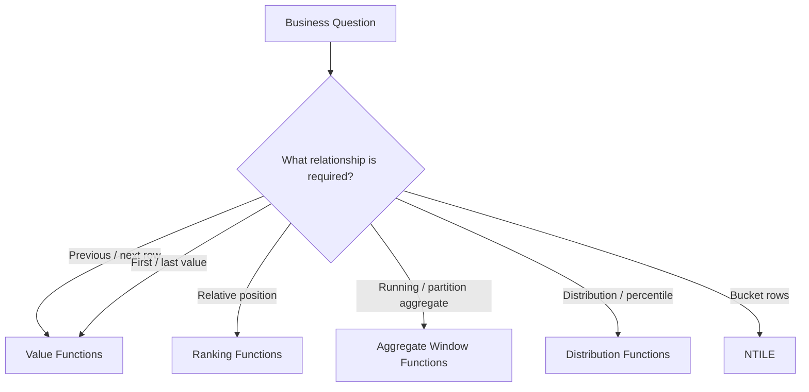
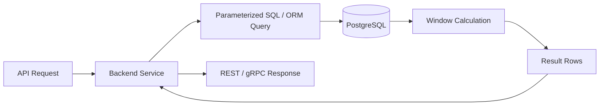

# 01- Window Function Selection Guide

## Overview

Window functions are SQL expressions that calculate values across a related set of rows while preserving the individual rows in the result.

The main selection problem is not remembering function names. It is identifying **what relationship the query needs to calculate**:

- Compare a row with another row.
- Rank rows within a group.
- Calculate a running or partition-level aggregate.
- Retrieve a value from a specific position.
- Divide rows into buckets.
- Calculate distribution or percentile information.

A useful engineering approach is to select the window function based on the **business question and row relationship**, then define `PARTITION BY`, `ORDER BY`, and the window frame explicitly where their semantics matter.

## The Core Mental Model

A window function operates over a logical window associated with each output row.

```sql
function(...) OVER (
    PARTITION BY ...
    ORDER BY ...
    frame
)
```

The three components answer different questions:

| Component | Question |
|---|---|
| `PARTITION BY` | Which rows belong to the same logical group? |
| `ORDER BY` | In what sequence should those rows be evaluated? |
| Frame | Which subset of the ordered partition is visible to the function? |

For example:

```sql
SUM(amount) OVER (
    PARTITION BY customer_id
    ORDER BY created_at, payment_id
    ROWS BETWEEN UNBOUNDED PRECEDING AND CURRENT ROW
)
```

means:

> For each payment, calculate the cumulative amount for that customer up to the current payment.

Changing the window definition can completely change the meaning of the result.

## Start With the Question

Before choosing a function, classify the required operation.



The function family should follow the relationship rather than the other way around.

## Window Function Families

| Family | Functions | Primary purpose |
|---|---|---|
| Ranking | `ROW_NUMBER()`, `RANK()`, `DENSE_RANK()` | Determine relative row position |
| Value | `LAG()`, `LEAD()`, `FIRST_VALUE()`, `LAST_VALUE()` | Retrieve values from related rows |
| Aggregate | `SUM()`, `AVG()`, `MIN()`, `MAX()`, `COUNT()` | Calculate aggregates while preserving rows |
| Distribution | `PERCENT_RANK()`, `CUME_DIST()`, `PERCENTILE_CONT()`* | Analyze relative distribution |
| Bucketing | `NTILE()` | Divide ordered rows into buckets |

\*Availability and exact syntax vary by database.

## Ranking vs Value Functions

One of the most common selection mistakes is confusing **row position** with **a value belonging to another row**.

Suppose:

| `employee_id` | `salary` |
|---:|---:|
| 101 | 90000 |
| 102 | 80000 |
| 103 | 70000 |

To identify the employee's position by salary:

```sql
ROW_NUMBER() OVER (
    ORDER BY salary DESC
)
```

To retrieve the salary of the previous employee in that ordering:

```sql
LAG(salary) OVER (
    ORDER BY salary DESC
)
```

The distinction is:

- Ranking functions answer **"Where is this row?"**
- Value functions answer **"What value belongs to another relevant row?"**

## Ranking Function Selection

### `ROW_NUMBER()`

Use `ROW_NUMBER()` when every row must receive a unique sequential position.

```sql
SELECT
    customer_id,
    order_id,
    created_at,
    ROW_NUMBER() OVER (
        PARTITION BY customer_id
        ORDER BY created_at DESC, order_id DESC
    ) AS row_number
FROM orders;
```

Typical uses:

- Latest row per entity.
- Deduplication.
- Pagination-oriented query transformations.
- Selecting one canonical record from duplicates.

If two rows have identical ordering values, add a deterministic tie-breaker.

### `RANK()`

Use `RANK()` when tied rows should share a position and gaps after ties are meaningful.

```sql
RANK() OVER (
    ORDER BY score DESC
)
```

For scores:

```text
100 → 1
100 → 1
 90 → 3
```

### `DENSE_RANK()`

Use `DENSE_RANK()` when tied rows should share a position without gaps.

```text
100 → 1
100 → 1
 90 → 2
```

### Ranking Decision

| Requirement | Function |
|---|---|
| Every row gets a unique position | `ROW_NUMBER()` |
| Ties share rank and gaps matter | `RANK()` |
| Ties share rank without gaps | `DENSE_RANK()` |

## Value Function Selection

Value functions are appropriate when the query needs a value from a different row in the ordered window.

| Requirement | Function |
|---|---|
| Previous row's value | `LAG()` |
| Following row's value | `LEAD()` |
| First value in the window | `FIRST_VALUE()` |
| Last value in the window | `LAST_VALUE()` |

Example:

```sql
SELECT
    order_id,
    changed_at,
    status,
    LAG(status) OVER (
        PARTITION BY order_id
        ORDER BY changed_at, history_id
    ) AS previous_status,
    LEAD(status) OVER (
        PARTITION BY order_id
        ORDER BY changed_at, history_id
    ) AS next_status
FROM order_status_history;
```

This is preferable to loading the entire history into Python and calculating adjacent rows in application code when the database can perform the operation efficiently.

## `LAG()` vs `LEAD()`

Use `LAG()` when the comparison points backward:

```sql
LAG(amount) OVER (
    PARTITION BY customer_id
    ORDER BY created_at, payment_id
)
```

Use `LEAD()` when the comparison points forward:

```sql
LEAD(amount) OVER (
    PARTITION BY customer_id
    ORDER BY created_at, payment_id
)
```

Typical questions:

| Business question | Function |
|---|---|
| What was the previous status? | `LAG()` |
| What was the previous payment? | `LAG()` |
| What happens next? | `LEAD()` |
| How long until the next event? | `LEAD()` |
| Did this value change from the previous record? | `LAG()` |
| What is the next state in a workflow? | `LEAD()` |

## `FIRST_VALUE()` vs `MIN()`

These functions are not interchangeable.

`FIRST_VALUE()` is positional:

```sql
FIRST_VALUE(amount) OVER (
    PARTITION BY customer_id
    ORDER BY created_at, payment_id
)
```

It returns the amount associated with the first ordered row.

`MIN()` is value-based:

```sql
MIN(amount) OVER (
    PARTITION BY customer_id
)
```

It returns the smallest amount regardless of which row contains it.

Use:

- `FIRST_VALUE()` → earliest/latest position according to ordering.
- `MIN()` → smallest value.

The same distinction applies to `LAST_VALUE()` and `MAX()`.

## `LAST_VALUE()` Requires Frame Awareness

`LAST_VALUE()` is a frequent source of incorrect SQL because its result depends on the window frame.

For a complete partition:

```sql
LAST_VALUE(status) OVER (
    PARTITION BY order_id
    ORDER BY changed_at, history_id
    ROWS BETWEEN UNBOUNDED PRECEDING AND UNBOUNDED FOLLOWING
)
```

The explicit frame makes it clear that the function can see the complete ordered partition.

Do not assume that:

```sql
LAST_VALUE(status) OVER (
    PARTITION BY order_id
    ORDER BY changed_at
)
```

always means "final status of the order."

The default frame behavior can make `LAST_VALUE()` return the current row's value or another value within the default frame, depending on the database and ordering semantics.

## Aggregate Window Functions

Use aggregate window functions when the requirement is about a group-level or running calculation while retaining each source row.

### Running Total

```sql
SUM(amount) OVER (
    PARTITION BY customer_id
    ORDER BY created_at, payment_id
    ROWS BETWEEN UNBOUNDED PRECEDING AND CURRENT ROW
) AS running_total
```

### Partition Total

```sql
SUM(amount) OVER (
    PARTITION BY customer_id
) AS customer_total
```

### Running Average

```sql
AVG(amount) OVER (
    PARTITION BY customer_id
    ORDER BY created_at, payment_id
    ROWS BETWEEN UNBOUNDED PRECEDING AND CURRENT ROW
) AS running_average
```

The key distinction is:

- Aggregate window → calculate from a set of rows.
- Value function → retrieve a value associated with another row.

## Window Function vs `GROUP BY`

Use `GROUP BY` when the required output is one row per group.

```sql
SELECT
    customer_id,
    SUM(amount) AS total_amount
FROM payments
GROUP BY customer_id;
```

Use a window function when the original rows must remain available.

```sql
SELECT
    payment_id,
    customer_id,
    amount,
    SUM(amount) OVER (
        PARTITION BY customer_id
    ) AS customer_total
FROM payments;
```

| Requirement | Preferred approach |
|---|---|
| One result row per group | `GROUP BY` |
| Keep every source row | Window function |
| Running calculation | Window function |
| Compare adjacent rows | Window function |
| Filter based on a calculated row number | Window function + outer query |

## Window Function vs Self-Join

A self-join can solve adjacent-row problems, but window functions usually express the intent more directly.

Self-join:

```sql
SELECT
    current_event.event_id,
    previous_event.event_id AS previous_event_id
FROM events AS current_event
LEFT JOIN events AS previous_event
    ON previous_event.user_id = current_event.user_id
    AND previous_event.occurred_at = (
        SELECT MAX(e.occurred_at)
        FROM events AS e
        WHERE e.user_id = current_event.user_id
          AND e.occurred_at < current_event.occurred_at
    );
```

Window function:

```sql
SELECT
    event_id,
    LAG(event_id) OVER (
        PARTITION BY user_id
        ORDER BY occurred_at, event_id
    ) AS previous_event_id
FROM events;
```

The window-function version usually provides clearer intent and gives the database an operation specifically designed for ordered row analysis.

## Filtering Window Results

Window functions are evaluated after `WHERE` filtering in the logical query-processing model. Therefore, a window result generally cannot be referenced directly in the same `WHERE` clause.

Use a subquery or CTE:

```sql
WITH ranked_orders AS (
    SELECT
        customer_id,
        order_id,
        created_at,
        ROW_NUMBER() OVER (
            PARTITION BY customer_id
            ORDER BY created_at DESC, order_id DESC
        ) AS row_number
    FROM orders
)
SELECT
    customer_id,
    order_id,
    created_at
FROM ranked_orders
WHERE row_number = 1;
```

This is the standard pattern for:

- Latest row per entity.
- Top N per group.
- Deduplication.
- Ranking-based filtering.

## `PARTITION BY` Selection

`PARTITION BY` defines the independent sequences over which the function operates.

For customer-specific history:

```sql
PARTITION BY customer_id
```

For organization-specific ranking:

```sql
PARTITION BY organization_id
```

For product-specific metrics:

```sql
PARTITION BY product_id
```

A missing partition can silently produce logically incorrect results.

For example:

```sql
LAG(status) OVER (
    ORDER BY changed_at
)
```

may compare events belonging to different orders.

The correct version may be:

```sql
LAG(status) OVER (
    PARTITION BY order_id
    ORDER BY changed_at, history_id
)
```

## `ORDER BY` Selection

`ORDER BY` defines the sequence used by the window function.

The ordering must represent the business meaning of "previous", "next", "first", or "last."

For an order history:

```sql
ORDER BY changed_at, history_id
```

For financial transactions:

```sql
ORDER BY transaction_at, transaction_id
```

For event processing:

```sql
ORDER BY event_sequence
```

Do not assume that a timestamp is sufficient if multiple records can have the same timestamp.

### Deterministic Ordering

Prefer:

```sql
ORDER BY occurred_at, event_id
```

over:

```sql
ORDER BY occurred_at
```

when `occurred_at` is not unique.

The additional key provides deterministic ordering among tied timestamps.

## Frame Selection

Window frames are most important when using:

- Running aggregates.
- `FIRST_VALUE()`.
- `LAST_VALUE()`.
- Other frame-sensitive functions.

Common frames include:

```sql
ROWS BETWEEN UNBOUNDED PRECEDING AND CURRENT ROW
```

and:

```sql
ROWS BETWEEN UNBOUNDED PRECEDING AND UNBOUNDED FOLLOWING
```

The first represents the rows from the beginning of the partition through the current row.

The second represents the entire partition.

When correctness depends on frame boundaries, make them explicit rather than relying on database defaults.

## Distribution and Percentile Analysis

Use distribution-oriented functions when the requirement concerns relative position within a population rather than simple ranking.

Examples include:

```sql
PERCENT_RANK()
```

and:

```sql
CUME_DIST()
```

These are useful for:

- Latency analysis.
- Customer segmentation.
- Revenue distribution.
- Performance percentile analysis.
- Capacity planning.

For example:

```sql
SELECT
    endpoint,
    latency_ms,
    PERCENT_RANK() OVER (
        PARTITION BY endpoint
        ORDER BY latency_ms
    ) AS latency_percentile_position
FROM request_metrics;
```

Be precise about terminology. A ranking position and a statistical percentile are related but not always interchangeable.

## `NTILE()`

Use `NTILE()` when rows should be divided into a specified number of ordered buckets.

```sql
SELECT
    customer_id,
    lifetime_value,
    NTILE(10) OVER (
        ORDER BY lifetime_value DESC
    ) AS value_decile
FROM customers;
```

Typical uses:

- Deciles.
- Quartiles.
- Customer segmentation.
- Approximate cohort bucketing.

`NTILE()` distributes rows, not numeric ranges. Uneven bucket sizes are therefore possible.

## Practical Selection Matrix

| Question | Function |
|---|---|
| What is the previous value? | `LAG()` |
| What is the next value? | `LEAD()` |
| What was the first ordered value? | `FIRST_VALUE()` |
| What is the final ordered value? | `LAST_VALUE()` |
| What is this row's unique position? | `ROW_NUMBER()` |
| What is this row's rank with gaps for ties? | `RANK()` |
| What is this row's rank without gaps? | `DENSE_RANK()` |
| What is the running total? | `SUM() OVER (...)` |
| What is the group total while keeping rows? | `SUM() OVER (PARTITION BY ...)` |
| What is the running average? | `AVG() OVER (...)` |
| What is the relative distribution position? | `PERCENT_RANK()` / `CUME_DIST()` |
| Which bucket contains this row? | `NTILE()` |
| What is the top row per group? | `ROW_NUMBER()` + outer filter |
| Did the value change? | `LAG()` + comparison |
| How long until the next event? | `LEAD()` + timestamp arithmetic |
| What is the gap since the previous event? | `LAG()` + timestamp arithmetic |

## Common Backend Patterns

### Latest Record Per Entity

```sql
WITH ranked AS (
    SELECT
        customer_id,
        order_id,
        created_at,
        ROW_NUMBER() OVER (
            PARTITION BY customer_id
            ORDER BY created_at DESC, order_id DESC
        ) AS rn
    FROM orders
)
SELECT
    customer_id,
    order_id,
    created_at
FROM ranked
WHERE rn = 1;
```

Use this when the requirement is:

> Return the latest row, not merely the latest timestamp.

### Detect State Changes

```sql
WITH history AS (
    SELECT
        order_id,
        changed_at,
        status,
        LAG(status) OVER (
            PARTITION BY order_id
            ORDER BY changed_at, history_id
        ) AS previous_status
    FROM order_status_history
)
SELECT *
FROM history
WHERE previous_status IS DISTINCT FROM status;
```

This is useful for audit processing and state-transition reporting.

### Calculate Event Duration

```sql
SELECT
    user_id,
    event_id,
    occurred_at,
    LEAD(occurred_at) OVER (
        PARTITION BY user_id
        ORDER BY occurred_at, event_id
    ) - occurred_at AS duration_until_next_event
FROM user_events;
```

This converts event rows into intervals.

### Top N Per Group

```sql
WITH ranked AS (
    SELECT
        department_id,
        employee_id,
        salary,
        ROW_NUMBER() OVER (
            PARTITION BY department_id
            ORDER BY salary DESC, employee_id
        ) AS rn
    FROM employees
)
SELECT
    department_id,
    employee_id,
    salary
FROM ranked
WHERE rn <= 3;
```

Use `RANK()` instead of `ROW_NUMBER()` if tied values should all receive the same rank and ties should influence which rows qualify.

## Choosing Between `ROW_NUMBER()` and `RANK()`

This decision is especially important for "top N" queries.

Suppose a department has salaries:

```text
120000
110000
110000
100000
```

With:

```sql
ROW_NUMBER()
```

the positions are:

```text
1
2
3
4
```

With:

```sql
RANK()
```

the positions are:

```text
1
2
2
4
```

If the business requirement is:

> Exactly three rows.

Use `ROW_NUMBER()`.

If the requirement is:

> Everyone tied at the third position should qualify.

Use an appropriate ranking strategy such as `RANK()`.

## Choosing Between `RANK()` and `DENSE_RANK()`

The difference matters after ties.

| Score | `RANK()` | `DENSE_RANK()` |
|---:|---:|---:|
| 100 | 1 | 1 |
| 100 | 1 | 1 |
| 90 | 3 | 2 |
| 80 | 4 | 3 |

Use `RANK()` when the gap represents the number of preceding rows.

Use `DENSE_RANK()` when the rank should represent the number of distinct ordered values encountered.

## Performance Considerations

Window functions commonly require the database to partition and order rows. On large datasets, sorting and memory consumption can become significant.

Inspect production-like execution plans:

```sql
EXPLAIN (ANALYZE, BUFFERS)
SELECT
    customer_id,
    created_at,
    amount,
    LAG(amount) OVER (
        PARTITION BY customer_id
        ORDER BY created_at, payment_id
    ) AS previous_amount
FROM payments;
```

For PostgreSQL, an index aligned with common access patterns can help:

```sql
CREATE INDEX idx_payments_customer_created_id
ON payments (customer_id, created_at, payment_id);
```

However, an index does not guarantee that the executor will avoid every sort or that the query will become fast. Validate with `EXPLAIN (ANALYZE, BUFFERS)` against realistic data volumes.

For API workloads:

- Avoid repeatedly recalculating expensive historical windows for every request.
- Consider materialized views or reporting tables for stable analytical results.
- Use read replicas where appropriate for read-heavy reporting.
- Keep OLTP queries bounded.
- Avoid sending millions of rows to Python merely to calculate row relationships.
- Monitor database memory, temporary file usage, execution time, and query concurrency.

## Backend Service Integration

In Django, FastAPI, or another backend service, window functions are usually best pushed into the database when the operation is relational and data-intensive.

The desired flow is generally:



For Django, ORM support for window expressions can be used where it maps cleanly to the required SQL. For complex analytical queries, a carefully reviewed SQL query can be preferable to forcing the ORM to express difficult semantics indirectly.

Always parameterize user-supplied values and avoid dynamically concatenating untrusted SQL fragments.

## Production Decision Rules

Use these rules when reviewing a window-function query:

### Prefer a Window Function When

- The result must retain individual rows.
- The calculation depends on row ordering.
- You need previous or next row context.
- You need ranking within groups.
- You need a running calculation.
- The relationship can be expressed naturally inside the database.

### Prefer `GROUP BY` When

- Only aggregate results are required.
- Individual source rows are not needed.
- The output is naturally one row per group.

### Consider Application-Level Processing When

- The transformation is not relational.
- The data volume is already small.
- Domain logic is substantially easier to maintain outside SQL.
- The database would otherwise perform an expensive operation that has no reusable relational value.

For large datasets, do not move processing to Python merely because SQL looks complicated. First inspect the execution plan and determine where the work is actually cheaper and more operationally appropriate.

## Common Mistakes and Interview Traps

| Mistake | Correct reasoning |
|---|---|
| Using `MIN()` instead of `FIRST_VALUE()` | Minimum is value-based; first value is position-based |
| Using `MAX()` instead of `LAST_VALUE()` | Maximum is value-based; last value is position-based |
| Omitting `PARTITION BY` | Different entities may be compared against each other |
| Using only a non-unique timestamp in `ORDER BY` | Row relationships may become non-deterministic |
| Assuming `LAG(..., 1)` means one day earlier | Offset means one row, not a time interval |
| Assuming `LAST_VALUE()` automatically returns the partition's final value | Window-frame semantics matter |
| Using `ROW_NUMBER()` when ties must be preserved | `RANK()` or `DENSE_RANK()` may better represent the requirement |
| Filtering before calculating historical context | Required rows may disappear from the window |
| Assuming an index guarantees fast window execution | The optimizer still decides the execution strategy |
| Calculating large windows in application code | Can cause excessive database-to-application transfer and memory usage |

## Reliability and Operational Considerations

Window-function queries are deterministic only when their ordering semantics are deterministic.

For production systems:

- Define stable tie-breakers.
- Test duplicate timestamps.
- Test empty partitions.
- Test single-row partitions.
- Test `NULL` values explicitly.
- Test first and last rows.
- Validate behavior when events arrive late.
- Test realistic partition sizes.
- Inspect execution plans after significant data growth.
- Monitor query latency and temporary disk usage.

For historical event systems, document what "order" means. Event time, ingestion time, sequence number, and database insertion order can produce different business results.

## Security Considerations

Window functions do not introduce a unique security model, but their queries still require normal database security practices.

- Use parameterized queries.
- Apply authorization filters before exposing tenant-specific data.
- Ensure `PARTITION BY` does not accidentally cross tenant boundaries.
- Avoid returning sensitive historical rows merely because the window calculation requires them.
- Apply row-level security where appropriate.
- Review reporting queries for cross-tenant data leakage.

For multi-tenant systems, tenant isolation is often part of the partitioning and filtering design:

```sql
LAG(status) OVER (
    PARTITION BY tenant_id, order_id
    ORDER BY changed_at, history_id
)
```

The exact partition keys should reflect the data model and authorization boundary.

## Interview Decision Framework

When given a window-function problem in an interview, use this sequence:

1. Identify the entity or group that must be analyzed.
2. Define the business ordering.
3. Determine whether the question asks for position, another row's value, an aggregate, or distribution.
4. Select the function family.
5. Add `PARTITION BY` if calculations must restart per entity.
6. Add a deterministic `ORDER BY`.
7. Define the frame when frame semantics affect correctness.
8. Use a CTE or subquery if the window result must be filtered.
9. Discuss indexes and execution cost for production-scale data.
10. Test boundary cases such as ties, `NULL`s, first rows, and last rows.

This approach is more reliable than memorizing isolated query patterns.

## Key Takeaways

- **Choose a window function from the business relationship: ranking answers position, value functions retrieve related-row values, and aggregates calculate over row sets.**
- **`PARTITION BY` defines independent groups, while deterministic `ORDER BY` defines the sequence; both are critical to correctness.**
- **`ROW_NUMBER()`, `RANK()`, and `DENSE_RANK()` differ primarily in how they handle uniqueness and ties.**
- **`LAG()`, `LEAD()`, `FIRST_VALUE()`, and `LAST_VALUE()` are positional operations and should not be confused with `MIN()` or `MAX()`.**
- **For production queries, make frame semantics explicit where necessary and validate performance with realistic execution plans and data volumes.**