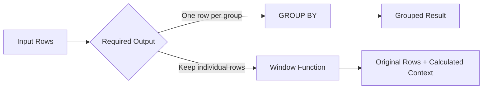

# 02- Window Function vs GROUP BY

## Overview

`GROUP BY` and window functions both operate across multiple rows, but they solve fundamentally different problems.

The key distinction is **row preservation**:

- `GROUP BY` collapses multiple input rows into one result row per group.
- A window function calculates across related rows while retaining the individual rows.

Choosing between them correctly affects query semantics, performance, API response shape, and the amount of data that must be processed by the application layer.

For backend systems, this distinction appears frequently in reporting APIs, dashboards, analytics queries, ranking, customer metrics, financial reporting, and "show each record together with its group-level metric" requirements.

## Core Difference

Consider a `payments` table:

| payment_id | customer_id | amount |
|---:|---:|---:|
| 101 | 1 | 100 |
| 102 | 1 | 250 |
| 103 | 2 | 400 |
| 104 | 2 | 150 |

A `GROUP BY` query:

```sql
SELECT
    customer_id,
    SUM(amount) AS total_amount
FROM payments
GROUP BY customer_id;
```

produces:

| customer_id | total_amount |
|---:|---:|
| 1 | 350 |
| 2 | 550 |

The individual payments are no longer present.

A window-function query:

```sql
SELECT
    payment_id,
    customer_id,
    amount,
    SUM(amount) OVER (
        PARTITION BY customer_id
    ) AS total_amount
FROM payments;
```

produces:

| payment_id | customer_id | amount | total_amount |
|---:|---:|---:|---:|
| 101 | 1 | 100 | 350 |
| 102 | 1 | 250 | 350 |
| 103 | 2 | 400 | 550 |
| 104 | 2 | 150 | 550 |

The aggregate is calculated per customer, but every payment row remains available.

## Mental Model

Think about the operations as two different transformations.



A useful rule is:

> If the question asks **"What is the result for each group?"**, start with `GROUP BY`.

> If the question asks **"What is the group-level information for each row?"**, start with a window function.

## How `GROUP BY` Works

`GROUP BY` partitions rows into groups and produces aggregate results for those groups.

```sql
SELECT
    customer_id,
    COUNT(*) AS payment_count,
    SUM(amount) AS total_amount,
    AVG(amount) AS average_amount
FROM payments
GROUP BY customer_id;
```

The database conceptually:

1. Reads qualifying rows.
2. Assigns rows to groups.
3. Computes aggregates for each group.
4. Produces one output row per group.

This makes `GROUP BY` appropriate for:

- Aggregated reports.
- Summary tables.
- Group-level API responses.
- Counts by status.
- Revenue by customer.
- Metrics by day.
- Metrics by service or endpoint.

## How Window Functions Work

A window function evaluates a value over a related set of rows while retaining the current row.

```sql
SELECT
    payment_id,
    customer_id,
    amount,
    SUM(amount) OVER (
        PARTITION BY customer_id
    ) AS customer_total
FROM payments;
```

Conceptually:

1. The query identifies the rows participating in the result.
2. Rows are logically divided into window partitions.
3. The window function evaluates each row against its partition or frame.
4. The original row remains in the result.

A window partition is therefore **not the same thing as a `GROUP BY` result group**.

## Side-by-Side Comparison

| Characteristic | `GROUP BY` | Window Function |
|---|---|---|
| Preserves individual rows | No | Yes |
| Produces one row per group | Yes | Usually no |
| Calculates aggregates | Yes | Yes |
| Supports previous/next row analysis | No | Yes |
| Supports ranking | No | Yes |
| Supports running totals | Not directly | Yes |
| Supports group total alongside detail | Requires additional query logic | Directly |
| Requires `OVER()` | No | Yes |
| Typical output | Summary | Detail + context |
| Best for | Aggregation | Analytical context |

## When to Use `GROUP BY`

Use `GROUP BY` when the desired result naturally represents a summary.

### Revenue by Customer

```sql
SELECT
    customer_id,
    SUM(amount) AS total_revenue
FROM payments
WHERE status = 'completed'
GROUP BY customer_id;
```

The output is one row per customer.

### Requests by HTTP Status

```sql
SELECT
    status_code,
    COUNT(*) AS request_count
FROM api_requests
WHERE occurred_at >= CURRENT_TIMESTAMP - INTERVAL '24 hours'
GROUP BY status_code;
```

This is naturally an aggregate report.

### Orders by Day

```sql
SELECT
    DATE(created_at) AS order_date,
    COUNT(*) AS order_count
FROM orders
GROUP BY DATE(created_at)
ORDER BY order_date;
```

There is no requirement to retain individual orders in the result.

## When to Use a Window Function

Use a window function when the calculation provides context for individual rows.

### Customer Total on Every Payment

```sql
SELECT
    payment_id,
    customer_id,
    amount,
    SUM(amount) OVER (
        PARTITION BY customer_id
    ) AS customer_total
FROM payments;
```

### Payment Rank Within Customer

```sql
SELECT
    payment_id,
    customer_id,
    amount,
    ROW_NUMBER() OVER (
        PARTITION BY customer_id
        ORDER BY amount DESC, payment_id
    ) AS payment_rank
FROM payments;
```

### Previous Payment Amount

```sql
SELECT
    payment_id,
    customer_id,
    amount,
    LAG(amount) OVER (
        PARTITION BY customer_id
        ORDER BY created_at, payment_id
    ) AS previous_amount
FROM payments;
```

These requirements cannot be expressed naturally using a simple `GROUP BY`.

## The Most Important Pattern: Aggregate + Detail

A common backend requirement is:

> Return every order and also show the customer's total order value.

A `GROUP BY` query alone cannot preserve the order rows:

```sql
SELECT
    customer_id,
    SUM(amount) AS customer_total
FROM orders
GROUP BY customer_id;
```

A window function directly expresses the requirement:

```sql
SELECT
    order_id,
    customer_id,
    amount,
    SUM(amount) OVER (
        PARTITION BY customer_id
    ) AS customer_total
FROM orders;
```

This is one of the strongest indicators that a window function is appropriate.

## `GROUP BY` Followed by a Join

You can also solve the same problem with a grouped subquery and a join:

```sql
SELECT
    o.order_id,
    o.customer_id,
    o.amount,
    totals.customer_total
FROM orders AS o
JOIN (
    SELECT
        customer_id,
        SUM(amount) AS customer_total
    FROM orders
    GROUP BY customer_id
) AS totals
    ON totals.customer_id = o.customer_id;
```

This can be valid SQL, but the window version is generally clearer:

```sql
SELECT
    order_id,
    customer_id,
    amount,
    SUM(amount) OVER (
        PARTITION BY customer_id
    ) AS customer_total
FROM orders;
```

The choice should still be validated with an execution plan when performance matters.

## `GROUP BY` Is Not a Replacement for Ranking

Consider:

> Find the three highest-paid employees in each department.

A grouped query can calculate the maximum salary:

```sql
SELECT
    department_id,
    MAX(salary) AS highest_salary
FROM employees
GROUP BY department_id;
```

But it cannot directly identify the top three employee rows.

A window function is appropriate:

```sql
WITH ranked AS (
    SELECT
        department_id,
        employee_id,
        salary,
        ROW_NUMBER() OVER (
            PARTITION BY department_id
            ORDER BY salary DESC, employee_id
        ) AS rn
    FROM employees
)
SELECT
    department_id,
    employee_id,
    salary
FROM ranked
WHERE rn <= 3;
```

The difference is important:

- `GROUP BY` answers **"What is the maximum?"**
- `ROW_NUMBER()` answers **"Which rows occupy the top positions?"**

## `GROUP BY` vs Running Aggregates

A running total requires row ordering and row-level output.

`GROUP BY`:

```sql
SELECT
    customer_id,
    SUM(amount) AS total_amount
FROM payments
GROUP BY customer_id;
```

Running total:

```sql
SELECT
    payment_id,
    customer_id,
    created_at,
    amount,
    SUM(amount) OVER (
        PARTITION BY customer_id
        ORDER BY created_at, payment_id
        ROWS BETWEEN UNBOUNDED PRECEDING AND CURRENT ROW
    ) AS running_total
FROM payments;
```

The window function is required because the result depends on the position of each row in an ordered sequence.

## `GROUP BY` vs Previous/Next Row Analysis

`GROUP BY` has no native concept of "previous row" or "next row."

For previous values:

```sql
SELECT
    event_id,
    user_id,
    occurred_at,
    event_type,
    LAG(event_type) OVER (
        PARTITION BY user_id
        ORDER BY occurred_at, event_id
    ) AS previous_event_type
FROM user_events;
```

For the next value:

```sql
SELECT
    event_id,
    user_id,
    occurred_at,
    event_type,
    LEAD(event_type) OVER (
        PARTITION BY user_id
        ORDER BY occurred_at, event_id
    ) AS next_event_type
FROM user_events;
```

If the requirement contains words such as **previous**, **next**, **before**, **after**, or **running**, a window function should usually be considered before `GROUP BY`.

## Filtering After Aggregation vs Filtering After a Window

`GROUP BY` can use `HAVING` to filter groups:

```sql
SELECT
    customer_id,
    SUM(amount) AS total_amount
FROM payments
GROUP BY customer_id
HAVING SUM(amount) > 10000;
```

A window-function result generally needs an outer query before it can be filtered:

```sql
WITH ranked AS (
    SELECT
        customer_id,
        order_id,
        amount,
        ROW_NUMBER() OVER (
            PARTITION BY customer_id
            ORDER BY amount DESC, order_id
        ) AS rn
    FROM orders
)
SELECT
    customer_id,
    order_id,
    amount
FROM ranked
WHERE rn <= 3;
```

The distinction follows SQL's logical processing model.

## Logical Query Processing

A simplified model is:

```text
FROM / JOIN
    ↓
WHERE
    ↓
GROUP BY
    ↓
HAVING
    ↓
Window Functions
    ↓
SELECT / ORDER BY
```

The exact internal execution plan can differ from this conceptual ordering, but this model is useful for understanding SQL semantics.

It explains why a window-function result generally cannot be referenced directly in the same query block's `WHERE` clause.

## Combining `GROUP BY` and Window Functions

The two techniques are not mutually exclusive.

A common production pattern is:

1. Aggregate raw events.
2. Apply a window function to the aggregated rows.

For example, calculate daily revenue and rank days by revenue:

```sql
WITH daily_revenue AS (
    SELECT
        DATE(created_at) AS order_date,
        SUM(amount) AS revenue
    FROM orders
    WHERE status = 'completed'
    GROUP BY DATE(created_at)
)
SELECT
    order_date,
    revenue,
    RANK() OVER (
        ORDER BY revenue DESC
    ) AS revenue_rank
FROM daily_revenue;
```

Here:

- `GROUP BY` transforms individual orders into daily aggregates.
- `RANK()` analyzes those aggregate rows.

This layered approach is extremely useful for reporting and analytics.

## Another Combination: Aggregate Then Compare

Suppose an API needs each month's revenue and the previous month's revenue.

First aggregate:

```sql
WITH monthly_revenue AS (
    SELECT
        DATE_TRUNC('month', created_at) AS month,
        SUM(amount) AS revenue
    FROM orders
    WHERE status = 'completed'
    GROUP BY DATE_TRUNC('month', created_at)
)
SELECT
    month,
    revenue,
    LAG(revenue) OVER (
        ORDER BY month
    ) AS previous_month_revenue
FROM monthly_revenue
ORDER BY month;
```

This is preferable to trying to calculate monthly aggregation and previous-month comparison against raw order rows simultaneously.

## Performance Considerations

Neither technique is universally faster.

The correct approach depends on:

- Number of input rows.
- Number and size of partitions.
- Group cardinality.
- Sort requirements.
- Available indexes.
- Predicate selectivity.
- Join complexity.
- Database engine.
- Memory available to the query.
- Whether intermediate results are materialized.

### `GROUP BY`

Aggregations can use database strategies such as:

- Hash aggregation.
- Sort-based aggregation.
- Parallel aggregation, depending on the database and query.

### Window Functions

Window operations commonly require ordering within partitions. This can introduce sorting or other execution work.

Inspect actual plans rather than guessing:

```sql
EXPLAIN (ANALYZE, BUFFERS)
SELECT
    payment_id,
    customer_id,
    amount,
    SUM(amount) OVER (
        PARTITION BY customer_id
    ) AS customer_total
FROM payments;
```

For ordered windows:

```sql
EXPLAIN (ANALYZE, BUFFERS)
SELECT
    payment_id,
    customer_id,
    created_at,
    LAG(amount) OVER (
        PARTITION BY customer_id
        ORDER BY created_at, payment_id
    ) AS previous_amount
FROM payments;
```

## Indexing Considerations

For frequently executed window queries, an index aligned with filtering, partitioning, and ordering can sometimes reduce execution cost.

For example:

```sql
CREATE INDEX idx_payments_customer_created_id
ON payments (customer_id, created_at, payment_id);
```

This aligns with:

```sql
PARTITION BY customer_id
ORDER BY created_at, payment_id
```

However, an index is not a guarantee that PostgreSQL or another database will avoid sorting or use that index.

Always verify with `EXPLAIN (ANALYZE, BUFFERS)`.

For `GROUP BY`, useful indexes often depend more heavily on:

- Filtering predicates.
- Grouping cardinality.
- Table size.
- Query frequency.
- Aggregation strategy.

Avoid creating indexes solely because a column appears in `GROUP BY` or `PARTITION BY`. Indexes have write, storage, and maintenance costs.

## Backend API Design

The choice between `GROUP BY` and a window function should also reflect the API contract.

### Aggregated Endpoint

A metrics endpoint might naturally return:

```json
[
  {
    "customer_id": 101,
    "total_revenue": 125000
  },
  {
    "customer_id": 102,
    "total_revenue": 98000
  }
]
```

`GROUP BY` is a natural fit.

### Detail + Context Endpoint

An order endpoint might return:

```json
[
  {
    "order_id": 5001,
    "amount": 450,
    "customer_total": 4200,
    "customer_order_rank": 3
  }
]
```

Window functions are a natural fit because each order needs additional context.

The important engineering principle is to produce the required relational shape in the database instead of transferring large datasets to Django, FastAPI, or Python for avoidable post-processing.

## Multi-Tenant Systems

Tenant boundaries must be considered explicitly.

For an aggregated query:

```sql
SELECT
    tenant_id,
    customer_id,
    SUM(amount) AS total_amount
FROM payments
WHERE tenant_id = :tenant_id
GROUP BY tenant_id, customer_id;
```

For a window query:

```sql
SELECT
    payment_id,
    tenant_id,
    customer_id,
    amount,
    SUM(amount) OVER (
        PARTITION BY tenant_id, customer_id
    ) AS customer_total
FROM payments
WHERE tenant_id = :tenant_id;
```

The `WHERE` predicate provides the query boundary, while the partition definition determines how rows are grouped for the window calculation.

Do not rely on `PARTITION BY` as an authorization mechanism. Tenant authorization must be enforced independently through query predicates, application authorization, database row-level security, or a combination of these controls.

## Common Mistakes

| Mistake | Why it is wrong | Better approach |
|---|---|---|
| Using `GROUP BY` when detail rows are required | Groups collapse rows | Use a window function |
| Using a window function for a simple summary | Adds unnecessary analytical complexity | Prefer `GROUP BY` |
| Assuming window functions replace `GROUP BY` | They solve different output-shape problems | Choose based on required result |
| Calculating totals in Python | Increases data transfer and application memory usage | Let the database aggregate |
| Using `MAX()` to find the row with the maximum value | `MAX()` returns the value, not necessarily the complete row | Use ranking or an appropriate row-selection pattern |
| Using `GROUP BY` to find previous rows | Grouping has no row-order relationship | Use `LAG()` |
| Forgetting deterministic ordering | Equal ordering values can make row relationships ambiguous | Add a stable tie-breaker |
| Filtering window results in `WHERE` directly | Window results are not available at that query stage | Use a CTE or subquery |
| Assuming window queries are always slower | Performance depends on execution strategy and data | Benchmark with realistic data |
| Indexing every partition/order column blindly | Indexes have write and storage costs | Validate with execution plans |

## Production Decision Matrix

| Requirement | Recommended approach |
|---|---|
| One row per customer with total revenue | `GROUP BY` |
| Every order with customer total | Window function |
| Top N rows per customer | Window function |
| Previous transaction value | `LAG()` |
| Next transaction value | `LEAD()` |
| Running balance | Window aggregate |
| Revenue by month | `GROUP BY` |
| Monthly revenue compared with previous month | `GROUP BY` + `LAG()` |
| Maximum value per group only | `GROUP BY` |
| Complete row containing the maximum value | Window function or database-specific row-selection pattern |
| Percentage of each row's group total | Window aggregate |
| Simple count by status | `GROUP BY` |
| Rank customers by revenue | `GROUP BY` + ranking window |

## Percentage of Group Total

A particularly useful window-function pattern is calculating each row's contribution to a group total.

```sql
SELECT
    payment_id,
    customer_id,
    amount,
    SUM(amount) OVER (
        PARTITION BY customer_id
    ) AS customer_total,
    amount / NULLIF(
        SUM(amount) OVER (PARTITION BY customer_id),
        0
    ) AS percentage_of_customer_total
FROM payments;
```

The `GROUP BY` equivalent would first calculate totals and then require a join back to the detail rows.

For repeated complex expressions, consider computing the window result once in a CTE or derived table for readability.

## Production Guidance

For senior-level query design, evaluate more than whether the SQL produces the correct result.

Consider:

- **Result shape** — Does the query return exactly the rows the API requires?
- **Cardinality** — Could a join accidentally multiply rows?
- **Determinism** — Are ranking and adjacent-row relationships stable?
- **Data volume** — How many rows participate in the window or aggregation?
- **Partition size** — Could a single tenant or customer create a very large partition?
- **Indexes** — Are filtering and ordering supported appropriately?
- **Memory** — Could sorting or aggregation spill to temporary storage?
- **Concurrency** — What happens when many API requests execute the query simultaneously?
- **Caching** — Is the calculation stable enough to cache or materialize?
- **Freshness** — Does the endpoint require real-time data or eventually consistent reporting data?
- **Authorization** — Can the query accidentally cross tenant or access boundaries?

For high-volume analytics, consider pre-aggregation, materialized views, reporting tables, or dedicated analytical infrastructure rather than repeatedly executing expensive windows against an OLTP table.

## Interview Decision Framework

When deciding between `GROUP BY` and a window function, ask:

1. **Do I need one row per group?**
   - Yes → start with `GROUP BY`.

2. **Do I need to preserve every input row?**
   - Yes → consider a window function.

3. **Do I need previous or next row information?**
   - Yes → use `LAG()` or `LEAD()`.

4. **Do I need ranking or top N within groups?**
   - Yes → use a ranking window function.

5. **Do I need a running calculation?**
   - Yes → use an ordered window aggregate.

6. **Do I need both aggregated data and row-level analysis?**
   - Use `GROUP BY` in an inner query and a window function in an outer query.

7. **Could the query process millions of rows?**
   - Inspect the execution plan and evaluate indexing, partition size, memory, and workload concurrency.

## Key Takeaways

- **`GROUP BY` collapses rows into groups, while window functions calculate across related rows without removing the individual rows.**
- **Use `GROUP BY` for summaries and window functions for row-level context such as ranking, running totals, previous/next values, and group metrics.**
- **`GROUP BY` and window functions can be combined: aggregate first, then use a window function to analyze the aggregated result.**
- **Choose based on result shape and business semantics first, then validate performance with realistic execution plans and data volumes.**
- **For production systems, deterministic ordering, tenant boundaries, partition size, indexing, memory usage, and API response shape all matter.**