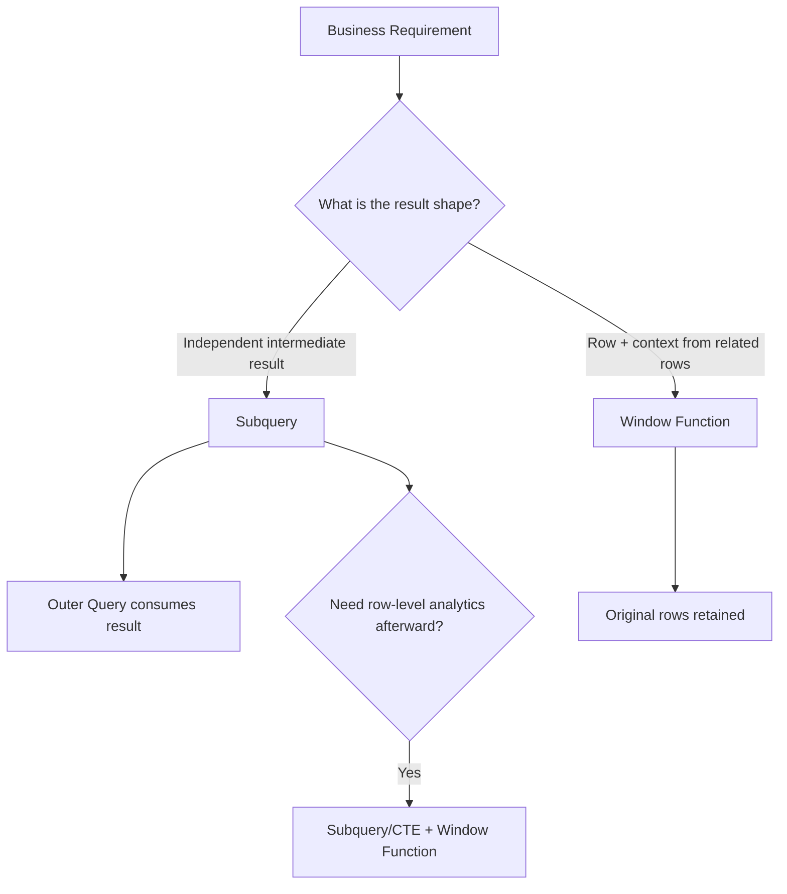
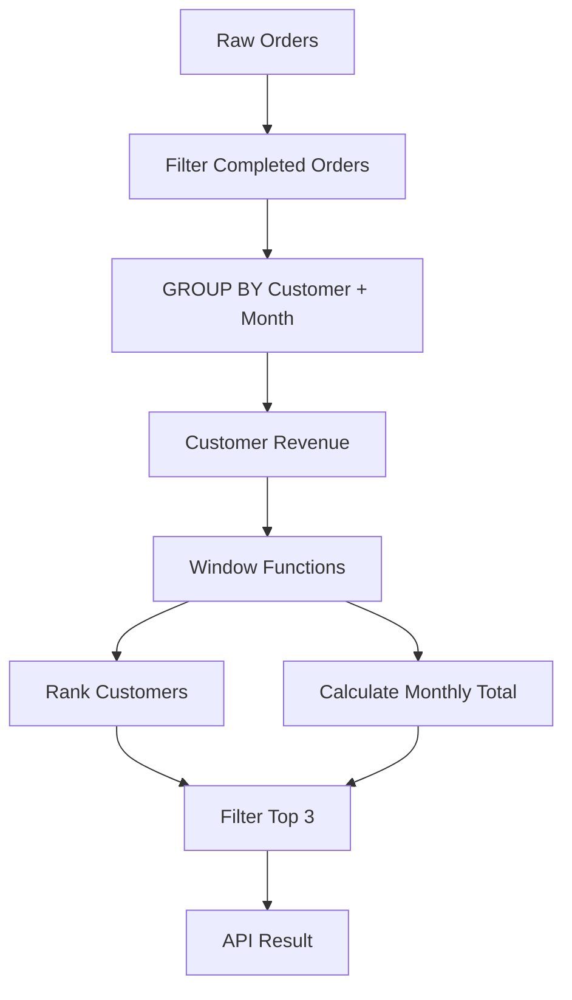

# 03- Window Function vs Subquery

## Overview

Window functions and subqueries can often solve the same business requirement, but they express different relational operations.

A **subquery** creates an intermediate result that can be used by an outer query. A **window function** calculates a value across related rows while preserving the rows being analyzed.

The practical choice depends primarily on the required result shape:

- Use a **window function** when the calculation is naturally a property of each row relative to other rows.
- Use a **subquery** when you need an independent result set, filtering boundary, existence test, scalar lookup, or reusable intermediate relation.
- Use both when aggregation, filtering, and row-level analytics need to happen in separate logical stages.

For backend systems, this distinction matters because poorly chosen query structures can cause unnecessary joins, repeated scans, large intermediate datasets, application-side processing, or incorrect row semantics.

## Core Difference

Consider an `orders` table:

| order_id | customer_id | amount |
|---:|---:|---:|
| 101 | 1 | 100 |
| 102 | 1 | 250 |
| 103 | 2 | 400 |
| 104 | 2 | 150 |

A window function can calculate the customer total while retaining every order:

```sql
SELECT
    order_id,
    customer_id,
    amount,
    SUM(amount) OVER (
        PARTITION BY customer_id
    ) AS customer_total
FROM orders;
```

Result:

| order_id | customer_id | amount | customer_total |
|---:|---:|---:|---:|
| 101 | 1 | 100 | 350 |
| 102 | 1 | 250 | 350 |
| 103 | 2 | 400 | 550 |
| 104 | 2 | 150 | 550 |

The same result can be produced with an aggregated subquery:

```sql
SELECT
    o.order_id,
    o.customer_id,
    o.amount,
    totals.customer_total
FROM orders AS o
JOIN (
    SELECT
        customer_id,
        SUM(amount) AS customer_total
    FROM orders
    GROUP BY customer_id
) AS totals
    ON totals.customer_id = o.customer_id;
```

Both are valid. The window-function version directly expresses **"calculate a group-level value for each detail row."**

## Mental Model



A useful distinction is:

> A subquery changes the **relational scope** of a query.

> A window function changes the **context available to each row**.

## What Is a Subquery?

A subquery is a query nested inside another SQL statement.

Common forms include:

- Scalar subqueries.
- Derived tables.
- Correlated subqueries.
- `EXISTS` subqueries.
- `IN` subqueries.
- Subqueries used with `UPDATE`, `DELETE`, or `INSERT`.

For example:

```sql
SELECT
    customer_id,
    customer_name
FROM customers
WHERE customer_id IN (
    SELECT customer_id
    FROM orders
    WHERE amount > 1000
);
```

The inner query determines which customers qualify. The outer query then retrieves customer records.

### Why Subqueries Exist

Subqueries allow you to:

- Separate logical query stages.
- Create intermediate relations.
- Filter based on another result.
- Express existence conditions.
- Compare a row against an aggregate.
- Avoid exposing intermediate calculations to the application.

Subqueries are therefore broader than window functions. A window function is specifically designed for calculations across a row's window.

## What Is a Window Function?

A window function performs a calculation over a set of related rows without collapsing them.

```sql
SELECT
    order_id,
    customer_id,
    amount,
    AVG(amount) OVER (
        PARTITION BY customer_id
    ) AS customer_average
FROM orders;
```

The rows remain individual orders, while each order gains additional context.

Window functions include:

| Category | Examples |
|---|---|
| Ranking | `ROW_NUMBER()`, `RANK()`, `DENSE_RANK()` |
| Value | `LAG()`, `LEAD()`, `FIRST_VALUE()`, `LAST_VALUE()` |
| Aggregate | `SUM()`, `AVG()`, `MIN()`, `MAX()`, `COUNT()` |
| Distribution | `NTILE()`, `PERCENT_RANK()`, `CUME_DIST()` |

## Where Window Functions Are Clearly Better

Window functions are usually the clearest solution when the requirement is inherently positional or analytical.

### Previous Row

```sql
SELECT
    order_id,
    customer_id,
    created_at,
    amount,
    LAG(amount) OVER (
        PARTITION BY customer_id
        ORDER BY created_at, order_id
    ) AS previous_amount
FROM orders;
```

A subquery could theoretically find the previous order, but expressing the relationship manually would be substantially more complicated.

### Next Row

```sql
SELECT
    order_id,
    customer_id,
    created_at,
    LEAD(amount) OVER (
        PARTITION BY customer_id
        ORDER BY created_at, order_id
    ) AS next_amount
FROM orders;
```

### Ranking

```sql
SELECT
    order_id,
    customer_id,
    amount,
    ROW_NUMBER() OVER (
        PARTITION BY customer_id
        ORDER BY amount DESC, order_id
    ) AS order_rank
FROM orders;
```

A subquery-based implementation would require substantially more relational logic.

### Running Total

```sql
SELECT
    order_id,
    customer_id,
    created_at,
    amount,
    SUM(amount) OVER (
        PARTITION BY customer_id
        ORDER BY created_at, order_id
        ROWS BETWEEN UNBOUNDED PRECEDING AND CURRENT ROW
    ) AS running_total
FROM orders;
```

The combination of `PARTITION BY`, `ORDER BY`, and the frame makes the intent explicit.

## Where Subqueries Are Clearly Better

Not every analytical problem should use a window function.

### Filtering Based on Existence

```sql
SELECT
    c.customer_id,
    c.name
FROM customers AS c
WHERE EXISTS (
    SELECT 1
    FROM orders AS o
    WHERE o.customer_id = c.customer_id
      AND o.status = 'completed'
);
```

A window function would be unnecessary here.

### Scalar Lookup

```sql
SELECT
    customer_id,
    name,
    (
        SELECT MAX(created_at)
        FROM orders AS o
        WHERE o.customer_id = c.customer_id
    ) AS last_order_at
FROM customers AS c;
```

Depending on the query and database, a join or pre-aggregated subquery may also be preferable.

### Aggregated Intermediate Result

Suppose the requirement is to rank customers by total revenue.

First calculate revenue per customer:

```sql
WITH customer_revenue AS (
    SELECT
        customer_id,
        SUM(amount) AS total_revenue
    FROM orders
    WHERE status = 'completed'
    GROUP BY customer_id
)
SELECT
    customer_id,
    total_revenue,
    RANK() OVER (
        ORDER BY total_revenue DESC
    ) AS revenue_rank
FROM customer_revenue;
```

Here the subquery or CTE establishes the correct intermediate grain before the window function operates.

## Window Function vs Correlated Subquery

A particularly important comparison is retrieving a value from a related row.

### Correlated Subquery

```sql
SELECT
    o.order_id,
    o.customer_id,
    o.created_at,
    (
        SELECT MAX(o2.created_at)
        FROM orders AS o2
        WHERE o2.customer_id = o.customer_id
          AND o2.created_at < o.created_at
    ) AS previous_order_at
FROM orders AS o;
```

This asks the database to determine the latest earlier order for each current order.

### Window Function

```sql
SELECT
    order_id,
    customer_id,
    created_at,
    LAG(created_at) OVER (
        PARTITION BY customer_id
        ORDER BY created_at, order_id
    ) AS previous_order_at
FROM orders;
```

The window version expresses the ordered relationship directly and is usually easier to reason about.

The two approaches should not be assumed to have identical execution costs. The optimizer, indexes, data distribution, and database engine determine the actual plan.

## Window Function vs Scalar Subquery for Group Metrics

Suppose every order should include the customer's average order amount.

Window function:

```sql
SELECT
    order_id,
    customer_id,
    amount,
    AVG(amount) OVER (
        PARTITION BY customer_id
    ) AS customer_average
FROM orders;
```

Subquery:

```sql
SELECT
    o.order_id,
    o.customer_id,
    o.amount,
    totals.customer_average
FROM orders AS o
JOIN (
    SELECT
        customer_id,
        AVG(amount) AS customer_average
    FROM orders
    GROUP BY customer_id
) AS totals
    ON totals.customer_id = o.customer_id;
```

The window version is typically preferable when the metric is directly derived from the same row set.

The subquery version becomes useful when the intermediate result needs additional filtering, joins, grouping, or reuse.

## Correlated vs Non-Correlated Subqueries

### Non-Correlated Subquery

A non-correlated subquery can execute independently of the outer query logically:

```sql
SELECT
    customer_id,
    name
FROM customers
WHERE customer_id IN (
    SELECT customer_id
    FROM orders
    WHERE status = 'completed'
);
```

### Correlated Subquery

A correlated subquery references a column from the outer query:

```sql
SELECT
    c.customer_id,
    c.name
FROM customers AS c
WHERE EXISTS (
    SELECT 1
    FROM orders AS o
    WHERE o.customer_id = c.customer_id
);
```

The database optimizer may transform correlated subqueries into joins, semi-joins, or other efficient execution strategies. Do not assume that "correlated" automatically means "executed once per outer row."

Always inspect the execution plan for important production queries.

## CTE vs Window Function

A Common Table Expression can provide a logical query boundary:

```sql
WITH ranked_orders AS (
    SELECT
        order_id,
        customer_id,
        amount,
        ROW_NUMBER() OVER (
            PARTITION BY customer_id
            ORDER BY amount DESC, order_id
        ) AS rn
    FROM orders
)
SELECT
    order_id,
    customer_id,
    amount
FROM ranked_orders
WHERE rn <= 3;
```

The CTE is not an alternative to the window function here.

They solve different problems:

- `ROW_NUMBER()` performs the analytical calculation.
- The CTE creates a query stage in which the calculated value can be filtered.

This distinction is important when reading complex SQL.

## Filtering Window Results

A common mistake is trying to filter a window result in the same query block:

```sql
SELECT
    order_id,
    customer_id,
    amount,
    ROW_NUMBER() OVER (
        PARTITION BY customer_id
        ORDER BY amount DESC
    ) AS rn
FROM orders
WHERE rn <= 3;
```

This is invalid in PostgreSQL because the window result is not available to `WHERE` at that logical processing stage.

Use a CTE:

```sql
WITH ranked_orders AS (
    SELECT
        order_id,
        customer_id,
        amount,
        ROW_NUMBER() OVER (
            PARTITION BY customer_id
            ORDER BY amount DESC, order_id
        ) AS rn
    FROM orders
)
SELECT
    order_id,
    customer_id,
    amount
FROM ranked_orders
WHERE rn <= 3;
```

If supported by the database version, `QUALIFY` can provide a more direct syntax. PostgreSQL does not currently provide `QUALIFY`, so the CTE or derived-table pattern remains common there.

## Result Shape Is the Primary Decision

| Requirement | Preferred technique |
|---|---|
| Filter rows based on existence | `EXISTS` subquery |
| Lookup a scalar aggregate | Subquery or join |
| Build an intermediate relation | Subquery / CTE |
| Preserve rows and calculate group metric | Window function |
| Previous row | `LAG()` |
| Next row | `LEAD()` |
| Rank rows | Ranking window function |
| Running total | Window aggregate |
| Filter a window result | CTE / derived table |
| Aggregate first, then rank | `GROUP BY` + window function |
| Compare row with group average | Window function |
| Compare against an independently computed dataset | Subquery / CTE |
| Complex multi-stage analytical query | CTE/subquery + window functions |

## Combining Both Techniques

Production queries frequently use subqueries and window functions together.

Consider an API that needs the top three customers by monthly revenue, along with each customer's percentage of total monthly revenue.

First aggregate:

```sql
WITH customer_revenue AS (
    SELECT
        customer_id,
        DATE_TRUNC('month', created_at) AS month,
        SUM(amount) AS revenue
    FROM orders
    WHERE status = 'completed'
    GROUP BY
        customer_id,
        DATE_TRUNC('month', created_at)
),
ranked AS (
    SELECT
        customer_id,
        month,
        revenue,
        RANK() OVER (
            PARTITION BY month
            ORDER BY revenue DESC, customer_id
        ) AS revenue_rank,
        SUM(revenue) OVER (
            PARTITION BY month
        ) AS monthly_revenue
    FROM customer_revenue
)
SELECT
    customer_id,
    month,
    revenue,
    revenue_rank,
    revenue / NULLIF(monthly_revenue, 0) AS revenue_share
FROM ranked
WHERE revenue_rank <= 3
ORDER BY month, revenue_rank;
```

This query demonstrates the intended layering:



The database performs the complete analytical pipeline without transferring raw orders to the application.

## Performance Considerations

The phrase **"window functions are faster than subqueries"** is too simplistic.

Performance depends on the execution plan.

### Window Functions

Window functions may require:

- Sorting by partition and ordering columns.
- Partition processing.
- Memory for intermediate rows.
- Temporary storage when operations exceed available memory.

For example:

```sql
EXPLAIN (ANALYZE, BUFFERS)
SELECT
    order_id,
    customer_id,
    amount,
    ROW_NUMBER() OVER (
        PARTITION BY customer_id
        ORDER BY created_at, order_id
    ) AS rn
FROM orders;
```

### Subqueries

Subqueries may result in:

- Hash joins.
- Nested-loop joins.
- Index scans.
- Aggregation.
- Semi-joins.
- Materialized intermediate results.

The optimizer may rewrite apparently different SQL formulations into similar execution plans.

### Production Rule

Compare actual plans rather than comparing SQL syntax alone:

```sql
EXPLAIN (ANALYZE, BUFFERS)
...
```

Measure with realistic:

- Row counts.
- Data distribution.
- Selectivity.
- Concurrent workload.
- Index configuration.

## Indexing

Indexes should support the actual access pattern rather than the syntax alone.

For a query frequently using:

```sql
PARTITION BY customer_id
ORDER BY created_at, order_id
```

an index such as:

```sql
CREATE INDEX idx_orders_customer_created_id
ON orders (customer_id, created_at, order_id);
```

may be useful.

For correlated lookups such as:

```sql
WHERE o2.customer_id = o.customer_id
  AND o2.created_at < o.created_at
```

an index beginning with `customer_id` and including the temporal lookup column may help:

```sql
CREATE INDEX idx_orders_customer_created
ON orders (customer_id, created_at);
```

These are workload-dependent recommendations, not guarantees. PostgreSQL can still choose another plan when it estimates that a sequential scan or sort is cheaper.

## Deterministic Ordering

Window functions that depend on row order require deterministic ordering whenever business correctness depends on exact row relationships.

Avoid:

```sql
LAG(amount) OVER (
    PARTITION BY customer_id
    ORDER BY created_at
)
```

if multiple orders can have the same `created_at`.

Prefer:

```sql
LAG(amount) OVER (
    PARTITION BY customer_id
    ORDER BY created_at, order_id
)
```

The unique `order_id` provides a stable tie-breaker.

This is especially important for:

- `LAG()`.
- `LEAD()`.
- `ROW_NUMBER()`.
- Running totals.
- Event sequencing.
- Change detection.

## Null Handling

Both subqueries and window functions can expose `NULL` semantics that affect application behavior.

For example:

```sql
SELECT
    order_id,
    LAG(amount) OVER (
        PARTITION BY customer_id
        ORDER BY created_at, order_id
    ) AS previous_amount
FROM orders;
```

The first row of each customer partition has no previous row, so `previous_amount` is `NULL`.

Do not blindly convert it to zero:

```sql
COALESCE(previous_amount, 0)
```

unless zero actually represents the business meaning of "no previous value."

For financial and operational systems, preserving the distinction between **missing**, **not applicable**, and **zero** is often important.

## Backend Engineering Considerations

Window functions and subqueries are particularly useful in Django and FastAPI applications because they allow analytical work to remain in PostgreSQL instead of moving data into Python.

For example, Django can expose a window expression through its ORM:

```python
from django.db.models import F, Window
from django.db.models.functions import Lag

orders = Order.objects.annotate(
    previous_amount=Window(
        expression=Lag("amount"),
        partition_by=[F("customer_id")],
        order_by=[F("created_at").asc(), F("id").asc()],
    )
)
```

The database performs the row comparison, and Django receives the calculated result.

For complex analytical queries, however, ORM readability can degrade quickly. Use:

- Django ORM when the generated SQL remains clear and maintainable.
- Database views or materialized views for stable reporting models.
- Carefully reviewed raw SQL when the query is substantially clearer or more efficient that way.

The key requirement is to retain control over the generated SQL and execution plan.

## Production Pitfalls

### Replacing Every Subquery with a Window Function

Not every subquery represents an analytical row relationship.

For example:

```sql
WHERE EXISTS (...)
```

is naturally expressed as an existence test. A window function would add complexity without improving the query.

### Assuming Correlated Subqueries Are Always Slow

Modern optimizers can transform correlated constructs into efficient execution strategies.

Measure before rewriting.

### Assuming Window Functions Eliminate All Joins

A window function can calculate context from the current relation, but it cannot replace arbitrary relational operations.

If data must come from another table, a join may still be required.

### Performing Analytics in Python

Avoid fetching thousands or millions of rows into Python just to calculate:

- Rankings.
- Running totals.
- Previous values.
- Group percentages.
- Change detection.

The database is optimized for set-based relational processing and can usually perform these calculations closer to the data.

### Ignoring Query Cardinality

A subquery or join can accidentally change the number of rows returned.

Always verify:

```text
Expected rows
    ↓
Join/subquery cardinality
    ↓
Window calculation
    ↓
Final rows
```

A window function itself does not multiply rows, but joins around it can.

## Security Considerations

Neither technique inherently provides authorization.

For a multi-tenant application, enforce tenant boundaries explicitly:

```sql
SELECT
    order_id,
    customer_id,
    amount,
    SUM(amount) OVER (
        PARTITION BY customer_id
    ) AS customer_total
FROM orders
WHERE tenant_id = :tenant_id;
```

The `tenant_id` predicate must be enforced consistently.

Do not assume that:

```sql
PARTITION BY tenant_id
```

is sufficient authorization. It only defines the analytical partition.

Use parameterized queries and ORM parameter binding rather than interpolating request values into SQL.

## Decision Framework

When choosing between a window function and a subquery, ask:

1. **Do I need an independent intermediate result?**
   - Yes → use a subquery or CTE.

2. **Do I need to filter based on another relation?**
   - Consider `EXISTS`, `IN`, or a join.

3. **Do I need to retain each row while calculating context from related rows?**
   - Use a window function.

4. **Does the calculation depend on previous, next, first, last, rank, or running position?**
   - Use a window function.

5. **Do I need to aggregate before performing row-level analysis?**
   - Use a subquery/CTE followed by a window function.

6. **Could either approach work?**
   - Prefer the version that expresses the business rule most directly and produces a maintainable execution plan.

7. **Is the query performance-sensitive?**
   - Compare `EXPLAIN (ANALYZE, BUFFERS)` results using realistic production-like data.

## Interview Traps

| Interview statement | Correct interpretation |
|---|---|
| "Window functions replace subqueries." | False. They solve overlapping but different problems. |
| "Correlated subqueries always execute once per outer row." | False. The optimizer may transform them. |
| "Window functions always perform better." | False. Execution plans determine performance. |
| "A window function groups rows." | It logically defines a window; unlike `GROUP BY`, it preserves rows. |
| "CTEs are alternatives to window functions." | Not necessarily. A CTE often provides a stage around a window calculation. |
| "A window function can be filtered directly in `WHERE`." | Generally no in PostgreSQL; use a subquery/CTE. |
| "Subqueries are always less readable." | False. `EXISTS`, scalar lookups, and staged transformations can be clearer as subqueries. |

## Practical Selection Guide

| If the requirement says... | Start with... |
|---|---|
| "Does this related record exist?" | `EXISTS` |
| "Return the aggregate for every detail row" | Window function |
| "Show the previous record" | `LAG()` |
| "Show the next record" | `LEAD()` |
| "Rank records within each group" | `ROW_NUMBER()` / `RANK()` |
| "Calculate a running value" | Window aggregate |
| "Filter based on a calculated window value" | CTE / derived table + window function |
| "Calculate an aggregate first, then rank it" | `GROUP BY` + window function |
| "Use an independently filtered dataset" | Subquery / CTE |
| "Check whether another relation satisfies a condition" | `EXISTS` |
| "Need complex multi-stage analytics" | CTE/subquery + window functions |

## Key Takeaways

- **Use window functions for row-level analytical context; use subqueries when you need an independent relational scope or intermediate result.**
- **`LAG()`, `LEAD()`, ranking, running totals, and group metrics are strong signals that a window function is appropriate.**
- **Subqueries remain essential for `EXISTS`, scalar lookups, filtering, aggregation stages, and complex relational transformations.**
- **Window functions and subqueries are often complementary: aggregate or filter in one query stage, then apply window analytics in another.**
- **Choose based on result shape and semantics first, then validate performance with the actual execution plan and production-like data.**