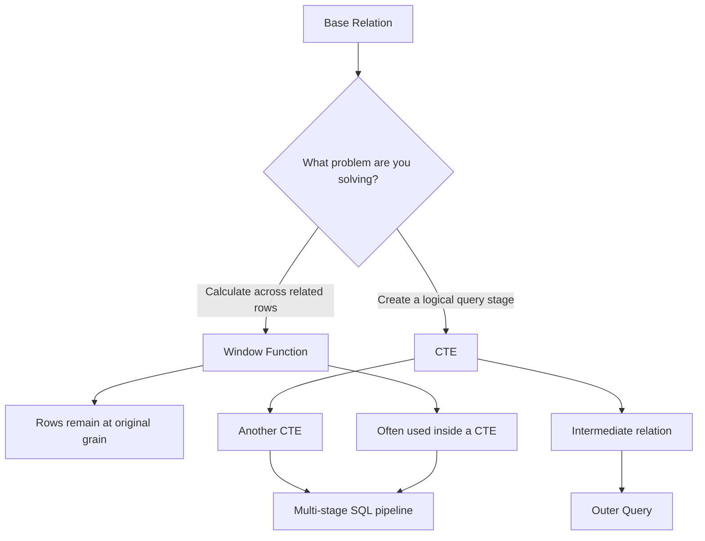
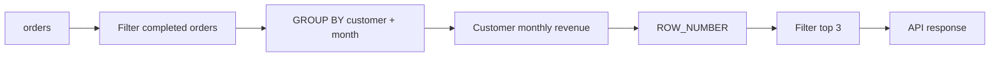

# 04- Window Function vs CTE

## Overview

Window functions and Common Table Expressions (CTEs) are complementary SQL features rather than direct alternatives.

A **window function** performs an analytical calculation across related rows while preserving the row-level result set. A **CTE** creates a named query stage that can be referenced by the main query or by subsequent CTEs.

The key distinction is:

- **Window function** → performs a calculation across rows.
- **CTE** → structures a query into logical stages.
- **CTE + window function** → commonly used together for multi-stage analytics.

For backend engineering, understanding this distinction prevents a common design mistake: choosing a CTE merely because a query is complex, or choosing a window function when the real requirement is to create a separate relational stage.

## Core Difference

Consider a table of orders:

| order_id | customer_id | created_at | amount |
|---:|---:|---|---:|
| 101 | 1 | 2026-01-01 | 100 |
| 102 | 1 | 2026-01-03 | 250 |
| 103 | 2 | 2026-01-02 | 400 |
| 104 | 2 | 2026-01-05 | 150 |

A window function calculates additional information while preserving each order:

```sql
SELECT
    order_id,
    customer_id,
    amount,
    SUM(amount) OVER (
        PARTITION BY customer_id
    ) AS customer_total
FROM orders;
```

A CTE instead creates a named query stage:

```sql
WITH customer_totals AS (
    SELECT
        customer_id,
        SUM(amount) AS customer_total
    FROM orders
    GROUP BY customer_id
)
SELECT
    customer_id,
    customer_total
FROM customer_totals;
```

These solve different problems.

The first says:

> "For every order, calculate the customer's total."

The second says:

> "Create a reusable intermediate result containing one row per customer."

## Mental Model



A useful senior-level mental model is:

> A window function answers **how to calculate a value relative to other rows**.

> A CTE answers **how to organize the relational computation into stages**.

## What Is a CTE?

A Common Table Expression is a named temporary result defined using `WITH`.

```sql
WITH recent_orders AS (
    SELECT
        order_id,
        customer_id,
        created_at,
        amount
    FROM orders
    WHERE created_at >= CURRENT_DATE - INTERVAL '30 days'
)
SELECT
    customer_id,
    COUNT(*) AS order_count,
    SUM(amount) AS revenue
FROM recent_orders
GROUP BY customer_id;
```

The CTE improves logical structure by separating:

1. Which rows are relevant.
2. How those rows are aggregated.

A CTE is particularly valuable when a query contains several transformations that are easier to understand as separate stages.

## What Is a Window Function?

A window function calculates a value using a set of rows related to the current row.

```sql
SELECT
    order_id,
    customer_id,
    amount,
    RANK() OVER (
        PARTITION BY customer_id
        ORDER BY amount DESC
    ) AS amount_rank
FROM orders;
```

Unlike `GROUP BY`, the window operation does not collapse the input rows.

For example:

```text
GROUP BY
orders
  ↓
one result row per group

Window Function
orders
  ↓
same order rows + analytical columns
```

Common window functions include:

| Category | Functions |
|---|---|
| Ranking | `ROW_NUMBER()`, `RANK()`, `DENSE_RANK()` |
| Value | `LAG()`, `LEAD()`, `FIRST_VALUE()`, `LAST_VALUE()` |
| Aggregate | `SUM()`, `AVG()`, `MIN()`, `MAX()`, `COUNT()` |
| Distribution | `NTILE()`, `PERCENT_RANK()`, `CUME_DIST()` |

## CTE and Window Function Are Not Alternatives

Consider:

```sql
WITH ranked_orders AS (
    SELECT
        order_id,
        customer_id,
        amount,
        ROW_NUMBER() OVER (
            PARTITION BY customer_id
            ORDER BY amount DESC, order_id
        ) AS rn
    FROM orders
)
SELECT
    order_id,
    customer_id,
    amount
FROM ranked_orders
WHERE rn <= 3;
```

Here:

- The **window function** calculates `rn`.
- The **CTE** creates a query stage where `rn` can be filtered.

The CTE does not replace `ROW_NUMBER()`.

It provides the relational boundary needed to consume the window result.

## When to Use a Window Function

Use a window function when the business requirement involves row-relative or group-relative analysis.

Typical requirements include:

- Previous or next record.
- Ranking within a group.
- Running totals.
- Moving averages.
- Percentage of group total.
- First or last value.
- Change detection.
- Deduplication using `ROW_NUMBER()`.

Example:

```sql
SELECT
    order_id,
    customer_id,
    created_at,
    amount,
    LAG(amount) OVER (
        PARTITION BY customer_id
        ORDER BY created_at, order_id
    ) AS previous_amount
FROM orders;
```

The result remains one row per order.

## When to Use a CTE

Use a CTE when query structure benefits from explicit intermediate stages.

Typical requirements include:

- Filtering before expensive calculations.
- Aggregating before ranking.
- Reusing a logical result.
- Breaking a complex query into understandable stages.
- Recursively traversing hierarchical data.
- Performing multi-stage analytical transformations.
- Filtering values produced by window functions.

Example:

```sql
WITH completed_orders AS (
    SELECT
        order_id,
        customer_id,
        amount
    FROM orders
    WHERE status = 'completed'
),
customer_revenue AS (
    SELECT
        customer_id,
        SUM(amount) AS revenue
    FROM completed_orders
    GROUP BY customer_id
)
SELECT
    customer_id,
    revenue
FROM customer_revenue
WHERE revenue >= 10000;
```

The CTEs describe a clear data pipeline.

## Multi-Stage Analytics

This is where CTEs and window functions become particularly powerful.

Suppose a backend reporting API needs the top three customers per month based on completed-order revenue.

```sql
WITH customer_monthly_revenue AS (
    SELECT
        customer_id,
        DATE_TRUNC('month', created_at) AS month,
        SUM(amount) AS revenue
    FROM orders
    WHERE status = 'completed'
    GROUP BY
        customer_id,
        DATE_TRUNC('month', created_at)
),
ranked_customers AS (
    SELECT
        customer_id,
        month,
        revenue,
        ROW_NUMBER() OVER (
            PARTITION BY month
            ORDER BY revenue DESC, customer_id
        ) AS revenue_rank
    FROM customer_monthly_revenue
)
SELECT
    customer_id,
    month,
    revenue,
    revenue_rank
FROM ranked_customers
WHERE revenue_rank <= 3
ORDER BY month, revenue_rank;
```

The logical pipeline is:



This separation makes the query easier to validate and maintain.

## CTE vs Inline Subquery

A CTE and a derived table can often express the same relational stage.

CTE:

```sql
WITH customer_revenue AS (
    SELECT
        customer_id,
        SUM(amount) AS revenue
    FROM orders
    GROUP BY customer_id
)
SELECT
    customer_id,
    revenue
FROM customer_revenue
WHERE revenue > 10000;
```

Derived table:

```sql
SELECT
    customer_id,
    revenue
FROM (
    SELECT
        customer_id,
        SUM(amount) AS revenue
    FROM orders
    GROUP BY customer_id
) AS customer_revenue
WHERE revenue > 10000;
```

The choice is primarily about:

- Readability.
- Reuse.
- Query organization.
- Optimizer behavior for the specific database and query.

A CTE is generally easier to extend when multiple logical stages are required.

## CTE vs Window Function for Ranking

A common misconception is that a CTE can perform ranking.

A CTE alone cannot replace the ranking operation:

```sql
WITH customer_orders AS (
    SELECT
        customer_id,
        order_id,
        amount
    FROM orders
)
SELECT ...
```

The CTE merely defines the input relation.

Ranking requires a window function:

```sql
WITH customer_orders AS (
    SELECT
        customer_id,
        order_id,
        amount
    FROM orders
)
SELECT
    customer_id,
    order_id,
    amount,
    ROW_NUMBER() OVER (
        PARTITION BY customer_id
        ORDER BY amount DESC, order_id
    ) AS rank
FROM customer_orders;
```

The CTE stages the data; the window function performs the ranking.

## Filtering Window Results

Window functions are logically evaluated after `WHERE` in the query-processing order.

Therefore, this pattern is invalid in PostgreSQL:

```sql
SELECT
    order_id,
    customer_id,
    amount,
    ROW_NUMBER() OVER (
        PARTITION BY customer_id
        ORDER BY amount DESC
    ) AS rn
FROM orders
WHERE rn <= 3;
```

Use a CTE:

```sql
WITH ranked_orders AS (
    SELECT
        order_id,
        customer_id,
        amount,
        ROW_NUMBER() OVER (
            PARTITION BY customer_id
            ORDER BY amount DESC, order_id
        ) AS rn
    FROM orders
)
SELECT
    order_id,
    customer_id,
    amount
FROM ranked_orders
WHERE rn <= 3;
```

PostgreSQL does not currently support `QUALIFY`, so the CTE or derived-table pattern is commonly used for this purpose.

## Aggregation Before Windowing

A CTE is often useful when the window should operate on aggregated data rather than raw rows.

Incorrect grain:

```sql
SELECT
    customer_id,
    amount,
    RANK() OVER (
        ORDER BY amount DESC
    ) AS rank
FROM orders;
```

This ranks individual orders.

If the requirement is to rank customers by total revenue, aggregate first:

```sql
WITH customer_revenue AS (
    SELECT
        customer_id,
        SUM(amount) AS revenue
    FROM orders
    WHERE status = 'completed'
    GROUP BY customer_id
)
SELECT
    customer_id,
    revenue,
    RANK() OVER (
        ORDER BY revenue DESC
    ) AS revenue_rank
FROM customer_revenue;
```

The important concept is **grain**.

```text
orders
  ↓
one row per order

GROUP BY customer_id
  ↓
one row per customer

RANK() OVER (...)
  ↓
one ranked row per customer
```

A senior engineer should explicitly identify the grain of each query stage.

## CTE Materialization and Performance

CTEs should not automatically be treated as materialized temporary tables.

Optimizer behavior depends on the database and query.

In modern PostgreSQL, non-recursive CTEs can often be folded into the surrounding query when appropriate. PostgreSQL also supports explicit control:

```sql
WITH customer_revenue AS MATERIALIZED (
    SELECT
        customer_id,
        SUM(amount) AS revenue
    FROM orders
    GROUP BY customer_id
)
SELECT
    customer_id,
    revenue
FROM customer_revenue
WHERE revenue > 10000;
```

Or:

```sql
WITH customer_revenue AS NOT MATERIALIZED (
    SELECT
        customer_id,
        SUM(amount) AS revenue
    FROM orders
    GROUP BY customer_id
)
SELECT
    customer_id,
    revenue
FROM customer_revenue
WHERE revenue > 10000;
```

`MATERIALIZED` can be useful when deliberately forcing an intermediate result to be computed once and reused. `NOT MATERIALIZED` can allow more optimizer freedom.

Do not choose either option without understanding the workload and execution plan.

## Performance Comparison

There is no general rule that says:

> "CTEs are slower than window functions."

They operate at different abstraction levels.

A better model is:

| Concern | CTE | Window Function |
|---|---|---|
| Creates query stage | Yes | No |
| Calculates across rows | Not inherently | Yes |
| Preserves row grain | Depends on query | Yes |
| Supports ranking | Only by containing a ranking operation | Yes |
| Supports previous/next row | Only by containing appropriate logic | Yes |
| Can aggregate | Yes | Window aggregate only |
| Can be recursive | Yes | No |
| Can improve readability | Strongly | Strongly |
| May require sorting | Depending on query | Frequently |
| Performance determined by | Entire execution plan | Entire execution plan |

Always inspect production-sensitive queries:

```sql
EXPLAIN (ANALYZE, BUFFERS)
WITH ranked_orders AS (
    SELECT
        order_id,
        customer_id,
        amount,
        ROW_NUMBER() OVER (
            PARTITION BY customer_id
            ORDER BY amount DESC, order_id
        ) AS rn
    FROM orders
)
SELECT
    order_id,
    customer_id,
    amount
FROM ranked_orders
WHERE rn <= 3;
```

Look for:

- Large sequential scans.
- Expensive sorts.
- Disk-based temporary operations.
- Incorrect cardinality estimates.
- Excessive memory usage.
- Unexpected nested loops.
- Repeated scans of large relations.

## Indexing Considerations

Indexes should support the filtering, joining, and ordering patterns of the complete query.

For:

```sql
ROW_NUMBER() OVER (
    PARTITION BY customer_id
    ORDER BY created_at, order_id
)
```

an index such as:

```sql
CREATE INDEX idx_orders_customer_created_id
ON orders (customer_id, created_at, order_id);
```

may help depending on the execution plan.

If the query first filters by status and tenant:

```sql
WHERE tenant_id = :tenant_id
  AND status = 'completed'
```

the useful index may instead need to prioritize those predicates.

For production workloads, avoid designing indexes solely around the `OVER (...)` clause. Consider the entire query and actual access pattern.

## Recursive CTEs

Recursive CTEs are another reason CTEs cannot be considered substitutes for window functions.

For example, hierarchical organizational data can be traversed with a recursive CTE:

```sql
WITH RECURSIVE employee_tree AS (
    SELECT
        employee_id,
        manager_id,
        name,
        0 AS depth
    FROM employees
    WHERE employee_id = :root_employee_id

    UNION ALL

    SELECT
        e.employee_id,
        e.manager_id,
        e.name,
        et.depth + 1
    FROM employees AS e
    JOIN employee_tree AS et
        ON e.manager_id = et.employee_id
)
SELECT
    employee_id,
    manager_id,
    name,
    depth
FROM employee_tree
ORDER BY depth, employee_id;
```

A window function cannot replace this recursive traversal.

This illustrates why the two features should be viewed as complementary SQL capabilities.

## Backend Engineering Example

Consider a FastAPI endpoint that returns a customer's order history with:

- Current order amount.
- Previous order amount.
- Change from the previous order.
- Customer lifetime revenue.

A single SQL query can perform the analytical work:

```sql
SELECT
    order_id,
    customer_id,
    created_at,
    amount,
    LAG(amount) OVER (
        PARTITION BY customer_id
        ORDER BY created_at, order_id
    ) AS previous_amount,
    amount - LAG(amount) OVER (
        PARTITION BY customer_id
        ORDER BY created_at, order_id
    ) AS amount_change,
    SUM(amount) OVER (
        PARTITION BY customer_id
    ) AS customer_lifetime_revenue
FROM orders
WHERE customer_id = :customer_id
ORDER BY created_at DESC, order_id DESC;
```

The application receives already-computed analytical fields rather than loading all historical orders and calculating them in Python.

For very large datasets, however, query selectivity matters. If the endpoint only needs one customer, filter to that customer as early as the semantics permit. If the calculation must consider all customers before a later ranking stage, filtering too early can change the intended result.

## Production Considerations

### Query Readability

Prefer CTEs when they make business stages explicit:

```text
raw data
    ↓
filtered data
    ↓
aggregated data
    ↓
window analytics
    ↓
final filtering
```

This is particularly valuable for reporting, reconciliation, billing, and operational analytics.

### Query Complexity

Avoid creating a CTE for every trivial expression.

Over-fragmentation can make a query harder to understand:

```sql
WITH a AS (...),
b AS (...),
c AS (...),
d AS (...),
e AS (...)
SELECT ...
```

Use CTEs to represent meaningful relational stages rather than merely replacing every nested expression.

### Large Data Volumes

Window functions can require significant sorting and memory.

For large production tables:

- Filter unnecessary rows early.
- Use appropriate indexes.
- Partition analytical windows correctly.
- Avoid unnecessarily wide `SELECT` lists.
- Verify query plans.
- Consider pre-aggregation or materialized views for expensive recurring reports.

### Reporting Workloads

If an analytical query repeatedly scans a large immutable or slowly changing dataset, consider:

- Materialized views.
- Summary tables.
- Incremental aggregation.
- Dedicated analytical storage.

Do not automatically solve repeated expensive analytics by adding more SQL complexity.

## Common Mistakes

### Treating CTEs as Temporary Tables

A CTE is a query expression, not automatically a durable temporary table.

It exists for the duration of the statement.

If data must persist across statements, use an appropriate persistent or temporary database object.

### Assuming CTEs Always Improve Performance

CTEs primarily improve query organization.

They do not guarantee faster execution.

Use `EXPLAIN (ANALYZE, BUFFERS)` for performance decisions.

### Using a CTE Instead of Understanding Grain

This query may be syntactically clean but semantically wrong:

```sql
WITH orders_with_rank AS (
    SELECT
        customer_id,
        amount,
        RANK() OVER (ORDER BY amount DESC) AS rank
    FROM orders
)
SELECT ...
```

If the requirement is to rank customers by total revenue, the aggregation must happen first.

### Using a Window Function When Aggregation Should Reduce Rows

If the API needs one row per customer:

```sql
SELECT
    customer_id,
    SUM(amount) AS revenue
FROM orders
GROUP BY customer_id;
```

There is no reason to use:

```sql
SUM(amount) OVER (PARTITION BY customer_id)
```

unless individual order rows are also required.

### Missing Deterministic Ordering

For positional functions, use a stable tie-breaker:

```sql
LAG(amount) OVER (
    PARTITION BY customer_id
    ORDER BY created_at, order_id
)
```

instead of relying solely on a timestamp that may not be unique.

### Filtering Too Early

Moving a predicate into an earlier CTE can change the window's population.

For example, if a ranking must be calculated against **all completed orders**, filtering to only a subset before ranking changes the meaning.

Always determine which rows should participate in the window before optimizing predicate placement.

## Security Considerations

CTEs and window functions do not provide authorization.

For multi-tenant systems, enforce tenant isolation at the relational boundary:

```sql
WITH tenant_orders AS (
    SELECT
        order_id,
        customer_id,
        created_at,
        amount
    FROM orders
    WHERE tenant_id = :tenant_id
      AND status = 'completed'
)
SELECT
    order_id,
    customer_id,
    amount,
    LAG(amount) OVER (
        PARTITION BY customer_id
        ORDER BY created_at, order_id
    ) AS previous_amount
FROM tenant_orders;
```

Use parameterized values such as `:tenant_id`.

Do not rely on:

```sql
PARTITION BY tenant_id
```

for authorization. `PARTITION BY` only controls analytical grouping.

## Decision Framework

Use the following decision process:

| Question | Preferred approach |
|---|---|
| Do I need to structure multiple query stages? | CTE |
| Do I need previous/next row analysis? | Window function |
| Do I need ranking? | Window function |
| Do I need a running total? | Window function |
| Do I need to aggregate before ranking? | CTE + `GROUP BY` + window function |
| Do I need to filter a window result? | CTE/derived table + window function |
| Do I need recursive traversal? | Recursive CTE |
| Do I need one row per group? | `GROUP BY` |
| Do I need one row per detail record plus group context? | Window function |
| Do I need multiple analytical stages? | CTE + window functions |

The most important question is not:

> "Should I use a CTE or a window function?"

It is:

> "What should each query stage represent, and what is the required row grain at that stage?"

## Interview Traps

| Interview question | Correct answer |
|---|---|
| Can a CTE replace a window function? | Not generally. They solve different problems. |
| Is a CTE always materialized? | No. Behavior depends on the database and optimizer; PostgreSQL can inline eligible non-recursive CTEs. |
| Does a window function reduce the number of rows? | No. `GROUP BY` normally reduces rows; window functions preserve the input row set. |
| Why use a CTE with `ROW_NUMBER()`? | Commonly to create a stage where the calculated window value can be filtered. |
| Are CTEs always slower? | No. Performance depends on the execution plan and optimizer behavior. |
| Can a CTE perform ranking by itself? | No. Ranking requires a ranking operation such as `ROW_NUMBER()` or `RANK()`. |
| Can window functions replace recursive CTEs? | No. Recursive CTEs solve recursive relational traversal. |
| Should every complex query use a CTE? | No. Use CTEs when they improve logical structure or satisfy a required query stage. |

## Practical Rules

- **Use a window function for the calculation.**
- **Use a CTE for the query stage.**
- **Use `GROUP BY` when the result should collapse to one row per group.**
- **Use CTE + window function when aggregation and row-level analytics must happen sequentially.**
- **Use recursive CTEs for hierarchical traversal.**
- **Inspect execution plans before making performance claims.**
- **Track row grain explicitly at every stage.**
- **Make ordering deterministic for positional window functions.**
- **Do not confuse query organization with execution optimization.**

## Key Takeaways

- **CTEs structure relational computation into named query stages; window functions perform row-level analytics across related rows.**
- **They are complementary rather than competing features and are frequently used together in production SQL.**
- **Use `GROUP BY` or a CTE to establish the correct data grain before applying window functions when aggregation must happen first.**
- **CTEs do not automatically improve or hurt performance; validate materialization, optimizer behavior, and execution plans for production workloads.**
- **The strongest design heuristic is to define the required row grain and logical stages first, then choose the SQL construct that expresses each stage directly.**