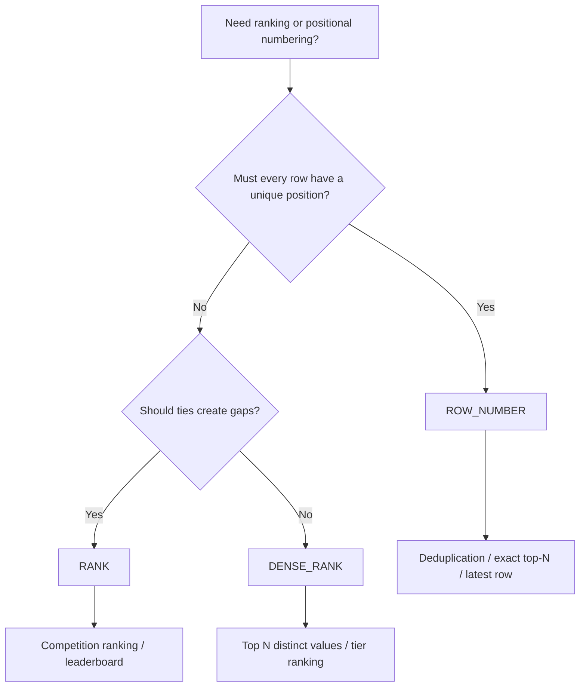

# 05- ROW_NUMBER vs RANK vs DENSE_RANK

## Overview

`ROW_NUMBER()`, `RANK()`, and `DENSE_RANK()` are SQL ranking window functions. All three assign an ordering position to rows, but they differ in how they handle **ties**.

The distinction matters whenever a backend system needs to answer questions such as:

- Who are the top customers?
- What are the top three products per category?
- Which orders are the latest for each customer?
- Which employees share the same compensation rank?
- How should ties affect pagination or top-N reporting?

The core rule is:

> Use `ROW_NUMBER()` when every row needs a unique position, `RANK()` when ties should share a rank and gaps should follow, and `DENSE_RANK()` when ties should share a rank without gaps.

These functions are evaluated within the window defined by `OVER (...)`. They do not collapse rows like `GROUP BY`.

## The Three Functions

Consider this dataset:

| employee | salary |
|---|---:|
| Alice | 100000 |
| Bob | 90000 |
| Carol | 90000 |
| David | 80000 |
| Eve | 70000 |

Apply all three functions:

```sql
SELECT
    employee,
    salary,
    ROW_NUMBER() OVER (ORDER BY salary DESC) AS row_number,
    RANK() OVER (ORDER BY salary DESC) AS rank,
    DENSE_RANK() OVER (ORDER BY salary DESC) AS dense_rank
FROM employees
ORDER BY salary DESC, employee;
```

The conceptual result is:

| employee | salary | `ROW_NUMBER()` | `RANK()` | `DENSE_RANK()` |
|---|---:|---:|---:|---:|
| Alice | 100000 | 1 | 1 | 1 |
| Bob | 90000 | 2 | 2 | 2 |
| Carol | 90000 | 3 | 2 | 2 |
| David | 80000 | 4 | 4 | 3 |
| Eve | 70000 | 5 | 5 | 4 |

The difference appears at the tied salary:

- `ROW_NUMBER()` assigns different positions.
- `RANK()` gives both rows rank `2`, then skips `3`.
- `DENSE_RANK()` gives both rows rank `2`, then continues with `3`.

## Comparison

| Function | Ties share rank? | Gaps after ties? | Every row gets unique number? | Typical use |
|---|---|---|---|---|
| `ROW_NUMBER()` | No | N/A | Yes | Deduplication, latest row, exact top-N |
| `RANK()` | Yes | Yes | No | Competition-style rankings |
| `DENSE_RANK()` | Yes | No | No | Distinct-value ranking |

A useful mental model:

```text
ROW_NUMBER
1, 2, 3, 4, 5

RANK
1, 2, 2, 4, 5

DENSE_RANK
1, 2, 2, 3, 4
```

## `ROW_NUMBER()`

### What It Is

`ROW_NUMBER()` assigns a unique sequential number to every row in the window.

```sql
ROW_NUMBER() OVER (
    ORDER BY salary DESC
)
```

Even if two rows have identical ordering values, they receive different row numbers.

### Why It Exists

Many backend operations require exactly one deterministic position per row.

Common examples:

- Selecting the latest record per entity.
- Deduplicating records.
- Selecting exactly N rows per group.
- Assigning deterministic sequence numbers.
- Identifying a single winner among otherwise tied records.

### Example

```sql
SELECT
    employee_id,
    employee,
    salary,
    ROW_NUMBER() OVER (
        ORDER BY salary DESC, employee_id
    ) AS row_number
FROM employees;
```

Adding `employee_id` as a tie-breaker makes the ordering deterministic.

### Top-N Rows

To retrieve exactly three highest-paid employees:

```sql
WITH ranked_employees AS (
    SELECT
        employee_id,
        employee,
        salary,
        ROW_NUMBER() OVER (
            ORDER BY salary DESC, employee_id
        ) AS rn
    FROM employees
)
SELECT
    employee_id,
    employee,
    salary
FROM ranked_employees
WHERE rn <= 3
ORDER BY rn;
```

If multiple employees have the same salary, exactly three rows are returned, assuming at least three rows exist.

### Advantages

- Produces a unique sequence.
- Useful for deterministic deduplication.
- Excellent for selecting exactly one row per group.
- Straightforward for top-N requirements.

### Limitations

`ROW_NUMBER()` does not preserve ties.

If three customers have identical revenue and the business requirement is "include everyone tied for third place," `ROW_NUMBER()` is the wrong function.

## `RANK()`

### What It Is

`RANK()` assigns the same rank to rows that have equal ordering values.

After a tie, the next rank includes the number of rows skipped.

```text
1
2
2
4
5
```

### Why It Exists

`RANK()` models competition-style ranking.

For example, if two athletes tie for second:

```text
1st
2nd
2nd
4th
```

There is no third-place participant because two rows occupy the second position.

### Example

```sql
SELECT
    employee_id,
    employee,
    salary,
    RANK() OVER (
        ORDER BY salary DESC
    ) AS salary_rank
FROM employees
ORDER BY salary DESC, employee_id;
```

### Top-N With Ties

Suppose the requirement is:

> Return everyone whose salary is within the top three salary ranks.

```sql
WITH ranked_employees AS (
    SELECT
        employee_id,
        employee,
        salary,
        RANK() OVER (
            ORDER BY salary DESC
        ) AS salary_rank
    FROM employees
)
SELECT
    employee_id,
    employee,
    salary,
    salary_rank
FROM ranked_employees
WHERE salary_rank <= 3
ORDER BY salary_rank, salary DESC, employee_id;
```

This can return more than three rows because ties are preserved.

### Advantages

- Correctly represents competition ranking.
- Preserves ties.
- Useful for leaderboard-style systems.
- Makes rank gaps explicit.

### Limitations

- `rank <= N` does not necessarily mean N rows.
- Rank values can contain gaps.
- Not appropriate when every row needs a unique position.

## `DENSE_RANK()`

### What It Is

`DENSE_RANK()` assigns the same rank to ties but does not create gaps afterward.

```text
1
2
2
3
4
```

### Why It Exists

Many business rankings care about **distinct ordering values** rather than the number of rows occupying each rank.

For example:

```text
Revenue
10000 → rank 1
9000  → rank 2
9000  → rank 2
8000  → rank 3
```

The next distinct revenue value is rank `3`.

### Example

```sql
SELECT
    employee_id,
    employee,
    salary,
    DENSE_RANK() OVER (
        ORDER BY salary DESC
    ) AS salary_rank
FROM employees;
```

### Top Three Distinct Values

```sql
WITH ranked_employees AS (
    SELECT
        employee_id,
        employee,
        salary,
        DENSE_RANK() OVER (
            ORDER BY salary DESC
        ) AS salary_rank
    FROM employees
)
SELECT
    employee_id,
    employee,
    salary
FROM ranked_employees
WHERE salary_rank <= 3
ORDER BY salary DESC, employee_id;
```

This returns employees belonging to the top three **distinct salary values**, potentially producing more than three rows.

### Advantages

- Preserves ties.
- Avoids rank gaps.
- Useful when ranking distinct metric values.
- Natural fit for business categories such as price tiers or revenue levels.

### Limitations

- Does not produce a unique row position.
- Can return more than N rows for `dense_rank <= N`.
- It differs from `RANK()` specifically when ties occur.

## Tie Handling Is the Key Decision

The choice is fundamentally about what a tie means to the business.

| Requirement | Function |
|---|---|
| Every row must have a unique position | `ROW_NUMBER()` |
| Ties occupy the same position and consume multiple positions | `RANK()` |
| Ties share a position but do not consume additional rank values | `DENSE_RANK()` |
| Select exactly one latest record | `ROW_NUMBER()` |
| Competition leaderboard | `RANK()` |
| Top N distinct score levels | `DENSE_RANK()` |
| Deduplicate records | `ROW_NUMBER()` |
| Top N including all tied participants | Usually `RANK()` or `DENSE_RANK()` depending on rank semantics |

## `PARTITION BY`

All three functions can rank independently within groups.

For example, rank products within each category:

```sql
SELECT
    product_id,
    category_id,
    product_name,
    revenue,
    ROW_NUMBER() OVER (
        PARTITION BY category_id
        ORDER BY revenue DESC, product_id
    ) AS row_number,
    RANK() OVER (
        PARTITION BY category_id
        ORDER BY revenue DESC
    ) AS rank,
    DENSE_RANK() OVER (
        PARTITION BY category_id
        ORDER BY revenue DESC
    ) AS dense_rank
FROM product_sales;
```

`PARTITION BY category_id` resets the ranking for every category.

Conceptually:

```text
Category A
  ├── rank 1
  ├── rank 2
  └── rank 2

Category B
  ├── rank 1
  ├── rank 2
  └── rank 3
```

This pattern is extremely common in backend reporting APIs.

## Deterministic Ordering

A critical production distinction is between **ranking semantics** and **row determinism**.

Consider:

```sql
ROW_NUMBER() OVER (
    ORDER BY salary DESC
)
```

If multiple employees have the same salary, SQL is free to choose their relative ordering unless additional ordering information establishes a deterministic order.

Prefer:

```sql
ROW_NUMBER() OVER (
    ORDER BY salary DESC, employee_id
)
```

Now:

1. Higher salary comes first.
2. Equal salaries are ordered by `employee_id`.

For `RANK()` and `DENSE_RANK()`, adding a tie-breaker changes the meaning of the tie.

For example:

```sql
RANK() OVER (
    ORDER BY salary DESC
)
```

treats equal salaries as ties.

But:

```sql
RANK() OVER (
    ORDER BY salary DESC, employee_id
)
```

makes every `(salary, employee_id)` combination distinct, effectively eliminating salary ties.

Therefore:

> Add tie-breakers to `ROW_NUMBER()` when you need deterministic row selection. Do not add them to `RANK()` or `DENSE_RANK()` unless they are genuinely part of the ranking definition.

## Deduplication Pattern

`ROW_NUMBER()` is commonly used to retain one record from duplicate logical entities.

Suppose an ingestion pipeline can receive duplicate customer events:

```sql
CREATE TABLE customer_events (
    event_id BIGINT PRIMARY KEY,
    customer_id BIGINT NOT NULL,
    event_type TEXT NOT NULL,
    event_timestamp TIMESTAMPTZ NOT NULL,
    received_at TIMESTAMPTZ NOT NULL
);
```

To keep the latest event for each customer and event type:

```sql
WITH ranked_events AS (
    SELECT
        event_id,
        customer_id,
        event_type,
        event_timestamp,
        received_at,
        ROW_NUMBER() OVER (
            PARTITION BY customer_id, event_type
            ORDER BY event_timestamp DESC, event_id DESC
        ) AS rn
    FROM customer_events
)
SELECT
    event_id,
    customer_id,
    event_type,
    event_timestamp,
    received_at
FROM ranked_events
WHERE rn = 1;
```

This is preferable to using `RANK()` because the requirement is explicitly:

> Select one record.

If two records have the same timestamp, `event_id` provides the deterministic tie-breaker.

## Latest Record Per Entity

A common REST API requirement is:

> Return the most recent status for every order.

```sql
WITH latest_status AS (
    SELECT
        order_id,
        status,
        changed_at,
        ROW_NUMBER() OVER (
            PARTITION BY order_id
            ORDER BY changed_at DESC, status_event_id DESC
        ) AS rn
    FROM order_status_history
)
SELECT
    order_id,
    status,
    changed_at
FROM latest_status
WHERE rn = 1;
```

This pattern is useful in:

- Django ORM queries using window expressions.
- FastAPI reporting endpoints.
- Background reconciliation jobs.
- Operational dashboards.
- Event-sourced or audit-history tables.

## Top-N Per Group

A frequent interview and production requirement is:

> Return the top three products in every category.

Use `ROW_NUMBER()` when exactly three products per category are required:

```sql
WITH ranked_products AS (
    SELECT
        product_id,
        category_id,
        revenue,
        ROW_NUMBER() OVER (
            PARTITION BY category_id
            ORDER BY revenue DESC, product_id
        ) AS rn
    FROM product_sales
)
SELECT
    product_id,
    category_id,
    revenue
FROM ranked_products
WHERE rn <= 3;
```

Use `RANK()` when all products sharing one of the top three competition ranks should be returned:

```sql
WITH ranked_products AS (
    SELECT
        product_id,
        category_id,
        revenue,
        RANK() OVER (
            PARTITION BY category_id
            ORDER BY revenue DESC
        ) AS rank
    FROM product_sales
)
SELECT
    product_id,
    category_id,
    revenue,
    rank
FROM ranked_products
WHERE rank <= 3;
```

Use `DENSE_RANK()` when the requirement refers to the top three distinct revenue levels:

```sql
WITH ranked_products AS (
    SELECT
        product_id,
        category_id,
        revenue,
        DENSE_RANK() OVER (
            PARTITION BY category_id
            ORDER BY revenue DESC
        ) AS dense_rank
    FROM product_sales
)
SELECT
    product_id,
    category_id,
    revenue,
    dense_rank
FROM ranked_products
WHERE dense_rank <= 3;
```

## Choosing Between the Three

Use this decision tree:



A practical decision sequence:

1. Determine whether ties are meaningful.
2. Decide whether tied rows should share a rank.
3. If they share a rank, decide whether subsequent ranks should skip values.
4. Determine whether the requirement needs exactly N rows or up to N ranks.
5. Add deterministic tie-breakers only when they are part of the intended semantics.

## Performance Considerations

All three functions may require the database to order rows according to the window's `ORDER BY`.

For example:

```sql
RANK() OVER (
    PARTITION BY category_id
    ORDER BY revenue DESC
)
```

may require sorting rows within each category.

On large tables:

- Filter unnecessary rows before the window operation.
- Select only required columns.
- Ensure predicates and joins are appropriately indexed.
- Avoid ranking millions of rows when the application needs a small subset.
- Use `EXPLAIN (ANALYZE, BUFFERS)` for production workloads.

Example:

```sql
EXPLAIN (ANALYZE, BUFFERS)
WITH ranked_products AS (
    SELECT
        product_id,
        category_id,
        revenue,
        ROW_NUMBER() OVER (
            PARTITION BY category_id
            ORDER BY revenue DESC, product_id
        ) AS rn
    FROM product_sales
    WHERE tenant_id = :tenant_id
)
SELECT
    product_id,
    category_id,
    revenue
FROM ranked_products
WHERE rn <= 3;
```

Do not assume an index eliminates all sorting. The optimizer determines whether and how an index can support the required access and ordering pattern.

## Indexing Considerations

For a workload frequently filtering by tenant and ranking within categories:

```sql
WHERE tenant_id = :tenant_id
```

with:

```sql
PARTITION BY category_id
ORDER BY revenue DESC, product_id
```

an index might be considered around:

```sql
CREATE INDEX idx_product_sales_tenant_category_revenue
ON product_sales (
    tenant_id,
    category_id,
    revenue DESC,
    product_id
);
```

Whether this index is beneficial depends on:

- Data distribution.
- Query selectivity.
- Table size.
- Existing indexes.
- Database version.
- Join patterns.
- Sort costs.
- Actual execution plans.

Avoid blindly creating indexes that mirror every window clause. Indexes also increase storage, write amplification, vacuum/maintenance work, and deployment complexity.

## `ROW_NUMBER()` vs `DISTINCT`

These are not interchangeable.

`DISTINCT` removes duplicate result rows:

```sql
SELECT DISTINCT customer_id
FROM orders;
```

`ROW_NUMBER()` allows controlled selection from multiple records:

```sql
WITH ranked_orders AS (
    SELECT
        order_id,
        customer_id,
        created_at,
        ROW_NUMBER() OVER (
            PARTITION BY customer_id
            ORDER BY created_at DESC, order_id DESC
        ) AS rn
    FROM orders
)
SELECT
    order_id,
    customer_id,
    created_at
FROM ranked_orders
WHERE rn = 1;
```

Use `DISTINCT` when duplicate result values should be collapsed.

Use `ROW_NUMBER()` when one specific record must be selected according to an ordering rule.

## `ROW_NUMBER()` vs `RANK()` for Pagination

`ROW_NUMBER()` is sometimes used to implement offset-style pagination:

```sql
WITH numbered_orders AS (
    SELECT
        order_id,
        created_at,
        ROW_NUMBER() OVER (
            ORDER BY created_at DESC, order_id DESC
        ) AS row_num
    FROM orders
)
SELECT
    order_id,
    created_at
FROM numbered_orders
WHERE row_num BETWEEN 1001 AND 1020;
```

This can become expensive for deep pages because the database may still need to process and number many preceding rows.

For high-throughput APIs, **keyset pagination** is often preferable:

```sql
SELECT
    order_id,
    created_at
FROM orders
WHERE (created_at, order_id) < (:cursor_created_at, :cursor_order_id)
ORDER BY created_at DESC, order_id DESC
LIMIT 20;
```

Ranking functions are primarily analytical tools. Do not use them as a default pagination mechanism for large production APIs.

## Backend API Considerations

For a REST endpoint such as:

```text
GET /categories/{category_id}/top-products
```

the SQL ranking semantics should reflect the API contract.

If the contract says:

> Return exactly 10 products.

Use `ROW_NUMBER()` or a normal ordered `LIMIT` where appropriate.

If the contract says:

> Return all products tied for one of the top 10 positions.

Use `RANK()` or `DENSE_RANK()` according to the required tie semantics.

The API contract should explicitly define whether the result is:

- Exactly N rows.
- Up to N ranks.
- Top N distinct metric values.
- Tie-inclusive.

Ambiguous requirements often produce incorrect ranking queries.

## Common Mistakes

### Assuming All Three Produce the Same Ranking

They differ only when ties occur, which is precisely where business requirements become important.

Always test with duplicate ordering values.

### Using `ROW_NUMBER()` for Tie-Inclusive Rankings

This silently discards tied rows from a top-N result.

If everyone tied for third should qualify, `ROW_NUMBER()` is usually inappropriate.

### Using `RANK()` When Exactly N Rows Are Required

```sql
WHERE rank <= 3
```

can return four, five, or many more rows.

If the API requires exactly three rows, use `ROW_NUMBER()` with a deterministic tie-breaker.

### Adding a Tie-Breaker to `RANK()`

This:

```sql
RANK() OVER (
    ORDER BY score DESC, player_id
)
```

does not rank players solely by score.

Players with the same score but different IDs are no longer tied.

### Assuming `rank <= N` Means N Rows

It means rows belonging to ranks up to N.

The number of returned rows depends on ties.

### Forgetting `PARTITION BY`

This:

```sql
ROW_NUMBER() OVER (
    ORDER BY revenue DESC
)
```

ranks the entire dataset.

For independent ranking per category:

```sql
ROW_NUMBER() OVER (
    PARTITION BY category_id
    ORDER BY revenue DESC, product_id
)
```

### Ignoring NULL Ordering

Ordering involving nullable columns can affect ranking semantics.

If NULL values require explicit treatment, define it:

```sql
RANK() OVER (
    ORDER BY score DESC NULLS LAST
)
```

PostgreSQL supports explicit `NULLS FIRST` and `NULLS LAST`.

### Using Ranking for Unrelated Aggregation

If the requirement is simply:

> Calculate total revenue per customer.

Use:

```sql
SELECT
    customer_id,
    SUM(amount) AS total_revenue
FROM orders
GROUP BY customer_id;
```

Do not introduce ranking functions without an analytical requirement.

## Interview Traps

| Question | Correct distinction |
|---|---|
| What is the main difference between the three? | Tie handling. |
| Which function always gives unique numbers? | `ROW_NUMBER()`. |
| Which functions preserve ties? | `RANK()` and `DENSE_RANK()`. |
| Which function creates gaps after ties? | `RANK()`. |
| Which function does not create gaps after ties? | `DENSE_RANK()`. |
| Can `RANK() <= 3` return more than three rows? | Yes. |
| Can `ROW_NUMBER() <= 3` return more than three rows? | No, within the same window partition. |
| Which function is best for deduplication? | Usually `ROW_NUMBER()`. |
| Which function models competition ranking? | `RANK()`. |
| Which function ranks distinct metric values without gaps? | `DENSE_RANK()`. |
| Should a tie-breaker be added to `RANK()`? | Only if that column is part of the intended ranking semantics. |
| Does `PARTITION BY` create separate rankings? | Yes; numbering/ranking restarts for each partition. |

## Production Checklist

Before deploying a ranking query, verify:

- **Business semantics** — Is the requirement about rows, ranks, or distinct values?
- **Tie behavior** — Should equal values share a position?
- **Exact cardinality** — Must the result contain exactly N rows?
- **Partitioning** — Should ranking restart per tenant, category, customer, or another group?
- **Determinism** — Does `ROW_NUMBER()` have a stable tie-breaker?
- **NULL handling** — Are NULL values ordered intentionally?
- **Filtering** — Are filters applied before ranking without changing the intended population?
- **Performance** — Has the execution plan been tested with production-scale data?
- **API contract** — Does the SQL behavior match the endpoint's definition of top-N?
- **Multi-tenancy** — Is tenant isolation enforced independently of window partitioning?

## Key Takeaways

- **`ROW_NUMBER()` gives every row a unique position; `RANK()` and `DENSE_RANK()` allow ties.**
- **`RANK()` creates gaps after ties, while `DENSE_RANK()` does not.**
- **Use `ROW_NUMBER()` for exact top-N selection and deterministic deduplication; use ranking functions when ties are part of the business semantics.**
- **`PARTITION BY` creates independent rankings, and tie-breakers should be added only when they reflect the intended ordering semantics.**
- **For production systems, define tie behavior and result cardinality explicitly before choosing the ranking function.**