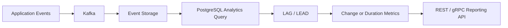

# 06- LAG vs LEAD

## Overview

`LAG()` and `LEAD()` are value window functions used to access a value from a previous or subsequent row without performing a self-join.

They are particularly useful for **row-to-row analysis**:

- Comparing the current event with the previous event.
- Comparing the current metric with the next metric.
- Calculating changes between consecutive records.
- Detecting state transitions.
- Measuring time between events.
- Identifying gaps in activity.
- Building sequential analytics for backend reporting and operational systems.

The fundamental distinction is simple:

| Function | Reads from |
|---|---|
| `LAG()` | A previous row |
| `LEAD()` | A following row |

Both depend on a well-defined window ordering.

## Why LAG and LEAD Exist

Before window functions, comparing adjacent rows commonly required a self-join or correlated subquery.

For example, finding the previous order for every customer can become unnecessarily complex when expressed as a self-join.

With `LAG()`:

```sql
SELECT
    order_id,
    customer_id,
    created_at,
    LAG(created_at) OVER (
        PARTITION BY customer_id
        ORDER BY created_at, order_id
    ) AS previous_order_at
FROM orders;
```

The database can evaluate the ordered window and expose the neighboring value directly.

This keeps the relationship between the business requirement and SQL expression explicit:

```text
Current row
    │
    ├── LAG()  → previous row
    │
    └── LEAD() → next row
```

## LAG()

### What It Is

`LAG()` returns an expression from an earlier row within the current window.

```sql
LAG(expression) OVER (
    PARTITION BY ...
    ORDER BY ...
)
```

The default offset is `1`.

```sql
LAG(amount) OVER (
    ORDER BY created_at
)
```

means:

> Return the `amount` from the immediately preceding row.

### Basic Example

Given:

| day | revenue |
|---|---:|
| Monday | 100 |
| Tuesday | 120 |
| Wednesday | 90 |
| Thursday | 150 |

```sql
SELECT
    day,
    revenue,
    LAG(revenue) OVER (
        ORDER BY day
    ) AS previous_revenue
FROM daily_revenue;
```

Result:

| day | revenue | previous_revenue |
|---|---:|---:|
| Monday | 100 | NULL |
| Tuesday | 120 | 100 |
| Wednesday | 90 | 120 |
| Thursday | 150 | 90 |

The first row has no previous row, so the result is `NULL`.

## LEAD()

### What It Is

`LEAD()` returns an expression from a later row within the current window.

```sql
LEAD(expression) OVER (
    PARTITION BY ...
    ORDER BY ...
)
```

The default offset is `1`.

```sql
LEAD(amount) OVER (
    ORDER BY created_at
)
```

means:

> Return the `amount` from the immediately following row.

### Basic Example

```sql
SELECT
    day,
    revenue,
    LEAD(revenue) OVER (
        ORDER BY day
    ) AS next_revenue
FROM daily_revenue;
```

Result:

| day | revenue | next_revenue |
|---|---:|---:|
| Monday | 100 | 120 |
| Tuesday | 120 | 90 |
| Wednesday | 90 | 150 |
| Thursday | 150 | NULL |

The last row has no following row, so the result is `NULL`.

## LAG vs LEAD

| Property | `LAG()` | `LEAD()` |
|---|---|---|
| Direction | Backward | Forward |
| Default offset | 1 | 1 |
| First affected row | `NULL` unless default supplied | Normal until final affected row |
| Last affected row | Normal until final affected row | `NULL` unless default supplied |
| Typical use | Previous state/value | Next state/value |
| Common analysis | Change since previous event | Time/value until next event |

The functions are mirror images of each other.

```sql
LAG(value)  OVER (ORDER BY event_time)
LEAD(value) OVER (ORDER BY event_time)
```

## Syntax

The general PostgreSQL-compatible form is:

```sql
LAG(value_expression [, offset [, default_value]])
OVER (
    [PARTITION BY partition_expression]
    ORDER BY sort_expression
)
```

and:

```sql
LEAD(value_expression [, offset [, default_value]])
OVER (
    [PARTITION BY partition_expression]
    ORDER BY sort_expression
)
```

Example:

```sql
SELECT
    event_id,
    value,
    LAG(value, 2, 0) OVER (
        ORDER BY event_time, event_id
    ) AS value_two_rows_back,
    LEAD(value, 2, 0) OVER (
        ORDER BY event_time, event_id
    ) AS value_two_rows_ahead
FROM events;
```

The arguments mean:

| Argument | Meaning |
|---|---|
| `value_expression` | Value to retrieve |
| `offset` | Number of rows backward/forward |
| `default_value` | Value returned when the requested row does not exist |

## Offset

The offset controls how far the function looks.

```sql
LAG(revenue, 1) OVER (ORDER BY day)
```

gets the previous row.

```sql
LAG(revenue, 2) OVER (ORDER BY day)
```

gets the value two rows earlier.

Likewise:

```sql
LEAD(revenue, 1) OVER (ORDER BY day)
```

gets the next row.

```sql
LEAD(revenue, 7) OVER (ORDER BY day)
```

gets the seventh following row, **not necessarily seven calendar days later**.

This distinction is important.

If the dataset contains missing dates, an offset represents a row position, not elapsed time.

## Default Values

You can provide a default value for cases where the requested row does not exist:

```sql
SELECT
    day,
    revenue,
    LAG(revenue, 1, 0) OVER (
        ORDER BY day
    ) AS previous_revenue
FROM daily_revenue;
```

The first row receives `0` instead of `NULL`.

Use this carefully.

`NULL` means:

> There is no preceding row.

`0` means:

> The preceding value is zero.

Those are not semantically equivalent.

For financial, operational, and audit data, preserving `NULL` is often safer unless the business rule explicitly defines a missing neighbor as zero.

## PARTITION BY

`PARTITION BY` makes the previous or next row relative to each logical group.

For customer order history:

```sql
SELECT
    order_id,
    customer_id,
    created_at,
    LAG(created_at) OVER (
        PARTITION BY customer_id
        ORDER BY created_at, order_id
    ) AS previous_order_at
FROM orders;
```

The window restarts for every customer.

Conceptually:

```text
Customer A
    order 1 → NULL
    order 2 → order 1
    order 3 → order 2

Customer B
    order 4 → NULL
    order 5 → order 4
```

Without `PARTITION BY`, the previous row could belong to a completely different customer.

## Ordering Is Mandatory for Correct Semantics

`LAG()` and `LEAD()` are fundamentally dependent on ordering.

This:

```sql
LAG(status) OVER (
    PARTITION BY order_id
)
```

does not define which row is previous.

Use:

```sql
LAG(status) OVER (
    PARTITION BY order_id
    ORDER BY changed_at, status_event_id
)
```

The ordering should represent the actual business sequence.

For event data, a timestamp alone may not be enough because multiple events can have the same timestamp.

Prefer a stable secondary key:

```sql
ORDER BY event_time, event_id
```

This provides deterministic ordering when `event_time` is equal.

## LAG for Change Detection

One of the most common uses is calculating the change from the previous observation.

```sql
SELECT
    recorded_at,
    value,
    LAG(value) OVER (
        ORDER BY recorded_at, metric_id
    ) AS previous_value,
    value - LAG(value) OVER (
        ORDER BY recorded_at, metric_id
    ) AS change
FROM metrics;
```

A cleaner approach is to calculate the previous value once in a CTE:

```sql
WITH metrics_with_previous AS (
    SELECT
        recorded_at,
        value,
        LAG(value) OVER (
            ORDER BY recorded_at, metric_id
        ) AS previous_value
    FROM metrics
)
SELECT
    recorded_at,
    value,
    previous_value,
    value - previous_value AS change
FROM metrics_with_previous
ORDER BY recorded_at;
```

This pattern is useful for:

- Revenue changes.
- Inventory changes.
- CPU utilization changes.
- Account balance changes.
- Sensor readings.
- Application metrics.

## Percentage Change

For percentage change:

```sql
WITH revenue_changes AS (
    SELECT
        day,
        revenue,
        LAG(revenue) OVER (
            ORDER BY day
        ) AS previous_revenue
    FROM daily_revenue
)
SELECT
    day,
    revenue,
    previous_revenue,
    CASE
        WHEN previous_revenue IS NULL
             OR previous_revenue = 0
        THEN NULL
        ELSE (revenue - previous_revenue)
             / previous_revenue::numeric * 100
    END AS percentage_change
FROM revenue_changes
ORDER BY day;
```

The zero check prevents division-by-zero errors.

The `NULL` result for the first observation is intentional because there is no previous observation.

## LEAD for Duration Until the Next Event

`LEAD()` is useful when each record represents the beginning of a state.

Suppose an order status history contains:

| status | changed_at |
|---|---|
| pending | 10:00 |
| processing | 10:05 |
| shipped | 10:30 |
| delivered | 14:00 |

You can calculate how long the order remained in each state:

```sql
SELECT
    order_id,
    status,
    changed_at,
    LEAD(changed_at) OVER (
        PARTITION BY order_id
        ORDER BY changed_at, status_event_id
    ) AS next_changed_at
FROM order_status_history;
```

Then:

```sql
WITH status_periods AS (
    SELECT
        order_id,
        status,
        changed_at,
        LEAD(changed_at) OVER (
            PARTITION BY order_id
            ORDER BY changed_at, status_event_id
        ) AS next_changed_at
    FROM order_status_history
)
SELECT
    order_id,
    status,
    changed_at,
    next_changed_at,
    next_changed_at - changed_at AS duration
FROM status_periods
WHERE next_changed_at IS NOT NULL;
```

This is a common operational analytics pattern.

## Detecting State Transitions

Combine `LAG()` with conditional logic:

```sql
WITH status_changes AS (
    SELECT
        order_id,
        status,
        changed_at,
        LAG(status) OVER (
            PARTITION BY order_id
            ORDER BY changed_at, status_event_id
        ) AS previous_status
    FROM order_status_history
)
SELECT
    order_id,
    previous_status,
    status,
    changed_at
FROM status_changes
WHERE previous_status IS DISTINCT FROM status;
```

This can identify transitions such as:

```text
pending → processing
processing → shipped
shipped → delivered
```

`IS DISTINCT FROM` is particularly useful in PostgreSQL because it handles `NULL` comparisons deterministically.

## Gap Detection

`LAG()` can identify periods of inactivity.

For customer activity:

```sql
WITH activity_gaps AS (
    SELECT
        customer_id,
        activity_at,
        LAG(activity_at) OVER (
            PARTITION BY customer_id
            ORDER BY activity_at, activity_id
        ) AS previous_activity_at
    FROM customer_activity
)
SELECT
    customer_id,
    previous_activity_at,
    activity_at,
    activity_at - previous_activity_at AS gap
FROM activity_gaps
WHERE previous_activity_at IS NOT NULL
  AND activity_at - previous_activity_at > INTERVAL '30 days';
```

This is useful for:

- Churn analysis.
- SLA analysis.
- Session analysis.
- IoT monitoring.
- Workflow monitoring.
- Operational inactivity detection.

## Sessionization Pattern

For event streams, `LAG()` can determine whether a new session should begin.

```sql
WITH ordered_events AS (
    SELECT
        user_id,
        event_id,
        event_at,
        LAG(event_at) OVER (
            PARTITION BY user_id
            ORDER BY event_at, event_id
        ) AS previous_event_at
    FROM user_events
),
marked_events AS (
    SELECT
        *,
        CASE
            WHEN previous_event_at IS NULL
              OR event_at - previous_event_at > INTERVAL '30 minutes'
            THEN 1
            ELSE 0
        END AS new_session
    FROM ordered_events
)
SELECT
    *,
    SUM(new_session) OVER (
        PARTITION BY user_id
        ORDER BY event_at, event_id
        ROWS UNBOUNDED PRECEDING
    ) AS session_number
FROM marked_events;
```

This demonstrates an important senior-level pattern:

> Window functions can be composed across multiple stages to turn raw events into analytical state.

The first window identifies boundaries. A second window assigns session numbers.

## LAG and LEAD in Event Pipelines

A typical backend data flow might look like:



The database is not replacing Kafka, Redis, or an application service. Instead, window functions provide relational analysis over persisted event sequences.

For large analytical workloads, the same logical pattern may be implemented in a warehouse or analytical database rather than an OLTP PostgreSQL instance.

## LAG vs Self-Join

Many adjacent-row problems can be expressed with either a window function or a self-join.

Using `LAG()`:

```sql
SELECT
    order_id,
    customer_id,
    created_at,
    LAG(created_at) OVER (
        PARTITION BY customer_id
        ORDER BY created_at, order_id
    ) AS previous_order_at
FROM orders;
```

A self-join requires identifying the correct previous row through additional logic, often involving correlated subqueries or intermediate aggregation.

The window-function form is generally easier to reason about because "previous row according to this ordering" is directly represented in SQL.

However, do not assume a window function is always faster. Query performance depends on:

- Data volume.
- Indexes.
- Partition cardinality.
- Sort requirements.
- Join complexity.
- Database optimizer behavior.
- Predicate selectivity.

Use `EXPLAIN (ANALYZE, BUFFERS)` for important production queries.

## LAG vs LEAD Selection Guide

| Requirement | Preferred function |
|---|---|
| Compare current value with previous value | `LAG()` |
| Compare current value with next value | `LEAD()` |
| Calculate change since previous event | `LAG()` |
| Calculate duration until next event | `LEAD()` |
| Detect a state transition | `LAG()` |
| Find inactivity between events | `LAG()` |
| Find the next scheduled event | `LEAD()` |
| Calculate previous order date | `LAG()` |
| Calculate next order date | `LEAD()` |
| Identify the end of a state period | `LEAD()` |
| Look multiple rows backward | `LAG(..., offset)` |
| Look multiple rows forward | `LEAD(..., offset)` |

## Common Backend Patterns

### Previous Order

```sql
SELECT
    order_id,
    customer_id,
    created_at,
    LAG(created_at) OVER (
        PARTITION BY customer_id
        ORDER BY created_at, order_id
    ) AS previous_order_at
FROM orders;
```

### Next Order

```sql
SELECT
    order_id,
    customer_id,
    created_at,
    LEAD(created_at) OVER (
        PARTITION BY customer_id
        ORDER BY created_at, order_id
    ) AS next_order_at
FROM orders;
```

### Time Between Orders

```sql
WITH ordered_orders AS (
    SELECT
        order_id,
        customer_id,
        created_at,
        LAG(created_at) OVER (
            PARTITION BY customer_id
            ORDER BY created_at, order_id
        ) AS previous_order_at
    FROM orders
)
SELECT
    order_id,
    customer_id,
    created_at,
    created_at - previous_order_at AS time_since_previous_order
FROM ordered_orders
WHERE previous_order_at IS NOT NULL;
```

### Time Until Next Order

```sql
WITH ordered_orders AS (
    SELECT
        order_id,
        customer_id,
        created_at,
        LEAD(created_at) OVER (
            PARTITION BY customer_id
            ORDER BY created_at, order_id
        ) AS next_order_at
    FROM orders
)
SELECT
    order_id,
    customer_id,
    created_at,
    next_order_at - created_at AS time_until_next_order
FROM ordered_orders
WHERE next_order_at IS NOT NULL;
```

## Important Distinction: Row Offset vs Time Interval

This is a frequent source of incorrect analytics.

Consider:

| date | revenue |
|---|---:|
| Monday | 100 |
| Tuesday | 120 |
| Friday | 150 |

This:

```sql
LAG(revenue) OVER (
    ORDER BY date
)
```

returns the previous **row**, not necessarily the previous calendar day.

For Friday, the previous row is Tuesday.

If the requirement is "compare with exactly one calendar day earlier," a row-offset function alone is insufficient. The query may need date generation, a calendar table, a join, or another time-series strategy depending on the data model.

## NULL Handling

The first `LAG()` result and last `LEAD()` result naturally become `NULL` when no neighboring row exists.

Do not blindly convert them:

```sql
COALESCE(
    LAG(value) OVER (...),
    0
)
```

unless zero has a valid business meaning.

For analytics:

```text
NULL → no previous observation
0    → previous observation existed and was zero
```

These represent different states.

## Performance Considerations

`LAG()` and `LEAD()` require the database to establish the requested window ordering.

For large datasets:

- Filter the dataset before applying the window where logically valid.
- Keep window partitions as targeted as possible.
- Avoid unnecessary columns in intermediate results.
- Use stable indexes that support important filtering and ordering patterns.
- Measure with production-like data.
- Inspect execution plans.

Example:

```sql
EXPLAIN (ANALYZE, BUFFERS)
SELECT
    order_id,
    customer_id,
    created_at,
    LAG(created_at) OVER (
        PARTITION BY customer_id
        ORDER BY created_at, order_id
    ) AS previous_order_at
FROM orders
WHERE tenant_id = :tenant_id
  AND created_at >= :start_time;
```

A window query can still require sorting even when an apparently relevant index exists. Index effectiveness depends on the complete access path chosen by the optimizer.

## Production Considerations

### Deterministic Ordering

Always define a stable sequence when the data can contain identical timestamps.

Prefer:

```sql
ORDER BY created_at, order_id
```

over:

```sql
ORDER BY created_at
```

when `order_id` provides a unique and valid tie-breaker.

### Large Partitions

A partition containing millions of events for one customer or tenant can create substantial sorting and memory pressure.

Review:

- Partition cardinality.
- Query time range.
- Data retention.
- Archival strategy.
- Whether historical analysis belongs in an analytical store.

### OLTP vs Analytics

PostgreSQL can handle many window-function workloads effectively, but analytical queries over very large event histories can compete with transactional traffic.

For high-volume systems, consider:

```text
OLTP PostgreSQL
      │
      ├── operational queries
      │
      └── CDC / Kafka
              │
              ▼
       Analytical storage
              │
              ▼
       historical LAG/LEAD analysis
```

The correct architecture depends on scale and workload isolation requirements.

### API Latency

Do not automatically execute expensive historical window queries synchronously inside a latency-sensitive API.

For expensive reports:

- Precompute aggregates.
- Materialize analytical results.
- Run asynchronous jobs with Celery.
- Use a read replica where appropriate.
- Move large analytical workloads to an appropriate analytical system.

A read replica can reduce primary-database contention, but it does not make an expensive query computationally cheap.

## Common Mistakes

### Reversing LAG and LEAD

If the requirement says "previous event," use `LAG()`.

If it says "next event," use `LEAD()`.

### Forgetting PARTITION BY

Without:

```sql
PARTITION BY customer_id
```

the previous event could belong to another customer.

### Using the Wrong ORDER BY

The window ordering defines what "previous" and "next" mean.

Ordering by `created_at DESC` changes the direction of the sequence compared with `created_at ASC`.

### Assuming Offset Means Time

```sql
LEAD(value, 7)
```

means seven rows ahead, not seven days ahead.

### Ignoring Ties

If two events have the same timestamp:

```sql
ORDER BY event_at
```

may not provide deterministic ordering.

Add a stable sequence column when appropriate:

```sql
ORDER BY event_at, event_id
```

### Replacing NULL With Zero Without a Business Rule

This can corrupt analytical meaning and downstream calculations.

### Applying the Window to Too Much Data

Running:

```sql
LAG(...)
```

over an entire multi-year event table when the API needs one month of data wastes database resources.

Filter the input when doing so preserves the intended semantics.

### Nesting Window Functions Directly

Window functions generally cannot be directly nested inside another window function's expression.

Instead, stage the computation:

```sql
WITH first_stage AS (
    SELECT
        event_at,
        LAG(event_at) OVER (
            ORDER BY event_at, event_id
        ) AS previous_event_at
    FROM events
)
SELECT
    *,
    LEAD(previous_event_at) OVER (
        ORDER BY event_at
    ) AS next_previous_event_at
FROM first_stage;
```

Use CTEs or derived tables to make multi-stage analytical transformations explicit.

## Interview Traps

| Question | Correct answer |
|---|---|
| What does `LAG()` do? | Reads a value from a previous row in the ordered window. |
| What does `LEAD()` do? | Reads a value from a following row in the ordered window. |
| What is the default offset? | `1`. |
| What happens when no neighboring row exists? | `NULL`, unless a default is supplied. |
| Does offset mean days? | No. It means rows. |
| Why is `ORDER BY` important? | It defines the sequence used to determine previous/next rows. |
| Why use `PARTITION BY`? | To restart the sequence for each logical group. |
| How do you calculate change from the previous record? | Use `LAG()` and subtract the previous value. |
| How do you calculate duration until the next state? | Use `LEAD()` on the next timestamp. |
| Can `LAG()` identify state transitions? | Yes, by comparing the current value with the previous value. |
| Is `LAG()` always faster than a self-join? | No. Validate with the optimizer and execution plan. |
| Does `LAG(value, 7)` mean seven days earlier? | No, it means seven rows earlier. |

## Operational Checklist

Before shipping a production query using `LAG()` or `LEAD()`:

- Define exactly what constitutes the previous or next row.
- Use `PARTITION BY` for independent entity sequences.
- Use a deterministic `ORDER BY`.
- Add a stable tie-breaker when timestamps are not unique.
- Decide whether missing neighbors should remain `NULL`.
- Distinguish row offsets from time intervals.
- Filter unnecessary historical data before the window operation where valid.
- Test execution plans against realistic data volumes.
- Monitor query latency and database resource consumption.
- Avoid placing large analytical workloads on latency-sensitive OLTP paths without measuring their impact.

## Key Takeaways

- **`LAG()` looks backward and `LEAD()` looks forward within an ordered window.**
- **`PARTITION BY` defines independent sequences, while `ORDER BY` defines what previous and next actually mean.**
- **Use `LAG()` for change detection and previous-state analysis; use `LEAD()` for next-state analysis and duration-until-next-event calculations.**
- **Offsets count rows, not time intervals, and deterministic tie-breaking is essential when ordering timestamps are not unique.**
- **For production workloads, control partition size, filter unnecessary history, inspect execution plans, and avoid expensive analytical windows on latency-sensitive OLTP paths.**