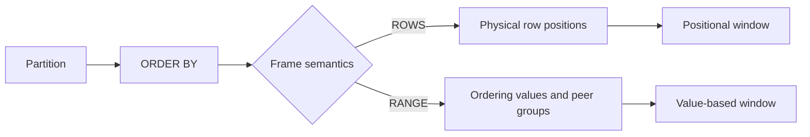
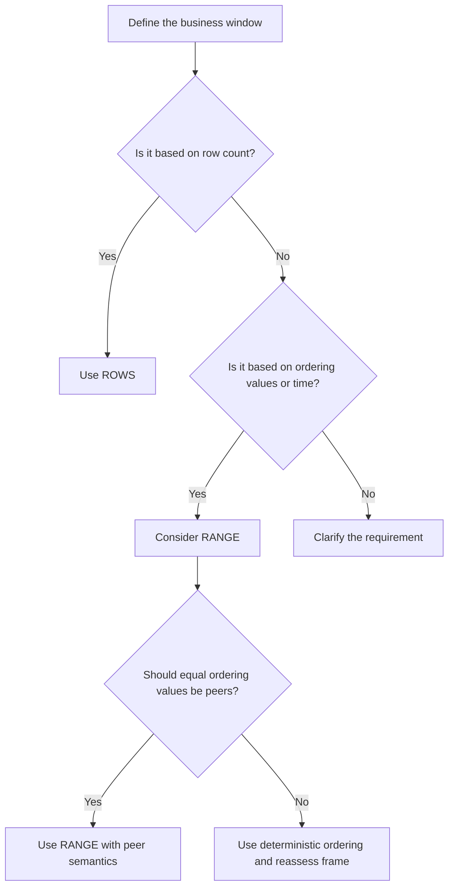

# 07- ROWS vs RANGE

## Overview

`ROWS` and `RANGE` define the **window frame** used by a window function. They determine which rows are included in calculations such as:

- Running totals.
- Moving averages.
- Rolling metrics.
- Cumulative counts.
- Previous/next comparisons involving frame-aware functions.
- Time-based analytical calculations.

The distinction becomes critical when the window's `ORDER BY` contains duplicate values.

The core difference is:

| Frame | Defines membership by |
|---|---|
| `ROWS` | Physical row positions |
| `RANGE` | Values in the window's ordering key |

For senior-level SQL work, do not treat `ROWS` and `RANGE` as interchangeable syntax. They express different business semantics.

## Why Window Frames Exist

A window function can operate over an entire partition, but many analytical queries require a smaller subset around the current row.

For example, a running total needs all rows from the beginning of the partition through the current row:

```sql
SUM(amount) OVER (
    PARTITION BY customer_id
    ORDER BY transaction_at
    ROWS BETWEEN UNBOUNDED PRECEDING AND CURRENT ROW
)
```

A moving average might require only the current row and the previous two rows:

```sql
AVG(amount) OVER (
    ORDER BY transaction_at
    ROWS BETWEEN 2 PRECEDING AND CURRENT ROW
)
```

The window frame answers:

> Given the current row and the window ordering, which rows participate in this calculation?

The distinction between `ROWS` and `RANGE` becomes visible when multiple rows share the same ordering value.

## Window Specification vs Window Frame

These are related but different concepts.

```sql
SUM(amount) OVER (
    PARTITION BY customer_id
    ORDER BY transaction_at
    ROWS BETWEEN UNBOUNDED PRECEDING AND CURRENT ROW
)
```

The components are:

| Component | Purpose |
|---|---|
| `PARTITION BY` | Defines independent groups |
| `ORDER BY` | Defines the logical sequence |
| Frame clause | Defines which rows within that ordered partition participate |

Conceptually:

```text
Partition
    │
    ├── ORDER BY establishes ordering
    │
    └── Frame selects rows around current row
              │
              ├── ROWS
              └── RANGE
```

## ROWS

### What It Is

`ROWS` defines the frame using **physical row positions** relative to the current row.

Example:

```sql
ROWS BETWEEN 2 PRECEDING AND CURRENT ROW
```

means:

> Include the current row and the two rows immediately preceding it.

If the ordered data is:

| position | value |
|---:|---:|
| 1 | 10 |
| 2 | 20 |
| 3 | 20 |
| 4 | 30 |
| 5 | 40 |

For position 4:

```sql
ROWS BETWEEN 2 PRECEDING AND CURRENT ROW
```

includes positions:

```text
2, 3, 4
```

regardless of whether their ordering values are equal.

### When to Use ROWS

Use `ROWS` when the requirement is explicitly positional:

- "Current row plus previous 6 observations."
- "Last 10 records."
- "Previous 3 transactions."
- "Three-row moving average."
- "Cumulative calculation over processed rows."
- Deterministic row-by-row analytical logic.

Example:

```sql
SELECT
    recorded_at,
    value,
    AVG(value) OVER (
        ORDER BY recorded_at, reading_id
        ROWS BETWEEN 2 PRECEDING AND CURRENT ROW
    ) AS moving_average
FROM sensor_readings;
```

This means exactly three rows at most participate in the calculation.

## RANGE

### What It Is

`RANGE` defines the frame according to the **value of the window ordering expression**, rather than simply counting physical rows.

For example:

```sql
RANGE BETWEEN UNBOUNDED PRECEDING AND CURRENT ROW
```

includes all rows whose ordering value is within the frame boundary through the current ordering value.

A key consequence is that rows with the same ordering value can be included together.

Consider:

| transaction_at | amount |
|---|---:|
| 10:00 | 100 |
| 10:00 | 200 |
| 10:05 | 50 |
| 10:10 | 75 |

With:

```sql
SUM(amount) OVER (
    ORDER BY transaction_at
    RANGE BETWEEN UNBOUNDED PRECEDING AND CURRENT ROW
)
```

both `10:00` rows belong to the frame when evaluating either `10:00` row.

This differs from `ROWS`, where each physical row is treated separately.

## The Critical Difference

Consider:

| id | order_value | amount |
|---:|---:|---:|
| 1 | 10 | 100 |
| 2 | 10 | 200 |
| 3 | 20 | 50 |
| 4 | 30 | 75 |

Compare:

```sql
SUM(amount) OVER (
    ORDER BY order_value
    ROWS BETWEEN UNBOUNDED PRECEDING AND CURRENT ROW
)
```

with:

```sql
SUM(amount) OVER (
    ORDER BY order_value
    RANGE BETWEEN UNBOUNDED PRECEDING AND CURRENT ROW
)
```

Conceptually:

| id | order_value | amount | `ROWS` result | `RANGE` result |
|---:|---:|---:|---:|---:|
| 1 | 10 | 100 | 100 | 300 |
| 2 | 10 | 200 | 300 | 300 |
| 3 | 20 | 50 | 350 | 350 |
| 4 | 30 | 75 | 425 | 425 |

The important behavior occurs at the duplicated ordering value `10`.

`ROWS` processes individual row positions.

`RANGE` treats the peer rows with the same ordering value as belonging to the same value-based boundary.

## Peer Rows

Peer rows are rows that have identical values for the window's `ORDER BY` expressions.

For:

```sql
ORDER BY transaction_at
```

these are peers:

```text
10:00
10:00
10:00
```

If you instead use:

```sql
ORDER BY transaction_at, transaction_id
```

and `transaction_id` is unique, peer groups may disappear because the complete ordering tuple is unique.

This is an important production consideration:

> Adding a unique tie-breaker can change the behavior of `RANGE` because peer groups are defined by the complete ordering expression.

## ROWS vs RANGE Example

Suppose an application records multiple payments at the same timestamp:

```sql
CREATE TABLE payments (
    payment_id bigint PRIMARY KEY,
    customer_id bigint NOT NULL,
    paid_at timestamptz NOT NULL,
    amount numeric(12, 2) NOT NULL
);
```

A positional cumulative total:

```sql
SELECT
    payment_id,
    paid_at,
    amount,
    SUM(amount) OVER (
        PARTITION BY customer_id
        ORDER BY paid_at, payment_id
        ROWS BETWEEN UNBOUNDED PRECEDING AND CURRENT ROW
    ) AS running_total
FROM payments;
```

is appropriate when every payment is considered a distinct event in a deterministic sequence.

A value-based cumulative total:

```sql
SELECT
    payment_id,
    paid_at,
    amount,
    SUM(amount) OVER (
        PARTITION BY customer_id
        ORDER BY paid_at
        RANGE BETWEEN UNBOUNDED PRECEDING AND CURRENT ROW
    ) AS running_total
FROM payments;
```

groups payments sharing the same `paid_at` value into the same value boundary.

The correct choice depends on the business definition of "running total."

## Common Frame Specifications

| Frame | Meaning |
|---|---|
| `ROWS BETWEEN UNBOUNDED PRECEDING AND CURRENT ROW` | All previous rows plus current row |
| `ROWS BETWEEN 2 PRECEDING AND CURRENT ROW` | Current row plus two previous rows |
| `ROWS BETWEEN CURRENT ROW AND 2 FOLLOWING` | Current row plus two following rows |
| `ROWS BETWEEN 2 PRECEDING AND 2 FOLLOWING` | Five-row centered window |
| `ROWS BETWEEN UNBOUNDED PRECEDING AND UNBOUNDED FOLLOWING` | Entire partition |
| `RANGE BETWEEN UNBOUNDED PRECEDING AND CURRENT ROW` | All rows through the current ordering value |
| `RANGE BETWEEN INTERVAL '7 days' PRECEDING AND CURRENT ROW` | Value-based time interval where supported by the database and ordering type |

Exact `RANGE` capabilities vary by database engine and data type, so production queries should be validated against the target SQL dialect.

## Running Totals

For a deterministic row-by-row running total, prefer an explicit `ROWS` frame:

```sql
SELECT
    transaction_id,
    transaction_at,
    amount,
    SUM(amount) OVER (
        ORDER BY transaction_at, transaction_id
        ROWS BETWEEN UNBOUNDED PRECEDING AND CURRENT ROW
    ) AS running_total
FROM transactions;
```

This makes the intended semantics explicit:

> Add one transaction at a time according to this exact ordering.

For cumulative totals where all transactions at the same business time should be treated as one peer group, `RANGE` may be more appropriate.

## Moving Windows

`ROWS` is particularly useful for fixed-size observation windows.

A seven-observation moving average:

```sql
SELECT
    recorded_at,
    value,
    AVG(value) OVER (
        ORDER BY recorded_at, reading_id
        ROWS BETWEEN 6 PRECEDING AND CURRENT ROW
    ) AS moving_average
FROM sensor_readings;
```

The frame contains at most seven physical observations.

This is different from:

> Average values observed during the previous seven calendar days.

If events are irregularly spaced, `ROWS` does not represent elapsed time.

## Time-Based Windows

For time-series analysis, `RANGE` can express a value-based interval when supported by the SQL dialect.

For example, PostgreSQL supports interval-based `RANGE` frames for compatible date/time ordering expressions:

```sql
SELECT
    recorded_at,
    value,
    AVG(value) OVER (
        ORDER BY recorded_at
        RANGE BETWEEN INTERVAL '7 days' PRECEDING AND CURRENT ROW
    ) AS seven_day_average
FROM sensor_readings;
```

This means:

> Include observations whose `recorded_at` falls within the seven-day value range ending at the current timestamp.

That is fundamentally different from:

```sql
ROWS BETWEEN 6 PRECEDING AND CURRENT ROW
```

which means:

> Include the previous six rows.

For irregular event streams, this distinction is critical.

## ROWS for Event Counts, RANGE for Time Windows

A useful mental model is:

| Requirement | Typical choice |
|---|---|
| Previous 10 records | `ROWS` |
| Current + previous 6 observations | `ROWS` |
| Previous 30 minutes | `RANGE` where supported |
| Previous 7 calendar days | `RANGE` where supported |
| Entire history through current value | `RANGE` or explicit `ROWS`, depending on peer semantics |
| Exactly one physical predecessor | `ROWS` |
| Include all peers at the same ordering value | `RANGE` |

The correct choice is driven by the **business meaning of the window**, not by which syntax looks shorter.

## Default Frames and Why Explicit Frames Matter

Some window functions use a default frame when `ORDER BY` is specified and no explicit frame is provided.

For example:

```sql
SUM(amount) OVER (
    ORDER BY transaction_at
)
```

can have semantics equivalent to a value-based cumulative frame in PostgreSQL:

```sql
RANGE BETWEEN UNBOUNDED PRECEDING AND CURRENT ROW
```

This can surprise developers when duplicate ordering values exist.

For production SQL, explicitly specify the frame when frame semantics matter:

```sql
SUM(amount) OVER (
    ORDER BY transaction_at, transaction_id
    ROWS BETWEEN UNBOUNDED PRECEDING AND CURRENT ROW
)
```

Explicit framing makes code review and future maintenance safer.

## RANGE With Duplicate Ordering Values

Consider:

```text
transaction_at   amount
---------------  ------
10:00            100
10:00            200
10:05             50
```

With:

```sql
SUM(amount) OVER (
    ORDER BY transaction_at
    RANGE BETWEEN UNBOUNDED PRECEDING AND CURRENT ROW
)
```

the `10:00` rows are peers.

The frame for either `10:00` row includes:

```text
100 + 200
```

So both rows can receive:

```text
300
```

With:

```sql
SUM(amount) OVER (
    ORDER BY transaction_at
    ROWS BETWEEN UNBOUNDED PRECEDING AND CURRENT ROW
)
```

the first row can receive `100`, while the second receives `300`.

This difference is one of the most common window-frame interview traps.

## Adding a Tie-Breaker

Suppose you change:

```sql
ORDER BY transaction_at
```

to:

```sql
ORDER BY transaction_at, transaction_id
```

and `transaction_id` is unique.

For `RANGE` semantics, the complete ordering key is now unique, so the two rows are no longer peers under the full ordering specification.

This means:

```sql
RANGE BETWEEN UNBOUNDED PRECEDING AND CURRENT ROW
```

can behave more like a row-specific cumulative frame for that ordering.

Do not add tie-breakers mechanically without considering the intended business semantics.

Use a tie-breaker when you need deterministic row ordering. Use peer-based `RANGE` semantics when equal ordering values should intentionally be grouped.

## Window Frame Diagram



## ROWS vs RANGE Comparison

| Property | `ROWS` | `RANGE` |
|---|---|---|
| Primary concept | Physical position | Ordering value |
| Counts rows | Yes | No |
| Sensitive to duplicate ordering values | Yes, in a positional way | Yes, through peer groups |
| Includes peers together | Not inherently | Yes for value-based boundaries |
| Fixed number of observations | Excellent | Not appropriate |
| Time-based interval | Generally no | Supported in dialects with appropriate syntax |
| Deterministic with unique ordering | Yes | Yes |
| Common use | Moving N-row metrics | Value/time-based cumulative windows |
| Main risk | Mistaking rows for time | Unexpected peer-group inclusion |

## Production Considerations

### Define the Business Window First

Before writing the SQL, clarify whether the requirement means:

- Previous N records.
- Previous N minutes.
- Previous N hours.
- Previous N calendar days.
- All events up to the current value.
- All events sharing the current timestamp.

These are different requirements.

### Use Explicit Frames for Important Queries

Instead of:

```sql
SUM(amount) OVER (
    PARTITION BY customer_id
    ORDER BY paid_at
)
```

prefer:

```sql
SUM(amount) OVER (
    PARTITION BY customer_id
    ORDER BY paid_at, payment_id
    ROWS BETWEEN UNBOUNDED PRECEDING AND CURRENT ROW
)
```

when row-by-row cumulative semantics are intended.

The explicit frame communicates the contract of the query.

### Consider Duplicate Timestamps

Event systems frequently produce timestamps with identical values.

Examples include:

- Batch inserts.
- Multiple Kafka events processed at the same timestamp.
- Payment events.
- Order state changes.
- Log records.
- IoT measurements.

Never assume a timestamp uniquely identifies an event unless the schema guarantees it.

### Use a Stable Sequence

If physical event order matters, use a deterministic sequence such as:

```sql
ORDER BY event_at, event_id
```

or another business-valid ordering key.

A surrogate ID should only be used as a tie-breaker when its ordering corresponds to an acceptable event sequence.

### Avoid OLTP Contention

Window queries over large transactional tables can require significant sorting and memory.

For large workloads:

- Restrict the time range when possible.
- Filter by tenant or entity where appropriate.
- Verify indexes support the filtering portion of the query.
- Use read replicas when suitable.
- Precompute frequently requested metrics.
- Move heavy analytical workloads to analytical infrastructure when necessary.

Use:

```sql
EXPLAIN (ANALYZE, BUFFERS)
```

to validate actual behavior in PostgreSQL.

## Common Mistakes

### Treating ROWS and RANGE as Synonyms

They are not.

```sql
ROWS  → row positions
RANGE → ordering values
```

### Assuming ROWS Means Time

This:

```sql
ROWS BETWEEN 6 PRECEDING AND CURRENT ROW
```

does not mean seven days.

It means seven rows at most.

### Ignoring Peer Rows

With:

```sql
ORDER BY transaction_at
```

multiple records can share the same ordering value.

`RANGE` can include all of those peers.

### Relying on an Implicit Frame

Implicit frame behavior can be less obvious during code review.

If exact semantics matter, specify the frame explicitly.

### Adding a Unique Tie-Breaker Without Checking Semantics

Changing:

```sql
ORDER BY timestamp
```

to:

```sql
ORDER BY timestamp, id
```

can change peer groups and therefore change `RANGE` behavior.

### Using RANGE for a Fixed Number of Events

If the requirement is:

> Last 100 observations.

use:

```sql
ROWS BETWEEN 99 PRECEDING AND CURRENT ROW
```

not a time-based `RANGE`.

### Using ROWS for a Time-Based Requirement

If the requirement is:

> Events during the previous hour.

a fixed number of rows is incorrect when event frequency varies.

## Interview Traps

| Question | Correct answer |
|---|---|
| What does `ROWS` represent? | Physical row positions relative to the current row. |
| What does `RANGE` represent? | Values in the window ordering and their peer groups. |
| Why can `ROWS` and `RANGE` produce different totals? | Duplicate ordering values can cause `RANGE` to include peer rows together. |
| What is `ROWS BETWEEN 2 PRECEDING AND CURRENT ROW`? | Current row plus the two preceding rows. |
| Does `ROWS 6 PRECEDING` mean six days? | No, it means six rows. |
| When is `ROWS` preferred? | Fixed-size positional windows. |
| When is `RANGE` preferred? | Value-based or supported time-interval windows. |
| Why explicitly specify a frame? | To make business semantics clear and avoid relying on implicit defaults. |
| Can adding a unique tie-breaker change `RANGE` behavior? | Yes, because peer groups depend on the complete ordering specification. |
| Which is better for a seven-row moving average? | `ROWS`. |
| Which is more appropriate for a seven-day time window? | `RANGE`, when supported and correctly expressed for the database dialect. |

## Practical Decision Guide

Use this sequence when choosing a frame:



A practical rule:

```text
"Previous N rows"          → ROWS
"Last N observations"      → ROWS
"Previous N minutes"       → RANGE
"Previous N days"          → RANGE, where supported
"Same timestamp as me"     → RANGE / peer semantics
"Process each event"       → ROWS
```

## PostgreSQL Example: Both Semantics

```sql
SELECT
    payment_id,
    paid_at,
    amount,
    SUM(amount) OVER (
        PARTITION BY customer_id
        ORDER BY paid_at
        ROWS BETWEEN UNBOUNDED PRECEDING AND CURRENT ROW
    ) AS rows_running_total,
    SUM(amount) OVER (
        PARTITION BY customer_id
        ORDER BY paid_at
        RANGE BETWEEN UNBOUNDED PRECEDING AND CURRENT ROW
    ) AS range_running_total
FROM payments
ORDER BY customer_id, paid_at, payment_id;
```

This is a useful diagnostic query when investigating unexpected cumulative values.

If multiple payments share the same `paid_at`, compare the two output columns. A difference indicates that peer-group semantics matter for the dataset.

## Testing Window Frame Semantics

For production queries, test edge cases explicitly:

| Test case | Why it matters |
|---|---|
| Unique ordering values | Establish baseline behavior |
| Duplicate ordering values | Exposes `ROWS` vs `RANGE` differences |
| First partition row | Validates preceding boundaries |
| Last partition row | Validates following boundaries |
| Single-row partition | Validates edge behavior |
| NULL ordering values | Validates database-specific ordering behavior |
| Irregular timestamps | Detects row-count vs time-window confusion |
| Large partitions | Validates performance characteristics |

A small fixture containing duplicate timestamps is especially valuable in automated SQL tests.

## Performance Guidance

The primary performance concern is usually the work required to partition and order the input before evaluating the frame.

Potential costs include:

- Sorting.
- Memory consumption.
- Large partitions.
- Wide rows.
- Long historical ranges.
- Concurrent analytical queries.

A useful PostgreSQL query pattern is:

```sql
EXPLAIN (ANALYZE, BUFFERS)
SELECT
    customer_id,
    paid_at,
    amount,
    SUM(amount) OVER (
        PARTITION BY customer_id
        ORDER BY paid_at, payment_id
        ROWS BETWEEN UNBOUNDED PRECEDING AND CURRENT ROW
    ) AS running_total
FROM payments
WHERE customer_id = :customer_id
  AND paid_at >= :start_time;
```

Do not optimize solely based on the presence of an index. Validate the complete execution plan and measure against realistic production-scale data.

## Key Takeaways

- **`ROWS` defines a window by physical row positions, while `RANGE` defines it by ordering values and peer groups.**
- **Duplicate `ORDER BY` values are the critical case where `ROWS` and `RANGE` can produce different results.**
- **Use `ROWS` for fixed-size observation windows and `RANGE` for value-based or supported time-based windows.**
- **Explicitly define the frame when its semantics matter; relying on defaults can hide important peer-group behavior.**
- **Treat ordering, duplicate timestamps, frame semantics, and production data volume as part of the query's correctness—not merely its syntax.**