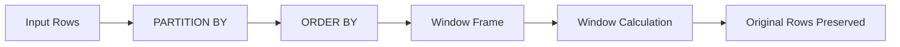
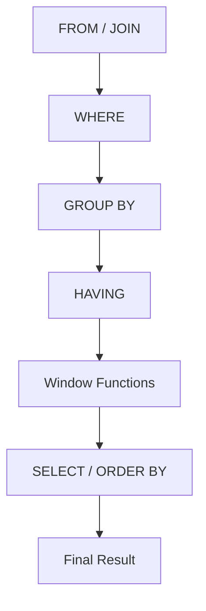
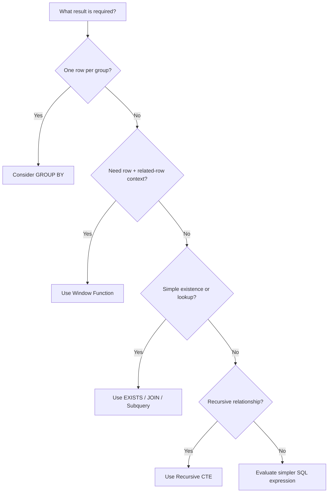

# 08- When to Use Window Functions

## Overview

Window functions are appropriate when a query needs to calculate a value across a related set of rows **without collapsing those rows into a single result row**.

They are particularly useful when the application needs both:

- The individual row.
- A calculation derived from neighboring, preceding, following, or grouped rows.

Typical backend use cases include:

- Ranking products or users.
- Finding the latest record per entity.
- Calculating running totals.
- Comparing a row with its previous or next event.
- Calculating moving averages.
- Detecting state changes.
- Computing percentages within a group.
- Selecting top-N records per customer or tenant.
- Analyzing event streams and time-series data.

The key engineering question is not:

> "Can I use a window function?"

It is:

> "Does this calculation require row-level context while preserving the underlying rows?"

If yes, a window function is often the right SQL abstraction.

## The Core Problem Window Functions Solve

Consider an orders table:

```text
customer_id | order_id | amount
------------|----------|-------
1           | 101      | 100
1           | 102      | 250
1           | 103      | 150
2           | 201      | 400
2           | 202      | 100
```

Suppose the API needs to return every order together with the customer's total spending.

A `GROUP BY` query:

```sql
SELECT
    customer_id,
    SUM(amount) AS customer_total
FROM orders
GROUP BY customer_id;
```

produces one row per customer.

A window function preserves the order rows:

```sql
SELECT
    order_id,
    customer_id,
    amount,
    SUM(amount) OVER (
        PARTITION BY customer_id
    ) AS customer_total
FROM orders;
```

Result:

```text
order_id | customer_id | amount | customer_total
---------|-------------|--------|---------------
101      | 1           | 100    | 500
102      | 1           | 250    | 500
103      | 1           | 150    | 500
201      | 2           | 400    | 500
202      | 2           | 100    | 500
```

This is the fundamental distinction:

```text
GROUP BY
    rows → groups → one result row per group

Window Function
    rows → groups/window → calculation → original rows preserved
```

## When Window Functions Are a Good Fit

Window functions are especially appropriate when the result needs **row context plus group context**.

| Requirement | Window function fit |
|---|---|
| Rank rows within a group | Excellent |
| Compare current row with previous row | Excellent |
| Compare current row with next row | Excellent |
| Running total | Excellent |
| Moving average | Excellent |
| Percentage of group total | Excellent |
| Top N per group | Excellent |
| Latest row per entity | Excellent |
| Return only one aggregate row per group | Usually `GROUP BY` |
| Simple existence check | Usually `EXISTS` |
| Simple scalar lookup | Often a join/subquery |
| Recursive hierarchy traversal | Recursive CTE |
| Large analytical aggregation | Often better in an analytical system |

## Window Functions Preserve Row Identity

A useful mental model is:



Unlike aggregation with `GROUP BY`, a window function does not fundamentally change the cardinality of the input.

For example:

```sql
SELECT
    employee_id,
    department_id,
    salary,
    AVG(salary) OVER (
        PARTITION BY department_id
    ) AS department_avg_salary
FROM employees;
```

Every employee remains present.

This makes window functions particularly useful for API responses where each entity needs contextual metrics.

## Ranking and Top-N Problems

Ranking is one of the strongest use cases for window functions.

Suppose an application needs the top three products in each category.

```sql
WITH ranked_products AS (
    SELECT
        product_id,
        category_id,
        revenue,
        ROW_NUMBER() OVER (
            PARTITION BY category_id
            ORDER BY revenue DESC, product_id
        ) AS row_number
    FROM product_sales
)
SELECT
    product_id,
    category_id,
    revenue
FROM ranked_products
WHERE row_number <= 3;
```

The window function performs the ranking; the outer query filters the ranked result.

### Why Not GROUP BY?

`GROUP BY` can calculate:

```sql
MAX(revenue)
```

but it does not naturally answer:

> "Return the three highest individual rows from every category."

Window functions are designed for this row-relative ranking problem.

## Choosing a Ranking Function

| Function | Behavior |
|---|---|
| `ROW_NUMBER()` | Every row gets a unique sequential number |
| `RANK()` | Ties receive the same rank; gaps appear afterward |
| `DENSE_RANK()` | Ties receive the same rank; no gaps |

Example:

```text
score:        100  100  90  80
ROW_NUMBER:     1    2   3   4
RANK:           1    1   3   4
DENSE_RANK:     1    1   2   3
```

The choice depends on the business meaning of "top N."

## Previous and Next Row Analysis

Use `LAG()` when the current row needs information from an earlier row.

```sql
SELECT
    customer_id,
    order_id,
    ordered_at,
    amount,
    LAG(amount) OVER (
        PARTITION BY customer_id
        ORDER BY ordered_at, order_id
    ) AS previous_amount
FROM orders;
```

Use `LEAD()` when the current row needs information from a later row.

```sql
SELECT
    customer_id,
    order_id,
    ordered_at,
    LEAD(ordered_at) OVER (
        PARTITION BY customer_id
        ORDER BY ordered_at, order_id
    ) AS next_order_at
FROM orders;
```

This is useful for:

- Time between events.
- Customer purchase intervals.
- State transitions.
- Session analysis.
- Detecting changes.
- Event-stream analysis.

## Change Detection

Suppose an order status history contains:

```text
order_id | changed_at | status
---------|------------|--------
10       | 09:00      | pending
10       | 10:00      | paid
10       | 11:00      | shipped
```

You can compare each status with the previous status:

```sql
SELECT
    order_id,
    changed_at,
    status,
    LAG(status) OVER (
        PARTITION BY order_id
        ORDER BY changed_at
    ) AS previous_status
FROM order_status_history;
```

Then detect transitions:

```sql
WITH status_history AS (
    SELECT
        order_id,
        changed_at,
        status,
        LAG(status) OVER (
            PARTITION BY order_id
            ORDER BY changed_at
        ) AS previous_status
    FROM order_status_history
)
SELECT
    order_id,
    changed_at,
    previous_status,
    status
FROM status_history
WHERE previous_status IS DISTINCT FROM status;
```

For PostgreSQL, `IS DISTINCT FROM` is useful when `NULL` values need well-defined comparison semantics.

## Running Totals

A running total requires an ordered relationship between rows.

```sql
SELECT
    account_id,
    transaction_id,
    transaction_at,
    amount,
    SUM(amount) OVER (
        PARTITION BY account_id
        ORDER BY transaction_at, transaction_id
        ROWS BETWEEN UNBOUNDED PRECEDING AND CURRENT ROW
    ) AS running_balance
FROM transactions;
```

This is preferable to repeatedly querying the database for previous transactions.

The explicit `ROWS` frame is important when transactions can share the same timestamp.

## Moving Metrics

Window functions are appropriate for fixed-size or value-based rolling calculations.

A seven-observation moving average:

```sql
SELECT
    recorded_at,
    value,
    AVG(value) OVER (
        ORDER BY recorded_at, reading_id
        ROWS BETWEEN 6 PRECEDING AND CURRENT ROW
    ) AS moving_average
FROM sensor_readings;
```

The query can calculate the metric in the database instead of transferring all observations to Python for processing.

For time-based windows, use an appropriate `RANGE` frame where the target database supports the required syntax.

## Percent of Group

Suppose an API needs each product's percentage of category revenue.

```sql
SELECT
    category_id,
    product_id,
    revenue,
    revenue * 100.0
        / SUM(revenue) OVER (
            PARTITION BY category_id
        ) AS category_revenue_pct
FROM product_sales;
```

This is a common pattern:

```text
row value
    /
group window aggregate
```

It avoids joining the table against a separately aggregated version of itself.

## Latest Row Per Entity

A common backend requirement is:

> Return the latest state for every customer/order/device.

A window function provides a clean solution:

```sql
WITH ranked AS (
    SELECT
        device_id,
        recorded_at,
        status,
        ROW_NUMBER() OVER (
            PARTITION BY device_id
            ORDER BY recorded_at DESC, reading_id DESC
        ) AS rn
    FROM device_status_history
)
SELECT
    device_id,
    recorded_at,
    status
FROM ranked
WHERE rn = 1;
```

The ordering must include a deterministic tie-breaker if timestamps are not unique.

For PostgreSQL specifically, `DISTINCT ON` can sometimes be a simpler and efficient alternative, but it is PostgreSQL-specific:

```sql
SELECT DISTINCT ON (device_id)
    device_id,
    recorded_at,
    status
FROM device_status_history
ORDER BY device_id, recorded_at DESC, reading_id DESC;
```

The choice depends on portability and query requirements.

## Session and Event Analysis

Window functions are particularly valuable for event-oriented systems.

Consider:

```text
user_id | event_at | event
--------|----------|--------
42      | 09:00    | login
42      | 09:05    | view
42      | 09:10    | purchase
42      | 11:00    | logout
```

`LAG()` can calculate the interval since the previous event:

```sql
SELECT
    user_id,
    event_at,
    event_type,
    event_at - LAG(event_at) OVER (
        PARTITION BY user_id
        ORDER BY event_at, event_id
    ) AS time_since_previous_event
FROM user_events;
```

This can support:

- Sessionization.
- User behavior analysis.
- SLA analysis.
- Event sequencing.
- Operational telemetry.

For high-volume event streams, however, consider whether this computation belongs in the OLTP database or an analytical pipeline such as Kafka + stream processing + an analytical datastore.

## Window Functions vs GROUP BY

The most important distinction is **row preservation**.

```sql
-- GROUP BY
SELECT
    customer_id,
    SUM(amount) AS total
FROM orders
GROUP BY customer_id;
```

```sql
-- Window function
SELECT
    order_id,
    customer_id,
    amount,
    SUM(amount) OVER (
        PARTITION BY customer_id
    ) AS total
FROM orders;
```

| Question | `GROUP BY` | Window function |
|---|---|---|
| Collapses rows? | Yes | No |
| Produces one row per group? | Usually | No |
| Keeps individual row attributes? | Not directly | Yes |
| Group aggregate alongside detail rows? | Awkward | Excellent |
| Ranking | Not appropriate | Excellent |
| Previous/next row | Not appropriate | Excellent |
| Running totals | Possible but awkward | Excellent |
| Simple aggregation | Excellent | Often unnecessary |

### Use GROUP BY When

The requirement is:

> "Give me one result per customer."

Example:

```sql
SELECT
    customer_id,
    COUNT(*) AS order_count
FROM orders
GROUP BY customer_id;
```

### Use a Window Function When

The requirement is:

> "Give me every order and also show the customer's order count."

```sql
SELECT
    order_id,
    customer_id,
    COUNT(*) OVER (
        PARTITION BY customer_id
    ) AS order_count
FROM orders;
```

## Window Functions vs Subqueries

Window functions often replace correlated or repeated aggregation.

A correlated subquery:

```sql
SELECT
    o.order_id,
    o.customer_id,
    o.amount,
    (
        SELECT SUM(o2.amount)
        FROM orders AS o2
        WHERE o2.customer_id = o.customer_id
    ) AS customer_total
FROM orders AS o;
```

can often become:

```sql
SELECT
    order_id,
    customer_id,
    amount,
    SUM(amount) OVER (
        PARTITION BY customer_id
    ) AS customer_total
FROM orders;
```

The window version expresses the relationship directly.

However, do not assume every window function is automatically faster. The optimizer and data distribution determine actual performance.

Use:

```sql
EXPLAIN (ANALYZE, BUFFERS)
```

in PostgreSQL to compare actual execution plans.

## Window Functions vs CTEs

A CTE is primarily a **query organization/composition mechanism**.

A window function is a **row-relative calculation mechanism**.

They are not mutually exclusive.

A common production pattern is:

```sql
WITH ranked_orders AS (
    SELECT
        order_id,
        customer_id,
        amount,
        ROW_NUMBER() OVER (
            PARTITION BY customer_id
            ORDER BY amount DESC, order_id
        ) AS rn
    FROM orders
)
SELECT
    order_id,
    customer_id,
    amount
FROM ranked_orders
WHERE rn <= 3;
```

The CTE structures the query while the window function performs the ranking.

Think of them as solving different problems:

| Requirement | Tool |
|---|---|
| Organize a multi-stage query | CTE |
| Rank rows | Window function |
| Compare neighboring rows | Window function |
| Recursively traverse hierarchy | Recursive CTE |
| Materialize/reuse a logical stage | CTE, depending on database semantics |
| Calculate a value across related rows | Window function |

## When Not to Use Window Functions

Window functions are powerful but not universally appropriate.

### Simple Aggregation

Do not use:

```sql
SELECT
    customer_id,
    COUNT(*) OVER (PARTITION BY customer_id)
FROM orders;
```

if the API only needs:

```text
customer_id → order_count
```

Use:

```sql
SELECT
    customer_id,
    COUNT(*) AS order_count
FROM orders
GROUP BY customer_id;
```

The simpler query communicates the intended result more clearly.

### Simple Existence Checks

For:

> Does this customer have any orders?

prefer:

```sql
SELECT EXISTS (
    SELECT 1
    FROM orders
    WHERE customer_id = :customer_id
);
```

A window function adds unnecessary work.

### Recursive Hierarchies

For organizational structures, category trees, or dependency graphs, use recursive CTEs when recursion is required.

A window function does not traverse arbitrary graph relationships.

### Extremely Large Analytical Workloads

A window query over billions of rows can be expensive.

If the workload is analytical and recurring, consider:

- Data warehouse.
- Columnar database.
- Materialized views.
- Pre-aggregated tables.
- Batch processing.
- Stream processing.

The correct optimization may be architectural rather than SQL-level.

## Filtering Window Function Results

Window functions are generally evaluated after `WHERE`, which means this is not valid in the intended way:

```sql
SELECT
    product_id,
    ROW_NUMBER() OVER (
        ORDER BY revenue DESC
    ) AS rn
FROM products
WHERE rn <= 10;
```

The alias is not available to `WHERE` at that stage.

Use a subquery or CTE:

```sql
WITH ranked_products AS (
    SELECT
        product_id,
        revenue,
        ROW_NUMBER() OVER (
            ORDER BY revenue DESC
        ) AS rn
    FROM products
)
SELECT
    product_id,
    revenue
FROM ranked_products
WHERE rn <= 10;
```

This separation is important:

```text
inner query
    ↓
calculate window value
    ↓
outer query
    ↓
filter window result
```

## Query Evaluation Model

The exact optimizer implementation is database-specific, but a useful logical model is:



This is a conceptual model rather than a literal description of every database engine's physical execution plan.

The distinction explains why window-function results often need an outer query before they can be filtered.

## Performance Considerations

Window functions can require substantial sorting and partitioning work.

Potential cost drivers include:

- Number of input rows.
- Number and size of partitions.
- `ORDER BY` expressions.
- Number of window functions.
- Frame size.
- Wide rows.
- Memory available to the database.
- Concurrent analytical queries.

For PostgreSQL:

```sql
EXPLAIN (ANALYZE, BUFFERS)
SELECT
    customer_id,
    order_id,
    amount,
    ROW_NUMBER() OVER (
        PARTITION BY customer_id
        ORDER BY created_at, order_id
    ) AS rn
FROM orders
WHERE created_at >= :start_time;
```

Look for:

- Large sorts.
- Disk-based temporary operations.
- Excessive rows entering the window stage.
- Unexpected sequential scans.
- Expensive joins before the window calculation.

### Reduce Input Before Windowing

If older data is irrelevant, filter it first:

```sql
WITH recent_orders AS (
    SELECT
        order_id,
        customer_id,
        amount,
        created_at
    FROM orders
    WHERE created_at >= :start_time
)
SELECT
    order_id,
    customer_id,
    amount,
    SUM(amount) OVER (
        PARTITION BY customer_id
        ORDER BY created_at, order_id
        ROWS BETWEEN UNBOUNDED PRECEDING AND CURRENT ROW
    ) AS running_total
FROM recent_orders;
```

Reducing the number of rows entering the window stage can materially reduce memory and sorting costs.

## Indexing Considerations

An index can help with filtering and sometimes with ordering, but window-function performance should be validated using actual execution plans.

For example, if queries frequently filter by tenant and order by event time:

```sql
CREATE INDEX CONCURRENTLY idx_events_tenant_event_time
ON events (tenant_id, event_at, event_id);
```

This can support access patterns involving:

```sql
WHERE tenant_id = :tenant_id
ORDER BY event_at, event_id
```

However, indexes are not a guarantee that a window query will avoid sorting. Joins, filters, partitioning requirements, and the optimizer's chosen plan all matter.

## Deterministic Ordering

A production window query should use deterministic ordering whenever the business logic depends on row order.

Avoid:

```sql
ROW_NUMBER() OVER (
    PARTITION BY customer_id
    ORDER BY created_at
)
```

when multiple rows can have the same `created_at`.

Prefer:

```sql
ROW_NUMBER() OVER (
    PARTITION BY customer_id
    ORDER BY created_at, order_id
)
```

assuming `order_id` provides an acceptable tie-breaker.

This is particularly important for:

- Pagination.
- Ranking.
- Latest-record selection.
- `LAG()` and `LEAD()`.
- Running totals.
- Event processing.

## Production Use Cases

### REST API: Ranked Results

A FastAPI service might need:

```text
GET /customers/{id}/orders/top
```

The database can rank the customer's orders directly:

```sql
WITH ranked AS (
    SELECT
        order_id,
        amount,
        ROW_NUMBER() OVER (
            PARTITION BY customer_id
            ORDER BY amount DESC, order_id
        ) AS rn
    FROM orders
    WHERE customer_id = :customer_id
)
SELECT
    order_id,
    amount
FROM ranked
WHERE rn <= 10;
```

The application receives only the required records instead of loading all orders into Python.

### Django

Django's ORM supports window expressions:

```python
from django.db.models import F, Window
from django.db.models.functions import RowNumber

queryset = (
    Order.objects
    .annotate(
        row_number=Window(
            expression=RowNumber(),
            partition_by=[F("customer_id")],
            order_by=[F("created_at").asc(), F("id").asc()],
        )
    )
)
```

For complex analytical queries, inspect the generated SQL and verify database-specific behavior rather than assuming ORM abstraction eliminates SQL semantics.

### Microservices

In a microservice architecture, window functions are useful when the required calculation belongs to the service's relational data model.

For example:

```text
Orders Service
      │
      ▼
PostgreSQL
      │
      ├── rank customer orders
      ├── calculate order history changes
      └── calculate running metrics
      │
      ▼
REST / gRPC response
```

Avoid moving large datasets between services solely to perform calculations that the database can safely execute locally.

## Security Considerations

Window functions do not inherently create a security vulnerability, but query design still matters.

### Enforce Tenant Boundaries

For multi-tenant systems, ensure tenant filtering happens before calculating the window where appropriate.

For example:

```sql
SELECT
    order_id,
    customer_id,
    amount,
    SUM(amount) OVER (
        PARTITION BY customer_id
    ) AS customer_total
FROM orders
WHERE tenant_id = :tenant_id;
```

Do not rely on:

```sql
PARTITION BY tenant_id
```

as a substitute for authorization.

Partitioning controls calculation boundaries; it does not enforce access control.

### Parameterize Inputs

Use parameterized queries:

```sql
WHERE tenant_id = :tenant_id
```

rather than dynamically concatenating user input into SQL.

Django and FastAPI applications should rely on their database/ORM parameterization mechanisms rather than manually constructing SQL strings.

## Common Mistakes

### Using GROUP BY When Rows Must Be Preserved

If the API needs both detail rows and group-level metrics, `GROUP BY` may destroy required row-level information.

Use a window function instead.

### Using a Window Function for a Simple Aggregate

If only one row per group is required, `GROUP BY` is usually clearer.

### Forgetting the Outer Query

Window values generally need to be calculated in an inner query before being filtered.

Use:

```sql
WITH ranked AS (...)
SELECT *
FROM ranked
WHERE rn <= 3;
```

### Assuming Window Functions Automatically Improve Performance

A window function can replace a correlated subquery, but performance depends on:

- Data volume.
- Indexes.
- Join structure.
- Sort requirements.
- Database optimizer.
- Partition sizes.

Always benchmark important queries.

### Non-Deterministic Ordering

Ordering only by a timestamp when timestamps are duplicated can produce unstable row-relative calculations.

Add an appropriate tie-breaker.

### Confusing PARTITION BY With GROUP BY

`PARTITION BY` creates independent calculation groups but does not collapse rows.

```sql
SUM(amount) OVER (
    PARTITION BY customer_id
)
```

and:

```sql
SELECT customer_id, SUM(amount)
FROM orders
GROUP BY customer_id;
```

have fundamentally different result cardinalities.

### Ignoring Large Partitions

A single partition containing millions of rows can make window operations expensive.

Review data distribution, query filters, and workload architecture.

## Decision Matrix

| Problem | Recommended approach |
|---|---|
| One aggregate row per group | `GROUP BY` |
| Aggregate plus original rows | Window function |
| Rank rows | Window function |
| Top N per group | Window function |
| Previous row comparison | `LAG()` |
| Next row comparison | `LEAD()` |
| Running total | Window function |
| Moving average | Window function |
| Percentage of group | Window function |
| Latest row per entity | Window function or DB-specific alternative |
| Simple existence test | `EXISTS` |
| Simple lookup | Join/subquery |
| Multi-stage query organization | CTE |
| Recursive hierarchy | Recursive CTE |
| Massive recurring analytics | Analytical datastore/precomputation |

## Practical Decision Flow



## Senior-Level Engineering Checklist

Before shipping a window-function query, verify:

- **Business semantics** — Is the calculation actually row-relative?
- **Partitioning** — Are rows grouped by the correct business entity or tenant?
- **Ordering** — Is ordering deterministic?
- **Frame** — Does `ROWS` or `RANGE` represent the intended semantics?
- **Cardinality** — Are original rows supposed to remain in the result?
- **Filtering** — Is the window result filtered in an outer query where necessary?
- **Performance** — Has the query been tested with production-scale data?
- **Indexes** — Do filtering and ordering patterns have appropriate indexes?
- **Data distribution** — Can a partition become unexpectedly large?
- **Concurrency** — Will the query compete with latency-sensitive OLTP workloads?
- **Portability** — Does the SQL depend on PostgreSQL-specific behavior?
- **Authorization** — Are tenant and access-control predicates enforced independently of window partitioning?

## Key Takeaways

- **Use window functions when calculations need row-level context while preserving the underlying result rows.**
- **They are particularly strong for ranking, top-N queries, running totals, moving metrics, previous/next-row analysis, and change detection.**
- **Choose `GROUP BY`, joins, subqueries, `EXISTS`, or CTEs when those abstractions express the requirement more directly.**
- **Production window queries require deterministic ordering, correct partition/frame semantics, controlled input size, and execution-plan validation.**
- **For very large analytical workloads, optimize the architecture—not just the SQL—by considering precomputation, materialized views, streaming, or analytical databases.**