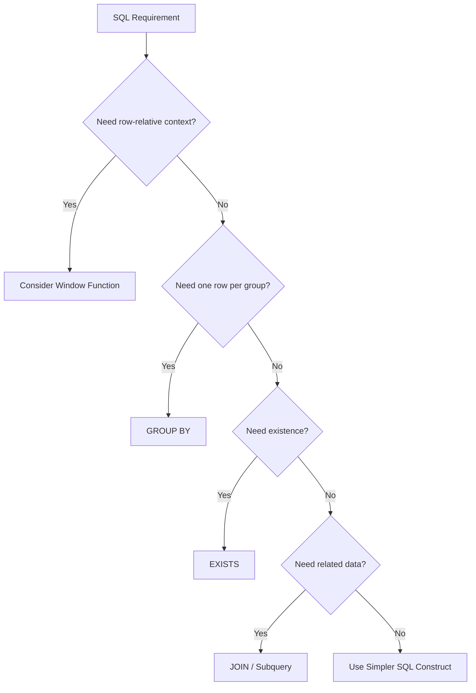
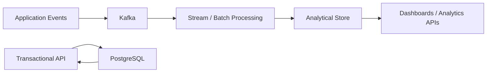

# 09- When Not to Use Window Functions

## Overview

Window functions are powerful because they calculate values across related rows while preserving the original row-level result set. That capability makes them ideal for ranking, running totals, previous/next-row comparisons, and other analytical operations.

However, a window function is not automatically the best solution whenever related rows are involved. Using one when a simpler relational operation is sufficient can make SQL harder to understand, increase sorting and memory requirements, and create unnecessary database load.

The production-oriented rule is:

> **Use a window function when the calculation genuinely depends on a row's position or context within a set of rows. Otherwise, prefer the simplest SQL construct that expresses the requirement.**

Common alternatives include:

- `GROUP BY` for aggregation and one-row-per-group results.
- `EXISTS` for existence checks.
- `JOIN` for combining related data.
- Scalar or correlated subqueries for isolated lookups.
- CTEs for organizing multi-stage queries.
- Conditional aggregation for conditional counts and totals.
- `DISTINCT` when deduplication is the actual requirement.
- `LIMIT` / `FETCH` for global top-N queries.
- Database-specific features when they provide a clearer or more efficient solution.

## The Core Decision

The first question should be:

> **Does the calculation require row-relative context?**

If the answer is no, a window function is often unnecessary.



A row-relative calculation includes questions such as:

- What was the previous order?
- What is the next event?
- What is this row's rank?
- What is the running total up to this row?
- What is the average of the surrounding rows?
- Is this row the latest row within its group?

These are natural window-function problems.

## When GROUP BY Is Better

Use `GROUP BY` when the desired result is fundamentally one row per group.

For example:

```sql
SELECT
    customer_id,
    COUNT(*) AS order_count,
    SUM(amount) AS total_spend
FROM orders
GROUP BY customer_id;
```

There is no reason to calculate these values as window functions if the individual orders are not required in the result.

An unnecessary window version would be:

```sql
SELECT DISTINCT
    customer_id,
    COUNT(*) OVER (PARTITION BY customer_id) AS order_count,
    SUM(amount) OVER (PARTITION BY customer_id) AS total_spend
FROM orders;
```

Although it can produce the desired result, it introduces unnecessary complexity and potentially additional work.

### Rule

| Requirement | Prefer |
|---|---|
| One row per customer | `GROUP BY` |
| Every order plus customer total | Window function |
| Every order plus customer count | Window function |
| Customer total only | `GROUP BY` |

The desired **result cardinality** is one of the fastest ways to choose between the two.

## When EXISTS Is Better

Use `EXISTS` when the question is simply whether matching rows exist.

For example:

```sql
SELECT EXISTS (
    SELECT 1
    FROM orders
    WHERE customer_id = :customer_id
);
```

A window function is unnecessary because there is no row-relative calculation.

Avoid patterns such as:

```sql
SELECT
    customer_id,
    COUNT(*) OVER (PARTITION BY customer_id) > 0 AS has_orders
FROM orders;
```

This cannot even represent customers with zero orders unless another relation is introduced, and it performs work that `EXISTS` expresses directly.

For API authorization or feature checks, `EXISTS` is usually the more appropriate abstraction.

## When JOIN Is Better

If the requirement is simply to attach related information to each row, use a join.

Suppose each order belongs to a customer and the API needs the customer's name:

```sql
SELECT
    o.order_id,
    o.amount,
    c.name AS customer_name
FROM orders AS o
JOIN customers AS c
    ON c.customer_id = o.customer_id;
```

A window function cannot replace the relational operation here.

Window functions answer questions about a row's relationship to a **set of rows in the query result**. A join answers questions about **relationships between relations**.

These are different abstractions.

## When a Scalar Subquery Is Better

For a single isolated lookup, a scalar subquery can be clearer.

For example:

```sql
SELECT
    p.product_id,
    p.name,
    (
        SELECT c.name
        FROM categories AS c
        WHERE c.category_id = p.category_id
    ) AS category_name
FROM products AS p;
```

In many cases a join would be preferable:

```sql
SELECT
    p.product_id,
    p.name,
    c.name AS category_name
FROM products AS p
JOIN categories AS c
    ON c.category_id = p.category_id;
```

The important point is that neither requires a window function.

For more complicated correlated calculations, a window function may be a better alternative, but that decision should be validated using execution plans and data volume rather than based on syntax alone.

## When a CTE Is Better

A CTE and a window function solve different problems.

Use a CTE when the main requirement is to structure a multi-stage query:

```sql
WITH recent_orders AS (
    SELECT
        order_id,
        customer_id,
        amount
    FROM orders
    WHERE created_at >= :start_time
)
SELECT
    customer_id,
    COUNT(*) AS order_count
FROM recent_orders
GROUP BY customer_id;
```

The CTE improves query organization. It does not imply that a window function is required.

Conversely, a window function can be used inside a CTE when row-relative calculations are actually required:

```sql
WITH ranked_orders AS (
    SELECT
        order_id,
        customer_id,
        amount,
        ROW_NUMBER() OVER (
            PARTITION BY customer_id
            ORDER BY amount DESC, order_id
        ) AS rn
    FROM orders
)
SELECT
    order_id,
    customer_id,
    amount
FROM ranked_orders
WHERE rn <= 3;
```

The two constructs are complementary rather than competing alternatives.

## When Conditional Aggregation Is Better

Conditional aggregation is usually preferable when the requirement is to calculate multiple conditional metrics per group.

For example:

```sql
SELECT
    customer_id,
    COUNT(*) AS total_orders,
    COUNT(*) FILTER (
        WHERE status = 'completed'
    ) AS completed_orders,
    COUNT(*) FILTER (
        WHERE status = 'cancelled'
    ) AS cancelled_orders
FROM orders
GROUP BY customer_id;
```

This is clearer than calculating multiple window expressions and then deduplicating the result.

For databases without PostgreSQL's `FILTER` syntax, use the database's supported conditional aggregation pattern, such as `SUM(CASE ...)`.

## When DISTINCT Is the Actual Requirement

Do not use a window function simply to remove duplicates.

If the requirement is:

> Return each customer that has at least one order.

A straightforward query might be:

```sql
SELECT DISTINCT customer_id
FROM orders;
```

Or, when querying from another relation and testing membership:

```sql
SELECT c.customer_id
FROM customers AS c
WHERE EXISTS (
    SELECT 1
    FROM orders AS o
    WHERE o.customer_id = c.customer_id
);
```

Using:

```sql
ROW_NUMBER() OVER (
    PARTITION BY customer_id
    ORDER BY order_id
)
```

only to keep `row_number = 1` is unnecessary unless the query also needs to choose a specific row from each group.

## Global Top-N Does Not Need PARTITION BY

A common mistake is using a window function for a global top-N query.

If the requirement is:

> Return the ten highest-revenue products.

Use:

```sql
SELECT
    product_id,
    revenue
FROM products
ORDER BY revenue DESC, product_id
LIMIT 10;
```

There is no per-group ranking requirement.

A window function becomes appropriate when the requirement changes to:

> Return the ten highest-revenue products **per category**.

Then:

```sql
WITH ranked_products AS (
    SELECT
        product_id,
        category_id,
        revenue,
        ROW_NUMBER() OVER (
            PARTITION BY category_id
            ORDER BY revenue DESC, product_id
        ) AS rn
    FROM products
)
SELECT
    product_id,
    category_id,
    revenue
FROM ranked_products
WHERE rn <= 10;
```

The difference is **global ordering versus partitioned ordering**.

## When the Database Can Return the Required Row Directly

Sometimes a window function is used to solve a "latest row" problem even though the database provides a simpler mechanism.

For PostgreSQL:

```sql
SELECT DISTINCT ON (customer_id)
    customer_id,
    order_id,
    created_at,
    amount
FROM orders
ORDER BY customer_id, created_at DESC, order_id DESC;
```

This can be a concise solution for:

> Return the latest order for every customer.

The portable window-function approach is:

```sql
WITH ranked_orders AS (
    SELECT
        customer_id,
        order_id,
        created_at,
        amount,
        ROW_NUMBER() OVER (
            PARTITION BY customer_id
            ORDER BY created_at DESC, order_id DESC
        ) AS rn
    FROM orders
)
SELECT
    customer_id,
    order_id,
    created_at,
    amount
FROM ranked_orders
WHERE rn = 1;
```

### Trade-off

| Approach | Advantage | Limitation |
|---|---|---|
| `ROW_NUMBER()` | Portable and expressive | More verbose |
| PostgreSQL `DISTINCT ON` | Concise and often effective | PostgreSQL-specific |
| Correlated subquery | Can express targeted lookup | May become expensive/complex |
| Join to `MAX()` | Familiar pattern | Tie handling can become awkward |

Use the database-specific option when portability is not a requirement and execution plans support it.

## When Window Functions Create Excessive Work

Window functions can require sorting and maintaining partition state.

Consider:

```sql
SELECT
    event_id,
    user_id,
    event_at,
    LAG(event_at) OVER (
        PARTITION BY user_id
        ORDER BY event_at, event_id
    ) AS previous_event_at
FROM user_events;
```

If `user_events` contains hundreds of millions of rows and the query scans the entire table, the database may need to process and order a very large dataset.

If the API only needs recent activity:

```sql
SELECT
    event_id,
    user_id,
    event_at,
    LAG(event_at) OVER (
        PARTITION BY user_id
        ORDER BY event_at, event_id
    ) AS previous_event_at
FROM user_events
WHERE event_at >= :start_time;
```

Filtering the input can significantly reduce the workload.

The important distinction is:

> **A window function is not inherently expensive; processing a large windowed input can be.**

## Large Partitions Are a Warning Sign

A window partition can become unexpectedly large.

For example:

```sql
SUM(amount) OVER (
    PARTITION BY tenant_id
)
```

is potentially problematic if one tenant contains a very large fraction of the database.

Before shipping a production query, understand:

- Maximum partition size.
- Typical partition size.
- Data skew.
- Number of partitions.
- Sort requirements.
- Memory consumption.
- Concurrent query volume.

This matters particularly in multi-tenant SaaS systems where tenants can have drastically different data volumes.

## When the Computation Belongs Outside the OLTP Database

A window function may be technically correct but architecturally inappropriate.

Consider billions of immutable events used for:

- Product analytics.
- Long-term behavioral analysis.
- Historical dashboards.
- Large-scale time-series analysis.
- Machine-learning feature generation.

Running repeated window queries against the primary PostgreSQL database can compete with latency-sensitive transactional workloads.

A more appropriate architecture might be:



The exact architecture depends on workload requirements, but the principle is important:

> **Do not solve an architectural workload problem by making increasingly complex SQL queries against an OLTP database.**

For recurring expensive calculations, consider:

- Materialized views.
- Summary tables.
- Incremental aggregation.
- Batch processing.
- Stream processing.
- Analytical databases.
- Data warehouses.

## When Precomputation Is Better

Suppose an API repeatedly needs:

```text
customer_id
monthly_order_count
monthly_revenue
monthly_average_order
```

Calculating these values over millions of orders on every request may be wasteful.

Instead, a system might maintain a summary table:

```text
customer_monthly_metrics
------------------------
customer_id
month
order_count
revenue
average_order_value
```

The API then performs a simple indexed lookup.

This can be especially useful when:

- The calculation is expensive.
- The result is requested frequently.
- Slightly stale data is acceptable.
- Data changes are incremental.
- Query latency is important.

The trade-off is increased write complexity and consistency management.

## Window Functions in Pagination

Window functions are sometimes used for pagination when simpler mechanisms are more appropriate.

For basic offset pagination:

```sql
SELECT
    order_id,
    created_at,
    amount
FROM orders
ORDER BY created_at DESC, order_id DESC
LIMIT 50 OFFSET 1000;
```

No window function is necessary.

For high-volume APIs, keyset pagination is often preferable:

```sql
SELECT
    order_id,
    created_at,
    amount
FROM orders
WHERE (created_at, order_id) < (:last_created_at, :last_order_id)
ORDER BY created_at DESC, order_id DESC
LIMIT 50;
```

This avoids using `ROW_NUMBER()` to assign positions to potentially large result sets.

The appropriate pagination strategy depends on requirements such as:

- Stable ordering.
- Random page access.
- Dataset size.
- Latency.
- Concurrent inserts/deletes.
- API contract.

## Window Functions and Application-Side Processing

A common alternative to SQL window functions is loading rows into Python and calculating the result in application code.

For example:

```python
orders = list(
    Order.objects
    .filter(customer_id=customer_id)
    .order_by("created_at", "id")
)

for index, order in enumerate(orders):
    order.sequence = index + 1
```

This may work for small datasets but is dangerous for large production datasets because it:

- Transfers more data over the network.
- Consumes application memory.
- Increases Python CPU usage.
- Increases API latency.
- Competes with other requests.
- Makes horizontal scaling less efficient.

If the calculation is naturally relational and the database can perform it efficiently, keeping the computation in SQL is usually preferable.

The lesson is not:

> "Always use SQL window functions."

It is:

> **Do not move large relational computations into application memory merely to avoid learning the appropriate SQL construct.**

## Performance Validation

Do not choose or reject a window function solely from the query text.

For PostgreSQL, inspect the execution plan:

```sql
EXPLAIN (ANALYZE, BUFFERS)
SELECT
    customer_id,
    order_id,
    amount,
    ROW_NUMBER() OVER (
        PARTITION BY customer_id
        ORDER BY created_at, order_id
    ) AS rn
FROM orders
WHERE created_at >= :start_time;
```

Compare alternative implementations under realistic data volumes.

Important signals include:

| Signal | What it may indicate |
|---|---|
| Large sort | Expensive ordering/window operation |
| Temporary disk usage | Memory insufficient for intermediate work |
| Large row count | Input is insufficiently filtered |
| Sequential scan | May be correct for a large qualifying range |
| High buffer reads | Significant I/O |
| Large execution time | Candidate for query or architectural optimization |
| Large variance by tenant | Data skew |

Do not blindly add indexes. An index must match the actual access pattern and provide enough benefit to justify its write and storage costs.

## Common Production Anti-Patterns

### Ranking When Ordering Is Enough

Bad:

```sql
WITH ranked AS (
    SELECT
        product_id,
        revenue,
        ROW_NUMBER() OVER (
            ORDER BY revenue DESC
        ) AS rn
    FROM products
)
SELECT *
FROM ranked
WHERE rn <= 10;
```

Better:

```sql
SELECT
    product_id,
    revenue
FROM products
ORDER BY revenue DESC, product_id
LIMIT 10;
```

Use ranking when the rank itself or per-group ranking matters.

### Window Function Plus DISTINCT

This pattern is often a smell:

```sql
SELECT DISTINCT
    customer_id,
    COUNT(*) OVER (PARTITION BY customer_id) AS order_count
FROM orders;
```

If the desired result is one row per customer, use:

```sql
SELECT
    customer_id,
    COUNT(*) AS order_count
FROM orders
GROUP BY customer_id;
```

### Window Function for Existence

Bad:

```sql
SELECT
    customer_id,
    COUNT(*) OVER (PARTITION BY customer_id) AS order_count
FROM orders;
```

when the only question is:

```text
Does at least one order exist?
```

Better:

```sql
SELECT EXISTS (
    SELECT 1
    FROM orders
    WHERE customer_id = :customer_id
);
```

### Window Function for Simple Deduplication

If duplicate removal is the requirement, first evaluate:

```sql
SELECT DISTINCT customer_id
FROM orders;
```

Only use `ROW_NUMBER()` when you need to choose a particular row from each duplicate group.

## Interview Traps

### "Window Functions Are Always Better Than GROUP BY"

False.

Window functions preserve rows; `GROUP BY` collapses them. The correct choice depends on the required result shape.

### "Window Functions Are Always Faster Than Subqueries"

False.

The optimizer, indexes, data volume, cardinality, and query structure determine performance.

### "A Window Function Avoids Sorting"

Usually false.

Many window operations with `ORDER BY` require ordered processing. The database may use an existing order, an index, incremental strategies, or a sort depending on the execution plan.

### "PARTITION BY Is the Same as GROUP BY"

False.

`GROUP BY` changes result cardinality. `PARTITION BY` defines independent groups for a window calculation while preserving rows.

### "Use ROW_NUMBER() Whenever You Need Top-N"

Only when the requirement is **top-N within a partition** or when row numbering itself is useful.

For global top-N, `ORDER BY ... LIMIT` is generally simpler.

## Decision Matrix

| Requirement | Preferred approach |
|---|---|
| One aggregate row per group | `GROUP BY` |
| Conditional metrics per group | Conditional aggregation |
| Check whether a row exists | `EXISTS` |
| Attach related entity data | `JOIN` |
| Simple isolated lookup | Subquery or `JOIN` |
| Remove duplicates | `DISTINCT` |
| Global top-N | `ORDER BY ... LIMIT` |
| Top-N per group | Window function |
| Previous/next row | `LAG()` / `LEAD()` |
| Running total | Window function |
| Moving calculation | Window function |
| Row ranking | `ROW_NUMBER()` / `RANK()` / `DENSE_RANK()` |
| Latest row per group | Window function or DB-specific alternative |
| Organize multi-stage SQL | CTE |
| Recursive traversal | Recursive CTE |
| Repeated expensive analytics | Precomputation / analytical system |
| Very large OLTP analytical workload | Consider workload separation |

## Production Decision Checklist

Before introducing a window function, ask:

- Does the calculation depend on row position or neighboring rows?
- Must the original rows remain in the result?
- Is the calculation partitioned by a business entity?
- Does the query genuinely need ranking or ordering context?
- Could `GROUP BY` express the requirement more directly?
- Could `EXISTS` answer the question more efficiently?
- Could a `JOIN` express the relationship more clearly?
- Is `DISTINCT` actually the intended operation?
- Would `LIMIT` solve a global top-N requirement?
- Does the database provide a simpler native feature?
- How large can the window partitions become?
- What sorting and memory requirements will the query introduce?
- Has the query been tested with production-scale data?
- Could the calculation be precomputed?
- Is the OLTP database the correct place to perform this workload?

## Key Takeaways

- **Do not use window functions merely because related rows are involved; use them when row-relative context is actually required.**
- **Prefer simpler constructs such as `GROUP BY`, `EXISTS`, `JOIN`, `DISTINCT`, conditional aggregation, and `LIMIT` when they directly express the requirement.**
- **Avoid unnecessary windowing over large datasets because partitioning and ordering can introduce significant CPU, memory, and I/O costs.**
- **For recurring large-scale analytics, consider precomputation or workload separation instead of repeatedly querying an OLTP database.**
- **Choose based on result shape, semantics, and measured execution plans—not on the assumption that one SQL construct is universally faster.**