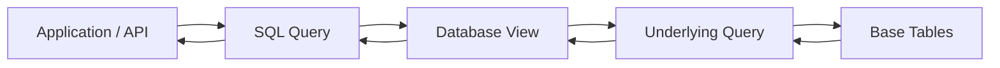
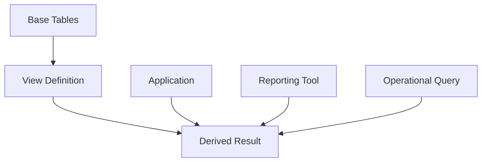
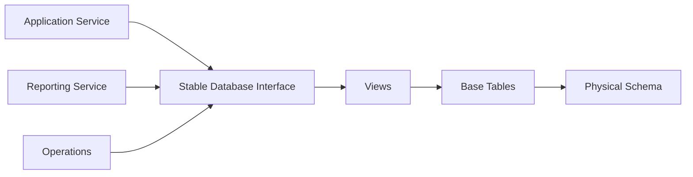
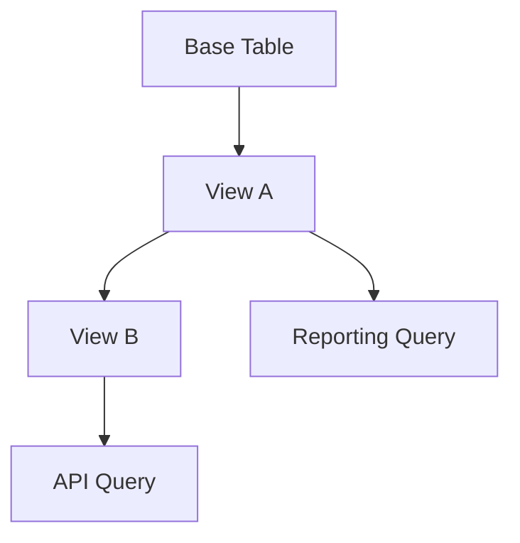

# 01- Views Introduction

## Overview

A **SQL view** is a named database object whose definition is a query. It presents the query result as a virtual table that applications can query using normal SQL.

Views are useful when a database needs to expose a stable relational interface over underlying tables without requiring every consumer to understand the underlying schema or repeat complex SQL.

A view does not normally store its result. In PostgreSQL, a regular view stores the query definition, and the underlying query is planned and executed when the view is referenced.



Views are particularly valuable at the boundary between database internals and application-facing data models:

- Hide implementation details of complex joins.
- Provide stable query interfaces.
- Centralize reusable SQL logic.
- Restrict which columns or rows consumers can access.
- Simplify reporting and operational queries.
- Provide compatibility layers during schema evolution.

A view should not automatically be treated as a performance optimization. A regular view primarily improves **abstraction, reuse, and governance**. Performance depends on the underlying query and execution plan.

## Basic Syntax

The general form is:

```sql
CREATE VIEW view_name AS
SELECT
    column_a,
    column_b
FROM table_name
WHERE condition;
```

For example:

```sql
CREATE VIEW active_customers AS
SELECT
    customer_id,
    name,
    email,
    created_at
FROM customers
WHERE status = 'active';
```

Applications can query it like a table:

```sql
SELECT
    customer_id,
    name,
    email
FROM active_customers
ORDER BY created_at DESC;
```

The view provides a named interface, while the actual data remains in `customers`.

## Why Views Exist

Without views, application code and reporting queries often repeat the same joins, filters, calculated columns, and business-specific projections.

For example:

```sql
SELECT
    o.order_id,
    o.created_at,
    c.customer_id,
    c.name AS customer_name,
    o.amount,
    o.status
FROM orders AS o
JOIN customers AS c
    ON c.customer_id = o.customer_id
WHERE o.status <> 'cancelled';
```

If multiple services and operational tools need this representation, each consumer may independently implement it.

A view can centralize that interface:

```sql
CREATE VIEW order_summary AS
SELECT
    o.order_id,
    o.created_at,
    c.customer_id,
    c.name AS customer_name,
    o.amount,
    o.status
FROM orders AS o
JOIN customers AS c
    ON c.customer_id = o.customer_id
WHERE o.status <> 'cancelled';
```

Consumers then query:

```sql
SELECT *
FROM order_summary
WHERE customer_id = :customer_id;
```

This reduces duplication and makes the database responsible for maintaining the relational definition.

## View Characteristics

| Property | Regular View |
|---|---|
| Stores query definition | Yes |
| Normally stores result rows | No |
| Automatically reflects base-table changes | Yes |
| Can contain joins | Yes |
| Can contain aggregations | Yes |
| Can contain window functions | Yes |
| Can be queried like a table | Yes |
| Can have indexes on the view itself | No |
| Can improve abstraction | Yes |
| Automatically improves performance | No |
| Can provide a security boundary | Yes, when permissions are designed correctly |

Exact behavior varies by database engine, especially around updatability, security semantics, materialization, and optimizer behavior.

## Views vs Tables

A table is primarily a persistent storage structure. A regular view is primarily a derived interface over other database objects.



### Table

```sql
CREATE TABLE customers (
    customer_id BIGINT PRIMARY KEY,
    name TEXT NOT NULL,
    email TEXT NOT NULL,
    status TEXT NOT NULL
);
```

The table owns persistent rows.

### View

```sql
CREATE VIEW active_customers AS
SELECT
    customer_id,
    name,
    email
FROM customers
WHERE status = 'active';
```

The view defines how rows should be exposed.

The important distinction is:

> **A table stores data; a regular view stores a query definition.**

## Views vs Materialized Views

A **materialized view** stores the result of a query rather than recalculating the complete result every time it is queried.

PostgreSQL supports both:

```sql
CREATE VIEW customer_order_summary AS
SELECT
    customer_id,
    COUNT(*) AS order_count,
    SUM(amount) AS total_amount
FROM orders
GROUP BY customer_id;
```

and:

```sql
CREATE MATERIALIZED VIEW customer_order_summary AS
SELECT
    customer_id,
    COUNT(*) AS order_count,
    SUM(amount) AS total_amount
FROM orders
GROUP BY customer_id;
```

The operational behavior is different.

| Concern | Regular View | Materialized View |
|---|---|---|
| Stores result | No | Yes |
| Query reflects current base data | Normally yes | Only after refresh |
| Query cost | Executes underlying query | Reads stored result |
| Refresh required | No | Yes |
| Indexes on result | No | Yes |
| Good for expensive repeated reads | Sometimes | Often |
| Suitable for real-time data | Often | Depends on refresh strategy |
| Storage required | Minimal | Yes |

Materialized views are covered separately from ordinary views because they introduce refresh, staleness, storage, indexing, and operational concerns.

## Simple Projection Views

One of the simplest use cases is exposing a controlled subset of columns.

```sql
CREATE VIEW customer_directory AS
SELECT
    customer_id,
    name,
    email
FROM customers;
```

This can hide internal columns such as:

```text
password_hash
internal_notes
billing_provider_customer_id
fraud_score
```

The view can therefore act as a stable projection.

This is useful when consumers should not depend directly on the complete physical table schema.

## Filtering Views

A view can expose a predefined subset of rows:

```sql
CREATE VIEW active_orders AS
SELECT
    order_id,
    customer_id,
    amount,
    created_at
FROM orders
WHERE status IN ('pending', 'processing', 'completed');
```

Consumers can then add additional predicates:

```sql
SELECT
    order_id,
    customer_id,
    amount
FROM active_orders
WHERE customer_id = :customer_id;
```

The view does not prevent consumers from further filtering the result.

## Join Views

Views are particularly useful for stable representations spanning multiple tables.

```sql
CREATE VIEW order_details AS
SELECT
    o.order_id,
    o.created_at,
    o.status,
    o.amount,
    c.customer_id,
    c.name AS customer_name,
    c.email AS customer_email
FROM orders AS o
JOIN customers AS c
    ON c.customer_id = o.customer_id;
```

This is useful when multiple consumers need the same relational representation.

Typical examples include:

- Order details.
- Subscription status.
- Customer account information.
- Product catalog projections.
- Operational dashboards.
- Audit records.

## Aggregation Views

Views can encapsulate reusable aggregation logic.

```sql
CREATE VIEW customer_order_metrics AS
SELECT
    customer_id,
    COUNT(*) AS order_count,
    SUM(amount) AS total_spend,
    AVG(amount) AS average_order_value
FROM orders
WHERE status = 'completed'
GROUP BY customer_id;
```

Consumers can then query:

```sql
SELECT
    customer_id,
    order_count,
    total_spend
FROM customer_order_metrics
WHERE total_spend >= 10000;
```

The view itself does not make the aggregation cheaper. It makes the definition reusable and centralized.

## Window Functions Inside Views

Views can contain window functions.

For example:

```sql
CREATE VIEW customer_order_history AS
SELECT
    order_id,
    customer_id,
    created_at,
    amount,
    LAG(amount) OVER (
        PARTITION BY customer_id
        ORDER BY created_at, order_id
    ) AS previous_order_amount
FROM orders;
```

Consumers can then use:

```sql
SELECT
    customer_id,
    order_id,
    amount,
    previous_order_amount
FROM customer_order_history
WHERE customer_id = :customer_id;
```

This can provide a useful abstraction when the row-level analytical definition is stable and reused.

However, hiding a complex window query inside a view does not remove its computational cost. Always inspect the resulting execution plan for production workloads.

## View Composition

A view can sometimes query another view:

```sql
CREATE VIEW active_customer_orders AS
SELECT
    o.order_id,
    o.customer_id,
    o.amount
FROM order_details AS o
JOIN active_customers AS c
    ON c.customer_id = o.customer_id;
```

This can improve logical organization, but excessive nesting can make the dependency graph difficult to understand.

Prefer a small number of meaningful, well-owned views rather than constructing a deeply layered hierarchy of views that nobody can easily trace.

## View Naming

View names should communicate that the object represents a logical data interface.

Examples:

```text
active_customers
order_details
customer_order_metrics
latest_subscription_status
```

Avoid ambiguous names such as:

```text
data
temp
query1
customer_data_final
```

Use a consistent naming convention across the database.

In larger systems, schemas can also provide ownership boundaries:

```text
app.customer_directory
reporting.customer_order_metrics
analytics.daily_revenue
```

The exact schema strategy depends on the organization's database architecture.

## Views as Database Interfaces

A mature database can use views as an abstraction boundary.



Consumers depend on the view's contract rather than directly depending on every underlying table.

This becomes valuable when the physical schema evolves.

For example, suppose:

```text
customer.first_name
customer.last_name
```

is eventually replaced by:

```text
customer.display_name
```

A compatibility view could preserve an existing consumer-facing representation while the underlying implementation changes.

The view is therefore similar to an API adapter at the database layer.

## Views and Schema Evolution

Views can reduce coupling between application code and physical schema, but they do not make schema changes automatically safe.

When changing a view:

1. Identify all dependent views, functions, applications, reports, and permissions.
2. Determine whether column names and types are part of an external contract.
3. Test dependent queries.
4. Deploy database changes in a compatible order.
5. Roll out application changes.
6. Remove compatibility layers only after consumers have migrated.

For production systems, treat widely consumed views as versioned interfaces even if the database itself does not enforce semantic versioning.

A safer pattern can be:

```text
customer_summary_v1
customer_summary_v2
```

during a migration when breaking changes are unavoidable.

## Views and Application Frameworks

Views work well with backend frameworks because most ORMs can query them similarly to tables.

For example, Django can represent a view as a model when the application only needs read access:

```python
class CustomerOrderMetrics(models.Model):
    customer_id = models.BigIntegerField(primary_key=True)
    order_count = models.IntegerField()
    total_spend = models.DecimalField(max_digits=18, decimal_places=2)

    class Meta:
        managed = False
        db_table = "customer_order_metrics"
```

The important detail is:

```python
managed = False
```

Django should not attempt to create or modify the view as though it were a normal application-managed table.

The database migration system should manage the view definition explicitly when appropriate.

## Views in REST APIs

A view can simplify a read-heavy API query.

```text
HTTP Request
     |
     v
Django / FastAPI
     |
     v
Repository / SQL Layer
     |
     v
Database View
     |
     v
Base Tables
```

For example, an API endpoint might need:

```text
GET /customers/{id}/order-summary
```

The application can query:

```sql
SELECT
    customer_id,
    order_count,
    total_spend,
    average_order_value
FROM customer_order_metrics
WHERE customer_id = :customer_id;
```

The application does not need to duplicate the aggregation logic.

This can reduce application complexity, especially for reporting-oriented read models.

## Security Considerations

Views can support database-level access control by exposing only the columns or rows a consumer should access.

For example:

```sql
CREATE VIEW support_customer_directory AS
SELECT
    customer_id,
    name,
    email,
    created_at
FROM customers;
```

A role can potentially be granted access to the view without receiving direct access to the base table.

```sql
REVOKE ALL ON customers FROM support_role;
GRANT SELECT ON support_customer_directory TO support_role;
```

The exact security behavior depends on database configuration and features such as ownership, privileges, row-level security, and security-barrier semantics.

### Important Security Rules

- Do not assume a view automatically provides security isolation.
- Review permissions on both the view and underlying objects.
- Avoid exposing sensitive columns through convenience views.
- Treat view definitions as security-sensitive code.
- Review dependencies when modifying a view.
- Test access using the actual application role.
- Use parameterized queries from application code; a view does not protect against SQL injection elsewhere in the application.

A view can be part of a security boundary, but it should not be the only security mechanism.

## Performance Considerations

A regular view does not inherently improve query performance.

Consider:

```sql
CREATE VIEW expensive_order_report AS
SELECT
    o.customer_id,
    COUNT(*) AS order_count,
    SUM(o.amount) AS total_amount
FROM orders AS o
JOIN customers AS c
    ON c.customer_id = o.customer_id
WHERE o.status = 'completed'
GROUP BY o.customer_id;
```

A query such as:

```sql
SELECT *
FROM expensive_order_report
WHERE customer_id = :customer_id;
```

must still be optimized and executed by the database.

Modern optimizers can often push predicates into the underlying query, but the exact behavior depends on the database engine and query structure.

For PostgreSQL, validate actual behavior:

```sql
EXPLAIN (ANALYZE, BUFFERS)
SELECT *
FROM expensive_order_report
WHERE customer_id = 42;
```

Look for:

- Unexpected full-table scans.
- Large sorts.
- Excessive joins.
- High buffer reads.
- Temporary disk usage.
- Poor cardinality estimates.
- Large execution times.

If the underlying query is expensive and frequently repeated, consider:

- Better indexes on base tables.
- Query redesign.
- Materialized views.
- Summary tables.
- Caching.
- Read replicas.
- Dedicated analytical infrastructure.

## Indexing a View

A normal PostgreSQL view cannot have indexes because it does not store rows.

Indexes belong on the underlying tables:

```sql
CREATE INDEX idx_orders_customer_status
ON orders (customer_id, status);
```

For a materialized view, indexes can be created directly on the materialized result:

```sql
CREATE INDEX idx_customer_order_metrics_customer
ON customer_order_metrics (customer_id);
```

This distinction is fundamental:

> **If the object does not physically store the result, there is normally nothing on which to build an index.**

## Updatable Views

Some simple views can be updated directly.

For example:

```sql
CREATE VIEW active_customers AS
SELECT
    customer_id,
    name,
    email,
    status
FROM customers
WHERE status = 'active';
```

Depending on the database and view definition, operations such as:

```sql
UPDATE active_customers
SET email = :email
WHERE customer_id = :customer_id;
```

may be possible.

Complex views involving:

- Aggregation.
- `GROUP BY`.
- `DISTINCT`.
- Certain joins.
- Set operations.
- Window functions.

are generally not directly updatable without additional database mechanisms.

### Production Recommendation

For backend systems, prefer explicitly controlled write operations against base tables or stored procedures unless there is a strong reason to make a view writable.

Read-only views are usually easier to reason about.

## View Dependencies

Views introduce dependencies that must be managed.



Changing the base table can affect multiple downstream objects.

Before changing a production schema, identify:

- Direct view dependencies.
- Nested view dependencies.
- Functions.
- Stored procedures.
- ORM models.
- Reports.
- BI tools.
- Scheduled jobs.
- API consumers.
- Permissions.

In PostgreSQL, catalog metadata and dependency information can be inspected when performing schema-impact analysis.

## Advantages

Views provide several engineering benefits.

| Advantage | Engineering value |
|---|---|
| Reusable SQL | Avoid repeated query definitions |
| Abstraction | Hide underlying schema complexity |
| Stable interface | Reduce coupling to physical tables |
| Centralized logic | Keep common relational rules in one place |
| Column projection | Expose only required fields |
| Security support | Can restrict access to exposed data |
| Read-model support | Simplify complex API/reporting queries |
| Schema compatibility | Can provide migration adapters |

## Limitations

Views also introduce costs.

| Limitation | Impact |
|---|---|
| No automatic performance improvement | Underlying query still costs resources |
| Dependency complexity | Schema changes require impact analysis |
| Hidden complexity | Consumers may not realize query cost |
| Limited indexing | Normal views cannot be directly indexed |
| Database coupling | Application depends on database-specific behavior |
| Debugging complexity | Nested views can make execution plans harder to understand |
| Contract risk | Changing columns can break consumers |

The most important limitation is that a view can make an expensive query **look cheap** from the application layer.

## Common Mistakes

### Treating a View as Cached Data

A regular view is not a cache.

Bad assumption:

```text
CREATE VIEW -> query runs once -> result is stored
```

The normal model is:

```text
Query View
    |
    v
Execute Underlying Query
    |
    v
Return Result
```

If persistent results are required, evaluate a materialized view or another caching/precomputation strategy.

### Hiding Expensive Queries Behind Simple Names

This query looks simple:

```sql
SELECT *
FROM customer_dashboard;
```

But `customer_dashboard` might contain:

- Multiple joins.
- Aggregations.
- Window functions.
- Large scans.
- Complex expressions.

Always understand what the view actually does before using it in latency-sensitive paths.

### Using SELECT *

Avoid:

```sql
CREATE VIEW customer_summary AS
SELECT *
FROM customers;
```

Explicit columns make the view contract clearer and reduce accidental exposure of newly added columns.

Prefer:

```sql
CREATE VIEW customer_summary AS
SELECT
    customer_id,
    name,
    email,
    created_at
FROM customers;
```

### Making Views Too Deep

A chain such as:

```text
View A
  -> View B
      -> View C
          -> View D
              -> Tables
```

can become difficult to maintain and troubleshoot.

Prefer meaningful boundaries and keep complex SQL understandable.

### Assuming Views Solve Security Automatically

A view containing safe-looking columns does not automatically mean the underlying data is inaccessible.

Validate:

- Role privileges.
- Ownership behavior.
- Base-table permissions.
- Row-level security.
- Application database roles.
- Security-sensitive expressions.

### Ignoring Deterministic Ordering

A view that exposes a query with `ORDER BY` should not be treated as guaranteeing ordering for every outer query.

Consumers that require deterministic ordering should specify it:

```sql
SELECT
    order_id,
    created_at
FROM recent_orders
ORDER BY created_at DESC, order_id DESC;
```

Do not rely on implicit ordering.

## Production Best Practices

### Keep Views Purpose-Specific

Good:

```text
active_customers
customer_order_metrics
order_details
```

Less useful:

```text
everything_for_customer
```

A view should represent a coherent data contract.

### Keep Column Contracts Explicit

Prefer:

```sql
CREATE VIEW customer_profile AS
SELECT
    customer_id,
    name,
    email
FROM customers;
```

over:

```sql
CREATE VIEW customer_profile AS
SELECT *
FROM customers;
```

### Document Ownership

For production databases, establish:

- View owner.
- Owning team.
- Intended consumers.
- Data classification.
- Expected query patterns.
- Change procedure.

### Test Views as Database Code

Views should be tested just like application SQL.

Test:

- Correct row filtering.
- Correct joins.
- Null behavior.
- Aggregation behavior.
- Duplicate handling.
- Permission behavior.
- Schema migrations.
- Performance under realistic data.

### Review Execution Plans

For important views:

```sql
EXPLAIN (ANALYZE, BUFFERS)
SELECT *
FROM customer_order_metrics
WHERE customer_id = 12345;
```

Do not assume the view abstraction changes the underlying execution cost.

### Treat Widely Used Views as Contracts

If many services depend on a view, changing its:

- Column names.
- Data types.
- Nullability.
- Semantics.
- Filtering rules.

can be equivalent to changing a public API.

Use compatibility strategies when necessary.

## Operational Considerations

Views generally require little operational maintenance because a regular view does not store data.

However, production operations should still account for:

- Dependency tracking.
- Migration ordering.
- Permission changes.
- Query performance.
- Schema compatibility.
- Monitoring of queries that consume expensive views.
- Ownership and documentation.

For heavily used views, monitor the queries against the underlying tables rather than treating the view itself as a performance boundary.

A view can also make database observability more important because application code may issue a simple query against a view that expands into substantial relational work.

## When to Use Views

Views are a strong fit when:

- Multiple consumers need the same relational projection.
- A complex join should have a stable interface.
- A reporting query is reused frequently.
- Applications should not depend directly on internal table structure.
- Certain columns should be excluded from a consumer-facing interface.
- Database-level read models simplify application code.
- A schema migration needs a compatibility layer.

## When Not to Use Views

Avoid introducing a view when:

- The query is used exactly once and is already simple.
- It hides significant complexity from developers who need to understand performance.
- It creates a deeply nested dependency chain.
- The application requires database portability and the view uses database-specific behavior.
- A materialized result is actually required.
- The query belongs in a dedicated analytical system.
- A normal table or summary table is a clearer explicit data model.

The question should not be:

> "Can this query be a view?"

It should be:

> **"Does this query represent a reusable, stable database-level interface?"**

## Interview Traps

### "A View Stores Data"

Not normally. A regular view stores the query definition. A materialized view stores query results.

### "Views Improve Performance"

Not inherently. A view primarily provides abstraction and reuse. Performance depends on the resulting query plan.

### "Views and Tables Are the Same"

They can often be queried similarly, but their storage and operational semantics are different.

### "A View Is Always Read-Only"

Not necessarily. Some simple views can be updatable depending on the database engine and definition.

### "You Can Index a Normal View"

Generally no. Index the underlying tables, or use a materialized view when physically stored results are appropriate.

### "A View Guarantees Row Ordering"

No. Consumers should specify `ORDER BY` whenever ordering is part of the contract.

## Key Takeaways

- **A regular view is a named query interface, not a cached copy of the underlying data.**
- **Use views to centralize reusable relational logic, simplify read models, control exposed columns, and reduce coupling to physical schemas.**
- **Views do not automatically improve performance; validate the expanded query with realistic data and execution plans.**
- **Treat heavily consumed views as database-level contracts with explicit columns, ownership, permissions, dependency management, and migration discipline.**
- **Use materialized views, summary tables, caching, or analytical infrastructure when the real requirement is persistent or repeatedly computed results rather than query abstraction.**