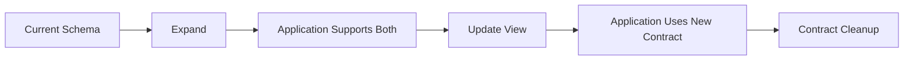
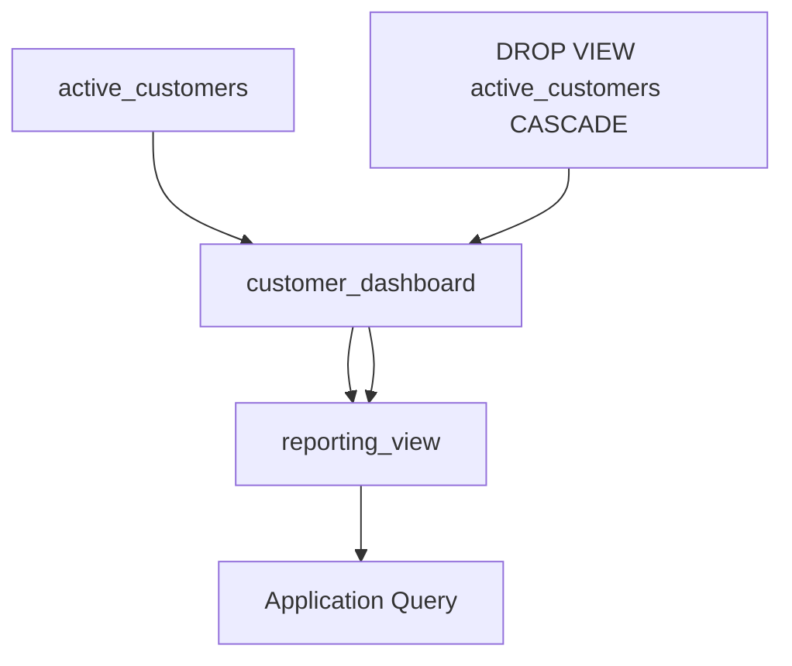
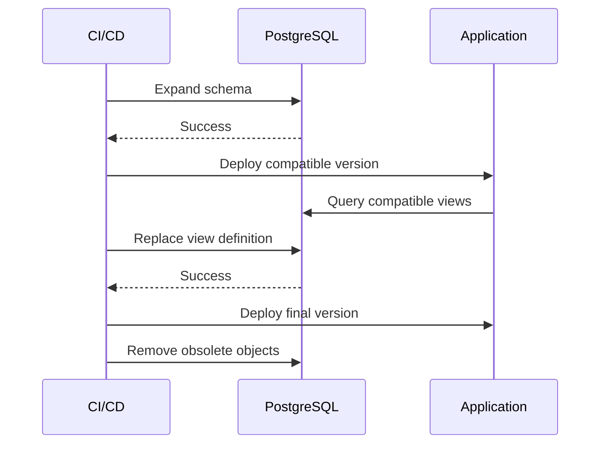

# 02- Creating and Dropping Views

## Overview

Creating and dropping views is straightforward SQL syntax, but production use requires more discipline than the syntax suggests. A view is a named query interface over underlying database objects, so creating or removing one can affect application code, reporting systems, permissions, dependent views, and deployment workflows.

This document focuses on the operational lifecycle of regular SQL views:

- Creating views with `CREATE VIEW`.
- Replacing definitions safely.
- Controlling column names.
- Creating views conditionally.
- Inspecting existing views.
- Dropping views safely.
- Handling dependencies.
- Managing views through migrations and CI/CD.
- Avoiding production deployment failures.

Examples use PostgreSQL syntax where behavior is database-specific.

## Creating a View

The basic syntax is:

```sql
CREATE VIEW view_name AS
SELECT
    column_a,
    column_b
FROM table_name
WHERE condition;
```

For example:

```sql
CREATE VIEW active_customers AS
SELECT
    customer_id,
    name,
    email,
    created_at
FROM customers
WHERE status = 'active';
```

The database stores the view definition. A normal view does not normally materialize and store the result rows.

Consumers can query it like a relation:

```sql
SELECT
    customer_id,
    name,
    email
FROM active_customers
WHERE created_at >= CURRENT_DATE - INTERVAL '30 days';
```

The application does not need to repeat the underlying filtering logic.

## Why Explicit Column Lists Matter

Prefer explicit columns:

```sql
CREATE VIEW customer_directory AS
SELECT
    customer_id,
    name,
    email
FROM customers;
```

Avoid:

```sql
CREATE VIEW customer_directory AS
SELECT *
FROM customers;
```

Explicit projections provide a more stable contract.

They prevent newly added base-table columns from unexpectedly becoming part of the view and make code review easier because changes to the exposed schema are visible.

This is particularly important when a view is consumed by:

- Django models.
- FastAPI repositories.
- BI dashboards.
- Reporting jobs.
- Other views.
- Microservices.
- External database users.

## Naming View Columns

PostgreSQL allows explicit column names to be declared on the view:

```sql
CREATE VIEW customer_contact (
    customer_id,
    customer_name,
    contact_email
) AS
SELECT
    id,
    name,
    email
FROM customers;
```

This can be useful when the underlying expressions or source column names do not provide an appropriate consumer-facing name.

Alternatively, aliases can be defined directly in the query:

```sql
CREATE VIEW customer_contact AS
SELECT
    id AS customer_id,
    name AS customer_name,
    email AS contact_email
FROM customers;
```

For most application-facing views, aliases in the `SELECT` list are easier to read and maintain.

## Creating Views with Joins

Views commonly encapsulate joins that multiple consumers need.

```sql
CREATE VIEW order_details AS
SELECT
    o.order_id,
    o.created_at,
    o.status,
    o.amount,
    c.customer_id,
    c.name AS customer_name,
    c.email AS customer_email
FROM orders AS o
JOIN customers AS c
    ON c.customer_id = o.customer_id;
```

Consumers can then use:

```sql
SELECT
    order_id,
    customer_name,
    amount
FROM order_details
WHERE status = 'completed';
```

The join remains centralized in the view definition.

## Creating Views with Aggregations

Views can encapsulate reusable aggregation logic.

```sql
CREATE VIEW customer_order_metrics AS
SELECT
    customer_id,
    COUNT(*) AS order_count,
    SUM(amount) AS total_spend,
    AVG(amount) AS average_order_value
FROM orders
WHERE status = 'completed'
GROUP BY customer_id;
```

The view can then be queried:

```sql
SELECT
    customer_id,
    order_count,
    total_spend
FROM customer_order_metrics
WHERE total_spend >= 10000;
```

The aggregation is still executed according to the resulting query plan. Creating the view does not inherently cache or precompute the result.

## Creating Views with Window Functions

Window functions can be part of a view definition.

```sql
CREATE VIEW customer_order_history AS
SELECT
    order_id,
    customer_id,
    created_at,
    amount,
    LAG(amount) OVER (
        PARTITION BY customer_id
        ORDER BY created_at, order_id
    ) AS previous_order_amount
FROM orders;
```

The view provides a reusable row-level analytical interface.

This is useful when multiple consumers require the same definition of concepts such as:

- Previous order.
- Next event.
- Customer ranking.
- Running total.
- Per-customer sequence number.

However, the computational cost of the window function remains part of the query execution.

## CREATE OR REPLACE VIEW

When changing an existing PostgreSQL view, use:

```sql
CREATE OR REPLACE VIEW view_name AS
SELECT ...;
```

Example:

```sql
CREATE OR REPLACE VIEW active_customers AS
SELECT
    customer_id,
    name,
    email,
    created_at,
    status
FROM customers
WHERE status = 'active';
```

This is preferable to dropping and recreating the view when the change is compatible with the existing view contract.

### Why It Matters

Dropping a view first can:

- Break dependent objects.
- Create a period where the view does not exist.
- Require additional permission recreation.
- Increase migration risk.
- Complicate zero-downtime deployments.

`CREATE OR REPLACE VIEW` changes the definition while preserving the view object itself.

### Column Compatibility

`CREATE OR REPLACE VIEW` is not a general-purpose mechanism for arbitrary schema changes.

In PostgreSQL, existing view columns have compatibility requirements. For example, replacing a view generally cannot simply remove an existing column or change its type arbitrarily.

For breaking changes, use a deliberate migration strategy instead of forcing a replacement.

## Adding Columns to an Existing View

When evolving a view, adding columns at the end is generally safer than changing existing columns.

Existing:

```sql
CREATE VIEW customer_summary AS
SELECT
    customer_id,
    name,
    email
FROM customers;
```

Compatible evolution:

```sql
CREATE OR REPLACE VIEW customer_summary AS
SELECT
    customer_id,
    name,
    email,
    created_at
FROM customers;
```

Before doing this, verify how consumers bind columns.

Consumers using explicit column names are generally safer than code relying on positional assumptions or `SELECT *`.

## Replacing a View During Schema Migration

A typical compatible migration can look like:

```sql
BEGIN;

ALTER TABLE customers
ADD COLUMN display_name TEXT;

CREATE OR REPLACE VIEW customer_directory AS
SELECT
    customer_id,
    display_name,
    email
FROM customers;

COMMIT;
```

The exact migration strategy depends on application compatibility requirements.

For zero-downtime deployments, prefer an expand-and-contract approach:



Avoid making a database change that immediately invalidates an older application version when rolling deployments are possible.

## CREATE OR REPLACE vs DROP + CREATE

| Operation | Recommended use | Main risk |
|---|---|---|
| `CREATE VIEW` | New view | Fails if object already exists |
| `CREATE OR REPLACE VIEW` | Compatible definition change | Cannot perform every breaking schema change |
| `DROP VIEW` + `CREATE VIEW` | Intentional replacement requiring recreation | Dependency and availability risk |
| `DROP VIEW IF EXISTS` + `CREATE VIEW` | Disposable/non-production setup | Can silently destroy a dependency |

For production migrations, prefer `CREATE OR REPLACE VIEW` when the change is contract-compatible.

## Conditional Creation

PostgreSQL supports:

```sql
CREATE VIEW IF NOT EXISTS active_customers AS
SELECT
    customer_id,
    name
FROM customers
WHERE status = 'active';
```

This prevents an error when the named object already exists.

However, `IF NOT EXISTS` should not be confused with synchronization.

If the view already exists with the wrong definition, this statement does not update it.

For migrations where the definition must be correct, prefer an explicit migration using `CREATE OR REPLACE VIEW` or a controlled drop/recreate strategy.

## Inspecting Existing Views

Before modifying a production view, inspect its definition and dependencies.

In PostgreSQL, `psql` provides useful metadata commands:

```text
\d+ active_customers
```

You can also inspect the view definition using:

```sql
SELECT pg_get_viewdef(
    'active_customers'::regclass,
    true
);
```

For multiple views:

```sql
SELECT
    schemaname,
    viewname,
    definition
FROM pg_views
WHERE schemaname NOT IN ('pg_catalog', 'information_schema')
ORDER BY schemaname, viewname;
```

For application environments, catalog inspection is useful during:

- Migration development.
- Incident investigation.
- Schema audits.
- Dependency analysis.
- Production debugging.

## Schema Qualification

Prefer schema-qualified object names in production database code.

Instead of:

```sql
CREATE VIEW active_customers AS
SELECT
    customer_id,
    name
FROM customers;
```

prefer:

```sql
CREATE VIEW reporting.active_customers AS
SELECT
    customer_id,
    name
FROM app.customers
WHERE status = 'active';
```

This makes object ownership and dependencies explicit.

It also reduces ambiguity caused by `search_path`.

### Production Benefits

Schema qualification helps with:

- Migration predictability.
- Security reviews.
- Multi-schema databases.
- Object ownership.
- Troubleshooting.
- Avoiding accidental references to objects in another schema.

## Dropping a View

The basic syntax is:

```sql
DROP VIEW view_name;
```

Example:

```sql
DROP VIEW active_customers;
```

After this statement succeeds, the view no longer exists.

Any application or query that depends directly on the view will fail until the dependency is updated.

## DROP VIEW IF EXISTS

For idempotent teardown operations:

```sql
DROP VIEW IF EXISTS active_customers;
```

If the view does not exist, PostgreSQL does not raise an error for the missing view.

This is useful in:

- Development scripts.
- Test database setup.
- Cleanup migrations.
- Reversible deployment operations.

However, `IF EXISTS` can hide unexpected schema state.

In production migrations, a silently missing object may indicate that an earlier migration was not applied correctly. Use it deliberately rather than mechanically.

## Dropping Multiple Views

Multiple views can be removed in one statement:

```sql
DROP VIEW
    active_customers,
    customer_order_metrics;
```

When using multiple objects, verify dependency relationships first.

The order can matter when one view depends on another.

## DROP VIEW CASCADE

PostgreSQL supports:

```sql
DROP VIEW active_customers CASCADE;
```

`CASCADE` removes dependent objects that rely on the view.

This is powerful and dangerous.

Consider:



Dropping the root view with `CASCADE` can remove more objects than the command itself visually suggests.

### Production Rule

Avoid `CASCADE` in production migrations unless the complete dependency impact is known and intentional.

Prefer:

```sql
DROP VIEW active_customers;
```

If PostgreSQL reports dependencies, investigate them rather than immediately switching to `CASCADE`.

## DROP VIEW RESTRICT

`RESTRICT` is the default behavior when dependencies exist.

```sql
DROP VIEW active_customers RESTRICT;
```

The operation fails if dependent objects require the view.

This is generally safer for production schema changes because dependency violations become explicit rather than causing cascading deletion.

| Option | Behavior | Production posture |
|---|---|---|
| `RESTRICT` | Refuses drop when dependencies exist | Preferred default |
| `CASCADE` | Drops dependent objects automatically | Use only intentionally |

## Dependency Management

Views form dependency graphs.

For example:

```text
customers
    |
    v
customer_directory
    |
    v
customer_dashboard
    |
    v
reporting_api
```

Dropping `customer_directory` can therefore affect objects that are not immediately visible from the view's name.

Before a production change, identify:

- Views depending on the target view.
- Functions depending on the view.
- Materialized views.
- Application queries.
- ORM models.
- Reports and BI tools.
- Permissions.
- Scheduled jobs.
- ETL processes.

Database catalog metadata should be part of schema-change investigation.

## Dependency-Aware Deployment

A safe deployment should preserve a valid dependency graph at each migration stage.

For example, if:

```text
View B -> View A
```

then dropping `View A` before migrating `View B` can break the deployment.

A safer sequence is:



The exact sequence depends on whether the application and database are deployed atomically or independently.

## Views and Transactions

PostgreSQL supports transactional DDL for many schema operations, including view creation and dropping.

A migration can therefore use:

```sql
BEGIN;

CREATE OR REPLACE VIEW reporting.active_customers AS
SELECT
    customer_id,
    name,
    email
FROM app.customers
WHERE status = 'active';

COMMIT;
```

If an error occurs before the commit, the transaction can be rolled back.

This is valuable because a failed migration should not leave the database with half-applied view changes when the operations are transactional.

Always verify the transactional behavior of the target database and migration framework because DDL transaction semantics differ across database engines.

## Views in Application Migrations

For Django projects, views are usually not represented as normal managed Django models.

A migration can execute SQL explicitly:

```python
from django.db import migrations


CREATE_VIEW = """
CREATE VIEW customer_order_metrics AS
SELECT
    customer_id,
    COUNT(*) AS order_count,
    SUM(amount) AS total_spend
FROM orders
WHERE status = 'completed'
GROUP BY customer_id;
"""


DROP_VIEW = """
DROP VIEW IF EXISTS customer_order_metrics;
"""


class Migration(migrations.Migration):
    dependencies = [
        ("orders", "0012_previous_migration"),
    ]

    operations = [
        migrations.RunSQL(
            sql=CREATE_VIEW,
            reverse_sql=DROP_VIEW,
        ),
    ]
```

For production Django systems:

- Keep view definitions in version control.
- Make migrations reversible when practical.
- Declare correct migration dependencies.
- Test migrations against a realistic PostgreSQL instance.
- Avoid relying on manually created production views.

## Views and CI/CD

Treat database views as deployable code.

A production pipeline can validate:

```text
Git Commit
   |
   v
SQL / Migration Tests
   |
   v
Dependency Validation
   |
   v
Staging Database
   |
   v
Migration Verification
   |
   v
Production Deployment
```

Useful checks include:

- SQL syntax validation.
- Migration ordering.
- View creation from a clean database.
- Upgrade from the previous schema version.
- Rollback testing where supported.
- Permission validation.
- Query regression testing.
- Dependency validation.

A migration that creates a view successfully on an empty database but fails during an upgrade is not production-ready.

## Versioning View Definitions

A view definition should live in source control.

For example:

```text
migrations/
    001_create_customer_views.sql
    002_update_customer_directory.sql
    003_add_order_metrics_view.sql
```

Do not rely on an engineer manually editing a production view and later attempting to reproduce it in code.

Source-controlled database definitions provide:

- Auditability.
- Reproducibility.
- Code review.
- Environment consistency.
- Rollback visibility.
- Deployment traceability.

## Breaking View Changes

Some changes are inherently breaking.

Examples:

```text
Remove an existing column
Rename a column
Change a column's data type
Change semantic meaning
Change filtering rules unexpectedly
```

Suppose an existing view exposes:

```sql
customer_id
name
email
```

Changing:

```text
email
```

to:

```text
primary_email
```

can break consumers even if the underlying data is unchanged.

For heavily consumed views, consider an expand-and-contract migration:

1. Add the new representation.
2. Deploy consumers that understand both versions.
3. Migrate consumers to the new contract.
4. Remove the old representation after verification.

For larger breaking changes, versioned views can be clearer:

```text
customer_directory_v1
customer_directory_v2
```

## Security When Creating Views

Creating a view is also a privilege operation.

A view may expose data from tables containing:

- Personally identifiable information.
- Financial information.
- Internal identifiers.
- Security metadata.
- Operational secrets.

Use explicit projections:

```sql
CREATE VIEW support.customer_directory AS
SELECT
    customer_id,
    name,
    email
FROM app.customers;
```

Do not expose sensitive fields simply because they are available in the base table.

Review:

- View owner.
- View privileges.
- Base-table privileges.
- Row-level security.
- Security-sensitive functions.
- Application database roles.

Test the resulting permissions using the same role that the application or service uses.

## Performance After Creating a View

Creating a view is usually cheap because a regular view does not materialize its result.

The expensive operation happens when consumers query it.

After creating an important view, inspect representative queries:

```sql
EXPLAIN (ANALYZE, BUFFERS)
SELECT
    customer_id,
    order_count,
    total_spend
FROM reporting.customer_order_metrics
WHERE customer_id = 12345;
```

Validate with production-like data volumes.

Pay particular attention to:

- Large sequential scans.
- Expensive joins.
- Sort operations.
- Window functions.
- Aggregations.
- Poor cardinality estimates.
- Excessive memory or temporary disk usage.

If the view is queried frequently and the underlying computation is expensive, consider whether a materialized view, summary table, or another read-model architecture is more appropriate.

## Common Production Mistakes

### Dropping Before Replacing

Risky migration:

```sql
DROP VIEW customer_summary;

CREATE VIEW customer_summary AS
SELECT ...;
```

This introduces an unnecessary gap and can break dependencies.

Prefer:

```sql
CREATE OR REPLACE VIEW customer_summary AS
SELECT ...;
```

when the change is compatible.

### Using CASCADE Without Dependency Analysis

Risky:

```sql
DROP VIEW customer_summary CASCADE;
```

The command can remove dependent objects.

Prefer `RESTRICT` behavior unless cascading removal is explicitly part of the migration.

### Using SELECT *

Risky:

```sql
CREATE VIEW customer_summary AS
SELECT *
FROM customers;
```

New base-table columns can unexpectedly become part of the view.

Use an explicit projection.

### Manually Changing Production Views

A developer may run:

```sql
CREATE OR REPLACE VIEW ...
```

directly against production.

The immediate change may work, but now production differs from source control.

Always make durable schema changes through the migration/deployment process.

### Assuming IF NOT EXISTS Updates the Definition

This:

```sql
CREATE VIEW IF NOT EXISTS customer_summary AS
SELECT ...;
```

does not replace an existing view.

If the object exists with an old definition, the old definition remains.

### Ignoring Existing Consumers

A view can be used by:

- Django models.
- FastAPI repositories.
- Celery jobs.
- Reporting systems.
- BI tools.
- Other views.

Changing it without consumer analysis can cause failures outside the service currently being deployed.

### Testing Only on an Empty Database

A migration can work on a fresh database but fail on an existing production-like schema because of:

- Existing dependencies.
- Existing permissions.
- Older view definitions.
- Data-dependent query behavior.
- Different migration history.

Test both fresh installation and upgrade paths.

## Production Checklist

### Before Creating a View

- [ ] Define the purpose and ownership.
- [ ] Use explicit columns.
- [ ] Qualify schemas where appropriate.
- [ ] Review sensitive fields.
- [ ] Identify expected consumers.
- [ ] Test the underlying query independently.
- [ ] Inspect representative execution plans.
- [ ] Add the definition to source control.

### Before Replacing a View

- [ ] Compare old and new column contracts.
- [ ] Identify dependent views and objects.
- [ ] Check application consumers.
- [ ] Determine whether the change is backward-compatible.
- [ ] Test the migration on an existing schema.
- [ ] Verify permissions remain correct.
- [ ] Validate representative query performance.

### Before Dropping a View

- [ ] Confirm the view is no longer required.
- [ ] Identify dependencies.
- [ ] Search application and reporting code.
- [ ] Remove or migrate consumers first.
- [ ] Prefer `RESTRICT` unless cascading is intentional.
- [ ] Test the complete migration sequence.
- [ ] Confirm rollback or recovery procedures.

## Command Reference

| Operation | PostgreSQL syntax | Primary use |
|---|---|---|
| Create | `CREATE VIEW name AS ...` | Create a new view |
| Create conditionally | `CREATE VIEW IF NOT EXISTS ...` | Avoid missing-object error |
| Replace | `CREATE OR REPLACE VIEW ...` | Compatible definition change |
| Drop | `DROP VIEW name` | Remove a view |
| Conditional drop | `DROP VIEW IF EXISTS name` | Idempotent cleanup |
| Drop with dependency failure | `DROP VIEW name RESTRICT` | Prevent dependent-object deletion |
| Cascading drop | `DROP VIEW name CASCADE` | Intentionally remove dependencies |
| Inspect in `psql` | `\d+ name` | Inspect database object |
| Get definition | `pg_get_viewdef(...)` | Retrieve SQL definition |

## Interview Traps

### Does `CREATE VIEW` Store the Result?

No. A regular view stores a query definition. The underlying query normally executes when the view is queried.

### Should You Always Drop and Recreate a View?

No. `CREATE OR REPLACE VIEW` is preferable for compatible definition changes.

### Does `IF NOT EXISTS` Synchronize an Existing View?

No. It prevents an error when the object exists; it does not replace the existing definition.

### What Does `CASCADE` Do?

It allows PostgreSQL to remove dependent objects when dropping the target object. This can have a much larger impact than deleting the named view alone.

### Is Dropping a View Always Safe If the Application Does Not Use It?

Not necessarily. Other views, reports, jobs, database functions, or external consumers may depend on it.

### Should View Definitions Be Manually Changed in Production?

Generally no. Treat view definitions as version-controlled database code and deploy them through the same controlled migration process as other schema changes.

## Key Takeaways

- **Use `CREATE OR REPLACE VIEW` for compatible definition changes instead of unnecessary drop-and-recreate operations.**
- **Treat view creation and modification as schema changes with dependency, security, compatibility, and performance implications.**
- **Use explicit columns, schema qualification, source-controlled migrations, and realistic upgrade testing for production views.**
- **Prefer dependency-safe drops and avoid `CASCADE` unless every affected dependent object has been identified and the deletion is intentional.**
- **`IF NOT EXISTS` and `IF EXISTS` provide idempotency but do not synchronize an existing view with the desired definition.**