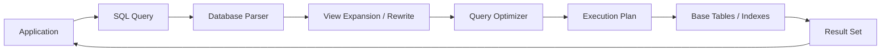
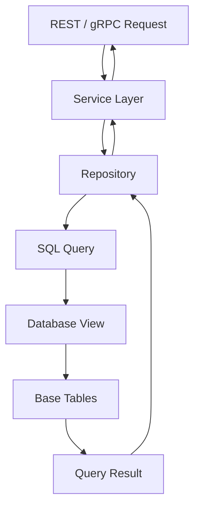

# 03- How Views Work

## Overview

A SQL view is a named database object whose definition is a query. It provides a relational interface over one or more underlying tables, views, or other queryable objects without normally storing the query result as persistent rows.

The important production distinction is that a regular view is primarily an **abstraction and access boundary**, not a cache. Querying a view causes the database optimizer to incorporate the view definition into the surrounding statement and produce an execution plan for the resulting query.

For backend systems, views are useful when multiple consumers need the same relational logic:

- Joining normalized tables into an application-facing shape.
- Hiding implementation details of a schema.
- Centralizing filtering or business-oriented projections.
- Encapsulating aggregations.
- Exposing analytical calculations such as window functions.
- Providing controlled read access to selected columns.

Understanding how views work internally is more important than memorizing `CREATE VIEW`. A view can simplify application code while still introducing dependency, performance, security, and deployment considerations.

## View Definition vs View Data

Consider:

```sql
CREATE VIEW active_customers AS
SELECT
    customer_id,
    name,
    email
FROM customers
WHERE status = 'active';
```

The database stores the **definition** of the view. A regular view does not normally store a second copy of the resulting customer rows.

Conceptually:

```text
customers
    |
    | view definition
    v
active_customers
    |
    | query
    v
Result Set
```

If the base table changes:

```sql
UPDATE customers
SET status = 'inactive'
WHERE customer_id = 42;
```

a subsequent query against the view reflects the new state:

```sql
SELECT *
FROM active_customers
WHERE customer_id = 42;
```

The row is no longer returned because the view evaluates against the current underlying data.

This differs fundamentally from a materialized view or application cache.

| Object | Stores result data? | Automatically reflects base-table changes? | Typical purpose |
|---|---:|---:|---|
| Regular view | No | Yes | Query abstraction |
| Materialized view | Yes | No, until refreshed | Precomputed reads |
| Table | Yes | Only through writes | Persistent data |
| Redis cache | Yes | No | Low-latency application reads |

## How a View Is Stored

When a view is created, the database records metadata describing the object and its query definition.

In PostgreSQL, view definitions can be inspected with:

```sql
SELECT pg_get_viewdef(
    'active_customers'::regclass,
    true
);
```

You can also inspect views through PostgreSQL's catalog-backed information:

```sql
SELECT
    schemaname,
    viewname,
    definition
FROM pg_views
WHERE schemaname = 'public';
```

The exact internal representation differs between database engines, but the architectural principle is consistent:

> A regular view stores query metadata rather than a separately maintained copy of the query result.

This is why creating a large view is generally inexpensive compared with populating a large table or materialized view.

## What Happens When a View Is Queried

Suppose the application executes:

```sql
SELECT
    customer_id,
    name
FROM active_customers
WHERE customer_id = 100;
```

where the view is:

```sql
CREATE VIEW active_customers AS
SELECT
    customer_id,
    name,
    email
FROM customers
WHERE status = 'active';
```

Conceptually, the database has to reason about both the outer query and the view definition:

```sql
SELECT
    customer_id,
    name
FROM customers
WHERE status = 'active'
  AND customer_id = 100;
```

The actual optimizer and rewrite behavior is database-specific, but this mental model is useful for understanding why a normal view does not inherently introduce an additional storage layer.



The optimizer can often push predicates, eliminate unnecessary columns, choose indexes, reorder joins, and otherwise optimize the resulting query.

A view therefore does **not** automatically mean:

```text
Application
   |
   v
View query executes fully
   |
   v
Outer query executes afterward
```

That would be an overly simplistic model.

## Query Composition

One of the main strengths of views is that they can be composed with other SQL operations.

Given:

```sql
CREATE VIEW customer_orders AS
SELECT
    o.order_id,
    o.customer_id,
    o.created_at,
    o.amount
FROM orders AS o
WHERE o.status = 'completed';
```

a consumer can write:

```sql
SELECT
    customer_id,
    COUNT(*) AS order_count,
    SUM(amount) AS total_spend
FROM customer_orders
WHERE created_at >= CURRENT_DATE - INTERVAL '30 days'
GROUP BY customer_id;
```

The view provides a reusable query boundary while the caller supplies additional filtering and aggregation.

This is particularly useful when the same base logic appears across multiple backend endpoints or reporting queries.

## View Expansion and Optimization

A regular view should not be treated as a black box from a performance perspective.

For example:

```sql
CREATE VIEW customer_orders AS
SELECT
    o.order_id,
    o.customer_id,
    o.created_at,
    o.amount
FROM orders AS o
JOIN customers AS c
    ON c.customer_id = o.customer_id
WHERE c.status = 'active';
```

A query such as:

```sql
SELECT
    order_id,
    amount
FROM customer_orders
WHERE customer_id = 123;
```

can often be optimized as a combined operation over the underlying relations.

Use `EXPLAIN` to understand what the database actually does:

```sql
EXPLAIN (ANALYZE, BUFFERS)
SELECT
    order_id,
    amount
FROM customer_orders
WHERE customer_id = 123;
```

Do not assume that a view is either "fast" or "slow" simply because it is a view. Performance depends on:

- Underlying tables.
- Indexes.
- Join conditions.
- Cardinality.
- Filters.
- Aggregations.
- Window functions.
- Sort operations.
- Statistics.
- Database engine and optimizer behavior.
- The outer query consuming the view.

## Views with Filters

A common view pattern is centralizing a stable predicate:

```sql
CREATE VIEW active_orders AS
SELECT
    order_id,
    customer_id,
    created_at,
    amount
FROM orders
WHERE status = 'completed';
```

A consumer can add additional conditions:

```sql
SELECT
    order_id,
    customer_id,
    amount
FROM active_orders
WHERE created_at >= CURRENT_DATE - INTERVAL '7 days';
```

The database can generally optimize the combined conditions rather than treating the view as a physically stored intermediate table.

### Production Consideration

Do not put every business rule into a view merely because views support filtering.

A view is a good fit for **stable relational semantics**. Highly dynamic application behavior, authorization rules that depend on request context, or complex business workflows may belong elsewhere.

## Views with Joins

Views can hide normalized database structure from consumers.

```sql
CREATE VIEW order_details AS
SELECT
    o.order_id,
    o.created_at,
    o.amount,
    c.customer_id,
    c.name AS customer_name,
    c.email AS customer_email
FROM orders AS o
JOIN customers AS c
    ON c.customer_id = o.customer_id;
```

Instead of repeating the join:

```sql
SELECT
    order_id,
    customer_name,
    amount
FROM order_details
WHERE order_id = 5001;
```

The consumer interacts with a simpler relational interface.

This is useful when the underlying schema is optimized for normalization but consumers need a more convenient read model.

## Views with Aggregations

Views can expose reusable aggregate logic:

```sql
CREATE VIEW customer_sales AS
SELECT
    customer_id,
    COUNT(*) AS order_count,
    SUM(amount) AS total_sales
FROM orders
WHERE status = 'completed'
GROUP BY customer_id;
```

The following query adds another operation:

```sql
SELECT
    customer_id,
    order_count,
    total_sales
FROM customer_sales
WHERE total_sales >= 10000;
```

A regular view does not mean that `customer_sales` has a precomputed `total_sales` value stored somewhere.

For frequently executed expensive aggregations, evaluate whether a materialized view, summary table, or dedicated read model is more appropriate.

## Views with Window Functions

Views can encapsulate window-function logic:

```sql
CREATE VIEW order_history AS
SELECT
    order_id,
    customer_id,
    created_at,
    amount,
    LAG(amount) OVER (
        PARTITION BY customer_id
        ORDER BY created_at, order_id
    ) AS previous_order_amount
FROM orders;
```

A consumer can then query:

```sql
SELECT
    order_id,
    customer_id,
    amount,
    previous_order_amount
FROM order_history
WHERE customer_id = 123;
```

The window function is still part of the query computation.

If the view is expensive because it must process a large partition before producing the required result, placing it behind a view does not remove that computational cost.

## Nested Views

A view can reference another view:

```sql
CREATE VIEW customer_orders AS
SELECT
    order_id,
    customer_id,
    amount
FROM orders
WHERE status = 'completed';
```

Then:

```sql
CREATE VIEW high_value_customer_orders AS
SELECT
    order_id,
    customer_id,
    amount
FROM customer_orders
WHERE amount >= 1000;
```

This provides composability:

```text
orders
   |
   v
customer_orders
   |
   v
high_value_customer_orders
```

However, excessive nesting can make the logical dependency graph difficult to understand and debug.

### Senior-Level Concern

A view hierarchy is effectively a form of database code architecture.

If ten views depend on a view and that view depends on five other views, changing one definition can have a wide blast radius.

Prefer meaningful abstraction boundaries rather than creating a view for every small query fragment.

## Views and `SELECT *`

Avoid:

```sql
CREATE VIEW customer_directory AS
SELECT *
FROM customers;
```

A view is an interface. Its exposed columns should be intentional.

Prefer:

```sql
CREATE VIEW customer_directory AS
SELECT
    customer_id,
    name,
    email,
    created_at
FROM customers;
```

This protects consumers from accidental schema exposure and makes the view contract clearer.

It also prevents a newly added base-table column from unexpectedly becoming part of the logical interface.

## Views and Column Names

Expressions should have explicit names:

```sql
CREATE VIEW customer_metrics AS
SELECT
    customer_id,
    COUNT(*) AS order_count,
    SUM(amount) AS total_spend
FROM orders
GROUP BY customer_id;
```

Avoid relying on generated names for computed expressions.

Stable names are important when a view is consumed by application code, BI tools, or other database objects.

## View Ownership and Permissions

A view is a database object with ownership and access-control implications.

For example:

```sql
CREATE VIEW reporting.customer_directory AS
SELECT
    customer_id,
    name,
    email
FROM app.customers;
```

The database can grant access to the view independently from direct access to the underlying table, subject to database-specific privilege and security semantics.

Conceptually:

```text
Application Role
       |
       v
Reporting View
       |
       v
Base Tables
```

This can provide a controlled read interface.

However, do not assume that creating a view automatically makes all security concerns disappear. Review:

- View privileges.
- Object ownership.
- Base-table privileges.
- Row-level security.
- Security-sensitive functions.
- Database role configuration.
- Definer/invoker execution semantics where supported.
- Cross-schema access.

Test permissions using the actual service role.

## Views and Security Boundaries

A useful pattern is exposing only the fields required by a service:

```sql
CREATE VIEW support.customer_profile AS
SELECT
    customer_id,
    name,
    email,
    created_at
FROM app.customers;
```

Sensitive fields remain outside the interface.

This is safer than:

```sql
CREATE VIEW support.customer_profile AS
SELECT *
FROM app.customers;
```

The view becomes part of the database's access-control design.

It should therefore be reviewed with the same care as an API response schema.

## Views and Application Architecture

A backend service might use a view as a read-oriented database interface:



For example, a FastAPI repository might execute:

```python
from sqlalchemy import text


def get_customer_orders(session, customer_id: int):
    statement = text("""
        SELECT
            order_id,
            customer_id,
            created_at,
            amount
        FROM reporting.customer_orders
        WHERE customer_id = :customer_id
        ORDER BY created_at DESC
    """)

    return session.execute(
        statement,
        {"customer_id": customer_id},
    ).mappings().all()
```

The application does not need to know how the underlying tables are joined.

The view therefore acts as a database-side read abstraction.

## Views and ORMs

A view can often be queried through an ORM as a read-only model.

For Django, a model may represent a view:

```python
from django.db import models


class CustomerOrder(models.Model):
    order_id = models.BigIntegerField(primary_key=True)
    customer_id = models.BigIntegerField()
    amount = models.DecimalField(max_digits=12, decimal_places=2)

    class Meta:
        managed = False
        db_table = "reporting_customer_orders"
```

The exact model design depends on the view and ORM behavior.

A critical consideration is that the ORM may assume a primary key exists even though a database view does not enforce primary-key semantics like a normal table.

Only designate a field as an ORM primary key when it is actually unique for the view's result.

## Regular Views Are Not Caches

One of the most common misconceptions is:

> "We created a view, so the expensive query is now cached."

This is incorrect for a regular view.

If:

```sql
CREATE VIEW expensive_report AS
SELECT ...
FROM large_table
JOIN another_large_table
    ON ...;
```

then:

```sql
SELECT *
FROM expensive_report;
```

still requires the database to execute the underlying logic.

If the result must be persisted for faster reads, consider:

- Materialized views.
- Summary tables.
- Precomputed read models.
- Redis.
- Application-level caching.

The correct choice depends on freshness requirements and workload characteristics.

## Regular View vs Materialized View

| Property | Regular View | Materialized View |
|---|---|---|
| Stores query result | No | Yes |
| Reads latest base-table state | Normally yes | Only after refresh |
| Query execution cost | Paid at read time | Reduced at read time |
| Refresh required | No | Yes |
| Storage required for result | No | Yes |
| Useful for expensive analytical reads | Sometimes | Often |
| Automatically maintained | Definition only | Requires refresh strategy |

The choice is fundamentally a trade-off between **freshness, read latency, compute cost, and operational complexity**.

## How Query Performance Should Be Investigated

Never optimize a view based only on its definition.

Start with the real consumer query:

```sql
EXPLAIN (ANALYZE, BUFFERS)
SELECT
    customer_id,
    total_sales
FROM reporting.customer_sales
WHERE customer_id = 123;
```

Inspect:

- Actual execution time.
- Estimated vs actual row counts.
- Join strategies.
- Index usage.
- Sequential scans.
- Sort operations.
- Hash operations.
- Memory usage.
- Temporary disk activity.
- Buffer reads and hits.

Then investigate the underlying query.

For PostgreSQL, useful supporting commands include:

```sql
ANALYZE app.orders;
```

and:

```sql
SELECT
    relname,
    n_live_tup,
    last_analyze,
    last_autoanalyze
FROM pg_stat_user_tables
ORDER BY n_live_tup DESC;
```

The goal is to optimize the actual workload rather than the syntactic appearance of the view.

## View Dependencies

Views can form dependency graphs.

For example:

```text
customers
    |
    v
customer_directory
    |
    v
customer_reporting
    |
    v
dashboard_query
```

Changing `customers` may affect `customer_directory`, which can affect downstream objects.

Likewise, dropping `customer_directory` can invalidate dependent objects.

This is why views should be treated as part of the database's dependency graph rather than isolated SQL files.

## Dependency Graph and Deployment

A production migration should preserve a valid dependency graph throughout deployment.

For example:


For rolling deployments, both old and new application versions may temporarily run at the same time.

Therefore, a view change that works for the new application but breaks the old one can cause production errors even though the final schema is correct.

This is why schema evolution should account for **temporal compatibility**, not only the final state.

## Views and Transaction Semantics

PostgreSQL supports transactional DDL for many view operations.

A migration can therefore use:

```sql
BEGIN;

CREATE OR REPLACE VIEW reporting.customer_directory AS
SELECT
    customer_id,
    name,
    email
FROM app.customers
WHERE status = 'active';

COMMIT;
```

If an error occurs before the commit, the transaction can be rolled back.

The exact behavior of DDL transactions differs between database engines, so migration tooling should be designed around the guarantees of the target database.

## View Definition Changes

A view is an API-like contract.

Suppose consumers expect:

```text
customer_id
name
email
```

Changing:

```text
email
```

to:

```text
primary_email
```

may break consumers even though the underlying information is equivalent.

Similarly, changing:

```sql
WHERE status = 'active'
```

to:

```sql
WHERE status IN ('active', 'pending')
```

changes the semantic meaning of the view.

A view change should therefore be evaluated across:

- Schema compatibility.
- Semantic compatibility.
- Query performance.
- Permissions.
- Dependent objects.
- Application consumers.
- Reporting consumers.

## When Views Become a Problem

Views are useful abstractions, but they can become problematic when:

- View definitions become extremely complex.
- Views depend on many other views.
- Consumers cannot understand the resulting query plan.
- Expensive aggregations are repeatedly recalculated.
- Window functions process large datasets unnecessarily.
- Breaking changes are difficult to coordinate.
- Ownership of the business logic is unclear.
- Different teams depend on undocumented semantics.

A complex view can eventually become a database-side monolith.

At that point, consider whether the workload belongs in:

- A simpler view hierarchy.
- A materialized view.
- A reporting table.
- An ETL/ELT pipeline.
- A dedicated read model.
- Application/service logic.

## Production Observability

A view itself does not generally have an independent runtime cost that can be monitored like a server process. Monitor the **queries that consume it**.

Useful PostgreSQL observability mechanisms include:

- `EXPLAIN (ANALYZE, BUFFERS)` for targeted investigation.
- `pg_stat_statements` for aggregate query statistics.
- Database logs for slow queries.
- Application APM traces.
- Connection pool metrics.
- CPU, memory, I/O, and storage metrics.

For an API backed by a view, correlate:

```text
API latency
    |
    v
Repository query latency
    |
    v
Database statement
    |
    v
View execution plan
    |
    v
Underlying table/index behavior
```

This gives a more useful operational picture than simply measuring whether the view exists.

## Scalability Considerations

A view does not inherently scale better than the query it represents.

For high-throughput workloads:

- Keep view definitions understandable.
- Index underlying tables based on real query patterns.
- Avoid unnecessary columns.
- Avoid unnecessary joins.
- Validate large aggregations.
- Inspect execution plans at production-like data volumes.
- Monitor query latency and database resource utilization.
- Consider materialization when repeated computation dominates read workload.

For example, a dashboard queried thousands of times per minute may repeatedly execute the same expensive aggregation through a regular view.

In such a case, the better architecture may be:

```text
Transactional Tables
       |
       v
Aggregation Job
       |
       v
Materialized / Summary Data
       |
       v
Dashboard API
```

rather than repeatedly recomputing the same result.

## Reliability and Deployment Considerations

Views should be managed as version-controlled database code.

A robust workflow is:

```text
SQL Definition
     |
     v
Code Review
     |
     v
Migration Tests
     |
     v
Staging Database
     |
     v
Production Migration
     |
     v
Query Verification
```

Test at least:

- Fresh database creation.
- Upgrade from the previous production schema.
- View definition correctness.
- Dependent views.
- Application queries.
- Permissions.
- Representative query plans.
- Rollback or recovery procedures where applicable.

Avoid manually modifying views in production because this creates schema drift.

## Common Mistakes

### Treating a View as a Cache

Incorrect assumption:

```text
CREATE VIEW
    =
precomputed result
```

A regular view stores the definition, not the result.

Use materialization or caching when persistent precomputation is actually required.

### Assuming the View Always Executes as a Separate Query

A view is not necessarily:

```text
execute view
    ->
store temporary result
    ->
execute outer query
```

The optimizer can often combine the view definition with the outer query.

Always inspect the actual execution plan.

### Hiding `SELECT *` Behind an Abstraction

This:

```sql
CREATE VIEW customer_data AS
SELECT *
FROM customers;
```

creates an unstable interface.

Use explicit columns.

### Building Excessively Nested Views

A chain such as:

```text
view_a
  -> view_b
      -> view_c
          -> view_d
              -> view_e
```

can make dependency and performance analysis difficult.

Use layering only when each layer provides a meaningful abstraction.

### Assuming a View Is Automatically Secure

A view can help restrict exposed columns, but security depends on database privileges and execution semantics.

Test access using real application roles.

### Ignoring Application Compatibility

Changing a view during a rolling deployment can break older application instances.

Treat database objects as shared contracts between application versions.

### Assuming a View Eliminates Indexing Requirements

Underlying tables still need appropriate indexes.

A view does not magically create indexes over its result.

### Using a View for Every Query

Views are not a replacement for ordinary SQL, application logic, materialized data, or dedicated reporting infrastructure.

Use them when the abstraction provides real value.

## Interview Traps

### Does a Regular View Store Data?

Normally no. It stores a query definition and metadata; its result is computed when queried.

### Does Querying a View Always Execute Two Queries?

No. The optimizer can incorporate the view definition into the surrounding query.

### Can You Index a Regular View?

Generally, no. A regular view does not store result rows to index. Some database engines provide specialized indexed/materialized view mechanisms, but those are distinct features.

### Does Creating a View Improve Query Performance?

Not inherently. A view primarily improves abstraction and reuse. Performance depends on the resulting execution plan.

### Why Can a View Still Be Slow?

Because the underlying query can contain expensive joins, sorts, aggregations, window functions, or large scans.

### When Should You Use a Materialized View Instead?

When repeated computation is expensive and some degree of data staleness is acceptable in exchange for faster reads and lower repeated computation.

### Is a View a Good API Boundary?

It can be an effective **database-level read contract**, especially when multiple consumers need stable relational logic. It should still be versioned, documented, permission-controlled, and changed compatibly.

## Key Takeaways

- **A regular view stores a query definition, not a persistent copy of its result; query cost is generally paid when consumers execute the view.**
- **The database optimizer can compose a view with the outer query, so performance must be evaluated using the actual execution plan rather than the view definition alone.**
- **Treat views as database-level contracts: use explicit columns, control permissions, manage dependencies, and evolve definitions compatibly.**
- **Regular views provide abstraction, not caching; use materialized views, summary tables, or caches when repeated computation must be avoided.**
- **In production, manage views through version-controlled migrations and monitor the queries that consume them rather than treating the view as an isolated object.**