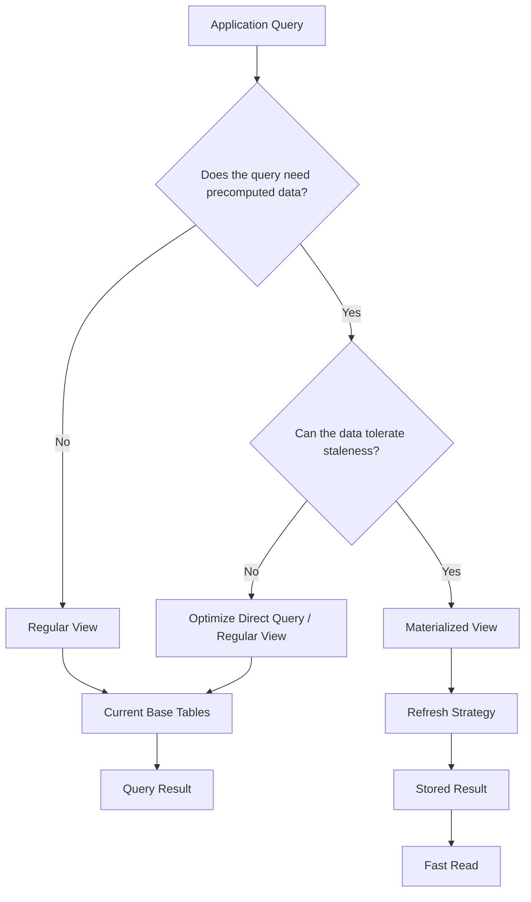

# 04- View Types

## Overview

SQL views provide named query interfaces over relational data. While the core concept is consistent, databases support different forms of views depending on whether the view is virtual, materialized, writable, recursive, or specialized for security and reporting.

The most important distinction is between a **regular view** and a **materialized view**:

- A regular view stores the query definition and computes its result when queried.
- A materialized view stores the result and requires an explicit refresh strategy.

Other view categories, such as recursive, updatable, security-oriented, and system views, address different requirements rather than representing completely separate storage mechanisms.

This distinction matters in backend systems because choosing a view type affects query latency, freshness, write behavior, permissions, deployment, indexing, and operational complexity.

## View Type Landscape

| View type | Stores result data | Typical purpose | Write support | Refresh required |
|---|---:|---|---|---:|
| Regular view | No | Reusable relational abstraction | Sometimes, if definition is updatable | No |
| Materialized view | Yes | Precomputed expensive reads | Usually no direct writes | Yes |
| Updatable view | No | Controlled write/read interface | Yes, subject to restrictions | No |
| Recursive view | No | Hierarchical/graph traversal | Usually read-oriented | No |
| Security view | No | Controlled data exposure | Depends on definition | No |
| System/catalog view | Engine-managed | Database metadata | No | No |

These categories can overlap. For example, a regular view can be updatable and can also be designed as a security-oriented interface.

## Regular Views

### What It Is

A regular view is a named SQL query whose result is computed when the view is referenced.

```sql
CREATE VIEW active_customers AS
SELECT
    customer_id,
    name,
    email
FROM customers
WHERE status = 'active';
```

Querying it:

```sql
SELECT
    customer_id,
    name,
    email
FROM active_customers
WHERE customer_id = 123;
```

does not normally read a separately stored copy of `active_customers`.

### Why It Exists

Regular views provide:

- Query reuse.
- Schema abstraction.
- Stable read interfaces.
- Centralized relational logic.
- Controlled column exposure.
- Simplification of complex joins.

They are particularly useful when the underlying schema is normalized but consumers need a convenient read model.

### How It Works

Conceptually:

```text
Application Query
       |
       v
   View Reference
       |
       v
View Definition
       |
       v
Query Rewrite / Optimization
       |
       v
Base Tables + Indexes
       |
       v
Result
```

The database optimizer can often combine predicates and other operations from the outer query with the underlying view definition.

For example:

```sql
CREATE VIEW customer_orders AS
SELECT
    order_id,
    customer_id,
    amount
FROM orders
WHERE status = 'completed';
```

A consumer can execute:

```sql
SELECT
    order_id,
    amount
FROM customer_orders
WHERE customer_id = 123;
```

The database can optimize the overall operation rather than necessarily materializing the entire view first.

### Advantages

- No duplicate result storage.
- Results reflect current underlying data.
- Centralizes reusable SQL.
- Can hide schema complexity.
- Can restrict exposed columns.
- Easy to integrate with application read paths.

### Limitations

A regular view does not inherently:

- Cache results.
- Reduce the complexity of an expensive underlying query.
- Create indexes over the view result.
- Precompute large aggregations.

A view can make application SQL cleaner while leaving database computation unchanged.

## Materialized Views

### What It Is

A materialized view stores the result of a query physically.

PostgreSQL example:

```sql
CREATE MATERIALIZED VIEW customer_sales AS
SELECT
    customer_id,
    COUNT(*) AS order_count,
    SUM(amount) AS total_sales
FROM orders
WHERE status = 'completed'
GROUP BY customer_id;
```

Unlike a regular view, the result exists as stored database data.

### Why It Exists

Materialized views are useful when:

- The underlying query is expensive.
- The same result is queried repeatedly.
- Read latency matters more than absolute freshness.
- The data can tolerate a refresh interval.
- Precomputation is cheaper than repeated computation.

For example, a reporting dashboard might query the same daily sales aggregation thousands of times while the underlying transactional data changes continuously.

Instead of recalculating the aggregation for every request:

```text
Request 1 -> expensive aggregation
Request 2 -> expensive aggregation
Request 3 -> expensive aggregation
...
```

the system can periodically compute:

```text
Transactional Tables
        |
        v
Materialized View Refresh
        |
        v
Precomputed Results
        |
        v
Dashboard Queries
```

### Refreshing Materialized Views

A materialized view is only as fresh as its most recent refresh.

```sql
REFRESH MATERIALIZED VIEW customer_sales;
```

For concurrent readers in PostgreSQL, `CONCURRENTLY` can be used when the materialized view satisfies the required conditions, including an appropriate unique index:

```sql
CREATE UNIQUE INDEX customer_sales_customer_id_idx
ON customer_sales (customer_id);

REFRESH MATERIALIZED VIEW CONCURRENTLY customer_sales;
```

The operational design must consider:

- Refresh frequency.
- Refresh duration.
- Locking behavior.
- Required indexes.
- Resource consumption.
- Acceptable staleness.
- Failure and retry behavior.

### Advantages

- Faster repeated reads for expensive computations.
- Can be indexed.
- Reduces repeated CPU and I/O work.
- Useful for analytical and reporting workloads.

### Limitations

- Data can become stale.
- Refresh consumes database resources.
- Refresh scheduling becomes an operational dependency.
- Additional storage is required.
- Refresh failures can leave data older than expected.
- Complex materialized views may be expensive to rebuild.

### Production Example

A backend dashboard may use:

```text
PostgreSQL Transaction Tables
          |
          v
     Refresh Job
          |
          v
Materialized View
          |
          v
Reporting API
          |
          v
REST / gRPC Client
```

A Celery or Kubernetes CronJob process can trigger refreshes when appropriate.

The refresh cadence should be based on the business requirement rather than an arbitrary interval.

If the dashboard can tolerate 15-minute-old data, refreshing every few seconds is unnecessary database work.

## Updatable Views

### What It Is

Some regular views can accept `INSERT`, `UPDATE`, or `DELETE` operations.

For example:

```sql
CREATE VIEW active_customers AS
SELECT
    customer_id,
    name,
    email
FROM customers
WHERE status = 'active';
```

Depending on the database and view definition, an update through the view may be possible:

```sql
UPDATE active_customers
SET email = 'new@example.com'
WHERE customer_id = 123;
```

The database translates the operation to the underlying table when the view satisfies its updatability rules.

### Why It Exists

Updatable views can provide a controlled interface over a table.

They can be useful when consumers should interact with a subset of columns or rows rather than directly with the base table.

### Limitations

Updatability depends heavily on the database engine and view definition.

Views containing operations such as:

- Aggregation.
- `GROUP BY`.
- `DISTINCT`.
- Set operations.
- Complex joins.
- Window functions.

may not be directly updatable.

When automatic updatability is insufficient, some databases support triggers or other mechanisms to translate writes.

### Production Recommendation

Prefer direct table writes when they make the data model clearer.

Use writable views when the view itself represents an intentional database contract and the write semantics are well understood.

Do not make a view writable merely because the database permits it.

## Security-Oriented Views

A view can expose only the data a particular consumer needs.

```sql
CREATE VIEW reporting.customer_directory AS
SELECT
    customer_id,
    name,
    email,
    created_at
FROM app.customers;
```

Sensitive columns such as internal authentication data or operational metadata can remain outside the view.

This creates a controlled interface:

```text
Reporting Role
      |
      v
Reporting View
      |
      v
Customer Table
```

### Why It Exists

Security-oriented views are useful for:

- Reporting users.
- BI tools.
- Read-only service accounts.
- Cross-team database access.
- Separating sensitive columns from general-purpose data access.

### Production Considerations

A view is not automatically a complete security boundary.

Review:

- Database roles.
- `GRANT` permissions.
- Base-table privileges.
- Row-level security.
- View ownership.
- Security invoker/definer behavior.
- Functions referenced by the view.
- Cross-schema access.

Test using the same database role used by the production service.

## Recursive Views

Recursive queries are useful for hierarchical data such as:

- Organization structures.
- Categories.
- Folder trees.
- Dependency graphs.
- Parent/child relationships.

PostgreSQL supports recursive views:

```sql
CREATE RECURSIVE VIEW employee_hierarchy (
    employee_id,
    manager_id,
    employee_name,
    depth
) AS
SELECT
    employee_id,
    manager_id,
    employee_name,
    0
FROM employees
WHERE manager_id IS NULL

UNION ALL

SELECT
    e.employee_id,
    e.manager_id,
    e.employee_name,
    h.depth + 1
FROM employees AS e
JOIN employee_hierarchy AS h
    ON e.manager_id = h.employee_id;
```

The resulting view can be queried like a normal relation:

```sql
SELECT *
FROM employee_hierarchy
ORDER BY depth, employee_id;
```

### Production Considerations

Recursive queries require careful handling of:

- Cycles in the data.
- Maximum traversal depth.
- Large hierarchies.
- Indexing of parent/child relationships.
- Query execution time.

A malformed hierarchy can turn an apparently simple query into a very expensive traversal.

## System and Catalog Views

Database engines expose metadata through system views.

PostgreSQL examples include:

```sql
SELECT
    schemaname,
    tablename,
    tableowner
FROM pg_catalog.pg_tables;
```

and:

```sql
SELECT
    schemaname,
    viewname,
    viewowner
FROM pg_catalog.pg_views;
```

Information-schema views provide a more standardized interface:

```sql
SELECT
    table_schema,
    table_name,
    column_name,
    data_type
FROM information_schema.columns
WHERE table_schema = 'public';
```

These views are useful for:

- Database administration.
- Schema inspection.
- Migration tooling.
- Operational diagnostics.
- Developer tooling.

System views are managed by the database engine and should not be treated like application-owned views.

## View Types by Workload

The most useful decision is usually workload-driven rather than syntax-driven.

| Requirement | Preferred approach |
|---|---|
| Reusable joins and filters | Regular view |
| Stable read abstraction | Regular view |
| Restrict exposed columns | Regular/security-oriented view |
| Hierarchical query interface | Recursive view/query |
| Expensive repeated aggregation | Materialized view |
| Near-real-time transactional reads | Regular view or direct query |
| Frequently queried analytical snapshot | Materialized view |
| Controlled database writes | Updatable view when semantics justify it |
| Database metadata inspection | System/catalog views |
| Very high-volume cache reads | Application cache such as Redis |

## Regular View vs Materialized View



The key decision is:

> **Do you need an abstraction over a query, or do you need the query result itself to be persisted?**

A regular view answers the first requirement. A materialized view answers the second.

## Views in Backend Services

Views are often most valuable at the repository/database boundary.

For example:

```text
FastAPI / Django
       |
       v
Service Layer
       |
       v
Repository
       |
       v
Database View
       |
       v
Tables / Indexes
```

The application can query:

```sql
SELECT
    order_id,
    customer_id,
    customer_name,
    amount
FROM reporting.order_details
WHERE customer_id = :customer_id;
```

without knowing whether the underlying implementation uses one table or several joins.

This reduces coupling between application queries and the physical database schema.

However, the view should not become an uncontrolled replacement for application architecture. Business rules that depend on external services, user-specific state, or workflows generally belong outside the view.

## Performance Characteristics

### Regular Views

Performance depends on the underlying query and the final consumer query.

Investigate with:

```sql
EXPLAIN (ANALYZE, BUFFERS)
SELECT
    order_id,
    amount
FROM reporting.order_details
WHERE customer_id = 123;
```

Look for:

- Sequential scans over large relations.
- Incorrect row-count estimates.
- Expensive joins.
- Sort operations.
- Large hash tables.
- Excessive disk I/O.
- Missing indexes.

### Materialized Views

Materialized views shift work from **read time** toward **refresh time**.

This is valuable when:

```text
Read frequency >> Refresh frequency
```

For example:

```text
1 expensive refresh / 15 minutes
          vs
100,000 expensive queries / 15 minutes
```

can be a strong case for materialization.

But the refresh itself must be included in capacity planning.

## Indexing Considerations

Regular views generally do not have independent indexes over their computed results.

Index the underlying tables according to actual query patterns.

For example:

```sql
CREATE INDEX orders_customer_status_created_idx
ON orders (customer_id, status, created_at DESC);
```

A materialized view, by contrast, stores rows and can have indexes:

```sql
CREATE INDEX customer_sales_total_idx
ON customer_sales (total_sales DESC);
```

This is one of the major architectural differences between the two.

## Freshness and Consistency

Regular views provide results based on the current transactional state visible to the executing transaction.

Materialized views introduce an explicit freshness boundary:

```text
Base Data
   |
   | changes continuously
   v
Materialized View
   |
   | refreshed periodically
   v
Consumer
```

If the materialized view was refreshed at 12:00 and the current time is 12:10, the result may not contain changes committed after the refresh.

This must be treated as an explicit product and system-design decision.

Do not use a materialized view for a workflow requiring strict current-state reads unless its refresh strategy guarantees the required freshness.

## Operational Considerations

Treat application-owned views as database code.

Recommended practices:

- Store definitions in version control.
- Create and modify them through migrations.
- Review dependency changes.
- Test on production-sized datasets.
- Monitor expensive consuming queries.
- Document freshness expectations for materialized views.
- Define refresh failure handling.
- Verify permissions using production-like roles.
- Avoid undocumented manual production changes.

For materialized views, additionally monitor:

- Last successful refresh.
- Refresh duration.
- Refresh failures.
- Data age.
- Storage growth.
- Index maintenance.
- Database CPU and I/O consumption.

A useful operational metric is:

```text
Data Freshness Lag =
Current Time - Last Successful Refresh Time
```

Alert when this exceeds the business-defined threshold.

## Common Mistakes

### Treating All Views as the Same

A regular view and materialized view have fundamentally different storage and freshness characteristics.

**Avoid it:** Decide explicitly whether the result must be persisted.

### Assuming a Regular View Improves Performance

A regular view primarily improves abstraction and reuse.

**Avoid it:** Use `EXPLAIN (ANALYZE, BUFFERS)` against real consumer queries.

### Using Materialized Views Without a Refresh Strategy

A materialized view without an operational refresh mechanism eventually becomes stale.

**Avoid it:** Define refresh cadence, failure handling, freshness SLOs, and monitoring.

### Using Views with `SELECT *`

This exposes an unstable schema contract.

**Avoid it:** Declare required columns explicitly.

### Overusing Nested Views

Deep view chains can make dependency graphs and execution plans difficult to reason about.

**Avoid it:** Keep view layers purposeful and maintainable.

### Assuming Views Are Automatically Secure

A view can restrict exposed data, but database permissions still determine actual access.

**Avoid it:** Test privileges with real application roles.

### Ignoring Rolling Deployments

Changing a view can break an older application version still running during deployment.

**Avoid it:** Maintain backward-compatible database contracts during rolling releases.

### Using a Materialized View for Strictly Current Data

Materialized results are inherently dependent on refresh timing.

**Avoid it:** Use a regular view/direct query when freshness requirements cannot tolerate the refresh boundary.

## Interview Traps

| Question | Correct reasoning |
|---|---|
| Does a regular view store rows? | Normally no; it stores a query definition. |
| Does a materialized view store rows? | Yes, it persists the query result. |
| Does a regular view cache a query? | No, not by itself. |
| Why use a materialized view? | To trade freshness and refresh cost for faster repeated reads. |
| Can a view be updated? | Some views are updatable, subject to database and definition restrictions. |
| Can a regular view have its own indexes? | Generally no; index the underlying tables. |
| Can a materialized view be indexed? | Yes, because it stores result rows. |
| Are views always security boundaries? | No; privileges, ownership, RLS, and execution semantics still matter. |
| Does a materialized view always improve performance? | No; refresh cost, storage, indexing, and workload shape must justify it. |

## Production Decision Framework

When deciding which view approach to use, evaluate the workload in this order:

1. **Need reusable relational logic?**  
   Use a regular view when the primary goal is abstraction.

2. **Need controlled column or row exposure?**  
   Consider a security-oriented regular view combined with appropriate database privileges.

3. **Need writes through the abstraction?**  
   Evaluate whether the view is genuinely updatable and whether the write semantics are clear.

4. **Need hierarchical traversal?**  
   Consider recursive queries or recursive views, with safeguards for depth and cycles.

5. **Is repeated computation expensive?**  
   Consider a materialized view.

6. **Can the result be stale?**  
   If not, a materialized view may be inappropriate.

7. **Can refresh cost be supported?**  
   Measure refresh duration and database resource consumption before adopting it.

8. **Is the workload primarily transactional or analytical?**  
   Transactional systems generally favor current relational queries; analytical workloads are stronger candidates for precomputation.

## Key Takeaways

- **Regular views are virtual query abstractions; materialized views persist query results and introduce a refresh/freshness boundary.**
- **Choose the view type based on workload requirements such as abstraction, write behavior, security, hierarchy, freshness, and repeated computation.**
- **A regular view does not inherently improve query performance; a materialized view trades refresh cost and staleness for faster repeated reads.**
- **Treat views as production database contracts with explicit columns, controlled permissions, version-controlled migrations, dependency management, and monitoring.**
- **For materialized views, freshness, refresh duration, failure handling, storage, and indexing are operational concerns—not implementation details.**