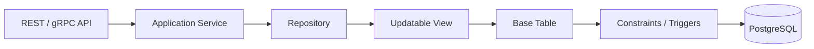

# 05- Updatable Views

## Overview

An **updatable view** is a database view through which `INSERT`, `UPDATE`, or `DELETE` operations can modify rows in its underlying base table or tables.

A view is useful as an abstraction layer, but making that abstraction writable introduces additional semantics: the database must be able to determine how a change to the view maps back to the underlying relation.

For backend systems, updatable views are most useful when the database should expose a controlled relational interface while keeping the physical schema hidden or restricting which rows and columns consumers can modify.

The important distinction is:

- **Readable view:** primarily a query abstraction.
- **Updatable view:** a query abstraction that also has well-defined write semantics.
- **Materialized view:** stores query results and is generally not a direct write interface.

Updatability is **database-engine-specific**. SQL provides the general concept, but the exact rules differ between PostgreSQL, MySQL, SQL Server, Oracle, and other engines.

## Why Updatable Views Exist

A normal application can write directly to a base table:

```sql
UPDATE customers
SET email = 'new@example.com'
WHERE customer_id = 123;
```

An updatable view can expose a narrower interface:

```sql
CREATE VIEW active_customers AS
SELECT
    customer_id,
    name,
    email
FROM customers
WHERE status = 'active';
```

The application can then potentially execute:

```sql
UPDATE active_customers
SET email = 'new@example.com'
WHERE customer_id = 123;
```

The database translates the operation against the view into an operation against its underlying table.

This can provide:

- Schema abstraction.
- Controlled column exposure.
- Controlled row visibility.
- Stable database-facing contracts.
- Separation between application-facing and physical schemas.
- A useful database security boundary when combined with proper privileges.

However, an updatable view should not be treated as a replacement for application service logic. Complex business workflows generally belong in application code or explicit database procedures rather than being hidden inside view semantics.

## How Updatable Views Work

Conceptually, the database performs a mapping:

```text
Application
    |
    | UPDATE view
    v
View Definition
    |
    | Determine affected base rows
    v
Underlying Table
    |
    | UPDATE
    v
Constraints / Triggers / Indexes
    |
    v
Transaction Commit
```

Consider:

```sql
CREATE VIEW active_customers AS
SELECT
    customer_id,
    name,
    email
FROM customers
WHERE status = 'active';
```

A statement such as:

```sql
UPDATE active_customers
SET email = 'new@example.com'
WHERE customer_id = 123;
```

must be translated into a modification of `customers`.

The database must be able to determine:

1. Which base table is being modified.
2. Which base row corresponds to the view row.
3. Which view columns map to base-table columns.
4. Whether the requested operation is legal.
5. Which constraints and triggers apply.

The exact implementation is engine-specific.

## Simple Updatable Views

The simplest case is a view over one table with direct column references.

```sql
CREATE TABLE customers (
    customer_id BIGINT PRIMARY KEY,
    name TEXT NOT NULL,
    email TEXT NOT NULL,
    status TEXT NOT NULL
);

CREATE VIEW active_customers AS
SELECT
    customer_id,
    name,
    email
FROM customers
WHERE status = 'active';
```

An update can potentially pass through:

```sql
UPDATE active_customers
SET email = 'customer@example.com'
WHERE customer_id = 123;
```

An insert may also be possible when the view and database rules permit it:

```sql
INSERT INTO active_customers (
    customer_id,
    name,
    email
)
VALUES (
    456,
    'Alice',
    'alice@example.com'
);
```

Whether the insert is accepted depends on the database's updatability rules and the underlying table constraints.

## Row Filtering and the `CHECK OPTION`

A filtered view introduces an important problem.

Consider:

```sql
CREATE VIEW active_customers AS
SELECT
    customer_id,
    name,
    email,
    status
FROM customers
WHERE status = 'active';
```

Without additional protection, an update through the view might change a visible row so that it no longer satisfies:

```sql
status = 'active'
```

For example:

```sql
UPDATE active_customers
SET status = 'inactive'
WHERE customer_id = 123;
```

The row could disappear from the view after the update.

When the database supports it, `WITH CHECK OPTION` can enforce that changes made through the view continue to satisfy the view predicate.

```sql
CREATE VIEW active_customers AS
SELECT
    customer_id,
    name,
    email,
    status
FROM customers
WHERE status = 'active'
WITH CHECK OPTION;
```

Now a write that causes the row to violate the view condition is rejected.

### Why `CHECK OPTION` Matters

Without it:

```text
Row visible through view
        |
        | UPDATE
        v
Row no longer satisfies predicate
        |
        v
Row disappears from view
```

With it:

```text
Row visible through view
        |
        | UPDATE
        v
Does row still satisfy predicate?
       / \
     Yes  No
      |    |
      v    v
   Commit Reject
```

This is particularly important when a view is intended to represent a constrained write interface rather than merely a convenient read query.

## Updatable vs Non-Updatable Views

A view is generally easier to update when it has a direct and unambiguous mapping to a base table.

| View characteristic | Updatability |
|---|---|
| One base table | Often favorable |
| Direct column references | Favorable |
| Simple filtering | Often favorable |
| `WHERE` predicate | May still be updatable |
| `CHECK OPTION` | Controls permitted changes |
| Computed columns | Usually not directly writable |
| `GROUP BY` | Generally not directly updatable |
| Aggregate functions | Generally not directly updatable |
| `DISTINCT` | Generally not directly updatable |
| Set operations | Generally not directly updatable |
| Window functions | Generally not directly updatable |
| Complex joins | Often restricted or engine-dependent |
| Multiple base tables | Usually requires special handling |

These are conceptual guidelines rather than universal SQL rules. Always verify the target database engine's documented rules.

## Computed Columns

Consider:

```sql
CREATE VIEW customer_totals AS
SELECT
    customer_id,
    quantity * unit_price AS total
FROM order_items;
```

`total` is derived from other columns.

An operation such as:

```sql
UPDATE customer_totals
SET total = 100
WHERE customer_id = 123;
```

does not tell the database how to reverse the calculation.

Should it change:

- `quantity`?
- `unit_price`?
- Both?
- Which value should remain unchanged?

This ambiguity is why derived expressions generally cannot be directly updated.

A good rule is:

> A view column that does not map unambiguously to a writable base column should not be treated as directly writable.

## Aggregated Views

Consider:

```sql
CREATE VIEW customer_order_summary AS
SELECT
    customer_id,
    COUNT(*) AS order_count,
    SUM(amount) AS total_amount
FROM orders
GROUP BY customer_id;
```

This view represents many base rows as one result row.

Suppose the application executes:

```sql
UPDATE customer_order_summary
SET total_amount = 1000
WHERE customer_id = 123;
```

There is no unambiguous mapping to the underlying orders.

The database cannot infer whether to:

- Modify one order.
- Modify all orders.
- Insert another order.
- Redistribute the amount.
- Perform some other operation.

Therefore, aggregate views are generally read-oriented.

For writable operations, expose the underlying transactional model or define explicit write procedures with clear business semantics.

## Views with Joins

Consider:

```sql
CREATE VIEW customer_orders AS
SELECT
    c.customer_id,
    c.name,
    o.order_id,
    o.amount
FROM customers AS c
JOIN orders AS o
    ON o.customer_id = c.customer_id;
```

A query against this view contains columns from multiple base relations.

An update such as:

```sql
UPDATE customer_orders
SET name = 'New Name'
WHERE customer_id = 123;
```

could conceptually map to `customers`.

But an update involving:

```sql
UPDATE customer_orders
SET amount = 500
WHERE order_id = 9001;
```

maps to `orders`.

The database engine must determine whether the operation is safely and unambiguously translatable.

Join-view updatability therefore varies considerably by database engine and by the exact view definition.

### Production Recommendation

Do not design critical write paths around complex join views unless:

- The database's behavior is explicitly understood.
- The write semantics are tested.
- The operation is covered by integration tests.
- The team understands which base tables can be modified.

For complex write workflows, explicit SQL against the intended base tables is often easier to maintain.

## `INSERT` Through Views

Inserting through a view is subject to additional constraints.

Suppose:

```sql
CREATE VIEW customer_directory AS
SELECT
    customer_id,
    name,
    email
FROM customers;
```

An insert may be possible:

```sql
INSERT INTO customer_directory (
    customer_id,
    name,
    email
)
VALUES (
    1001,
    'Alice',
    'alice@example.com'
);
```

But the underlying table might contain required columns that the view does not expose:

```sql
CREATE TABLE customers (
    customer_id BIGINT PRIMARY KEY,
    name TEXT NOT NULL,
    email TEXT NOT NULL,
    status TEXT NOT NULL,
    created_at TIMESTAMPTZ NOT NULL
);
```

The insert must still satisfy:

- `NOT NULL` constraints.
- Primary keys.
- Foreign keys.
- Unique constraints.
- Check constraints.
- Defaults.
- Generated columns.
- Triggers.

A view does not bypass base-table integrity rules.

## `DELETE` Through Views

A simple view can potentially support deletion:

```sql
DELETE FROM active_customers
WHERE customer_id = 123;
```

The operation may translate to:

```sql
DELETE FROM customers
WHERE customer_id = 123;
```

This is powerful, but it creates an important security consideration.

A user with permission to delete through a view may effectively be able to delete underlying data.

Therefore:

> View-level access must be designed together with underlying table privileges.

Do not assume that exposing a restricted view automatically makes destructive operations safe.

## Security Model

A common architecture is:

```text
Application Role
       |
       v
Writable View
       |
       v
Base Table
```

The application can be granted access to the view while direct table access is restricted.

For example, conceptually:

```sql
GRANT SELECT, INSERT, UPDATE, DELETE
ON active_customers
TO application_role;
```

The exact security model depends on the database engine.

### Security Benefits

Writable views can help enforce:

- Column-level exposure.
- Row-level restrictions.
- Database-facing contracts.
- Separation between application roles and physical tables.

### Security Limitations

A view is not automatically a complete authorization system.

Review:

- Database role permissions.
- Direct access to base tables.
- `GRANT` inheritance.
- Row-level security.
- View ownership.
- Security invoker/definer semantics where supported.
- Functions and triggers involved in writes.
- Application-level authorization.

A backend API should still enforce business authorization where appropriate.

## Updatable Views and Transactions

View writes execute within the same database transaction semantics as writes to the underlying tables.

For example:

```sql
BEGIN;

UPDATE active_customers
SET email = 'new@example.com'
WHERE customer_id = 123;

UPDATE customer_preferences
SET marketing_enabled = false
WHERE customer_id = 123;

COMMIT;
```

The application does not need a separate transaction merely because the first operation targets a view.

This matters for Django, FastAPI, and other backend services because view-based writes participate in the same database transaction used by the application connection.

The same considerations apply to:

- Isolation level.
- Row locks.
- Deadlocks.
- Constraint violations.
- Transaction rollback.
- Trigger execution.

## Interaction with Constraints and Triggers

An update through a view does not bypass the underlying table's integrity mechanisms.

A write can trigger:

```text
View UPDATE
    |
    v
Underlying Table UPDATE
    |
    +--> CHECK constraints
    |
    +--> Foreign keys
    |
    +--> UNIQUE constraints
    |
    +--> BEFORE triggers
    |
    +--> Row-level security
    |
    +--> AFTER triggers
    |
    v
Transaction Result
```

This is an important operational property.

If a view-based write unexpectedly fails, inspect both the view definition and the underlying table's constraints and triggers.

## Backend Application Integration

### Django

Django's ORM is designed primarily around tables and models. A database view can be represented using an unmanaged model for read-oriented access:

```python
class ActiveCustomer(models.Model):
    customer_id = models.BigIntegerField(primary_key=True)
    name = models.TextField()
    email = models.EmailField()

    class Meta:
        managed = False
        db_table = "active_customers"
```

For writable views, relying on generic ORM behavior can be risky because Django's model metadata does not automatically make arbitrary database-view semantics safe.

For important writes, use explicit SQL or carefully designed database operations when necessary:

```python
from django.db import connection


def update_customer_email(customer_id: int, email: str) -> None:
    with connection.cursor() as cursor:
        cursor.execute(
            """
            UPDATE active_customers
            SET email = %s
            WHERE customer_id = %s
            """,
            [email, customer_id],
        )
```

Parameterization is important to prevent SQL injection.

### FastAPI

A FastAPI service can expose a view-backed repository:

```python
from sqlalchemy import text


def update_customer_email(session, customer_id: int, email: str) -> None:
    session.execute(
        text(
            """
            UPDATE active_customers
            SET email = :email
            WHERE customer_id = :customer_id
            """
        ),
        {
            "email": email,
            "customer_id": customer_id,
        },
    )
```

The service layer should still own:

- Authentication.
- Authorization.
- Input validation.
- Business rules.
- Transaction boundaries where appropriate.

The database view should not become a hidden substitute for these responsibilities.

## Production Design Pattern

A useful pattern is to use a view as a controlled database interface:



This can be effective when multiple consumers need the same constrained relational interface.

For example, an organization may expose a view that permits customer-service applications to modify only customer contact fields while keeping internal columns inaccessible.

The database remains responsible for relational integrity; the application remains responsible for business workflow and authorization.

## Advantages and Limitations

| Aspect | Advantages | Limitations |
|---|---|---|
| Abstraction | Hides physical schema details | Adds another dependency layer |
| Security | Can restrict exposed columns/rows | Requires correct privileges |
| Reuse | Centralizes relational logic | Complex views can become difficult to maintain |
| Writes | Can provide controlled write interfaces | Updatability rules vary by engine |
| Integrity | Base constraints still apply | Hidden triggers/constraints can surprise developers |
| Application coupling | Reduces direct table coupling | Application may become coupled to the view contract |
| Deployment | Can preserve database-facing interfaces | View changes can break rolling deployments |

## Production Considerations

### Keep the View Simple

The more complicated the view, the harder it becomes to reason about write behavior.

Prefer:

```sql
CREATE VIEW active_customers AS
SELECT
    customer_id,
    name,
    email
FROM customers
WHERE status = 'active'
WITH CHECK OPTION;
```

over a deeply nested view containing:

- Multiple joins.
- Aggregations.
- Window functions.
- Set operations.
- Computed business logic.

### Make Write Semantics Explicit

Document:

- Which operations are supported.
- Which columns are writable.
- Which rows can be modified.
- Whether updates can cause rows to leave the view.
- Which database role owns the view.
- Which underlying tables are affected.

### Version Views Through Migrations

Treat view definitions as database application code.

For example, in a deployment migration:

```sql
CREATE OR REPLACE VIEW active_customers AS
SELECT
    customer_id,
    name,
    email,
    status
FROM customers
WHERE status = 'active'
WITH CHECK OPTION;
```

The exact migration strategy depends on the database engine.

### Plan for Rolling Deployments

Suppose version A expects:

```text
active_customers(customer_id, name, email)
```

and version B expects:

```text
active_customers(customer_id, name, email, phone)
```

During a rolling deployment, both versions may run simultaneously.

Avoid making incompatible view changes that break the older application version.

### Test Against Production-Like Data

Updatability can depend on:

- Constraints.
- Indexes.
- Triggers.
- Row-level security.
- Data distributions.
- Database version.

Integration tests should execute real `INSERT`, `UPDATE`, and `DELETE` statements against the actual database engine.

## Performance Considerations

A simple updatable view generally does not introduce a materialized result.

For example:

```sql
UPDATE active_customers
SET email = 'new@example.com'
WHERE customer_id = 123;
```

still ultimately updates the underlying table.

Performance therefore depends primarily on:

- Base-table indexes.
- Predicate selectivity.
- Lock contention.
- Foreign-key checks.
- Trigger execution.
- Transaction duration.
- Query plan.

Use:

```sql
EXPLAIN
UPDATE active_customers
SET email = 'new@example.com'
WHERE customer_id = 123;
```

when supported by the target database to inspect the execution strategy.

The view itself should not be assumed to improve write performance.

## Common Mistakes

### Assuming Every View Is Updatable

A view containing aggregates, grouping, window functions, or complex transformations may not support direct writes.

**Avoid it:** Check the database engine's updatability rules and test the actual operation.

### Updating Through a Filtered View Without `CHECK OPTION`

A write can make a row disappear from the view.

**Avoid it:** Use `CHECK OPTION` when the view is intended to enforce its predicate for writes and the target engine supports it.

### Treating a View as an Authorization System

A view can restrict exposure, but incorrect database privileges can still expose the underlying table.

**Avoid it:** Review role grants and test with the actual application database role.

### Hiding Complex Business Logic Inside a View

A writable view containing complicated business semantics becomes difficult to understand and debug.

**Avoid it:** Keep views relational and declarative; place workflow logic in the application or explicit database procedures where appropriate.

### Assuming ORM Support Is Automatic

An ORM model mapped to a view does not necessarily understand all view-specific write restrictions.

**Avoid it:** Test ORM writes explicitly or use targeted SQL for database-specific view operations.

### Ignoring Base-Table Constraints

A view does not bypass `NOT NULL`, foreign-key, unique, check, or trigger behavior.

**Avoid it:** Debug view writes by inspecting the entire database write path.

### Making Destructive Operations Available Through a View

`DELETE` through a view can still delete real base-table rows.

**Avoid it:** Grant only the operations required by the consumer.

### Breaking Older Application Versions

Changing a view definition during a rolling deployment can break instances running an older application version.

**Avoid it:** Treat views as versioned interfaces and make schema/view changes backward-compatible.

## Interview Traps

| Interview question | Correct reasoning |
|---|---|
| What makes a view updatable? | The database must be able to map the requested modification unambiguously to underlying rows and columns. |
| Are all views updatable? | No. Updatability depends on the database engine and view definition. |
| Can a filtered view be updated? | Often yes, but the exact behavior is engine-dependent. |
| What does `WITH CHECK OPTION` do? | It prevents view-based changes that would cause rows to violate the view's defining predicate. |
| Can an aggregate view normally be updated? | Generally no, because an aggregate row does not map unambiguously to a base row. |
| Can a view contain computed columns and still be partially writable? | Potentially, depending on the engine, but derived columns themselves generally are not directly writable. |
| Does updating a view bypass table constraints? | No. The underlying table's integrity mechanisms still apply. |
| Does a view automatically provide security? | No. Proper database privileges and authorization design are still required. |
| Does a writable view improve write performance? | Not inherently. It is primarily an abstraction/interface mechanism. |
| Should complex business workflows be implemented through views? | Usually no. Keep relational abstraction separate from application workflow logic. |

## When to Use Updatable Views

Use an updatable view when:

- The underlying table should not be directly exposed.
- A consumer needs a controlled subset of columns.
- A row-level predicate should define the writable dataset.
- Multiple consumers need the same database interface.
- The view has simple, well-understood write semantics.
- Database-level access control is important.

Avoid an updatable view when:

- The operation spans complex business workflows.
- The view combines many relations with ambiguous write semantics.
- The write requires external service calls.
- The operation depends on application state.
- Developers cannot clearly explain which base rows are modified.
- A direct table operation is simpler and safer.

## Operational Checklist

Before putting a writable view into production, verify:

- [ ] The target database explicitly supports the required write operation.
- [ ] `INSERT`, `UPDATE`, and/or `DELETE` behavior is documented.
- [ ] Writable columns are explicitly identified.
- [ ] `CHECK OPTION` is used where row-predicate enforcement is required.
- [ ] Base-table constraints have been tested.
- [ ] Triggers and row-level security have been reviewed.
- [ ] Database privileges are restricted to the required operations.
- [ ] Integration tests run against the actual database engine.
- [ ] Queries have been tested with production-sized data.
- [ ] View definitions are version-controlled and deployed through migrations.
- [ ] Rolling deployment compatibility has been considered.
- [ ] Application and database authorization responsibilities are clearly separated.

## Key Takeaways

- **Updatable views provide a writable database abstraction, but only when the database can map the operation unambiguously to underlying data.**
- **Simple single-table views are the strongest candidates; aggregates, window functions, computed expressions, and complex joins commonly restrict direct updatability.**
- **Use `CHECK OPTION` when writes through a filtered view must continue to satisfy the view's predicate.**
- **View permissions, base-table privileges, constraints, triggers, and row-level security must be designed as one security and integrity boundary.**
- **Keep writable views simple and explicit; use application services or dedicated database procedures for complex business workflows.**