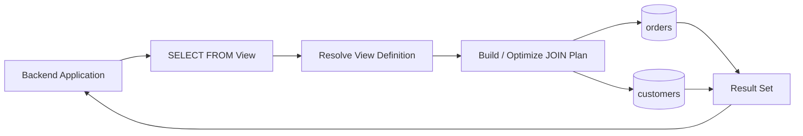

# 06- Views with JOINs

## Overview

A view with a `JOIN` exposes a reusable relational query that combines data from two or more tables.

For backend systems, this is useful when multiple consumers repeatedly need the same relational projection, such as:

- Orders with customer information.
- Products with inventory state.
- Payments with order metadata.
- Employees with department information.
- Application users with tenant metadata.

A join view centralizes the query definition:

```text
Base Tables
    |
    +---- customers
    |
    +---- orders
    |
    +---- payments
    |
    v
JOIN View
    |
    v
Stable Relational Projection
    |
    +---- API
    +---- Reporting
    +---- Admin tools
    +---- Internal services
```

The important engineering distinction is that a join view is primarily a **read abstraction**. Although some database engines can make certain join views writable, complex joined views should generally not be treated as a write API without explicitly verifying the database's updatability rules.

## Why Use Views with JOINs

Without a view, every application or reporting query may repeat the same joins:

```sql
SELECT
    o.order_id,
    o.created_at,
    o.total_amount,
    c.customer_id,
    c.name,
    c.email
FROM orders AS o
JOIN customers AS c
    ON c.customer_id = o.customer_id
WHERE o.status = 'completed';
```

The same relational logic may appear in:

- Django querysets.
- FastAPI repositories.
- Reporting jobs.
- Admin applications.
- Data exports.
- Operational SQL scripts.

A view can centralize that projection:

```sql
CREATE VIEW completed_orders AS
SELECT
    o.order_id,
    o.created_at,
    o.total_amount,
    c.customer_id,
    c.name,
    c.email
FROM orders AS o
JOIN customers AS c
    ON c.customer_id = o.customer_id
WHERE o.status = 'completed';
```

Consumers can then query:

```sql
SELECT *
FROM completed_orders
WHERE customer_id = 123;
```

This reduces duplicated SQL while giving the database a named relational interface.

## Basic JOIN View

Consider these tables:

```sql
CREATE TABLE customers (
    customer_id BIGINT PRIMARY KEY,
    name TEXT NOT NULL,
    email TEXT NOT NULL
);

CREATE TABLE orders (
    order_id BIGINT PRIMARY KEY,
    customer_id BIGINT NOT NULL REFERENCES customers(customer_id),
    status TEXT NOT NULL,
    total_amount NUMERIC(12, 2) NOT NULL,
    created_at TIMESTAMPTZ NOT NULL DEFAULT now()
);
```

Create a view:

```sql
CREATE VIEW order_details AS
SELECT
    o.order_id,
    o.customer_id,
    c.name AS customer_name,
    c.email AS customer_email,
    o.status,
    o.total_amount,
    o.created_at
FROM orders AS o
JOIN customers AS c
    ON c.customer_id = o.customer_id;
```

Query it like a relation:

```sql
SELECT
    order_id,
    customer_name,
    total_amount,
    created_at
FROM order_details
WHERE status = 'completed'
ORDER BY created_at DESC;
```

The view does not normally store this result. The database executes the underlying query according to the database engine's view and optimizer semantics.

## How a JOIN View Works

Conceptually, a request flows through several stages:



The view name is resolved to its definition, after which the database optimizer determines an execution strategy.

For example:

```sql
SELECT *
FROM order_details
WHERE customer_id = 123;
```

may be optimized using predicates and indexes on the underlying tables. The exact plan depends on the database engine, statistics, indexes, query shape, and current data distribution.

A view therefore should not automatically be considered an optimization mechanism.

## INNER JOIN Views

An `INNER JOIN` returns rows where the join condition matches.

```sql
CREATE VIEW order_details AS
SELECT
    o.order_id,
    o.customer_id,
    c.name AS customer_name,
    o.total_amount
FROM orders AS o
INNER JOIN customers AS c
    ON c.customer_id = o.customer_id;
```

Because `orders.customer_id` references `customers.customer_id`, every valid order has a corresponding customer.

This is often the safest choice when the view represents entities that must have a related record.

### Use When

Use an `INNER JOIN` when:

- The relationship is mandatory.
- Rows without the related entity are not useful.
- Referential integrity guarantees the relationship.
- Consumers should see only complete records.

## LEFT JOIN Views

A `LEFT JOIN` preserves rows from the left-side table even when the right-side table has no match.

```sql
CREATE VIEW customer_last_order AS
SELECT
    c.customer_id,
    c.name,
    o.order_id,
    o.created_at AS order_created_at
FROM customers AS c
LEFT JOIN orders AS o
    ON o.customer_id = c.customer_id;
```

This becomes especially important when the right-side relationship is optional.

For example, a customer with no orders still appears in the result.

### Use When

Use a `LEFT JOIN` when:

- The primary entity must remain visible.
- Related data is optional.
- You need to distinguish "no related record" from "no primary record."

Be careful when filtering the right-side table.

This:

```sql
SELECT *
FROM customers AS c
LEFT JOIN orders AS o
    ON o.customer_id = c.customer_id
WHERE o.status = 'completed';
```

effectively removes customers without a matching completed order.

If the intention is to preserve all customers while restricting which orders are joined, put the condition in the `ON` clause:

```sql
SELECT *
FROM customers AS c
LEFT JOIN orders AS o
    ON o.customer_id = c.customer_id
   AND o.status = 'completed';
```

This distinction is a common source of production bugs.

## Multiple JOINs

Views can combine several relations:

```sql
CREATE VIEW order_summary AS
SELECT
    o.order_id,
    o.created_at,
    c.customer_id,
    c.name AS customer_name,
    p.payment_id,
    p.status AS payment_status,
    p.amount AS payment_amount
FROM orders AS o
JOIN customers AS c
    ON c.customer_id = o.customer_id
LEFT JOIN payments AS p
    ON p.order_id = o.order_id;
```

This provides a convenient read model:

```text
customers
    |
    | 1:N
    v
 orders
    |
    | 1:N
    v
payments
```

However, joining one-to-many relationships can multiply rows.

## Row Multiplication

Suppose one order has three payment records.

This query:

```sql
SELECT
    o.order_id,
    p.payment_id
FROM orders AS o
JOIN payments AS p
    ON p.order_id = o.order_id;
```

returns three rows for that order.

A view containing several one-to-many joins can therefore produce unexpected cardinality:

```text
Order
  |
  +-- 3 Order Items
  |
  +-- 2 Payments
```

A naive join can produce:

```text
3 × 2 = 6 rows
```

for one order.

This is not a database error. It is a consequence of relational cardinality.

### Production Rule

Before creating a join view, identify the cardinality of every relationship:

| Relationship | Typical effect |
|---|---|
| 1:1 | Usually preserves one row |
| N:1 | Usually preserves left-side row cardinality |
| 1:N | Can multiply rows |
| N:M | Can multiply rows significantly |
| Multiple 1:N joins | Can cause multiplicative explosion |

If consumers expect one row per order, do not blindly join multiple child tables.

Instead, aggregate or isolate the child relationships:

```sql
CREATE VIEW order_summary AS
SELECT
    o.order_id,
    o.customer_id,
    o.total_amount,
    COUNT(oi.order_item_id) AS item_count
FROM orders AS o
LEFT JOIN order_items AS oi
    ON oi.order_id = o.order_id
GROUP BY
    o.order_id,
    o.customer_id,
    o.total_amount;
```

This changes the view's semantics from "one row per child" to "one row per order."

## JOIN Conditions Must Be Explicit

Prefer explicit ANSI join syntax:

```sql
SELECT
    o.order_id,
    c.name
FROM orders AS o
JOIN customers AS c
    ON c.customer_id = o.customer_id;
```

Avoid implicit joins:

```sql
SELECT
    o.order_id,
    c.name
FROM orders AS o,
     customers AS c
WHERE c.customer_id = o.customer_id;
```

Explicit joins make relationship semantics easier to review and reduce the risk of accidental Cartesian products.

## Avoiding Accidental Cartesian Products

A missing join predicate can create:

```sql
SELECT *
FROM orders AS o
JOIN customers AS c;
```

This produces a Cartesian product.

If there are:

- 1,000,000 orders
- 100,000 customers

the logical result can contain an enormous number of combinations.

This can cause:

- Excessive CPU.
- Large memory requirements.
- Disk spills.
- Long-running queries.
- Database contention.
- Application timeouts.

Treat an unexpectedly large row count as a correctness issue first and a performance issue second.

## JOIN Views and Aggregation

Views with joins often become reporting interfaces.

For example:

```sql
CREATE VIEW customer_order_totals AS
SELECT
    c.customer_id,
    c.name,
    COUNT(o.order_id) AS order_count,
    COALESCE(SUM(o.total_amount), 0) AS total_spend
FROM customers AS c
LEFT JOIN orders AS o
    ON o.customer_id = c.customer_id
GROUP BY
    c.customer_id,
    c.name;
```

This is convenient for reporting:

```sql
SELECT *
FROM customer_order_totals
ORDER BY total_spend DESC;
```

But the view is now an analytical projection rather than a simple entity view.

Important considerations include:

- Aggregation cost.
- Indexing.
- Query frequency.
- Data volume.
- Freshness requirements.
- Whether a materialized view is more appropriate.

## JOIN Views vs Materialized Views

A standard view generally stores the query definition rather than the query result.

A materialized view stores a result that must be refreshed.

| Characteristic | Standard view | Materialized view |
|---|---|---|
| Stores result data | No | Yes |
| Data freshness | Current underlying data | Depends on refresh |
| Storage cost | Low | Higher |
| Query cost | Usually paid at query time | Can be lower |
| Refresh required | No | Yes |
| Index result directly | Database-dependent capabilities differ | Commonly supported |
| Good for | Reusable relational abstraction | Expensive repeated reads |

For a frequently accessed expensive reporting query, a materialized view may be more appropriate than repeatedly executing a large join.

## Indexing JOIN Views

You generally do not index a normal view itself as though it were a table.

Instead, optimize the underlying tables.

For:

```sql
CREATE VIEW order_details AS
SELECT
    o.order_id,
    o.customer_id,
    c.name,
    o.total_amount
FROM orders AS o
JOIN customers AS c
    ON c.customer_id = o.customer_id;
```

the underlying tables should have appropriate indexes.

For example:

```sql
CREATE INDEX idx_orders_customer_id
ON orders(customer_id);
```

The referenced primary key on `customers.customer_id` is already indexed by the primary-key constraint in PostgreSQL.

If the view frequently filters by order status and customer:

```sql
SELECT *
FROM order_details
WHERE customer_id = 123
  AND status = 'completed';
```

a suitable base-table index may help:

```sql
CREATE INDEX idx_orders_customer_status
ON orders(customer_id, status);
```

Index design should follow actual query patterns and execution plans rather than the view definition alone.

## Querying a JOIN View Efficiently

Use `EXPLAIN` to inspect the plan:

```sql
EXPLAIN
SELECT
    order_id,
    customer_name,
    total_amount
FROM order_details
WHERE customer_id = 123
  AND status = 'completed';
```

For deeper investigation:

```sql
EXPLAIN (ANALYZE, BUFFERS)
SELECT
    order_id,
    customer_name,
    total_amount
FROM order_details
WHERE customer_id = 123
  AND status = 'completed';
```

In production, inspect:

- Join strategy.
- Index scans vs sequential scans.
- Estimated vs actual row counts.
- Sort operations.
- Hash operations.
- Memory usage.
- Disk spills.
- Rows removed by filters.
- Buffer activity.

A view can hide query complexity from the application developer while the database still pays the full execution cost.

## Security Considerations

Views can be useful for exposing a controlled projection.

For example:

```sql
CREATE VIEW customer_directory AS
SELECT
    customer_id,
    name,
    email
FROM customers;
```

If `customers` contains sensitive internal columns such as:

```text
customer_id
name
email
password_hash
internal_notes
risk_score
```

the view can expose only the columns required by a consumer.

However, security depends on the database's privilege model.

Do not assume:

```text
View hides columns
        =
Database security is automatically solved
```

Review:

- Application database roles.
- `GRANT` permissions.
- Direct table access.
- View ownership.
- Security invoker/definer semantics where supported.
- Row-level security.
- Sensitive data propagation through joins.

A view can also accidentally expose sensitive information from a joined table.

## Tenant Isolation

In multi-tenant applications, a view may incorporate tenant context:

```sql
CREATE VIEW tenant_orders AS
SELECT
    o.order_id,
    o.tenant_id,
    o.total_amount,
    o.created_at
FROM orders AS o;
```

But a tenant column in a view is not by itself an authorization boundary.

A query such as:

```sql
SELECT *
FROM tenant_orders
WHERE tenant_id = 42;
```

still depends on the application correctly supplying and enforcing tenant identity.

For strong database-level isolation, evaluate database features such as row-level security rather than relying solely on application query conventions.

## Updatability of JOIN Views

Some databases can update certain joined views, but the rules are more restrictive than for simple single-table views.

Consider:

```sql
CREATE VIEW order_details AS
SELECT
    o.order_id,
    o.customer_id,
    c.name AS customer_name,
    o.total_amount
FROM orders AS o
JOIN customers AS c
    ON c.customer_id = o.customer_id;
```

An update to:

```sql
UPDATE order_details
SET total_amount = 500
WHERE order_id = 1001;
```

might be conceptually attributable to `orders`.

But:

```sql
UPDATE order_details
SET customer_name = 'Alice'
WHERE order_id = 1001;
```

would need to modify `customers`.

The database engine must determine whether this operation is legal.

Do not assume join-view write behavior is portable across database systems.

For production systems, treat complex join views as **read models** unless writable semantics have been explicitly designed and tested.

## Backend Integration

### Django

A join view can be mapped to an unmanaged Django model:

```python
class OrderDetail(models.Model):
    order_id = models.BigIntegerField(primary_key=True)
    customer_id = models.BigIntegerField()
    customer_name = models.TextField()
    customer_email = models.EmailField()
    status = models.TextField()
    total_amount = models.DecimalField(max_digits=12, decimal_places=2)

    class Meta:
        managed = False
        db_table = "order_details"
```

This can be useful for read-oriented repositories and API responses.

For example:

```python
orders = OrderDetail.objects.filter(
    customer_id=customer_id,
    status="completed",
).order_by("-order_id")
```

Be careful with pagination. A view must have a stable ordering key suitable for the pagination strategy.

### FastAPI

A repository can query the view using SQLAlchemy:

```python
from sqlalchemy import text


def get_customer_orders(session, customer_id: int):
    result = session.execute(
        text(
            """
            SELECT
                order_id,
                customer_name,
                total_amount,
                created_at
            FROM order_details
            WHERE customer_id = :customer_id
            ORDER BY created_at DESC, order_id DESC
            """
        ),
        {"customer_id": customer_id},
    )

    return result.mappings().all()
```

Parameter binding should always be used instead of string interpolation.

## API Read Models

A join view can be useful when an API repeatedly needs data spanning several normalized tables.

For example:

```text
Normalized database

customers
orders
payments
products
    |
    v
order_api_view
    |
    v
REST / gRPC service
```

The view can provide a stable relational read model while preserving normalization in the transactional schema.

However, avoid automatically exposing the view's columns directly as a public API contract.

The service layer should still define:

- API field names.
- Authorization.
- Validation.
- Pagination.
- Error handling.
- Versioning.
- Sensitive-field filtering.

A database view is a database abstraction, not necessarily an API contract.

## View Dependencies

A view with joins creates dependencies on all referenced objects.

For example:

```text
order_details
    |
    +--> orders
    |
    +--> customers
    |
    +--> payments
```

Changing an underlying table can therefore affect:

- View creation.
- Query execution.
- API responses.
- ORM mappings.
- Reports.
- Exports.
- Database migrations.

Treat views as schema dependencies during migration planning.

## Schema Migration Strategy

A view should be managed as database code.

For example:

```sql
CREATE OR REPLACE VIEW order_details AS
SELECT
    o.order_id,
    o.customer_id,
    c.name AS customer_name,
    c.email AS customer_email,
    o.status,
    o.total_amount,
    o.created_at
FROM orders AS o
JOIN customers AS c
    ON c.customer_id = o.customer_id;
```

For incompatible changes, consider compatibility during rolling deployments.

A deployment such as:

```text
Application v1
    |
    v
Old view contract

Application v2
    |
    v
New view contract
```

can fail if the view changes before all application instances have been upgraded.

Prefer additive or backward-compatible changes when possible.

## Production Performance Risks

### Large JOINs

A view joining large tables can become expensive when queried frequently.

### Poor Cardinality Estimates

Incorrect statistics can cause the optimizer to choose an inefficient join strategy.

### Missing Indexes

Foreign-key columns used in joins are common candidates for indexes, although the correct index depends on workload.

### Repeated Expensive Aggregation

A standard view does not automatically cache its result.

### Deep View Stacking

A view built on other complex views can make query behavior difficult to reason about:

```text
API Query
   |
   v
View A
   |
   v
View B
   |
   v
View C
   |
   v
Multiple Base Tables
```

Layering views can be useful, but excessive nesting increases operational complexity.

## Common Mistakes

### Treating a View as a Cached Query

A normal view generally does not cache results.

**Avoid it:** Use appropriate indexes, query optimization, caching, or a materialized view when repeated computation is the actual problem.

### Ignoring Row Multiplication

Joining multiple one-to-many relationships can produce more rows than expected.

**Avoid it:** Define the expected grain explicitly, such as "one row per order," and validate every join against that grain.

### Filtering a LEFT JOIN in WHERE

This can accidentally turn an outer join into an inner-like result.

**Avoid it:** Put right-side filtering in the `ON` clause when unmatched left-side rows must remain.

### Missing JOIN Conditions

A missing predicate can produce a Cartesian product.

**Avoid it:** Use explicit `JOIN ... ON ...` syntax and inspect row counts.

### Assuming JOIN Views Are Writable

Join-view updatability varies by database engine.

**Avoid it:** Treat complex join views as read-oriented unless writable behavior is explicitly supported and tested.

### Overloading a View with Business Logic

A view containing application-specific workflow rules can become difficult to maintain.

**Avoid it:** Keep the view focused on relational projection and use the service layer for business workflows.

### Returning Sensitive Joined Columns

A view may unintentionally expose data that was not present in the original table being considered.

**Avoid it:** Review every selected column across every joined relation.

### Ignoring API Pagination Semantics

A view with duplicate or unstable rows can produce inconsistent pagination.

**Avoid it:** Define a stable ordering, preferably using a unique tie-breaker such as `order_id`.

### Building a Giant "Everything" View

A view that joins every related table may become expensive and difficult to change.

**Avoid it:** Create focused views around stable read use cases.

## Interview Traps

| Question | Correct reasoning |
|---|---|
| Does a normal view store query results? | Generally no; it stores a query definition. |
| Does a view improve query performance automatically? | No. The underlying query still needs an efficient execution plan. |
| Can a view contain joins? | Yes. |
| Are all join views updatable? | No. Updatability depends on the database engine and view definition. |
| What is the biggest risk when joining multiple one-to-many relations? | Unexpected row multiplication and potentially large result sets. |
| Why can a `LEFT JOIN` behave like an `INNER JOIN`? | A predicate on the right-side table in `WHERE` can eliminate NULL-extended rows. |
| Should foreign-key columns be indexed? | Often yes for join-heavy workloads, but index decisions should follow query patterns and execution plans. |
| Can a view hide sensitive columns? | Yes, but only if database privileges prevent consumers from bypassing the view. |
| Is a view an API contract? | Not automatically. The application service should own the external API contract. |
| When should a materialized view be considered? | When an expensive read projection is queried frequently and slightly stale data is acceptable. |

## When to Use JOIN Views

A join view is a strong choice when:

- Multiple consumers need the same relational projection.
- The projection combines stable relationships.
- The result is primarily read-oriented.
- Centralizing SQL improves consistency.
- The view represents a clear business or operational read model.
- The underlying schema should be partially abstracted.

Avoid or reconsider a join view when:

- The query has highly dynamic filtering requirements.
- The view joins many large tables unnecessarily.
- Multiple one-to-many joins create uncontrolled row multiplication.
- The query is expensive enough to require precomputation.
- Write semantics are complex or ambiguous.
- The view becomes a dumping ground for business logic.

## Operational Checklist

Before deploying a JOIN-based view:

- [ ] Define the expected row grain, such as one row per order.
- [ ] Document every join relationship and its cardinality.
- [ ] Verify `INNER`, `LEFT`, or other join semantics explicitly.
- [ ] Check for accidental row multiplication.
- [ ] Ensure join and filter columns have appropriate indexes.
- [ ] Run `EXPLAIN` against representative production-scale queries.
- [ ] Review sensitive columns exposed through joins.
- [ ] Verify database role permissions.
- [ ] Test view behavior during schema migrations.
- [ ] Consider rolling-deployment compatibility.
- [ ] Define stable ordering for API pagination.
- [ ] Determine whether a standard or materialized view is appropriate.
- [ ] Monitor query latency, rows returned, database CPU, memory, and I/O.

## Key Takeaways

- **JOIN views provide reusable relational read models, but they do not automatically cache or accelerate the underlying query.**
- **Always define the expected row grain and analyze relationship cardinality before joining one-to-many or many-to-many tables.**
- **`LEFT JOIN` filtering, missing join predicates, and multiple child joins are common sources of correctness and performance bugs.**
- **Treat complex JOIN views as read-oriented database interfaces unless writable behavior is explicitly supported and tested for the target database engine.**
- **Production JOIN views require appropriate indexes, query-plan validation, security review, migration compatibility, and stable API pagination semantics.**